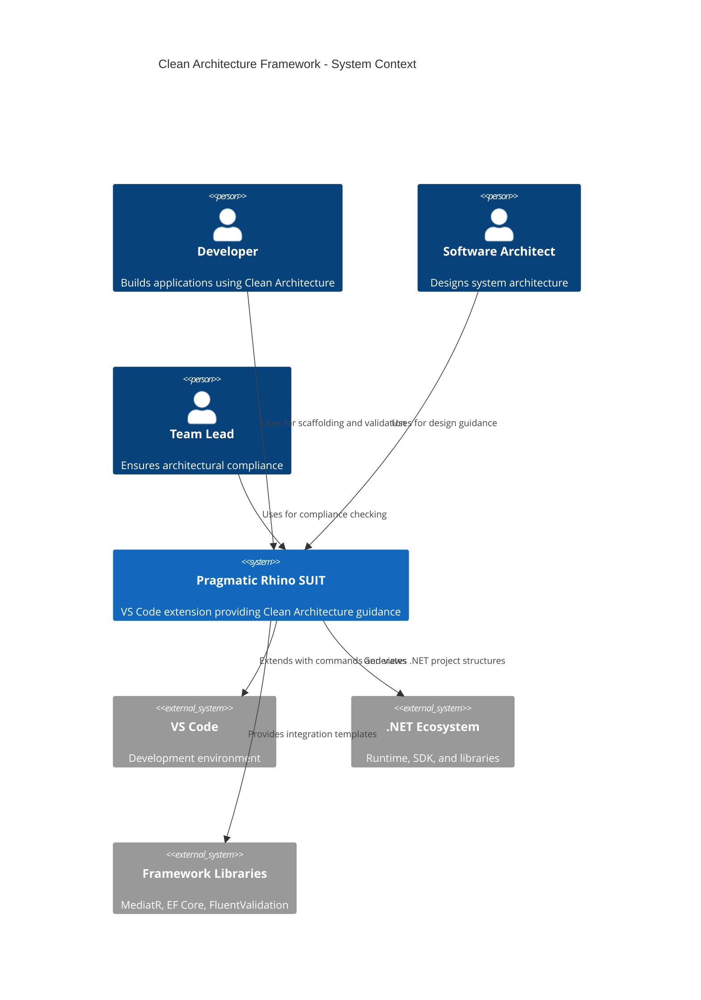
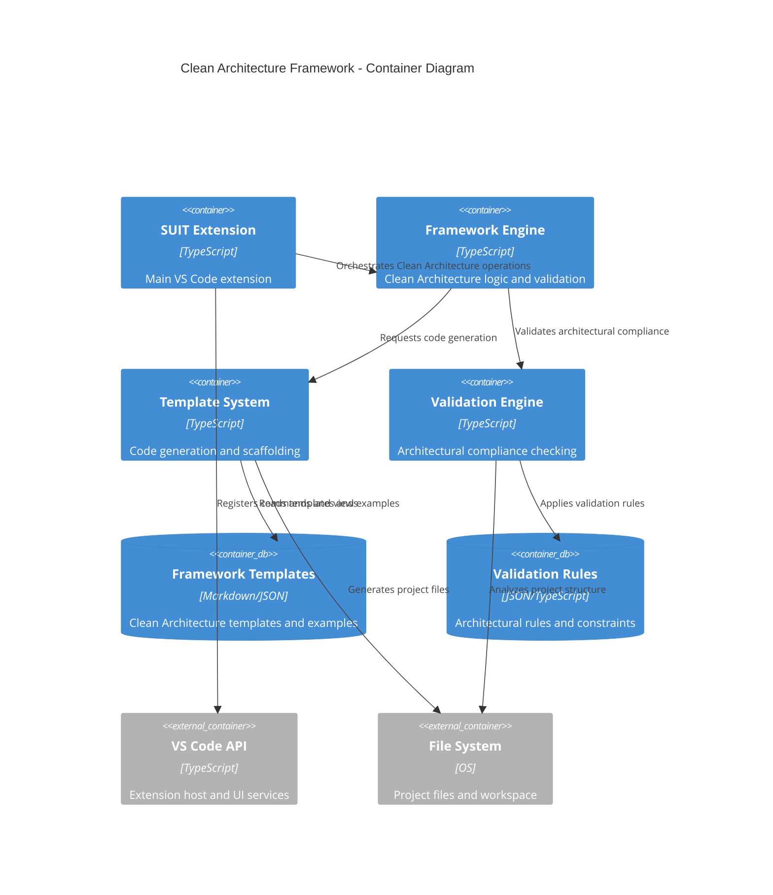
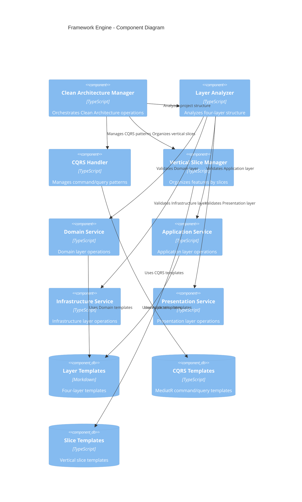

# Design Document

## Overview

This design implements Milan Jovanovic's pragmatic Clean Architecture framework for the Pragmatic Rhino SUIT VS Code extension. The framework provides comprehensive guidance, templates, and validation for building maintainable .NET applications using Clean Architecture principles with modern practices including CQRS, vertical slices, and flexible rule application.

The design focuses on practical implementation over dogmatic adherence, allowing developers to break architectural rules when it simplifies the solution while maintaining the core benefits of separation of concerns, testability, and maintainability.

## Architecture

### System Context



### Container Architecture



## Components and Interfaces

### Framework Engine Component



### Template System Architecture

The template system provides Milan's specific folder structures and code patterns:

**Domain Layer Templates:**
- Entities with encapsulation and business rules
- Value Objects with immutability and validation
- Aggregates with consistency boundaries
- Domain Events for cross-aggregate communication
- Repository interfaces following DDD patterns

**Application Layer Templates:**
- CQRS Commands and Queries with MediatR
- Command/Query Handlers with business logic
- Pipeline Behaviors for cross-cutting concerns
- Entity-based folder organization
- FluentValidation integration

**Infrastructure Layer Templates:**
- EF Core DbContext and configurations
- Repository implementations
- External service integrations
- Background job implementations
- Persistence layer abstractions

**Presentation Layer Templates:**
- API Controllers with proper dependency injection
- Middleware for cross-cutting concerns
- Configuration and startup patterns
- Error handling and validation

## Data Models

### Clean Architecture Configuration

```typescript
interface CleanArchitectureConfig {
  version: string;
  approach: 'milan-jovanovic' | 'uncle-bob';
  layers: LayerConfiguration[];
  cqrs: CQRSConfiguration;
  verticalSlices: VerticalSliceConfiguration;
  techStack: TechStackConfiguration;
  pragmaticRules: PragmaticRuleConfiguration[];
}

interface LayerConfiguration {
  name: 'Domain' | 'Application' | 'Infrastructure' | 'Presentation';
  folderStructure: FolderStructure;
  dependencies: string[];
  validationRules: ValidationRule[];
}

interface CQRSConfiguration {
  enabled: boolean;
  mediatorLibrary: 'MediatR' | 'custom';
  commandPattern: CommandPattern;
  queryPattern: QueryPattern;
  pipelineBehaviors: PipelineBehavior[];
}

interface VerticalSliceConfiguration {
  enabled: boolean;
  organizationPattern: 'by-entity' | 'by-feature';
  reprPattern: boolean;
  couplingRules: CouplingRule[];
}

interface TechStackConfiguration {
  dataAccess: 'EntityFramework' | 'Dapper' | 'both';
  validation: 'FluentValidation' | 'DataAnnotations';
  logging: 'Serilog' | 'NLog' | 'built-in';
  authentication: 'JWT' | 'Identity' | 'custom';
  containerization: 'Docker' | 'none';
}
```

### Project Structure Model

```typescript
interface ProjectStructure {
  rootPath: string;
  layers: ProjectLayer[];
  verticalSlices: VerticalSlice[];
  dependencies: DependencyGraph;
  complianceScore: ComplianceMetrics;
}

interface ProjectLayer {
  name: string;
  path: string;
  folders: FolderStructure[];
  files: ProjectFile[];
  dependencies: LayerDependency[];
  violations: ArchitecturalViolation[];
}

interface VerticalSlice {
  name: string;
  path: string;
  components: SliceComponent[];
  coupling: CouplingMetrics;
  cohesion: CohesionMetrics;
}

interface SliceComponent {
  type: 'Command' | 'Query' | 'Handler' | 'Validator' | 'Response';
  filePath: string;
  dependencies: string[];
}
```

### Validation Rule Model

```typescript
interface ValidationRule {
  id: string;
  name: string;
  description: string;
  layer: string;
  severity: 'error' | 'warning' | 'info';
  pragmaticOverride: boolean;
  checkFunction: (project: ProjectStructure) => ValidationResult[];
}

interface ValidationResult {
  ruleId: string;
  severity: 'error' | 'warning' | 'info';
  message: string;
  filePath?: string;
  line?: number;
  column?: number;
  suggestedFix?: string;
}

interface PragmaticOverride {
  ruleId: string;
  reason: string;
  approvedBy: string;
  expirationDate?: Date;
  alternatives: string[];
}
```

## Error Handling

### Validation Error Handling

```typescript
class ArchitecturalViolationError extends Error {
  constructor(
    public violations: ValidationResult[],
    public layer: string,
    public pragmaticOverrides: PragmaticOverride[]
  ) {
    super(`Architectural violations found in ${layer} layer`);
  }
}

class TemplateGenerationError extends Error {
  constructor(
    public templateName: string,
    public targetPath: string,
    public cause: Error
  ) {
    super(`Failed to generate template ${templateName} at ${targetPath}`);
  }
}

class DependencyViolationError extends Error {
  constructor(
    public fromLayer: string,
    public toLayer: string,
    public violationType: 'forbidden' | 'circular' | 'missing'
  ) {
    super(`Dependency violation: ${fromLayer} -> ${toLayer} (${violationType})`);
  }
}
```

### Error Recovery Strategies

1. **Validation Failures**: Provide detailed diagnostics with suggested fixes
2. **Template Generation Failures**: Offer alternative templates or manual guidance
3. **Dependency Violations**: Show dependency graph and suggest refactoring
4. **Pragmatic Overrides**: Allow temporary rule violations with documentation

## Testing Strategy

### Unit Testing Approach

**Framework Engine Tests:**
- Clean Architecture Manager orchestration
- Layer analysis and validation logic
- CQRS pattern detection and validation
- Vertical slice organization algorithms

**Template System Tests:**
- Template loading and parsing
- Code generation accuracy
- File system operations
- Template variable substitution

**Validation Engine Tests:**
- Rule execution and result aggregation
- Pragmatic override handling
- Dependency graph analysis
- Compliance scoring algorithms

### Integration Testing Approach

**VS Code Extension Integration:**
- Command registration and execution
- Tree view provider functionality
- Diagnostic provider integration
- Webview communication

**File System Integration:**
- Project structure analysis
- Template file generation
- Configuration file management
- Workspace change detection

### BDD Testing Scenarios

```gherkin
Feature: Clean Architecture Project Scaffolding
  As a developer
  I want to scaffold a new Clean Architecture project
  So that I can start with Milan's recommended structure

  Scenario: Generate four-layer project structure
    Given I have an empty workspace
    When I execute "Clean Architecture: New Project" command
    And I select "Milan Jovanovic" approach
    Then I should see Domain layer with proper folder structure
    And I should see Application layer with CQRS organization
    And I should see Infrastructure layer with EF Core setup
    And I should see Presentation layer with API controllers

  Scenario: Validate architectural compliance
    Given I have a Clean Architecture project
    When I modify a file to violate dependency rules
    Then I should see validation errors in the Problems panel
    And I should see suggested fixes for the violations
    And I should have option to add pragmatic override

  Scenario: Generate vertical slice
    Given I have a Clean Architecture project
    When I execute "Clean Architecture: Add Feature" command
    And I enter feature name "UserManagement"
    Then I should see Commands folder with templates
    And I should see Queries folder with templates
    And I should see Events folder with templates
    And all files should follow REPR pattern
```

## Implementation Considerations

### Performance Optimization

1. **Lazy Loading**: Load templates and rules on-demand
2. **Caching**: Cache parsed project structures and validation results
3. **Incremental Analysis**: Only re-analyze changed files
4. **Background Processing**: Run validation in background threads

### Extensibility Design

1. **Plugin Architecture**: Allow custom validation rules and templates
2. **Configuration Override**: Support team-specific architectural decisions
3. **Template Customization**: Enable custom template creation and sharing
4. **Integration Points**: Provide APIs for other extensions

### Pragmatic Flexibility Implementation

1. **Rule Override System**: Allow temporary or permanent rule violations
2. **Contextual Suggestions**: Provide alternatives when rules are too restrictive
3. **Gradual Adoption**: Support incremental migration to Clean Architecture
4. **Team Customization**: Enable team-specific architectural guidelines

## Technology Decisions

### Architecture Decision Records

**ADR-001: Milan Jovanovic's Approach Over Uncle Bob's**
- **Status**: Accepted
- **Context**: Need to choose between original Clean Architecture and modern pragmatic approach
- **Decision**: Use Milan Jovanovic's four-layer approach with CQRS and vertical slices
- **Consequences**: More practical for modern .NET development, better developer experience

**ADR-002: MediatR for CQRS Implementation**
- **Status**: Accepted  
- **Context**: Need consistent CQRS pattern implementation
- **Decision**: Use MediatR library for command/query handling with pipeline behaviors
- **Consequences**: Industry standard, excellent tooling support, clear separation of concerns

**ADR-003: Entity-Based Application Layer Organization**
- **Status**: Accepted
- **Context**: Need to organize application layer use cases
- **Decision**: Organize by entity with Commands/Queries/Events subfolders
- **Consequences**: High cohesion within entity boundaries, clear feature organization

**ADR-004: Pragmatic Rule Override System**
- **Status**: Accepted
- **Context**: Need flexibility to break architectural rules when beneficial
- **Decision**: Implement override system with documentation and approval workflow
- **Consequences**: Prevents dogmatic adherence while maintaining architectural awareness