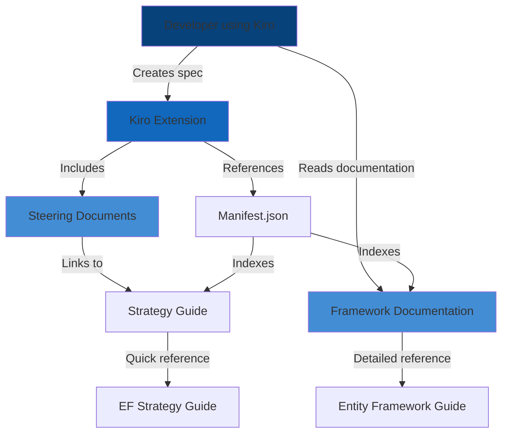
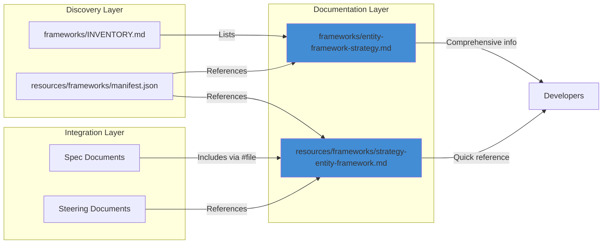

# Design Document: Entity Framework Strategy

## Overview

This design outlines the creation of comprehensive Entity Framework documentation for the Pragmatic Rhino SUIT extension. The documentation will provide developers with best practices, patterns, and guidance for implementing data access layers using Entity Framework Core and Entity Framework 6.

The solution consists of four main components:
1. A detailed framework guide (`frameworks/entity-framework-strategy.md`)
2. An updated inventory file (`frameworks/INVENTORY.md`)
3. A compact strategy guide for steering (`resources/frameworks/strategy-entity-framework.md`)
4. An updated manifest configuration (`resources/frameworks/manifest.json`)

## Architecture

### System Context



### Component Architecture



## Components and Interfaces

### 1. Detailed Framework Guide

**File:** `frameworks/entity-framework-strategy.md`

**Purpose:** Comprehensive reference documentation for Entity Framework

**Structure:**
- Overview and introduction
- EF Core vs EF6 comparison
- DbContext configuration and lifecycle
- Entity configuration (Fluent API, Data Annotations)
- Relationships and navigation properties
- Migrations and database schema management
- Querying patterns (LINQ, raw SQL, stored procedures)
- Performance optimization (eager loading, lazy loading, explicit loading)
- Change tracking and state management
- Transaction management
- Testing strategies (in-memory provider, SQLite, integration tests)
- Integration with DDD patterns
- Security considerations
- Anti-patterns and common mistakes
- Code examples in C#

**Content Guidelines:**
- Follow structure of existing framework guides (TDD, BDD, etc.)
- Include practical code examples for each pattern
- Reference related frameworks (DDD, Clean Architecture, testing)
- Provide "why" explanations, not just "how"
- Cover both EF Core (modern) and EF6 (legacy) where relevant
- Include performance benchmarks and optimization techniques

### 2. Framework Inventory Update

**File:** `frameworks/INVENTORY.md`

**Purpose:** Catalog Entity Framework in the framework inventory

**Changes Required:**
- Add entry under "Databases & Data Storage" section
- Entry format: `- **Entity Framework** - Microsoft's ORM for .NET applications`
- Maintain alphabetical order within section
- Ensure consistent formatting with existing entries

**Integration:**
- Links to detailed framework guide
- Categorized appropriately for discovery
- Searchable by developers browsing frameworks

### 3. Compact Strategy Guide

**File:** `resources/frameworks/strategy-entity-framework.md`

**Purpose:** Quick reference guide for automatic inclusion in specs

**Structure (following existing strategy guide pattern):**

```markdown
---
inclusion: always
category: Database
framework: Entity Framework
description: ORM patterns for .NET data access with performance and security guidance
tags: [entity-framework, ef-core, orm, data-access, database, dotnet]
---

# Entity Framework Strategy

## Purpose
[Concise purpose statement]

## Key Concepts
[Bullet list of core concepts]

## Best Practices
[Bullet list of key practices]

## Implementation Patterns
[Code snippets for common scenarios]
- DbContext configuration
- Entity configuration
- Repository pattern
- Query optimization
- Migration workflow

## When to Use
[Decision criteria]

## Anti-Patterns
[Common mistakes to avoid]

## Integration Points
[Links to related frameworks]

## Quick Reference
[File locations and key commands]
```

**Content Guidelines:**
- Maximum 2-4 pages
- Focus on most critical patterns
- Use tables for quick scanning
- Minimal but complete code examples
- Clear section headers
- Suitable for automatic inclusion via file references

### 4. Manifest Configuration Update

**File:** `resources/frameworks/manifest.json`

**Purpose:** Register Entity Framework in the extension's framework catalog

**Changes Required:**

```json
{
  "id": "entity-framework-strategy",
  "name": "Entity Framework Strategy",
  "description": "ORM patterns for .NET data access with DbContext, entities, migrations, and performance optimization",
  "category": "database",
  "version": "1.0.0",
  "fileName": "strategy-entity-framework.md",
  "dependencies": ["ddd-strategy", "dotnet-strategy"]
}
```

**Integration:**
- Add to frameworks array in manifest.json
- Maintain valid JSON structure
- Include appropriate keywords/tags
- Reference dependencies (DDD, .NET best practices)
- Follow existing entry format

## Data Models

### Framework Entry Model

```typescript
interface FrameworkEntry {
  id: string;                    // "entity-framework-strategy"
  name: string;                  // "Entity Framework Strategy"
  description: string;           // Brief description
  category: string;              // "database"
  version: string;               // "1.0.0"
  fileName: string;              // "strategy-entity-framework.md"
  dependencies: string[];        // ["ddd-strategy", "dotnet-strategy"]
}
```

### Document Structure Model

```typescript
interface FrameworkDocument {
  frontMatter: {
    inclusion: 'always' | 'manual' | 'fileMatch';
    category: string;
    framework: string;
    description: string;
    tags: string[];
  };
  sections: {
    purpose: string;
    keyConcepts: string[];
    bestPractices: string[];
    implementationPatterns: CodeExample[];
    whenToUse: string;
    antiPatterns: string[];
    integrationPoints: string[];
    quickReference: string;
  };
}

interface CodeExample {
  title: string;
  language: string;
  code: string;
  explanation: string;
}
```

## Error Handling

### Validation Errors

**Manifest JSON Validation:**
- Invalid JSON syntax → Provide clear error message with line number
- Missing required fields → List missing fields
- Invalid category → Suggest valid categories
- Duplicate IDs → Identify conflicting entries

**File Creation Errors:**
- File already exists → Prompt for overwrite confirmation
- Directory doesn't exist → Create directory structure
- Permission denied → Provide clear error message

**Content Validation:**
- Missing sections → Warn about incomplete documentation
- Broken links → Identify and list broken references
- Invalid code examples → Syntax validation for C# code blocks

### Recovery Strategies

- Backup existing files before modification
- Validate JSON before writing
- Atomic file operations (write to temp, then rename)
- Rollback capability for failed operations

## Testing Strategy

### Unit Testing

**Test Coverage:**
- Markdown file generation with correct structure
- JSON manifest updates maintain validity
- Inventory updates maintain alphabetical order
- Front matter parsing and validation
- Code example syntax validation

**Test Scenarios:**
- Create all files successfully
- Update existing inventory correctly
- Maintain JSON validity in manifest
- Handle file conflicts gracefully
- Validate front matter format

### Integration Testing

**Test Scenarios:**
- End-to-end file creation workflow
- Manifest integration with extension
- Strategy guide inclusion in specs
- Cross-references between documents work correctly
- Extension can discover and load framework

### Content Quality Testing

**Validation:**
- All code examples compile and run
- Links to related frameworks are valid
- Markdown renders correctly
- Front matter is parseable
- Examples follow .NET best practices

## Performance Considerations

### File Operations

- Use async file I/O for all operations
- Batch file writes where possible
- Cache parsed manifest in memory
- Lazy load detailed framework guides

### Content Generation

- Template-based generation for consistency
- Reusable code example snippets
- Efficient markdown parsing
- Minimal file system operations

## Security Considerations

### File System Security

- Validate all file paths to prevent directory traversal
- Ensure files are created within workspace boundaries
- Proper file permissions on created files
- No execution of user-provided code

### Content Security

- Sanitize any user input in documentation
- No hardcoded credentials in examples
- Security best practices in code examples
- Proper SQL injection prevention examples

## Integration with Existing Frameworks

### Domain-Driven Design Integration

**Entity Configuration:**
- Map DDD Entities to EF entities
- Configure Value Objects as owned types
- Implement Aggregate boundaries with navigation properties
- Use EF conventions aligned with DDD patterns

**Repository Pattern:**
- EF DbContext as Unit of Work
- Repository implementations using DbSet
- Aggregate root repositories
- Query specifications pattern

### Clean Architecture Integration

**Layering:**
- Domain layer: Entity definitions (POCOs)
- Infrastructure layer: DbContext, configurations, repositories
- Application layer: Use cases consuming repositories
- Presentation layer: No direct EF dependencies

### Testing Strategy Integration

**TDD with Entity Framework:**
- In-memory provider for fast unit tests
- SQLite for integration tests
- Test containers for full database tests
- Repository pattern enables mocking

**BDD Scenarios:**
- Given-When-Then for data access scenarios
- Feature files for complex queries
- Step definitions using test database

## Architecture Decision Records

### ADR-001: EF Core Focus with EF6 Coverage

**Status:** Accepted

**Context:**
- EF Core is the modern, cross-platform ORM
- EF6 is still widely used in legacy applications
- Developers need guidance for both

**Decision:**
- Primary focus on EF Core patterns and best practices
- Include EF6 coverage for migration scenarios
- Clearly mark EF6-specific content
- Provide migration guidance from EF6 to EF Core

**Consequences:**
- Comprehensive coverage for modern development
- Support for legacy application maintenance
- Clear migration path for teams upgrading

### ADR-002: Repository Pattern Inclusion

**Status:** Accepted

**Context:**
- Repository pattern is common in enterprise applications
- Some argue DbContext is already a repository
- DDD practitioners expect repository pattern

**Decision:**
- Include repository pattern as recommended practice
- Show both direct DbContext usage and repository pattern
- Explain trade-offs and when to use each approach
- Align with DDD framework guidance

**Consequences:**
- Flexibility for different architectural styles
- Clear guidance on abstraction levels
- Integration with DDD patterns

### ADR-003: Testing Strategy Emphasis

**Status:** Accepted

**Context:**
- Data access code is critical and error-prone
- Testing database code is challenging
- Multiple testing approaches exist (in-memory, SQLite, containers)

**Decision:**
- Provide comprehensive testing guidance
- Cover all testing approaches with pros/cons
- Integrate with TDD/BDD strategy guide
- Include practical examples for each approach

**Consequences:**
- Developers can choose appropriate testing strategy
- Clear integration with existing testing frameworks
- Improved data access code quality

## Implementation Approach

### Phase 1: Content Research and Structure

1. Review existing Entity Framework documentation
2. Analyze common patterns in enterprise applications
3. Identify key concepts and best practices
4. Create detailed outline for framework guide
5. Define code examples to include

### Phase 2: Detailed Framework Guide Creation

1. Write comprehensive framework guide
2. Include code examples for all patterns
3. Add performance optimization guidance
4. Document security considerations
5. Create integration examples with DDD

### Phase 3: Strategy Guide Creation

1. Distill framework guide to essential patterns
2. Create compact strategy guide
3. Add front matter for automatic inclusion
4. Validate code examples
5. Ensure quick reference format

### Phase 4: Integration and Updates

1. Update framework inventory
2. Update manifest.json
3. Validate JSON structure
4. Test file references
5. Verify extension integration

### Phase 5: Quality Assurance

1. Review all code examples
2. Validate cross-references
3. Test markdown rendering
4. Verify integration with other frameworks
5. Conduct peer review

## Dependencies

### External Dependencies

- Existing framework guides (TDD, BDD, DDD, .NET)
- Manifest.json structure
- Inventory.md format
- Strategy guide template

### Internal Dependencies

- Markdown rendering in VS Code
- File system access
- JSON parsing
- Extension framework discovery

## Deployment Considerations

### File Locations

- `frameworks/entity-framework-strategy.md` - Detailed guide
- `frameworks/INVENTORY.md` - Updated inventory
- `resources/frameworks/strategy-entity-framework.md` - Strategy guide
- `resources/frameworks/manifest.json` - Updated manifest

### Version Control

- All files tracked in Git
- Commit message follows conventional commits
- Include documentation updates in changelog
- Tag release if part of extension update

### Documentation Updates

- Update README if needed
- Add to framework list in documentation
- Update any framework selection guides
- Announce in changelog

## Success Criteria

### Functional Requirements

- ✅ Detailed framework guide created with comprehensive coverage
- ✅ Inventory updated with Entity Framework entry
- ✅ Strategy guide created following template
- ✅ Manifest updated with valid JSON
- ✅ All code examples are valid and compile
- ✅ Cross-references work correctly

### Quality Requirements

- ✅ Documentation follows existing style and structure
- ✅ Code examples follow .NET best practices
- ✅ Integration with DDD and testing frameworks
- ✅ Clear explanations of "why" not just "how"
- ✅ Anti-patterns documented with solutions
- ✅ Security considerations addressed

### Integration Requirements

- ✅ Strategy guide can be included in specs
- ✅ Extension can discover framework
- ✅ Links to related frameworks work
- ✅ Manifest remains valid JSON
- ✅ Inventory maintains proper format

## Future Enhancements

### Potential Additions

- EF Core 9.0+ features when released
- Advanced performance tuning guide
- Multi-tenancy patterns
- Temporal tables and audit logging
- GraphQL integration patterns
- CQRS with EF Core
- Event sourcing patterns

### Maintenance Plan

- Review and update with new EF Core releases
- Add community-contributed patterns
- Update code examples for latest .NET versions
- Expand integration examples
- Add video tutorials or diagrams
