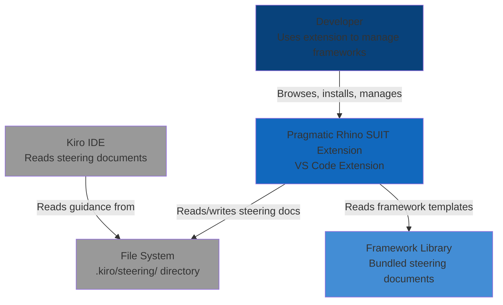
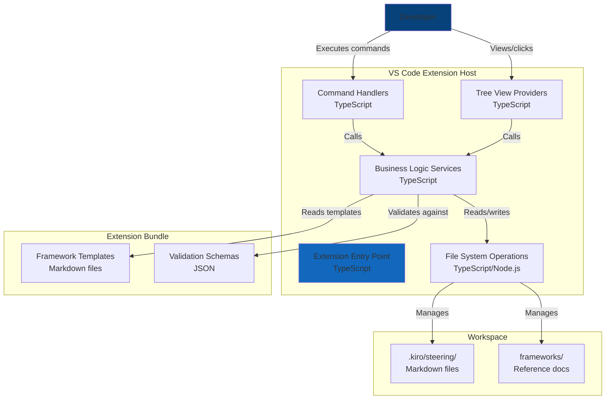

# Design Document: Framework Steering Management

## Overview

The Framework Steering Management feature is implemented as a VS Code extension that provides a curated library of framework-based steering documents. The extension acts as a package manager for Kiro guidance, allowing developers to browse, install, update, and manage steering documents that influence how Kiro creates specs, designs architectures, and implements features.

The design follows VS Code extension best practices with a clear separation between UI (commands, tree views, webviews), business logic (services), and data access (file system operations). The extension is activated only in Kiro workspaces (presence of `.kiro/` directory) to avoid interfering with non-Kiro projects.

## Architecture

### System Context (C4)



### Container Diagram (C4)



## Components and Interfaces

### Extension Entry Point (`extension.ts`)

**Responsibility:** Extension lifecycle management, activation, and registration

**Key Functions:**
- `activate(context: ExtensionContext): void` - Called when extension activates
- `deactivate(): void` - Called when extension deactivates
- `registerCommands(context: ExtensionContext): void` - Register all commands
- `registerTreeViews(context: ExtensionContext): void` - Register tree view providers
- `checkWorkspaceActivation(): boolean` - Verify `.kiro/` directory exists

**Activation Events:**
- `workspaceContains:.kiro/` - Activate when `.kiro/` folder detected
- `onCommand:agentic-reviewer.initializeWorkspace` - Always available for initialization

### Command Handlers (`commands/`)

#### `framework-commands.ts`

**Responsibility:** Handle framework browsing, installation, and updates

**Commands:**
- `agentic-reviewer.browseFrameworks` - Show framework quick pick
- `agentic-reviewer.installFramework` - Install selected framework
- `agentic-reviewer.updateFramework` - Update specific framework
- `agentic-reviewer.updateAllFrameworks` - Update all outdated frameworks
- `agentic-reviewer.removeFramework` - Remove installed framework

**Interface:**
```typescript
interface FrameworkCommand {
  execute(args?: any): Promise<void>;
}

interface FrameworkQuickPickItem extends QuickPickItem {
  frameworkId: string;
  category: FrameworkCategory;
  version: string;
  installed: boolean;
}
```

#### `steering-commands.ts`

**Responsibility:** Handle custom steering document creation and management

**Commands:**
- `agentic-reviewer.createCustomSteering` - Create new custom steering doc
- `agentic-reviewer.validateSteering` - Validate steering document
- `agentic-reviewer.exportSteering` - Export custom steering to library

**Interface:**
```typescript
interface SteeringCommand {
  execute(uri?: Uri): Promise<void>;
}
```

#### `workspace-commands.ts`

**Responsibility:** Handle workspace initialization

**Commands:**
- `agentic-reviewer.initializeWorkspace` - Initialize `.kiro/` structure
- `agentic-reviewer.searchFrameworks` - Full-text search across frameworks

### Tree View Providers (`providers/`)

#### `steering-tree-provider.ts`

**Responsibility:** Display installed steering documents in tree view

**Interface:**
```typescript
interface SteeringTreeProvider implements TreeDataProvider<SteeringItem> {
  getTreeItem(element: SteeringItem): TreeItem;
  getChildren(element?: SteeringItem): ProviderResult<SteeringItem[]>;
  refresh(): void;
}

interface SteeringItem {
  label: string;
  resourceUri: Uri;
  category: SteeringCategory;
  frameworkId?: string;
  version?: string;
  isCustom: boolean;
  contextValue: string; // For context menu
}

enum SteeringCategory {
  Product = 'product',
  Technical = 'technical',
  Strategy = 'strategy',
  Structure = 'structure',
  Custom = 'custom'
}
```

**Tree Structure:**
```
Framework Steering
├─ Strategies (Installed)
│  ├─ strategy-tdd-bdd.md
│  ├─ strategy-security.md
│  ├─ strategy-c4-model.md
│  ├─ strategy-azure.md
│  ├─ strategy-devops.md
│  ├─ strategy-iac.md
│  ├─ strategy-4d-safe.md
│  └─ strategy-ea.md
├─ Project (Team-Created)
│  ├─ product.md
│  ├─ tech.md
│  └─ structure.md
└─ Custom (Team-Created)
   └─ custom-team-standards.md
```

**Note:** Extension only manages "Strategies (Installed)" category. Other categories are shown for visibility but not managed by extension.

### Business Logic Services (`services/`)

#### `framework-manager.ts`

**Responsibility:** Core framework management logic

**Interface:**
```typescript
interface FrameworkManager {
  // Discovery
  listAvailableFrameworks(): Promise<Framework[]>;
  getFrameworkById(id: string): Promise<Framework | undefined>;
  searchFrameworks(query: string): Promise<Framework[]>;
  
  // Installation
  installFramework(frameworkId: string, options?: InstallOptions): Promise<void>;
  isFrameworkInstalled(frameworkId: string): Promise<boolean>;
  
  // Updates
  checkForUpdates(): Promise<FrameworkUpdate[]>;
  updateFramework(frameworkId: string): Promise<void>;
  updateAllFrameworks(): Promise<void>;
  
  // Removal
  removeFramework(frameworkId: string): Promise<void>;
}

interface Framework {
  id: string;
  name: string;
  description: string;
  category: FrameworkCategory;
  version: string;
  fileName: string; // e.g., 'tech.md', 'strategy-tdd-bdd.md'
  content: string;
  dependencies?: string[]; // Other frameworks this depends on
}

enum FrameworkCategory {
  Architecture = 'architecture',
  Testing = 'testing',
  Security = 'security',
  DevOps = 'devops',
  Cloud = 'cloud',
  WorkManagement = 'work-management'
}

interface InstallOptions {
  overwrite?: boolean;
  merge?: boolean;
  backup?: boolean;
}

interface FrameworkUpdate {
  frameworkId: string;
  currentVersion: string;
  latestVersion: string;
  changes: string[];
}
```

#### `steering-validator.ts`

**Responsibility:** Validate steering documents against quality standards

**Interface:**
```typescript
interface SteeringValidator {
  validate(document: TextDocument): Promise<ValidationResult>;
  validateStructure(content: string): ValidationIssue[];
  validateContent(content: string): ValidationIssue[];
  validateFormatting(content: string): ValidationIssue[];
}

interface ValidationResult {
  isValid: boolean;
  issues: ValidationIssue[];
  warnings: ValidationIssue[];
}

interface ValidationIssue {
  severity: DiagnosticSeverity;
  message: string;
  range: Range;
  code?: string;
  quickFix?: CodeAction;
}
```

**Validation Rules:**
1. Required sections: Purpose, Key Concepts, Best Practices, Summary
2. Actionable guidance (not just theory)
3. Examples provided for key concepts
4. Consistent formatting (proper headings, lists, code blocks)
5. No broken internal links
6. Proper markdown syntax

#### `template-engine.ts`

**Responsibility:** Process templates with variable substitution

**Interface:**
```typescript
interface TemplateEngine {
  render(template: string, variables: TemplateVariables): string;
  getAvailableVariables(): string[];
}

interface TemplateVariables {
  [key: string]: string;
  'feature-name'?: string;
  'date'?: string;
  'author'?: string;
  'project-name'?: string;
}
```

**Supported Variables:**
- `{{feature-name}}` - Feature name in kebab-case
- `{{date}}` - Current date (ISO format)
- `{{author}}` - Git user name or system user
- `{{project-name}}` - Workspace folder name

### File System Operations (`utils/file-system.ts`)

**Responsibility:** Abstract file system operations

**Interface:**
```typescript
interface FileSystemOperations {
  // Directory operations
  ensureDirectory(path: string): Promise<void>;
  directoryExists(path: string): Promise<boolean>;
  listFiles(directory: string, pattern?: string): Promise<string[]>;
  
  // File operations
  readFile(path: string): Promise<string>;
  writeFile(path: string, content: string): Promise<void>;
  copyFile(source: string, destination: string): Promise<void>;
  deleteFile(path: string): Promise<void>;
  fileExists(path: string): Promise<boolean>;
  
  // Workspace operations
  getWorkspacePath(): string | undefined;
  getKiroPath(): string | undefined;
  getSteeringPath(): string;
  getFrameworksPath(): string;
}
```

## Data Models

### Framework Library Structure

The extension bundles framework strategy templates in its resources:

```
extension/
├─ resources/
│  ├─ frameworks/
│  │  ├─ manifest.json               # Framework catalog
│  │  ├─ strategy-tdd-bdd.md         # Testing strategy
│  │  ├─ strategy-security.md        # SABSA security
│  │  ├─ strategy-c4-model.md        # Architecture diagrams
│  │  ├─ strategy-azure.md           # Azure hosting
│  │  ├─ strategy-devops.md          # CI/CD practices
│  │  ├─ strategy-iac.md             # Pulumi IaC
│  │  ├─ strategy-4d-safe.md         # Work management
│  │  └─ strategy-ea.md              # Enterprise architecture
│  └─ schemas/
│     └─ steering-schema.json        # Validation schema
```

**Note:** Project-specific files (`product.md`, `tech.md`, `structure.md`) are NOT included as they are unique to each project and should be created by the team.

### Framework Manifest (`manifest.json`)

```json
{
  "version": "1.0.0",
  "frameworks": [
    {
      "id": "tdd-bdd-strategy",
      "name": "TDD/BDD Testing Strategy",
      "description": "Test-driven and behavior-driven development practices with testing-plan.md requirements",
      "category": "testing",
      "version": "1.0.0",
      "fileName": "strategy-tdd-bdd.md",
      "dependencies": []
    },
    {
      "id": "security-strategy",
      "name": "SABSA Security Strategy",
      "description": "Security architecture and threat modeling practices",
      "category": "security",
      "version": "1.0.0",
      "fileName": "strategy-security.md",
      "dependencies": []
    },
    {
      "id": "c4-model-strategy",
      "name": "C4 Model Architecture",
      "description": "When and how to use C4 diagrams in specs",
      "category": "architecture",
      "version": "1.0.0",
      "fileName": "strategy-c4-model.md",
      "dependencies": []
    },
    {
      "id": "azure-strategy",
      "name": "Azure Hosting Strategy",
      "description": "Azure service selection and hosting patterns",
      "category": "cloud",
      "version": "1.0.0",
      "fileName": "strategy-azure.md",
      "dependencies": []
    },
    {
      "id": "devops-strategy",
      "name": "DevOps CI/CD Strategy",
      "description": "Continuous integration and deployment practices",
      "category": "devops",
      "version": "1.0.0",
      "fileName": "strategy-devops.md",
      "dependencies": []
    },
    {
      "id": "iac-strategy",
      "name": "Infrastructure as Code (Pulumi)",
      "description": "IaC patterns and best practices with Pulumi",
      "category": "infrastructure",
      "version": "1.0.0",
      "fileName": "strategy-iac.md",
      "dependencies": []
    },
    {
      "id": "4d-safe-strategy",
      "name": "4D SDLC + SAFe Work Management",
      "description": "Work management combining 4D phases with SAFe practices",
      "category": "work-management",
      "version": "1.0.0",
      "fileName": "strategy-4d-safe.md",
      "dependencies": []
    },
    {
      "id": "ea-strategy",
      "name": "Enterprise Architecture (TOGAF/Zachman)",
      "description": "EA questions for product planning and feature design",
      "category": "architecture",
      "version": "1.0.0",
      "fileName": "strategy-ea.md",
      "dependencies": []
    }
  ]
}
```

### Workspace Structure

```
workspace/
├─ .kiro/
│  ├─ steering/                    # Steering documents
│  │  ├─ product.md                # Project-specific (created by team)
│  │  ├─ tech.md                   # Project-specific (created by team)
│  │  ├─ structure.md              # Project-specific (created by team)
│  │  ├─ strategy-tdd-bdd.md       # Installed from extension
│  │  ├─ strategy-security.md      # Installed from extension
│  │  ├─ strategy-c4-model.md      # Installed from extension
│  │  ├─ strategy-azure.md         # Installed from extension
│  │  ├─ strategy-devops.md        # Installed from extension
│  │  ├─ strategy-iac.md           # Installed from extension
│  │  ├─ strategy-4d-safe.md       # Installed from extension
│  │  ├─ strategy-ea.md            # Installed from extension
│  │  └─ custom-team.md            # Custom (created by team)
│  ├─ specs/                       # Feature specs (managed by Kiro)
│  ├─ settings/                    # Extension settings
│  │  └─ mcp.json
│  └─ .metadata/                   # Extension metadata
│     └─ installed-frameworks.json
├─ frameworks/                     # Framework reference docs (optional)
│  ├─ c4-model.md
│  ├─ domain-driven-design.md
│  └─ test-driven-development.md
```

**Key Distinction:**
- **Strategy files (strategy-*.md):** Reusable frameworks provided by extension
- **Project files (product.md, tech.md, structure.md):** Project-specific, created by team
- **Custom files:** Team-specific additions

### Installed Frameworks Metadata (`.kiro/.metadata/installed-frameworks.json`)

```json
{
  "frameworks": [
    {
      "id": "tdd-bdd-strategy",
      "version": "1.0.0",
      "installedAt": "2025-01-15T10:30:00Z",
      "customized": false
    },
    {
      "id": "security-strategy",
      "version": "1.0.0",
      "installedAt": "2025-01-15T10:31:00Z",
      "customized": true,
      "customizedAt": "2025-01-16T14:20:00Z"
    },
    {
      "id": "c4-model-strategy",
      "version": "1.0.0",
      "installedAt": "2025-01-15T10:32:00Z",
      "customized": false
    }
  ]
}
```

## Error Handling

### Error Categories

1. **File System Errors**
   - Directory not found
   - Permission denied
   - File already exists
   - Disk full

2. **Validation Errors**
   - Invalid steering document structure
   - Missing required sections
   - Malformed markdown

3. **Version Conflicts**
   - Customized document update conflict
   - Dependency version mismatch

4. **User Errors**
   - Invalid framework ID
   - Workspace not initialized
   - No frameworks selected

### Error Handling Strategy

**File System Errors:**
```typescript
try {
  await fileSystem.writeFile(path, content);
} catch (error) {
  if (error.code === 'ENOENT') {
    await fileSystem.ensureDirectory(dirname(path));
    await fileSystem.writeFile(path, content);
  } else if (error.code === 'EACCES') {
    window.showErrorMessage('Permission denied. Check file permissions.');
  } else {
    window.showErrorMessage(`Failed to write file: ${error.message}`);
  }
}
```

**Validation Errors:**
- Show diagnostics in editor with quick fixes
- Provide actionable error messages
- Offer to auto-fix common issues

**Version Conflicts:**
- Show diff view before overwriting
- Offer to create backup
- Allow merge with conflict markers

**User Errors:**
- Show informative error messages
- Provide guidance on how to fix
- Offer quick actions (e.g., "Initialize Workspace")

## Testing Strategy

### Unit Tests (Jest)

**Test Coverage:**
- `FrameworkManager`: Framework discovery, installation, updates, removal
- `SteeringValidator`: Validation rules, issue detection, quick fixes
- `TemplateEngine`: Variable substitution, edge cases
- `FileSystemOperations`: File/directory operations, error handling

**Test Structure:**
```typescript
describe('FrameworkManager', () => {
  describe('installFramework', () => {
    it('should install framework to .kiro/steering/', async () => {
      // Arrange
      const manager = new FrameworkManager(mockFileSystem);
      
      // Act
      await manager.installFramework('tech-standards');
      
      // Assert
      expect(mockFileSystem.writeFile).toHaveBeenCalledWith(
        expect.stringContaining('.kiro/steering/tech.md'),
        expect.any(String)
      );
    });
    
    it('should throw error if framework not found', async () => {
      // Arrange
      const manager = new FrameworkManager(mockFileSystem);
      
      // Act & Assert
      await expect(manager.installFramework('invalid-id'))
        .rejects.toThrow('Framework not found');
    });
  });
});
```

### Integration Tests (VS Code Extension Test Runner)

**Test Scenarios:**
- Extension activation in Kiro workspace
- Extension activation in non-Kiro workspace
- Command execution end-to-end
- Tree view rendering and interaction
- File system operations in real workspace

**Test Structure:**
```typescript
suite('Extension Integration Tests', () => {
  test('should activate in Kiro workspace', async () => {
    // Arrange: Create .kiro/ directory
    await workspace.fs.createDirectory(Uri.file('.kiro'));
    
    // Act: Activate extension
    const ext = extensions.getExtension('pragmatic-rhino.agentic-reviewer');
    await ext?.activate();
    
    // Assert: Extension is active
    assert.strictEqual(ext?.isActive, true);
  });
  
  test('should install framework via command', async () => {
    // Act: Execute command
    await commands.executeCommand('agentic-reviewer.installFramework', 'tech-standards');
    
    // Assert: File exists
    const fileUri = Uri.file('.kiro/steering/tech.md');
    const stat = await workspace.fs.stat(fileUri);
    assert.ok(stat.size > 0);
  });
});
```

### Manual Testing Checklist

- [ ] Browse frameworks shows all categories
- [ ] Install framework creates file in correct location
- [ ] Tree view displays installed frameworks
- [ ] Update framework detects version changes
- [ ] Validation shows diagnostics for invalid documents
- [ ] Custom steering document creation works
- [ ] Workspace initialization creates all directories
- [ ] Extension only activates in Kiro workspaces

## Performance Considerations

### Optimization Strategies

1. **Lazy Loading**
   - Load framework manifest on first use
   - Load framework content only when needed
   - Defer tree view population until visible

2. **Caching**
   - Cache framework manifest in memory
   - Cache installed frameworks metadata
   - Invalidate cache on file system changes

3. **Async Operations**
   - All file system operations are async
   - Use `Promise.all()` for parallel operations
   - Show progress indicators for long operations

4. **Efficient File Watching**
   - Watch `.kiro/steering/` for changes
   - Debounce file system events
   - Only refresh affected tree view items

### Performance Targets

- Extension activation: < 500ms
- Framework installation: < 1s
- Tree view refresh: < 200ms
- Validation: < 500ms for typical document

## Security Considerations

### Input Validation

- Validate framework IDs against manifest
- Sanitize file paths to prevent directory traversal
- Validate markdown content before writing

### File System Security

- Only write to `.kiro/` directory
- Check file permissions before writing
- Never execute user-provided content

### Content Security

- Framework templates are bundled with extension (trusted)
- Custom steering documents are user-created (untrusted)
- No remote content fetching (all bundled)

## Deployment and Distribution

### Extension Packaging

```json
{
  "name": "pragmatic-rhino-suit",
  "displayName": "Pragmatic Rhino SUIT",
  "description": "Standards-Unified Integration Toolkit - SUIT Up. Standardize. Ship It.",
  "version": "0.1.0",
  "publisher": "pragmatic-rhino",
  "engines": {
    "vscode": "^1.85.0"
  },
  "categories": ["Other"],
  "activationEvents": [
    "workspaceContains:.kiro/",
    "onCommand:agentic-reviewer.initializeWorkspace"
  ],
  "main": "./dist/extension.js",
  "contributes": {
    "commands": [...],
    "views": {...},
    "menus": {...}
  }
}
```

### Build Process

1. `npm run compile` - TypeScript compilation
2. `npm run test` - Run unit tests
3. `npm run package` - Bundle with esbuild
4. `vsce package` - Create .vsix file

### Distribution

- **Phase 1:** Manual installation (.vsix file)
- **Phase 2:** VS Code Marketplace
- **Phase 3:** Open VSX Registry (VS Code alternatives)

## Future Enhancements

### Phase 2 Features

1. **Framework Marketplace**
   - Community-contributed frameworks
   - Rating and reviews
   - Version history

2. **Framework Composer**
   - Visual editor for creating frameworks
   - Template variables UI
   - Preview before installation

3. **Team Sharing**
   - Export/import framework bundles
   - Team-specific framework repositories
   - Sync across team members

4. **AI-Powered Suggestions**
   - Suggest frameworks based on project type
   - Auto-detect missing guidance
   - Generate custom steering from examples

## Architecture Decision Records

### ADR-001: Bundle Frameworks vs Remote Fetch

**Status:** Accepted

**Context:** Frameworks can be bundled with extension or fetched from remote repository.

**Decision:** Bundle frameworks with extension.

**Consequences:**
- **Pros:** Offline support, faster installation, no network dependencies, version consistency
- **Cons:** Larger extension size, updates require extension update

**Rationale:** Kiro users often work in secure environments without internet access. Bundling ensures reliability and consistency.

### ADR-002: Markdown vs JSON for Steering Documents

**Status:** Accepted

**Context:** Steering documents can be markdown (human-readable) or JSON (machine-readable).

**Decision:** Use markdown for steering documents.

**Consequences:**
- **Pros:** Human-readable, easy to edit, supports rich formatting, Kiro already uses markdown
- **Cons:** Harder to parse programmatically, less structured

**Rationale:** Kiro reads markdown naturally. Human readability is more important than machine parsing for guidance documents.

### ADR-003: Tree View vs Webview for Framework Browser

**Status:** Accepted

**Context:** Framework browser can be tree view (native) or webview (custom UI).

**Decision:** Use tree view for installed frameworks, quick pick for browsing available frameworks.

**Consequences:**
- **Pros:** Native VS Code UI, consistent with other extensions, better performance
- **Cons:** Less flexibility for rich UI, limited styling

**Rationale:** Native UI is faster, more accessible, and consistent with VS Code patterns. Quick pick is sufficient for browsing.
