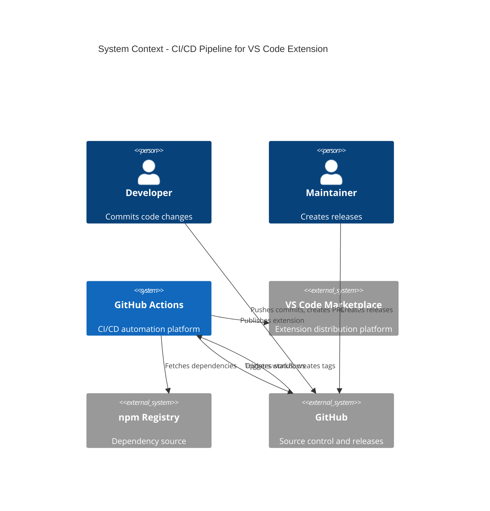
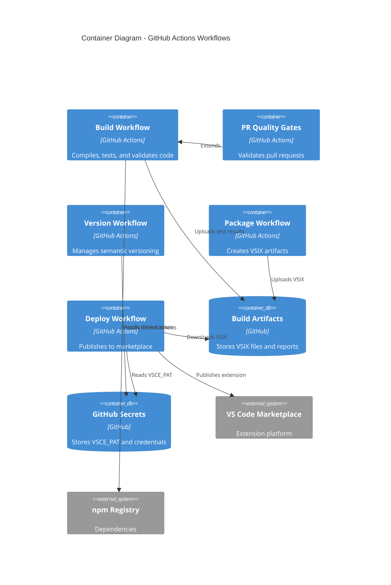
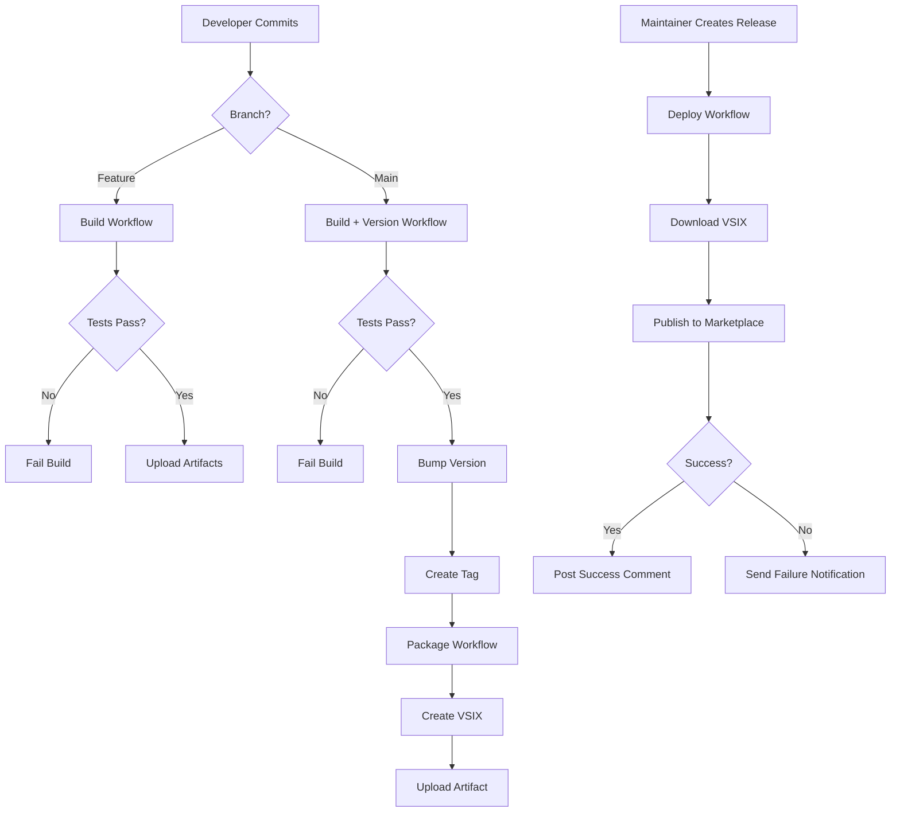
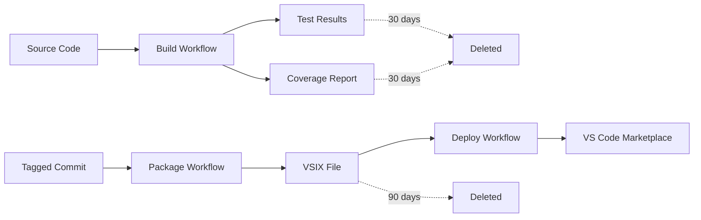

# Design Document: GitHub Actions Marketplace Deployment

## Overview

This design establishes an automated CI/CD pipeline using GitHub Actions to build, test, package, and deploy the Pragmatic Rhino SUIT VS Code extension to the Visual Studio Code Marketplace. The pipeline implements quality gates, automated versioning, and reliable deployment following DevOps best practices.

The solution provides:
- Automated build and test execution on every commit
- Pull request quality validation with coverage and security checks
- Semantic versioning based on conventional commits
- Automated VSIX packaging with validation
- Marketplace deployment triggered by GitHub releases
- Secure secrets management
- Rollback capabilities and monitoring

## Architecture

### System Context



### Container Diagram



## Components and Interfaces

### 1. Build Workflow (`build.yml`)

**Trigger:** Push to any branch, pull request events

**Responsibilities:**
- Restore npm dependencies
- Compile TypeScript code
- Run ESLint for code quality
- Execute Jest unit tests
- Generate code coverage reports
- Validate 80% coverage threshold
- Upload test results and coverage as artifacts

**Inputs:**
- Source code from repository
- `package.json` and `package-lock.json`

**Outputs:**
- Build status (success/failure)
- Test results artifact
- Coverage report artifact
- Compiled JavaScript files

**Technology Stack:**
- Node.js 18.x (LTS)
- npm for package management
- TypeScript compiler
- Jest for testing
- ESLint for linting
- GitHub Actions runners (ubuntu-latest)

### 2. PR Quality Gates Workflow (`pr-quality-gates.yml`)

**Trigger:** Pull request opened, synchronized, reopened

**Responsibilities:**
- Execute full build pipeline
- Run all unit and integration tests
- Verify code coverage meets 80% threshold
- Perform security vulnerability scanning (npm audit)
- Validate package.json version follows semantic versioning
- Block merge if any check fails
- Post status comment with results

**Inputs:**
- PR source branch
- Base branch for comparison

**Outputs:**
- PR check status (pass/fail)
- Status comment with detailed results
- Security scan report

**Quality Gates:**
- All tests pass
- Coverage ≥ 80%
- No critical or high severity vulnerabilities
- Valid semantic version in package.json

### 3. Version Management Workflow (`version.yml`)

**Trigger:** Push to main branch

**Responsibilities:**
- Analyze commit messages for version bump indicators
- Determine version increment (major/minor/patch)
- Update package.json with new version
- Generate CHANGELOG.md entries from commits
- Commit version changes back to repository
- Create and push git tag

**Inputs:**
- Commit messages since last tag
- Current version from package.json

**Outputs:**
- Updated package.json
- Updated CHANGELOG.md
- New git tag (e.g., v1.2.3)

**Versioning Rules:**
- `BREAKING CHANGE:` or `!` → Major version bump
- `feat:` → Minor version bump
- `fix:` or `chore:` → Patch version bump

**Technology:**
- Conventional Commits specification
- semantic-release or custom script
- GitHub API for tag creation

### 4. Package Workflow (`package.yml`)

**Trigger:** Tag push matching `v*.*.*` pattern

**Responsibilities:**
- Validate tag format (semantic versioning)
- Checkout tagged commit
- Install production dependencies only
- Compile TypeScript in production mode
- Execute `vsce package` command
- Validate VSIX structure and manifest
- Upload VSIX as build artifact (90-day retention)

**Inputs:**
- Git tag (e.g., v1.2.3)
- Source code at tagged commit

**Outputs:**
- VSIX file (e.g., pragmatic-rhino-suit-1.2.3.vsix)
- Package validation report

**Validation Checks:**
- VSIX file created successfully
- Manifest contains correct version
- Required files included
- No development dependencies bundled
- File size within reasonable limits

**Technology:**
- vsce (Visual Studio Code Extension Manager)
- Node.js production build

### 5. Deploy Workflow (`deploy.yml`)

**Trigger:** GitHub release published

**Responsibilities:**
- Download VSIX artifact from package workflow
- Verify VSIX file integrity
- Authenticate with VS Code Marketplace using PAT
- Publish extension using `vsce publish`
- Wait for marketplace processing confirmation
- Verify extension is live
- Post success comment on release
- Send notifications

**Inputs:**
- GitHub release event
- VSIX artifact from package workflow
- VSCE_PAT secret

**Outputs:**
- Published extension on marketplace
- Release comment with marketplace link
- Deployment status notification

**Error Handling:**
- Authentication failure → Fail with clear error
- Marketplace rejection → Fail with rejection reason
- Timeout → Fail with timeout message
- All failures trigger notifications

**Technology:**
- vsce publish command
- GitHub API for release comments
- Marketplace API for verification

### 6. Secrets Management

**Required Secrets:**

| Secret Name | Purpose | Rotation |
|-------------|---------|----------|
| `VSCE_PAT` | VS Code Marketplace Personal Access Token | 90 days |
| `GITHUB_TOKEN` | Automatic token for GitHub API (provided by Actions) | Per workflow run |

**Security Measures:**
- All secrets stored in GitHub Secrets
- Secrets masked in all workflow logs
- No secrets written to artifacts
- Secrets accessed only in necessary steps
- Failed workflow if secret exposure detected

**Documentation:**
- README includes secret setup instructions
- Secret expiration documented
- Rotation procedure documented

### 7. Rollback Workflow (`rollback.yml`)

**Trigger:** Manual workflow dispatch

**Responsibilities:**
- Allow selection of previous version tag
- Download corresponding VSIX artifact
- Republish to marketplace
- Update release notes with rollback information
- Send rollback notification

**Inputs:**
- Version tag to rollback to (manual input)

**Outputs:**
- Republished extension
- Updated release notes
- Rollback notification

**Constraints:**
- Only accessible to repository maintainers
- Requires manual approval
- Limited to versions with available artifacts

## Data Models

### Workflow Event Data

```typescript
interface PushEvent {
  ref: string;              // Branch or tag reference
  commits: Commit[];        // Array of commits
  repository: Repository;   // Repository metadata
}

interface PullRequestEvent {
  action: 'opened' | 'synchronize' | 'reopened';
  pull_request: {
    number: number;
    head: { ref: string; sha: string; };
    base: { ref: string; };
  };
}

interface ReleaseEvent {
  action: 'published';
  release: {
    tag_name: string;
    name: string;
    body: string;
  };
}
```

### Version Information

```typescript
interface VersionInfo {
  current: string;          // Current version (e.g., "1.2.3")
  next: string;             // Next version after bump
  bump: 'major' | 'minor' | 'patch';
  commits: CommitInfo[];    // Commits since last version
}

interface CommitInfo {
  sha: string;
  message: string;
  type: string;             // feat, fix, chore, etc.
  breaking: boolean;        // Has breaking change
}
```

### Package Metadata

```typescript
interface PackageMetadata {
  name: string;             // Extension name
  version: string;          // Semantic version
  publisher: string;        // Marketplace publisher
  displayName: string;      // Human-readable name
  description: string;      // Extension description
  engines: {
    vscode: string;         // VS Code version requirement
  };
}
```

### Artifact Information

```typescript
interface ArtifactInfo {
  name: string;             // Artifact name
  path: string;             // File path
  size: number;             // File size in bytes
  retention_days: number;   // Retention period
  created_at: string;       // Creation timestamp
}
```

## Error Handling

### Build Failures

**Compilation Errors:**
- Fail workflow immediately
- Display TypeScript errors in logs
- Prevent artifact creation

**Linting Errors:**
- Fail workflow if errors found
- Display ESLint violations
- Allow warnings (configurable)

**Test Failures:**
- Fail workflow on any test failure
- Upload test results for analysis
- Display failed test names in summary

**Coverage Threshold:**
- Fail if coverage < 80%
- Display coverage report
- Highlight uncovered files

### PR Quality Gate Failures

**Security Vulnerabilities:**
- Fail on critical or high severity
- Display vulnerability details
- Provide remediation guidance

**Version Validation:**
- Fail if version doesn't follow SemVer
- Fail if version not incremented
- Display expected version format

### Deployment Failures

**Authentication Errors:**
- Check VSCE_PAT validity
- Provide token renewal instructions
- Fail with clear error message

**Marketplace Rejection:**
- Display rejection reason
- Provide remediation steps
- Preserve VSIX for manual review

**Timeout Errors:**
- Retry up to 3 times with exponential backoff
- Fail after max retries
- Send notification for manual intervention

### Notification Strategy

**Failure Notifications:**
- Workflow name and run number
- Failure reason and error message
- Link to workflow run for debugging
- Suggested remediation steps

**Success Notifications:**
- Deployment confirmation
- Marketplace link
- Version number
- Build metrics (time, coverage)

## Testing Strategy

### Workflow Testing

**Local Testing:**
- Use `act` tool to run workflows locally
- Test individual jobs in isolation
- Validate workflow syntax

**Integration Testing:**
- Test on feature branches before merging
- Validate end-to-end flow
- Test with different commit message formats

**Validation Checks:**
- Workflow YAML syntax validation
- Action version compatibility
- Secret availability checks

### Quality Validation

**Pre-Deployment Checks:**
- All tests pass (unit + integration)
- Code coverage ≥ 80%
- No critical/high vulnerabilities
- Valid semantic version
- VSIX structure valid

**Post-Deployment Checks:**
- Extension visible on marketplace
- Correct version displayed
- Installation works
- Extension activates correctly

### Rollback Testing

**Rollback Scenarios:**
- Test rollback to previous version
- Verify artifact availability
- Validate marketplace update
- Confirm version downgrade works

**Frequency:**
- Test rollback procedure quarterly
- Document rollback steps
- Maintain rollback runbook

## Environment Configuration

### Development Environment

**Purpose:** Fast feedback for developers

**Configuration:**
- Trigger: Every commit to any branch
- Tests: Unit tests only
- Coverage: Report but don't enforce
- Artifacts: Test results (30-day retention)

### Pull Request Environment

**Purpose:** Quality gate before merge

**Configuration:**
- Trigger: PR opened/updated
- Tests: Unit + integration
- Coverage: Enforce 80% threshold
- Security: npm audit (fail on critical/high)
- Artifacts: Test results + coverage (30-day retention)

### Staging Environment

**Purpose:** Pre-production validation

**Configuration:**
- Trigger: Merge to main branch
- Tests: Full test suite
- Versioning: Automatic version bump
- Artifacts: None (version tag created)

### Production Environment

**Purpose:** Marketplace deployment

**Configuration:**
- Trigger: GitHub release published
- Approval: Manual (optional, configurable)
- Tests: Smoke tests post-deployment
- Artifacts: VSIX file (90-day retention)
- Monitoring: Marketplace metrics

## Deployment Architecture

### Workflow Execution Flow



### Artifact Flow



## Monitoring and Observability

### Metrics to Track

**Build Metrics:**
- Build duration (target: < 5 minutes)
- Test execution time (target: < 2 minutes)
- Code coverage percentage (target: ≥ 80%)
- Build success rate (target: ≥ 95%)

**Deployment Metrics:**
- Deployment frequency (target: multiple per week)
- Lead time (commit to production) (target: < 1 day)
- Deployment success rate (target: ≥ 98%)
- Time to rollback (target: < 15 minutes)

**Quality Metrics:**
- Test pass rate (target: 100%)
- Security vulnerabilities (target: 0 critical/high)
- Failed PR checks (track and reduce)

### Monitoring Tools

**GitHub Actions:**
- Workflow run history
- Job execution logs
- Artifact storage usage
- Secret usage audit

**VS Code Marketplace:**
- Extension install count
- Extension rating
- Version adoption rate
- Error reports

### Alerting Strategy

**Critical Alerts:**
- Deployment failure
- Security vulnerability detected
- Marketplace rejection
- Rollback required

**Warning Alerts:**
- Build duration exceeds threshold
- Coverage drops below 80%
- Test flakiness detected

**Notification Channels:**
- GitHub issue creation
- Email to maintainers
- Slack/Teams webhook (optional)

## Security Considerations

### Secrets Protection

**Storage:**
- All secrets in GitHub Secrets (encrypted at rest)
- No secrets in workflow files
- No secrets in commit history

**Access Control:**
- Secrets accessible only to authorized workflows
- Repository admins manage secrets
- Audit log for secret access

**Rotation:**
- VSCE_PAT rotated every 90 days
- Documented rotation procedure
- Automated expiration warnings

### Vulnerability Management

**Dependency Scanning:**
- npm audit on every PR
- Fail on critical/high severity
- Automated dependency updates (Dependabot)

**Code Scanning:**
- ESLint security rules enabled
- No hardcoded secrets (git-secrets)
- Regular security reviews

### Supply Chain Security

**Artifact Integrity:**
- VSIX checksum validation
- Signed commits (optional)
- Immutable artifact storage

**Dependency Pinning:**
- Lock file committed (package-lock.json)
- Exact versions in package.json
- Regular dependency audits

## Performance Optimization

### Build Performance

**Caching Strategy:**
- Cache npm dependencies between runs
- Cache TypeScript compilation output
- Cache ESLint results

**Parallelization:**
- Run linting and tests in parallel
- Use matrix strategy for multi-platform testing (if needed)

**Resource Allocation:**
- Use ubuntu-latest runners (fastest)
- Optimize test execution order
- Skip unnecessary steps on failure

### Deployment Performance

**Artifact Management:**
- Compress VSIX before upload
- Use artifact caching
- Clean up old artifacts automatically

**Marketplace Publishing:**
- Retry logic with exponential backoff
- Timeout configuration (5 minutes)
- Parallel verification checks

## Compliance and Governance

### Audit Trail

**Tracked Information:**
- All workflow executions
- Deployment history
- Version changes
- Secret access

**Retention:**
- Workflow logs: 90 days
- Artifacts: 90 days (VSIX), 30 days (reports)
- Audit logs: Indefinite

### Approval Process

**Required Approvals:**
- Production deployment: Optional manual approval
- Rollback: Required manual approval
- Secret changes: Repository admin only

**Documentation:**
- Deployment runbook
- Rollback procedure
- Incident response plan

## Architecture Decision Records

### ADR-001: GitHub Actions as CI/CD Platform

**Status:** Accepted

**Context:** Need CI/CD platform for VS Code extension deployment

**Decision:** Use GitHub Actions for all CI/CD workflows

**Rationale:**
- Native integration with GitHub
- No additional cost (included with GitHub)
- YAML-based configuration (version controlled)
- Rich marketplace of actions
- Excellent VS Code extension support

**Consequences:**
- Positive: Simplified setup, no external service
- Positive: Tight GitHub integration
- Negative: Vendor lock-in to GitHub
- Negative: Limited to GitHub-hosted runners

### ADR-002: Semantic Versioning with Conventional Commits

**Status:** Accepted

**Context:** Need automated versioning strategy

**Decision:** Use semantic versioning with conventional commits

**Rationale:**
- Industry standard (SemVer)
- Automated version bumps
- Clear commit history
- Automatic changelog generation

**Consequences:**
- Positive: Automated versioning
- Positive: Clear version semantics
- Negative: Requires team discipline
- Negative: Learning curve for conventional commits

### ADR-003: 90-Day VSIX Artifact Retention

**Status:** Accepted

**Context:** Need artifact retention policy

**Decision:** Retain VSIX artifacts for 90 days

**Rationale:**
- Supports rollback to recent versions
- Balances storage costs
- Aligns with typical release cadence

**Consequences:**
- Positive: Rollback capability
- Positive: Reasonable storage costs
- Negative: Cannot rollback beyond 90 days
- Mitigation: Archive critical versions externally

### ADR-004: Manual Approval for Production Deployment

**Status:** Proposed (Configurable)

**Context:** Balance automation with control

**Decision:** Make production approval optional and configurable

**Rationale:**
- Early stage: Manual approval for safety
- Mature stage: Fully automated deployment
- Configurable based on team confidence

**Consequences:**
- Positive: Flexibility for team maturity
- Positive: Safety net for early releases
- Negative: Slower deployment when enabled
- Mitigation: Disable after establishing confidence

## Implementation Phases

### Phase 1: Core Build Pipeline (Week 1)
- Implement build workflow
- Set up test execution
- Configure code coverage
- Validate on feature branches

### Phase 2: PR Quality Gates (Week 1)
- Implement PR workflow
- Add security scanning
- Configure status checks
- Test with sample PRs

### Phase 3: Versioning Automation (Week 2)
- Implement version workflow
- Configure conventional commits
- Test version bumping
- Validate changelog generation

### Phase 4: Packaging (Week 2)
- Implement package workflow
- Configure VSIX creation
- Add validation checks
- Test artifact upload

### Phase 5: Deployment (Week 3)
- Implement deploy workflow
- Configure marketplace publishing
- Set up secrets
- Test end-to-end flow

### Phase 6: Rollback & Monitoring (Week 3)
- Implement rollback workflow
- Configure monitoring
- Set up alerts
- Document procedures

## Success Criteria

**Functional Requirements:**
- ✅ Automated build on every commit
- ✅ PR quality gates block bad code
- ✅ Automatic semantic versioning
- ✅ VSIX packaging on tags
- ✅ Marketplace deployment on release
- ✅ Rollback capability

**Non-Functional Requirements:**
- ✅ Build time < 5 minutes
- ✅ Deployment time < 10 minutes
- ✅ 80% code coverage enforced
- ✅ Zero secrets in code/logs
- ✅ 90-day artifact retention

**Quality Requirements:**
- ✅ All workflows documented
- ✅ Secrets setup documented
- ✅ Rollback procedure tested
- ✅ Monitoring configured
- ✅ Team trained on process

## Future Enhancements

**Potential Improvements:**
- Multi-platform testing (Windows, macOS, Linux)
- Performance benchmarking in CI
- Automated release notes generation
- Canary deployments (gradual rollout)
- Integration with project management tools
- Automated dependency updates
- Enhanced security scanning (SAST/DAST)
- Marketplace analytics integration

**Evaluation Criteria:**
- User demand
- Implementation effort
- Maintenance burden
- Value delivered
