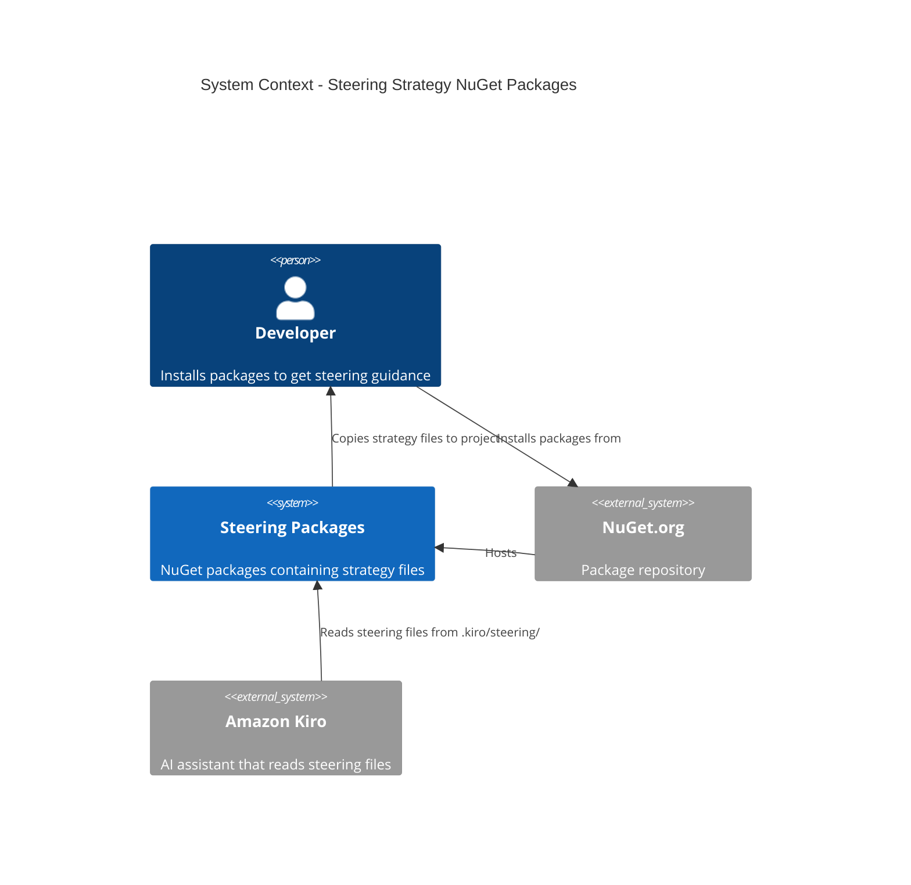
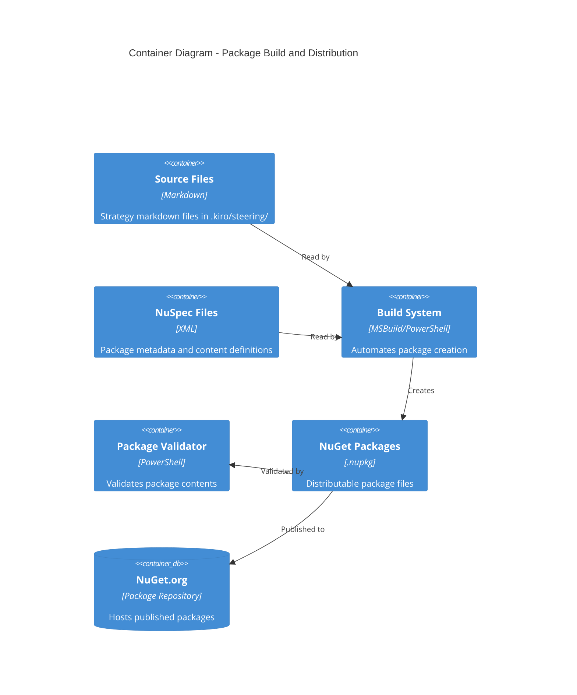
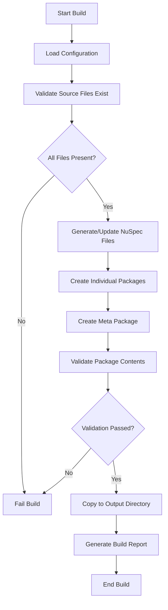

# Design Document: Steering Strategy NuGet Packages

## Overview

This design creates a suite of content-only NuGet packages that distribute Kiro steering strategy files to .NET projects. The solution uses MSBuild and NuGet's content file mechanism to automatically copy markdown files to the `.kiro/steering/` directory when packages are installed.

The architecture consists of:
- 10 individual strategy packages (one per steering file)
- 1 meta-package that references all individual packages
- Automated build system using MSBuild and .nuspec files
- Validation tooling to ensure package quality

## Architecture

### System Context



### Container Architecture



## Components and Interfaces

### Package Structure

Each individual package follows this structure:

```
PragmaticRhino.Kiro.Steering.{StrategyName}/
├── PragmaticRhino.Kiro.Steering.{StrategyName}.nuspec
├── content/
│   └── .kiro/
│       └── steering/
│           └── {strategy-file}.md
└── README.md
```

### NuSpec Template

Each package uses a .nuspec file with this structure:

```xml
<?xml version="1.0" encoding="utf-8"?>
<package xmlns="http://schemas.microsoft.com/packaging/2013/05/nuspec.xsd">
  <metadata>
    <id>PragmaticRhino.Kiro.Steering.{StrategyName}</id>
    <version>1.0.0</version>
    <authors>Patrick Liekhus</authors>
    <owners>Pragmatic Rhino</owners>
    <requireLicenseAcceptance>false</requireLicenseAcceptance>
    <license type="expression">MIT</license>
    <projectUrl>https://github.com/pragmaticrhino/agentic-reviewer</projectUrl>
    <description>{Strategy-specific description}</description>
    <tags>kiro steering best-practices {strategy-specific-tags}</tags>
    <readme>README.md</readme>
    <contentFiles>
      <files include="**/*" buildAction="Content" copyToOutput="false" flatten="false" />
    </contentFiles>
  </metadata>
  <files>
    <file src="../../.kiro/steering/{strategy-file}.md" 
          target="contentFiles/any/any/.kiro/steering/{strategy-file}.md" />
    <file src="README.md" target="" />
  </files>
</package>
```

### Meta-Package Structure

The meta-package has no content files, only dependencies:

```xml
<?xml version="1.0" encoding="utf-8"?>
<package xmlns="http://schemas.microsoft.com/packaging/2013/05/nuspec.xsd">
  <metadata>
    <id>PragmaticRhino.Kiro.Steering.All</id>
    <version>1.0.0</version>
    <authors>Patrick Liekhus</authors>
    <owners>Pragmatic Rhino</owners>
    <requireLicenseAcceptance>false</requireLicenseAcceptance>
    <license type="expression">MIT</license>
    <projectUrl>https://github.com/pragmaticrhino/agentic-reviewer</projectUrl>
    <description>Complete suite of Kiro steering strategy files for .NET projects. Includes all best practice guides for TDD/BDD, DevOps, Security, Azure, IaC, C4 Model, Enterprise Architecture, and 4D SDLC.</description>
    <tags>kiro steering best-practices complete-suite</tags>
    <readme>README.md</readme>
    <dependencies>
      <dependency id="PragmaticRhino.Kiro.Steering.FourDSafe" version="1.0.0" />
      <dependency id="PragmaticRhino.Kiro.Steering.Azure" version="1.0.0" />
      <dependency id="PragmaticRhino.Kiro.Steering.C4Model" version="1.0.0" />
      <dependency id="PragmaticRhino.Kiro.Steering.DevOps" version="1.0.0" />
      <dependency id="PragmaticRhino.Kiro.Steering.EnterpriseArchitecture" version="1.0.0" />
      <dependency id="PragmaticRhino.Kiro.Steering.InfrastructureAsCode" version="1.0.0" />
      <dependency id="PragmaticRhino.Kiro.Steering.Security" version="1.0.0" />
      <dependency id="PragmaticRhino.Kiro.Steering.TestDrivenDevelopment" version="1.0.0" />
    </dependencies>
  </metadata>
  <files>
    <file src="README.md" target="" />
  </files>
</package>
```

### Package Mapping

| Source File | Package Name | Description | Tags |
|-------------|--------------|-------------|------|
| strategy-4d-safe.md | PragmaticRhino.Kiro.Steering.4DSafe | 4D SDLC + SAFe work management strategy | kiro, steering, agile, safe, sdlc |
| strategy-azure.md | PragmaticRhino.Kiro.Steering.Azure | Azure hosting and architecture strategy | kiro, steering, azure, cloud, hosting |
| strategy-c4-model.md | PragmaticRhino.Kiro.Steering.C4Model | C4 Model architecture documentation strategy | kiro, steering, c4, architecture, diagrams |
| strategy-devops.md | PragmaticRhino.Kiro.Steering.DevOps | DevOps CI/CD strategy and practices | kiro, steering, devops, cicd, automation |
| strategy-ea.md | PragmaticRhino.Kiro.Steering.EnterpriseArchitecture | Enterprise Architecture (TOGAF/Zachman) strategy | kiro, steering, togaf, zachman, enterprise |
| strategy-iac.md | PragmaticRhino.Kiro.Steering.InfrastructureAsCode | Infrastructure as Code (Pulumi) strategy | kiro, steering, iac, pulumi, infrastructure |
| strategy-security.md | PragmaticRhino.Kiro.Steering.Security | Security strategy (SABSA-based) | kiro, steering, security, sabsa, compliance |
| strategy-tdd-bdd.md | PragmaticRhino.Kiro.Steering.TestDrivenDevelopment | TDD/BDD testing strategy | kiro, steering, tdd, bdd, testing |

## Data Models

### Package Metadata Model

```csharp
public class PackageMetadata
{
    public string Id { get; set; }
    public string Version { get; set; }
    public string Authors { get; set; } = "Patrick Liekhus";
    public string Owners { get; set; } = "Pragmatic Rhino";
    public string License { get; set; } = "MIT";
    public string ProjectUrl { get; set; } = "https://github.com/pragmaticrhino/agentic-reviewer";
    public string Description { get; set; }
    public List<string> Tags { get; set; }
    public string SourceFile { get; set; }
    public string TargetPath { get; set; }
}
```

### Build Configuration Model

```csharp
public class BuildConfiguration
{
    public string Version { get; set; } = "1.0.0";
    public string SourceDirectory { get; set; } = ".kiro/steering";
    public string OutputDirectory { get; set; } = "artifacts/packages";
    public string NuSpecDirectory { get; set; } = "build/nuspec";
    public List<PackageMetadata> Packages { get; set; }
}
```

## Build System Design

### Directory Structure

```
project-root/
├── .kiro/
│   └── steering/                    # Source strategy files
│       ├── strategy-4d-safe.md
│       ├── strategy-azure.md
│       └── ...
├── build/
│   ├── nuspec/                      # NuSpec files for each package
│   │   ├── FourDSafe.nuspec
│   │   ├── Azure.nuspec
│   │   ├── ...
│   │   └── All.nuspec
│   ├── readme/                      # README files for each package
│   │   ├── FourDSafe.md
│   │   ├── Azure.md
│   │   └── ...
│   ├── Build-Packages.ps1           # Main build script
│   ├── Validate-Packages.ps1        # Validation script
│   └── package-config.json          # Package metadata configuration
├── artifacts/
│   └── packages/                    # Output directory for .nupkg files
└── README.md
```

### Build Process Flow



### Build Script (PowerShell)

```powershell
# Build-Packages.ps1
param(
    [string]$Version = "1.0.0",
    [string]$Configuration = "Release"
)

$ErrorActionPreference = "Stop"

# Configuration
$sourceDir = ".kiro/steering"
$nuspecDir = "build/nuspec"
$outputDir = "artifacts/packages"
$configFile = "build/package-config.json"

# Load package configuration
$config = Get-Content $configFile | ConvertFrom-Json

# Ensure output directory exists
New-Item -ItemType Directory -Force -Path $outputDir | Out-Null

# Build each individual package
foreach ($package in $config.packages) {
    Write-Host "Building $($package.id)..." -ForegroundColor Cyan
    
    # Verify source file exists
    $sourceFile = Join-Path $sourceDir $package.sourceFile
    if (-not (Test-Path $sourceFile)) {
        throw "Source file not found: $sourceFile"
    }
    
    # Update version in nuspec
    $nuspecFile = Join-Path $nuspecDir "$($package.name).nuspec"
    $nuspec = [xml](Get-Content $nuspecFile)
    $nuspec.package.metadata.version = $Version
    $nuspec.Save($nuspecFile)
    
    # Pack the package
    nuget pack $nuspecFile -OutputDirectory $outputDir -Version $Version
    
    if ($LASTEXITCODE -ne 0) {
        throw "Failed to pack $($package.id)"
    }
}

# Build meta package
Write-Host "Building meta package..." -ForegroundColor Cyan
$metaNuspec = Join-Path $nuspecDir "All.nuspec"
$metaNuspecXml = [xml](Get-Content $metaNuspec)
$metaNuspecXml.package.metadata.version = $Version

# Update dependency versions
foreach ($dep in $metaNuspecXml.package.metadata.dependencies.dependency) {
    $dep.version = $Version
}
$metaNuspecXml.Save($metaNuspec)

nuget pack $metaNuspec -OutputDirectory $outputDir -Version $Version

if ($LASTEXITCODE -ne 0) {
    throw "Failed to pack meta package"
}

Write-Host "Build completed successfully!" -ForegroundColor Green
Write-Host "Packages created in: $outputDir" -ForegroundColor Green
```

### Validation Script

```powershell
# Validate-Packages.ps1
param(
    [string]$PackageDirectory = "artifacts/packages"
)

$ErrorActionPreference = "Stop"

function Test-PackageContent {
    param([string]$PackagePath)
    
    $tempDir = Join-Path $env:TEMP ([System.Guid]::NewGuid().ToString())
    New-Item -ItemType Directory -Path $tempDir | Out-Null
    
    try {
        # Extract package
        Expand-Archive -Path $PackagePath -DestinationPath $tempDir
        
        # Check for content files
        $contentFiles = Get-ChildItem -Path $tempDir -Recurse -Filter "*.md" | 
            Where-Object { $_.FullName -like "*contentFiles*" }
        
        if ($contentFiles.Count -eq 0 -and $PackagePath -notlike "*All*") {
            throw "No content files found in package"
        }
        
        # Check nuspec
        $nuspec = Get-ChildItem -Path $tempDir -Filter "*.nuspec" | Select-Object -First 1
        if (-not $nuspec) {
            throw "No nuspec file found in package"
        }
        
        $nuspecXml = [xml](Get-Content $nuspec.FullName)
        
        # Validate metadata
        if ([string]::IsNullOrWhiteSpace($nuspecXml.package.metadata.authors)) {
            throw "Authors not specified"
        }
        
        if ($nuspecXml.package.metadata.authors -ne "Patrick Liekhus") {
            throw "Incorrect author: $($nuspecXml.package.metadata.authors)"
        }
        
        return $true
    }
    finally {
        Remove-Item -Path $tempDir -Recurse -Force -ErrorAction SilentlyContinue
    }
}

# Validate all packages
$packages = Get-ChildItem -Path $PackageDirectory -Filter "*.nupkg"
$failed = @()

foreach ($package in $packages) {
    Write-Host "Validating $($package.Name)..." -ForegroundColor Cyan
    try {
        Test-PackageContent -PackagePath $package.FullName
        Write-Host "  ✓ Valid" -ForegroundColor Green
    }
    catch {
        Write-Host "  ✗ Failed: $_" -ForegroundColor Red
        $failed += $package.Name
    }
}

if ($failed.Count -gt 0) {
    Write-Host "`nValidation failed for:" -ForegroundColor Red
    $failed | ForEach-Object { Write-Host "  - $_" -ForegroundColor Red }
    exit 1
}

Write-Host "`nAll packages validated successfully!" -ForegroundColor Green
```

### Package Configuration JSON

```json
{
  "version": "1.0.0",
  "packages": [
    {
      "name": "FourDSafe",
      "id": "PragmaticRhino.Kiro.Steering.FourDSafe",
      "sourceFile": "strategy-4d-safe.md",
      "description": "4D SDLC + SAFe work management strategy guide for Kiro. Includes Define-Design-Develop-Deploy phases, WSJF prioritization, and agile best practices.",
      "tags": ["kiro", "steering", "agile", "safe", "sdlc", "best-practices"]
    },
    {
      "name": "Azure",
      "id": "PragmaticRhino.Kiro.Steering.Azure",
      "sourceFile": "strategy-azure.md",
      "description": "Azure hosting and architecture strategy guide for Kiro. Covers App Service, Container Apps, AKS, Functions, and Well-Architected principles.",
      "tags": ["kiro", "steering", "azure", "cloud", "hosting", "best-practices"]
    },
    {
      "name": "C4Model",
      "id": "PragmaticRhino.Kiro.Steering.C4Model",
      "sourceFile": "strategy-c4-model.md",
      "description": "C4 Model architecture documentation strategy for Kiro. Defines when and how to create System Context, Container, Component, and Dynamic diagrams.",
      "tags": ["kiro", "steering", "c4", "architecture", "diagrams", "best-practices"]
    },
    {
      "name": "DevOps",
      "id": "PragmaticRhino.Kiro.Steering.DevOps",
      "sourceFile": "strategy-devops.md",
      "description": "DevOps CI/CD strategy guide for Kiro. Covers automation, DORA metrics, deployment strategies, and continuous delivery practices.",
      "tags": ["kiro", "steering", "devops", "cicd", "automation", "best-practices"]
    },
    {
      "name": "EnterpriseArchitecture",
      "id": "PragmaticRhino.Kiro.Steering.EnterpriseArchitecture",
      "sourceFile": "strategy-ea.md",
      "description": "Enterprise Architecture strategy guide for Kiro using TOGAF and Zachman frameworks. Provides strategic questions for product and feature planning.",
      "tags": ["kiro", "steering", "togaf", "zachman", "enterprise", "best-practices"]
    },
    {
      "name": "InfrastructureAsCode",
      "id": "PragmaticRhino.Kiro.Steering.InfrastructureAsCode",
      "sourceFile": "strategy-iac.md",
      "description": "Infrastructure as Code strategy guide for Kiro using Pulumi. Covers stacks, components, configuration, and IaC best practices.",
      "tags": ["kiro", "steering", "iac", "pulumi", "infrastructure", "best-practices"]
    },
    {
      "name": "Security",
      "id": "PragmaticRhino.Kiro.Steering.Security",
      "sourceFile": "strategy-security.md",
      "description": "Security strategy guide for Kiro based on SABSA framework. Covers threat modeling, secure coding, compliance, and defense in depth.",
      "tags": ["kiro", "steering", "security", "sabsa", "compliance", "best-practices"]
    },
    {
      "name": "TestDrivenDevelopment",
      "id": "PragmaticRhino.Kiro.Steering.TestDrivenDevelopment",
      "sourceFile": "strategy-tdd-bdd.md",
      "description": "TDD/BDD testing strategy guide for Kiro. Covers Red-Green-Refactor, Given-When-Then, testing-plan.md, and quality standards.",
      "tags": ["kiro", "steering", "tdd", "bdd", "testing", "best-practices"]
    },

  ]
}
```

## Error Handling

### Build Errors

| Error | Cause | Resolution |
|-------|-------|------------|
| Source file not found | Strategy file missing from .kiro/steering/ | Verify file exists and path is correct |
| NuSpec validation failed | Invalid XML or missing required fields | Check nuspec syntax and required metadata |
| Pack failed | NuGet CLI error or invalid package structure | Review NuGet CLI output for specific error |
| Version mismatch | Inconsistent versions across packages | Ensure all packages use same version parameter |

### Installation Errors

| Error | Cause | Resolution |
|-------|-------|------------|
| Content not copied | Incorrect contentFiles configuration | Verify target path in nuspec |
| Permission denied | Insufficient write permissions | Run with appropriate permissions |
| Duplicate files | Multiple packages with same content | Packages are designed to coexist; this is expected |

## Testing Strategy

### Unit Tests

Not applicable - these are content-only packages with no executable code.

### Integration Tests

1. **Package Creation Test**
   - Build all packages
   - Verify .nupkg files created
   - Validate package count (11 total)

2. **Package Content Test**
   - Extract each package
   - Verify markdown file present
   - Verify correct target path
   - Verify metadata correctness

3. **Installation Test**
   - Create test .NET project
   - Install individual package
   - Verify file copied to `.kiro/steering/`
   - Verify file content matches source

4. **Meta Package Test**
   - Install meta package
   - Verify all 10 strategy files copied
   - Verify no duplicate files

5. **Update Test**
   - Install package version 1.0.0
   - Update to version 1.0.1
   - Verify file updated (manual verification required)

### Validation Tests

1. **Metadata Validation**
   - Author = "Patrick Liekhus"
   - Owner = "Pragmatic Rhino"
   - License = "MIT"
   - Tags include "kiro" and "steering"

2. **Content Validation**
   - Exactly one .md file per package (except meta)
   - File path = `.kiro/steering/{filename}.md`
   - Front-matter includes `inclusion: always`

3. **Dependency Validation**
   - Meta package references all 8 individual packages
   - Version numbers consistent
   - No circular dependencies

## Performance Considerations

### Build Performance

- **Parallel Builds**: Not required - build time is minimal (<30 seconds for all packages)
- **Incremental Builds**: Not applicable - always rebuild all packages
- **Caching**: NuGet CLI handles caching automatically

### Package Size

- Individual packages: ~5-15 KB each (markdown files only)
- Meta package: ~2 KB (no content, only dependencies)
- Total download size when installing all: ~50-70 KB

### Installation Performance

- Content file copy is near-instantaneous
- No compilation or code generation required
- Minimal impact on project restore time

## Security Considerations

### Package Security

- **Content Validation**: Markdown files only, no executable code
- **Source Integrity**: Files sourced from version-controlled repository
- **Signing**: Consider code signing for production releases
- **Vulnerability Scanning**: Not applicable (no dependencies)

### Supply Chain Security

- **Repository**: Host on trusted platform (GitHub)
- **Build Process**: Automated via CI/CD with audit trail
- **Publishing**: Require authentication and authorization
- **Versioning**: Immutable versions (cannot republish same version)

## Deployment Strategy

### Initial Release (v1.0.0)

1. Create all nuspec files
2. Build packages locally
3. Validate package contents
4. Test installation in sample project
5. Publish to NuGet.org (or private feed)

### Update Process

1. Update strategy markdown files in `.kiro/steering/`
2. Increment version number (following SemVer)
3. Update CHANGELOG.md
4. Build packages with new version
5. Validate packages
6. Publish to NuGet.org

### Version Strategy

- **MAJOR**: Breaking changes to file structure or front-matter
- **MINOR**: New guidance added, significant content updates
- **PATCH**: Corrections, clarifications, typo fixes

### CI/CD Integration

```yaml
# Example GitHub Actions workflow
name: Build and Publish Packages

on:
  push:
    tags:
      - 'v*'

jobs:
  build:
    runs-on: windows-latest
    steps:
      - uses: actions/checkout@v3
      
      - name: Setup NuGet
        uses: nuget/setup-nuget@v1
      
      - name: Extract version from tag
        id: version
        run: echo "VERSION=${GITHUB_REF#refs/tags/v}" >> $GITHUB_OUTPUT
      
      - name: Build packages
        run: ./build/Build-Packages.ps1 -Version ${{ steps.version.outputs.VERSION }}
      
      - name: Validate packages
        run: ./build/Validate-Packages.ps1
      
      - name: Publish to NuGet
        run: |
          nuget push artifacts/packages/*.nupkg -Source https://api.nuget.org/v3/index.json -ApiKey ${{ secrets.NUGET_API_KEY }}
```

## Monitoring and Maintenance

### Metrics to Track

- Download count per package
- Installation success rate
- Version adoption rate
- Issue reports related to packages

### Maintenance Tasks

- **Monthly**: Review download metrics
- **Quarterly**: Update strategy content based on feedback
- **Annually**: Major version review and updates

### Support

- GitHub Issues for bug reports and feature requests
- README files with installation instructions
- Example projects demonstrating usage

## Alternative Approaches Considered

### Alternative 1: Single Package with All Files

**Pros**: Simpler to maintain, single installation  
**Cons**: Forces users to include all strategies, larger package size  
**Decision**: Rejected - violates principle of selective inclusion

### Alternative 2: MSBuild Targets Package

**Pros**: More control over file placement, can run custom logic  
**Cons**: More complex, requires MSBuild knowledge, harder to debug  
**Decision**: Rejected - content files are simpler and sufficient

### Alternative 3: Template Package

**Pros**: Can scaffold entire project structure  
**Cons**: One-time operation, doesn't update with package updates  
**Decision**: Rejected - need ongoing updates, not one-time scaffolding

### Alternative 4: Source Generator

**Pros**: Can generate code based on strategy files  
**Cons**: Overkill for markdown files, adds complexity  
**Decision**: Rejected - no code generation needed

## Future Enhancements

### Phase 2 Considerations

1. **Localization**: Translate strategy files to other languages
2. **Customization**: Allow users to customize strategies via package parameters
3. **Validation**: Add MSBuild targets to validate strategy file usage
4. **Analytics**: Track which strategies are most commonly used together
5. **Templates**: Create project templates that include common strategy combinations

### Extensibility Points

- Package configuration JSON can be extended with additional metadata
- Build scripts can be enhanced with additional validation rules
- README templates can be customized per package
- Additional content files (examples, diagrams) can be added

## Conclusion

This design provides a simple, maintainable solution for distributing Kiro steering strategies via NuGet. The content-only package approach minimizes complexity while providing maximum flexibility for consumers. The automated build and validation system ensures quality and consistency across all packages.
