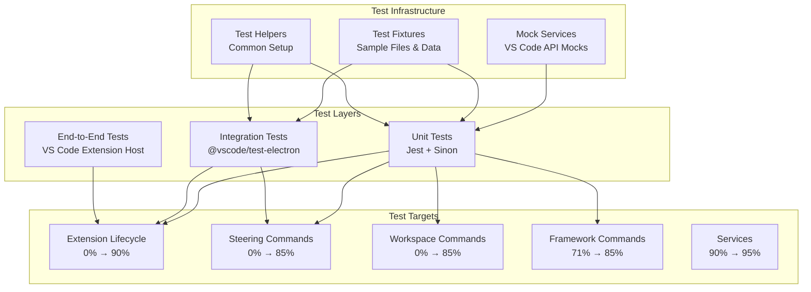

# Design Document

## Overview

This design outlines a comprehensive testing strategy to improve code coverage for the Pragmatic Rhino SUIT VS Code extension from the current 64.9% to the target 80% minimum. The approach focuses on the three main areas with 0% coverage: extension lifecycle, steering commands, and workspace commands, while also improving coverage for existing partially tested components.

## Architecture

### Testing Architecture



### Coverage Strategy

| Component | Current | Target | Primary Test Type | Key Focus Areas |
|-----------|---------|--------|-------------------|-----------------|
| Extension Lifecycle | 0% | 90% | Unit + Integration | Activation, deactivation, service registration |
| Steering Commands | 0% | 85% | Unit | CRUD operations, validation, error handling |
| Workspace Commands | 0% | 85% | Unit | Search, file operations, user interactions |
| Framework Commands | 71% | 85% | Unit | Missing branches, error paths |
| Services | 90% | 95% | Unit | Edge cases, error conditions |
| Providers | 85% | 90% | Unit | Missing branches, error scenarios |

## Components and Interfaces

### Test Infrastructure Components

#### 1. VS Code API Mocks (`tests/mocks/vscode-mocks.ts`)

**Purpose:** Provide comprehensive mocks for VS Code API to enable unit testing

**Key Interfaces:**
```typescript
interface MockVSCodeAPI {
  window: MockWindow;
  workspace: MockWorkspace;
  commands: MockCommands;
  languages: MockLanguages;
  Uri: MockUri;
  Range: MockRange;
  Position: MockPosition;
  Diagnostic: MockDiagnostic;
  DiagnosticSeverity: MockDiagnosticSeverity;
}

interface MockWindow {
  showInformationMessage: jest.Mock;
  showWarningMessage: jest.Mock;
  showErrorMessage: jest.Mock;
  showInputBox: jest.Mock;
  showQuickPick: jest.Mock;
  showTextDocument: jest.Mock;
  createTreeView: jest.Mock;
  activeTextEditor: MockTextEditor | undefined;
  withProgress: jest.Mock;
}
```

#### 2. Test Fixtures (`tests/fixtures/`)

**Purpose:** Provide consistent test data and file structures

**Structure:**
```
tests/fixtures/
├── workspace/                 # Mock workspace structure
│   ├── .kiro/
│   │   ├── steering/
│   │   │   ├── tech.md
│   │   │   └── custom-example.md
│   │   └── specs/
│   └── frameworks/
├── steering-documents/        # Sample steering documents
├── search-results/           # Sample search results
└── framework-data/           # Sample framework metadata
```

#### 3. Test Helpers (`tests/helpers/`)

**Purpose:** Common setup and utility functions

**Key Functions:**
```typescript
// Extension test helpers
export function createMockContext(): vscode.ExtensionContext;
export function createMockWorkspace(path: string): void;
export function setupExtensionMocks(): void;

// File system test helpers
export function createTempDirectory(): string;
export function createTestFiles(structure: FileStructure): void;
export function cleanupTestFiles(path: string): void;

// Command test helpers
export function simulateCommand(command: string, ...args: any[]): Promise<any>;
export function verifyCommandRegistration(context: vscode.ExtensionContext, command: string): boolean;
```

### Test Suites Design

#### 1. Extension Lifecycle Tests (`tests/unit/extension.test.ts`)

**Test Categories:**
- **Activation Tests:** Service initialization, command registration, provider setup
- **Deactivation Tests:** Cleanup verification
- **Performance Tests:** Activation timing, memory usage
- **Context Tests:** Extension context setup, global state management
- **Error Handling Tests:** Activation failures, service initialization errors

**Key Test Scenarios:**
```typescript
describe('Extension Activation', () => {
  it('should initialize all services correctly');
  it('should register all commands');
  it('should set up tree view providers');
  it('should create file system watchers');
  it('should show welcome message on first activation');
  it('should warn if activation takes longer than 500ms');
  it('should handle activation errors gracefully');
});
```

#### 2. Steering Commands Tests (`tests/unit/commands/steering-commands.test.ts`)

**Test Categories:**
- **Create Command Tests:** Document name validation, template generation, file creation
- **Rename Command Tests:** Validation, file operations, editor updates
- **Delete Command Tests:** Confirmation, file deletion, error handling
- **Validation Command Tests:** Document validation, diagnostics, user feedback
- **Export Command Tests:** Placeholder functionality verification

**Key Test Scenarios:**
```typescript
describe('Create Custom Steering Command', () => {
  it('should validate document name format');
  it('should generate proper template content');
  it('should create file in correct location');
  it('should open document in editor');
  it('should handle file already exists scenario');
  it('should handle user cancellation');
});
```

#### 3. Workspace Commands Tests (`tests/unit/commands/workspace-commands.test.ts`)

**Test Categories:**
- **Search Commands Tests:** Query validation, result display, file navigation
- **Framework Reference Tests:** File opening, error handling
- **Directory Management Tests:** Initialization, existence checks

**Key Test Scenarios:**
```typescript
describe('Search Frameworks Command', () => {
  it('should check frameworks directory existence');
  it('should prompt to initialize if directory missing');
  it('should validate search query');
  it('should display search results');
  it('should open selected file at correct line');
});
```

#### 4. Integration Tests (`tests/integration/extension.integration.test.ts`)

**Test Categories:**
- **Full Extension Tests:** Complete activation/deactivation cycle
- **Command Integration Tests:** End-to-end command execution
- **File System Integration Tests:** Real file operations in VS Code workspace
- **User Interaction Tests:** Simulated user workflows

## Data Models

### Test Data Models

#### Coverage Target Model
```typescript
interface CoverageTarget {
  component: string;
  currentCoverage: number;
  targetCoverage: number;
  testTypes: TestType[];
  priority: 'high' | 'medium' | 'low';
}

enum TestType {
  Unit = 'unit',
  Integration = 'integration',
  EndToEnd = 'e2e'
}
```

#### Test Scenario Model
```typescript
interface TestScenario {
  id: string;
  description: string;
  category: string;
  testType: TestType;
  requirements: string[];
  setup: string[];
  assertions: string[];
  cleanup?: string[];
}
```

## Error Handling

### Test Error Handling Strategy

1. **Mock Error Simulation:** Test error conditions by configuring mocks to throw errors
2. **Assertion Error Handling:** Clear error messages for test failures
3. **Cleanup on Failure:** Ensure test cleanup occurs even when tests fail
4. **Error Categorization:** Distinguish between expected errors (test scenarios) and unexpected errors (test bugs)

### Error Scenarios to Test

- **File System Errors:** Permission denied, file not found, disk full
- **VS Code API Errors:** Command registration failures, UI interaction errors
- **User Input Errors:** Invalid input, cancellation, timeout
- **Service Initialization Errors:** Dependency failures, configuration errors

## Testing Strategy

### Test-Driven Development Approach

1. **Red Phase:** Write failing tests for uncovered code paths
2. **Green Phase:** Implement minimal code to make tests pass
3. **Refactor Phase:** Improve code quality while maintaining test coverage

### Coverage Measurement

**Tools:**
- **Istanbul/NYC:** Code coverage measurement
- **Jest Coverage Reports:** Detailed coverage analysis
- **VS Code Coverage Gutters:** Visual coverage indicators

**Metrics Tracking:**
- Line coverage: 80% minimum
- Statement coverage: 80% minimum  
- Function coverage: 80% minimum
- Branch coverage: 70% minimum

### Test Execution Strategy

**Local Development:**
```bash
# Run all tests with coverage
npm run test:coverage

# Run specific test suites
npm run test:unit
npm run test:integration

# Watch mode for TDD
npm run test:watch
```

**CI/CD Pipeline:**
- **Pre-commit:** Unit tests only (fast feedback)
- **Pull Request:** Full test suite + coverage report
- **Main Branch:** Full test suite + coverage validation
- **Release:** Full test suite + integration tests

## Implementation Phases

### Phase 1: Test Infrastructure (Week 1)
- Set up comprehensive VS Code API mocks
- Create test fixtures and helpers
- Configure coverage reporting
- Establish test execution pipeline

### Phase 2: Extension Lifecycle Tests (Week 1-2)
- Unit tests for activation/deactivation
- Integration tests for service initialization
- Performance tests for activation timing
- Error handling tests

### Phase 3: Command Tests (Week 2-3)
- Steering commands unit tests
- Workspace commands unit tests
- Framework commands coverage improvement
- User interaction simulation

### Phase 4: Integration & Validation (Week 3-4)
- End-to-end integration tests
- Coverage validation and gap analysis
- Performance optimization
- Documentation updates

## Quality Assurance

### Test Quality Standards

- **Test Naming:** Descriptive names following `should_[expected behavior]_when_[condition]` pattern
- **Test Structure:** Arrange-Act-Assert pattern
- **Test Independence:** No dependencies between tests
- **Test Data:** Use fixtures and builders for consistent test data
- **Assertions:** Specific, meaningful assertions with clear error messages

### Coverage Quality Gates

- **Minimum Coverage:** 80% overall, 100% for critical paths
- **Coverage Trends:** No decrease in coverage on new commits
- **Uncovered Code:** Explicit justification required for uncovered code
- **Test Maintenance:** Regular review and update of test suites

## Performance Considerations

### Test Performance

- **Fast Unit Tests:** Target < 100ms per test
- **Parallel Execution:** Run tests in parallel where possible
- **Mock Optimization:** Efficient mock setup and teardown
- **Test Data Management:** Minimize test data creation overhead

### Extension Performance

- **Activation Time:** Monitor activation performance impact
- **Memory Usage:** Track memory consumption during tests
- **Resource Cleanup:** Ensure proper cleanup to prevent memory leaks

## Security Considerations

### Test Security

- **No Secrets in Tests:** Use mock credentials and test data
- **File System Isolation:** Tests should not access production files
- **Network Isolation:** Mock external API calls
- **Permission Testing:** Test permission-related error scenarios

## Monitoring and Metrics

### Coverage Metrics Dashboard

- **Overall Coverage Trends:** Track coverage over time
- **Component Coverage:** Monitor individual component coverage
- **Test Execution Metrics:** Test run time, failure rates
- **Quality Metrics:** Test maintainability, flakiness

### Success Criteria

- **Coverage Target:** Achieve 80% overall coverage
- **Test Reliability:** < 1% flaky test rate
- **Test Performance:** < 30 seconds total test execution time
- **Maintainability:** Clear, readable, well-documented tests