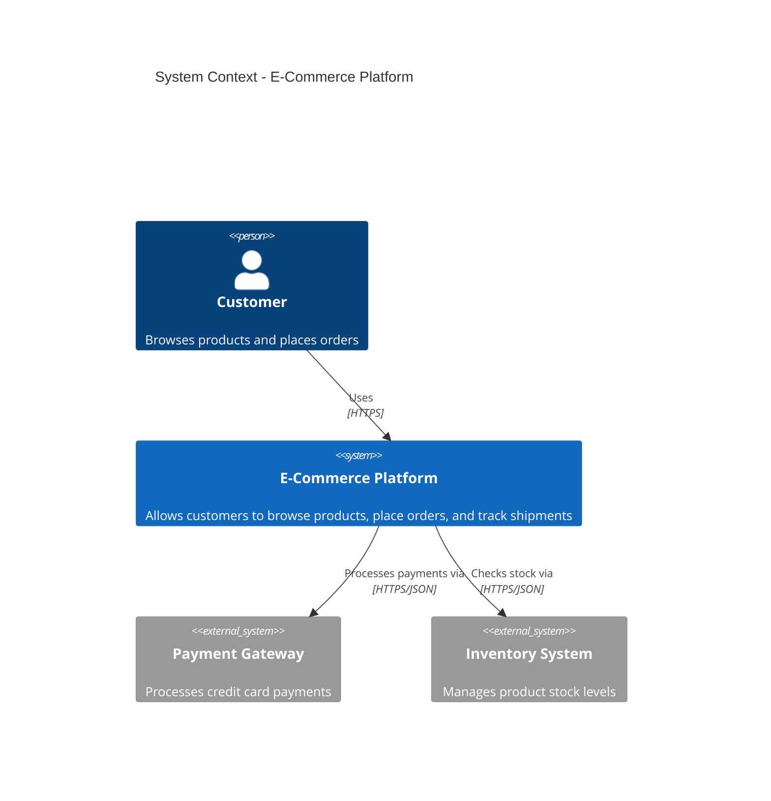
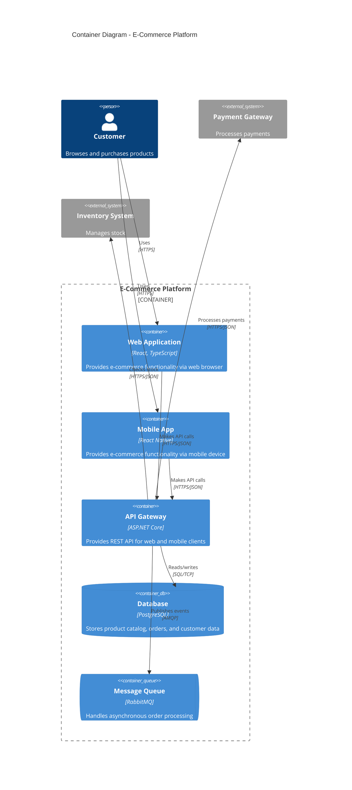
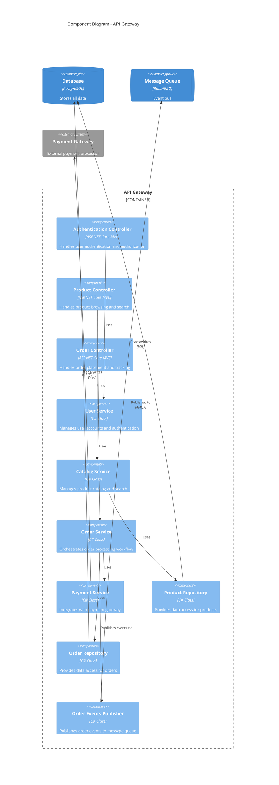
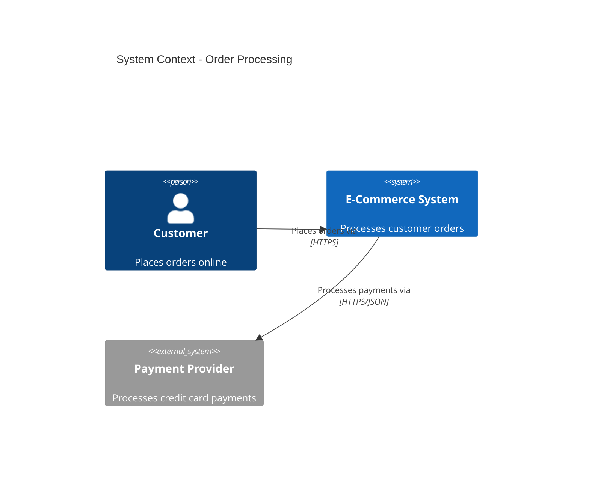
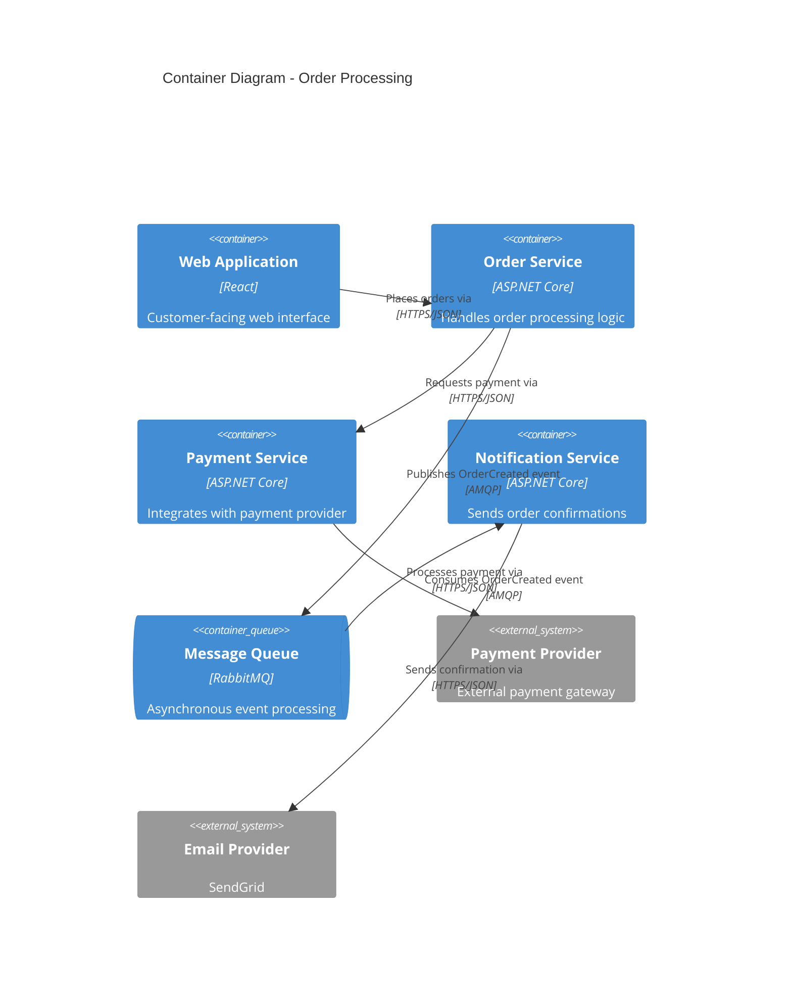
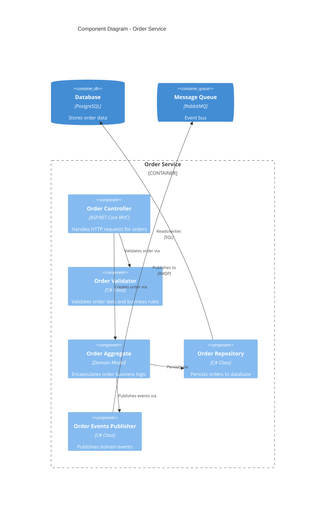

# C4 Model: Architecture Diagrams That Actually Help

*Published: Week 3, Friday - Architecture & Design Series*

## The UML Graveyard Problem

Raise your hand if you've ever spent hours creating detailed UML diagrams that nobody looked at after the first meeting. I've been there. Sequence diagrams with 47 actors, class diagrams that look like spider webs, and component diagrams that require a PhD to understand.

On our e-commerce project, we started with traditional architecture documentation. Three weeks later, we had beautiful Visio diagrams that were already outdated and a new developer who took one look at them and said, "Can someone just explain how this thing works?"

That's when I discovered the C4 Model - not because it's trendy, but because it actually helps people understand systems.

## What C4 Actually Solves

The C4 Model (Context, Containers, Components, Code) is like Google Maps for software architecture. Just like you don't need street-level detail when planning a road trip across the country, you don't need class-level detail when explaining system architecture.

C4 gives you four levels of zoom:
1. **System Context**: The big picture - what does this system do and who uses it?
2. **Container**: The high-level technology choices - web apps, databases, services
3. **Component**: The major building blocks within each container
4. **Code**: The implementation details (usually generated from code)

Most architecture discussions happen at levels 1-3. Level 4 is for developers working on specific components.

## Real Example: Our E-Commerce Architecture

**Level 1 - System Context**: The 30,000-foot view

This answers: "What does this system do and who interacts with it?"

**Level 2 - Container**: The technology stack

This answers: "What are the major technology pieces and how do they communicate?"

**Level 3 - Component**: Inside the API Gateway

This answers: "What are the major building blocks and their responsibilities?"

## How AI Helps with C4 Documentation

The C4 framework guides AI to:
- **Generate appropriate diagrams** for each architectural discussion
- **Keep diagrams focused** on the right level of detail
- **Use consistent notation** across all documentation
- **Update diagrams** when architecture changes
- **Create multiple views** for different audiences

Without this guidance, AI tends to create either oversimplified boxes-and-arrows or overwhelming technical detail.

## Real Documentation: Order Processing Flow

**Traditional approach** - One massive diagram showing everything at once. Nobody can follow this. It's technically accurate and completely useless.

**C4 approach** - Multiple focused diagrams:

**Context Level** (for executives):

**Container Level** (for architects):

**Component Level** (for developers):

Each diagram serves a different audience and conversation.

## The Framework's Practical Guidance

The C4 framework tells AI:
- **Which level to use** for different architectural discussions
- **What to include/exclude** at each level of detail
- **How to show relationships** between elements
- **When to create new diagrams** vs update existing ones
- **How to keep diagrams current** as the system evolves

## What Our E-Commerce Team Gained

**Faster Onboarding**: New developers understand the system in hours, not days
**Better Architecture Discussions**: We can zoom to the right level of detail
**Living Documentation**: Diagrams stay current because they're easy to update
**Stakeholder Communication**: Non-technical people can understand context diagrams
**Design Decisions**: We can see the impact of changes at different levels

## Real Benefits We've Measured

**Architecture Review Time**: 2 hours instead of 2 days (focused discussions)
**Developer Onboarding**: 1 day to understand system structure vs 1 week
**Documentation Maintenance**: 30 minutes per sprint vs 4 hours per month
**Stakeholder Alignment**: Executives can actually understand the system context

## When C4 Is Overkill

**Simple Applications**: If your system fits on one diagram, you don't need four levels
**Solo Projects**: The overhead might not be worth it for individual developers
**Prototype Phase**: Early exploration doesn't need formal documentation
**Stable Systems**: If the architecture never changes, static documentation might be fine

But be honest about complexity. Most systems that start simple grow complex over time.

## Common C4 Mistakes

**Wrong Level of Detail**: Showing code-level details in container diagrams
**Too Many Elements**: Trying to show everything instead of the important relationships
**Inconsistent Notation**: Using different symbols for the same concepts
**Static Documentation**: Creating diagrams once and never updating them
**Missing Context**: Jumping to component diagrams without showing the bigger picture

## Integration with Other Frameworks

C4 works great with the other frameworks we've covered:
- **Clean Architecture**: Component diagrams show the dependency flow
- **DDD**: Context diagrams show bounded context boundaries
- **Security**: Container diagrams show trust boundaries and data flow

The frameworks complement each other instead of competing.

## Tools and Automation

The C4 framework includes guidance on:
- **Diagram as Code**: Using tools like PlantUML or Mermaid for version control
- **Automated Generation**: Creating diagrams from code annotations
- **Template Libraries**: Consistent symbols and layouts
- **Integration**: Embedding diagrams in documentation and presentations

AI can help generate and maintain these diagrams as the system evolves.

## What's Next

Monday we'll start Week 4 with technology-specific frameworks, beginning with .NET best practices - how modern C# features can actually improve your domain modeling and why the latest language updates matter for maintainable code.

Then we'll explore Infrastructure as Code with Pulumi and why we chose it over Terraform for our cloud deployments.

## Your Turn

What's your biggest architecture documentation challenge - creating diagrams, keeping them current, or getting people to actually use them? Have you found any approaches that work better than traditional UML?

---

*Want to see the full C4 Model framework content? Check out the [architecture documentation reference](link) or see how it helps AI generate focused, useful diagrams for different architectural discussions.*
