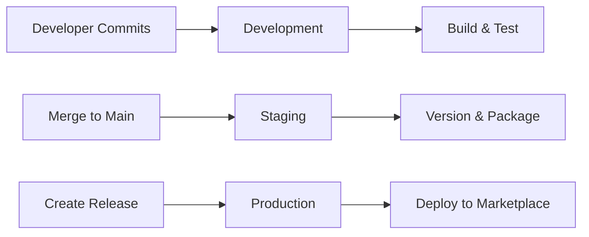
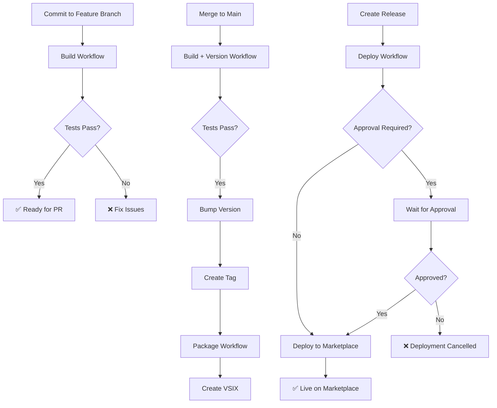

# Environment Configuration Overview

## Summary

The CI/CD pipeline supports three environments with different purposes and configurations:

| Environment | Purpose | Trigger | Approval | Documentation |
|-------------|---------|---------|----------|---------------|
| **Development** | Fast feedback for developers | Every commit | None | [DEVELOPMENT_ENVIRONMENT.md](DEVELOPMENT_ENVIRONMENT.md) |
| **Staging** | Pre-production validation | Push to main | None | [STAGING_ENVIRONMENT.md](STAGING_ENVIRONMENT.md) |
| **Production** | Marketplace deployment | Release published | Optional | [PRODUCTION_ENVIRONMENT.md](PRODUCTION_ENVIRONMENT.md) |

## Quick Start

### Development Environment

**Already configured** - Works automatically on every commit to any branch.

**What it does:**
- Runs build and tests
- Generates coverage reports
- Provides fast feedback (< 5 minutes)

**No setup required** - Just push your code!

### Staging Environment

**Already configured** - Works automatically on push to main branch.

**What it does:**
- Runs full test suite
- Bumps version automatically
- Creates version tags
- Packages VSIX file

**No setup required** - Just merge to main!

### Production Environment

**Requires one-time setup** for manual approval (optional).

**What it does:**
- Publishes to VS Code Marketplace
- Verifies deployment
- Sends notifications
- Collects metrics

**Setup steps:**

1. **Configure Secrets** (Required)
   ```
   Settings → Secrets and variables → Actions → New repository secret
   Name: VSCE_PAT
   Value: <your-marketplace-token>
   ```
   See [SECRETS.md](SECRETS.md) for token creation instructions.

2. **Enable Manual Approval** (Optional)
   ```
   Settings → Environments → New environment
   Name: production
   Enable: Required reviewers
   Add: Authorized approvers
   ```
   See [PRODUCTION_ENVIRONMENT.md](PRODUCTION_ENVIRONMENT.md) for detailed instructions.

3. **Update Workflow** (If using manual approval)
   ```yaml
   # In .github/workflows/deploy.yml, uncomment:
   environment:
     name: production
     url: https://marketplace.visualstudio.com/items?itemName=pragmatic-rhino.pragmatic-rhino-suit
   ```

## Environment Comparison

### Triggers



### Workflow Flow



### Configuration Matrix

| Feature | Development | Staging | Production |
|---------|-------------|---------|------------|
| **Trigger** | Push to any branch | Push to main | Release published |
| **Tests** | Unit only | Unit + Integration | Smoke tests |
| **Coverage** | Report only | Enforce 80% | N/A |
| **Security Scan** | No | Yes (npm audit) | N/A |
| **Versioning** | No | Yes (automatic) | N/A |
| **Packaging** | No | Yes (VSIX) | Uses staged VSIX |
| **Deployment** | No | No | Yes (marketplace) |
| **Approval** | None | None | Optional manual |
| **Artifacts** | Test results (30d) | VSIX (90d) | N/A |
| **Notifications** | On failure | On failure | On success/failure |
| **Rollback** | N/A | N/A | Available |

## Secrets Configuration

### Repository-Level Secrets (Shared)

Configure in: `Settings → Secrets and variables → Actions`

| Secret | Required For | Description |
|--------|--------------|-------------|
| `VSCE_PAT` | Production | VS Code Marketplace token |
| `GITHUB_TOKEN` | All | Auto-provided by GitHub |

**Recommendation:** Use repository-level secrets for simplicity unless you need environment-specific tokens.

### Environment-Level Secrets (Isolated)

Configure in: `Settings → Environments → {environment} → Secrets`

**Use environment-level secrets when:**
- Different marketplace publishers per environment
- Enhanced security through environment protection
- Separate credentials for staging vs. production
- Compliance requires credential isolation

**Example setup:**
```
Repository secrets:
  (none - using environment secrets)

Environment: staging
  VSCE_PAT: <staging-marketplace-token>

Environment: production
  VSCE_PAT: <production-marketplace-token>
```

## Approval Configuration

### No Approval (Fully Automated)

**Best for:**
- Mature pipelines with high confidence
- Frequent releases (multiple per week)
- Strong quality gates in place
- Experienced teams

**Setup:**
- No environment configuration needed
- Deployment proceeds automatically on release
- Fastest time to production

### Manual Approval (Gated)

**Best for:**
- Initial releases and early adoption
- Infrequent releases (monthly or less)
- High-risk changes
- Regulatory compliance requirements

**Setup:**
1. Create production environment
2. Enable required reviewers
3. Add authorized approvers
4. Uncomment environment in workflow

**Approval process:**
1. Release triggers deployment
2. Workflow waits for approval
3. Approver reviews and approves/rejects
4. Deployment proceeds or cancels

## Migration Path

### Phase 1: Initial Setup (Week 1)

**Goal:** Get basic pipeline working

1. ✅ Configure VSCE_PAT secret
2. ✅ Test development environment (automatic)
3. ✅ Test staging environment (automatic)
4. ✅ Enable manual approval for production
5. ✅ Test production deployment with approval

**Status:** Safe, gated deployments

### Phase 2: Build Confidence (Weeks 2-4)

**Goal:** Validate pipeline reliability

1. ✅ Deploy 3-5 releases with manual approval
2. ✅ Monitor deployment metrics
3. ✅ Verify rollback procedure
4. ✅ Train team on approval process
5. ✅ Document lessons learned

**Status:** Proven, reliable pipeline

### Phase 3: Automation (Week 5+)

**Goal:** Enable continuous deployment

1. ✅ Review deployment success rate (target: ≥ 98%)
2. ✅ Review quality gate effectiveness
3. ✅ Team consensus on automation
4. ✅ Disable manual approval
5. ✅ Monitor automated deployments

**Status:** Fully automated, continuous deployment

## Monitoring and Metrics

### Key Metrics by Environment

**Development:**
- Build duration (target: < 5 minutes)
- Test pass rate (target: 100%)
- Coverage percentage (target: ≥ 80%)

**Staging:**
- Version bump accuracy (target: 100%)
- Package creation success (target: 100%)
- VSIX validation pass rate (target: 100%)

**Production:**
- Deployment success rate (target: ≥ 98%)
- Deployment duration (target: < 10 minutes)
- Time to rollback (target: < 15 minutes)
- Approval time (if enabled) (target: < 1 hour)

### Monitoring Tools

**GitHub Actions:**
- Workflow run history
- Job execution logs
- Artifact storage
- Environment deployments

**VS Code Marketplace:**
- Installation metrics
- User ratings
- Error reports
- Version adoption

## Troubleshooting

### Development Environment Issues

**Build fails on commit:**
1. Check workflow logs in Actions tab
2. Verify tests pass locally
3. Check for linting errors
4. Ensure dependencies are up to date

**Coverage below threshold:**
1. Run coverage locally: `npm run test:coverage`
2. Identify uncovered code
3. Add missing tests
4. Verify coverage meets 80%

### Staging Environment Issues

**Version not bumping:**
1. Check commit message format (conventional commits)
2. Verify version workflow ran
3. Check for version workflow errors
4. Ensure main branch is up to date

**Package creation fails:**
1. Check package workflow logs
2. Verify TypeScript compilation succeeds
3. Check vsce package output
4. Verify package.json is valid

### Production Environment Issues

**Deployment waiting indefinitely:**
1. Check if manual approval is enabled
2. Verify approvers are configured
3. Check for pending approval notification
4. Approve or reject deployment

**Marketplace authentication fails:**
1. Verify VSCE_PAT secret is configured
2. Check token expiration (90-day limit)
3. Verify token has Marketplace (Publish) scope
4. Rotate token if needed (see [SECRETS.md](SECRETS.md))

**Deployment verification fails:**
1. Wait 5-10 minutes for marketplace propagation
2. Manually check marketplace URL
3. Verify version number is correct
4. Check marketplace status

## Best Practices

### Development

- ✅ Commit frequently (at least daily)
- ✅ Fix broken builds immediately
- ✅ Keep tests fast (< 2 minutes)
- ✅ Maintain 80%+ coverage
- ✅ Run tests locally before pushing

### Staging

- ✅ Use conventional commit messages
- ✅ Merge to main frequently
- ✅ Review version bumps
- ✅ Validate VSIX packages
- ✅ Test in staging before release

### Production

- ✅ Create releases during business hours
- ✅ Review release notes before publishing
- ✅ Monitor deployment progress
- ✅ Verify on marketplace after deployment
- ✅ Have rollback plan ready

## Security Considerations

### Secret Management

**Do:**
- ✅ Store secrets in GitHub Secrets
- ✅ Use environment-level secrets for isolation
- ✅ Rotate secrets every 90 days
- ✅ Limit secret access to authorized users
- ✅ Monitor secret usage in audit logs

**Don't:**
- ❌ Commit secrets to source control
- ❌ Share secrets via email or chat
- ❌ Use same secret across environments
- ❌ Store secrets in workflow files
- ❌ Log secret values

### Access Control

**Repository:**
- Limit write access to trusted contributors
- Require PR reviews before merge
- Enable branch protection on main
- Require status checks to pass

**Environments:**
- Configure required reviewers for production
- Limit approvers to maintainers
- Enable deployment branches restriction
- Monitor environment deployment history

## References

### Documentation

- [Development Environment](DEVELOPMENT_ENVIRONMENT.md)
- [Staging Environment](STAGING_ENVIRONMENT.md)
- [Production Environment](PRODUCTION_ENVIRONMENT.md)
- [Secrets Management](SECRETS.md)
- [Deployment Runbook](../DEPLOYMENT_RUNBOOK.md)

### External Resources

- [GitHub Actions Documentation](https://docs.github.com/en/actions)
- [GitHub Environments](https://docs.github.com/en/actions/deployment/targeting-different-environments/using-environments-for-deployment)
- [VS Code Publishing](https://code.visualstudio.com/api/working-with-extensions/publishing-extension)
- [Conventional Commits](https://www.conventionalcommits.org/)
- [Semantic Versioning](https://semver.org/)

## Support

### Getting Help

**For pipeline issues:**
1. Check workflow logs in Actions tab
2. Review relevant environment documentation
3. Check troubleshooting section above
4. Create issue with workflow run link

**For marketplace issues:**
1. Check marketplace status
2. Verify VSCE_PAT is valid
3. Review marketplace documentation
4. Contact marketplace support if needed

**For security concerns:**
1. Rotate compromised secrets immediately
2. Review audit logs
3. Document incident
4. Update security procedures
