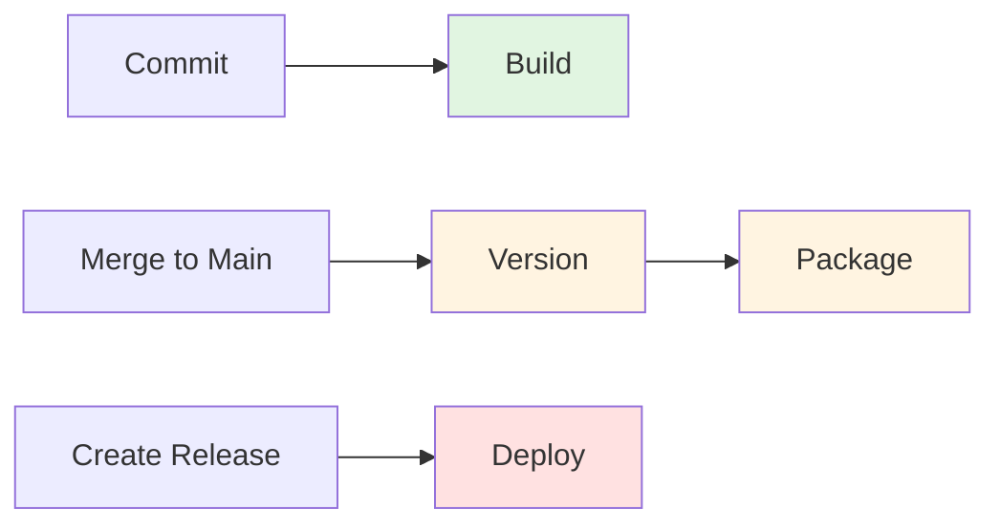

# Environment Quick Reference

## At a Glance

| Environment | Trigger | Approval | Secrets | Setup Required |
|-------------|---------|----------|---------|----------------|
| **Development** | Every commit | None | None | ❌ No |
| **Staging** | Push to main | None | Optional | ❌ No |
| **Production** | Release published | Optional | Required | ✅ Yes |

## Minimal Setup (5 Minutes)

### Required: Add Marketplace Token

```
Settings → Secrets and variables → Actions → New repository secret
Name: VSCE_PAT
Value: <your-marketplace-token>
```

**Done!** All environments will work.

## Full Setup (15 Minutes)

### Optional: Add Production Environment

```
Settings → Environments → New environment
Name: production
Enable: Required reviewers
Add: Authorized approvers
Add secret: VSCE_PAT (production token)
```

### Update Deploy Workflow

Uncomment in `.github/workflows/deploy.yml`:

```yaml
environment:
  name: production
  url: https://marketplace.visualstudio.com/items?itemName=pragmatic-rhino.pragmatic-rhino-suit
```

## Secret Configuration

### Option 1: Repository-Level (Simple)

```
Repository Secrets:
  VSCE_PAT: <token>

Environments:
  (none)
```

**Use for:** Small teams, single publisher

### Option 2: Environment-Level (Isolated)

```
Repository Secrets:
  (none)

Environment: production
  VSCE_PAT: <production-token>
```

**Use for:** Separate staging/production publishers

### Option 3: Hybrid (Recommended)

```
Repository Secrets:
  VSCE_PAT: <staging-token>

Environment: production
  VSCE_PAT: <production-token>
```

**Use for:** Most teams

## Workflow Triggers



## Environment URLs

| Environment | GitHub Settings Path |
|-------------|---------------------|
| **Staging** | `Settings → Environments → staging` |
| **Production** | `Settings → Environments → production` |

## Approval Process

1. Create release → Deploy workflow starts
2. Workflow waits for approval (if configured)
3. Approver receives notification
4. Approver reviews and approves/rejects
5. Deployment proceeds or cancels

## Quick Commands

### Test Development
```bash
git checkout -b test/dev
echo "// Test" >> src/extension.ts
git add . && git commit -m "test: dev environment"
git push origin test/dev
```

### Test Staging
```bash
git checkout -b test/staging
echo "// Feature" >> src/extension.ts
git add . && git commit -m "feat: test staging"
git push origin test/staging
gh pr create --title "Test Staging" --body "Test"
gh pr merge --squash --delete-branch
```

### Test Production
```bash
gh release create v1.0.1 --title "v1.0.1" --notes "Test release"
```

## Troubleshooting

| Issue | Solution |
|-------|----------|
| **Build not running** | Check workflow triggers in `.github/workflows/` |
| **Secret not found** | Verify secret name and location (repo vs environment) |
| **Approval not working** | Check environment has required reviewers enabled |
| **Wrong token used** | Environment secrets override repository secrets |

## Common Tasks

### Rotate Marketplace Token

1. Generate new token in VS Code Marketplace
2. Update secret in GitHub:
   - Repository: `Settings → Secrets → VSCE_PAT → Update`
   - Environment: `Settings → Environments → production → VSCE_PAT → Update`
3. Test deployment

### Add Approver

1. Go to `Settings → Environments → production`
2. Click **Required reviewers**
3. Add user
4. Save

### Remove Approval Requirement

1. Go to `Settings → Environments → production`
2. Disable **Required reviewers**
3. Save

### Enable Approval Requirement

1. Go to `Settings → Environments → production`
2. Enable **Required reviewers**
3. Add approvers
4. Save

## Metrics to Monitor

| Metric | Target | Check |
|--------|--------|-------|
| **Build Duration** | < 5 min | Actions tab |
| **Deployment Duration** | < 10 min | Actions tab |
| **Success Rate** | ≥ 98% | Actions tab |
| **Approval Time** | < 1 hour | Environment deployments |

## Security Checklist

- [ ] VSCE_PAT stored in GitHub Secrets (not code)
- [ ] Production uses environment-level secret
- [ ] Required reviewers configured (if using approval)
- [ ] Branch restrictions enabled
- [ ] Secrets rotated every 90 days
- [ ] Audit logs reviewed monthly

## Migration Paths

### No Environments → With Approval

1. Add `VSCE_PAT` to repository secrets
2. Test deployment (automatic)
3. Create production environment
4. Enable required reviewers
5. Add production secret
6. Update deploy workflow
7. Test with approval

### With Approval → Fully Automated

1. Verify 10+ successful deployments
2. Check success rate ≥ 98%
3. Get team consensus
4. Disable required reviewers
5. Monitor closely

## Links

- [Full Setup Guide](ENVIRONMENT_SETUP_GUIDE.md)
- [Development Environment](DEVELOPMENT_ENVIRONMENT.md)
- [Staging Environment](STAGING_ENVIRONMENT.md)
- [Production Environment](PRODUCTION_ENVIRONMENT.md)
- [Secrets Management](SECRETS.md)
- [GitHub Environments Docs](https://docs.github.com/en/actions/deployment/targeting-different-environments/using-environments-for-deployment)
