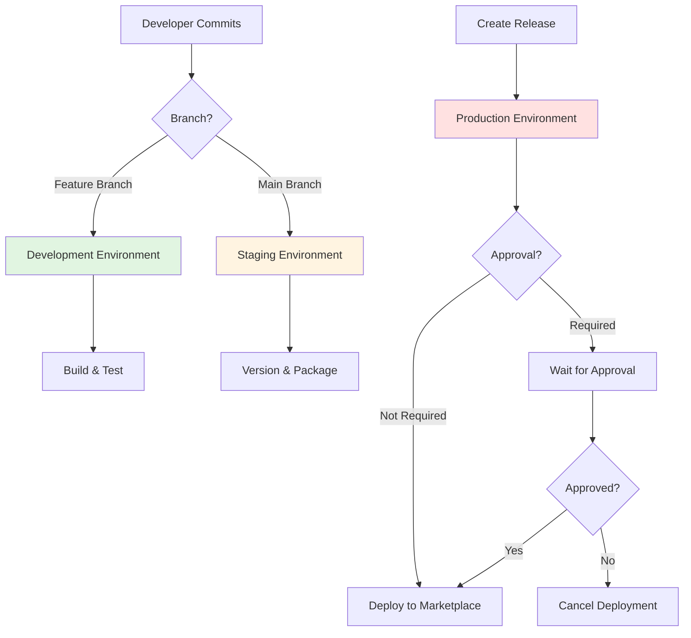

# Environment Setup Guide

## Overview

This guide provides step-by-step instructions for setting up GitHub environments for the Pragmatic Rhino SUIT CI/CD pipeline. Follow these instructions to configure development, staging, and production environments with appropriate secrets and protection rules.

## Prerequisites

- Repository admin access
- VS Code Marketplace publisher account
- Personal Access Token (PAT) for marketplace publishing

## Environment Architecture



## Quick Setup (Minimal Configuration)

For teams that want to get started quickly with minimal configuration:

### Step 1: Configure Repository Secret

1. Go to **Settings** → **Secrets and variables** → **Actions**
2. Click **New repository secret**
3. Name: `VSCE_PAT`
4. Value: Your VS Code Marketplace Personal Access Token
5. Click **Add secret**

**That's it!** The pipeline will work with this minimal setup:
- ✅ Development environment (automatic)
- ✅ Staging environment (automatic)
- ✅ Production environment (automatic, no approval)

### Step 2: Test the Pipeline

1. Create a feature branch and push changes
2. Merge to main to trigger versioning
3. Create a release to trigger deployment

## Full Setup (With Environment Protection)

For teams that want environment isolation and manual approval gates:

### Step 1: Create Staging Environment (Optional)

**Purpose:** Isolate staging secrets and add protection rules

1. **Navigate to Environments**
   - Go to **Settings** → **Environments**
   - Click **New environment**
   - Name: `staging`
   - Click **Configure environment**

2. **Configure Protection Rules** (Optional)
   - **Deployment branches:** Select **Selected branches**
   - Add rule: `main` branch only
   - This ensures only main branch can deploy to staging

3. **Add Environment Secrets** (Optional)
   - Click **Add secret**
   - Name: `VSCE_PAT`
   - Value: Staging marketplace token (if using separate publisher)
   - Click **Add secret**

4. **Save Configuration**
   - Click **Save protection rules**

### Step 2: Create Production Environment (Recommended)

**Purpose:** Add manual approval gate and isolate production secrets

1. **Navigate to Environments**
   - Go to **Settings** → **Environments**
   - Click **New environment**
   - Name: `production`
   - Click **Configure environment**

2. **Configure Protection Rules**
   
   **Required Reviewers (Recommended for initial releases):**
   - Enable **Required reviewers**
   - Click **Add reviewers**
   - Select authorized approvers (maintainers)
   - Maximum: 6 reviewers
   - Minimum: 1 approval required
   
   **Deployment Branches:**
   - Select **Selected branches**
   - Add rule: `main` branch only
   - This ensures only releases from main can deploy
   
   **Wait Timer (Optional):**
   - Set wait timer: 0-43200 minutes
   - Use for scheduled deployment windows
   - Example: 0 minutes (no wait)

3. **Add Environment Secrets**
   - Click **Add secret**
   - Name: `VSCE_PAT`
   - Value: Production marketplace token
   - Click **Add secret**

4. **Configure Environment URL**
   - Environment URL: `https://marketplace.visualstudio.com/items?itemName=pragmatic-rhino.pragmatic-rhino-suit`
   - This URL appears in deployment history

5. **Save Configuration**
   - Click **Save protection rules**

### Step 3: Update Deploy Workflow (If Using Production Environment)

If you created the production environment with protection rules, update the deploy workflow:

1. **Edit `.github/workflows/deploy.yml`**

2. **Uncomment the environment section:**

```yaml
# Before (commented out):
# Optional: Configure environment for production deployment
# Uncomment to enable manual approval requirement
# environment:
#   name: production
#   url: https://marketplace.visualstudio.com/items?itemName=pragmatic-rhino.pragmatic-rhino-suit

# After (uncommented):
# Production environment with manual approval
environment:
  name: production
  url: https://marketplace.visualstudio.com/items?itemName=pragmatic-rhino.pragmatic-rhino-suit
```

3. **Commit and push the change:**

```bash
git add .github/workflows/deploy.yml
git commit -m "chore: enable production environment protection"
git push origin main
```

## Environment Configuration Reference

### Development Environment

**Configuration:**
- No GitHub environment needed
- Uses repository-level secrets
- No protection rules
- Automatic execution

**Secrets:**
- None required (uses `GITHUB_TOKEN` automatically)

**Workflows:**
- `build.yml` - Runs on every commit
- `pr-quality-gates.yml` - Runs on PR events
- `test-coverage.yml` - Runs on main/develop

**Protection:**
- None (fast feedback)

### Staging Environment

**Configuration:**
- Optional GitHub environment
- Can use environment-specific secrets
- Optional branch restrictions

**Secrets:**
- `VSCE_PAT` (optional, if using separate publisher)

**Workflows:**
- `version.yml` - Runs on push to main
- `package.yml` - Runs on version tag push

**Protection:**
- Optional: Restrict to main branch only
- No approval required

### Production Environment

**Configuration:**
- Recommended GitHub environment
- Environment-specific secrets
- Manual approval (optional)
- Branch restrictions

**Secrets:**
- `VSCE_PAT` (required for marketplace publishing)

**Workflows:**
- `deploy.yml` - Runs on release published

**Protection:**
- Required reviewers (optional)
- Restrict to main branch
- Environment URL for quick access

## Secret Configuration Strategies

### Strategy 1: Repository-Level Secrets (Simple)

**Best for:**
- Small teams
- Single marketplace publisher
- Simplified management

**Setup:**
```
Repository Secrets:
  VSCE_PAT: <marketplace-token>

Environments:
  (none configured)
```

**Pros:**
- ✅ Simple setup
- ✅ Single secret to manage
- ✅ Works for all environments

**Cons:**
- ❌ No secret isolation
- ❌ Same token for all environments
- ❌ No environment protection

### Strategy 2: Environment-Level Secrets (Isolated)

**Best for:**
- Larger teams
- Separate staging/production publishers
- Enhanced security requirements

**Setup:**
```
Repository Secrets:
  (none)

Environment: staging
  VSCE_PAT: <staging-token>

Environment: production
  VSCE_PAT: <production-token>
```

**Pros:**
- ✅ Secret isolation
- ✅ Different tokens per environment
- ✅ Environment protection available

**Cons:**
- ❌ More complex setup
- ❌ Multiple secrets to manage
- ❌ Requires environment configuration

### Strategy 3: Hybrid (Recommended)

**Best for:**
- Most teams
- Balance of simplicity and security

**Setup:**
```
Repository Secrets:
  VSCE_PAT: <staging-token>

Environment: production
  VSCE_PAT: <production-token>
```

**Pros:**
- ✅ Simple for development/staging
- ✅ Protected production secret
- ✅ Manual approval for production
- ✅ Easy to migrate from Strategy 1

**Cons:**
- ❌ Slightly more complex than Strategy 1

## Approval Workflow

### Configuring Approvers

**Who should be an approver:**
- Repository maintainers
- Release managers
- Technical leads
- Product owners

**Best practices:**
- Add 2-3 approvers (redundancy)
- Include people in different time zones
- Document approval criteria
- Train approvers on process

### Approval Process

1. **Deployment Triggered**
   - Maintainer creates GitHub release
   - Deploy workflow starts
   - Workflow waits at approval gate

2. **Notification Sent**
   - Approvers receive email notification
   - GitHub web notification appears
   - Notification includes deployment details

3. **Review Deployment**
   - Approver clicks notification link
   - Reviews release notes
   - Checks package workflow results
   - Verifies version number

4. **Approve or Reject**
   - Click **Review deployments** button
   - Select **production** environment
   - Click **Approve and deploy** or **Reject**
   - Add optional comment

5. **Deployment Proceeds**
   - Workflow continues execution
   - Extension published to marketplace
   - Success notification sent

### Approval Criteria

**Approve when:**
- ✅ All quality gates passed
- ✅ Package workflow successful
- ✅ Release notes complete
- ✅ Version number correct
- ✅ Appropriate timing
- ✅ No critical issues

**Reject when:**
- ❌ Quality gates failed
- ❌ Package workflow failed
- ❌ Release notes incomplete
- ❌ Version number incorrect
- ❌ Inappropriate timing
- ❌ Critical issues discovered

## Testing Your Configuration

### Test Development Environment

```bash
# Create feature branch
git checkout -b test/dev-environment

# Make a change
echo "// Test" >> src/extension.ts
git add src/extension.ts
git commit -m "test: verify development environment"
git push origin test/dev-environment

# Verify build workflow runs
# Check GitHub Actions tab
```

**Expected:**
- ✅ Build workflow triggers automatically
- ✅ Tests run and pass
- ✅ Coverage report generated
- ✅ Artifacts uploaded

### Test Staging Environment

```bash
# Create feature branch
git checkout -b test/staging-environment

# Make a change with conventional commit
echo "// Feature" >> src/extension.ts
git add src/extension.ts
git commit -m "feat: test staging environment"
git push origin test/staging-environment

# Create and merge PR
gh pr create --title "Test: Staging" --body "Testing staging environment"
gh pr merge --squash --delete-branch

# Verify version workflow runs
# Check GitHub Actions tab
```

**Expected:**
- ✅ Version workflow triggers on main push
- ✅ Version bumped (minor)
- ✅ Changelog updated
- ✅ Git tag created
- ✅ Package workflow triggers
- ✅ VSIX created

### Test Production Environment

```bash
# Create a release from the version tag
gh release create v1.0.1 --title "Release v1.0.1" --notes "Test release"

# Verify deploy workflow runs
# Check GitHub Actions tab
```

**Expected (No Approval):**
- ✅ Deploy workflow triggers automatically
- ✅ VSIX downloaded
- ✅ Published to marketplace
- ✅ Verification successful
- ✅ Success notification sent

**Expected (With Approval):**
- ✅ Deploy workflow triggers
- ✅ Workflow waits for approval
- ✅ Approver receives notification
- ✅ After approval, deployment proceeds
- ✅ Published to marketplace

## Migration Guide

### From No Environments to Full Setup

**Phase 1: Add Repository Secret**
1. Add `VSCE_PAT` to repository secrets
2. Test deployment without environments
3. Verify marketplace publishing works

**Phase 2: Add Production Environment**
1. Create production environment
2. Enable required reviewers
3. Add production secret
4. Update deploy workflow
5. Test with manual approval

**Phase 3: Add Staging Environment (Optional)**
1. Create staging environment
2. Add staging secret (if needed)
3. Configure branch restrictions
4. Test version workflow

### From Manual Approval to Fully Automated

**Prerequisites:**
- ✅ 10+ successful deployments with approval
- ✅ Deployment success rate ≥ 98%
- ✅ Team consensus on automation
- ✅ Rollback procedure tested

**Steps:**
1. **Disable Required Reviewers**
   - Go to production environment settings
   - Disable **Required reviewers**
   - Save changes

2. **Keep Environment Configuration**
   - Keep environment-specific secrets
   - Keep branch restrictions
   - Keep environment URL

3. **Monitor Closely**
   - Watch first 5 automated deployments
   - Be ready to rollback if needed
   - Review metrics after 2 weeks

4. **Re-enable if Needed**
   - Can re-enable approval at any time
   - No workflow changes needed
   - Immediate effect

## Troubleshooting

### Environment Not Found

**Symptom:** Workflow fails with "Environment not found" error

**Solution:**
1. Verify environment name matches workflow exactly
2. Check environment is created in repository settings
3. Ensure workflow references correct environment name

### Secret Not Available

**Symptom:** Workflow fails with "Secret not found" error

**Solution:**
1. Check secret is configured in correct location:
   - Repository secrets: Available to all workflows
   - Environment secrets: Only available when environment is used
2. Verify secret name matches exactly (case-sensitive)
3. Ensure workflow has permission to access environment

### Approval Not Working

**Symptom:** Deployment doesn't wait for approval

**Solution:**
1. Verify environment has required reviewers enabled
2. Check deploy workflow has environment configured
3. Ensure environment name matches in workflow
4. Verify approvers are added to environment

### Wrong Secret Used

**Symptom:** Deployment uses wrong marketplace token

**Solution:**
1. Check secret precedence:
   - Environment secrets override repository secrets
   - Workflow uses environment secret if environment is configured
2. Verify correct secret is in correct location
3. Check workflow logs to see which secret was used

## Best Practices

### Security

- ✅ Use environment-level secrets for production
- ✅ Rotate secrets every 90 days
- ✅ Limit approvers to trusted maintainers
- ✅ Enable branch restrictions
- ✅ Monitor secret usage in audit logs
- ✅ Never commit secrets to source control

### Reliability

- ✅ Test each environment independently
- ✅ Verify rollback procedure works
- ✅ Monitor deployment metrics
- ✅ Have multiple approvers configured
- ✅ Document approval criteria
- ✅ Keep secrets up to date

### Maintenance

- ✅ Review environment configuration quarterly
- ✅ Update documentation when changes made
- ✅ Train new team members on approval process
- ✅ Audit approver list regularly
- ✅ Test environments after configuration changes

## References

- [GitHub Environments Documentation](https://docs.github.com/en/actions/deployment/targeting-different-environments/using-environments-for-deployment)
- [GitHub Secrets Documentation](https://docs.github.com/en/actions/security-guides/encrypted-secrets)
- [Environment Configuration Overview](ENVIRONMENT_CONFIGURATION.md)
- [Development Environment](DEVELOPMENT_ENVIRONMENT.md)
- [Staging Environment](STAGING_ENVIRONMENT.md)
- [Production Environment](PRODUCTION_ENVIRONMENT.md)
- [Secrets Management](SECRETS.md)

## Support

For issues with environment setup:
1. Check troubleshooting section above
2. Review GitHub Actions logs
3. Verify configuration matches this guide
4. Create issue with configuration details
