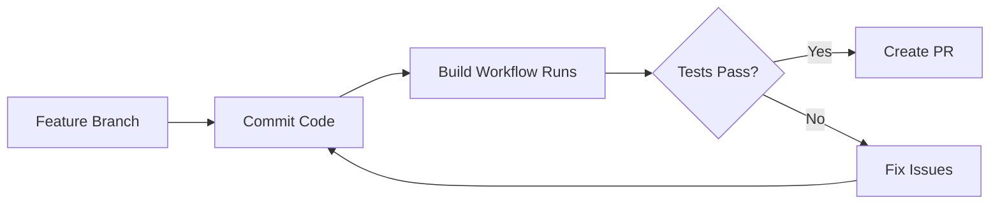
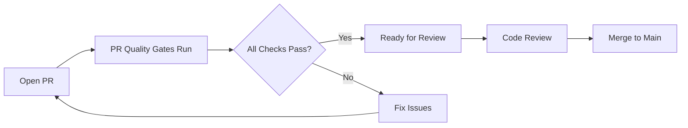
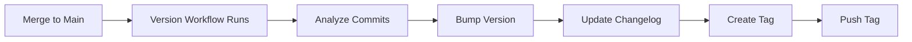
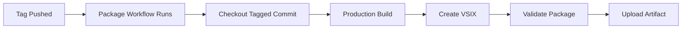
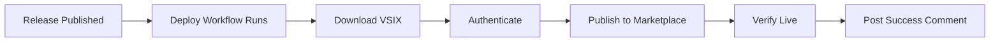

# Deployment Runbook: Pragmatic Rhino SUIT

## Overview

This runbook provides step-by-step procedures for deploying the Pragmatic Rhino SUIT VS Code extension to the Visual Studio Code Marketplace. It covers both automated CI/CD deployments and manual deployment procedures for emergency situations.

**Target Audience:** DevOps engineers, release managers, repository maintainers

**Prerequisites:**
- Access to GitHub repository with admin permissions
- VSCE_PAT configured in GitHub Secrets (see [SECRETS.md](./SECRETS.md))
- Understanding of semantic versioning
- Familiarity with GitHub Actions workflows

---

## Table of Contents

1. [Automated Deployment Process](#automated-deployment-process)
2. [Manual Deployment Procedures](#manual-deployment-procedures)
3. [Rollback Procedures](#rollback-procedures)
4. [Emergency Procedures](#emergency-procedures)
5. [Troubleshooting Guide](#troubleshooting-guide)
6. [Pre-Deployment Checklist](#pre-deployment-checklist)
7. [Post-Deployment Verification](#post-deployment-verification)
8. [Monitoring and Alerts](#monitoring-and-alerts)

---

## Automated Deployment Process

### Normal Release Flow

The automated CI/CD pipeline handles most deployments. Here's the standard flow:

#### 1. Development Phase



**Actions:**
1. Developer creates feature branch
2. Commits code changes
3. Build workflow automatically runs:
   - Compiles TypeScript
   - Runs ESLint
   - Executes unit tests
   - Generates coverage report
4. If build fails, developer fixes issues and commits again

**Monitoring:**
- Check GitHub Actions tab for workflow status
- Review build logs if failures occur
- Verify test coverage meets 80% threshold

#### 2. Pull Request Phase



**Actions:**
1. Developer opens pull request
2. PR quality gates workflow runs:
   - Full build and test suite
   - Security vulnerability scan (npm audit)
   - Code coverage validation
   - Version format validation
3. If checks fail, developer addresses issues
4. Code review by team members
5. Merge to main branch after approval

**Quality Gates:**
- ✅ All tests pass
- ✅ Code coverage ≥ 80%
- ✅ No critical/high security vulnerabilities
- ✅ Valid semantic version in package.json
- ✅ Code review approved

#### 3. Versioning Phase



**Actions:**
1. Code merged to main branch
2. Version workflow automatically runs:
   - Analyzes commit messages for version bump type
   - Updates package.json with new version
   - Generates CHANGELOG.md entries
   - Commits version changes
   - Creates git tag (e.g., v1.2.3)
   - Pushes tag to repository

**Version Bump Rules:**
- `BREAKING CHANGE:` or `!` → Major version (1.0.0 → 2.0.0)
- `feat:` → Minor version (1.0.0 → 1.1.0)
- `fix:` or `chore:` → Patch version (1.0.0 → 1.0.1)

**Monitoring:**
- Verify tag created successfully
- Check CHANGELOG.md updated correctly
- Confirm version in package.json matches tag

#### 4. Packaging Phase



**Actions:**
1. Version tag pushed (triggers automatically)
2. Package workflow runs:
   - Validates tag format (v*.*.*)
   - Checks out tagged commit
   - Installs production dependencies
   - Compiles TypeScript in production mode
   - Creates VSIX file using vsce
   - Validates VSIX structure
   - Uploads VSIX as artifact (90-day retention)

**Validation Checks:**
- VSIX file created successfully
- Manifest version matches tag
- Required files included
- No development dependencies
- File size within limits

**Monitoring:**
- Check package workflow status
- Verify VSIX artifact uploaded
- Review validation logs

#### 5. Release Creation

**Manual Step - Release Manager:**

1. Navigate to GitHub repository
2. Click **Releases** → **Draft a new release**
3. Configure release:
   - **Tag:** Select the version tag (e.g., v1.2.3)
   - **Release title:** Version number and brief description (e.g., "v1.2.3 - Bug fixes and performance improvements")
   - **Description:** Copy relevant entries from CHANGELOG.md
   - **Pre-release:** Check if this is a beta/RC version
4. Click **Publish release**

**Release Notes Template:**

```markdown
## What's New in v1.2.3

### Features
- Added new spec validation command
- Improved C4 diagram generation

### Bug Fixes
- Fixed issue with framework detection
- Resolved memory leak in tree view

### Performance
- Reduced extension activation time by 30%

### Documentation
- Updated README with new examples
- Added troubleshooting guide

## Installation

Install from the [VS Code Marketplace](https://marketplace.visualstudio.com/items?itemName=pragmatic-rhino.pragmatic-rhino-suit)

## Feedback

Report issues on [GitHub](https://github.com/your-org/pragmatic-rhino-suit/issues)
```

#### 6. Deployment Phase



**Actions:**
1. Release published (triggers automatically)
2. Deploy workflow runs:
   - Downloads VSIX artifact
   - Verifies file integrity
   - Authenticates with marketplace using VSCE_PAT
   - Publishes extension using vsce
   - Waits for marketplace processing
   - Verifies extension is live
   - Posts success comment on release
   - Sends notifications

**Monitoring:**
- Check deploy workflow status
- Verify marketplace authentication succeeds
- Confirm extension published successfully
- Check success comment on release

**Expected Timeline:**
- Workflow execution: 5-10 minutes
- Marketplace processing: 5-15 minutes
- Total deployment time: 10-25 minutes

---

## Manual Deployment Procedures

### When to Use Manual Deployment

Use manual deployment only in these scenarios:
- CI/CD pipeline is unavailable
- Emergency hotfix required
- Testing deployment process
- Recovering from failed automated deployment

### Prerequisites

**Required Tools:**
- Node.js 18.x or later
- npm 9.x or later
- vsce CLI (`npm install -g @vscode/vsce`)
- Git
- VS Code Marketplace Personal Access Token

**Required Access:**
- Repository clone access
- VSCE_PAT secret value
- Publisher account access

### Manual Deployment Steps

#### Step 1: Prepare Local Environment

```bash
# Clone repository (if not already cloned)
git clone https://github.com/your-org/pragmatic-rhino-suit.git
cd pragmatic-rhino-suit

# Ensure you're on the correct branch/tag
git fetch --all --tags
git checkout tags/v1.2.3  # Replace with target version

# Clean any previous builds
rm -rf node_modules out *.vsix
```

#### Step 2: Install Dependencies

```bash
# Install production dependencies only
npm ci --production

# Verify installation
npm list --depth=0
```

#### Step 3: Build Extension

```bash
# Compile TypeScript
npm run compile

# Verify compilation succeeded
ls -la out/
```

#### Step 4: Run Pre-Deployment Tests

```bash
# Install dev dependencies for testing
npm ci

# Run tests
npm test

# Check coverage
npm run test:coverage

# Verify coverage meets 80% threshold
```

#### Step 5: Create VSIX Package

```bash
# Package extension
vsce package

# Verify VSIX created
ls -la *.vsix

# Expected output: pragmatic-rhino-suit-1.2.3.vsix
```

#### Step 6: Validate Package

```bash
# List package contents
vsce ls

# Verify manifest
unzip -p pragmatic-rhino-suit-1.2.3.vsix extension/package.json | jq .

# Check version matches
# Expected: "version": "1.2.3"
```

#### Step 7: Publish to Marketplace

```bash
# Set VSCE_PAT environment variable
export VSCE_PAT="your-personal-access-token"

# Publish extension
vsce publish --packagePath pragmatic-rhino-suit-1.2.3.vsix

# Expected output:
# Publishing pragmatic-rhino.pragmatic-rhino-suit@1.2.3...
# Successfully published pragmatic-rhino.pragmatic-rhino-suit@1.2.3!
```

**⚠️ Security Warning:** Never commit the VSCE_PAT to version control. Clear the environment variable after use:

```bash
unset VSCE_PAT
```

#### Step 8: Verify Deployment

```bash
# Check extension on marketplace
vsce show pragmatic-rhino.pragmatic-rhino-suit

# Verify version
# Expected: Latest version should be 1.2.3
```

#### Step 9: Post-Deployment Tasks

1. **Update GitHub Release:**
   - Navigate to the release on GitHub
   - Add comment: "Manually deployed to marketplace"
   - Include deployment timestamp

2. **Notify Team:**
   - Post in team chat/Slack
   - Include version number and marketplace link

3. **Document Deployment:**
   - Record in deployment log
   - Note reason for manual deployment
   - Document any issues encountered

### Manual Deployment Checklist

- [ ] Local environment prepared
- [ ] Correct version checked out
- [ ] Dependencies installed (production only)
- [ ] Extension compiled successfully
- [ ] Tests passed (80%+ coverage)
- [ ] VSIX package created
- [ ] Package validated
- [ ] VSCE_PAT obtained securely
- [ ] Extension published to marketplace
- [ ] Deployment verified on marketplace
- [ ] GitHub release updated
- [ ] Team notified
- [ ] Deployment documented
- [ ] VSCE_PAT cleared from environment

---

## Rollback Procedures

### When to Rollback

Initiate rollback immediately if:
- Extension causes critical bugs in production
- Extension fails to activate
- Extension crashes VS Code
- Security vulnerability discovered
- Marketplace reports high error rate
- User reports indicate major issues

### Automated Rollback (Preferred)

#### Using Rollback Workflow

1. **Navigate to Actions:**
   - Go to GitHub repository
   - Click **Actions** tab
   - Select **Rollback Deployment** workflow

2. **Trigger Rollback:**
   - Click **Run workflow**
   - Select branch: `main`
   - Enter version to rollback to (e.g., `v1.2.2`)
   - Click **Run workflow**

3. **Monitor Rollback:**
   - Watch workflow execution
   - Verify artifact download succeeds
   - Confirm marketplace publish succeeds
   - Check success notification

4. **Verify Rollback:**
   - Check marketplace shows rolled-back version
   - Test extension installation
   - Verify extension activates correctly

5. **Update Documentation:**
   - Add comment to original release explaining rollback
   - Update incident log
   - Notify team of rollback completion

**Expected Timeline:**
- Workflow execution: 5-10 minutes
- Marketplace processing: 5-15 minutes
- Total rollback time: 10-25 minutes

### Manual Rollback

If automated rollback fails or is unavailable:

#### Step 1: Identify Rollback Version

```bash
# List recent tags
git tag --sort=-version:refname | head -5

# Identify last known good version
# Example: v1.2.2 (before problematic v1.2.3)
```

#### Step 2: Download Previous VSIX

**Option A: From GitHub Artifacts**

1. Navigate to GitHub Actions
2. Find successful package workflow for target version
3. Download VSIX artifact
4. Extract VSIX file from zip

**Option B: Rebuild from Tag**

```bash
# Checkout previous version
git checkout tags/v1.2.2

# Follow manual deployment steps 1-5
# (Prepare, install, build, test, package)
```

#### Step 3: Publish Previous Version

```bash
# Set VSCE_PAT
export VSCE_PAT="your-personal-access-token"

# Publish previous version
vsce publish --packagePath pragmatic-rhino-suit-1.2.2.vsix

# Clear token
unset VSCE_PAT
```

#### Step 4: Verify Rollback

```bash
# Check marketplace version
vsce show pragmatic-rhino.pragmatic-rhino-suit

# Expected: Version should be 1.2.2
```

#### Step 5: Document Rollback

1. **Update GitHub Releases:**
   - Add comment to v1.2.3 release: "⚠️ Rolled back due to [reason]"
   - Add comment to v1.2.2 release: "✅ Re-published as rollback from v1.2.3"

2. **Create Incident Report:**
   - Document issue that triggered rollback
   - Record rollback timeline
   - Note lessons learned
   - Plan remediation steps

3. **Notify Stakeholders:**
   - Team members
   - Users (if necessary)
   - Management (for critical issues)

### Rollback Checklist

- [ ] Issue severity assessed (critical/high)
- [ ] Rollback decision approved
- [ ] Target rollback version identified
- [ ] Previous VSIX obtained
- [ ] Rollback published to marketplace
- [ ] Marketplace version verified
- [ ] Extension tested post-rollback
- [ ] GitHub releases updated
- [ ] Incident report created
- [ ] Team notified
- [ ] Users notified (if necessary)
- [ ] Root cause analysis scheduled
- [ ] Fix planned and tracked

---

## Emergency Procedures

### Critical Failure Response

**Definition:** Extension causes VS Code crashes, data loss, or security breaches

#### Immediate Actions (Within 15 Minutes)

1. **Assess Severity:**
   - Determine impact scope (all users vs. specific scenarios)
   - Identify affected VS Code versions
   - Check error reports and logs

2. **Initiate Emergency Rollback:**
   - Use automated rollback workflow (fastest)
   - If unavailable, use manual rollback
   - Target last known stable version

3. **Notify Stakeholders:**
   - Post in team emergency channel
   - Alert repository admins
   - Notify security team (if security issue)

4. **Disable Problematic Version:**
   - Rollback to previous version
   - Consider unpublishing if extremely critical

#### Short-Term Actions (Within 1 Hour)

1. **Verify Rollback:**
   - Confirm marketplace shows stable version
   - Test extension installation and activation
   - Monitor error reports

2. **Communicate with Users:**
   - Post issue on GitHub with status
   - Update marketplace description if needed
   - Provide workaround if available

3. **Begin Root Cause Analysis:**
   - Collect error logs and stack traces
   - Reproduce issue locally
   - Identify problematic code/change

#### Medium-Term Actions (Within 24 Hours)

1. **Develop Fix:**
   - Create hotfix branch
   - Implement fix with tests
   - Verify fix resolves issue

2. **Test Thoroughly:**
   - Run full test suite
   - Manual testing in affected scenarios
   - Beta test with team members

3. **Prepare Hotfix Release:**
   - Bump patch version
   - Update CHANGELOG with fix details
   - Create release notes

4. **Deploy Hotfix:**
   - Follow normal deployment process
   - Monitor closely post-deployment
   - Verify issue resolved

#### Long-Term Actions (Within 1 Week)

1. **Complete Incident Report:**
   - Document timeline of events
   - Analyze root cause
   - Identify contributing factors
   - Propose preventive measures

2. **Implement Improvements:**
   - Add tests to prevent recurrence
   - Improve monitoring/alerting
   - Update deployment procedures
   - Enhance quality gates

3. **Team Retrospective:**
   - Review incident response
   - Identify what went well
   - Identify areas for improvement
   - Update runbook based on learnings

### Emergency Contact List

| Role | Contact | Availability |
|------|---------|--------------|
| Repository Admin | [Name/Email] | 24/7 |
| DevOps Lead | [Name/Email] | Business hours |
| Security Lead | [Name/Email] | 24/7 for security issues |
| Product Owner | [Name/Email] | Business hours |

### Emergency Escalation Path

1. **Level 1:** Repository maintainer initiates rollback
2. **Level 2:** DevOps lead if rollback fails
3. **Level 3:** Repository admin for access issues
4. **Level 4:** Security lead for security incidents

---

## Troubleshooting Guide

### Common Issues and Solutions

#### Build Failures

**Issue:** TypeScript compilation errors

**Symptoms:**
- Build workflow fails at compile step
- Error messages about type mismatches
- Missing dependencies

**Resolution:**
```bash
# Update dependencies
npm ci

# Clean build
rm -rf out node_modules
npm ci
npm run compile

# Check for type errors
npx tsc --noEmit
```

**Prevention:**
- Run `npm run compile` before committing
- Enable TypeScript checking in IDE
- Run pre-commit hooks

---

**Issue:** Test failures

**Symptoms:**
- Tests fail in CI but pass locally
- Intermittent test failures
- Timeout errors

**Resolution:**
```bash
# Run tests with verbose output
npm test -- --verbose

# Run specific test file
npm test -- path/to/test.test.ts

# Increase timeout for slow tests
npm test -- --testTimeout=10000
```

**Prevention:**
- Avoid test interdependencies
- Mock external dependencies
- Use deterministic test data
- Avoid time-based assertions

---

**Issue:** Coverage below threshold

**Symptoms:**
- Build fails with "Coverage below 80%"
- Specific files show low coverage

**Resolution:**
```bash
# Generate detailed coverage report
npm run test:coverage

# Open HTML report
open coverage/index.html

# Identify uncovered lines
# Add tests for uncovered code
```

**Prevention:**
- Write tests alongside code (TDD)
- Review coverage in PR
- Set up coverage tracking

#### Deployment Failures

**Issue:** Authentication failed

**Symptoms:**
- Deploy workflow fails with "401 Unauthorized"
- "Authentication failed" error

**Resolution:**
1. Check VSCE_PAT expiration in Azure DevOps
2. Verify token has Marketplace: Manage permission
3. Rotate token following [SECRETS.md](./SECRETS.md)
4. Update GitHub secret with new token

**Prevention:**
- Set calendar reminders for token rotation
- Monitor token expiration dates
- Test authentication before deployment

---

**Issue:** Marketplace rejection

**Symptoms:**
- Publish succeeds but extension not visible
- Marketplace validation errors
- "Package rejected" message

**Resolution:**
1. Check marketplace email for rejection reason
2. Review [VS Code Extension Guidelines](https://code.visualstudio.com/api/references/extension-guidelines)
3. Fix validation issues
4. Repackage and republish

**Common Rejection Reasons:**
- Missing or invalid icon
- Incomplete README
- Broken marketplace links
- Policy violations

**Prevention:**
- Validate package before publishing
- Review marketplace guidelines
- Test extension locally
- Use `vsce ls` to check package contents

---

**Issue:** Version conflict

**Symptoms:**
- "Version already exists" error
- Cannot publish same version twice

**Resolution:**
1. Verify version in package.json
2. Check marketplace for existing version
3. Bump version number
4. Create new tag
5. Repackage and publish

**Prevention:**
- Use automated versioning workflow
- Never manually edit version numbers
- Follow semantic versioning

---

**Issue:** Artifact not found

**Symptoms:**
- Deploy workflow fails with "Artifact not found"
- Cannot download VSIX

**Resolution:**
1. Check package workflow completed successfully
2. Verify artifact uploaded (check workflow artifacts)
3. Check artifact retention period (90 days)
4. Rebuild package if artifact expired

**Prevention:**
- Monitor package workflow status
- Archive critical versions externally
- Document artifact retention policy

#### Rollback Issues

**Issue:** Rollback workflow fails

**Symptoms:**
- Rollback workflow errors
- Cannot find previous version
- Artifact download fails

**Resolution:**
1. Use manual rollback procedure
2. Rebuild from previous tag if artifact unavailable
3. Publish manually using vsce

**Prevention:**
- Test rollback procedure quarterly
- Maintain external backup of critical versions
- Document rollback steps

---

**Issue:** Marketplace shows wrong version

**Symptoms:**
- Marketplace displays old version after deployment
- Version number doesn't match published version

**Resolution:**
1. Wait 15-30 minutes for marketplace cache refresh
2. Clear browser cache
3. Check marketplace API directly
4. Contact marketplace support if persists

**Prevention:**
- Allow time for marketplace processing
- Verify version after deployment
- Monitor marketplace status

### Diagnostic Commands

```bash
# Check current version
cat package.json | jq .version

# List recent tags
git tag --sort=-version:refname | head -10

# Check workflow status
gh run list --workflow=deploy.yml --limit=5

# View workflow logs
gh run view <run-id> --log

# Check marketplace version
vsce show pragmatic-rhino.pragmatic-rhino-suit

# Validate VSIX package
vsce ls --packagePath pragmatic-rhino-suit-1.2.3.vsix

# Test extension locally
code --install-extension pragmatic-rhino-suit-1.2.3.vsix
```

### Log Analysis

**Build Logs:**
- Check for compilation errors
- Review test failures
- Verify coverage reports

**Deploy Logs:**
- Check authentication step
- Review publish output
- Verify marketplace response

**Marketplace Logs:**
- Check publisher dashboard
- Review validation reports
- Monitor error rates

---

## Pre-Deployment Checklist

### Code Quality

- [ ] All tests pass locally
- [ ] Code coverage ≥ 80%
- [ ] No ESLint errors or warnings
- [ ] TypeScript compiles without errors
- [ ] No console.log or debug statements
- [ ] Code reviewed and approved

### Documentation

- [ ] README updated with new features
- [ ] CHANGELOG.md updated
- [ ] API documentation updated (if applicable)
- [ ] Breaking changes documented
- [ ] Migration guide provided (if needed)

### Testing

- [ ] Unit tests added for new features
- [ ] Integration tests pass
- [ ] Manual testing completed
- [ ] Extension tested in VS Code
- [ ] Tested on supported VS Code versions
- [ ] No regressions identified

### Security

- [ ] No hardcoded secrets or credentials
- [ ] Dependencies scanned for vulnerabilities
- [ ] No critical/high severity issues
- [ ] Security best practices followed
- [ ] Input validation implemented

### Version Management

- [ ] Version number follows semantic versioning
- [ ] Version incremented appropriately
- [ ] Git tag created
- [ ] CHANGELOG.md reflects version changes

### Marketplace

- [ ] Extension manifest valid
- [ ] Icon and images included
- [ ] Marketplace description accurate
- [ ] Categories and tags appropriate
- [ ] License information correct

### Deployment

- [ ] VSCE_PAT valid and not expired
- [ ] GitHub secrets configured
- [ ] Workflows tested on feature branch
- [ ] Rollback plan documented
- [ ] Team notified of deployment

---

## Post-Deployment Verification

### Immediate Verification (Within 15 Minutes)

1. **Check Marketplace:**
   ```bash
   vsce show pragmatic-rhino.pragmatic-rhino-suit
   ```
   - Verify version number correct
   - Check last updated timestamp
   - Confirm description and images display

2. **Test Installation:**
   ```bash
   code --install-extension pragmatic-rhino.pragmatic-rhino-suit
   ```
   - Install extension from marketplace
   - Verify installation succeeds
   - Check extension appears in Extensions view

3. **Test Activation:**
   - Open VS Code
   - Open a workspace with `.kiro/` folder
   - Verify extension activates
   - Check no activation errors in Output panel

4. **Test Core Features:**
   - Create new spec (command palette)
   - Validate spec
   - Generate C4 diagram
   - Verify all commands work

### Short-Term Monitoring (Within 1 Hour)

1. **Monitor Error Reports:**
   - Check VS Code marketplace error reports
   - Review GitHub issues for new reports
   - Monitor team chat for user feedback

2. **Check Metrics:**
   - Installation count
   - Rating (if changed)
   - Download trends

3. **Verify Notifications:**
   - Confirm success notification received
   - Check GitHub release comment posted
   - Verify team notified

### Medium-Term Monitoring (Within 24 Hours)

1. **User Feedback:**
   - Monitor GitHub issues
   - Check marketplace reviews
   - Review team feedback

2. **Performance Metrics:**
   - Extension activation time
   - Command execution time
   - Memory usage

3. **Error Rates:**
   - Check for spike in errors
   - Review error patterns
   - Investigate anomalies

### Long-Term Monitoring (Within 1 Week)

1. **Adoption Metrics:**
   - Installation growth rate
   - Active user count
   - Feature usage statistics

2. **Quality Metrics:**
   - Bug reports count
   - Average time to resolution
   - User satisfaction rating

3. **Performance Trends:**
   - Response time trends
   - Resource usage trends
   - Crash rate trends

---

## Monitoring and Alerts

### Key Metrics to Monitor

**Deployment Metrics:**
- Deployment frequency (target: multiple per week)
- Deployment success rate (target: ≥ 98%)
- Deployment duration (target: < 25 minutes)
- Rollback frequency (target: < 5% of deployments)

**Quality Metrics:**
- Test pass rate (target: 100%)
- Code coverage (target: ≥ 80%)
- Build success rate (target: ≥ 95%)
- Security vulnerabilities (target: 0 critical/high)

**Marketplace Metrics:**
- Installation count
- Active users
- Rating and reviews
- Error reports

**Performance Metrics:**
- Extension activation time
- Command response time
- Memory usage
- CPU usage

### Alert Configuration

**Critical Alerts (Immediate Response):**
- Deployment failure
- Marketplace rejection
- Security vulnerability detected
- Extension crash rate spike
- Authentication failure

**Warning Alerts (Response Within 1 Hour):**
- Build failure
- Test coverage drop
- Slow deployment (> 30 minutes)
- Increased error rate

**Info Alerts (Response Within 24 Hours):**
- New version deployed
- Rollback completed
- Token expiration approaching

### Monitoring Tools

**GitHub Actions:**
- Workflow run history
- Job execution logs
- Artifact storage usage

**VS Code Marketplace:**
- Publisher dashboard
- Installation statistics
- Error reports
- User reviews

**GitHub Repository:**
- Issue tracker
- Pull request activity
- Release history

### Incident Response

**Severity Levels:**

| Level | Description | Response Time | Escalation |
|-------|-------------|---------------|------------|
| P0 - Critical | Extension crashes, data loss, security breach | Immediate (< 15 min) | Repository admin |
| P1 - High | Major feature broken, high error rate | < 1 hour | DevOps lead |
| P2 - Medium | Minor feature broken, moderate errors | < 4 hours | Team lead |
| P3 - Low | Cosmetic issues, minor bugs | < 24 hours | Developer |

**Response Procedures:**

1. **Acknowledge:** Confirm receipt of alert
2. **Assess:** Determine severity and impact
3. **Act:** Implement fix or rollback
4. **Communicate:** Notify stakeholders
5. **Document:** Record incident details
6. **Review:** Conduct post-incident review

---

## Deployment Log Template

Maintain a deployment log for audit and tracking:

```markdown
## Deployment Log

| Date | Version | Type | Deployed By | Status | Notes |
|------|---------|------|-------------|--------|-------|
| 2025-01-15 | v1.2.3 | Automated | GitHub Actions | Success | New features added |
| 2025-01-14 | v1.2.2 | Automated | GitHub Actions | Success | Bug fixes |
| 2025-01-13 | v1.2.1 | Manual | Patrick Liekhus | Success | Hotfix for critical bug |
| 2025-01-12 | v1.2.0 | Automated | GitHub Actions | Rolled back | Performance issues |
```

---

## Document Maintenance

**Last Updated:** 2025-01-10  
**Next Review:** 2025-04-10  
**Owner:** DevOps Team  
**Reviewers:** Release Managers, Repository Admins

**Change Log:**
- 2025-01-10: Initial runbook created

---

## Additional Resources

### Official Documentation

- [GitHub Actions Documentation](https://docs.github.com/en/actions)
- [VS Code Extension Publishing](https://code.visualstudio.com/api/working-with-extensions/publishing-extension)
- [vsce CLI Documentation](https://github.com/microsoft/vscode-vsce)
- [Semantic Versioning](https://semver.org/)

### Internal Documentation

- [SECRETS.md](./SECRETS.md) - GitHub Secrets configuration
- [README.md](../../README.md) - Project overview
- [CONTRIBUTING.md](../../CONTRIBUTING.md) - Contribution guidelines
- [CHANGELOG.md](../../CHANGELOG.md) - Version history

### Support Contacts

- **GitHub Support:** https://support.github.com/
- **VS Code Marketplace Support:** https://aka.ms/vsmarketplace-support
- **Team Chat:** [Slack/Teams channel]
- **On-Call:** [PagerDuty/rotation schedule]

---

## Quick Reference

### Common Commands

```bash
# Check version
cat package.json | jq .version

# List tags
git tag --sort=-version:refname | head -5

# Package extension
vsce package

# Publish extension
vsce publish --packagePath pragmatic-rhino-suit-1.2.3.vsix

# Show marketplace info
vsce show pragmatic-rhino.pragmatic-rhino-suit

# Install locally
code --install-extension pragmatic-rhino-suit-1.2.3.vsix
```

### Emergency Contacts

**Critical Issues:**
1. Check this runbook first
2. Contact repository admin
3. Escalate to DevOps lead
4. Engage security team (if security issue)

**Non-Critical Issues:**
1. Review troubleshooting guide
2. Check GitHub issues
3. Contact team lead
4. Create issue if needed

---

*This runbook is a living document. Update it based on lessons learned from each deployment and incident.*
