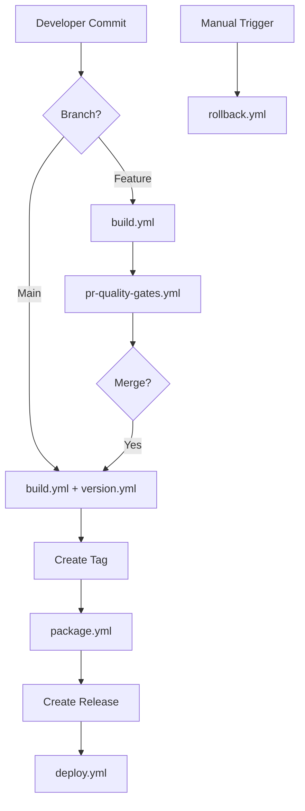
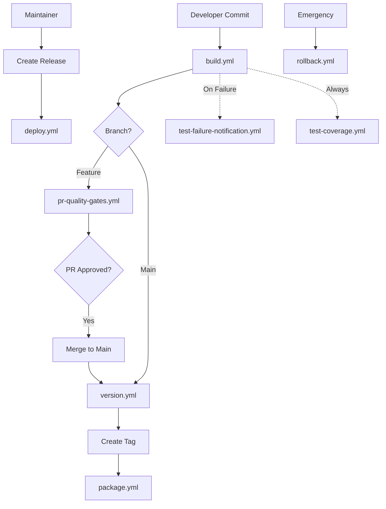
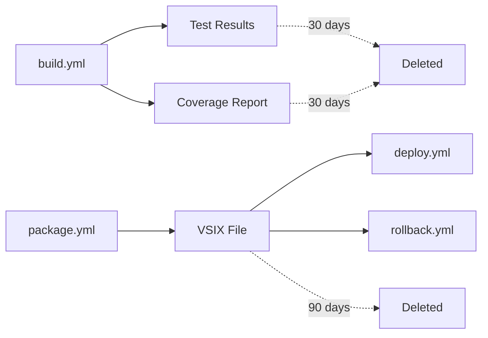

# GitHub Actions Workflows Documentation

## Overview

This document provides comprehensive documentation for all GitHub Actions workflows in the Pragmatic Rhino SUIT CI/CD pipeline. Each workflow is documented with its purpose, trigger conditions, inputs, outputs, and expected behavior.

**Target Audience:** Developers, DevOps engineers, release managers, repository maintainers

**Prerequisites:**
- Understanding of GitHub Actions
- Familiarity with VS Code extension development
- Access to repository (read access minimum)

---

## Table of Contents

1. [Workflow Architecture](#workflow-architecture)
2. [Core Build Workflows](#core-build-workflows)
3. [Quality Gate Workflows](#quality-gate-workflows)
4. [Release Workflows](#release-workflows)
5. [Deployment Workflows](#deployment-workflows)
6. [Utility Workflows](#utility-workflows)
7. [Workflow Dependencies](#workflow-dependencies)
8. [Troubleshooting](#troubleshooting)

---

## Workflow Architecture

### Pipeline Overview




### Workflow Execution Environments

| Environment | Workflows | Purpose | Approval Required |
|-------------|-----------|---------|-------------------|
| **Development** | build.yml | Fast feedback on commits | No |
| **Pull Request** | pr-quality-gates.yml | Quality validation before merge | No (automated) |
| **Staging** | version.yml | Version management on main | No |
| **Production** | deploy.yml | Marketplace deployment | Optional (configurable) |
| **Emergency** | rollback.yml | Rollback failed deployments | Yes (manual trigger) |

---

## Core Build Workflows

### 1. build.yml - Automated Build Pipeline

**File:** `.github/workflows/build.yml`

**Purpose:** Provides fast feedback on code quality by compiling, testing, and validating code on every commit. This is the foundation of the CI/CD pipeline and ensures code meets minimum quality standards before proceeding to other workflows.

**Trigger Conditions:**

```yaml
on:
  push:
    branches: ['**']  # All branches
  pull_request:
    branches: ['**']  # All PRs
  workflow_dispatch:  # Manual trigger
```

**Triggered By:**
- Any commit pushed to any branch
- Pull request opened, synchronized, or reopened
- Manual execution via GitHub Actions UI

**Inputs:** None (uses repository code at trigger commit)

**Outputs:**

| Output | Type | Description | Retention |
|--------|------|-------------|-----------|
| Build status | Status check | Pass/fail indicator | Permanent |
| Test results | Artifact | Jest test results (JSON/XML) | 30 days |
| Coverage report | Artifact | Istanbul coverage report | 30 days |
| Compiled code | Build output | JavaScript files (not uploaded) | N/A |


**Execution Steps:**

1. **Checkout Code** (`actions/checkout@v4`)
   - Fetches repository code at trigger commit
   - Includes full git history for accurate versioning

2. **Setup Node.js** (`actions/setup-node@v4`)
   - Installs Node.js 18.x (LTS)
   - Configures npm cache for faster dependency installation

3. **Install Dependencies** (`npm ci`)
   - Installs exact versions from package-lock.json
   - Ensures reproducible builds
   - Fails if package-lock.json is out of sync

4. **Compile TypeScript** (`npm run compile`)
   - Compiles TypeScript to JavaScript
   - Generates source maps for debugging
   - Fails on compilation errors or type errors

5. **Run Linting** (`npm run lint`)
   - Executes ESLint with project configuration
   - Checks code style and quality
   - Fails on linting errors (warnings allowed)

6. **Execute Tests** (`npm test`)
   - Runs Jest unit tests
   - Generates test results in multiple formats
   - Fails if any test fails

7. **Generate Coverage** (`npm run test:coverage`)
   - Collects code coverage metrics
   - Generates HTML and JSON reports
   - Validates 80% minimum coverage threshold

8. **Upload Artifacts** (`actions/upload-artifact@v4`)
   - Uploads test results for analysis
   - Uploads coverage reports for review
   - Sets 30-day retention period


**Quality Gates:**

| Gate | Threshold | Action on Failure |
|------|-----------|-------------------|
| Compilation | Must succeed | Fail workflow, block PR |
| Linting | No errors | Fail workflow, block PR |
| Tests | 100% pass rate | Fail workflow, block PR |
| Coverage | ≥ 80% | Fail workflow, block PR |

**Expected Duration:** 3-5 minutes

**Success Criteria:**
- ✅ All dependencies installed successfully
- ✅ TypeScript compilation completes without errors
- ✅ ESLint passes with no errors
- ✅ All tests pass
- ✅ Code coverage meets 80% threshold
- ✅ Artifacts uploaded successfully

**Failure Scenarios:**

| Scenario | Cause | Resolution |
|----------|-------|------------|
| Compilation failure | TypeScript errors | Fix type errors in code |
| Linting failure | Code style violations | Run `npm run lint:fix` locally |
| Test failure | Failing unit tests | Fix failing tests |
| Coverage failure | Coverage < 80% | Add tests for uncovered code |
| Dependency failure | package-lock.json out of sync | Run `npm install` and commit lock file |

**Monitoring:**
- View workflow runs in GitHub Actions tab
- Check status checks on commits and PRs
- Review artifacts for detailed test results
- Monitor build duration for performance regression

**Manual Trigger:**
1. Go to Actions tab
2. Select "Build" workflow
3. Click "Run workflow"
4. Select branch
5. Click "Run workflow" button

---


## Quality Gate Workflows

### 2. pr-quality-gates.yml - Pull Request Validation

**File:** `.github/workflows/pr-quality-gates.yml`

**Purpose:** Enforces comprehensive quality standards on pull requests before allowing merge to main branch. Extends the build workflow with additional security and validation checks to ensure only high-quality code enters the main codebase.

**Trigger Conditions:**

```yaml
on:
  pull_request:
    types: [opened, synchronize, reopened]
    branches: [main, develop]
```

**Triggered By:**
- Pull request opened against main or develop branch
- New commits pushed to PR branch (synchronize)
- Closed PR reopened

**Inputs:**
- PR source branch code
- PR base branch for comparison
- PR metadata (number, title, author)

**Outputs:**

| Output | Type | Description | Retention |
|--------|------|-------------|-----------|
| PR check status | Status check | Pass/fail for merge blocking | Permanent |
| Status comment | PR comment | Detailed results summary | Permanent |
| Security report | Artifact | npm audit results | 30 days |
| Test results | Artifact | Full test suite results | 30 days |
| Coverage report | Artifact | Code coverage analysis | 30 days |


**Execution Steps:**

1. **Run Build Pipeline**
   - Executes all steps from build.yml
   - Ensures code compiles, tests pass, coverage meets threshold

2. **Security Vulnerability Scanning** (`npm audit`)
   - Scans dependencies for known vulnerabilities
   - Checks against npm security advisories
   - Generates vulnerability report

3. **Version Validation** (`scripts/validate-version.js`)
   - Validates package.json version follows semantic versioning
   - Checks version is incremented from base branch
   - Ensures no version conflicts

4. **Post Status Comment**
   - Creates or updates PR comment with results
   - Includes test results, coverage percentage
   - Lists any security vulnerabilities found
   - Provides actionable remediation steps

**Quality Gates:**

| Gate | Threshold | Action on Failure |
|------|-----------|-------------------|
| Build checks | All pass | Block PR merge |
| Security scan | No critical/high | Block PR merge |
| Version format | Valid SemVer | Block PR merge |
| Version increment | Must be incremented | Block PR merge |
| Coverage | ≥ 80% | Block PR merge |

**Expected Duration:** 4-6 minutes

**Success Criteria:**
- ✅ All build checks pass
- ✅ No critical or high severity vulnerabilities
- ✅ Version follows semantic versioning format
- ✅ Version incremented from base branch
- ✅ Status comment posted with results


**Failure Scenarios:**

| Scenario | Cause | Resolution |
|----------|-------|------------|
| Security vulnerabilities | Vulnerable dependencies | Update dependencies with `npm audit fix` |
| Invalid version | Non-SemVer format | Update package.json with valid version (e.g., 1.2.3) |
| Version not incremented | Same version as base | Increment version in package.json |
| Build failures | See build.yml failures | Fix underlying build issues |

**Status Comment Format:**

```markdown
## PR Quality Gates Results

### ✅ Build Status: PASSED
- Compilation: ✅ Success
- Linting: ✅ No errors
- Tests: ✅ 45/45 passed
- Coverage: ✅ 85.2% (threshold: 80%)

### ✅ Security Scan: PASSED
- Critical: 0
- High: 0
- Medium: 2 (acceptable)
- Low: 5

### ✅ Version Validation: PASSED
- Current version: 1.2.3
- Format: Valid SemVer
- Increment: Patch version bumped

**Ready for review and merge** ✅
```

**Monitoring:**
- Check PR status checks before requesting review
- Review status comment for detailed results
- Address any failures before merge
- Monitor for flaky tests or intermittent failures

---


## Release Workflows

### 3. version.yml - Automated Versioning

**File:** `.github/workflows/version.yml`

**Purpose:** Automatically manages semantic versioning based on conventional commit messages. Analyzes commits merged to main branch, determines appropriate version bump, updates package files, generates changelog, and creates git tags for release tracking.

**Trigger Conditions:**

```yaml
on:
  push:
    branches: [main]
  workflow_dispatch:  # Manual trigger
```

**Triggered By:**
- Commits pushed to main branch (typically from merged PRs)
- Manual execution for version corrections

**Inputs:**
- Commit messages since last version tag
- Current version from package.json
- Git history for changelog generation

**Outputs:**

| Output | Type | Description | Retention |
|--------|------|-------------|-----------|
| New version | Git tag | Semantic version tag (v1.2.3) | Permanent |
| Updated package.json | Commit | Version number updated | Permanent |
| Updated CHANGELOG.md | Commit | Generated changelog entries | Permanent |
| Version bump type | Workflow output | major/minor/patch | N/A |


**Execution Steps:**

1. **Analyze Commits** (`scripts/analyze-version.js`)
   - Fetches commits since last version tag
   - Parses commit messages for conventional commit format
   - Determines version bump type based on commit types

2. **Calculate New Version**
   - Reads current version from package.json
   - Applies version bump (major/minor/patch)
   - Validates new version format

3. **Update Package Files** (`scripts/update-version.js`)
   - Updates version in package.json
   - Updates version in package-lock.json
   - Ensures consistency across files

4. **Generate Changelog** (`scripts/generate-changelog.js`)
   - Groups commits by type (feat, fix, chore, etc.)
   - Formats entries according to Keep a Changelog
   - Prepends new entries to CHANGELOG.md
   - Includes commit links and authors

5. **Commit Changes**
   - Commits updated files with message: `chore: bump version to X.Y.Z`
   - Configures git user as GitHub Actions bot
   - Pushes commit to main branch

6. **Create Git Tag**
   - Creates annotated tag with version number (vX.Y.Z)
   - Includes changelog summary in tag message
   - Pushes tag to remote repository


**Versioning Rules:**

| Commit Message Pattern | Version Bump | Example |
|------------------------|--------------|---------|
| `BREAKING CHANGE:` or `!` | Major (X.0.0) | 1.2.3 → 2.0.0 |
| `feat:` | Minor (0.X.0) | 1.2.3 → 1.3.0 |
| `fix:` | Patch (0.0.X) | 1.2.3 → 1.2.4 |
| `chore:`, `docs:`, `style:` | Patch (0.0.X) | 1.2.3 → 1.2.4 |
| No conventional commits | Patch (0.0.X) | 1.2.3 → 1.2.4 |

**Conventional Commit Examples:**

```bash
# Major version bump
git commit -m "feat!: redesign extension API

BREAKING CHANGE: Extension API completely redesigned"

# Minor version bump
git commit -m "feat: add diagram export feature"

# Patch version bump
git commit -m "fix: correct file path resolution on Windows"
git commit -m "chore: update dependencies"
```

**Expected Duration:** 1-2 minutes

**Success Criteria:**
- ✅ Commits analyzed successfully
- ✅ Version bump determined correctly
- ✅ package.json and package-lock.json updated
- ✅ CHANGELOG.md generated with new entries
- ✅ Changes committed to main branch
- ✅ Git tag created and pushed


**Failure Scenarios:**

| Scenario | Cause | Resolution |
|----------|-------|------------|
| No commits to analyze | No commits since last tag | Wait for commits or trigger manually |
| Invalid version format | Corrupted package.json | Fix version format manually |
| Tag already exists | Version tag conflict | Delete tag or increment version manually |
| Push failure | Permission issues | Check GitHub token permissions |
| Changelog generation failure | Malformed commit messages | Fix commit message format |

**Monitoring:**
- Check for new version tags in repository
- Verify CHANGELOG.md is updated
- Confirm package.json version matches tag
- Monitor for version conflicts or skipped versions

**Manual Trigger:**
1. Go to Actions tab
2. Select "Version" workflow
3. Click "Run workflow"
4. Select main branch
5. Click "Run workflow" button
6. Workflow will analyze commits and create version

**Troubleshooting:**
- If version not created, check commit messages follow conventional commits
- If wrong version bump, review commit message prefixes
- If tag exists, delete tag and re-run workflow
- If push fails, check repository permissions

---


### 4. package.yml - Extension Packaging

**File:** `.github/workflows/package.yml`

**Purpose:** Creates production-ready VSIX package for VS Code Marketplace deployment. Triggered by version tags, this workflow compiles the extension in production mode, packages it using vsce, validates the package structure, and uploads it as an artifact for deployment.

**Trigger Conditions:**

```yaml
on:
  push:
    tags:
      - 'v*.*.*'  # Semantic version tags only
  workflow_dispatch:
    inputs:
      tag:
        description: 'Version tag to package'
        required: true
```

**Triggered By:**
- Version tag pushed by version.yml workflow
- Manual execution with specific tag

**Inputs:**
- Git tag (e.g., v1.2.3)
- Source code at tagged commit
- package.json with version matching tag

**Outputs:**

| Output | Type | Description | Retention |
|--------|------|-------------|-----------|
| VSIX file | Artifact | Extension package | 90 days |
| Package metadata | Workflow output | Version, size, checksum | N/A |
| Validation report | Workflow log | Structure validation results | 90 days |


**Execution Steps:**

1. **Validate Tag Format**
   - Checks tag matches semantic versioning pattern (vX.Y.Z)
   - Extracts version number from tag
   - Fails if tag format invalid

2. **Checkout Tagged Commit**
   - Checks out exact commit referenced by tag
   - Ensures package matches tagged version
   - Includes full git history for metadata

3. **Setup Node.js**
   - Installs Node.js 18.x (LTS)
   - Configures npm cache

4. **Install Production Dependencies**
   - Runs `npm ci --production`
   - Installs only production dependencies
   - Excludes devDependencies to reduce package size

5. **Compile TypeScript**
   - Compiles in production mode
   - Optimizes output for distribution
   - Generates source maps (optional)

6. **Package Extension** (`vsce package`)
   - Runs Visual Studio Code Extension Manager
   - Creates .vsix file with version in filename
   - Bundles all required files
   - Excludes development files (.git, tests, etc.)

7. **Validate Package** (`scripts/validate-vsix.js`)
   - Verifies VSIX structure is valid
   - Checks manifest version matches tag
   - Validates required files are included
   - Checks file size is within limits
   - Verifies no development dependencies bundled

8. **Upload Artifact**
   - Uploads VSIX file to GitHub Actions artifacts
   - Sets 90-day retention period
   - Includes metadata (version, size, checksum)


**Quality Gates:**

| Gate | Threshold | Action on Failure |
|------|-----------|-------------------|
| Tag format | Valid SemVer | Fail workflow |
| Compilation | Must succeed | Fail workflow |
| Package creation | VSIX created | Fail workflow |
| Structure validation | Valid structure | Fail workflow |
| Version match | Tag = manifest | Fail workflow |
| File size | < 50 MB | Fail workflow |

**Expected Duration:** 2-4 minutes

**Success Criteria:**
- ✅ Tag format validated
- ✅ Code compiled successfully
- ✅ VSIX file created
- ✅ Package structure valid
- ✅ Version matches tag
- ✅ No development dependencies included
- ✅ Artifact uploaded successfully

**Failure Scenarios:**

| Scenario | Cause | Resolution |
|----------|-------|------------|
| Invalid tag format | Tag doesn't match vX.Y.Z | Create tag with correct format |
| Compilation failure | TypeScript errors | Fix errors and create new tag |
| Package creation failure | vsce errors | Check package.json configuration |
| Version mismatch | package.json ≠ tag | Update package.json and create new tag |
| File size too large | Package > 50 MB | Reduce bundle size, exclude unnecessary files |
| Missing files | Required files not included | Update .vscodeignore |


**VSIX Package Contents:**

```
pragmatic-rhino-suit-1.2.3.vsix
├── extension.vsixmanifest  # Extension metadata
├── package.json            # Extension manifest
├── README.md               # User documentation
├── LICENSE                 # License file
├── CHANGELOG.md            # Version history
├── out/                    # Compiled JavaScript
│   ├── extension.js
│   └── ...
├── resources/              # Extension resources
│   ├── frameworks/
│   ├── schemas/
│   └── images/
└── node_modules/           # Production dependencies only
```

**Monitoring:**
- Check workflow runs after tag push
- Verify VSIX artifact is created
- Download and test VSIX locally before deployment
- Monitor package size trends

**Manual Trigger:**
1. Go to Actions tab
2. Select "Package" workflow
3. Click "Run workflow"
4. Enter version tag (e.g., v1.2.3)
5. Click "Run workflow" button

---


## Deployment Workflows

### 5. deploy.yml - Marketplace Deployment

**File:** `.github/workflows/deploy.yml`

**Purpose:** Publishes the extension to the Visual Studio Code Marketplace. Triggered by GitHub release creation, this workflow downloads the VSIX package, authenticates with the marketplace, publishes the extension, verifies deployment success, and notifies the team.

**Trigger Conditions:**

```yaml
on:
  release:
    types: [published]
  workflow_dispatch:
    inputs:
      release_tag:
        description: 'Release tag to deploy'
        required: true
```

**Triggered By:**
- GitHub release published (manual action by maintainer)
- Manual execution for redeployment

**Inputs:**
- Release tag (e.g., v1.2.3)
- VSIX artifact from package workflow
- VSCE_PAT secret for authentication

**Outputs:**

| Output | Type | Description | Retention |
|--------|------|-------------|-----------|
| Deployment status | Status check | Success/failure indicator | Permanent |
| Marketplace link | Release comment | Link to published extension | Permanent |
| Deployment metrics | Workflow output | Duration, version, timestamp | 90 days |
| Notification | External | Team notification message | N/A |


**Execution Steps:**

1. **Download VSIX Artifact**
   - Downloads VSIX from package workflow artifacts
   - Verifies artifact exists for release tag
   - Validates file integrity

2. **Authenticate with Marketplace**
   - Retrieves VSCE_PAT secret
   - Authenticates with Visual Studio Code Marketplace
   - Validates token is not expired

3. **Publish Extension** (`vsce publish`)
   - Uploads VSIX to marketplace
   - Waits for marketplace processing
   - Handles marketplace validation

4. **Verify Deployment** (`scripts/verify-deployment.js`)
   - Checks extension is live on marketplace
   - Validates version number is correct
   - Confirms extension is publicly accessible

5. **Post Success Comment**
   - Adds comment to GitHub release
   - Includes marketplace link
   - Includes deployment metrics (duration, timestamp)

6. **Send Notifications**
   - Sends success notification to configured channels
   - Includes marketplace link and version
   - Includes deployment metrics


**Quality Gates:**

| Gate | Threshold | Action on Failure |
|------|-----------|-------------------|
| Artifact exists | Must be available | Fail workflow, notify team |
| Authentication | Valid VSCE_PAT | Fail workflow, notify team |
| Marketplace publish | Accepted by marketplace | Fail workflow, notify team |
| Verification | Extension live | Fail workflow, notify team |

**Expected Duration:** 5-10 minutes (includes marketplace processing)

**Success Criteria:**
- ✅ VSIX artifact downloaded successfully
- ✅ Marketplace authentication successful
- ✅ Extension published to marketplace
- ✅ Extension verified as live
- ✅ Success comment posted on release
- ✅ Team notified of successful deployment

**Failure Scenarios:**

| Scenario | Cause | Resolution |
|----------|-------|------------|
| Artifact not found | Package workflow didn't run | Run package workflow manually |
| Authentication failure | VSCE_PAT expired or invalid | Rotate VSCE_PAT secret |
| Marketplace rejection | Package validation failed | Review marketplace error, fix and republish |
| Verification timeout | Marketplace processing slow | Wait and retry, or verify manually |
| Network failure | Connectivity issues | Retry workflow |


**Required Secrets:**

| Secret | Description | Rotation Period |
|--------|-------------|-----------------|
| `VSCE_PAT` | Visual Studio Code Marketplace Personal Access Token | 90 days |

**Setting Up VSCE_PAT:**
1. Go to https://dev.azure.com/
2. Click user settings → Personal Access Tokens
3. Create new token with:
   - Name: "VS Code Marketplace - Pragmatic Rhino SUIT"
   - Organization: All accessible organizations
   - Expiration: 90 days
   - Scopes: Marketplace (Publish)
4. Copy token value
5. Add to GitHub repository secrets as `VSCE_PAT`
6. Document expiration date in calendar

See `docs/deployment/SECRETS.md` for detailed instructions.

**Monitoring:**
- Check workflow runs after release creation
- Verify extension appears on marketplace
- Monitor marketplace metrics (installs, ratings)
- Track deployment frequency and success rate

**Manual Trigger:**
1. Go to Actions tab
2. Select "Deploy to Marketplace" workflow
3. Click "Run workflow"
4. Enter release tag (e.g., v1.2.3)
5. Click "Run workflow" button

---


### 6. rollback.yml - Rollback Capability

**File:** `.github/workflows/rollback.yml`

**Purpose:** Provides emergency rollback capability to quickly revert to a previous stable version. This manual workflow allows maintainers to republish an older version to the marketplace in case of critical issues with the current release.

**Trigger Conditions:**

```yaml
on:
  workflow_dispatch:
    inputs:
      version_tag:
        description: 'Version tag to rollback to (e.g., v1.2.2)'
        required: true
      reason:
        description: 'Reason for rollback'
        required: true
```

**Triggered By:**
- Manual execution only (emergency use)

**Inputs:**
- Version tag to rollback to (e.g., v1.2.2)
- Reason for rollback (for documentation)

**Outputs:**

| Output | Type | Description | Retention |
|--------|------|-------------|-----------|
| Rollback status | Workflow output | Success/failure indicator | 90 days |
| Release comment | GitHub comment | Rollback documentation | Permanent |
| Notification | External | Team alert message | N/A |


**Execution Steps:**

1. **Validate Version Tag**
   - Checks tag exists in repository
   - Verifies tag matches semantic versioning
   - Confirms tag is older than current version

2. **Download VSIX Artifact**
   - Retrieves VSIX for specified version
   - Checks artifact is available (within 90-day retention)
   - Validates file integrity

3. **Authenticate with Marketplace**
   - Uses VSCE_PAT secret
   - Validates authentication

4. **Republish to Marketplace**
   - Publishes older version using `vsce publish`
   - Marketplace accepts version downgrade
   - Waits for processing confirmation

5. **Update Release Notes**
   - Adds rollback comment to original release
   - Documents rollback reason
   - Includes timestamp and executor

6. **Send Rollback Notification**
   - Alerts team of rollback
   - Includes version rolled back to
   - Includes reason and action items

**Expected Duration:** 5-10 minutes

**Success Criteria:**
- ✅ Version tag validated
- ✅ VSIX artifact retrieved
- ✅ Marketplace authentication successful
- ✅ Older version republished
- ✅ Release notes updated
- ✅ Team notified


**Failure Scenarios:**

| Scenario | Cause | Resolution |
|----------|-------|------------|
| Artifact not available | Version > 90 days old | Download from external archive or rebuild |
| Authentication failure | VSCE_PAT expired | Rotate secret and retry |
| Marketplace rejection | Version conflict | Contact marketplace support |
| Invalid version tag | Tag doesn't exist | Verify tag name and retry |

**When to Use Rollback:**
- Critical bug discovered in production
- Security vulnerability in current version
- Extension causing VS Code crashes
- Data loss or corruption issues
- Marketplace compliance violation

**Rollback Procedure:**
1. Identify stable version to rollback to
2. Go to Actions tab
3. Select "Rollback" workflow
4. Click "Run workflow"
5. Enter version tag (e.g., v1.2.2)
6. Enter rollback reason
7. Click "Run workflow" button
8. Monitor workflow execution
9. Verify extension version on marketplace
10. Notify users of rollback
11. Create hotfix for issue
12. Deploy fixed version

**Post-Rollback Actions:**
- Document incident in postmortem
- Identify root cause of issue
- Create hotfix branch
- Test fix thoroughly
- Deploy new version with fix

---


## Utility Workflows

### 7. test-coverage.yml - Coverage Reporting

**File:** `.github/workflows/test-coverage.yml`

**Purpose:** Generates and uploads detailed code coverage reports for analysis and tracking. Provides visibility into test coverage trends and identifies untested code paths.

**Trigger Conditions:**
- Push to main branch
- Pull request events
- Manual trigger

**Outputs:**
- Coverage report artifact
- Coverage badge data
- Coverage trend metrics

### 8. test-failure-notification.yml - Test Failure Alerts

**File:** `.github/workflows/test-failure-notification.yml`

**Purpose:** Sends immediate notifications when tests fail on main branch. Ensures team is quickly aware of broken builds that need attention.

**Trigger Conditions:**
- Test failure on main branch
- Build failure on main branch

**Outputs:**
- Notification to configured channels
- Failure details and logs
- Suggested remediation steps

---


## Workflow Dependencies

### Dependency Graph



### Workflow Execution Order

1. **Development Phase:**
   - `build.yml` runs on every commit
   - `test-coverage.yml` generates coverage reports
   - `test-failure-notification.yml` alerts on failures

2. **Pull Request Phase:**
   - `pr-quality-gates.yml` validates PR
   - Blocks merge if quality gates fail

3. **Release Phase:**
   - `version.yml` creates version tag on merge to main
   - `package.yml` creates VSIX when tag pushed

4. **Deployment Phase:**
   - Maintainer creates GitHub release
   - `deploy.yml` publishes to marketplace

5. **Emergency Phase:**
   - `rollback.yml` available for manual rollback


### Artifact Flow



### Workflow Interactions

| Workflow | Depends On | Triggers | Artifacts Used |
|----------|------------|----------|----------------|
| build.yml | None | Push, PR | None |
| pr-quality-gates.yml | build.yml | PR events | None |
| version.yml | None | Push to main | None |
| package.yml | version.yml | Tag push | None |
| deploy.yml | package.yml | Release | VSIX from package.yml |
| rollback.yml | package.yml | Manual | VSIX from package.yml |

---


## Troubleshooting

### Common Issues and Solutions

#### Build Failures

**Symptom:** build.yml workflow fails

**Common Causes:**
1. **Compilation errors**
   - Check TypeScript errors in logs
   - Run `npm run compile` locally
   - Fix type errors and push

2. **Test failures**
   - Review failed test output
   - Run `npm test` locally
   - Fix failing tests

3. **Coverage below threshold**
   - Check coverage report
   - Add tests for uncovered code
   - Run `npm run test:coverage` locally

4. **Dependency issues**
   - Delete node_modules and package-lock.json
   - Run `npm install`
   - Commit updated package-lock.json

**Resolution Steps:**
```bash
# Local debugging
npm install
npm run compile
npm run lint
npm test
npm run test:coverage

# Fix issues and push
git add .
git commit -m "fix: resolve build issues"
git push
```


#### PR Quality Gate Failures

**Symptom:** pr-quality-gates.yml blocks merge

**Common Causes:**
1. **Security vulnerabilities**
   - Run `npm audit`
   - Update vulnerable dependencies
   - Run `npm audit fix`

2. **Invalid version**
   - Check package.json version
   - Ensure version follows SemVer (X.Y.Z)
   - Increment version from base branch

3. **Version not incremented**
   - Compare version with base branch
   - Increment patch, minor, or major version
   - Commit updated package.json

**Resolution Steps:**
```bash
# Fix security vulnerabilities
npm audit
npm audit fix
npm test  # Verify fixes don't break tests

# Fix version
# Edit package.json, increment version
git add package.json
git commit -m "chore: bump version to 1.2.4"
git push
```


#### Version Workflow Issues

**Symptom:** version.yml doesn't create tag

**Common Causes:**
1. **No conventional commits**
   - Check commit messages
   - Ensure commits follow conventional format
   - Use feat:, fix:, chore: prefixes

2. **Tag already exists**
   - Check existing tags
   - Delete conflicting tag if needed
   - Re-run workflow

3. **Permission issues**
   - Check GitHub token permissions
   - Verify workflow has write access

**Resolution Steps:**
```bash
# Check existing tags
git tag -l

# Delete conflicting tag (if needed)
git tag -d v1.2.3
git push origin :refs/tags/v1.2.3

# Fix commit messages (if needed)
git commit --amend -m "feat: add new feature"
git push --force

# Manually trigger workflow
# Go to Actions → Version → Run workflow
```


#### Package Workflow Issues

**Symptom:** package.yml fails to create VSIX

**Common Causes:**
1. **Invalid tag format**
   - Ensure tag matches vX.Y.Z pattern
   - Create tag with correct format

2. **Compilation errors**
   - Check TypeScript compilation
   - Fix errors and create new tag

3. **Package too large**
   - Check .vscodeignore
   - Exclude unnecessary files
   - Reduce bundle size

4. **Version mismatch**
   - Ensure package.json version matches tag
   - Update package.json and create new tag

**Resolution Steps:**
```bash
# Test packaging locally
npm run vsce package

# Check package size
ls -lh *.vsix

# Update .vscodeignore if needed
echo "test/" >> .vscodeignore
echo "*.test.ts" >> .vscodeignore

# Create new tag
git tag v1.2.3
git push origin v1.2.3
```


#### Deployment Workflow Issues

**Symptom:** deploy.yml fails to publish

**Common Causes:**
1. **VSCE_PAT expired**
   - Check token expiration
   - Rotate VSCE_PAT secret
   - See SECRETS.md for instructions

2. **Artifact not found**
   - Verify package workflow ran successfully
   - Check artifact retention (90 days)
   - Re-run package workflow if needed

3. **Marketplace rejection**
   - Review marketplace error message
   - Fix validation issues
   - Republish

4. **Network timeout**
   - Retry workflow
   - Check marketplace status
   - Wait for marketplace processing

**Resolution Steps:**
```bash
# Check VSCE_PAT expiration
# Go to Azure DevOps → Personal Access Tokens

# Rotate secret
# 1. Create new PAT
# 2. Update GitHub secret
# 3. Retry workflow

# Re-run package workflow
# Go to Actions → Package → Run workflow

# Retry deployment
# Go to Actions → Deploy → Re-run failed jobs
```


### Debugging Workflows

**View Workflow Logs:**
1. Go to repository Actions tab
2. Select workflow run
3. Click on failed job
4. Expand failed step
5. Review error messages and stack traces

**Download Artifacts:**
```bash
# Using GitHub CLI
gh run list --workflow=build.yml
gh run download <run-id>

# Or via web interface
# Actions → Workflow run → Artifacts section → Download
```

**Re-run Failed Workflows:**
1. Go to failed workflow run
2. Click "Re-run failed jobs" button
3. Or click "Re-run all jobs" to start fresh

**Enable Debug Logging:**
Add repository secret `ACTIONS_STEP_DEBUG` with value `true` for verbose logs.

---


## Best Practices

### Commit Messages

Follow Conventional Commits specification for automatic versioning:

```bash
# Feature (minor version bump)
git commit -m "feat: add diagram export functionality"

# Bug fix (patch version bump)
git commit -m "fix: resolve file path issue on Windows"

# Breaking change (major version bump)
git commit -m "feat!: redesign extension API

BREAKING CHANGE: API completely redesigned, see migration guide"

# Chore (patch version bump)
git commit -m "chore: update dependencies"

# Documentation (patch version bump)
git commit -m "docs: update README with new features"
```

### Pull Request Workflow

1. Create feature branch from main
2. Make changes and commit with conventional messages
3. Push branch and create PR
4. Wait for pr-quality-gates.yml to pass
5. Address any failures
6. Request review from team
7. Merge when approved and checks pass

### Release Workflow

1. Merge PR to main branch
2. version.yml automatically creates tag
3. package.yml automatically creates VSIX
4. Create GitHub release from tag
5. deploy.yml automatically publishes to marketplace
6. Verify extension on marketplace
7. Monitor for issues


### Monitoring and Maintenance

**Daily:**
- Check workflow run status
- Review failed builds
- Monitor test coverage trends

**Weekly:**
- Review security alerts
- Update dependencies
- Check artifact storage usage

**Monthly:**
- Review DORA metrics
- Analyze deployment frequency
- Identify workflow optimization opportunities

**Quarterly:**
- Test rollback procedure
- Review and update documentation
- Audit secrets and rotate if needed

### Performance Optimization

**Reduce Build Time:**
- Use npm cache
- Parallelize independent steps
- Optimize test execution
- Use matrix strategy for multi-platform testing

**Reduce Artifact Size:**
- Update .vscodeignore
- Exclude unnecessary files
- Use production dependencies only
- Minify resources

---


## Document Maintenance

**Last Updated:** 2025-01-10  
**Next Review:** 2025-04-10  
**Owner:** DevOps Team  
**Reviewers:** Development Team, Release Managers

**Change Log:**
- 2025-01-10: Initial workflow documentation created

---

## Additional Resources

### Official Documentation

- [GitHub Actions Documentation](https://docs.github.com/en/actions)
- [VS Code Extension Publishing](https://code.visualstudio.com/api/working-with-extensions/publishing-extension)
- [vsce CLI Documentation](https://github.com/microsoft/vscode-vsce)
- [Conventional Commits](https://www.conventionalcommits.org/)
- [Semantic Versioning](https://semver.org/)

### Internal Documentation

- [Requirements](../../.kiro/specs/github-actions-marketplace-deploy/requirements.md)
- [Design](../../.kiro/specs/github-actions-marketplace-deploy/design.md)
- [Tasks](../../.kiro/specs/github-actions-marketplace-deploy/tasks.md)
- [Secrets Setup](./SECRETS.md)
- [Deployment Runbook](./RUNBOOK.md)
- [Audit Logging](./AUDIT_LOGGING.md)

### Support Contacts

- **DevOps Team:** devops@pragmatic-rhino.com
- **Development Team:** dev@pragmatic-rhino.com
- **Release Managers:** releases@pragmatic-rhino.com

---


## Quick Reference

### Workflow Trigger Summary

| Workflow | Trigger | Frequency | Manual |
|----------|---------|-----------|--------|
| build.yml | Push, PR | Every commit | Yes |
| pr-quality-gates.yml | PR events | Per PR update | No |
| version.yml | Push to main | Per merge | Yes |
| package.yml | Tag push | Per version | Yes |
| deploy.yml | Release published | Per release | Yes |
| rollback.yml | Manual only | Emergency | Yes |

### Quality Gate Summary

| Workflow | Gates | Threshold |
|----------|-------|-----------|
| build.yml | Compile, lint, test, coverage | 80% coverage |
| pr-quality-gates.yml | Build + security + version | No critical/high vulns |
| package.yml | Compile, package, validate | Valid VSIX |
| deploy.yml | Artifact, auth, publish, verify | Extension live |

### Artifact Retention

| Artifact | Retention | Workflow |
|----------|-----------|----------|
| Test results | 30 days | build.yml |
| Coverage reports | 30 days | build.yml |
| VSIX packages | 90 days | package.yml |

### Required Secrets

| Secret | Purpose | Rotation |
|--------|---------|----------|
| VSCE_PAT | Marketplace publishing | 90 days |
| GITHUB_TOKEN | GitHub API (automatic) | Per run |

