# C4 Model for Software Architecture

## Table of Contents

- [Introduction & Quick Start](#introduction--quick-start)
  - [30-Second Elevator Pitch](#30-second-elevator-pitch)
  - [When to Use C4](#when-to-use-c4)
  - [5-Minute Quick Start Guide](#5-minute-quick-start-guide)
  - [Quick Reference: Use Cases to Diagram Types](#quick-reference-use-cases-to-diagram-types)
- [Overview](#overview)
- [The Four Levels (Core Diagrams)](#the-four-levels-core-diagrams)
  - [Level 1: System Context Diagram](#level-1-system-context-diagram)
  - [Level 2: Container Diagram](#level-2-container-diagram)
  - [Level 3: Component Diagram](#level-3-component-diagram)
  - [Level 4: Code Diagram (Optional)](#level-4-code-diagram-optional)
- [Best Practices by Level](#best-practices-by-level)
  - [System Context Level Best Practices](#system-context-level-best-practices)
  - [Container Level Best Practices](#container-level-best-practices)
  - [Component Level Best Practices](#component-level-best-practices)
  - [Code Level Best Practices](#code-level-best-practices)
- [Anti-Patterns and Common Mistakes](#anti-patterns-and-common-mistakes)
  - [Abstraction Level Violations](#abstraction-level-violations)
  - [Over-Documentation Anti-Patterns](#over-documentation-anti-patterns)
  - [Under-Documentation Anti-Patterns](#under-documentation-anti-patterns)
  - [Notation Problems](#notation-problems)
  - [Maintenance Issues](#maintenance-issues)
- [Real-World Examples](#real-world-examples)
  - [Example 1: E-Commerce Platform](#example-1-e-commerce-platform)
  - [Example 2: Healthcare Patient Portal](#example-2-healthcare-patient-portal)
  - [Example 3: Financial Trading Platform](#example-3-financial-trading-platform)
- [Step-by-Step Creation Guide](#step-by-step-creation-guide)
  - [Creating a System Context Diagram](#creating-a-system-context-diagram)
  - [Creating a Container Diagram](#creating-a-container-diagram)
  - [Creating a Component Diagram](#creating-a-component-diagram)
- [Notation Standards and Style Guide](#notation-standards-and-style-guide)
  - [Element Notation Standards](#element-notation-standards)
  - [Relationship Notation](#relationship-notation)
  - [Text and Labeling Standards](#text-and-labeling-standards)
  - [Legend and Key Requirements](#legend-and-key-requirements)
  - [Layout Guidelines](#layout-guidelines)
  - [Accessibility Considerations](#accessibility-considerations)
  - [Tool-Specific Guidance](#tool-specific-guidance)
- [Supplementary Diagrams](#supplementary-diagrams)
  - [System Landscape Diagram](#system-landscape-diagram)
  - [Dynamic Diagram](#dynamic-diagram)
  - [Deployment Diagram](#deployment-diagram)
- [Core Abstractions](#core-abstractions)
- [Notation Guidelines](#notation-guidelines)
- [Benefits of C4 Model](#benefits-of-c4-model)
- [C4 vs Other Frameworks](#c4-vs-other-frameworks)
- [When to Use C4 Model](#when-to-use-c4-model)
- [Practical Application](#practical-application)
- [Governance and Maintenance](#governance-and-maintenance)
  - [Ownership and Responsibility Models](#ownership-and-responsibility-models)
  - [Update Policies and Cadences](#update-policies-and-cadences)
  - [Quality Standards](#quality-standards)
  - [Documentation Drift Prevention](#documentation-drift-prevention)
  - [Onboarding and Knowledge Transfer](#onboarding-and-knowledge-transfer)
  - [Metrics and Effectiveness](#metrics-and-effectiveness)
  - [Archival and History](#archival-and-history)
- [Collaboration Patterns](#collaboration-patterns)
  - [Remote Collaboration](#remote-collaboration)
  - [Architecture Review Facilitation](#architecture-review-facilitation)
  - [Cross-Team Coordination](#cross-team-coordination)
  - [Conflict Resolution](#conflict-resolution)
  - [Stakeholder Communication](#stakeholder-communication)
- [Advanced Techniques](#advanced-techniques)
  - [Managing Complexity in Large Systems](#managing-complexity-in-large-systems)
  - [Dynamic and Runtime Views](#dynamic-and-runtime-views)
  - [Deployment and Infrastructure](#deployment-and-infrastructure)
  - [Security Architecture Visualization](#security-architecture-visualization)
  - [Performance and Scalability](#performance-and-scalability)
  - [Legacy System Documentation](#legacy-system-documentation)
  - [Microservices Patterns](#microservices-patterns)
- [Tooling Options](#tooling-options)
- [Example: E-Commerce System](#example-e-commerce-system)
- [Key Takeaways](#key-takeaways)
- [Resources](#resources)

---

## Introduction & Quick Start

### 30-Second Elevator Pitch

The C4 model is like Google Maps for your code. Just as you can zoom from a world view down to street level, C4 lets you visualize software architecture at four levels of detail: Context (the big picture), Containers (the major pieces), Components (the internal structure), and Code (the implementation). It's simple enough to sketch on a whiteboard, yet powerful enough to document complex systems. Unlike heavyweight enterprise frameworks, C4 is designed for developers by developers - it's agile-friendly, tool-independent, and maps directly to how you actually build software.

### When to Use C4

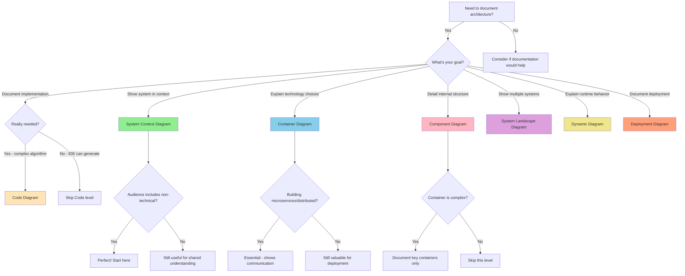

**Decision Guide:**

- **Use C4 when:** You're building software, working in an agile team, need to onboard developers, documenting microservices, or communicating architecture decisions
- **Don't use C4 for:** Business process modeling (use BPMN), enterprise-wide planning (use TOGAF), detailed data modeling (use ER diagrams), or network infrastructure (use network diagrams)

### 5-Minute Quick Start Guide

**Step 1: Identify Your System (30 seconds)**
- What software system are you documenting?
- Draw a box and label it with your system name

**Step 2: Add Users and External Systems (1 minute)**
- Who uses your system? Add stick figures for each user type
- What other systems does it talk to? Add boxes for each
- Draw arrows showing relationships
- Congratulations! You've created a System Context diagram

**Step 3: Break Down Your System (2 minutes)**
- What are the major running pieces? (web app, API, database, mobile app)
- For each piece, create a box and label it with:
  - Name
  - Technology (e.g., "React", "PostgreSQL", "Spring Boot")
  - Brief description
- Draw arrows showing how they communicate
- You now have a Container diagram

**Step 4: Detail One Complex Container (1.5 minutes)**
- Pick your most complex container
- What are its major internal parts? (controllers, services, repositories)
- Draw boxes for each component
- Show how they interact
- You've created a Component diagram

**Step 5: Add Legends and Save (30 seconds)**
- Add a legend explaining your notation (colors, shapes, line styles)
- Save your diagrams where your team can access them
- Update them as your architecture evolves

**That's it!** You've documented your architecture using C4. Most teams only need Context and Container diagrams. Add Component diagrams for complex areas, and skip Code diagrams entirely (your IDE can generate those).

### Quick Reference: Use Cases to Diagram Types

| Use Case | Diagram Type | Time to Create | Audience | Update Frequency |
|----------|--------------|----------------|----------|------------------|
| Explain system to stakeholders | System Context | 5-10 min | Everyone | Quarterly |
| Onboard new developers | Context + Container | 15-30 min | Technical team | Monthly |
| Document microservices | Container | 20-40 min | Developers, Ops | Monthly |
| Show technology stack | Container | 15-20 min | Technical team | Per major change |
| Explain complex component | Component | 30-60 min | Developers | As needed |
| Plan deployment | Deployment | 20-30 min | Ops, DevOps | Per environment change |
| Show runtime flow | Dynamic | 15-30 min | Developers | As needed |
| Enterprise system overview | System Landscape | 30-60 min | Leadership, Architects | Quarterly |
| Architecture review | Context + Container | 30-45 min | Technical team | Before review |
| Document API integration | Container + Dynamic | 30-45 min | Integration team | Per API change |
| Security review | Context + Deployment | 30-45 min | Security team | Per security review |
| Explain to non-technical | System Context | 5-10 min | Business stakeholders | Quarterly |

**Pro Tips:**
- Start with Context, add detail only when needed
- Most teams need only Context and Container diagrams
- Update diagrams when architecture changes, not on a schedule
- Keep diagrams in version control alongside code
- Use tools that generate diagrams from code when possible

---

## Overview

The C4 model is a lean, developer-friendly approach to software architecture diagramming created by Simon Brown between 2006-2011. It's designed to address the confusion and ambiguity common in software architecture diagrams.

**Key Principles:**
- Easy to learn
- Developer-friendly
- Hierarchical abstractions (like Google Maps for code)
- Notation independent
- Tooling independent
- Designed for agile teams

**C4 stands for:**
1. **Context** - System in scope and its relationships
2. **Containers** - Applications and data stores
3. **Components** - Logical groupings within containers
4. **Code** - Implementation details (optional)

---

## The Four Levels (Core Diagrams)

### Level 1: System Context Diagram

**Purpose:** 

The System Context diagram is the highest level view of your software architecture, providing the essential "big picture" that answers the fundamental question: "What is this system and how does it fit into the world?" This diagram establishes the system boundary - the critical line between what you're building and everything else. It shows your system as a single box surrounded by its users and the other systems it interacts with, making it immediately clear what's in scope and what's outside.

This is the most accessible diagram in the C4 model, designed to be understood by everyone from executives to developers. It deliberately omits internal details, focusing instead on the system's context and relationships. Think of it as the "executive summary" of your architecture - it should be simple enough to sketch on a whiteboard in a meeting, yet comprehensive enough to give stakeholders a complete understanding of the system's place in the broader ecosystem.

The System Context diagram is particularly valuable for identifying dependencies early in a project, facilitating discussions about integration points, and ensuring all stakeholders share a common understanding of scope. It's often the first diagram created when documenting a system and serves as the foundation for more detailed Container and Component diagrams.

**Detailed Audience Guidance:**

This diagram serves multiple audiences, each with different information needs:

- **Executive Leadership & Business Stakeholders**: Use this to understand what the system does, who it serves, and what other systems it depends on. They can assess business value, identify risks from external dependencies, and understand the scope of the initiative without getting lost in technical details.

- **Product Managers & Business Analysts**: Use this to validate that the system scope aligns with business requirements, identify all user types that need to be considered, and understand integration points that may affect feature planning or timelines.

- **Enterprise Architects**: Use this to see how the system fits into the broader enterprise architecture, identify potential conflicts or overlaps with other systems, assess compliance with enterprise standards, and plan for future integrations.

- **Project Managers**: Use this to understand the full scope of work, identify external dependencies that could affect timelines, plan stakeholder engagement, and assess project risks.

- **Software Architects & Technical Leads**: Use this as the foundation for more detailed diagrams, ensure alignment on system boundaries, identify all integration points that need to be designed, and communicate architecture to non-technical stakeholders.

- **Developers**: Use this to understand the broader context of their work, see how their system fits into the larger ecosystem, and identify external systems they'll need to integrate with.

- **Security Teams**: Use this to identify all external touchpoints that need security consideration, understand data flows in and out of the system, and assess the attack surface.

- **Operations & Support Teams**: Use this to understand what external systems need to be monitored, identify dependencies that could cause outages, and plan for operational support.

**Element Catalog:**

**What CAN Appear:**
- **Your Software System** (exactly one): The system you're building or documenting, shown as a box in the center
- **People/Actors** (one or more): Human users of your system, shown as stick figures
  - End users (customers, employees, partners)
  - Administrators and operators
  - Different user roles with distinct responsibilities
- **External Software Systems** (zero or more): Other systems your system interacts with
  - Third-party SaaS platforms (Stripe, Salesforce, SendGrid)
  - Legacy systems within your organization
  - Partner systems
  - Internal systems owned by other teams
  - Cloud services (when treated as black boxes)
- **Relationships** (connecting elements): Lines showing interactions
  - Must be labeled with the purpose/nature of the interaction
  - Should indicate direction (arrows)
  - Can include technology/protocol (HTTPS, SOAP, etc.)

**What CANNOT Appear:**
- Internal components of your system (save for Container diagram)
- Databases or data stores (these are Containers, not external systems)
- Multiple instances of your system (this is deployment detail)
- Infrastructure elements (load balancers, firewalls, networks)
- Implementation details or technology choices for your system
- Internal user roles or system components
- Detailed data flows or message formats
- Deployment nodes or environments

**Complete Mermaid Examples:**

**Example 1: E-Commerce Platform System Context**

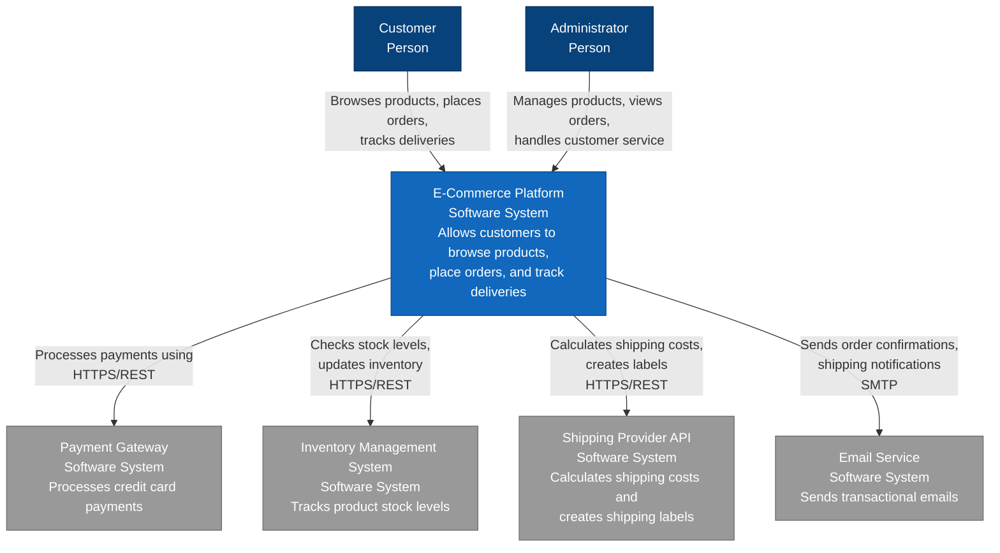

**Legend:**
- **Blue boxes**: The system in scope (what we're building)
- **Dark blue figures**: People/users
- **Gray boxes**: External systems
- **Arrows**: Relationships with labels describing the interaction

---

**Example 2: Healthcare Patient Portal System Context**

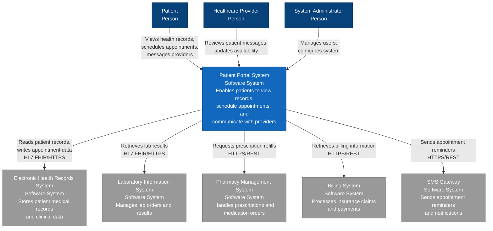

**Legend:**
- **Blue box**: Patient Portal System (system in scope)
- **Dark blue figures**: Different user types
- **Gray boxes**: External healthcare systems
- **Arrows with labels**: Integration points with protocols (HL7 FHIR, REST)

---

**Example 3: Financial Trading Platform System Context**

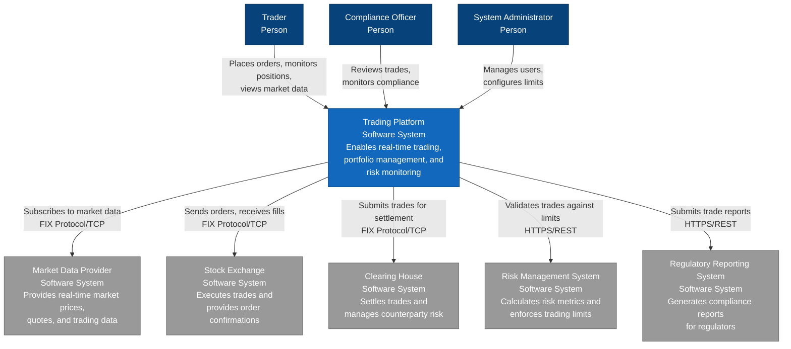

**Legend:**
- **Blue box**: Trading Platform (system in scope)
- **Dark blue figures**: User roles (Trader, Compliance, Admin)
- **Gray boxes**: External financial systems
- **Arrows**: Integration points with protocols (FIX Protocol for financial messaging)

---

**Creation Checklist:**

Use this checklist to ensure your System Context diagram is complete and effective:

**1. System Identification**
- [ ] Have you clearly identified the system in scope?
- [ ] Is the system name clear and unambiguous?
- [ ] Does the system description explain its purpose in one sentence?
- [ ] Is it obvious which box represents your system vs. external systems?

**2. User Identification**
- [ ] Have you identified all types of users?
- [ ] Are user roles clearly named (not just "User")?
- [ ] Have you included both primary and administrative users?
- [ ] Are external users (partners, auditors) included if relevant?

**3. External Systems**
- [ ] Have you identified all external systems your system depends on?
- [ ] Have you included third-party services (payment, email, SMS)?
- [ ] Have you included internal systems owned by other teams?
- [ ] Have you included legacy systems that must be integrated?

**4. Relationships**
- [ ] Is every relationship labeled with its purpose?
- [ ] Do arrows show the direction of interaction?
- [ ] Have you included the protocol/technology where relevant (HTTPS, SOAP, etc.)?
- [ ] Are bidirectional relationships shown clearly?

**5. Scope and Boundaries**
- [ ] Is it clear what's inside vs. outside your system?
- [ ] Have you avoided showing internal components?
- [ ] Have you avoided showing infrastructure details?
- [ ] Is the diagram focused on the system boundary?

**6. Clarity and Readability**
- [ ] Can a non-technical person understand the diagram?
- [ ] Is the layout clean and uncluttered?
- [ ] Are labels readable and concise?
- [ ] Is there a legend explaining the notation?

**7. Completeness**
- [ ] Does the diagram answer "Who uses this system?"
- [ ] Does it answer "What does this system depend on?"
- [ ] Does it answer "What is the system boundary?"
- [ ] Have you validated the diagram with stakeholders?

**Common Variations:**

**Variation 1: Simple Internal System**
- Fewer external systems
- Focus on user types
- Emphasis on internal integrations
- Example: Employee directory system

**Variation 2: Integration-Heavy System**
- Many external systems
- Complex integration patterns
- Multiple protocols
- Example: Enterprise service bus, API gateway

**Variation 3: Customer-Facing System**
- Multiple user types
- External services (payment, email, analytics)
- Third-party integrations
- Example: E-commerce, SaaS platform

**Variation 4: B2B System**
- Partner systems as primary external systems
- API-first approach
- Focus on system-to-system communication
- Example: Payment processor, logistics platform

**Variation 5: Regulated Industry System**
- Compliance and audit systems
- Regulatory reporting systems
- Security and identity systems
- Example: Healthcare, financial services

---

### Level 2: Container Diagram

**Purpose:**

The Container diagram zooms into your software system to reveal its high-level technical building blocks. This is where you show the major applications, services, and data stores that make up your system, along with the technology choices for each. A "container" in C4 terminology is something that needs to be running for your system to work - it could be a web application, a mobile app, a microservice, a database, a message queue, or any other executable or data store.

This diagram bridges the gap between the business-focused System Context and the code-focused Component diagram. It's the most commonly used C4 diagram because it provides the right level of detail for most architectural discussions. It shows what you're building and deploying, what technologies you're using, and how the pieces communicate - all without getting lost in implementation details.

The Container diagram is essential for understanding deployment architecture, planning infrastructure, making technology decisions, and coordinating work across teams. It's particularly valuable for microservices architectures, where understanding service boundaries and communication patterns is critical. This diagram helps developers understand where their code will run, helps operations teams plan infrastructure, and helps architects ensure the system can meet its quality attributes.

**Detailed Audience Guidance:**

This diagram serves technical audiences with different perspectives:

- **Software Developers**: Use this to understand where their code fits, what technologies they'll be working with, which containers they need to integrate with, and how data flows through the system. They can identify APIs they need to call, databases they need to access, and communication patterns they need to implement.

- **Software Architects & Technical Leads**: Use this to make and communicate technology decisions, design system structure and communication patterns, identify potential bottlenecks or single points of failure, plan for scalability and resilience, and ensure architectural principles are followed across containers.

- **DevOps & Operations Teams**: Use this to understand what needs to be deployed, plan infrastructure and resource requirements, design monitoring and alerting strategies, understand dependencies for deployment ordering, and plan for disaster recovery and high availability.

- **Security Engineers**: Use this to identify all components that need security hardening, understand data flows for encryption planning, identify authentication and authorization boundaries, assess the attack surface, and plan network segmentation and firewall rules.

- **QA & Test Engineers**: Use this to understand what needs to be tested, plan integration testing strategies, identify test environments needed, understand dependencies for test data setup, and design end-to-end test scenarios.

- **Technical Product Managers**: Use this to understand technical constraints and possibilities, assess feasibility of feature requests, understand deployment complexity, and communicate with technical teams about architecture.

- **Enterprise Architects**: Use this to ensure alignment with enterprise standards, assess technology choices against approved stacks, identify opportunities for reuse, and plan for integration with other enterprise systems.

**Element Catalog:**

**What CAN Appear:**
- **Web Applications**: Browser-based user interfaces
  - Single Page Applications (React, Angular, Vue)
  - Server-rendered applications (ASP.NET MVC, Rails, Django)
  - Static sites with JavaScript
- **Mobile Applications**: Native or hybrid mobile apps
  - iOS applications (Swift, Objective-C)
  - Android applications (Kotlin, Java)
  - Cross-platform apps (React Native, Flutter, Xamarin)
- **Desktop Applications**: Installable applications
  - Windows applications (.NET, Electron)
  - macOS applications (Swift, Electron)
  - Cross-platform desktop apps (Electron, Qt)
- **API Applications**: Backend services exposing APIs
  - REST APIs
  - GraphQL APIs
  - gRPC services
  - SOAP services
- **Microservices**: Single-purpose services
  - Domain services
  - Integration services
  - Utility services
- **Serverless Functions**: Event-driven compute
  - AWS Lambda functions
  - Azure Functions
  - Google Cloud Functions
- **Databases**: Data persistence
  - Relational databases (PostgreSQL, MySQL, SQL Server)
  - NoSQL databases (MongoDB, Cassandra, DynamoDB)
  - In-memory databases (Redis, Memcached)
  - Time-series databases (InfluxDB, TimescaleDB)
  - Graph databases (Neo4j, Amazon Neptune)
- **Message Brokers**: Asynchronous communication
  - Message queues (RabbitMQ, AWS SQS, Azure Service Bus)
  - Event streams (Kafka, Azure Event Hubs, AWS Kinesis)
  - Pub/Sub systems (Google Pub/Sub, Redis Pub/Sub)
- **File Storage**: File and object storage
  - Object storage (AWS S3, Azure Blob Storage)
  - File systems
  - Content delivery networks (CDN)
- **Search Engines**: Full-text search
  - Elasticsearch
  - Azure Cognitive Search
  - Algolia
- **Caches**: Performance optimization
  - Redis
  - Memcached
  - Application-level caches
- **API Gateways**: API management (when significant)
  - Kong
  - AWS API Gateway
  - Azure API Management
- **Relationships**: Communication between containers
  - Must show direction
  - Must be labeled with purpose
  - Should include protocol/technology (HTTPS, gRPC, AMQP, etc.)
  - Should indicate synchronous vs. asynchronous

**What CANNOT Appear:**
- Internal components of containers (save for Component diagram)
- Infrastructure elements (load balancers, firewalls) unless they execute your code
- External systems (these belong in System Context)
- People/users (these belong in System Context)
- Multiple instances of the same container (this is deployment detail)
- Libraries or frameworks (these are dependencies, not containers)
- Development tools or build systems
- Monitoring or logging systems (unless they're part of your system)

**Complete Mermaid Examples:**

**Example 1: E-Commerce Platform Container Diagram (Microservices Architecture)**

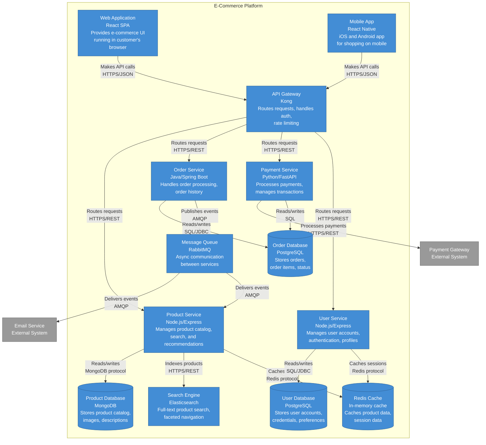

**Legend:**
- **Blue boxes**: Containers within the E-Commerce Platform system
- **Gray boxes**: External systems
- **Cylinder shapes**: Databases and data stores
- **Arrows with labels**: Communication patterns with protocols
- **Container labels format**: Name / Technology / Responsibility

**Key Architectural Decisions:**
- Microservices architecture for independent scaling and deployment
- API Gateway pattern for centralized authentication and routing
- Polyglot persistence (MongoDB for products, PostgreSQL for transactional data)
- Redis for caching to improve performance
- RabbitMQ for asynchronous communication and decoupling
- Elasticsearch for advanced search capabilities

---

**Example 2: Healthcare Patient Portal Container Diagram (Monolithic with Microservices)**

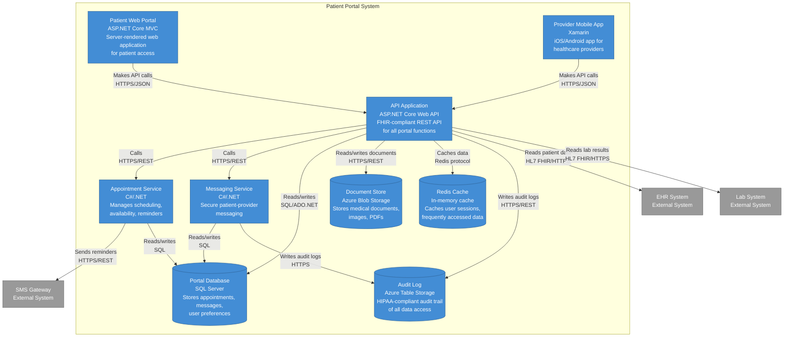

**Legend:**
- **Blue boxes**: Containers within the Patient Portal system
- **Gray boxes**: External healthcare systems
- **Cylinder shapes**: Data stores
- **Arrows**: Communication with protocols (HL7 FHIR for healthcare interoperability)

**Key Architectural Decisions:**
- FHIR-compliant API for healthcare interoperability standards
- Separate audit logging for HIPAA compliance
- Document storage in Azure Blob for scalability
- Redis caching for performance while maintaining security
- Microservices for appointment and messaging to enable independent scaling
- SQL Server for transactional consistency

---

**Example 3: Financial Trading Platform Container Diagram (High-Performance Architecture)**

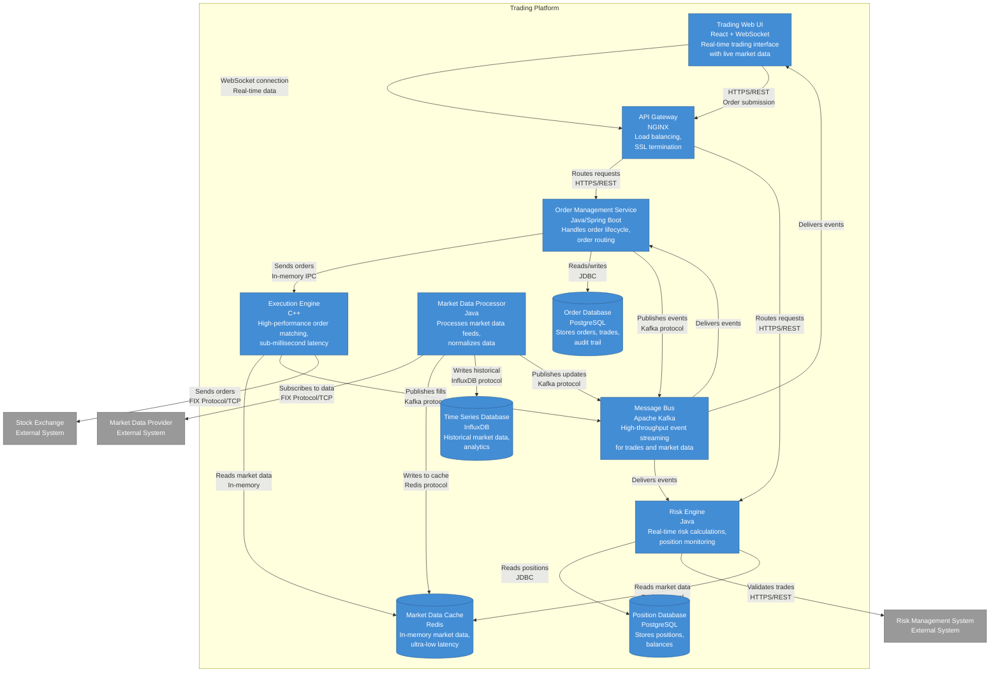

**Legend:**
- **Blue boxes**: Containers within the Trading Platform
- **Gray boxes**: External financial systems
- **Cylinder shapes**: Data stores optimized for different access patterns
- **Arrows**: Communication patterns (note FIX Protocol for financial messaging)

**Key Architectural Decisions:**
- C++ execution engine for ultra-low latency order matching
- Redis for in-memory market data access (sub-millisecond reads)
- Kafka for high-throughput event streaming
- InfluxDB for time-series market data storage and analytics
- WebSocket for real-time UI updates
- FIX Protocol for standard financial messaging
- Separate databases for orders and positions to optimize for different access patterns

---

**Creation Checklist:**

Use this checklist to ensure your Container diagram is complete and effective:

**1. Container Identification**
- [ ] Have you identified all applications that need to run?
- [ ] Have you identified all databases and data stores?
- [ ] Have you included message brokers, caches, and other infrastructure containers?
- [ ] Have you included mobile apps, web apps, and APIs?
- [ ] Have you avoided showing external systems (those belong in System Context)?

**2. Technology Representation**
- [ ] Does each container show its technology stack?
- [ ] Is the technology choice clear (e.g., "React", "PostgreSQL", "Spring Boot")?
- [ ] Have you explained why each technology was chosen (in supporting docs)?
- [ ] Are technology versions specified where relevant?

**3. Communication Protocols**
- [ ] Is every relationship labeled with its purpose?
- [ ] Have you specified the protocol (HTTPS, gRPC, AMQP, etc.)?
- [ ] Have you indicated synchronous vs. asynchronous communication?
- [ ] Are data formats specified (JSON, Protocol Buffers, etc.)?
- [ ] Have you shown the direction of communication with arrows?

**4. Responsibilities**
- [ ] Does each container have a clear, single responsibility?
- [ ] Is the purpose of each container described?
- [ ] Have you avoided containers that do too much?
- [ ] Have you avoided containers that do too little?

**5. Data Flow**
- [ ] Is it clear which containers read from which databases?
- [ ] Is it clear which containers write to which databases?
- [ ] Have you shown caching relationships?
- [ ] Have you shown message queue producers and consumers?

**6. Deployment Considerations**
- [ ] Can each container be deployed independently (if that's the goal)?
- [ ] Are deployment dependencies clear?
- [ ] Have you considered scaling requirements for each container?
- [ ] Have you identified stateful vs. stateless containers?

**7. Clarity and Readability**
- [ ] Can a developer understand what they need to build?
- [ ] Can operations understand what they need to deploy?
- [ ] Is the layout clean and uncluttered?
- [ ] Is there a legend explaining the notation?
- [ ] Are container names consistent with your codebase?

**8. Completeness**
- [ ] Does the diagram show all major deployable units?
- [ ] Does it show all data stores?
- [ ] Does it show all communication paths?
- [ ] Have you validated the diagram with the development team?

**Common Variations:**

**Variation 1: Monolithic Architecture**
- Single application container
- One or more databases
- Possibly separate web UI
- Example: Traditional three-tier application

**Variation 2: Microservices Architecture**
- Multiple service containers
- API Gateway
- Service-specific databases
- Message broker for async communication
- Example: Modern cloud-native application

**Variation 3: Serverless Architecture**
- Function containers (Lambda, Azure Functions)
- Managed services (DynamoDB, S3, API Gateway)
- Event sources
- Example: Event-driven serverless application

**Variation 4: Hybrid Architecture**
- Mix of monolithic and microservices
- Legacy and modern components
- Gradual migration path
- Example: Modernizing legacy system

**Variation 5: Mobile-First Architecture**
- Mobile apps as primary UI
- Backend-for-Frontend (BFF) pattern
- API-first design
- Example: Mobile banking app

---

### Level 3: Component Diagram

**Purpose:**

The Component diagram zooms into a single container to reveal its internal structure and organization. This is where you show the major structural building blocks within a container - the components that implement its functionality. Components are groupings of related functionality encapsulated behind well-defined interfaces, and they should map directly to real abstractions in your codebase such as packages, namespaces, modules, or groups of related classes.

This diagram is about showing how responsibilities are distributed within a container and how components collaborate to deliver the container's functionality. It's not about showing every class or function - that's too detailed. Instead, it focuses on the significant structural elements that developers need to understand to work effectively with the codebase. Think of components as the major "parts" of your container that you would explain to a new developer joining the team.

The Component diagram is particularly valuable when a container is complex enough that understanding its internal structure is important for development, maintenance, or architectural decisions. Not every container needs a Component diagram - simple containers with straightforward internal structure can be understood by reading the code. Create Component diagrams for containers that are complex, critical to the system, or frequently modified by multiple developers.

**Detailed Audience Guidance:**

This diagram serves developers and architects who need to understand internal structure:

- **Software Developers**: Use this to understand the internal structure of a container they're working on, identify which components they need to modify for a feature, understand dependencies between components, see where to add new functionality, and learn the codebase architecture. This is the primary diagram for onboarding developers to a specific container.

- **Software Architects & Technical Leads**: Use this to design and communicate internal container structure, ensure separation of concerns and proper layering, identify components that are doing too much or too little, plan refactoring efforts, and ensure architectural patterns are consistently applied. This diagram helps enforce architectural decisions at the code level.

- **Code Reviewers**: Use this to understand the architectural context of code changes, ensure new code fits the existing structure, identify when changes violate architectural boundaries, and assess the impact of proposed changes on the overall design.

- **Technical Debt Analysts**: Use this to identify components with too many responsibilities, spot circular dependencies or tight coupling, find components that should be split or merged, and prioritize refactoring efforts based on component complexity.

- **New Team Members**: Use this as a map to navigate the codebase, understand the major parts and their responsibilities, see how components interact, and identify where to start reading code for specific features.

**Element Catalog:**

**What CAN Appear:**
- **Controllers/Handlers**: Entry points for requests
  - HTTP controllers (REST, MVC)
  - GraphQL resolvers
  - gRPC service implementations
  - Message handlers
  - Event handlers
- **Services**: Business logic and orchestration
  - Application services (use case implementations)
  - Domain services (domain logic that doesn't fit in entities)
  - Integration services (coordinating with external systems)
- **Repositories**: Data access abstractions
  - Database repositories
  - Cache repositories
  - File system repositories
- **Facades**: Simplified interfaces to complex subsystems
  - External system facades
  - Legacy system wrappers
  - Third-party library facades
- **Clients**: Wrappers for external communication
  - HTTP clients for external APIs
  - gRPC clients
  - Message queue clients
  - Database clients
- **Validators**: Input validation and business rules
  - Request validators
  - Domain validators
  - Business rule validators
- **Mappers/Adapters**: Data transformation
  - DTO mappers
  - Entity mappers
  - Protocol adapters
- **Middleware/Filters**: Cross-cutting concerns
  - Authentication middleware
  - Authorization filters
  - Logging interceptors
  - Error handling middleware
- **Event Publishers/Subscribers**: Event-driven components
  - Domain event publishers
  - Integration event handlers
  - Message publishers
- **Aggregates/Entities**: Domain model (DDD)
  - Aggregate roots
  - Entities
  - Value objects (when significant)
- **Relationships**: Dependencies and interactions
  - Must show direction
  - Must be labeled with purpose
  - Should indicate the nature of the dependency (uses, calls, reads from, writes to)

**What CANNOT Appear:**
- Individual classes (unless they represent a significant component)
- Utility functions or helper classes (unless they're architecturally significant)
- External systems or containers (these belong in Container diagram)
- Infrastructure code (unless it's a significant architectural element)
- Test code
- Configuration files
- Build scripts
- Every single class in the container (focus on significant components)

**Complete Mermaid Examples:**

**Example 1: Order Service Component Diagram (Layered Architecture)**

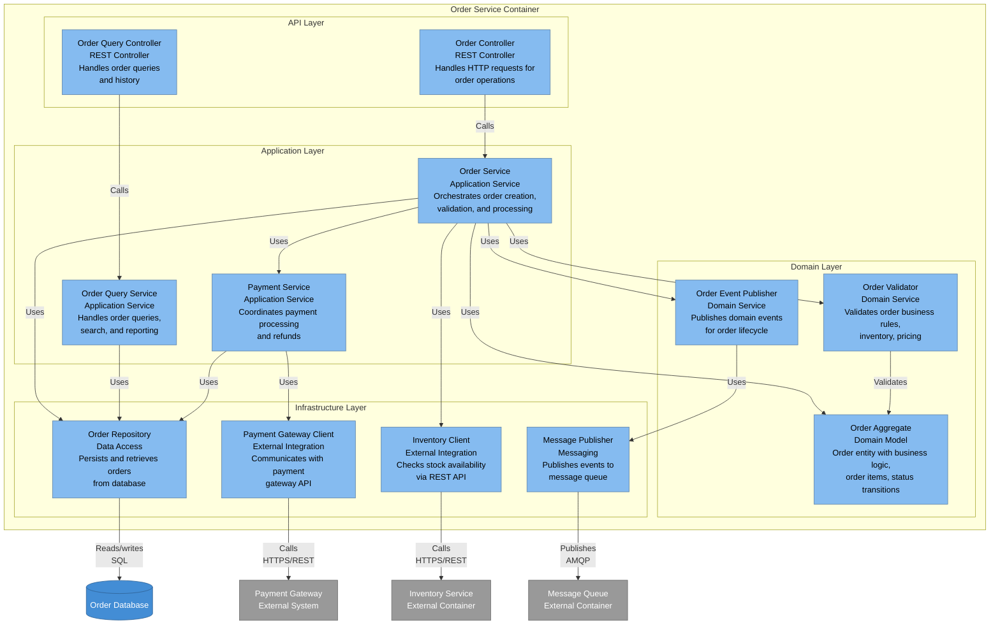

**Legend:**
- **Light blue boxes**: Components within the Order Service
- **Grouped by layer**: API, Application, Domain, Infrastructure
- **Dark blue cylinder**: Database (part of the container)
- **Gray boxes**: External systems and containers
- **Arrows**: Dependencies and interactions

**Key Architectural Patterns:**
- Layered architecture (API, Application, Domain, Infrastructure)
- Domain-Driven Design (Aggregate, Domain Service)
- Repository pattern for data access
- Facade pattern for external integrations
- Event-driven architecture with domain events
- CQRS pattern (separate query and command paths)

---

**Example 2: API Gateway Component Diagram (Middleware Pipeline)**

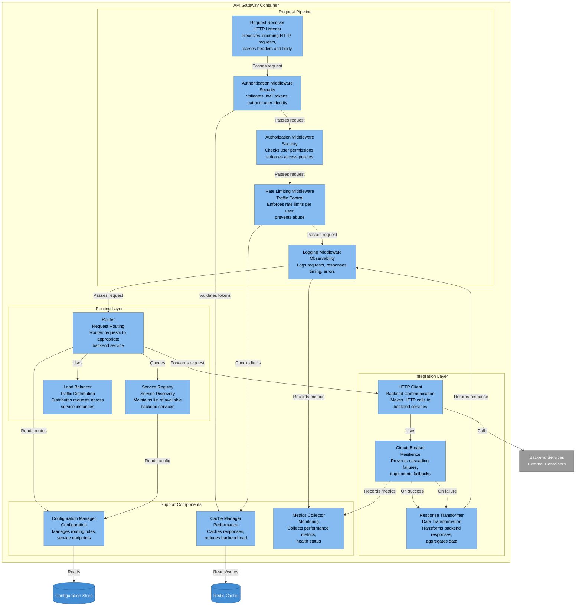

**Legend:**
- **Light blue boxes**: Components within the API Gateway
- **Grouped by responsibility**: Request Pipeline, Routing, Integration, Support
- **Dark blue cylinders**: Data stores used by the gateway
- **Gray box**: Backend services (external containers)
- **Arrows**: Request flow and dependencies

**Key Architectural Patterns:**
- Pipeline pattern (middleware chain)
- Circuit breaker pattern for resilience
- Service registry pattern for discovery
- Load balancing for distribution
- Caching for performance
- Separation of concerns (auth, routing, integration)

---

**Example 3: React Application Component Diagram (Frontend Architecture)**

```mermaid
graph TB
    subgraph "React Web Application Container"
        subgraph "Presentation Layer"
            ProductListPage[Product List Page<br/>React Component<br/>Displays product catalog,<br/>search, filters]
            
            ProductDetailPage[Product Detail Page<br/>React Component<br/>Shows product details,<br/>reviews, add to cart]
            
            CheckoutPage[Checkout Page<br/>React Component<br/>Shopping cart, payment,<br/>order confirmation]
            
            UserProfilePage[User Profile Page<br/>React Component<br/>User account, orders,<br/>preferences]
        end
        
        subgraph "State Management"
            ProductStore[Product Store<br/>Redux Slice<br/>Manages product catalog state,<br/>search results, filters]
            
            CartStore[Cart Store<br/>Redux Slice<br/>Manages shopping cart state,<br/>items, quantities, totals]
            
            UserStore[User Store<br/>Redux Slice<br/>Manages user authentication,<br/>profile, preferences]
            
            OrderStore[Order Store<br/>Redux Slice<br/>Manages order state,<br/>checkout process]
        end
        
        subgraph "API Integration"
            ProductAPI[Product API Client<br/>HTTP Client<br/>Fetches products, search,<br/>recommendations]
            
            OrderAPI[Order API Client<br/>HTTP Client<br/>Creates orders, processes<br/>payments]
            
            UserAPI[User API Client<br/>HTTP Client<br/>Authentication, profile,<br/>preferences]
        end
        
        subgraph "Shared Components"
            AuthGuard[Auth Guard<br/>HOC Component<br/>Protects routes, redirects<br/>unauthenticated users]
            
            ErrorBoundary[Error Boundary<br/>React Component<br/>Catches errors, displays<br/>fallback UI]
            
            LoadingSpinner[Loading Spinner<br/>React Component<br/>Shows loading state<br/>during async operations]
        end
        
        subgraph "Utilities"
            LocalStorage[Local Storage Manager<br/>Utility<br/>Persists cart, preferences<br/>to browser storage]
            
            Analytics[Analytics Tracker<br/>Utility<br/>Tracks user interactions,<br/>page views]
        end
    end
    
    APIGateway[API Gateway<br/>External Container]
    
    ProductListPage -->|Reads state| ProductStore
    ProductListPage -->|Uses| LoadingSpinner
    ProductListPage -->|Wrapped by| ErrorBoundary
    
    ProductDetailPage -->|Reads state| ProductStore
    ProductDetailPage -->|Dispatches actions| CartStore
    ProductDetailPage -->|Uses| LoadingSpinner
    
    CheckoutPage -->|Reads state| CartStore
    CheckoutPage -->|Reads state| UserStore
    CheckoutPage -->|Dispatches actions| OrderStore
    CheckoutPage -->|Wrapped by| AuthGuard
    
    UserProfilePage -->|Reads state| UserStore
    UserProfilePage -->|Reads state| OrderStore
    UserProfilePage -->|Wrapped by| AuthGuard
    
    ProductStore -->|Calls| ProductAPI
    CartStore -->|Persists to| LocalStorage
    UserStore -->|Calls| UserAPI
    OrderStore -->|Calls| OrderAPI
    
    ProductAPI -->|HTTP requests| APIGateway
    OrderAPI -->|HTTP requests| APIGateway
    UserAPI -->|HTTP requests| APIGateway
    
    ProductListPage -->|Tracks events| Analytics
    ProductDetailPage -->|Tracks events| Analytics
    CheckoutPage -->|Tracks events| Analytics
    
    style ProductListPage fill:#85bbf0,stroke:#5d82a8,color:#000000
    style ProductDetailPage fill:#85bbf0,stroke:#5d82a8,color:#000000
    style CheckoutPage fill:#85bbf0,stroke:#5d82a8,color:#000000
    style UserProfilePage fill:#85bbf0,stroke:#5d82a8,color:#000000
    style ProductStore fill:#85bbf0,stroke:#5d82a8,color:#000000
    style CartStore fill:#85bbf0,stroke:#5d82a8,color:#000000
    style UserStore fill:#85bbf0,stroke:#5d82a8,color:#000000
    style OrderStore fill:#85bbf0,stroke:#5d82a8,color:#000000
    style ProductAPI fill:#85bbf0,stroke:#5d82a8,color:#000000
    style OrderAPI fill:#85bbf0,stroke:#5d82a8,color:#000000
    style UserAPI fill:#85bbf0,stroke:#5d82a8,color:#000000
    style AuthGuard fill:#85bbf0,stroke:#5d82a8,color:#000000
    style ErrorBoundary fill:#85bbf0,stroke:#5d82a8,color:#000000
    style LoadingSpinner fill:#85bbf0,stroke:#5d82a8,color:#000000
    style LocalStorage fill:#85bbf0,stroke:#5d82a8,color:#000000
    style Analytics fill:#85bbf0,stroke:#5d82a8,color:#000000
    style APIGateway fill:#999999,stroke:#6b6b6b,color:#ffffff
```

**Legend:**
- **Light blue boxes**: Components within the React application
- **Grouped by responsibility**: Presentation, State Management, API Integration, Shared, Utilities
- **Gray box**: API Gateway (external container)
- **Arrows**: Dependencies and data flow

**Key Architectural Patterns:**
- Component-based architecture (React)
- Centralized state management (Redux)
- API client abstraction
- Higher-Order Components (HOC) for cross-cutting concerns
- Error boundaries for resilience
- Local storage for persistence
- Analytics integration

---

**Creation Checklist:**

Use this checklist to ensure your Component diagram is complete and effective:

**1. Component Identification**
- [ ] Have you identified the major structural building blocks?
- [ ] Do components map to real code structures (packages, namespaces, modules)?
- [ ] Have you avoided showing every class (focus on significant components)?
- [ ] Have you grouped related functionality into components?
- [ ] Are component names consistent with your codebase?

**2. Responsibility Assignment**
- [ ] Does each component have a clear, single responsibility?
- [ ] Is the purpose of each component described?
- [ ] Have you avoided components that do too much?
- [ ] Have you avoided components that do too little?
- [ ] Are responsibilities properly distributed across layers?

**3. Component Relationships**
- [ ] Is every dependency shown with an arrow?
- [ ] Are relationships labeled with their purpose?
- [ ] Is the direction of dependencies clear?
- [ ] Have you avoided circular dependencies?
- [ ] Are dependencies between layers appropriate (e.g., no infrastructure depending on domain)?

**4. Architectural Patterns**
- [ ] Are you following a consistent architectural pattern (layered, hexagonal, etc.)?
- [ ] Are layers or groups clearly identified?
- [ ] Are cross-cutting concerns (logging, security) properly represented?
- [ ] Are integration points with external systems clear?

**5. Technology and Implementation**
- [ ] Is the technology/framework for each component specified?
- [ ] Are implementation patterns noted (Repository, Facade, etc.)?
- [ ] Are external dependencies (databases, APIs) shown?
- [ ] Is it clear which components are custom vs. framework-provided?

**6. Scope and Detail**
- [ ] Have you focused on one container only?
- [ ] Is the level of detail appropriate (not too high, not too low)?
- [ ] Have you avoided showing implementation details better left to code?
- [ ] Have you shown enough detail for developers to understand the structure?

**7. Clarity and Readability**
- [ ] Can a developer understand where to add new functionality?
- [ ] Is the layout clean and uncluttered?
- [ ] Are components grouped logically (by layer, feature, etc.)?
- [ ] Is there a legend explaining the notation?

**8. Validation**
- [ ] Does the diagram match the actual codebase structure?
- [ ] Have you validated with developers who work on this container?
- [ ] Does the diagram help answer common questions about the code?
- [ ] Will this diagram help onboard new developers?

**Common Variations:**

**Variation 1: Layered Architecture**
- Clear separation into layers (Presentation, Application, Domain, Infrastructure)
- Dependencies flow downward
- Each layer has specific responsibilities
- Example: Traditional enterprise application

**Variation 2: Hexagonal Architecture (Ports and Adapters)**
- Core domain in the center
- Ports (interfaces) define boundaries
- Adapters implement ports for specific technologies
- Example: Domain-driven microservice

**Variation 3: Feature-Based Organization**
- Components grouped by feature/use case
- Vertical slices through layers
- Each feature is relatively independent
- Example: Modular monolith

**Variation 4: Pipeline Architecture**
- Components arranged in a processing pipeline
- Each component transforms data
- Clear input/output flow
- Example: Data processing service, API gateway

**Variation 5: Event-Driven Components**
- Event publishers and subscribers
- Message handlers
- Event store or message broker integration
- Example: CQRS/Event Sourcing system

---

### Level 4: Code Diagram (Optional)

**Purpose:**

The Code diagram is the most detailed level of the C4 model, showing the actual implementation details of a component. This includes classes, interfaces, functions, database tables, and other code-level constructs. However, this level is explicitly marked as optional because modern IDEs can generate these diagrams automatically from code, and hand-crafted code diagrams quickly become outdated as code evolves.

The key question to ask before creating a Code diagram is: "Can an IDE generate this for me?" If the answer is yes, don't create a manual diagram. Instead, document how developers can generate these diagrams from the code itself. Code diagrams should only be created manually when they serve a specific purpose that automated generation cannot fulfill - such as explaining a complex algorithm, documenting a critical design pattern, or providing a simplified view that highlights specific aspects of the code.

When you do create Code diagrams, keep them focused and purposeful. Don't try to show every class and method - that's overwhelming and unmaintainable. Instead, show just enough detail to explain the specific concept or pattern you're documenting. Think of Code diagrams as teaching tools, not comprehensive documentation.

**Detailed Audience Guidance:**

Code diagrams serve a narrow, specific audience:

- **Developers New to the Component**: Use Code diagrams to understand complex algorithms, learn critical design patterns, see how key classes interact, and understand the implementation of core functionality. These diagrams are most valuable during onboarding when developers need to quickly grasp complex code.

- **Code Reviewers**: Use Code diagrams to understand the design intent behind complex code changes, verify that implementations follow established patterns, and assess the impact of proposed changes on the overall design.

- **Architects Reviewing Implementation**: Use Code diagrams to verify that code implements the intended design, ensure design patterns are correctly applied, and identify deviations from architectural decisions.

- **Documentation Writers**: Use Code diagrams to explain complex technical concepts in documentation, illustrate design patterns with concrete examples, and provide visual aids for technical articles or training materials.

**When Code Diagrams ARE Needed:**

1. **Complex Algorithms**: When a component implements a complex algorithm that's difficult to understand from code alone
   - Example: Custom sorting algorithm, graph traversal, optimization algorithm
   - Show: Key classes, data structures, algorithm steps

2. **Critical Design Patterns**: When a component uses a sophisticated design pattern that developers need to understand
   - Example: Strategy pattern, Observer pattern, Composite pattern
   - Show: Pattern participants, relationships, interaction flow

3. **Domain Model (DDD)**: When documenting a rich domain model with complex relationships
   - Example: Aggregate roots, entities, value objects, domain events
   - Show: Domain objects, relationships, invariants

4. **Complex Class Hierarchies**: When inheritance or interface hierarchies are non-obvious
   - Example: Plugin architecture, framework extension points
   - Show: Base classes, interfaces, implementations, extension points

5. **Onboarding Critical Code**: When new developers need to understand business-critical code quickly
   - Example: Payment processing, security implementation, core business logic
   - Show: Key classes, their responsibilities, critical interactions

**When Code Diagrams are NOT Needed (Use IDE Instead):**

1. **Simple Class Structures**: Straightforward classes with obvious relationships
   - IDE can generate: Class diagrams, dependency graphs

2. **Standard CRUD Operations**: Typical create, read, update, delete implementations
   - IDE can generate: Method signatures, call hierarchies

3. **Framework-Generated Code**: Code generated by frameworks or tools
   - IDE can generate: Complete structure with all details

4. **Frequently Changing Code**: Code that changes often will make diagrams outdated
   - IDE can generate: Always up-to-date diagrams

5. **Large Codebases**: Attempting to diagram entire packages or namespaces
   - IDE can generate: Filtered views, specific class diagrams

**How to Use IDE-Generated Diagrams:**

Instead of creating manual Code diagrams, document how to generate them:

**Visual Studio / Rider:**
- Use Class Diagrams feature (Add > New Item > Class Diagram)
- Right-click classes and select "View Class Diagram"
- Use Architecture Explorer for dependency graphs

**IntelliJ IDEA:**
- Use Diagrams feature (right-click package > Diagrams > Show Diagram)
- Generate UML diagrams for classes, packages, dependencies
- Use "Show Diagram Popup" for quick views

**VS Code:**
- Install extensions like "PlantUML" or "Draw.io Integration"
- Use language-specific diagram generators
- Generate diagrams from code annotations

**Eclipse:**
- Use Papyrus or ObjectAid UML Explorer
- Generate class diagrams from packages
- Reverse engineer code to UML

**Complete Mermaid Examples:**

**Example 1: Order Aggregate Domain Model (DDD Pattern)**

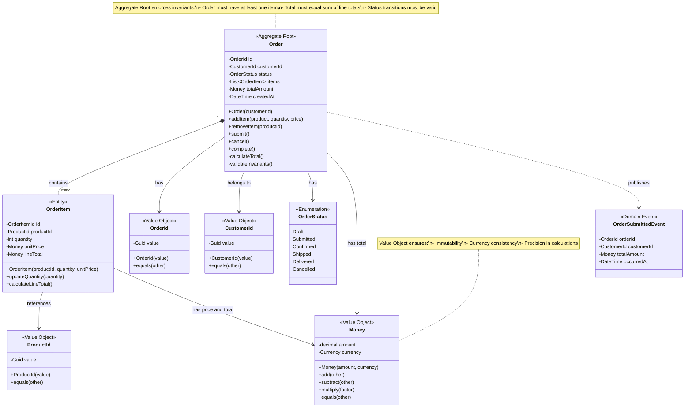

**Legend:**
- **<<Aggregate Root>>**: Entry point for the aggregate, enforces invariants
- **<<Entity>>**: Has identity, mutable
- **<<Value Object>>**: No identity, immutable, defined by attributes
- **<<Domain Event>>**: Published when significant domain changes occur
- **Solid lines**: Composition or association
- **Dashed lines**: Dependency (publishes, creates)

**When to Use This Diagram:**
- Onboarding developers to Domain-Driven Design concepts
- Explaining the Order aggregate's invariants and business rules
- Documenting the domain model for the development team
- Reviewing the design with domain experts

**Why Not Use IDE:**
- Shows DDD stereotypes (Aggregate Root, Value Object, etc.)
- Highlights business rules and invariants
- Simplified view focusing on domain concepts
- Includes notes explaining design decisions

---

**Example 2: Strategy Pattern Implementation**

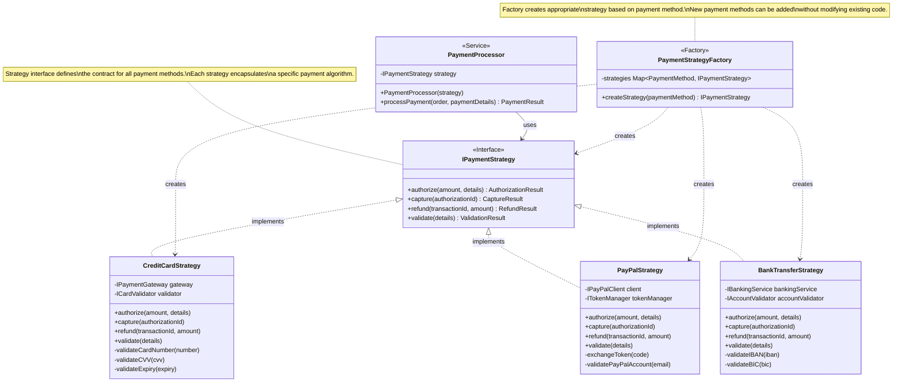

**Legend:**
- **<<Service>>**: Application service that uses strategies
- **<<Interface>>**: Contract for strategies
- **<<Factory>>**: Creates strategy instances
- **Dashed arrows with hollow head**: Interface implementation
- **Dashed arrows**: Dependency (creates, uses)

**When to Use This Diagram:**
- Teaching the Strategy pattern to developers
- Documenting how to add new payment methods
- Explaining the payment processing architecture
- Code review for payment-related changes

**Why Not Use IDE:**
- Focuses specifically on the Strategy pattern
- Shows the pattern structure clearly
- Includes notes explaining the design intent
- Simplified view without implementation details

---

**Example 3: Database Schema for Order System**

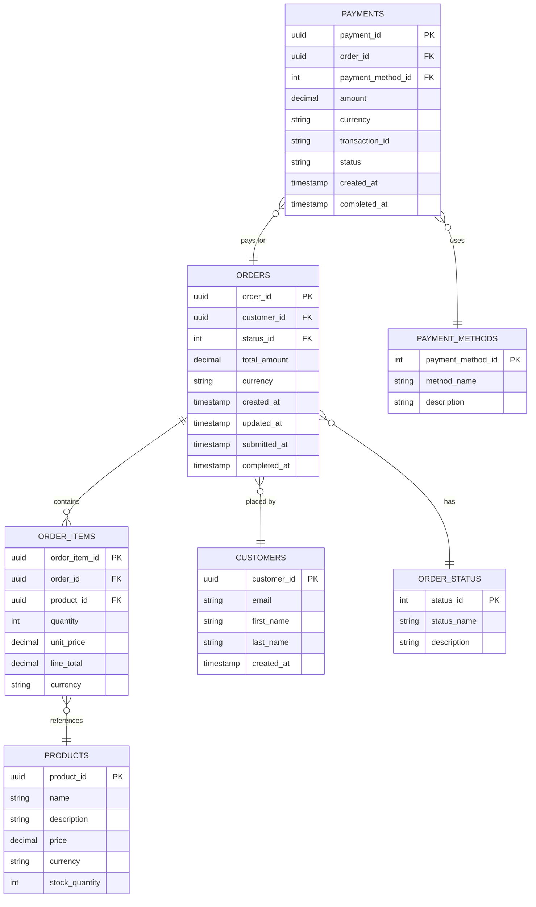

**Legend:**
- **||--o{**: One-to-many relationship
- **}o--||**: Many-to-one relationship
- **PK**: Primary key
- **FK**: Foreign key

**When to Use This Diagram:**
- Documenting database schema for developers
- Planning database migrations
- Understanding data relationships
- Onboarding database administrators

**Why Not Use IDE:**
- Shows business relationships clearly
- Includes field types and constraints
- Simplified view focusing on key fields
- Can be generated from ORM models but often needs manual refinement

---

**Guidance on When to Create vs. Generate:**

**Create Manual Code Diagrams When:**
- Explaining a specific concept or pattern (not comprehensive documentation)
- The diagram will be relatively stable (core domain model, key patterns)
- You need to add annotations, notes, or explanations
- You want to show a simplified, focused view
- The diagram is for teaching or onboarding purposes

**Use IDE-Generated Diagrams When:**
- You need comprehensive class diagrams
- The code changes frequently
- You want to explore dependencies
- You need up-to-date diagrams for development
- You're analyzing existing code

**Best Practice:**
Document in your architecture documentation how developers can generate Code diagrams from your IDE, including:
- Which IDE features to use
- Which packages/namespaces to focus on
- Recommended diagram types for different purposes
- How to filter and focus the generated diagrams

**Example Documentation:**
```markdown
## Generating Code Diagrams

### Visual Studio
1. Right-click on the `Domain` project
2. Select "View" > "View Class Diagram"
3. Drag the `Order` aggregate classes onto the diagram
4. Use "Show Related Classes" to expand

### IntelliJ IDEA
1. Right-click on the `com.example.domain` package
2. Select "Diagrams" > "Show Diagram"
3. Choose "Java Classes" diagram type
4. Use Ctrl+Alt+Shift+U for quick diagram popup
```

This approach ensures diagrams are always current while still providing guidance on what to visualize.

---

## Best Practices by Level

This section provides comprehensive best practices for creating effective C4 diagrams at each level. Each practice includes rationale, guidance, concrete examples, and exceptions to help you make informed decisions about your architecture documentation.

### System Context Level Best Practices

#### Scoping and Boundaries

##### Practice 1: Define a Clear System Boundary

**Rationale**: The most critical decision in a System Context diagram is determining what's "in" versus "out". A clear boundary prevents scope creep, focuses discussions, and ensures everyone understands what you're building versus what you're integrating with.

**Guidance**:
- Draw your system as a single box - resist the temptation to show internal structure
- If you're tempted to show multiple boxes for "your system", you probably need a Container diagram instead
- The boundary should align with ownership - if your team owns it, it's inside; if another team owns it, it's outside
- Consider deployment boundaries - things that deploy together are typically one system

**Example**:
```
GOOD: "Customer Portal" as one box
BAD: "Customer Portal Frontend" and "Customer Portal Backend" as separate boxes (these are containers)

GOOD: External "Payment Gateway" owned by third party
BAD: Including payment gateway as part of your system when you don't control it
```

**Exceptions**:
- When documenting a platform or ecosystem where the boundary is intentionally broad
- When showing a system-of-systems where multiple systems are being built together
- In these cases, consider using a System Landscape diagram instead

_Requirements: 1.1_

---

##### Practice 2: Include All User Types, Not Just Primary Users

**Rationale**: Systems often have multiple user types with different needs and permissions. Missing a user type can lead to incomplete requirements and security gaps.

**Guidance**:
- Identify all human actors who interact with the system directly
- Include administrative users, support staff, and operators
- Include external users like partners, auditors, or regulators if they have direct access
- Use specific role names (not just "User" or "Admin")
- Group similar users only if they have identical interactions

**Example**:
```
GOOD: "Customer", "Customer Support Agent", "System Administrator", "Data Analyst"
BAD: "User" (too generic)

GOOD: "Trader", "Compliance Officer", "Risk Manager" (financial system)
BAD: "Employee" (loses important distinctions)
```

**Exceptions**:
- When user types have identical interactions, they can be combined
- For very complex systems with 10+ user types, group by primary interaction pattern
- Internal administrative users can sometimes be omitted if the focus is external-facing functionality

_Requirements: 1.1_

---

##### Practice 3: Show All External Dependencies, Not Just the Obvious Ones

**Rationale**: Hidden dependencies are a major source of project risk. Showing all external systems helps identify integration complexity, potential bottlenecks, and single points of failure early.

**Guidance**:
- Include third-party SaaS services (payment, email, SMS, analytics)
- Include internal systems owned by other teams
- Include legacy systems that must be integrated
- Include identity providers and authentication systems
- Don't forget "invisible" dependencies like time services, certificate authorities, or DNS

**Example**:
```
GOOD: Shows "Email Service", "SMS Gateway", "Payment Processor", "Identity Provider"
BAD: Only shows "Database" and misses all external integrations

GOOD: Shows "Legacy Mainframe System" that must be integrated
BAD: Assumes legacy system doesn't exist or isn't relevant
```

**Exceptions**:
- Truly generic infrastructure (DNS, NTP) can be omitted unless it's a specific integration point
- Development-only dependencies (CI/CD systems) are typically omitted
- Monitoring and logging systems are usually omitted unless they're part of the system's core functionality

_Requirements: 1.1_

---

##### Practice 4: Limit to 5-9 External Systems for Readability

**Rationale**: Cognitive psychology research shows humans can effectively process 5-9 items at once. Too many external systems make the diagram overwhelming and defeat the purpose of providing a clear "big picture".

**Guidance**:
- If you have more than 9 external systems, look for opportunities to group or abstract
- Group similar systems (e.g., "Social Media Platforms" instead of Facebook, Twitter, LinkedIn individually)
- Consider whether all systems are truly at the same level of importance
- Create separate Context diagrams for different aspects if needed (e.g., one for customer-facing, one for internal operations)

**Example**:
```
GOOD: "Social Media Integration Service" (abstracts Facebook, Twitter, LinkedIn)
BAD: Showing 15 individual external systems making the diagram unreadable

GOOD: Two Context diagrams - one for customer interactions, one for back-office integrations
BAD: One massive Context diagram with 20 external systems
```

**Exceptions**:
- Integration-heavy systems (ESB, API Gateway) may legitimately have many external systems
- Enterprise architecture views may need to show more systems for completeness
- In these cases, use grouping, color coding, or multiple diagrams

_Requirements: 1.1, 1.4_

---

##### Practice 5: Align System Boundaries with Team Ownership

**Rationale**: System boundaries that don't match organizational boundaries create confusion about responsibility and make the diagram less useful for planning and coordination.

**Guidance**:
- If your team owns it, it's inside the boundary
- If another team owns it, it's outside (even if it's in the same company)
- If ownership is shared, consider showing it as external and documenting the shared ownership separately
- System boundaries should match deployment and operational boundaries

**Example**:
```
GOOD: "Customer Portal" (your team) integrates with "Inventory System" (warehouse team)
BAD: Including inventory system inside your boundary when you don't control it

GOOD: Clear boundary between "Order Service" (Team A) and "Payment Service" (Team B)
BAD: Showing both as one system when they have separate teams and deployments
```

**Exceptions**:
- During organizational transitions, boundaries may be temporarily unclear
- For platform teams serving multiple product teams, the boundary may be more fluid
- Document these special cases in the diagram description

_Requirements: 1.1, 8.1_

---

#### Notation and Labeling

##### Practice 6: Use Descriptive, Business-Friendly Names

**Rationale**: The System Context diagram is often shared with non-technical stakeholders. Using clear, business-friendly names ensures everyone can understand and contribute to architectural discussions.

**Guidance**:
- Use names that business stakeholders will recognize
- Avoid technical jargon, acronyms, or code names unless widely known
- Use the language of the business domain
- Be consistent with names used in other documentation

**Example**:
```
GOOD: "Customer Portal", "Payment Gateway", "Inventory Management System"
BAD: "CUST-PORT-SVC", "PAY-GTW-001", "INV-MGMT-DB"

GOOD: "Healthcare Provider" (in healthcare domain)
BAD: "User Type 2" or "External Actor B"
```

**Exceptions**:
- Well-known acronyms in the industry can be used (e.g., "EHR" in healthcare, "CRM" in sales)
- Internal code names can be used if they're universally understood within the organization
- Always provide a legend or glossary if using acronyms

_Requirements: 1.1, 9.2_

---

##### Practice 7: Label All Relationships with Purpose and Protocol

**Rationale**: Unlabeled arrows are ambiguous. Clear labels explain what data flows between systems and how, which is essential for understanding dependencies and planning integrations.

**Guidance**:
- Every relationship must have a label describing its purpose
- Include the protocol or technology (HTTPS, SOAP, FIX, HL7, etc.)
- Use active voice and be specific ("Processes payments using" not just "Uses")
- Indicate direction with arrows
- For bidirectional relationships, consider showing as two separate arrows with different labels

**Example**:
```
GOOD: "Processes payments using HTTPS/REST"
BAD: "Uses" or unlabeled arrow

GOOD: "Sends order confirmations via SMTP" and "Receives order status updates via Webhook"
BAD: Single bidirectional arrow with no label

GOOD: "Retrieves patient records using HL7 FHIR/HTTPS"
BAD: "Talks to EHR"
```

**Exceptions**:
- For very simple systems with obvious relationships, minimal labels may suffice
- In early conceptual diagrams, protocols can be omitted and added later
- Always add detail before sharing with stakeholders or using for planning

_Requirements: 1.1, 9.2, 9.3_

---

##### Practice 8: Keep Descriptions Concise (One Sentence)

**Rationale**: Long descriptions clutter the diagram and make it hard to read. The diagram should provide an overview; detailed descriptions belong in supporting documentation.

**Guidance**:
- Limit system descriptions to one sentence (10-15 words)
- Focus on the primary purpose or capability
- Avoid implementation details
- Use consistent format across all elements
- Link to detailed documentation for more information

**Example**:
```
GOOD: "Allows customers to browse products, place orders, and track deliveries"
BAD: "This system provides a comprehensive e-commerce solution with advanced features including product catalog management, shopping cart functionality, secure checkout process, order tracking, customer reviews, wish lists, and promotional campaigns"

GOOD: "Processes credit card payments"
BAD: "External third-party payment processing gateway that handles credit card transactions, fraud detection, PCI compliance, and settlement"
```

**Exceptions**:
- For complex systems where the purpose isn't obvious, a slightly longer description may be needed
- When the diagram is the primary documentation (not recommended), more detail may be appropriate
- Always prioritize readability over completeness

_Requirements: 1.1, 9.2_

---

##### Practice 9: Use Consistent Visual Notation

**Rationale**: Consistency helps readers quickly understand the diagram without constantly referring to the legend. It also makes multiple diagrams easier to compare.

**Guidance**:
- Use the same shape for all software systems (typically rectangles)
- Use the same shape for all people (typically stick figures or rounded rectangles)
- Use consistent colors: one color for your system, another for external systems
- Use consistent line styles: solid for synchronous, dashed for asynchronous
- Create and follow a style guide for all your C4 diagrams

**Example**:
```
GOOD: All external systems in gray, your system in blue, all people as stick figures
BAD: Random colors and shapes with no pattern

GOOD: Solid arrows for synchronous HTTP calls, dashed for async message queues
BAD: Inconsistent line styles with no meaning
```

**Exceptions**:
- Color can be used to indicate special properties (e.g., red for deprecated systems)
- Shape variations can indicate system types (e.g., cylinder for databases) if done consistently
- Always document any deviations in the legend

_Requirements: 1.1, 9.1, 9.2_

---

##### Practice 10: Include a Comprehensive Legend

**Rationale**: Even with good notation, a legend ensures everyone interprets the diagram correctly. It's especially important when sharing diagrams with people unfamiliar with C4.

**Guidance**:
- Always include a legend explaining shapes, colors, and line styles
- Explain what's inside vs. outside the system boundary
- Document any special notation or conventions
- Place the legend where it's visible but doesn't clutter the main diagram
- Keep the legend updated as notation evolves

**Example**:
```
GOOD Legend:
- Blue box: System in scope (what we're building)
- Gray boxes: External systems
- Stick figures: People/users
- Solid arrows: Synchronous communication
- Dashed arrows: Asynchronous communication

BAD: No legend, or legend that just says "Standard C4 notation"
```

**Exceptions**:
- If all diagrams in a document use identical notation, a single legend at the beginning may suffice
- For internal team diagrams where notation is well-established, legends can be minimal
- Always include legends for stakeholder presentations

_Requirements: 1.1, 9.4_

---

#### Layout and Readability

##### Practice 11: Place Your System in the Center

**Rationale**: Centering your system makes it immediately clear what the diagram is about and creates a natural focal point. It also makes the diagram more balanced and easier to read.

**Guidance**:
- Position your system (the one box representing what you're building) in the center
- Arrange users on the left or top
- Arrange external systems around the perimeter
- Use the layout to show logical groupings (e.g., all payment-related systems together)
- Maintain visual balance - don't crowd one side

**Example**:
```
GOOD:
    [User]
       ↓
  [Your System] → [External System 1]
       ↓
  [External System 2]

BAD:
[Your System] [User] [External System 1] [External System 2] (all in a row)
```

**Exceptions**:
- For systems that are primarily integration hubs, a different layout may be more appropriate
- When showing a specific flow or sequence, a left-to-right layout may be clearer
- Adjust layout for presentation format (landscape vs. portrait)

_Requirements: 1.1, 9.5_

---

##### Practice 12: Minimize Line Crossings

**Rationale**: Crossing lines create visual confusion and make relationships harder to follow. Clean layouts with minimal crossings are easier to understand and more professional.

**Guidance**:
- Arrange elements to minimize arrow crossings
- Group related systems together
- Use consistent flow direction (typically left-to-right or top-to-bottom)
- If crossings are unavoidable, use bridges or gaps to show which line is "on top"
- Consider creating multiple diagrams if crossings become excessive

**Example**:
```
GOOD: Logical grouping with clear flow, minimal crossings
BAD: Spaghetti diagram with arrows crossing everywhere

GOOD: Related systems (all payment systems) grouped together
BAD: Random placement causing unnecessary crossings
```

**Exceptions**:
- Some complex systems will inevitably have crossings - focus on minimizing them
- Hub-and-spoke patterns naturally have many connections
- Use your judgment - clarity is more important than zero crossings

_Requirements: 1.1, 9.5_

---

##### Practice 13: Use Whitespace Effectively

**Rationale**: Adequate whitespace makes diagrams easier to read and less overwhelming. Cramped diagrams are hard to understand and look unprofessional.

**Guidance**:
- Leave space between elements - they shouldn't touch
- Use consistent spacing between elements
- Don't try to fit everything into a small area
- It's better to have a larger diagram with good spacing than a small cramped one
- Group related elements with less space between them, more space between groups

**Example**:
```
GOOD: Elements well-spaced, easy to read labels, clear groupings
BAD: Elements crammed together, overlapping labels, no breathing room

GOOD: Consistent spacing creates visual rhythm and professionalism
BAD: Random spacing looks chaotic and unprofessional
```

**Exceptions**:
- When printing on specific paper sizes, some compression may be necessary
- For presentation slides, optimize for the display format
- Always prioritize readability over fitting a specific size

_Requirements: 1.1, 9.5_

---

##### Practice 14: Ensure Text is Readable at Display Size

**Rationale**: Diagrams are useless if people can't read the text. This is especially important for presentations and printed documentation.

**Guidance**:
- Test your diagram at the size it will be displayed (screen, print, presentation)
- Use font sizes that are readable from the expected viewing distance
- Avoid tiny text in boxes or on arrows
- If text doesn't fit, simplify the description or make the diagram larger
- Consider your audience - older stakeholders may need larger text

**Example**:
```
GOOD: 12pt+ font for printed diagrams, 18pt+ for presentations
BAD: 8pt font that requires zooming to read

GOOD: Concise labels that fit comfortably in boxes
BAD: Long text that's shrunk to fit, becoming unreadable
```

**Exceptions**:
- Interactive diagrams (web, tools) can use smaller text since users can zoom
- Detailed technical diagrams for developers can use smaller text than stakeholder presentations
- Always provide high-resolution versions for printing

_Requirements: 1.1, 9.5_

---

##### Practice 15: Use Color Purposefully, Not Decoratively

**Rationale**: Color should convey meaning, not just make the diagram "pretty". Purposeful color use helps readers quickly identify different types of elements and understand the diagram structure.

**Guidance**:
- Use one color for your system (typically blue)
- Use a different color for external systems (typically gray)
- Use color consistently across all your diagrams
- Ensure sufficient contrast for readability
- Consider colorblind accessibility (avoid red/green combinations)
- Don't use more than 3-4 colors in a single diagram

**Example**:
```
GOOD: Blue for your system, gray for external, consistent across all diagrams
BAD: Rainbow of colors with no meaning

GOOD: Red to highlight deprecated systems that need migration
BAD: Random colors just for visual variety

GOOD: Colorblind-safe palette (blue/orange instead of red/green)
BAD: Red/green that 8% of males can't distinguish
```

**Exceptions**:
- Additional colors can indicate special properties (security zones, deployment regions, etc.)
- Presentation diagrams may use brand colors
- Always document color meaning in the legend

_Requirements: 1.1, 9.1, 9.5_

---

#### Accuracy and Maintenance

##### Practice 16: Validate with Stakeholders Before Finalizing

**Rationale**: Diagrams represent shared understanding. Validation ensures the diagram accurately reflects reality and that all stakeholders agree on the system scope and dependencies.

**Guidance**:
- Review the diagram with business stakeholders to validate scope and user types
- Review with technical teams to validate external system dependencies
- Review with security teams to ensure all integration points are identified
- Review with operations teams to validate deployment dependencies
- Document who reviewed and approved the diagram

**Example**:
```
GOOD: "Reviewed with Product Owner (scope), Tech Lead (dependencies), Security (integrations) on 2024-01-15"
BAD: No validation, diagram based on assumptions

GOOD: Iterative reviews with feedback incorporated
BAD: One-time creation with no stakeholder input
```

**Exceptions**:
- Early conceptual diagrams can be created without full validation
- Always validate before using diagrams for planning or decision-making
- Update validation status as the diagram evolves

_Requirements: 1.1, 1.5, 8.2_

---

##### Practice 17: Version and Date Your Diagrams

**Rationale**: Systems evolve, and diagrams must evolve with them. Versioning and dating helps everyone know if they're looking at current information and provides a history of architectural changes.

**Guidance**:
- Include creation date and last updated date on every diagram
- Use version numbers for significant changes (v1.0, v1.1, v2.0)
- Store diagrams in version control alongside code
- Document what changed in each version
- Archive old versions but keep them accessible for historical reference

**Example**:
```
GOOD: "Version 2.1 | Created: 2024-01-10 | Last Updated: 2024-03-15 | Author: Jane Smith"
BAD: No date or version information

GOOD: Commit message: "Updated Context diagram to add new Payment Gateway integration"
BAD: No documentation of what changed
```

**Exceptions**:
- Very early draft diagrams may not need formal versioning
- Once shared with stakeholders, always version and date
- Consider automated versioning if diagrams are generated from code

_Requirements: 1.5, 8.2, 8.3_

---

##### Practice 18: Link Diagrams to Architecture Decision Records

**Rationale**: Diagrams show "what" but not "why". Linking to ADRs provides the rationale behind architectural choices, making the documentation more valuable and helping future teams understand the context.

**Guidance**:
- Create ADRs for significant architectural decisions
- Reference relevant ADRs in diagram descriptions or notes
- Use consistent ADR numbering (ADR-001, ADR-002, etc.)
- Store ADRs in the same repository as diagrams
- Update diagrams when ADRs change decisions

**Example**:
```
GOOD: "Payment Gateway selection documented in ADR-015"
BAD: No explanation of why this external system was chosen

GOOD: "Microservices architecture decision in ADR-003, ADR-007, ADR-012"
BAD: Architectural decisions exist only in people's heads
```

**Exceptions**:
- Obvious or standard choices may not need ADRs
- Early-stage projects may not have formal ADRs yet
- Always add ADRs before major decisions are implemented

_Requirements: 1.5, 8.1, 8.4_

---

##### Practice 19: Update Diagrams When Architecture Changes

**Rationale**: Outdated diagrams are worse than no diagrams - they mislead and create confusion. Keeping diagrams current ensures they remain valuable and trustworthy.

**Guidance**:
- Update diagrams as part of the development process, not as an afterthought
- Include diagram updates in definition of done for stories that change architecture
- Set up automated checks to detect drift between code and diagrams (where possible)
- Review diagrams during sprint reviews or architecture reviews
- Assign ownership for diagram maintenance

**Example**:
```
GOOD: Pull request includes both code changes and updated Container diagram
BAD: Code merged, diagram update forgotten

GOOD: Quarterly architecture review includes diagram accuracy check
BAD: Diagrams created once and never updated
```

**Exceptions**:
- Minor internal changes may not require diagram updates
- Focus on changes that affect system boundaries, integrations, or technology choices
- Document your update policy so everyone knows when updates are needed

_Requirements: 1.5, 8.2, 8.3, 8.4_

---

##### Practice 20: Establish Diagram Ownership

**Rationale**: Without clear ownership, diagrams become orphaned and outdated. Assigning ownership ensures someone is responsible for keeping diagrams accurate and current.

**Guidance**:
- Assign a specific person or role as diagram owner
- Typically the tech lead or architect for the system
- Document ownership in the diagram or in a central registry
- Include diagram maintenance in the owner's responsibilities
- Transfer ownership when people change roles

**Example**:
```
GOOD: "Diagram Owner: Jane Smith (Tech Lead) | Contact: jane.smith@company.com"
BAD: No one knows who's responsible for updates

GOOD: Diagram ownership documented in team charter
BAD: Assumed someone will maintain it
```

**Exceptions**:
- For team-owned diagrams, the whole team may be responsible
- Rotate ownership for shared learning
- Always have a clear escalation path if the owner is unavailable

_Requirements: 1.5, 8.1, 8.2_

---

### Container Level Best Practices

#### Scoping and Boundaries

##### Practice 21: Show Only Containers You Own or Control

**Rationale**: The Container diagram zooms into YOUR system. External systems should remain as single boxes, not broken down into their containers. This maintains clear boundaries and focuses on what you're building.

**Guidance**:
- Only show the internal structure of the system from your Context diagram
- Keep external systems as single boxes (don't show their containers)
- If you need to show another system's containers, create a separate Container diagram for that system
- Focus on containers your team deploys and operates

**Example**:
```
GOOD: Your system broken into Web App, API, Database; Payment Gateway shown as single external box
BAD: Showing Payment Gateway's internal containers (their API, their database, etc.)

GOOD: Separate Container diagrams for "Order System" and "Inventory System"
BAD: One Container diagram trying to show both systems' internal structures
```

**Exceptions**:
- When documenting a platform or shared service, you may show containers of systems you support
- For tightly coupled systems with shared ownership, boundaries may be more fluid
- Always clarify ownership boundaries in the diagram

_Requirements: 1.2, 1.4_

---

##### Practice 22: One Container Per Deployable/Runnable Unit

**Rationale**: Containers represent things that need to be running for your system to work. This maps directly to deployment and operational concerns, making the diagram practical and actionable.

**Guidance**:
- Each container should be something that gets deployed independently
- If it runs as a separate process, it's a container
- If it's a library or framework, it's NOT a container (it's a dependency)
- Databases, message queues, and caches are containers
- Consider: "If this stops running, does my system break?"

**Example**:
```
GOOD: "Web Application" (runs in browser), "API Service" (runs on server), "Database" (runs as separate process)
BAD: "React Library" (not a container, it's part of Web Application)

GOOD: "Order Service", "Payment Service", "Notification Service" (separate microservices)
BAD: "Business Logic" (too abstract, not a deployable unit)
```

**Exceptions**:
- Serverless functions can be grouped if they're deployed together
- Multiple instances of the same container are shown as one (deployment detail)
- Sidecar containers can be shown separately if they're significant

_Requirements: 1.2, 1.4_

---

##### Practice 23: Group Related Containers Visually

**Rationale**: Visual grouping helps readers understand the logical organization of your system, especially in microservices architectures with many containers.

**Guidance**:
- Use visual boundaries (boxes, colors, or spacing) to group related containers
- Group by business capability (all order-related services together)
- Group by layer (all frontend containers, all backend services, all data stores)
- Group by deployment boundary (all containers in the same cluster)
- Use consistent grouping strategy across diagrams

**Example**:
```
GOOD: All payment-related containers (Payment Service, Payment Database, Payment Queue) grouped together
BAD: Random placement with no logical grouping

GOOD: Frontend group (Web App, Mobile App), Backend group (Services), Data group (Databases)
BAD: Mixed placement making architecture unclear
```

**Exceptions**:
- Simple systems with few containers may not need grouping
- Some containers may belong to multiple logical groups
- Prioritize the grouping that best communicates your architecture

_Requirements: 1.2, 9.5_

---

##### Practice 24: Limit to 10-15 Containers for Readability

**Rationale**: Too many containers make the diagram overwhelming and hard to understand. If you have more than 15 containers, you're probably showing too much detail or need multiple diagrams.

**Guidance**:
- Aim for 5-10 containers in most diagrams, maximum 15
- If you have more, consider:
  - Are you showing the right level of abstraction?
  - Can some containers be grouped?
  - Should you create multiple Container diagrams for different subsystems?
- Focus on the most important or complex parts of your system

**Example**:
```
GOOD: 8 containers showing major system components
BAD: 30 containers showing every microservice

GOOD: Three Container diagrams - one for customer-facing, one for back-office, one for data processing
BAD: One massive diagram with all 30 microservices
```

**Exceptions**:
- Microservices architectures may legitimately have many containers
- Use grouping, abstraction, or multiple diagrams to manage complexity
- Consider a System Landscape diagram for very large systems

_Requirements: 1.2, 1.4_

---

##### Practice 25: Show Databases and Message Queues as Containers

**Rationale**: Databases and message queues are critical architectural components that need to be running. They're deployment units with their own operational concerns, so they deserve to be shown as first-class containers.

**Guidance**:
- Always show databases as separate containers (not hidden inside services)
- Show message queues, event streams, and caches as containers
- Use appropriate shapes (cylinder for databases is common)
- Include the technology (PostgreSQL, MongoDB, RabbitMQ, Redis)
- Show which services read from and write to each data store

**Example**:
```
GOOD: "Order Database (PostgreSQL)", "Product Database (MongoDB)", "Message Queue (RabbitMQ)"
BAD: Hiding databases inside service boxes

GOOD: Clear arrows showing "Order Service writes to Order Database"
BAD: Unclear data flow and ownership
```

**Exceptions**:
- Embedded databases (SQLite in a mobile app) can be omitted if not significant
- Temporary caches that are purely implementation details can be omitted
- Focus on architecturally significant data stores

_Requirements: 1.2, 9.2_

---

##### Practice 26: Distinguish Between Synchronous and Asynchronous Communication

**Rationale**: The communication pattern between containers has major implications for performance, reliability, and complexity. Making this distinction clear helps with understanding system behavior and planning operations.

**Guidance**:
- Use different line styles for sync vs. async (solid vs. dashed is common)
- Label relationships with the protocol (HTTPS, gRPC, AMQP, Kafka, etc.)
- Show request/response vs. fire-and-forget patterns
- Indicate if communication is real-time or batch
- Document the communication pattern in the legend

**Example**:
```
GOOD: Solid arrow "Calls API via HTTPS/REST (sync)", Dashed arrow "Publishes events to Kafka (async)"
BAD: All arrows look the same with no indication of communication pattern

GOOD: "Web App → API (HTTPS/REST, sync)" and "API → Queue (AMQP, async)"
BAD: Generic "communicates with" labels
```

**Exceptions**:
- For very simple systems with only one communication pattern, distinction may be obvious
- Early conceptual diagrams can omit this detail
- Always add before using for implementation planning

_Requirements: 1.2, 9.2, 9.3_

---

#### Notation and Labeling

##### Practice 27: Include Technology Stack for Every Container

**Rationale**: Technology choices are a key part of the Container diagram's value. They help developers understand what they'll be working with, help operations plan infrastructure, and help architects assess technology diversity.

**Guidance**:
- Include the primary technology for each container (React, Spring Boot, PostgreSQL)
- Include version numbers if they're significant (Java 17, .NET 8)
- Include deployment platform if relevant (AWS Lambda, Kubernetes, Azure App Service)
- Use consistent format: "Container Name (Technology)"
- Keep technology descriptions concise

**Example**:
```
GOOD: "Web Application (React 18, TypeScript)", "API Service (Java 17, Spring Boot 3)", "Database (PostgreSQL 15)"
BAD: "Web Application", "API Service", "Database" (no technology information)

GOOD: "Order Service (Node.js 20, Express, deployed to AWS Lambda)"
BAD: "Order Service (Node.js, Express, JavaScript, REST API, AWS Lambda, CloudWatch, X-Ray)" (too much detail)
```

**Exceptions**:
- Very early conceptual diagrams can omit technology details
- If all containers use the same technology stack, it can be noted once
- Always add technology details before implementation begins

_Requirements: 1.2, 9.2_

---

##### Practice 28: Use Consistent Container Naming Conventions

**Rationale**: Consistent naming makes diagrams easier to understand and helps establish patterns that developers can follow when creating new containers.

**Guidance**:
- Use a consistent naming pattern (e.g., "[Domain] Service", "[Domain] Database")
- Be specific about the container's purpose
- Avoid generic names like "Backend" or "API"
- Use the same names in code, deployment scripts, and diagrams
- Follow your organization's naming conventions

**Example**:
```
GOOD: "Order Service", "Payment Service", "Notification Service" (consistent pattern)
BAD: "Orders", "PaymentAPI", "NotificationMicroservice" (inconsistent)

GOOD: "Order Database", "Payment Database", "User Database" (clear ownership)
BAD: "DB1", "DB2", "DB3" (meaningless names)
```

**Exceptions**:
- Established systems may have legacy naming that can't be changed
- Document any naming conventions in your style guide
- Be consistent within your own system even if external systems use different conventions

_Requirements: 1.2, 9.2_

---

##### Practice 29: Label Relationships with Purpose and Protocol

**Rationale**: Understanding how containers communicate is essential for developers implementing integrations, operations teams planning infrastructure, and architects assessing system complexity.

**Guidance**:
- Every relationship must describe what data flows and how
- Include the protocol (HTTPS/REST, gRPC, AMQP, JDBC, etc.)
- Indicate if it's synchronous or asynchronous
- Show direction with arrows
- Be specific about the operation ("Reads orders", "Writes events", "Queries products")

**Example**:
```
GOOD: "Queries product catalog via HTTPS/REST (sync)"
BAD: "Uses" or unlabeled arrow

GOOD: "Publishes order events to RabbitMQ (async)" and "Subscribes to order events from RabbitMQ (async)"
BAD: Bidirectional arrow with no detail

GOOD: "Writes order data via JDBC", "Reads order history via JDBC"
BAD: "Connects to database"
```

**Exceptions**:
- For very simple systems, some details can be implied
- Early diagrams can have less detail, but add it before implementation
- Standard patterns (service to its own database) can use abbreviated labels

_Requirements: 1.2, 9.2, 9.3_

---

##### Practice 30: Show Data Flow Direction Clearly

**Rationale**: Understanding which way data flows is critical for security, performance analysis, and debugging. Ambiguous arrows lead to misunderstandings and errors.

**Guidance**:
- Always use arrows to show direction
- For bidirectional flow, consider using two separate arrows with different labels
- Show read vs. write operations separately
- Indicate if data flow is request/response or one-way
- Use arrow style to reinforce direction (solid arrowhead)

**Example**:
```
GOOD: "Web App → API (sends requests)" and "API → Web App (returns responses)"
BAD: Line with no arrows or bidirectional arrow with no explanation

GOOD: "Service → Database (writes)" and "Service ← Database (reads)"
BAD: Bidirectional arrow labeled "uses database"
```

**Exceptions**:
- For truly bidirectional, equal relationships, a bidirectional arrow may be appropriate
- Always clarify in the label what flows in each direction
- When in doubt, use two separate arrows

_Requirements: 1.2, 9.3_

---

##### Practice 31: Document API Contracts and Interfaces

**Rationale**: The Container diagram shows that containers communicate, but not the details of how. Linking to API documentation provides the complete picture.

**Guidance**:
- Reference API documentation in container descriptions or notes
- Link to OpenAPI/Swagger specs, GraphQL schemas, or gRPC proto files
- Document message formats for async communication
- Include version information for APIs
- Keep API documentation in sync with the diagram

**Example**:
```
GOOD: "Order API (REST) - See OpenAPI spec at /docs/order-api.yaml"
BAD: No reference to API documentation

GOOD: "Event format defined in /schemas/order-events.json"
BAD: No documentation of message structure
```

**Exceptions**:
- Internal implementation details don't need external documentation
- Early-stage systems may not have formal API docs yet
- Always create API documentation before other teams integrate

_Requirements: 1.2, 9.2_

---

##### Practice 32: Use Visual Cues for Container Types

**Rationale**: Different types of containers (web apps, services, databases) have different characteristics. Visual cues help readers quickly identify container types.

**Guidance**:
- Use different shapes or colors for different container types
- Common convention: rectangles for applications, cylinders for databases
- Use consistent visual language across all diagrams
- Document your visual conventions in the legend
- Don't overdo it - 3-4 visual categories are enough

**Example**:
```
GOOD: Rectangles for services, cylinders for databases, rounded rectangles for web/mobile apps
BAD: All containers look identical

GOOD: Blue for frontend, green for backend services, gray for data stores
BAD: Random colors with no meaning
```

**Exceptions**:
- Simple systems may not need visual differentiation
- Tool limitations may constrain visual options
- Clarity is more important than elaborate visuals

_Requirements: 1.2, 9.1, 9.2_

---

#### Layout and Readability

##### Practice 33: Organize by Logical Layers or Tiers

**Rationale**: Layered organization (frontend, backend, data) is a familiar pattern that helps readers quickly understand system structure.

**Guidance**:
- Arrange containers in logical layers (top to bottom or left to right)
- Common pattern: Frontend → Backend Services → Data Stores
- Group containers within each layer
- Show clear boundaries between layers
- Use consistent layer organization across diagrams

**Example**:
```
GOOD:
[Web App] [Mobile App]  (Frontend layer)
     ↓         ↓
[API Gateway]            (API layer)
     ↓
[Services...]            (Business logic layer)
     ↓
[Databases...]           (Data layer)

BAD: Random placement with no logical organization
```

**Exceptions**:
- Event-driven architectures may not fit layered organization
- Microservices may be better organized by business capability
- Choose the organization that best communicates your architecture

_Requirements: 1.2, 9.5_

---

##### Practice 34: Show User Interaction Points

**Rationale**: Understanding which containers users directly interact with helps identify security boundaries, performance requirements, and user experience concerns.

**Guidance**:
- Show users (from Context diagram) interacting with frontend containers
- Make it clear which containers are user-facing vs. internal
- Show different user types if they use different containers
- Indicate if access is direct or through a gateway
- Highlight public vs. private containers

**Example**:
```
GOOD: "Customer → Web App" and "Admin → Admin Portal" (clear user interaction)
BAD: No indication of which containers users access

GOOD: Visual distinction between public-facing and internal containers
BAD: All containers look the same regardless of exposure
```

**Exceptions**:
- For backend-focused diagrams, user interaction may be minimal
- API-only systems may not have traditional user interfaces
- Always show the entry points to your system

_Requirements: 1.2, 9.5_

---

##### Practice 35: Highlight Critical Paths and Dependencies

**Rationale**: Not all containers are equally important. Highlighting critical paths helps focus attention on the most important parts of the system for reliability and performance.

**Guidance**:
- Use visual emphasis (bold lines, colors) for critical paths
- Identify single points of failure
- Show which containers are on the critical path for key user journeys
- Indicate dependencies that could cause cascading failures
- Document criticality in container descriptions

**Example**:
```
GOOD: Bold arrows for "Customer places order" critical path
BAD: All relationships look equally important

GOOD: Red border around "Payment Service" with note "Critical - no fallback"
BAD: No indication of which services are critical
```

**Exceptions**:
- For systems where everything is equally critical, highlighting may not add value
- Don't overuse highlighting or it loses effectiveness
- Focus on the top 2-3 critical paths

_Requirements: 1.2, 9.1, 9.5_

---

##### Practice 36: Use Consistent Spacing and Alignment

**Rationale**: Professional-looking diagrams with consistent spacing and alignment are easier to read and convey attention to detail.

**Guidance**:
- Align containers in rows and columns where possible
- Use consistent spacing between containers
- Align related containers (e.g., all databases at the same level)
- Use grid-based layout tools if available
- Make the diagram look intentional, not random

**Example**:
```
GOOD: All services aligned in a row, all databases aligned below them
BAD: Random placement with inconsistent spacing

GOOD: Grid-based layout with consistent spacing
BAD: Containers scattered randomly
```

**Exceptions**:
- Some architectures don't fit grid layouts
- Organic layouts may be appropriate for complex systems
- Readability is more important than perfect alignment

_Requirements: 1.2, 9.5_

---

##### Practice 37: Keep Container Descriptions Concise

**Rationale**: Container diagrams can get cluttered quickly. Concise descriptions keep the diagram readable while still providing essential information.

**Guidance**:
- Limit descriptions to one sentence (10-15 words)
- Focus on the container's primary responsibility
- Include technology stack
- Avoid implementation details
- Link to detailed documentation for more information

**Example**:
```
GOOD: "Order Service (Spring Boot) - Manages order lifecycle and processing"
BAD: "Order Service implemented in Java using Spring Boot framework version 3.1 with PostgreSQL database for persistence and RabbitMQ for async messaging and Redis for caching and..."

GOOD: "Product Database (PostgreSQL) - Stores product catalog and inventory"
BAD: "PostgreSQL database version 15 running on AWS RDS with multi-AZ deployment and automated backups and read replicas and..."
```

**Exceptions**:
- Critical information that doesn't fit elsewhere may require longer descriptions
- Use notes or annotations for additional detail
- Link to detailed documentation rather than cramming everything into the diagram

_Requirements: 1.2, 9.2_

---

#### Accuracy and Maintenance

##### Practice 38: Validate Technology Choices with Implementation

**Rationale**: The Container diagram often drives technology decisions. Ensuring the diagram matches what's actually implemented prevents confusion and wasted effort.

**Guidance**:
- Review the diagram with developers implementing each container
- Verify technology choices match what's in the code
- Update the diagram when technology decisions change
- Use the diagram as the source of truth for technology standards
- Include diagram review in architecture review processes

**Example**:
```
GOOD: Diagram shows "React 18" and package.json confirms React 18
BAD: Diagram shows "Angular" but code uses React

GOOD: Regular sync between diagram and implementation
BAD: Diagram created once and never validated
```

**Exceptions**:
- Early planning diagrams may show intended technology before implementation
- Clearly mark planned vs. implemented containers
- Update to reflect reality as implementation progresses

_Requirements: 1.2, 1.5, 8.2_

---

##### Practice 39: Update When Adding or Removing Containers

**Rationale**: Container changes are significant architectural changes that must be reflected in the diagram. Outdated container diagrams mislead teams and cause integration problems.

**Guidance**:
- Update the diagram when adding new containers (new services, databases, etc.)
- Update when removing or consolidating containers
- Update when changing communication patterns between containers
- Include diagram updates in the definition of done for architectural changes
- Review diagram accuracy in sprint reviews or architecture reviews

**Example**:
```
GOOD: Pull request adding new microservice includes updated Container diagram
BAD: New service deployed but diagram not updated

GOOD: Diagram updated when migrating from monolith to microservices
BAD: Diagram still shows old monolithic architecture
```

**Exceptions**:
- Minor internal changes within a container don't require diagram updates
- Focus on changes visible at the container level
- Document your update policy

_Requirements: 1.2, 1.5, 8.2, 8.3_

---

##### Practice 40: Maintain Consistency with System Context

**Rationale**: The Container diagram zooms into the system shown in the Context diagram. Inconsistencies between levels create confusion and undermine trust in the documentation.

**Guidance**:
- The system boundary in the Container diagram must match the Context diagram
- External systems shown in Context should appear the same in Container
- Users shown in Context should interact with containers in the Container diagram
- Use the same names and descriptions across diagram levels
- Update both diagrams when the system boundary changes

**Example**:
```
GOOD: Context shows "E-Commerce Platform", Container shows containers within "E-Commerce Platform"
BAD: Context shows "E-Commerce Platform", Container shows different system name

GOOD: Context shows "Payment Gateway" as external, Container also shows it as external
BAD: Context shows external system, Container shows it broken down (wrong level)
```

**Exceptions**:
- Minor wording differences are acceptable if meaning is clear
- Focus on structural consistency (boundaries, relationships)
- Cross-reference between diagram levels

_Requirements: 1.2, 1.5, 8.3_

---

### Component Level Best Practices

#### Scoping and Boundaries

##### Practice 41: Create Component Diagrams Only for Complex Containers

**Rationale**: Component diagrams are the most detailed level and take the most effort to create and maintain. Focus on containers where the internal structure is complex or critical to understand.

**Guidance**:
- Not every container needs a Component diagram
- Create Component diagrams for:
  - Containers with complex internal structure
  - Containers that multiple teams work on
  - Containers that are architecturally significant
  - Containers where the design needs to be communicated
- Skip Component diagrams for simple containers (single-purpose services, databases)

**Example**:
```
GOOD: Component diagram for complex "Order Service" with multiple responsibilities
BAD: Component diagram for simple "Health Check Service" with one endpoint

GOOD: Component diagram for shared "API Gateway" that multiple teams configure
BAD: Component diagrams for every microservice regardless of complexity
```

**Exceptions**:
- For learning or onboarding, creating Component diagrams for simple containers can be educational
- For critical systems, even simple containers may warrant Component diagrams
- Use judgment based on your team's needs

_Requirements: 1.3, 1.4_

---

##### Practice 42: One Component Diagram Per Container

**Rationale**: Component diagrams zoom into a single container. Trying to show components from multiple containers creates confusion about boundaries and responsibilities.

**Guidance**:
- Each Component diagram should focus on exactly one container
- Clearly identify which container you're zooming into
- Show other containers as external boxes (like external systems in Context)
- Create separate Component diagrams for each complex container
- Use consistent naming: "Component Diagram: [Container Name]"

**Example**:
```
GOOD: "Component Diagram: Order Service" showing only Order Service components
BAD: One diagram showing components from Order Service AND Payment Service

GOOD: Separate diagrams for "Order Service Components" and "Payment Service Components"
BAD: Mixed components from multiple containers
```

**Exceptions**:
- For tightly coupled containers with shared components, boundaries may be less clear
- Document any special cases explicitly
- When in doubt, separate diagrams are clearer

_Requirements: 1.3, 1.4_

---

##### Practice 43: Align Components with Code Structure

**Rationale**: Component diagrams should map to how the code is actually organized. This makes the diagram useful for developers and keeps it maintainable.

**Guidance**:
- Components should correspond to packages, modules, or namespaces in your code
- Use the same names in the diagram and in the code
- Follow your language's conventions (packages in Java, modules in Node.js, namespaces in C#)
- Components should be at a consistent level of granularity
- Avoid showing implementation details that belong at the code level

**Example**:
```
GOOD: Components match Java packages: "com.example.order.controller", "com.example.order.service", "com.example.order.repository"
BAD: Components don't match code structure, making diagram useless for developers

GOOD: "OrderController", "OrderService", "OrderRepository" matching class names
BAD: "Business Logic", "Data Access" (too abstract, doesn't match code)
```

**Exceptions**:
- Logical components may not always match physical code organization
- Focus on the most useful view for your audience
- Document any differences between logical and physical structure

_Requirements: 1.3, 9.2_

---

##### Practice 44: Limit to 6-12 Components Per Diagram

**Rationale**: Too many components make the diagram overwhelming and defeat the purpose of providing clarity. If you have more than 12 components, you're probably showing too much detail.

**Guidance**:
- Aim for 6-10 components in most diagrams, maximum 12
- If you have more, consider:
  - Are you at the right level of abstraction?
  - Can some components be grouped?
  - Should you create multiple Component diagrams for different aspects?
- Focus on the most important or architecturally significant components

**Example**:
```
GOOD: 8 components showing major internal structure (controllers, services, repositories, clients)
BAD: 25 components showing every class

GOOD: Multiple Component diagrams for different subsystems within a container
BAD: One massive diagram trying to show everything
```

**Exceptions**:
- Very complex containers may legitimately have many components
- Use grouping or multiple diagrams to manage complexity
- Consider if you need a Component diagram at all

_Requirements: 1.3, 1.4_

---

##### Practice 45: Show Components at Consistent Granularity

**Rationale**: Mixing high-level and low-level components in the same diagram creates confusion about the level of detail and makes the diagram harder to understand.

**Guidance**:
- All components should be at roughly the same level of abstraction
- Don't mix architectural components with implementation details
- If one component is much more detailed than others, it's probably at the wrong level
- Use consistent criteria for what constitutes a component
- Consider creating separate diagrams for different levels of detail

**Example**:
```
GOOD: All components are services: "OrderService", "PaymentService", "NotificationService"
BAD: Mix of "OrderService" (high-level) and "DateFormatter" (low-level utility)

GOOD: All components are layers: "Presentation", "Business Logic", "Data Access"
BAD: Mix of "Presentation" (layer) and "LoginButton" (UI element)
```

**Exceptions**:
- Sometimes one component is genuinely more complex and warrants more detail
- Clearly indicate when showing different levels of detail
- Consider using visual cues (size, color) to indicate level

_Requirements: 1.3, 1.4_

---

##### Practice 46: Group Related Components

**Rationale**: Grouping helps organize complex Component diagrams and shows the logical structure of the container.

**Guidance**:
- Use visual boundaries to group related components
- Common groupings: by layer (presentation, business, data), by feature (order management, payment processing), by responsibility (read vs. write)
- Use consistent grouping strategy across diagrams
- Label groups clearly
- Don't over-group - too many nested groups create confusion

**Example**:
```
GOOD: "Controllers" group, "Services" group, "Repositories" group (layered architecture)
BAD: No grouping, all components at the same level

GOOD: "Order Management" group, "Payment Processing" group (feature-based)
BAD: Random grouping with no clear logic
```

**Exceptions**:
- Simple diagrams with few components may not need grouping
- Some architectures don't fit neat groupings
- Clarity is more important than forcing a grouping scheme

_Requirements: 1.3, 9.5_

---

#### Notation and Labeling

##### Practice 47: Use Clear Component Names That Reflect Responsibility

**Rationale**: Component names should immediately convey what the component does. Vague or technical names make the diagram less useful.

**Guidance**:
- Use names that describe the component's responsibility
- Follow naming conventions from your code
- Be specific about what the component does
- Avoid generic names like "Manager", "Handler", "Processor" without context
- Use consistent naming patterns (e.g., all services end with "Service")

**Example**:
```
GOOD: "OrderController", "PaymentService", "CustomerRepository"
BAD: "Controller1", "Service", "DataAccess"

GOOD: "OrderValidationService", "PaymentProcessingService"
BAD: "Validator", "Processor" (what do they validate/process?)
```

**Exceptions**:
- Well-established patterns (Controller, Service, Repository) are acceptable
- Domain-specific terminology may not follow general conventions
- Consistency within your codebase is most important

_Requirements: 1.3, 9.2_

---

##### Practice 48: Include Component Type or Stereotype

**Rationale**: Knowing what type of component you're looking at (controller, service, repository) helps developers understand its role and responsibilities.

**Guidance**:
- Include the component type in the name or as a stereotype
- Common types: Controller, Service, Repository, Client, Validator, Mapper
- Use consistent type names across all diagrams
- Follow your framework's conventions (Spring stereotypes, ASP.NET conventions)
- Document component types in your style guide

**Example**:
```
GOOD: "OrderController «Controller»", "OrderService «Service»", "OrderRepository «Repository»"
BAD: "Order", "OrderLogic", "OrderData" (unclear types)

GOOD: "PaymentClient «External Client»", "PaymentValidator «Validator»"
BAD: "Payment1", "Payment2" (no indication of type)
```

**Exceptions**:
- If all components are the same type, the type can be omitted
- Some architectures don't use stereotypes
- Clarity is more important than strict stereotype usage

_Requirements: 1.3, 9.2_

---

##### Practice 49: Show Component Interfaces and Dependencies

**Rationale**: Understanding how components interact is the primary value of a Component diagram. Clear interfaces and dependencies help developers implement and test components.

**Guidance**:
- Show which components depend on which
- Indicate the nature of the dependency (calls, uses, implements)
- Show interfaces where they're architecturally significant
- Use arrows to show dependency direction
- Label relationships with the type of interaction

**Example**:
```
GOOD: "OrderController → OrderService (calls)", "OrderService → OrderRepository (uses)"
BAD: Lines between components with no indication of relationship

GOOD: "OrderService implements IOrderService", "PaymentClient implements IPaymentGateway"
BAD: No indication of interfaces or contracts
```

**Exceptions**:
- Not every dependency needs to be shown - focus on architecturally significant ones
- Implementation details can be omitted
- Balance completeness with readability

_Requirements: 1.3, 9.2, 9.3_

---

##### Practice 50: Indicate Component Responsibilities

**Rationale**: A brief description of what each component does helps developers understand the system design and make appropriate changes.

**Guidance**:
- Include a one-sentence description of each component's responsibility
- Focus on what the component does, not how
- Use active voice ("Validates orders", "Processes payments")
- Keep descriptions concise (5-10 words)
- Avoid implementation details

**Example**:
```
GOOD: "OrderController - Handles HTTP requests for order operations"
BAD: "OrderController - REST controller with @PostMapping and @GetMapping annotations that..."

GOOD: "PaymentService - Orchestrates payment processing workflow"
BAD: "PaymentService - Service" (no useful information)
```

**Exceptions**:
- For well-known patterns (Controller, Repository), the type may be sufficient
- Very simple components may not need descriptions
- Link to code documentation for detailed information

_Requirements: 1.3, 9.2_

---

##### Practice 51: Show External Dependencies

**Rationale**: Components often depend on external libraries, frameworks, or services. Showing these dependencies helps understand the component's context and potential coupling.

**Guidance**:
- Show dependencies on external systems (from Container diagram)
- Show dependencies on significant frameworks or libraries
- Indicate which component is responsible for external integration
- Use different visual style for external dependencies
- Don't show every library - focus on architecturally significant ones

**Example**:
```
GOOD: "PaymentClient → Payment Gateway (external)", "EmailService → Email Service (external)"
BAD: No indication of which components interact with external systems

GOOD: "OrderRepository → PostgreSQL", "CacheService → Redis"
BAD: External dependencies hidden or unclear
```

**Exceptions**:
- Common framework dependencies (logging, DI) can be omitted
- Focus on dependencies that affect architecture or testing
- Balance completeness with readability

_Requirements: 1.3, 9.2_

---

#### Layout and Readability

##### Practice 52: Organize by Architectural Pattern

**Rationale**: Following established architectural patterns (layered, hexagonal, clean architecture) makes the diagram immediately recognizable and easier to understand.

**Guidance**:
- Arrange components according to your architectural pattern
- Layered: top to bottom (presentation, business, data)
- Hexagonal: core in center, adapters around perimeter
- Clean architecture: concentric circles with dependencies pointing inward
- Be consistent with your architecture documentation

**Example**:
```
GOOD: Layered architecture with Controllers at top, Services in middle, Repositories at bottom
BAD: Random placement that doesn't reflect architecture

GOOD: Hexagonal architecture with domain core in center, adapters around edges
BAD: Layout that contradicts the architectural pattern
```

**Exceptions**:
- Some systems don't follow standard patterns
- Choose the layout that best communicates your architecture
- Document your architectural pattern

_Requirements: 1.3, 9.5_

---

##### Practice 53: Show Dependency Direction Clearly

**Rationale**: Dependency direction is critical for understanding coupling and testability. Arrows should make it immediately clear which components depend on which.

**Guidance**:
- Always use arrows to show dependency direction
- Arrow points from dependent to dependency
- Use consistent arrow style
- Avoid bidirectional dependencies (they indicate design problems)
- Show dependency inversion where applicable

**Example**:
```
GOOD: "Controller → Service → Repository" (clear dependency chain)
BAD: Lines with no arrows or inconsistent arrow direction

GOOD: "Service → IRepository ← RepositoryImpl" (dependency inversion)
BAD: Circular dependencies or unclear direction
```

**Exceptions**:
- Some patterns (observer, pub/sub) have bidirectional relationships
- Document any special cases
- Circular dependencies should be refactored, not accepted

_Requirements: 1.3, 9.3, 9.5_

---

##### Practice 54: Use Visual Hierarchy to Show Importance

**Rationale**: Not all components are equally important. Visual hierarchy helps focus attention on the most critical components.

**Guidance**:
- Use size, color, or position to indicate importance
- Place more important components more prominently
- Use visual emphasis for components on critical paths
- Group less important components together
- Don't overuse emphasis or it loses effectiveness

**Example**:
```
GOOD: Core business logic components larger and more prominent
BAD: All components the same size regardless of importance

GOOD: Critical path components highlighted
BAD: No indication of which components are most important
```

**Exceptions**:
- For some audiences, all components may be equally important
- Don't let visual hierarchy obscure the actual architecture
- Use judgment based on your communication goals

_Requirements: 1.3, 9.1, 9.5_

---

##### Practice 55: Keep the Diagram Focused and Uncluttered

**Rationale**: Component diagrams can quickly become cluttered with too many elements and relationships. A focused diagram is more useful than a comprehensive but unreadable one.

**Guidance**:
- Show only the most important components and relationships
- Omit obvious or trivial dependencies
- Use grouping to reduce visual complexity
- Consider multiple diagrams for different aspects
- Prioritize clarity over completeness

**Example**:
```
GOOD: Focused diagram showing key components and their main relationships
BAD: Every class and every dependency shown, creating spaghetti

GOOD: Separate diagrams for "Read Path" and "Write Path"
BAD: One diagram trying to show everything
```

**Exceptions**:
- For detailed design reviews, more complete diagrams may be needed
- Balance audience needs with readability
- Provide multiple views for different purposes

_Requirements: 1.3, 1.4, 9.5_

---

#### Accuracy and Maintenance

##### Practice 56: Generate from Code Where Possible

**Rationale**: Manually maintaining Component diagrams is time-consuming and error-prone. Generating diagrams from code ensures they stay current and accurate.

**Guidance**:
- Use tools that generate diagrams from code annotations or reflection
- Annotate code with component information
- Automate diagram generation in your build pipeline
- Review generated diagrams and refine as needed
- Balance automation with manual curation for clarity

**Example**:
```
GOOD: Diagrams generated from Spring stereotypes (@Controller, @Service, @Repository)
BAD: Manually drawn diagrams that quickly become outdated

GOOD: Automated generation with manual refinement for layout and grouping
BAD: Fully manual diagrams that are never updated
```

**Exceptions**:
- Early design diagrams are created before code exists
- Some architectural views don't map directly to code
- Use manual diagrams for conceptual views, generated for implementation views

_Requirements: 1.3, 1.5, 7.4, 8.3_

---

##### Practice 57: Update When Refactoring Components

**Rationale**: Refactoring changes component structure and responsibilities. Keeping the diagram current ensures it remains a useful reference for the team.

**Guidance**:
- Update the diagram when adding, removing, or renaming components
- Update when changing component responsibilities
- Update when changing dependencies between components
- Include diagram updates in refactoring pull requests
- Review diagram accuracy during code reviews

**Example**:
```
GOOD: Pull request splitting OrderService into OrderService and OrderValidationService includes updated diagram
BAD: Code refactored but diagram still shows old structure

GOOD: Diagram updated when moving from layered to hexagonal architecture
BAD: Diagram shows old architecture after major refactoring
```

**Exceptions**:
- Minor internal changes within a component don't require diagram updates
- Focus on changes visible at the component level
- Use automated generation to reduce manual update burden

_Requirements: 1.3, 1.5, 8.2, 8.3_

---

##### Practice 58: Validate with Developers

**Rationale**: Component diagrams are most useful for developers. Validating with the team ensures the diagram accurately reflects the code and is useful for their work.

**Guidance**:
- Review diagrams with developers who work on the code
- Ask if the diagram helps them understand the system
- Verify that component names and responsibilities match the code
- Incorporate feedback to improve clarity
- Use diagrams in onboarding to test their effectiveness

**Example**:
```
GOOD: Regular diagram reviews in team meetings with developer feedback
BAD: Architect creates diagrams in isolation without developer input

GOOD: New developers use diagrams for onboarding and provide feedback
BAD: Diagrams created but never used by the team
```

**Exceptions**:
- Early design diagrams may not have developer input yet
- Always validate before considering diagrams complete
- Iterate based on actual usage and feedback

_Requirements: 1.3, 1.5, 8.2_

---

##### Practice 59: Link to Code Structure

**Rationale**: Connecting the diagram to the actual code makes it more useful and helps keep it current.

**Guidance**:
- Document the mapping between diagram components and code packages/modules
- Include links to code repositories or specific packages
- Use consistent naming between diagram and code
- Reference the diagram in code documentation
- Use tools that can navigate from diagram to code

**Example**:
```
GOOD: "OrderController maps to src/main/java/com/example/order/controller"
BAD: No connection between diagram and code

GOOD: Diagram includes links to GitHub packages
BAD: Diagram exists separately from code with no references
```

**Exceptions**:
- Conceptual diagrams may not map directly to code
- Early design diagrams precede code
- Always establish the mapping once code exists

_Requirements: 1.3, 1.5, 8.3_

---

##### Practice 60: Maintain Consistency Across Component Diagrams

**Rationale**: If you have multiple Component diagrams (for different containers), they should use consistent notation and style to make them easier to understand and compare.

**Guidance**:
- Use the same visual style across all Component diagrams
- Use consistent component types and stereotypes
- Use consistent grouping and layout strategies
- Follow the same naming conventions
- Document your standards in a style guide

**Example**:
```
GOOD: All Component diagrams use same colors, shapes, and layout patterns
BAD: Each diagram uses different notation and style

GOOD: Consistent use of Controller/Service/Repository pattern across all diagrams
BAD: Different patterns and naming in each diagram
```

**Exceptions**:
- Different containers may have different architectural patterns
- Document any intentional differences
- Consistency within a pattern is more important than forcing uniformity

_Requirements: 1.3, 1.5, 9.1, 9.2_

---

### Code Level Best Practices

#### When and How to Create Code Diagrams

##### Practice 61: Create Code Diagrams Only When Necessary

**Rationale**: Code diagrams are the most detailed and time-consuming to maintain. Modern IDEs can generate class diagrams automatically, so manual Code diagrams should be reserved for special cases.

**Guidance**:
- Only create Code diagrams for:
  - Complex algorithms that need explanation
  - Critical domain models that are central to the system
  - Design patterns that need to be communicated
  - Onboarding documentation for complex code
- Skip Code diagrams for:
  - Simple classes and methods
  - Standard CRUD operations
  - Code that's self-explanatory
  - Anything your IDE can generate

**Example**:
```
GOOD: Code diagram for complex Order domain model with multiple aggregates and value objects
BAD: Code diagram for simple POJO with getters and setters

GOOD: Code diagram explaining Strategy pattern implementation
BAD: Code diagram for every class in the system
```

**Exceptions**:
- For learning purposes, creating Code diagrams can be educational
- For critical systems, more documentation may be warranted
- Use judgment based on complexity and team needs

_Requirements: 1.4_

---

##### Practice 62: Focus on Domain Models and Key Abstractions

**Rationale**: If you're going to create Code diagrams, focus on the parts of the code that represent core business concepts and are hardest to understand from reading code alone.

**Guidance**:
- Document domain models (entities, value objects, aggregates)
- Document key abstractions and interfaces
- Document design patterns and their implementation
- Document complex algorithms or data structures
- Skip infrastructure code, utilities, and simple classes

**Example**:
```
GOOD: Code diagram for Order aggregate showing Order, OrderLine, Customer, Product relationships
BAD: Code diagram for utility classes like StringHelper or DateFormatter

GOOD: Code diagram showing Factory pattern implementation
BAD: Code diagram for simple data transfer objects
```

**Exceptions**:
- Sometimes infrastructure code is complex enough to warrant documentation
- Focus on what's most valuable for your team
- Consider your audience and their needs

_Requirements: 1.4_

---

##### Practice 63: Use UML Class Diagrams for Code Level

**Rationale**: UML class diagrams are the standard for code-level documentation. They're well-understood, supported by tools, and provide the right level of detail.

**Guidance**:
- Use standard UML class diagram notation
- Show classes, interfaces, and their relationships
- Include key attributes and methods
- Show inheritance, implementation, and association relationships
- Use standard UML relationship types (composition, aggregation, dependency)

**Example**:
```
GOOD: UML class diagram with proper notation for inheritance (hollow arrow), composition (filled diamond)
BAD: Custom notation that no one understands

GOOD: Standard UML that any developer can read
BAD: Proprietary diagram format
```

**Exceptions**:
- Simplified notation may be appropriate for non-technical audiences
- Always document any deviations from standard UML
- Clarity is more important than strict UML compliance

_Requirements: 1.4_

---

##### Practice 64: Generate from Code, Don't Draw Manually

**Rationale**: Code changes frequently, and manually maintaining Code diagrams is impractical. Use IDE or tool-generated diagrams to ensure accuracy.

**Guidance**:
- Use your IDE's built-in diagram generation (IntelliJ, Visual Studio, Eclipse)
- Use tools like PlantUML with code annotations
- Generate diagrams as part of your documentation build
- Manually refine generated diagrams for clarity if needed
- Never manually create diagrams that can be generated

**Example**:
```
GOOD: IntelliJ "Show Diagram" feature for class relationships
BAD: Manually drawing class diagrams that become outdated immediately

GOOD: PlantUML generated from code annotations
BAD: Hand-drawn diagrams that don't match the code
```

**Exceptions**:
- Conceptual design diagrams created before code
- Simplified diagrams for presentations
- Always prefer generated diagrams for accuracy

_Requirements: 1.4, 7.4_

---

##### Practice 65: Keep Code Diagrams Focused and Minimal

**Rationale**: Code diagrams can quickly become overwhelming with too many classes and relationships. Focus on the essential elements needed to understand the design.

**Guidance**:
- Show only the classes relevant to the concept being explained
- Omit obvious or trivial relationships
- Hide implementation details (private methods, internal fields)
- Focus on public interfaces and key relationships
- Create multiple focused diagrams rather than one comprehensive diagram

**Example**:
```
GOOD: Diagram showing 5-7 key classes in the Order domain model
BAD: Diagram showing all 50 classes in the package

GOOD: Separate diagrams for "Order Creation" and "Order Fulfillment" flows
BAD: One massive diagram trying to show everything
```

**Exceptions**:
- For comprehensive reference documentation, more complete diagrams may be needed
- Balance completeness with usability
- Provide multiple views for different purposes

_Requirements: 1.4_

---

## Anti-Patterns and Common Mistakes

This section catalogs common mistakes and anti-patterns in C4 diagrams to help you avoid them. Each anti-pattern includes a description, why it's problematic, how to avoid it, the correct approach, and examples. Learning from these mistakes will help you create more effective architecture documentation.

---

### Abstraction Level Violations

These anti-patterns occur when diagrams mix different levels of abstraction or show inappropriate detail for the diagram level.

---

#### Anti-Pattern 1: Mixing Abstraction Levels

**Description**: 

Including elements from different C4 levels in the same diagram. For example, showing both containers (Level 2) and components (Level 3) in a Container diagram, or showing implementation classes in a Component diagram.

**Why It's Problematic**:

- Creates confusion about what level of detail the diagram represents
- Makes the diagram harder to understand for the intended audience
- Violates the hierarchical principle that makes C4 effective
- Leads to inconsistent diagrams across the system
- Makes it difficult to know when to stop adding detail

**How to Avoid**:

- Clearly identify which C4 level you're documenting before starting
- Review the element catalog for that level and stick to it
- If you need to show more detail, create a separate diagram at the next level
- Use consistent notation that makes the abstraction level obvious
- Have peers review diagrams for level consistency

**Correct Approach**:

Create separate diagrams for each level:
- System Context: Show only your system, users, and external systems
- Container: Show only containers within your system (no components)
- Component: Show only components within one container (no classes)
- Code: Show only code elements (classes, interfaces) if needed

**Example**:


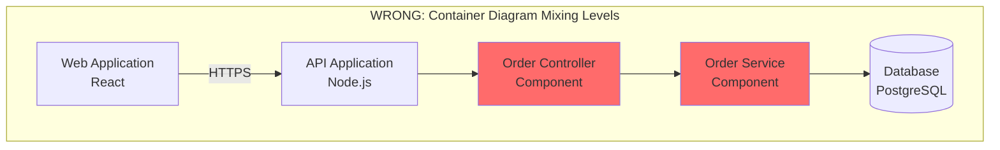

**Correct Version**: Create two separate diagrams:

**Container Diagram** (Level 2):
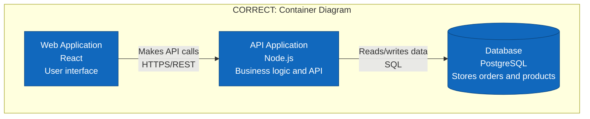

**Component Diagram** (Level 3) - Separate diagram for API container:
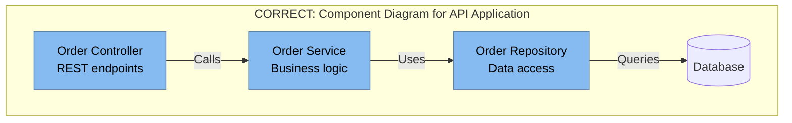

_Requirements: 2.1_

---


#### Anti-Pattern 2: Wrong Level of Detail

**Description**: 

Showing too much or too little detail for the intended audience and purpose. For example, showing database table schemas in a Container diagram, or showing only "Frontend" and "Backend" in a Container diagram for a complex microservices system.

**Why It's Problematic**:

- Too much detail overwhelms the audience and obscures the main message
- Too little detail fails to provide useful information
- Makes diagrams less useful for decision-making
- Wastes time creating detail that won't be used
- Creates maintenance burden for unnecessary detail

**How to Avoid**:

- Identify your audience and their information needs before starting
- Ask "What decisions will this diagram support?"
- Use the "zoom in" principle: start high-level, add detail only where needed
- Create multiple diagrams at different levels rather than one overly detailed diagram
- Get feedback from the intended audience on whether detail level is appropriate

**Correct Approach**:

Match detail level to audience and purpose:
- **Executive/Business**: System Context only
- **Technical Leadership**: System Context + Container
- **Development Teams**: Container + Component (for their areas)
- **New Team Members**: All levels for onboarding
- **Architecture Reviews**: Focus on the level being discussed

**Example**:

**WRONG - Too Little Detail**:
```
Container Diagram showing only:
- Frontend (no technology, no specifics)
- Backend (no technology, no specifics)
- Database (no technology, no specifics)
```
This provides almost no useful information for technical decisions.

**WRONG - Too Much Detail**:
```
Container Diagram showing:
- Web Application with all npm packages listed
- API with every endpoint documented
- Database with complete schema including all columns and indexes
- Every configuration file and environment variable
```
This is overwhelming and belongs in code/documentation, not architecture diagrams.

**CORRECT - Appropriate Detail**:
```
Container Diagram showing:
- Web Application (React, TypeScript) - "Customer-facing UI"
- API Gateway (Kong) - "Routes requests, handles auth"
- Order Service (Java/Spring Boot) - "Manages orders"
- Product Service (Node.js/Express) - "Manages catalog"
- Order Database (PostgreSQL) - "Stores orders"
- Product Database (MongoDB) - "Stores product catalog"
```
This provides enough detail for technical discussions without overwhelming.

_Requirements: 2.1_

---


#### Anti-Pattern 3: Inconsistent Granularity

**Description**: 

Showing some containers or components at a very detailed level while others are shown as single boxes, creating an unbalanced diagram where some areas are over-specified and others under-specified.

**Why It's Problematic**:

- Suggests some areas are more important than others (when they may not be)
- Creates confusion about the actual architecture
- Makes it hard to understand relative complexity
- Indicates incomplete analysis or documentation
- Leads to questions about why some areas have more detail

**How to Avoid**:

- Decide on a consistent level of granularity before starting
- If one area needs more detail, create a separate diagram for it
- Review the diagram and ask "Are all elements at roughly the same level?"
- Document why certain areas are shown in more detail if necessary
- Use separate Component diagrams for complex containers rather than mixing detail levels

**Correct Approach**:

Maintain consistent granularity within each diagram:
- All containers should represent similar-sized deployable units
- All components should represent similar-sized logical groupings
- If one area is more complex, create a separate drill-down diagram
- Use notes or annotations to indicate "simplified for clarity" if needed

**Example**:

**WRONG - Inconsistent Granularity**:
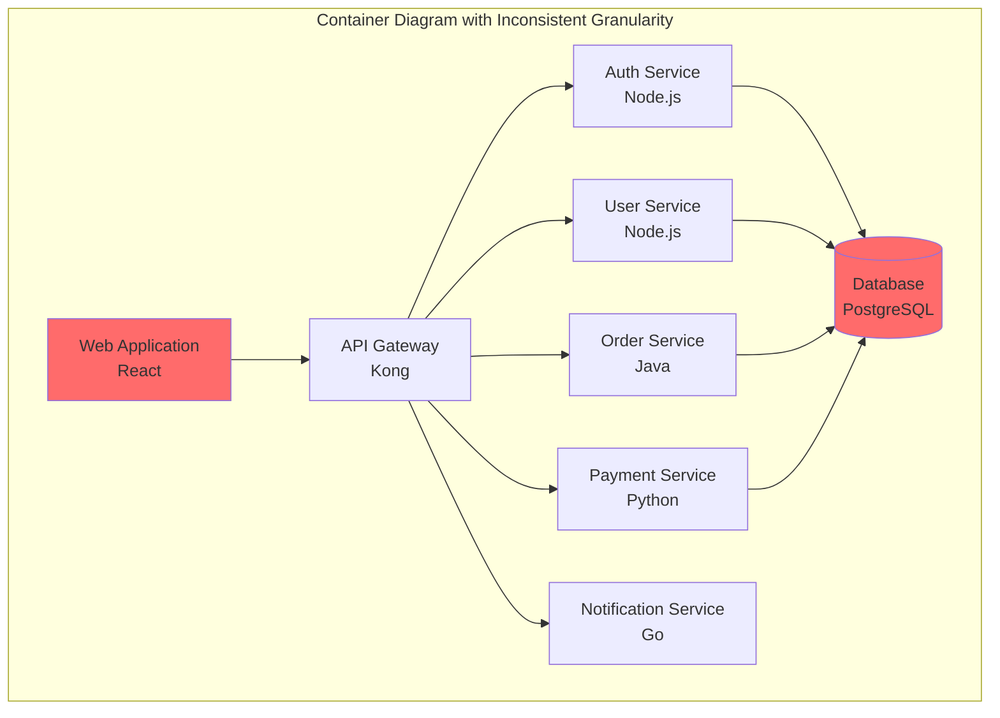


**CORRECT - Consistent Granularity**:
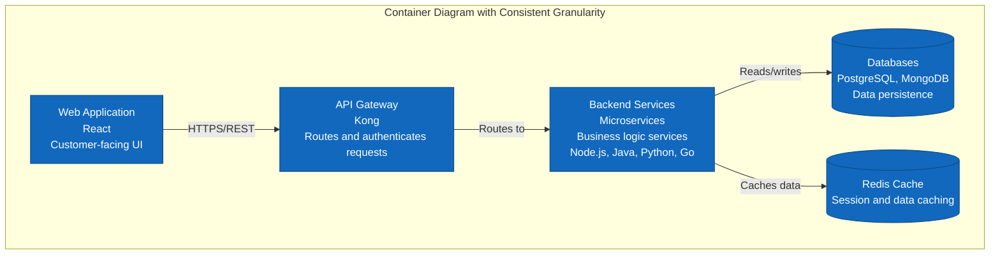

**Note**: If you need to show individual microservices, create a separate, more detailed Container diagram specifically for the backend services.

_Requirements: 2.1_

---

#### Anti-Pattern 4: Showing Implementation Details at Wrong Level

**Description**: 

Including code-level details (classes, methods, design patterns) in Container or Component diagrams, or showing deployment details (servers, networks) in logical architecture diagrams.

**Why It's Problematic**:

- Mixes logical and physical architecture concerns
- Makes diagrams harder to maintain as code changes
- Obscures the high-level structure with low-level details
- Creates confusion about what the diagram is trying to communicate
- Violates separation of concerns

**How to Avoid**:

- Keep logical architecture (Context, Container, Component) separate from physical architecture (Deployment)
- Save code details for Code diagrams or code documentation
- Focus on "what" and "why" at higher levels, save "how" for lower levels
- Ask "Does this detail help understand the architecture or just the implementation?"
- Use separate diagrams for different concerns

**Correct Approach**:

- **Container Diagram**: Show deployable units and their technologies, not classes or methods
- **Component Diagram**: Show logical groupings and responsibilities, not specific classes
- **Code Diagram**: Show classes, interfaces, and relationships (rarely needed)
- **Deployment Diagram**: Show physical infrastructure, servers, networks

**Example**:

**WRONG**:
```
Container Diagram showing:
- "API Application (Spring Boot) using Singleton pattern for OrderService,
  Factory pattern for PaymentProcessor, Repository pattern for data access,
  running on Tomcat 9.0.45 with 4GB heap, deployed to AWS EC2 t3.large
  in us-east-1a availability zone"
```

**CORRECT**:
```
Container Diagram:
- "API Application (Java/Spring Boot) - Handles order processing and payment"

Deployment Diagram (separate):
- "API Application deployed to AWS EC2 t3.large in us-east-1a"

Component Diagram (separate, if needed):
- Shows OrderService, PaymentProcessor, OrderRepository as components

Code Documentation (not in C4):
- Design patterns and implementation details
```

_Requirements: 2.1_

---

### Over-Documentation Anti-Patterns

These anti-patterns occur when teams create too many diagrams or too much detail, leading to maintenance burden and confusion.

---


#### Anti-Pattern 5: Diagram Proliferation

**Description**: 

Creating too many diagrams - a diagram for every possible view, every container, every component, every scenario. This often results in dozens or hundreds of diagrams that nobody maintains or uses.

**Why It's Problematic**:

- Creates massive maintenance burden
- Most diagrams are never looked at after creation
- Leads to documentation drift as diagrams become outdated
- Wastes time creating diagrams that provide little value
- Makes it hard to find the useful diagrams among the noise
- Team loses confidence in documentation accuracy

**How to Avoid**:

- Create diagrams only when they provide clear value
- Ask "Who will use this diagram and for what purpose?"
- Start with Context and Container, add others only if needed
- Focus on areas of complexity or frequent questions
- Review existing diagrams before creating new ones
- Delete or archive diagrams that are no longer useful

**Correct Approach**:

**Minimum Viable Documentation**:
- 1 System Context diagram (always)
- 1-2 Container diagrams (main system, maybe deployment view)
- 2-5 Component diagrams (only for complex containers)
- 0 Code diagrams (let IDE generate these)

**When to Add More**:
- New team members frequently ask about a specific area
- Architecture review requires deeper detail
- Complex integration needs documentation
- Regulatory compliance requires it

**Example**:

**WRONG - Over-Documentation**:
```
Project with 50 microservices has:
- 1 System Context
- 1 System Landscape
- 5 Container diagrams (one per domain)
- 50 Component diagrams (one per microservice)
- 200 Sequence diagrams (one per API endpoint)
- 100 Deployment diagrams (one per service per environment)
Total: 357 diagrams that nobody maintains
```

**CORRECT - Focused Documentation**:
```
Same project with:
- 1 System Context (shows all 50 services in context)
- 1 Container diagram (shows all 50 services and key infrastructure)
- 5 Component diagrams (only for the most complex services)
- 3 Deployment diagrams (dev, staging, prod infrastructure)
- 5 Sequence diagrams (only for complex cross-service flows)
Total: 15 diagrams that are actively maintained and used
```

_Requirements: 2.2_

---


#### Anti-Pattern 6: Excessive Detail

**Description**: 

Including every possible detail in diagrams - every configuration option, every environment variable, every error condition, every edge case. The diagram becomes a dense wall of text and boxes that's impossible to understand at a glance.

**Why It's Problematic**:

- Overwhelms readers and obscures the main message
- Makes diagrams hard to maintain as details change frequently
- Violates the principle of abstraction
- Takes excessive time to create
- Most detail is never used or referenced
- Better suited for code comments or documentation

**How to Avoid**:

- Focus on the essential information for the diagram's purpose
- Ask "What's the minimum information needed to understand this?"
- Use "just enough" detail to support decisions
- Put detailed information in supplementary documentation
- Remember: diagrams are for understanding structure, not replacing documentation

**Correct Approach**:

**Container Diagram Should Show**:
- Container name
- Technology/platform
- One-sentence purpose
- Key communication protocols

**Container Diagram Should NOT Show**:
- Configuration files
- Environment variables
- Port numbers (unless critical to understanding)
- Version numbers (unless critical)
- Detailed API specifications
- Error handling details
- Logging configuration
- Monitoring setup

**Example**:

**WRONG - Excessive Detail**:
```
API Service
Technology: Java 17.0.2, Spring Boot 3.1.0, running on Tomcat 10.1.5
Configuration: application.yml, application-prod.yml, application-dev.yml
Environment Variables: DB_HOST, DB_PORT, DB_USER, DB_PASS, REDIS_HOST, 
  REDIS_PORT, JWT_SECRET, API_KEY, LOG_LEVEL, MAX_CONNECTIONS, 
  TIMEOUT_SECONDS, RETRY_ATTEMPTS, CIRCUIT_BREAKER_THRESHOLD
Ports: 8080 (HTTP), 8443 (HTTPS), 9090 (metrics), 8081 (health)
Dependencies: spring-boot-starter-web 3.1.0, spring-boot-starter-data-jpa 3.1.0,
  postgresql-driver 42.6.0, redis-client 4.3.1, jwt-library 0.11.5
Logging: Log4j2 with JSON format, rotating daily, 30-day retention
Monitoring: Prometheus metrics, Grafana dashboards, PagerDuty alerts
Error Handling: Global exception handler, custom error codes, retry logic
```

**CORRECT - Appropriate Detail**:
```
API Service
Java/Spring Boot
Handles order processing and payment
```

_Requirements: 2.2_

---


#### Anti-Pattern 7: Premature Documentation

**Description**: 

Creating detailed architecture diagrams before the architecture is stable, then spending excessive time updating them as the architecture evolves during development. This is especially common in early-stage projects or when exploring new technologies.

**Why It's Problematic**:

- Wastes time documenting architecture that will change
- Creates false sense of certainty about unstable designs
- Discourages architectural experimentation
- Leads to documentation drift as changes aren't reflected
- Can lock teams into suboptimal designs
- Creates maintenance burden during rapid iteration

**How to Avoid**:

- Wait until architecture stabilizes before creating detailed diagrams
- Use lightweight sketches during exploration phase
- Focus on Context diagrams early, add detail later
- Accept that early diagrams will be rough and incomplete
- Use "draft" or "proposed" labels for unstable architectures
- Update diagrams after major architectural changes, not during

**Correct Approach**:

**Exploration Phase** (first 1-2 sprints):
- Rough whiteboard sketches
- Simple Context diagram
- Focus on understanding, not documentation

**Stabilization Phase** (architecture solidifying):
- Create Container diagram
- Document key decisions
- Still expect changes

**Mature Phase** (architecture stable):
- Complete all needed diagrams
- Establish maintenance process
- Update on significant changes

**Example**:

**WRONG - Premature Documentation**:
```
Week 1: Create detailed Container and Component diagrams
Week 2: Realize microservices approach won't work, switch to monolith
Week 3: Update all diagrams for monolith
Week 4: Decide to use serverless instead
Week 5: Recreate all diagrams for serverless
Week 6: Team stops trusting diagrams
```

**CORRECT - Appropriate Timing**:
```
Weeks 1-3: Whiteboard sketches, spike solutions, architecture experiments
Week 4: Architecture stabilizes on microservices approach
Week 5: Create System Context and Container diagrams
Weeks 6-10: Architecture proves stable, add Component diagrams as needed
Ongoing: Update diagrams when architecture changes significantly
```

_Requirements: 2.2_

---

### Under-Documentation Anti-Patterns

These anti-patterns occur when diagrams lack essential information, making them confusing or useless.

---


#### Anti-Pattern 8: Missing Context

**Description**: 

Creating Container or Component diagrams without first establishing the System Context. Readers don't understand what system they're looking at, who uses it, or how it fits into the broader ecosystem.

**Why It's Problematic**:

- Readers lack essential context to understand the diagram
- Can't assess whether the architecture is appropriate
- Don't understand external dependencies and constraints
- Makes it hard to onboard new team members
- Violates the hierarchical principle of C4
- Leads to questions that should be answered by Context diagram

**How to Avoid**:

- Always create System Context diagram first
- Reference the Context diagram from more detailed diagrams
- Include a brief system description at the top of each diagram
- Link diagrams together to show the hierarchy
- Ensure Context diagram is easily accessible

**Correct Approach**:

**Diagram Hierarchy**:
1. Start with System Context (the foundation)
2. Create Container diagram (references Context)
3. Create Component diagrams (reference Container)
4. Each diagram should indicate its place in the hierarchy

**Include Context Information**:
- System name and purpose
- Link to System Context diagram
- Which container/component this diagram zooms into
- Date and version information

**Example**:

**WRONG - Missing Context**:
```
Component Diagram showing:
- OrderController
- OrderService  
- OrderRepository
- PaymentClient

Questions readers will have:
- What system is this?
- What container are these components in?
- Who uses this system?
- What external systems does it integrate with?
- Why does this architecture exist?
```

**CORRECT - With Context**:
```
Component Diagram: Order Service Components
System: E-Commerce Platform
Container: Order Service (see Container diagram)
Purpose: Shows internal structure of the Order Service container

Components:
- OrderController (REST API endpoints)
- OrderService (Business logic)
- OrderRepository (Data access)
- PaymentClient (Integration with Payment Gateway)

See System Context diagram for overall system context
See Container diagram for how Order Service fits with other containers
```

_Requirements: 2.3_

---


#### Anti-Pattern 9: Ambiguous Relationships

**Description**: 

Drawing lines between elements without labels, or with vague labels like "uses" or "talks to". Readers can't understand what data flows between elements, what protocols are used, or what the nature of the relationship is.

**Why It's Problematic**:

- Readers can't understand how components communicate
- Can't assess performance, security, or reliability implications
- Makes it impossible to implement the architecture from the diagram
- Leads to constant questions about "how does X talk to Y?"
- Wastes the value of creating the diagram
- Can lead to incorrect implementation assumptions

**How to Avoid**:

- Label every relationship with its purpose
- Include protocol/technology for Container diagrams
- Indicate direction with arrows
- Specify synchronous vs. asynchronous where relevant
- Be specific about what data or messages flow
- Review diagram and ask "Could someone implement this from the diagram?"

**Correct Approach**:

**Good Relationship Labels**:
- "Reads customer data via HTTPS/REST"
- "Publishes order events to Kafka"
- "Queries product catalog via GraphQL"
- "Sends email via SMTP"
- "Writes order data via SQL"

**Bad Relationship Labels**:
- "Uses"
- "Talks to"
- "Connects to"
- "Depends on"
- No label at all

**Example**:

**WRONG - Ambiguous Relationships**:
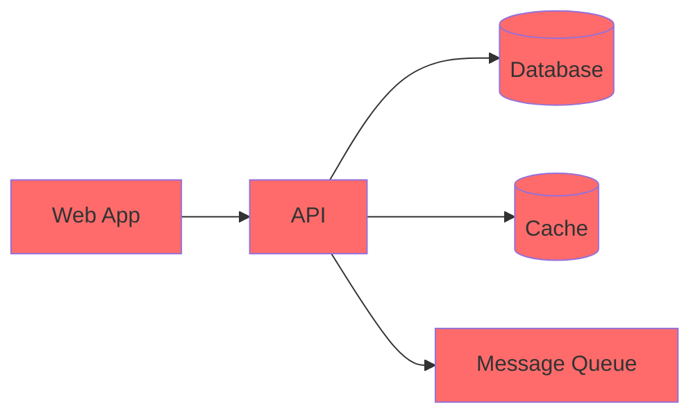

Questions this raises:
- How does Web App talk to API? REST? GraphQL? gRPC?
- What does API do with Database? Read? Write? Both?
- What's the Cache for? What data is cached?
- What messages go to the Queue? When? Why?


**CORRECT - Clear Relationships**:
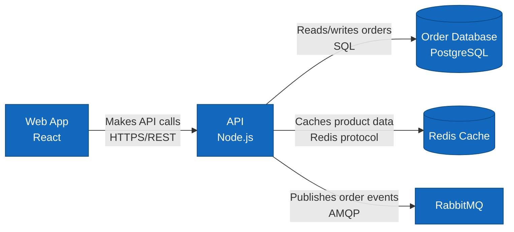

Now it's clear:
- Web App calls API using REST over HTTPS
- API reads and writes order data to PostgreSQL using SQL
- API caches product data in Redis
- API publishes order events to RabbitMQ using AMQP

_Requirements: 2.3_

---

#### Anti-Pattern 10: Insufficient Legends

**Description**: 

Creating diagrams without legends, or with incomplete legends that don't explain the notation used. Readers have to guess what colors, shapes, or line styles mean.

**Why It's Problematic**:

- Readers can't interpret the diagram correctly
- Different people may interpret notation differently
- Makes diagrams less accessible to new team members
- Reduces confidence in the documentation
- Wastes time answering questions about notation
- Inconsistent interpretation leads to miscommunication

**How to Avoid**:

- Include a legend in every diagram
- Explain all colors, shapes, and line styles used
- Define what each element type represents
- Show examples of relationship types
- Make legends comprehensive but concise
- Use consistent legends across all diagrams

**Correct Approach**:

**Minimum Legend Contents**:
- Element types (Person, System, Container, Component)
- Color meanings (if colors are used meaningfully)
- Line style meanings (solid, dashed, dotted)
- Arrow meanings (synchronous, asynchronous, read, write)
- Any special notation or symbols used

**Example**:

**WRONG - No Legend**:
```mermaid
graph TB
    A[Web App] --> B[API]
    B --> C[(Database)]
    B -.-> D[Cache]
    
    style A fill:#1168bd
    style B fill:#1168bd
    style C fill:#1168bd
    style D fill:#999999
```

Questions this raises:
- Why is Cache a different color?
- What does the dotted line mean?
- What do the solid lines mean?
- What are these boxes? Containers? Components?


**CORRECT - With Legend**:
```mermaid
graph TB
    A[Web App<br/>React] -->|HTTPS/REST| B[API<br/>Node.js]
    B -->|SQL| C[(Database<br/>PostgreSQL)]
    B -.->|Optional<br/>Redis protocol| D[Cache<br/>Redis]
    
    style A fill:#1168bd,stroke:#0b4884,color:#ffffff
    style B fill:#1168bd,stroke:#0b4884,color:#ffffff
    style C fill:#1168bd,stroke:#0b4884,color:#ffffff
    style D fill:#999999,stroke:#6b6b6b,color:#ffffff
    
    subgraph Legend
        L1[Container<br/>Blue boxes are containers<br/>in our system]
        L2[External System<br/>Gray boxes are external<br/>or optional systems]
        L3[Solid Line<br/>Required dependency]
        L4[Dotted Line<br/>Optional dependency]
    end
    
    style L1 fill:#1168bd,stroke:#0b4884,color:#ffffff
    style L2 fill:#999999,stroke:#6b6b6b,color:#ffffff
```

Now it's clear:
- Blue boxes are our containers
- Gray boxes are external/optional
- Solid lines are required dependencies
- Dotted lines are optional dependencies

_Requirements: 2.3_

---

### Notation Problems

These anti-patterns relate to inconsistent or unclear notation that makes diagrams hard to understand.

---

#### Anti-Pattern 11: Inconsistent Notation

**Description**: 

Using different notation styles across diagrams, or even within the same diagram. For example, using rectangles for containers in one diagram and rounded rectangles in another, or using different colors for the same type of element.

**Why It's Problematic**:

- Creates confusion about whether different notation means something different
- Makes it harder to learn and remember the notation
- Reduces professional appearance of documentation
- Suggests lack of attention to detail
- Makes it harder to compare diagrams
- Wastes time explaining notation variations

**How to Avoid**:

- Establish a notation standard at the start
- Create a style guide for your diagrams
- Use templates with consistent notation
- Review diagrams for consistency
- Use tools that enforce consistent notation
- Reference the C4 model standard notation

**Correct Approach**:

**Establish Standards**:
- Containers: Always blue rectangles
- External systems: Always gray rectangles
- Databases: Always cylinder shape
- People: Always stick figures or person icons
- Relationships: Always labeled arrows

**Apply Consistently**:
- Use the same notation across all diagrams
- Use the same colors for the same element types
- Use the same line styles for the same relationship types
- Document your notation standards

**Example**:

**WRONG - Inconsistent Notation**:
```
Diagram 1: Containers are blue rectangles
Diagram 2: Containers are green rounded rectangles
Diagram 3: Containers are orange hexagons

Diagram 1: Databases are cylinders
Diagram 2: Databases are rectangles with "DB" label
Diagram 3: Databases are cloud shapes

Diagram 1: Relationships are solid black arrows
Diagram 2: Relationships are dashed blue arrows
Diagram 3: Relationships are red lines with no arrows
```

**CORRECT - Consistent Notation**:
```
All diagrams:
- Containers: Blue rectangles (#1168bd)
- External systems: Gray rectangles (#999999)
- Databases: Cylinder shape
- People: Stick figures
- Synchronous relationships: Solid arrows with labels
- Asynchronous relationships: Dashed arrows with labels
```

_Requirements: 2.4_

---


#### Anti-Pattern 12: Unclear Relationship Direction

**Description**: 

Using lines without arrows, or arrows that don't clearly indicate the direction of dependency or data flow. Readers can't tell who initiates the communication or which way data flows.

**Why It's Problematic**:

- Can't understand which component depends on which
- Can't determine data flow direction
- Makes it impossible to understand initialization order
- Obscures which components need to know about others
- Leads to incorrect implementation
- Makes it hard to assess coupling and dependencies

**How to Avoid**:

- Always use arrows to show direction
- Point arrows in the direction of dependency or data flow
- For bidirectional relationships, use double-headed arrows or two separate arrows
- Be consistent about what arrows mean (dependency vs. data flow)
- Label arrows to clarify the relationship
- Review diagrams and ask "Is the direction clear?"

**Correct Approach**:

**Arrow Conventions**:
- Arrow points from caller to callee
- Arrow points in direction of data flow
- For "A uses B", arrow goes from A to B
- For "A sends data to B", arrow goes from A to B
- For bidirectional, show both directions explicitly

**Example**:

**WRONG - Unclear Direction**:
```mermaid
graph LR
    WebApp[Web App] --- API[API]
    API --- DB[(Database)]
    API --- Cache[(Cache)]
    
    style WebApp fill:#ff6b6b
    style API fill:#ff6b6b
    style DB fill:#ff6b6b
    style Cache fill:#ff6b6b
```

Questions this raises:
- Does Web App call API or does API push to Web App?
- Does API read from Database or does Database push to API?
- What's the relationship with Cache?

**CORRECT - Clear Direction**:
```mermaid
graph LR
    WebApp[Web App] -->|Makes API calls<br/>HTTPS/REST| API[API]
    API -->|Reads/writes<br/>SQL| DB[(Database)]
    API -->|Reads/writes<br/>Redis protocol| Cache[(Cache)]
    
    style WebApp fill:#1168bd,stroke:#0b4884,color:#ffffff
    style API fill:#1168bd,stroke:#0b4884,color:#ffffff
    style DB fill:#1168bd,stroke:#0b4884,color:#ffffff
    style Cache fill:#1168bd,stroke:#0b4884,color:#ffffff
```

Now it's clear:
- Web App calls API (not the other way around)
- API reads and writes to Database
- API reads and writes to Cache

_Requirements: 2.4_

---


#### Anti-Pattern 13: Poor Labeling

**Description**: 

Using vague, generic, or missing labels for elements and relationships. Labels like "Service", "Manager", "Handler", "Utils" that don't convey what the element actually does.

**Why It's Problematic**:

- Readers can't understand what elements do
- Generic names don't convey purpose or responsibility
- Makes it hard to discuss specific components
- Suggests unclear thinking about responsibilities
- Leads to constant questions about "what does X do?"
- Makes diagrams less useful for decision-making

**How to Avoid**:

- Use descriptive, specific names
- Include the purpose or responsibility in the label
- Avoid generic suffixes like "Manager", "Handler", "Service" without context
- Ask "Would someone unfamiliar with the system understand this label?"
- Include technology/platform information where relevant
- Be consistent with naming conventions

**Correct Approach**:

**Good Element Labels**:
- "Order Processing Service" (not just "Service")
- "Customer Database" (not just "Database")
- "Payment Gateway Integration" (not just "Integration")
- "Product Search API" (not just "API")
- "Email Notification Service" (not just "Notification")

**Good Relationship Labels**:
- "Submits orders via REST API"
- "Queries product catalog"
- "Publishes order events"
- "Sends confirmation emails"

**Example**:

**WRONG - Poor Labeling**:
```mermaid
graph TB
    Frontend[Frontend] --> Backend[Backend]
    Backend --> DB[(Database)]
    Backend --> Service[Service]
    Backend --> Manager[Manager]
    Backend --> Handler[Handler]
    
    style Frontend fill:#ff6b6b
    style Backend fill:#ff6b6b
    style DB fill:#ff6b6b
    style Service fill:#ff6b6b
    style Manager fill:#ff6b6b
    style Handler fill:#ff6b6b
```

Questions this raises:
- What does Frontend do? Web? Mobile? Both?
- What does Backend do? What's its responsibility?
- What kind of Database? What data?
- What Service? Service for what?
- What does Manager manage?
- What does Handler handle?


**CORRECT - Clear Labeling**:
```mermaid
graph TB
    WebApp[Customer Web Application<br/>React<br/>Browse products and place orders] 
    
    API[Order Processing API<br/>Node.js/Express<br/>Handles order creation and tracking]
    
    OrderDB[(Order Database<br/>PostgreSQL<br/>Stores orders and order history)]
    
    PaymentService[Payment Processing Service<br/>Python/FastAPI<br/>Processes credit card payments]
    
    InventoryService[Inventory Management Service<br/>Java/Spring Boot<br/>Tracks product stock levels]
    
    EmailHandler[Email Notification Handler<br/>AWS Lambda<br/>Sends order confirmation emails]
    
    WebApp -->|Submits orders<br/>HTTPS/REST| API
    API -->|Stores orders<br/>SQL| OrderDB
    API -->|Processes payment<br/>HTTPS/REST| PaymentService
    API -->|Checks stock<br/>HTTPS/REST| InventoryService
    API -->|Triggers email<br/>SQS message| EmailHandler
    
    style WebApp fill:#1168bd,stroke:#0b4884,color:#ffffff
    style API fill:#1168bd,stroke:#0b4884,color:#ffffff
    style OrderDB fill:#1168bd,stroke:#0b4884,color:#ffffff
    style PaymentService fill:#1168bd,stroke:#0b4884,color:#ffffff
    style InventoryService fill:#1168bd,stroke:#0b4884,color:#ffffff
    style EmailHandler fill:#1168bd,stroke:#0b4884,color:#ffffff
```

Now it's clear:
- Web Application is for customers to browse and order
- API handles order processing
- Database stores orders
- Payment Service processes payments
- Inventory Service tracks stock
- Email Handler sends confirmations

_Requirements: 2.4_

---

#### Anti-Pattern 14: Overuse of Colors Without Meaning

**Description**: 

Using many different colors in diagrams without a clear meaning for each color, or using colors purely for aesthetics. Readers assume colors mean something but can't figure out what.

**Why It's Problematic**:

- Creates confusion about what colors represent
- Readers waste time trying to understand color meanings
- Can make diagrams harder to read (especially for colorblind users)
- Suggests meaning where none exists
- Makes diagrams look unprofessional
- Reduces accessibility

**How to Avoid**:

- Use colors purposefully and sparingly
- Define what each color means in the legend
- Limit color palette to 3-4 colors maximum
- Use color to highlight important distinctions only
- Consider colorblind-friendly palettes
- Default to grayscale if colors don't add meaning

**Correct Approach**:

**Good Color Usage**:
- Blue: Containers in our system
- Gray: External systems
- Red: Critical/high-risk components
- Green: New/proposed components
- Yellow: Deprecated components

**Bad Color Usage**:
- Random colors for aesthetic purposes
- Different color for each container with no pattern
- Colors that don't mean anything
- Too many colors (rainbow effect)

**Example**:

**WRONG - Meaningless Colors**:
```mermaid
graph TB
    A[Web App] --> B[API]
    B --> C[(Database)]
    B --> D[Cache]
    B --> E[Queue]
    
    style A fill:#ff6b6b
    style B fill:#4ecdc4
    style C fill:#ffe66d
    style D fill:#a8e6cf
    style E fill:#ff8b94
```

Why are these different colors? What do they mean?


**CORRECT - Meaningful Colors**:
```mermaid
graph TB
    A[Web App<br/>React] --> B[API<br/>Node.js]
    B --> C[(Database<br/>PostgreSQL)]
    B --> D[Cache<br/>Redis]
    B --> E[Queue<br/>RabbitMQ]
    
    style A fill:#1168bd,stroke:#0b4884,color:#ffffff
    style B fill:#1168bd,stroke:#0b4884,color:#ffffff
    style C fill:#1168bd,stroke:#0b4884,color:#ffffff
    style D fill:#1168bd,stroke:#0b4884,color:#ffffff
    style E fill:#1168bd,stroke:#0b4884,color:#ffffff
    
    subgraph Legend
        L1[All containers in our system<br/>shown in blue]
    end
    
    style L1 fill:#1168bd,stroke:#0b4884,color:#ffffff
```

All containers are the same color because they're all part of our system.

_Requirements: 2.4_

---

### Maintenance Issues

These anti-patterns relate to keeping diagrams accurate and useful over time.

---

#### Anti-Pattern 15: Outdated Diagrams

**Description**: 

Creating diagrams and never updating them as the architecture evolves. Diagrams show the system as it was 6 months or 2 years ago, not as it is today.

**Why It's Problematic**:

- Misleads new team members about the actual architecture
- Wastes time of people trying to understand the system
- Erodes trust in all documentation
- Can lead to incorrect implementation decisions
- Makes diagrams useless or harmful
- Suggests lack of ownership and care

**How to Avoid**:

- Assign ownership for each diagram
- Update diagrams when architecture changes
- Include "last updated" date on diagrams
- Review diagrams during architecture reviews
- Make diagram updates part of definition of done
- Use tools that can generate diagrams from code
- Archive outdated diagrams rather than leaving them misleading

**Correct Approach**:

**Update Triggers**:
- New container added or removed
- Major technology change
- Significant refactoring
- New external system integration
- Change in communication patterns
- Quarterly review even if no changes

**Update Process**:
- Identify what changed
- Update affected diagrams
- Update "last modified" date
- Review with team
- Commit to version control

**Example**:

**WRONG - Outdated Diagram**:
```
Diagram created: January 2022
Last updated: January 2022
Current date: October 2024

Diagram shows:
- Monolithic application
- MySQL database
- No caching layer

Actual current architecture:
- 15 microservices
- PostgreSQL database
- Redis cache
- Kafka message bus
- Kubernetes deployment

Result: Diagram is completely useless and misleading
```

**CORRECT - Maintained Diagram**:
```
Diagram created: January 2022
Last updated: September 2024
Current date: October 2024

Diagram shows current architecture:
- 15 microservices (added incrementally)
- PostgreSQL database (migrated from MySQL in March 2023)
- Redis cache (added June 2023)
- Kafka message bus (added August 2024)
- Kubernetes deployment (migrated December 2023)

Update history maintained in version control
```

_Requirements: 2.4_

---


#### Anti-Pattern 16: No Ownership

**Description**: 

Creating diagrams without assigning clear ownership or responsibility for maintaining them. Nobody knows who should update the diagrams when the architecture changes, so they don't get updated.

**Why It's Problematic**:

- Diagrams become outdated quickly
- Nobody feels responsible for accuracy
- Updates don't happen consistently
- Quality degrades over time
- Creates "tragedy of the commons" situation
- Makes it unclear who to ask about diagrams

**How to Avoid**:

- Assign an owner for each diagram or set of diagrams
- Make ownership visible (include owner name in diagram)
- Include diagram maintenance in role responsibilities
- Rotate ownership to spread knowledge
- Make updates part of architecture review process
- Include diagram updates in sprint planning

**Correct Approach**:

**Ownership Models**:

**Option 1: Team Ownership**
- Entire team owns all diagrams
- Updates are part of definition of done
- Team reviews diagrams regularly

**Option 2: Role-Based Ownership**
- Architect owns Context and Container diagrams
- Tech leads own Component diagrams for their areas
- Clear escalation path for questions

**Option 3: Area-Based Ownership**
- Each team owns diagrams for their services
- Platform team owns infrastructure diagrams
- Architecture team owns system-level diagrams

**Example**:

**WRONG - No Ownership**:
```
System Context Diagram
Created by: John (left company 2 years ago)
Owner: Unknown
Last updated: 2 years ago
Questions about this diagram: Ask... someone?

Result: Nobody updates it, nobody knows if it's accurate
```

**CORRECT - Clear Ownership**:
```
System Context Diagram
Owner: Architecture Team (architecture@company.com)
Primary Contact: Sarah Chen (sarah.chen@company.com)
Last updated: September 2024
Next review: December 2024
Update process: See CONTRIBUTING.md

Ownership responsibilities:
- Review quarterly
- Update when major changes occur
- Respond to questions within 2 business days
- Ensure accuracy before architecture reviews
```

_Requirements: 2.4_

---


#### Anti-Pattern 17: Disconnected from Code

**Description**: 

Creating diagrams that exist separately from the codebase with no connection or traceability. Developers don't know the diagrams exist, or can't find them, or don't see them as relevant to their work.

**Why It's Problematic**:

- Diagrams and code drift apart
- Developers don't reference diagrams when making changes
- Diagrams don't get updated when code changes
- Creates two sources of truth that diverge
- Wastes the effort of creating diagrams
- Reduces value of architecture documentation

**How to Avoid**:

- Store diagrams in the code repository
- Link diagrams from README files
- Reference diagrams in pull request templates
- Include diagram review in code review process
- Use tools that generate diagrams from code
- Make diagrams part of onboarding process
- Link from code to diagrams (comments with URLs)

**Correct Approach**:

**Integration Strategies**:

**Store with Code**:
```
repository/
├── docs/
│   ├── architecture/
│   │   ├── context.md
│   │   ├── container.md
│   │   └── components/
│   │       ├── order-service.md
│   │       └── payment-service.md
├── src/
├── README.md (links to docs/architecture/)
```

**Link from Code**:
```java
/**
 * Order Service handles order processing and management.
 * 
 * Architecture: See docs/architecture/components/order-service.md
 * Container diagram: See docs/architecture/container.md
 */
public class OrderService {
    // ...
}
```

**Include in PR Template**:
```markdown
## Pull Request Checklist
- [ ] Code changes implemented
- [ ] Tests added/updated
- [ ] Documentation updated
- [ ] Architecture diagrams updated (if architecture changed)
```

**Example**:

**WRONG - Disconnected**:
```
Diagrams stored in:
- Confluence wiki (separate from code)
- PowerPoint on shared drive
- Architect's laptop
- Whiteboard photos in Slack

Developers:
- Don't know diagrams exist
- Can't find them when needed
- Don't update them when code changes
- Create their own informal diagrams

Result: Multiple conflicting versions, none accurate
```

**CORRECT - Connected**:
```
Diagrams stored in:
- /docs/architecture/ in main repository
- Linked from README.md
- Referenced in code comments
- Included in onboarding documentation

Developers:
- See diagrams during onboarding
- Reference them when making changes
- Update them as part of PR process
- Use them in design discussions

Result: Single source of truth, kept up to date
```

_Requirements: 2.4_

---

## Summary: Avoiding Anti-Patterns

### Quick Reference Checklist

**Before Creating a Diagram**:
- [ ] Do I need this diagram? Who will use it?
- [ ] What level of abstraction is appropriate?
- [ ] Have I created the Context diagram first?
- [ ] Do I have a clear purpose and audience?

**While Creating a Diagram**:
- [ ] Am I staying at one abstraction level?
- [ ] Are all relationships labeled clearly?
- [ ] Is the notation consistent?
- [ ] Have I included a legend?
- [ ] Are element names specific and descriptive?
- [ ] Is the direction of relationships clear?

**After Creating a Diagram**:
- [ ] Is there an owner assigned?
- [ ] Is it stored with the code?
- [ ] Is the "last updated" date included?
- [ ] Have I linked it from relevant documentation?
- [ ] Can someone unfamiliar with the system understand it?
- [ ] Have I avoided over-documenting?

**Maintaining Diagrams**:
- [ ] Are diagrams reviewed regularly?
- [ ] Are they updated when architecture changes?
- [ ] Is there a process for keeping them current?
- [ ] Are outdated diagrams archived or deleted?

### Key Principles to Remember

1. **Abstraction**: Keep each diagram at one level of abstraction
2. **Clarity**: Label everything clearly and specifically
3. **Consistency**: Use consistent notation across all diagrams
4. **Context**: Always provide context for understanding
5. **Purpose**: Create diagrams with a clear purpose and audience
6. **Maintenance**: Assign ownership and keep diagrams current
7. **Integration**: Store diagrams with code and link them together
8. **Simplicity**: Avoid over-documentation and excessive detail
9. **Accessibility**: Include legends and use accessible notation
10. **Value**: Only create diagrams that provide clear value

By avoiding these anti-patterns and following best practices, your C4 diagrams will be clear, useful, and maintainable - serving as valuable architecture documentation that teams actually use.

_Requirements: 2.1, 2.2, 2.3, 2.4_

---

## Real-World Examples

This section provides complete, realistic examples of C4 diagrams applied to real-world systems across different domains. Each example includes all four C4 levels (Context, Container, Component, and optionally Code), along with architectural decisions, technology choices, and design patterns. These examples demonstrate how C4 scales from simple to complex systems and how it applies across different architectural styles and industries.

### Example 1: E-Commerce Platform

#### System Overview

**ShopSphere** is a modern B2C e-commerce platform that enables customers to browse products, place orders, and track deliveries. The platform serves both web and mobile customers, processing thousands of orders daily with peak traffic during sales events. The system integrates with multiple external services for payments, inventory management, shipping, and customer communications.

#### Key Characteristics

- **Scale**: 100,000+ daily active users, 10,000+ orders per day
- **Architecture Style**: Microservices with event-driven communication
- **Deployment**: Cloud-native on AWS with multi-region support
- **Technology Stack**: Polyglot (Node.js, Java, Python) with React frontend
- **Data Strategy**: Polyglot persistence (PostgreSQL, MongoDB, Redis)
- **Integration Pattern**: API Gateway with service mesh

#### Architectural Drivers

1. **Scalability**: Must handle 10x traffic during flash sales and holiday seasons
2. **Availability**: 99.9% uptime SLA with graceful degradation
3. **Performance**: Sub-second page loads, <100ms API response times
4. **Security**: PCI-DSS compliance for payment processing, GDPR compliance for customer data
5. **Flexibility**: Ability to rapidly add new features and integrate new services
6. **Maintainability**: Independent team ownership of services with clear boundaries

---

#### Level 1: System Context Diagram

This diagram shows ShopSphere in its broader ecosystem, including the customers who use it and the external systems it depends on.

```mermaid
graph TB
    Customer[Customer<br/>Person<br/>Browses products, places orders,<br/>tracks deliveries]
    Admin[Administrator<br/>Person<br/>Manages products, inventory,<br/>handles customer service]
    
    ShopSphere[ShopSphere E-Commerce Platform<br/>Software System<br/>Enables customers to browse products,<br/>place orders, manage accounts,<br/>and track deliveries]
    
    PaymentGateway[Stripe Payment Gateway<br/>External System<br/>Processes credit card payments<br/>and handles PCI compliance]
    InventorySystem[Warehouse Management System<br/>External System<br/>Tracks product stock levels<br/>across warehouses]
    ShippingProvider[ShipFast API<br/>External System<br/>Calculates shipping costs,<br/>creates labels, tracks packages]
    EmailService[SendGrid Email Service<br/>External System<br/>Sends transactional emails<br/>and marketing campaigns]
    Analytics[Google Analytics<br/>External System<br/>Tracks user behavior<br/>and conversion metrics]
    
    Customer -->|Browses products, places orders,<br/>tracks deliveries, manages account<br/>HTTPS| ShopSphere
    Admin -->|Manages products, views orders,<br/>handles customer service<br/>HTTPS| ShopSphere
    
    ShopSphere -->|Processes payments<br/>HTTPS/REST API| PaymentGateway
    ShopSphere -->|Checks stock levels,<br/>reserves inventory<br/>HTTPS/REST API| InventorySystem
    ShopSphere -->|Calculates shipping costs,<br/>creates shipping labels<br/>HTTPS/REST API| ShippingProvider
    ShopSphere -->|Sends order confirmations,<br/>shipping notifications<br/>HTTPS/REST API| EmailService
    ShopSphere -->|Sends page views,<br/>conversion events<br/>HTTPS/JavaScript| Analytics
    
    style ShopSphere fill:#1168bd,stroke:#0b4884,color:#ffffff
    style Customer fill:#08427b,stroke:#052e56,color:#ffffff
    style Admin fill:#08427b,stroke:#052e56,color:#ffffff
    style PaymentGateway fill:#999999,stroke:#6b6b6b,color:#ffffff
    style InventorySystem fill:#999999,stroke:#6b6b6b,color:#ffffff
    style ShippingProvider fill:#999999,stroke:#6b6b6b,color:#ffffff
    style EmailService fill:#999999,stroke:#6b6b6b,color:#ffffff
    style Analytics fill:#999999,stroke:#6b6b6b,color:#ffffff
```

**Legend:**
- **Blue box**: ShopSphere system (in scope)
- **Dark blue figures**: Users (Customer, Administrator)
- **Gray boxes**: External systems and services
- **Arrows**: Interactions with protocols

**Key Integration Points:**
- **Payment Gateway**: Critical path for revenue, requires PCI compliance
- **Inventory System**: Real-time stock checks prevent overselling
- **Shipping Provider**: Automated label generation and tracking
- **Email Service**: Transactional emails for order lifecycle
- **Analytics**: Business intelligence and conversion tracking

---

#### Level 2: Container Diagram

This diagram zooms into ShopSphere to show the major applications, services, and data stores that comprise the system.

```mermaid
graph TB
    subgraph "ShopSphere E-Commerce Platform"
        WebApp[Web Application<br/>React SPA<br/>Provides e-commerce UI<br/>running in customer's browser]
        MobileApp[Mobile App<br/>React Native<br/>iOS and Android shopping app<br/>with native features]
        AdminPortal[Admin Portal<br/>React SPA<br/>Product and order management<br/>for administrators]
        
        APIGateway[API Gateway<br/>Kong<br/>Routes requests, authentication,<br/>rate limiting, API composition]
        
        ProductService[Product Catalog Service<br/>Node.js/Express<br/>Manages product catalog,<br/>search, recommendations]
        OrderService[Order Service<br/>Java/Spring Boot<br/>Handles order processing,<br/>order lifecycle, order history]
        PaymentService[Payment Service<br/>Python/FastAPI<br/>Processes payments,<br/>manages transactions, refunds]
        UserService[User Service<br/>Node.js/Express<br/>Manages user accounts,<br/>authentication, profiles]
        CartService[Shopping Cart Service<br/>Node.js/Express<br/>Manages shopping carts,<br/>cart persistence]
        NotificationService[Notification Service<br/>Python/FastAPI<br/>Sends emails, SMS,<br/>push notifications]
        
        ProductDB[(Product Database<br/>MongoDB<br/>Product catalog, images,<br/>descriptions, categories)]
        OrderDB[(Order Database<br/>PostgreSQL<br/>Orders, order items,<br/>order status, history)]
        UserDB[(User Database<br/>PostgreSQL<br/>User accounts, credentials,<br/>preferences, addresses)]
        
        Cache[Cache<br/>Redis<br/>Session data, product cache,<br/>shopping carts]
        MessageQueue[Message Queue<br/>RabbitMQ<br/>Async event processing,<br/>order events, notifications]
        SearchEngine[Search Engine<br/>Elasticsearch<br/>Product search,<br/>faceted navigation]
    end
    
    WebApp -->|Makes API calls<br/>HTTPS/REST| APIGateway
    MobileApp -->|Makes API calls<br/>HTTPS/REST| APIGateway
    AdminPortal -->|Makes API calls<br/>HTTPS/REST| APIGateway
    
    APIGateway -->|Routes requests<br/>HTTPS/REST| ProductService
    APIGateway -->|Routes requests<br/>HTTPS/REST| OrderService
    APIGateway -->|Routes requests<br/>HTTPS/REST| PaymentService
    APIGateway -->|Routes requests<br/>HTTPS/REST| UserService
    APIGateway -->|Routes requests<br/>HTTPS/REST| CartService
    
    ProductService -->|Reads/writes<br/>MongoDB protocol| ProductDB
    ProductService -->|Indexes products<br/>HTTPS/REST| SearchEngine
    ProductService -->|Caches products<br/>Redis protocol| Cache
    
    OrderService -->|Reads/writes<br/>SQL/JDBC| OrderDB
    OrderService -->|Publishes events<br/>AMQP| MessageQueue
    OrderService -->|Calls<br/>HTTPS/REST| PaymentService
    OrderService -->|Checks inventory<br/>HTTPS/REST| InventorySystem[Inventory System]
    
    PaymentService -->|Processes payments<br/>HTTPS/REST| PaymentGateway[Payment Gateway]
    
    UserService -->|Reads/writes<br/>SQL/JDBC| UserDB
    UserService -->|Caches sessions<br/>Redis protocol| Cache
    
    CartService -->|Stores carts<br/>Redis protocol| Cache
    CartService -->|Gets product info<br/>HTTPS/REST| ProductService
    
    NotificationService -->|Consumes events<br/>AMQP| MessageQueue
    NotificationService -->|Sends emails<br/>HTTPS/REST| EmailService[Email Service]
    
    style WebApp fill:#1168bd,stroke:#0b4884,color:#ffffff
    style MobileApp fill:#1168bd,stroke:#0b4884,color:#ffffff
    style AdminPortal fill:#1168bd,stroke:#0b4884,color:#ffffff
    style APIGateway fill:#1168bd,stroke:#0b4884,color:#ffffff
    style ProductService fill:#1168bd,stroke:#0b4884,color:#ffffff
    style OrderService fill:#1168bd,stroke:#0b4884,color:#ffffff
    style PaymentService fill:#1168bd,stroke:#0b4884,color:#ffffff
    style UserService fill:#1168bd,stroke:#0b4884,color:#ffffff
    style CartService fill:#1168bd,stroke:#0b4884,color:#ffffff
    style NotificationService fill:#1168bd,stroke:#0b4884,color:#ffffff
    style ProductDB fill:#1168bd,stroke:#0b4884,color:#ffffff
    style OrderDB fill:#1168bd,stroke:#0b4884,color:#ffffff
    style UserDB fill:#1168bd,stroke:#0b4884,color:#ffffff
    style Cache fill:#1168bd,stroke:#0b4884,color:#ffffff
    style MessageQueue fill:#1168bd,stroke:#0b4884,color:#ffffff
    style SearchEngine fill:#1168bd,stroke:#0b4884,color:#ffffff
    style PaymentGateway fill:#999999,stroke:#6b6b6b,color:#ffffff
    style InventorySystem fill:#999999,stroke:#6b6b6b,color:#ffffff
    style EmailService fill:#999999,stroke:#6b6b6b,color:#ffffff
```

**Legend:**
- **Blue boxes**: Containers within ShopSphere (applications, services, databases)
- **Gray boxes**: External systems
- **Solid arrows**: Synchronous communication (request/response)
- **Labels**: Communication protocol and purpose

**Container Responsibilities:**

**Frontend Containers:**
- **Web Application**: Browser-based SPA for desktop/tablet customers
- **Mobile App**: Native mobile experience with offline capabilities
- **Admin Portal**: Internal tool for product and order management

**Backend Services:**
- **API Gateway**: Single entry point, handles cross-cutting concerns (auth, rate limiting)
- **Product Catalog Service**: Product data, search, recommendations
- **Order Service**: Core business logic for order processing
- **Payment Service**: Payment processing, PCI compliance boundary
- **User Service**: User management, authentication, authorization
- **Cart Service**: Shopping cart management with session persistence
- **Notification Service**: Async notification delivery (email, SMS, push)

**Data Stores:**
- **Product Database (MongoDB)**: Document store for flexible product schemas
- **Order Database (PostgreSQL)**: Relational store for transactional order data
- **User Database (PostgreSQL)**: Relational store for user accounts
- **Cache (Redis)**: High-performance caching and session storage
- **Message Queue (RabbitMQ)**: Async event processing and service decoupling
- **Search Engine (Elasticsearch)**: Full-text search and faceted navigation

**Key Design Patterns:**
- **API Gateway Pattern**: Single entry point for all client requests
- **Database per Service**: Each service owns its data store
- **Event-Driven Architecture**: Services communicate via events for async operations
- **CQRS**: Separate read and write models for product search
- **Cache-Aside**: Redis caching for frequently accessed data

---

#### Level 3: Component Diagram - Order Service

This diagram shows the internal structure of the Order Service, which is the most complex service in the system.

```mermaid
graph TB
    subgraph "Order Service (Java/Spring Boot)"
        OrderController[Order Controller<br/>REST Controller<br/>Handles HTTP requests,<br/>validates input, returns responses]
        OrderQueryController[Order Query Controller<br/>REST Controller<br/>Handles order history<br/>and status queries]
        
        OrderCommandService[Order Command Service<br/>Service<br/>Processes order commands,<br/>orchestrates order creation]
        OrderQueryService[Order Query Service<br/>Service<br/>Retrieves order data,<br/>formats responses]
        PaymentOrchestrator[Payment Orchestrator<br/>Service<br/>Coordinates payment processing,<br/>handles retries and failures]
        InventoryClient[Inventory Client<br/>Service<br/>Communicates with inventory system,<br/>reserves stock]
        
        OrderRepository[Order Repository<br/>Repository<br/>Data access for orders,<br/>CRUD operations]
        OrderEventPublisher[Order Event Publisher<br/>Service<br/>Publishes order events<br/>to message queue]
        
        OrderValidator[Order Validator<br/>Component<br/>Validates order data,<br/>business rules]
        PricingCalculator[Pricing Calculator<br/>Component<br/>Calculates totals, taxes,<br/>discounts, shipping]
        
        OrderDB[(Order Database<br/>PostgreSQL)]
        MessageQueue[Message Queue<br/>RabbitMQ]
        PaymentService[Payment Service]
        InventorySystem[Inventory System]
        ProductService[Product Service]
    end
    
    OrderController -->|Delegates to| OrderCommandService
    OrderQueryController -->|Delegates to| OrderQueryService
    
    OrderCommandService -->|Uses| OrderValidator
    OrderCommandService -->|Uses| PricingCalculator
    OrderCommandService -->|Uses| PaymentOrchestrator
    OrderCommandService -->|Uses| InventoryClient
    OrderCommandService -->|Uses| OrderRepository
    OrderCommandService -->|Uses| OrderEventPublisher
    
    OrderQueryService -->|Uses| OrderRepository
    
    PaymentOrchestrator -->|Calls<br/>HTTPS/REST| PaymentService
    InventoryClient -->|Calls<br/>HTTPS/REST| InventorySystem
    
    OrderValidator -->|Gets product data<br/>HTTPS/REST| ProductService
    PricingCalculator -->|Gets product prices<br/>HTTPS/REST| ProductService
    
    OrderRepository -->|Reads/writes<br/>SQL/JDBC| OrderDB
    OrderEventPublisher -->|Publishes events<br/>AMQP| MessageQueue
    
    style OrderController fill:#85bbf0,stroke:#5d82a8,color:#000000
    style OrderQueryController fill:#85bbf0,stroke:#5d82a8,color:#000000
    style OrderCommandService fill:#85bbf0,stroke:#5d82a8,color:#000000
    style OrderQueryService fill:#85bbf0,stroke:#5d82a8,color:#000000
    style PaymentOrchestrator fill:#85bbf0,stroke:#5d82a8,color:#000000
    style InventoryClient fill:#85bbf0,stroke:#5d82a8,color:#000000
    style OrderRepository fill:#85bbf0,stroke:#5d82a8,color:#000000
    style OrderEventPublisher fill:#85bbf0,stroke:#5d82a8,color:#000000
    style OrderValidator fill:#85bbf0,stroke:#5d82a8,color:#000000
    style PricingCalculator fill:#85bbf0,stroke:#5d82a8,color:#000000
```

**Legend:**
- **Light blue boxes**: Components within Order Service
- **Arrows**: Component dependencies and interactions

**Component Responsibilities:**

**Controllers (API Layer):**
- **Order Controller**: Handles order creation and modification requests
- **Order Query Controller**: Handles order history and status queries (CQRS pattern)

**Services (Business Logic Layer):**
- **Order Command Service**: Orchestrates order creation workflow, coordinates multiple operations
- **Order Query Service**: Retrieves and formats order data for queries
- **Payment Orchestrator**: Manages payment processing with retry logic and error handling
- **Inventory Client**: Abstracts communication with external inventory system

**Repository (Data Access Layer):**
- **Order Repository**: Encapsulates database access, provides clean data access API

**Supporting Components:**
- **Order Event Publisher**: Publishes domain events for async processing
- **Order Validator**: Validates order data against business rules
- **Pricing Calculator**: Calculates order totals, taxes, discounts, shipping costs

**Key Design Patterns:**
- **CQRS**: Separate command and query paths for scalability
- **Repository Pattern**: Abstracts data access
- **Service Layer**: Business logic separated from controllers
- **Orchestration**: Payment Orchestrator coordinates complex payment flows
- **Event Publishing**: Domain events for loose coupling

---

#### Level 4: Code Diagram - Order Domain Model

This optional diagram shows the key classes in the Order domain model, demonstrating how the domain is structured at the code level.

```mermaid
classDiagram
    class Order {
        +UUID orderId
        +UUID customerId
        +OrderStatus status
        +Money totalAmount
        +Money taxAmount
        +Money shippingAmount
        +Address shippingAddress
        +PaymentMethod paymentMethod
        +LocalDateTime createdAt
        +LocalDateTime updatedAt
        +List~OrderItem~ items
        +placeOrder()
        +cancel()
        +updateStatus(OrderStatus)
        +calculateTotal() Money
    }
    
    class OrderItem {
        +UUID orderItemId
        +UUID productId
        +String productName
        +int quantity
        +Money unitPrice
        +Money totalPrice
        +calculateTotal() Money
    }
    
    class OrderStatus {
        <<enumeration>>
        PENDING
        CONFIRMED
        PROCESSING
        SHIPPED
        DELIVERED
        CANCELLED
    }
    
    class Money {
        +BigDecimal amount
        +Currency currency
        +add(Money) Money
        +subtract(Money) Money
        +multiply(int) Money
    }
    
    class Address {
        +String street
        +String city
        +String state
        +String postalCode
        +String country
        +validate() boolean
    }
    
    class PaymentMethod {
        +String type
        +String last4Digits
        +String expiryDate
    }
    
    Order "1" --> "*" OrderItem : contains
    Order --> "1" OrderStatus : has
    Order --> "1" Address : ships to
    Order --> "1" PaymentMethod : paid with
    Order --> "1" Money : totalAmount
    Order --> "1" Money : taxAmount
    Order --> "1" Money : shippingAmount
    OrderItem --> "1" Money : unitPrice
    OrderItem --> "1" Money : totalPrice
```

**Legend:**
- **Classes**: Domain entities and value objects
- **Relationships**: Composition and associations
- **Methods**: Key domain operations

**Domain Model Highlights:**

**Entities:**
- **Order**: Aggregate root, manages order lifecycle
- **OrderItem**: Part of Order aggregate, represents line items

**Value Objects:**
- **Money**: Encapsulates amount and currency, prevents primitive obsession
- **Address**: Encapsulates shipping address with validation
- **PaymentMethod**: Encapsulates payment details
- **OrderStatus**: Type-safe enumeration for order states

**Design Principles:**
- **Aggregate Pattern**: Order is the aggregate root, controls access to OrderItems
- **Value Objects**: Money, Address, PaymentMethod are immutable value objects
- **Encapsulation**: Business logic encapsulated in domain objects
- **Rich Domain Model**: Domain objects contain behavior, not just data

---

#### Architectural Decisions

**Decision 1: Microservices Architecture**

**Context**: Need to scale different parts of the system independently and enable multiple teams to work in parallel.

**Decision**: Adopt microservices architecture with services organized around business capabilities.

**Rationale**:
- Product catalog and order processing have different scaling requirements
- Different services can use different technologies (polyglot)
- Teams can deploy services independently
- Failure isolation - one service failure doesn't bring down entire system

**Consequences**:
- **Positive**: Independent scaling, technology flexibility, team autonomy, fault isolation
- **Negative**: Increased operational complexity, distributed system challenges, eventual consistency

**Alternatives Considered**:
- **Monolithic Architecture**: Simpler but doesn't meet scaling requirements
- **Modular Monolith**: Better than pure monolith but still limited scaling options

---

**Decision 2: Event-Driven Communication**

**Context**: Services need to communicate asynchronously for operations like order notifications and inventory updates.

**Decision**: Use RabbitMQ message queue for async event-driven communication between services.

**Rationale**:
- Decouples services - sender doesn't need to know about receivers
- Enables eventual consistency
- Provides resilience - messages persist if service is down
- Supports multiple subscribers for same event

**Consequences**:
- **Positive**: Loose coupling, resilience, scalability, flexibility
- **Negative**: Eventual consistency complexity, debugging challenges, message ordering concerns

**Alternatives Considered**:
- **Synchronous REST**: Simpler but creates tight coupling and cascading failures
- **Apache Kafka**: More powerful but overkill for current scale

---

**Decision 3: API Gateway Pattern**

**Context**: Multiple client applications (web, mobile, admin) need to access backend services with consistent authentication and rate limiting.

**Decision**: Implement Kong API Gateway as single entry point for all client requests.

**Rationale**:
- Single point for cross-cutting concerns (auth, rate limiting, logging)
- Simplifies client code - clients call one endpoint
- Enables API composition and transformation
- Provides monitoring and analytics

**Consequences**:
- **Positive**: Simplified client code, centralized security, better monitoring
- **Negative**: Potential bottleneck, single point of failure (mitigated with HA setup)

**Alternatives Considered**:
- **Direct Service Access**: Simpler but duplicates cross-cutting concerns
- **Backend for Frontend (BFF)**: More flexible but more complex

---

**Decision 4: Polyglot Persistence**

**Context**: Different services have different data storage requirements.

**Decision**: Use different databases for different services based on their needs:
- PostgreSQL for transactional data (orders, users)
- MongoDB for flexible schemas (products)
- Redis for caching and sessions
- Elasticsearch for search

**Rationale**:
- Each service can choose optimal data store
- Product catalog benefits from flexible schema
- Orders require ACID transactions
- Search requires full-text capabilities

**Consequences**:
- **Positive**: Optimal data store for each use case, better performance
- **Negative**: Increased operational complexity, multiple database skills required

**Alternatives Considered**:
- **Single Database**: Simpler but suboptimal for different use cases
- **Single Database Type**: Less complexity but compromises on capabilities

---

**Decision 5: CQRS for Order Queries**

**Context**: Order history queries have different performance characteristics than order creation.

**Decision**: Implement CQRS pattern with separate command and query paths in Order Service.

**Rationale**:
- Read and write operations have different scaling needs
- Query optimization doesn't impact write performance
- Enables read replicas for query scaling
- Simplifies complex query logic

**Consequences**:
- **Positive**: Independent scaling of reads and writes, optimized queries
- **Negative**: Increased complexity, eventual consistency between command and query models

**Alternatives Considered**:
- **Single Model**: Simpler but limits optimization opportunities
- **Full CQRS with Event Sourcing**: More powerful but too complex for current needs

---

#### Technology Choices

**Frontend Technologies:**

**React (Web & Admin):**
- **Rationale**: Large ecosystem, component reusability, strong community support
- **Alternatives**: Vue.js (simpler but smaller ecosystem), Angular (more opinionated)

**React Native (Mobile):**
- **Rationale**: Code sharing with web, single team can maintain both platforms
- **Alternatives**: Native iOS/Android (better performance but higher cost), Flutter (newer, smaller ecosystem)

**Backend Technologies:**

**Node.js/Express (Product, User, Cart Services):**
- **Rationale**: Fast development, good for I/O-bound operations, JavaScript across stack
- **Alternatives**: Python (slower), Go (less mature ecosystem)

**Java/Spring Boot (Order Service):**
- **Rationale**: Strong transaction support, mature ecosystem, excellent for complex business logic
- **Alternatives**: .NET (Windows-centric), Go (less mature for enterprise)

**Python/FastAPI (Payment, Notification Services):**
- **Rationale**: Fast development, excellent for integration services, strong async support
- **Alternatives**: Node.js (less mature async), Go (more verbose)

**Data Technologies:**

**PostgreSQL (Orders, Users):**
- **Rationale**: ACID transactions, mature, excellent for relational data
- **Alternatives**: MySQL (less feature-rich), SQL Server (licensing costs)

**MongoDB (Products):**
- **Rationale**: Flexible schema for varied product types, good performance for reads
- **Alternatives**: PostgreSQL JSON (less flexible), DynamoDB (vendor lock-in)

**Redis (Cache, Sessions, Carts):**
- **Rationale**: Extremely fast, versatile, proven at scale
- **Alternatives**: Memcached (less features), DynamoDB (higher latency)

**Elasticsearch (Search):**
- **Rationale**: Powerful full-text search, faceted navigation, proven at scale
- **Alternatives**: Algolia (expensive), PostgreSQL full-text (less powerful)

**RabbitMQ (Message Queue):**
- **Rationale**: Reliable, flexible routing, good for current scale
- **Alternatives**: Kafka (overkill for scale), AWS SQS (vendor lock-in)

**Infrastructure:**

**Kong (API Gateway):**
- **Rationale**: Open source, plugin ecosystem, good performance
- **Alternatives**: AWS API Gateway (vendor lock-in), NGINX (less features)

**AWS (Cloud Provider):**
- **Rationale**: Mature services, global presence, strong ecosystem
- **Alternatives**: Azure (less mature), GCP (smaller market share)

---

#### Integration Points and Patterns

**Synchronous Integration (REST APIs):**
- **Pattern**: Request/Response with timeout and retry logic
- **Use Cases**: Order creation, payment processing, inventory checks
- **Error Handling**: Circuit breaker pattern, fallback responses
- **Example**: Order Service ? Payment Service (immediate payment confirmation needed)

**Asynchronous Integration (Message Queue):**
- **Pattern**: Publish/Subscribe with event-driven processing
- **Use Cases**: Order notifications, inventory updates, analytics events
- **Error Handling**: Dead letter queues, retry with exponential backoff
- **Example**: Order Service publishes "OrderPlaced" event ? Notification Service sends email

**Caching Pattern:**
- **Pattern**: Cache-aside with TTL-based expiration
- **Use Cases**: Product data, user sessions, shopping carts
- **Invalidation**: Event-based invalidation when data changes
- **Example**: Product Service caches frequently accessed products in Redis

**API Composition:**
- **Pattern**: API Gateway composes multiple service calls
- **Use Cases**: Order details page (order + product + shipping info)
- **Performance**: Parallel service calls, timeout handling
- **Example**: GET /orders/{id} calls Order Service, Product Service, Shipping Service

**Saga Pattern:**
- **Pattern**: Choreography-based saga for distributed transactions
- **Use Cases**: Order placement (reserve inventory, process payment, create order)
- **Compensation**: Rollback actions if any step fails
- **Example**: Order creation saga coordinates inventory, payment, and order services

---

#### Key Takeaways from E-Commerce Example

**Architectural Lessons:**
1. **Microservices enable independent scaling** but require careful service boundary design
2. **Event-driven architecture provides resilience** through async communication and decoupling
3. **API Gateway simplifies client integration** and centralizes cross-cutting concerns
4. **Polyglot persistence optimizes data storage** for different use cases
5. **CQRS improves performance** by separating read and write concerns

**Technology Lessons:**
1. **Choose technologies based on service needs**, not one-size-fits-all
2. **Balance consistency and availability** based on business requirements
3. **Invest in observability** for distributed systems
4. **Plan for failure** with circuit breakers, retries, and fallbacks
5. **Consider operational complexity** when choosing technologies

**Design Pattern Lessons:**
1. **Repository pattern** abstracts data access and enables testing
2. **Service layer** separates business logic from API concerns
3. **Domain-driven design** creates rich domain models with behavior
4. **Saga pattern** manages distributed transactions
5. **Cache-aside pattern** improves performance without complexity

_Requirements: 3.1, 3.2, 3.3, 3.4, 3.5_

---

### Example 2: Healthcare Patient Portal

#### System Overview

**HealthConnect** is a HIPAA-compliant patient portal that enables patients to access their medical records, schedule appointments, communicate with healthcare providers, and manage their health information. The system serves patients, healthcare providers, and administrative staff while integrating with existing Electronic Health Records (EHR) systems, laboratory information systems, and other healthcare IT infrastructure. Security, privacy, and regulatory compliance are paramount architectural drivers.

#### Key Characteristics

- **Scale**: 50,000+ registered patients, 200+ healthcare providers, 5,000+ appointments per month
- **Architecture Style**: Layered architecture with security zones and strict access controls
- **Deployment**: On-premises with cloud backup, multi-tier security architecture
- **Technology Stack**: .NET Core backend, React frontend, SQL Server database
- **Data Strategy**: Encrypted at rest and in transit, audit logging for all access
- **Integration Pattern**: HL7 FHIR APIs for healthcare interoperability
- **Compliance**: HIPAA, HITECH, state privacy regulations

#### Architectural Drivers

1. **Security**: Protect Protected Health Information (PHI) with encryption, access controls, and audit logging
2. **Compliance**: Meet HIPAA, HITECH, and state-specific healthcare privacy regulations
3. **Privacy**: Implement role-based access control, consent management, and data minimization
4. **Availability**: 99.95% uptime for critical patient care functions
5. **Interoperability**: Integrate with EHR, lab systems, and other healthcare IT using HL7 FHIR standards
6. **Auditability**: Comprehensive audit trails for all PHI access and modifications
7. **Usability**: Accessible interface for diverse patient population including elderly and disabled users

---

#### Level 1: System Context Diagram

This diagram shows HealthConnect in its healthcare ecosystem, including patients, providers, and the critical healthcare systems it integrates with.

```mermaid
graph TB
    Patient[Patient<br/>Person<br/>Views health records, schedules<br/>appointments, messages providers]
    Provider[Healthcare Provider<br/>Person<br/>Reviews patient messages,<br/>updates availability, views records]
    Admin[System Administrator<br/>Person<br/>Manages users, configures system,<br/>reviews audit logs]
    
    HealthConnect[HealthConnect Patient Portal<br/>Software System<br/>HIPAA-compliant portal enabling patients<br/>to access records, schedule appointments,<br/>and communicate with providers]
    
    EHR[Electronic Health Records System<br/>External System<br/>Epic EHR storing patient medical records,<br/>clinical data, and treatment history]
    LabSystem[Laboratory Information System<br/>External System<br/>Manages lab orders, results,<br/>and diagnostic reports]
    Pharmacy[Pharmacy Management System<br/>External System<br/>Handles e-prescriptions,<br/>medication orders, and refills]
    Billing[Medical Billing System<br/>External System<br/>Processes insurance claims,<br/>patient billing, and payments]
    SMS[SMS Gateway<br/>External System<br/>Sends appointment reminders<br/>and health alerts]
    IdentityProvider[Identity Provider<br/>External System<br/>Azure AD for authentication,<br/>MFA, and SSO]
    
    Patient -->|Views records, schedules appointments,<br/>messages providers, manages health data<br/>HTTPS with MFA| HealthConnect
    Provider -->|Reviews messages, updates availability,<br/>accesses patient records<br/>HTTPS with MFA| HealthConnect
    Admin -->|Manages users, configures system,<br/>reviews audit logs<br/>HTTPS with MFA| HealthConnect
    
    HealthConnect -->|Reads patient records, writes appointments<br/>HL7 FHIR over HTTPS with mutual TLS| EHR
    HealthConnect -->|Retrieves lab results and reports<br/>HL7 FHIR over HTTPS with mutual TLS| LabSystem
    HealthConnect -->|Requests prescription refills<br/>HTTPS/REST with OAuth 2.0| Pharmacy
    HealthConnect -->|Retrieves billing statements<br/>HTTPS/REST with OAuth 2.0| Billing
    HealthConnect -->|Sends appointment reminders<br/>HTTPS/REST with API key| SMS
    HealthConnect -->|Authenticates users<br/>OIDC/OAuth 2.0| IdentityProvider
    
    style HealthConnect fill:#1168bd,stroke:#0b4884,color:#ffffff
    style Patient fill:#08427b,stroke:#052e56,color:#ffffff
    style Provider fill:#08427b,stroke:#052e56,color:#ffffff
    style Admin fill:#08427b,stroke:#052e56,color:#ffffff
    style EHR fill:#999999,stroke:#6b6b6b,color:#ffffff
    style LabSystem fill:#999999,stroke:#6b6b6b,color:#ffffff
    style Pharmacy fill:#999999,stroke:#6b6b6b,color:#ffffff
    style Billing fill:#999999,stroke:#6b6b6b,color:#ffffff
    style SMS fill:#999999,stroke:#6b6b6b,color:#ffffff
    style IdentityProvider fill:#999999,stroke:#6b6b6b,color:#ffffff
```

**Legend:**
- **Blue box**: HealthConnect system (in scope)
- **Dark blue figures**: Users (Patient, Provider, Administrator)
- **Gray boxes**: External healthcare systems
- **Arrows**: Interactions with security protocols

**Key Integration Points:**
- **EHR System**: Critical integration for patient medical records using HL7 FHIR standard
- **Lab System**: Real-time lab results retrieval with proper consent verification
- **Pharmacy System**: E-prescription and refill requests with controlled substance tracking
- **Billing System**: Patient billing information with PCI-DSS compliance for payments
- **SMS Gateway**: Appointment reminders with opt-in consent management
- **Identity Provider**: Centralized authentication with MFA for enhanced security

**Security Boundaries:**
- All external communications use HTTPS with TLS 1.3
- Healthcare system integrations use mutual TLS for authentication
- Multi-factor authentication (MFA) required for all user access
- OAuth 2.0 and OIDC for modern authentication and authorization

---

#### Level 2: Container Diagram

This diagram shows the internal structure of HealthConnect, emphasizing security zones, data protection, and HIPAA-compliant architecture.

```mermaid
graph TB
    subgraph "DMZ - Public Zone"
        WebApp[Patient Portal Web App<br/>React SPA<br/>Patient-facing UI with<br/>accessibility features]
        ProviderApp[Provider Portal Web App<br/>React SPA<br/>Provider interface for<br/>secure messaging and scheduling]
    end
    
    subgraph "Application Zone - Protected"
        APIGateway[API Gateway<br/>Azure API Management<br/>Authentication, rate limiting,<br/>request validation, audit logging]
        
        AppointmentService[Appointment Service<br/>.NET Core Web API<br/>Manages appointments, scheduling,<br/>provider availability]
        MessagingService[Messaging Service<br/>.NET Core Web API<br/>Secure patient-provider messaging<br/>with encryption]
        RecordAccessService[Record Access Service<br/>.NET Core Web API<br/>Retrieves and displays patient records<br/>with consent verification]
        UserService[User Management Service<br/>.NET Core Web API<br/>User accounts, roles, permissions,<br/>MFA management]
        AuditService[Audit Logging Service<br/>.NET Core Web API<br/>Comprehensive audit trail<br/>for all PHI access]
        NotificationService[Notification Service<br/>.NET Core Web API<br/>Appointment reminders,<br/>health alerts with consent]
    end
    
    subgraph "Data Zone - Highly Protected"
        AppDB[(Application Database<br/>SQL Server<br/>Encrypted: appointments, messages,<br/>user data, audit logs)]
        CacheDB[(Cache<br/>Redis<br/>Encrypted: session data,<br/>temporary tokens)]
    end
    
    subgraph "Integration Zone"
        FHIRGateway[FHIR Integration Gateway<br/>.NET Core<br/>HL7 FHIR client for EHR<br/>and lab system integration]
        PharmacyClient[Pharmacy Integration Client<br/>.NET Core<br/>E-prescription and refill<br/>request handling]
    end
    
    subgraph "External Systems"
        EHR[EHR System]
        LabSystem[Lab System]
        Pharmacy[Pharmacy System]
        Billing[Billing System]
        SMS[SMS Gateway]
        IdentityProvider[Identity Provider]
    end
    
    WebApp -->|HTTPS with JWT<br/>All requests authenticated| APIGateway
    ProviderApp -->|HTTPS with JWT<br/>All requests authenticated| APIGateway
    
    APIGateway -->|Validates and routes<br/>Logs all requests| AppointmentService
    APIGateway -->|Validates and routes<br/>Logs all requests| MessagingService
    APIGateway -->|Validates and routes<br/>Logs all requests| RecordAccessService
    APIGateway -->|Validates and routes<br/>Logs all requests| UserService
    
    AppointmentService -->|Reads/writes encrypted data<br/>SQL with parameterized queries| AppDB
    AppointmentService -->|Logs all PHI access<br/>Async| AuditService
    AppointmentService -->|Calls for EHR sync<br/>HTTPS| FHIRGateway
    
    MessagingService -->|Reads/writes encrypted messages<br/>SQL with encryption| AppDB
    MessagingService -->|Logs all message access<br/>Async| AuditService
    MessagingService -->|Sends notifications<br/>HTTPS| NotificationService
    
    RecordAccessService -->|Verifies consent<br/>HTTPS| UserService
    RecordAccessService -->|Retrieves records<br/>HTTPS with mutual TLS| FHIRGateway
    RecordAccessService -->|Logs all record access<br/>Async| AuditService
    RecordAccessService -->|Caches with encryption<br/>Redis protocol| CacheDB
    
    UserService -->|Reads/writes user data<br/>SQL with encryption| AppDB
    UserService -->|Authenticates users<br/>OIDC/OAuth 2.0| IdentityProvider
    UserService -->|Caches sessions<br/>Encrypted Redis| CacheDB
    
    AuditService -->|Writes immutable audit logs<br/>Append-only SQL| AppDB
    
    NotificationService -->|Sends SMS with consent check<br/>HTTPS/REST| SMS
    
    FHIRGateway -->|HL7 FHIR API<br/>Mutual TLS| EHR
    FHIRGateway -->|HL7 FHIR API<br/>Mutual TLS| LabSystem
    
    PharmacyClient -->|E-prescription API<br/>OAuth 2.0| Pharmacy
    
    AppointmentService -->|Retrieves billing info<br/>HTTPS/REST| Billing
    
    style WebApp fill:#1168bd,stroke:#0b4884,color:#ffffff
    style ProviderApp fill:#1168bd,stroke:#0b4884,color:#ffffff
    style APIGateway fill:#1168bd,stroke:#0b4884,color:#ffffff
    style AppointmentService fill:#1168bd,stroke:#0b4884,color:#ffffff
    style MessagingService fill:#1168bd,stroke:#0b4884,color:#ffffff
    style RecordAccessService fill:#1168bd,stroke:#0b4884,color:#ffffff
    style UserService fill:#1168bd,stroke:#0b4884,color:#ffffff
    style AuditService fill:#1168bd,stroke:#0b4884,color:#ffffff
    style NotificationService fill:#1168bd,stroke:#0b4884,color:#ffffff
    style AppDB fill:#1168bd,stroke:#0b4884,color:#ffffff
    style CacheDB fill:#1168bd,stroke:#0b4884,color:#ffffff
    style FHIRGateway fill:#1168bd,stroke:#0b4884,color:#ffffff
    style PharmacyClient fill:#1168bd,stroke:#0b4884,color:#ffffff
    style EHR fill:#999999,stroke:#6b6b6b,color:#ffffff
    style LabSystem fill:#999999,stroke:#6b6b6b,color:#ffffff
    style Pharmacy fill:#999999,stroke:#6b6b6b,color:#ffffff
    style Billing fill:#999999,stroke:#6b6b6b,color:#ffffff
    style SMS fill:#999999,stroke:#6b6b6b,color:#ffffff
    style IdentityProvider fill:#999999,stroke:#6b6b6b,color:#ffffff
```

**Legend:**
- **Blue boxes**: Containers within HealthConnect
- **Gray boxes**: External systems
- **Subgraphs**: Security zones (DMZ, Application, Data, Integration)
- **Solid arrows**: Synchronous communication with security protocols

**Security Zones:**

**DMZ (Public Zone):**
- **Patient Portal Web App**: Public-facing patient interface with no PHI stored locally
- **Provider Portal Web App**: Provider interface with enhanced security requirements

**Application Zone (Protected):**
- **API Gateway**: Single entry point with authentication, authorization, rate limiting, and audit logging
- **Appointment Service**: Manages scheduling with EHR synchronization
- **Messaging Service**: Secure messaging with end-to-end encryption
- **Record Access Service**: PHI access with consent verification and comprehensive audit logging
- **User Management Service**: Identity, access control, and MFA management
- **Audit Logging Service**: Immutable audit trail for compliance
- **Notification Service**: Consent-based notifications

**Data Zone (Highly Protected):**
- **Application Database**: SQL Server with Transparent Data Encryption (TDE), encrypted backups
- **Cache**: Redis with encryption at rest and in transit for session management

**Integration Zone:**
- **FHIR Integration Gateway**: HL7 FHIR client for healthcare system interoperability
- **Pharmacy Integration Client**: E-prescription and controlled substance tracking

**Container Responsibilities:**

**Frontend Containers:**
- **Patient Portal**: WCAG 2.1 AA compliant interface, responsive design, accessibility features
- **Provider Portal**: Clinical workflow optimization, secure messaging, appointment management

**Backend Services:**
- **API Gateway**: Authentication (JWT), authorization (RBAC), rate limiting, request validation, comprehensive logging
- **Appointment Service**: Scheduling, provider availability, EHR synchronization, conflict detection
- **Messaging Service**: Encrypted messaging, attachment handling, message retention policies
- **Record Access Service**: Consent verification, PHI access control, data minimization, audit logging
- **User Management Service**: User lifecycle, role management, MFA enforcement, password policies
- **Audit Service**: Immutable audit logs, compliance reporting, anomaly detection
- **Notification Service**: Consent management, opt-in/opt-out, delivery tracking

**Data Stores:**
- **Application Database**: Encrypted at rest (TDE), encrypted backups, point-in-time recovery, audit tables
- **Cache**: Encrypted sessions, temporary tokens, short TTL, automatic expiration

**Key Security Controls:**
- **Encryption**: TLS 1.3 in transit, AES-256 at rest, field-level encryption for sensitive data
- **Authentication**: Multi-factor authentication (MFA), Azure AD integration, session management
- **Authorization**: Role-based access control (RBAC), attribute-based access control (ABAC), least privilege
- **Audit Logging**: Comprehensive audit trail, immutable logs, real-time monitoring, compliance reporting
- **Data Protection**: Data minimization, consent management, retention policies, secure deletion
- **Network Security**: Security zones, firewall rules, network segmentation, intrusion detection

**HIPAA Compliance Measures:**
- **Access Controls**: Unique user identification, automatic logoff, encryption and decryption
- **Audit Controls**: Audit logs for all PHI access, modification, and deletion
- **Integrity Controls**: Data validation, checksums, digital signatures
- **Transmission Security**: Encryption in transit, integrity controls, secure protocols
- **Breach Notification**: Automated breach detection, incident response procedures

---

#### Level 3: Component Diagram - Appointment Service

This diagram shows the internal structure of the Appointment Service, highlighting HIPAA-compliant architecture with comprehensive audit logging and security controls.

```mermaid
graph TB
    subgraph "Appointment Service (.NET Core Web API)"
        AppointmentController[Appointment Controller<br/>API Controller<br/>Handles HTTP requests,<br/>validates input, enforces auth]
        
        AppointmentCommandService[Appointment Command Service<br/>Service<br/>Creates, updates, cancels appointments<br/>with business rule validation]
        AppointmentQueryService[Appointment Query Service<br/>Service<br/>Retrieves appointments,<br/>provider availability]
        
        ConsentVerificationService[Consent Verification Service<br/>Service<br/>Verifies patient consent<br/>for data access]
        AuditLogger[Audit Logger<br/>Service<br/>Logs all PHI access,<br/>modifications, and deletions]
        
        EHRSyncService[EHR Synchronization Service<br/>Service<br/>Syncs appointments with EHR,<br/>handles conflicts]
        NotificationOrchestrator[Notification Orchestrator<br/>Service<br/>Coordinates appointment reminders<br/>and confirmations]
        
        AppointmentRepository[Appointment Repository<br/>Repository<br/>Data access with encryption,<br/>parameterized queries]
        ProviderRepository[Provider Repository<br/>Repository<br/>Provider data access,<br/>availability management]
        
        AppointmentValidator[Appointment Validator<br/>Component<br/>Validates appointment data,<br/>business rules, conflicts]
        EncryptionService[Encryption Service<br/>Component<br/>Field-level encryption/decryption<br/>for sensitive data]
        
        AppDB[(Application Database<br/>SQL Server with TDE)]
        AuditService[Audit Service]
        FHIRGateway[FHIR Gateway]
        NotificationService[Notification Service]
        UserService[User Service]
    end
    
    AppointmentController -->|Validates auth token<br/>Checks permissions| ConsentVerificationService
    AppointmentController -->|Delegates commands| AppointmentCommandService
    AppointmentController -->|Delegates queries| AppointmentQueryService
    AppointmentController -->|Logs all requests| AuditLogger
    
    AppointmentCommandService -->|Validates data| AppointmentValidator
    AppointmentCommandService -->|Encrypts sensitive fields| EncryptionService
    AppointmentCommandService -->|Persists data| AppointmentRepository
    AppointmentCommandService -->|Syncs with EHR| EHRSyncService
    AppointmentCommandService -->|Triggers notifications| NotificationOrchestrator
    AppointmentCommandService -->|Logs all changes| AuditLogger
    
    AppointmentQueryService -->|Verifies access rights| ConsentVerificationService
    AppointmentQueryService -->|Retrieves data| AppointmentRepository
    AppointmentQueryService -->|Retrieves availability| ProviderRepository
    AppointmentQueryService -->|Decrypts fields| EncryptionService
    AppointmentQueryService -->|Logs all access| AuditLogger
    
    ConsentVerificationService -->|Checks user permissions<br/>HTTPS/REST| UserService
    ConsentVerificationService -->|Logs consent checks| AuditLogger
    
    EHRSyncService -->|Syncs appointments<br/>HL7 FHIR/HTTPS| FHIRGateway
    EHRSyncService -->|Logs sync operations| AuditLogger
    
    NotificationOrchestrator -->|Sends reminders<br/>HTTPS/REST| NotificationService
    
    AppointmentRepository -->|Encrypted read/write<br/>Parameterized SQL| AppDB
    ProviderRepository -->|Encrypted read/write<br/>Parameterized SQL| AppDB
    
    AuditLogger -->|Async audit events<br/>HTTPS/REST| AuditService
    
    style AppointmentController fill:#85bbf0,stroke:#5d82a8,color:#000000
    style AppointmentCommandService fill:#85bbf0,stroke:#5d82a8,color:#000000
    style AppointmentQueryService fill:#85bbf0,stroke:#5d82a8,color:#000000
    style ConsentVerificationService fill:#85bbf0,stroke:#5d82a8,color:#000000
    style AuditLogger fill:#85bbf0,stroke:#5d82a8,color:#000000
    style EHRSyncService fill:#85bbf0,stroke:#5d82a8,color:#000000
    style NotificationOrchestrator fill:#85bbf0,stroke:#5d82a8,color:#000000
    style AppointmentRepository fill:#85bbf0,stroke:#5d82a8,color:#000000
    style ProviderRepository fill:#85bbf0,stroke:#5d82a8,color:#000000
    style AppointmentValidator fill:#85bbf0,stroke:#5d82a8,color:#000000
    style EncryptionService fill:#85bbf0,stroke:#5d82a8,color:#000000
```

**Legend:**
- **Light blue boxes**: Components within Appointment Service
- **Arrows**: Component dependencies with security protocols

**Component Responsibilities:**

**API Layer:**
- **Appointment Controller**: Request validation, authentication verification, authorization enforcement, input sanitization

**Service Layer (Business Logic):**
- **Appointment Command Service**: Create, update, cancel appointments with business rule enforcement
- **Appointment Query Service**: Retrieve appointments and provider availability with access control
- **Consent Verification Service**: Verify patient consent before any PHI access
- **Audit Logger**: Comprehensive logging of all PHI access, modifications, and security events
- **EHR Synchronization Service**: Bidirectional sync with EHR system, conflict resolution
- **Notification Orchestrator**: Coordinate appointment reminders with consent verification

**Repository Layer (Data Access):**
- **Appointment Repository**: Encrypted data access with parameterized queries to prevent SQL injection
- **Provider Repository**: Provider and availability data access with encryption

**Supporting Components:**
- **Appointment Validator**: Business rule validation, conflict detection, data integrity checks
- **Encryption Service**: Field-level encryption/decryption for sensitive appointment data (patient notes, reasons)

**Security Controls:**

**Authentication & Authorization:**
- JWT token validation on every request
- Role-based access control (RBAC) enforcement
- Consent verification before PHI access
- Automatic session timeout

**Data Protection:**
- Field-level encryption for sensitive data
- Parameterized SQL queries to prevent injection
- Input validation and sanitization
- Output encoding to prevent XSS

**Audit Logging:**
- Log all PHI access (who, what, when, why)
- Log all modifications and deletions
- Log failed access attempts
- Log consent verification results
- Immutable audit trail

**Error Handling:**
- No PHI in error messages
- Generic error responses to clients
- Detailed errors logged securely
- Graceful degradation

**Key Design Patterns:**
- **CQRS**: Separate command and query paths for security and performance
- **Repository Pattern**: Abstracts data access with built-in encryption
- **Service Layer**: Business logic separated from API concerns
- **Audit Logging**: Cross-cutting concern applied to all operations
- **Consent Verification**: Explicit consent checks before PHI access

**HIPAA-Specific Implementation:**
- **Minimum Necessary**: Only retrieve data needed for specific operation
- **Access Controls**: Verify user permissions on every request
- **Audit Trail**: Comprehensive logging of all PHI interactions
- **Encryption**: Field-level encryption for sensitive appointment data
- **Integrity**: Data validation and checksums
- **Availability**: Redundancy and failover for critical functions

---

#### Architectural Decisions

**Decision 1: Layered Architecture with Security Zones**

**Context**: Healthcare applications require strict security controls and clear separation of concerns to meet HIPAA requirements.

**Decision**: Implement layered architecture with distinct security zones (DMZ, Application, Data, Integration) with firewall rules between zones.

**Rationale**:
- Clear security boundaries for defense in depth
- Easier to audit and demonstrate compliance
- Limits blast radius of security breaches
- Aligns with healthcare security best practices
- Simplifies network security configuration

**Consequences**:
- **Positive**: Enhanced security, clear compliance boundaries, easier auditing, defense in depth
- **Negative**: More complex deployment, potential performance overhead from zone transitions, requires careful network configuration

**Alternatives Considered**:
- **Microservices Architecture**: More complex, harder to secure, overkill for current scale
- **Monolithic Architecture**: Simpler but harder to secure and audit individual components

---

**Decision 2: Comprehensive Audit Logging**

**Context**: HIPAA requires detailed audit trails of all PHI access, modifications, and deletions.

**Decision**: Implement dedicated Audit Service with immutable append-only logs for all PHI interactions.

**Rationale**:
- HIPAA compliance requirement for audit trails
- Enables breach detection and investigation
- Supports compliance reporting and audits
- Provides non-repudiation for all actions
- Centralized audit management

**Consequences**:
- **Positive**: HIPAA compliance, breach detection, forensic analysis capability, compliance reporting
- **Negative**: Storage costs for audit logs, performance overhead for logging, complexity in audit log management

**Alternatives Considered**:
- **Database Triggers**: Less flexible, harder to query, performance impact
- **Application-Level Logging**: Inconsistent, can be bypassed, harder to audit

---

**Decision 3: HL7 FHIR for Healthcare Interoperability**

**Context**: Need to integrate with multiple healthcare systems (EHR, labs, pharmacy) using industry standards.

**Decision**: Use HL7 FHIR (Fast Healthcare Interoperability Resources) APIs for all healthcare system integrations.

**Rationale**:
- Industry standard for healthcare interoperability
- Modern RESTful API design
- Extensive resource definitions for healthcare data
- Growing adoption across healthcare IT
- Better than legacy HL7 v2 messaging

**Consequences**:
- **Positive**: Standards-based integration, future-proof, easier to add new integrations, better documentation
- **Negative**: Learning curve for FHIR, not all systems support FHIR yet, may need HL7 v2 fallback

**Alternatives Considered**:
- **HL7 v2 Messaging**: Legacy standard, complex, harder to work with
- **Custom APIs**: No standards, harder to integrate, vendor lock-in
- **Direct Database Access**: Security risks, tight coupling, compliance issues

---

**Decision 4: Consent-Based Access Control**

**Context**: Patients have legal right to control access to their health information under HIPAA.

**Decision**: Implement explicit consent verification before any PHI access with granular consent management.

**Rationale**:
- HIPAA requirement for patient consent
- Supports patient privacy rights
- Enables granular access control
- Provides audit trail of consent decisions
- Reduces liability for unauthorized access

**Consequences**:
- **Positive**: HIPAA compliance, patient privacy protection, reduced liability, audit trail
- **Negative**: Additional complexity, potential user friction, consent management overhead

**Alternatives Considered**:
- **Role-Based Access Only**: Simpler but doesn't meet patient consent requirements
- **Implicit Consent**: Doesn't provide adequate patient control

---

**Decision 5: Field-Level Encryption for Sensitive Data**

**Context**: Some appointment data (patient notes, reasons for visit) is particularly sensitive and requires additional protection beyond database encryption.

**Decision**: Implement field-level encryption for sensitive appointment data using application-managed encryption keys.

**Rationale**:
- Defense in depth - protection even if database is compromised
- Granular control over encryption keys
- Supports data minimization principle
- Additional layer of protection for most sensitive data
- Enables secure data sharing with encryption

**Consequences**:
- **Positive**: Enhanced data protection, defense in depth, granular key management, compliance advantage
- **Negative**: Performance overhead, key management complexity, harder to query encrypted fields

**Alternatives Considered**:
- **Database Encryption Only (TDE)**: Simpler but less granular protection
- **Full Application-Level Encryption**: Too complex, performance impact, query limitations

---

#### Technology Choices

**Frontend Technologies:**

**.NET Core (Backend Services):**
- **Rationale**: Enterprise-grade security features, strong healthcare industry adoption, excellent performance, comprehensive libraries
- **Alternatives**: Java (similar capabilities, larger ecosystem), Node.js (less mature for healthcare)

**React (Web Applications):**
- **Rationale**: Component reusability, strong accessibility support (WCAG 2.1), large ecosystem, good performance
- **Alternatives**: Angular (more opinionated), Vue.js (smaller ecosystem)

**Backend Technologies:**

**Azure API Management (API Gateway):**
- **Rationale**: Enterprise-grade security, built-in audit logging, rate limiting, OAuth 2.0 support, Azure AD integration
- **Alternatives**: Kong (more complex), AWS API Gateway (vendor lock-in), custom gateway (too much effort)

**SQL Server (Primary Database):**
- **Rationale**: Transparent Data Encryption (TDE), Always Encrypted, comprehensive audit features, healthcare industry standard, excellent .NET integration
- **Alternatives**: PostgreSQL (less healthcare adoption), Oracle (expensive), MySQL (fewer security features)

**Redis (Cache):**
- **Rationale**: High performance, encryption support, session management, proven at scale
- **Alternatives**: Memcached (fewer features), SQL Server In-Memory (less flexible)

**Security Technologies:**

**Azure Active Directory (Identity Provider):**
- **Rationale**: Enterprise-grade authentication, MFA support, conditional access, HIPAA-compliant, SSO capabilities
- **Alternatives**: Okta (additional cost), Auth0 (less healthcare focus), custom solution (too risky)

**Azure Key Vault (Key Management):**
- **Rationale**: HIPAA-compliant key storage, hardware security modules (HSM), audit logging, Azure integration
- **Alternatives**: AWS KMS (vendor lock-in), HashiCorp Vault (more complex), custom solution (too risky)

**Integration Technologies:**

**HL7 FHIR .NET API:**
- **Rationale**: Official FHIR implementation, comprehensive resource support, active development, good documentation
- **Alternatives**: Custom FHIR implementation (too much effort), HAPI FHIR (Java-based)

**Compliance & Monitoring:**

**Azure Monitor (Logging & Monitoring):**
- **Rationale**: Centralized logging, real-time monitoring, alerting, HIPAA-compliant, Azure integration
- **Alternatives**: Splunk (expensive), ELK Stack (more complex), custom solution (too much effort)

**Azure Security Center (Security Monitoring):**
- **Rationale**: Threat detection, compliance monitoring, security recommendations, HIPAA compliance support
- **Alternatives**: Third-party SIEM (additional cost), custom solution (too complex)

---

#### Integration Points and Patterns

**Synchronous Integration (HL7 FHIR APIs):**
- **Pattern**: Request/Response with mutual TLS authentication
- **Use Cases**: Patient record retrieval, lab results, appointment synchronization
- **Error Handling**: Retry with exponential backoff, circuit breaker, fallback to cached data
- **Security**: Mutual TLS, OAuth 2.0 tokens, request signing
- **Example**: Record Access Service ? FHIR Gateway ? EHR System

**Consent Verification Pattern:**
- **Pattern**: Explicit consent check before any PHI access
- **Implementation**: Consent Verification Service checks user permissions and patient consent
- **Audit**: All consent checks logged with outcome
- **Fallback**: Deny access if consent cannot be verified
- **Example**: Before displaying patient records, verify patient has granted access to requesting provider

**Audit Logging Pattern:**
- **Pattern**: Asynchronous audit event publishing to dedicated Audit Service
- **Implementation**: All services publish audit events via message queue
- **Guarantees**: At-least-once delivery, immutable storage, tamper-evident logs
- **Retention**: 7 years per HIPAA requirements
- **Example**: Every PHI access generates audit event with who, what, when, why, and outcome

**Encryption Pattern:**
- **Pattern**: Encryption at rest (TDE), in transit (TLS 1.3), and field-level for sensitive data
- **Key Management**: Azure Key Vault with HSM-backed keys
- **Key Rotation**: Automated quarterly rotation
- **Access Control**: Service-specific keys, least privilege access
- **Example**: Appointment notes encrypted with field-level encryption before database storage

**Authentication Flow:**
- **Pattern**: OAuth 2.0 / OpenID Connect with MFA
- **Implementation**: Azure AD as identity provider, JWT tokens for API access
- **Session Management**: Encrypted Redis sessions with automatic timeout
- **MFA**: Required for all users, SMS or authenticator app
- **Example**: User logs in ? Azure AD MFA ? JWT token ? API Gateway validates token ? Service access

**Data Minimization Pattern:**
- **Pattern**: Only retrieve and display minimum necessary PHI
- **Implementation**: Query services filter data based on user role and purpose
- **Audit**: Log what data was accessed and why
- **UI**: Progressive disclosure - show summary first, details on demand
- **Example**: Provider sees patient summary, must explicitly request full medical history

---

#### Key Takeaways from Healthcare Example

**Security & Compliance Lessons:**
1. **Defense in Depth**: Multiple layers of security (network, application, data, encryption)
2. **Audit Everything**: Comprehensive audit logging is non-negotiable for HIPAA compliance
3. **Consent Management**: Explicit patient consent verification before PHI access
4. **Encryption Everywhere**: TLS in transit, TDE at rest, field-level for sensitive data
5. **Least Privilege**: Minimize access to PHI based on role and purpose

**Architecture Lessons:**
1. **Security Zones**: Clear boundaries between public, application, data, and integration zones
2. **Layered Architecture**: Simpler to secure and audit than microservices for healthcare
3. **Standards-Based Integration**: HL7 FHIR enables interoperability with healthcare systems
4. **Dedicated Audit Service**: Centralized, immutable audit logging for compliance
5. **Consent Verification Service**: Reusable component for patient consent checks

**Technology Lessons:**
1. **Choose Healthcare-Proven Technologies**: SQL Server, .NET Core, Azure AD have strong healthcare adoption
2. **Leverage Cloud Security Services**: Azure Key Vault, Security Center reduce security burden
3. **Use Industry Standards**: HL7 FHIR, OAuth 2.0, OIDC for interoperability
4. **Invest in Monitoring**: Real-time security monitoring and alerting are critical
5. **Plan for Audits**: Design with compliance audits in mind from day one

**Design Pattern Lessons:**
1. **CQRS**: Separate read and write paths for security and performance
2. **Repository Pattern**: Abstracts data access with built-in encryption and audit logging
3. **Consent Verification**: Explicit pattern for patient consent checks
4. **Audit Logging**: Cross-cutting concern applied consistently
5. **Field-Level Encryption**: Additional protection for most sensitive data

**Compliance Lessons:**
1. **HIPAA is Non-Negotiable**: Every architectural decision must consider HIPAA requirements
2. **Audit Trail is Critical**: Comprehensive, immutable audit logs for all PHI access
3. **Patient Rights**: Support patient access, consent, and data portability
4. **Breach Notification**: Automated detection and response procedures
5. **Regular Audits**: Design for auditability from the start

_Requirements: 3.1, 3.2, 3.3, 3.4, 3.5, 12.1, 12.2, 12.3, 12.4, 12.5_

---

### Example 3: Financial Trading Platform

#### System Overview

**TradeX** is a high-performance financial trading platform that enables institutional traders to execute trades in real-time across multiple asset classes (equities, options, futures, forex). The platform provides sub-millisecond order execution, real-time market data processing, sophisticated risk management, and regulatory compliance reporting. Performance, reliability, and regulatory compliance are the primary architectural drivers, with the system processing millions of orders daily and handling billions of dollars in transactions.

#### Key Characteristics

- **Scale**: 10,000+ concurrent traders, 1M+ orders per day, 100K+ orders per second peak
- **Architecture Style**: Event-driven microservices with CQRS, optimized for ultra-low latency
- **Deployment**: Multi-region active-active on AWS with sub-millisecond failover
- **Technology Stack**: C++/Rust for hot path, Java/Go for services, React for UI
- **Data Strategy**: In-memory data grids, time-series databases, event sourcing
- **Integration Pattern**: FIX Protocol for financial messaging, WebSocket for real-time data
- **Performance**: <1ms order execution latency, <10ms market data latency, 99.999% availability

#### Architectural Drivers

1. **Ultra-Low Latency**: Sub-millisecond order execution and market data delivery
2. **High Throughput**: Handle 100,000+ orders per second during peak trading
3. **Availability**: 99.999% uptime (5 minutes downtime per year) with instant failover
4. **Scalability**: Linear scaling to handle market volatility and trading volume spikes
5. **Regulatory Compliance**: MiFID II, SEC Rule 15c3-5, Dodd-Frank reporting requirements
6. **Risk Management**: Real-time pre-trade and post-trade risk checks with circuit breakers
7. **Data Integrity**: Zero data loss, exactly-once order processing, complete audit trail
8. **Security**: Multi-layered security with encryption, authentication, and authorization

---

#### Level 1: System Context Diagram

This diagram shows TradeX in the financial trading ecosystem, including traders, market data providers, exchanges, and regulatory systems.

```mermaid
graph TB
    Trader[Institutional Trader<br/>Person<br/>Places orders, monitors positions,<br/>analyzes market data]
    RiskManager[Risk Manager<br/>Person<br/>Monitors risk exposure,<br/>sets trading limits]
    Compliance[Compliance Officer<br/>Person<br/>Reviews trades, generates<br/>regulatory reports]
    Admin[System Administrator<br/>Person<br/>Manages system, monitors<br/>performance, handles incidents]
    
    TradeX[TradeX Trading Platform<br/>Software System<br/>High-performance platform for real-time<br/>trading, risk management, and<br/>regulatory compliance]
    
    MarketData[Market Data Provider<br/>External System<br/>Bloomberg/Reuters providing<br/>real-time market prices, quotes,<br/>and trading data]
    Exchange[Stock Exchange<br/>External System<br/>NYSE/NASDAQ executing trades,<br/>providing order confirmations<br/>and market data]
    Clearing[Clearing House<br/>External System<br/>DTCC settling trades,<br/>managing counterparty risk,<br/>providing settlement confirmations]
    RiskEngine[Enterprise Risk System<br/>External System<br/>Firm-wide risk aggregation,<br/>VaR calculations, stress testing]
    Regulatory[Regulatory Reporting System<br/>External System<br/>SEC/FINRA reporting for<br/>trade surveillance and compliance]
    PrimeB[Prime Broker<br/>External System<br/>Custody services, securities<br/>lending, margin financing]
    
    Trader -->|Places orders, monitors positions,<br/>views market data, manages portfolio<br/>WebSocket/HTTPS with 2FA| TradeX
    RiskManager -->|Sets limits, monitors exposure,<br/>reviews risk reports<br/>HTTPS with 2FA| TradeX
    Compliance -->|Reviews trades, generates reports,<br/>investigates alerts<br/>HTTPS with 2FA| TradeX
    Admin -->|Manages system, monitors performance,<br/>handles incidents<br/>HTTPS with 2FA| TradeX
    
    TradeX -->|Subscribes to market data<br/>FIX Protocol/TCP with<br/>multicast for low latency| MarketData
    TradeX -->|Sends orders, receives fills<br/>FIX Protocol/TCP with<br/>co-location for speed| Exchange
    TradeX -->|Submits trades for settlement<br/>FIX Protocol/TCP| Clearing
    TradeX -->|Sends position data, receives limits<br/>HTTPS/REST with OAuth 2.0| RiskEngine
    TradeX -->|Submits trade reports, order events<br/>HTTPS/REST with mutual TLS| Regulatory
    TradeX -->|Queries positions, margin requirements<br/>HTTPS/REST with OAuth 2.0| PrimeB
    
    style TradeX fill:#1168bd,stroke:#0b4884,color:#ffffff
    style Trader fill:#08427b,stroke:#052e56,color:#ffffff
    style RiskManager fill:#08427b,stroke:#052e56,color:#ffffff
    style Compliance fill:#08427b,stroke:#052e56,color:#ffffff
    style Admin fill:#08427b,stroke:#052e56,color:#ffffff
    style MarketData fill:#999999,stroke:#6b6b6b,color:#ffffff
    style Exchange fill:#999999,stroke:#6b6b6b,color:#ffffff
    style Clearing fill:#999999,stroke:#6b6b6b,color:#ffffff
    style RiskEngine fill:#999999,stroke:#6b6b6b,color:#ffffff
    style Regulatory fill:#999999,stroke:#6b6b6b,color:#ffffff
    style PrimeB fill:#999999,stroke:#6b6b6b,color:#ffffff
```

**Legend:**
- **Blue box**: TradeX system (in scope)
- **Dark blue figures**: User roles (Trader, Risk Manager, Compliance, Admin)
- **Gray boxes**: External financial systems
- **Arrows**: Integration points with protocols (FIX Protocol for financial messaging)

**Key Integration Points:**
- **Market Data Provider**: Critical for real-time pricing, uses multicast UDP for lowest latency
- **Stock Exchange**: Direct market access (DMA) with co-location for sub-millisecond execution
- **Clearing House**: Trade settlement and counterparty risk management
- **Enterprise Risk System**: Firm-wide risk aggregation and limit management
- **Regulatory Reporting**: Automated compliance reporting for SEC, FINRA, MiFID II
- **Prime Broker**: Custody, margin, and securities lending services

**Performance Requirements:**
- **Order Execution**: <1ms from order submission to exchange
- **Market Data**: <10ms from exchange to trader screen
- **Risk Checks**: <100 microseconds for pre-trade risk validation
- **Throughput**: 100,000+ orders per second sustained
- **Availability**: 99.999% uptime with <1 second failover

---

#### Level 2: Container Diagram

This diagram shows the internal structure of TradeX, emphasizing high-performance architecture, low-latency communication, and scalability patterns.

```mermaid
graph TB
    subgraph "Trading UI Layer"
        TradingUI[Trading Desktop<br/>React/TypeScript<br/>Real-time trading interface<br/>with WebSocket streaming]
        MobileTrading[Mobile Trading App<br/>React Native<br/>On-the-go trading<br/>and monitoring]
        RiskDashboard[Risk Dashboard<br/>React/D3.js<br/>Real-time risk visualization<br/>and analytics]
    end
    
    subgraph "API Gateway Layer"
        APIGateway[API Gateway<br/>Kong<br/>Authentication, rate limiting,<br/>request routing]
        WebSocketGateway[WebSocket Gateway<br/>Go<br/>Real-time data streaming<br/>to clients]
    end
    
    subgraph "Trading Services - Hot Path (Ultra-Low Latency)"
        OrderRouter[Order Router<br/>C++<br/>Routes orders to exchanges<br/>SLA: <500 microseconds]
        MarketDataProcessor[Market Data Processor<br/>Rust<br/>Processes market data feeds<br/>SLA: <1ms]
        RiskValidator[Pre-Trade Risk Engine<br/>C++<br/>Real-time risk checks<br/>SLA: <100 microseconds]
    end
    
    subgraph "Business Services - Warm Path"
        OrderManagement[Order Management Service<br/>Java/Spring Boot<br/>Order lifecycle, history,<br/>order amendments]
        PositionService[Position Service<br/>Java/Spring Boot<br/>Real-time position tracking,<br/>P&L calculations]
        RiskService[Risk Management Service<br/>Java/Spring Boot<br/>Risk calculations, limit checks,<br/>exposure monitoring]
        ComplianceService[Compliance Service<br/>Go<br/>Trade surveillance,<br/>regulatory reporting]
        UserService[User Service<br/>Go<br/>Authentication, authorization,<br/>user management]
    end
    
    subgraph "Data Layer - In-Memory"
        OrderCache[(Order Cache<br/>Redis Cluster<br/>Active orders, order book,<br/>sub-millisecond access)]
        MarketDataCache[(Market Data Cache<br/>Hazelcast<br/>Real-time prices, quotes,<br/>in-memory grid)]
        PositionCache[(Position Cache<br/>Redis Cluster<br/>Real-time positions,<br/>P&L, exposures)]
    end
    
    subgraph "Data Layer - Persistent"
        OrderDB[(Order Database<br/>PostgreSQL + TimescaleDB<br/>Order history, executions,<br/>time-series data)]
        RiskDB[(Risk Database<br/>PostgreSQL<br/>Risk limits, exposures,<br/>VaR calculations)]
        AuditDB[(Audit Database<br/>PostgreSQL<br/>Immutable audit trail,<br/>regulatory compliance)]
    end
    
    subgraph "Event Streaming"
        EventBus[Event Bus<br/>Apache Kafka<br/>Order events, trade events,<br/>market data events]
    end
    
    subgraph "External Systems"
        MarketData[Market Data Provider]
        Exchange[Stock Exchange]
        Clearing[Clearing House]
        RiskEngine[Enterprise Risk System]
        Regulatory[Regulatory Reporting]
    end
    
    TradingUI -->|WebSocket for real-time data<br/>HTTPS for orders| WebSocketGateway
    TradingUI -->|HTTPS/REST with JWT| APIGateway
    MobileTrading -->|HTTPS/REST with JWT| APIGateway
    RiskDashboard -->|WebSocket for real-time data| WebSocketGateway
    RiskDashboard -->|HTTPS/REST with JWT| APIGateway
    
    APIGateway -->|Routes requests| OrderManagement
    APIGateway -->|Routes requests| PositionService
    APIGateway -->|Routes requests| RiskService
    APIGateway -->|Routes requests| ComplianceService
    APIGateway -->|Authenticates| UserService
    
    WebSocketGateway -->|Streams market data<br/>Binary protocol| MarketDataCache
    WebSocketGateway -->|Streams order updates<br/>Binary protocol| OrderCache
    WebSocketGateway -->|Streams position updates<br/>Binary protocol| PositionCache
    
    OrderManagement -->|Submits orders<br/>Shared memory/IPC| OrderRouter
    OrderManagement -->|Reads/writes<br/>Redis protocol| OrderCache
    OrderManagement -->|Publishes events<br/>Kafka protocol| EventBus
    OrderManagement -->|Persists orders<br/>SQL/JDBC| OrderDB
    
    OrderRouter -->|Validates risk<br/>Shared memory| RiskValidator
    OrderRouter -->|Sends orders<br/>FIX Protocol/TCP| Exchange
    OrderRouter -->|Updates cache<br/>Redis protocol| OrderCache
    OrderRouter -->|Publishes events<br/>Kafka protocol| EventBus
    
    MarketDataProcessor -->|Receives market data<br/>FIX/Multicast UDP| MarketData
    MarketDataProcessor -->|Updates cache<br/>In-memory write| MarketDataCache
    MarketDataProcessor -->|Publishes events<br/>Kafka protocol| EventBus
    
    RiskValidator -->|Reads limits<br/>In-memory read| PositionCache
    RiskValidator -->|Reads positions<br/>In-memory read| PositionCache
    
    PositionService -->|Consumes trade events<br/>Kafka protocol| EventBus
    PositionService -->|Updates positions<br/>Redis protocol| PositionCache
    PositionService -->|Persists positions<br/>SQL/JDBC| RiskDB
    PositionService -->|Sends positions<br/>HTTPS/REST| RiskEngine
    
    RiskService -->|Reads positions<br/>Redis protocol| PositionCache
    RiskService -->|Reads/writes limits<br/>SQL/JDBC| RiskDB
    RiskService -->|Receives limits<br/>HTTPS/REST| RiskEngine
    
    ComplianceService -->|Consumes all events<br/>Kafka protocol| EventBus
    ComplianceService -->|Writes audit logs<br/>Append-only SQL| AuditDB
    ComplianceService -->|Submits reports<br/>HTTPS/REST| Regulatory
    
    OrderRouter -->|Submits for settlement<br/>FIX Protocol/TCP| Clearing
    
    style TradingUI fill:#1168bd,stroke:#0b4884,color:#ffffff
    style MobileTrading fill:#1168bd,stroke:#0b4884,color:#ffffff
    style RiskDashboard fill:#1168bd,stroke:#0b4884,color:#ffffff
    style APIGateway fill:#1168bd,stroke:#0b4884,color:#ffffff
    style WebSocketGateway fill:#1168bd,stroke:#0b4884,color:#ffffff
    style OrderRouter fill:#FF6B6B,stroke:#CC5555,color:#ffffff
    style MarketDataProcessor fill:#FF6B6B,stroke:#CC5555,color:#ffffff
    style RiskValidator fill:#FF6B6B,stroke:#CC5555,color:#ffffff
    style OrderManagement fill:#4ECDC4,stroke:#3EA39C,color:#ffffff
    style PositionService fill:#4ECDC4,stroke:#3EA39C,color:#ffffff
    style RiskService fill:#4ECDC4,stroke:#3EA39C,color:#ffffff
    style ComplianceService fill:#4ECDC4,stroke:#3EA39C,color:#ffffff
    style UserService fill:#4ECDC4,stroke:#3EA39C,color:#ffffff
    style OrderCache fill:#FFE66D,stroke:#CCB857,color:#000000
    style MarketDataCache fill:#FFE66D,stroke:#CCB857,color:#000000
    style PositionCache fill:#FFE66D,stroke:#CCB857,color:#000000
    style OrderDB fill:#95E1D3,stroke:#77B4A9,color:#000000
    style RiskDB fill:#95E1D3,stroke:#77B4A9,color:#000000
    style AuditDB fill:#95E1D3,stroke:#77B4A9,color:#000000
    style EventBus fill:#A8E6CF,stroke:#86B8A5,color:#000000
    style MarketData fill:#999999,stroke:#6b6b6b,color:#ffffff
    style Exchange fill:#999999,stroke:#6b6b6b,color:#ffffff
    style Clearing fill:#999999,stroke:#6b6b6b,color:#ffffff
    style RiskEngine fill:#999999,stroke:#6b6b6b,color:#ffffff
    style Regulatory fill:#999999,stroke:#6b6b6b,color:#ffffff
```

**Legend:**
- **Blue boxes**: UI applications
- **Red boxes**: Hot path services (ultra-low latency, C++/Rust)
- **Teal boxes**: Warm path services (business logic, Java/Go)
- **Yellow boxes**: In-memory caches (Redis, Hazelcast)
- **Light green boxes**: Persistent databases (PostgreSQL, TimescaleDB)
- **Green box**: Event streaming (Kafka)
- **Gray boxes**: External systems

**Performance Architecture:**

**Hot Path (Ultra-Low Latency):**
- **Order Router (C++)**: Optimized for <500 microsecond order routing
  - Zero-copy networking
  - Lock-free data structures
  - CPU pinning and NUMA optimization
  - Direct memory access to caches
- **Market Data Processor (Rust)**: <1ms market data processing
  - Multicast UDP for market data feeds
  - Memory-mapped files for persistence
  - Lock-free queues for event publishing
- **Pre-Trade Risk Engine (C++)**: <100 microsecond risk checks
  - In-memory risk limits and positions
  - Shared memory with Order Router
  - Optimized for cache locality

**Warm Path (Business Logic):**
- **Order Management Service**: Order lifecycle, amendments, cancellations
- **Position Service**: Real-time position tracking and P&L
- **Risk Service**: Risk calculations, limit management
- **Compliance Service**: Trade surveillance and reporting
- **User Service**: Authentication and authorization

**Caching Strategy:**
- **Order Cache (Redis Cluster)**: Active orders, order book, sub-millisecond access
- **Market Data Cache (Hazelcast)**: Real-time prices, quotes, in-memory grid with replication
- **Position Cache (Redis Cluster)**: Real-time positions, P&L, exposures

**Data Persistence:**
- **Order Database (PostgreSQL + TimescaleDB)**: Order history, executions, time-series optimization
- **Risk Database (PostgreSQL)**: Risk limits, exposures, VaR calculations
- **Audit Database (PostgreSQL)**: Immutable audit trail, append-only, regulatory compliance

**Event Streaming:**
- **Kafka**: Order events, trade events, market data events
  - High throughput (millions of events per second)
  - Event sourcing for audit trail
  - Async processing for non-critical path

**Scalability Patterns:**
- **Horizontal Scaling**: Order routers scale linearly with trading volume
- **Sharding**: Orders sharded by symbol for parallel processing
- **Replication**: Active-active multi-region with conflict-free replication
- **Load Balancing**: Consistent hashing for order routing

**Failover Mechanisms:**
- **Active-Active**: Multiple order routers in different regions
- **Hot Standby**: Instant failover for critical services (<1 second)
- **Circuit Breakers**: Automatic failover on service degradation
- **Health Checks**: Sub-second health monitoring with automatic recovery

---

#### Level 3: Component Diagram - Order Execution Engine

This diagram zooms into the Order Router (hot path service) to show its internal components optimized for ultra-low latency order execution.

```mermaid
graph TB
    subgraph "Order Router Container (C++)"
        OrderReceiver[Order Receiver<br/>Component<br/>Receives orders from API<br/>Zero-copy deserialization]
        
        OrderValidator[Order Validator<br/>Component<br/>Validates order fields<br/>Inline validation]
        
        RiskChecker[Risk Checker<br/>Component<br/>Pre-trade risk validation<br/>Shared memory access]
        
        OrderEnricher[Order Enricher<br/>Component<br/>Adds routing info, timestamps<br/>Lookup tables in L1 cache]
        
        ExchangeRouter[Exchange Router<br/>Component<br/>Routes to correct exchange<br/>Lock-free routing table]
        
        FIXEncoder[FIX Encoder<br/>Component<br/>Encodes to FIX protocol<br/>Pre-allocated buffers]
        
        OrderSender[Order Sender<br/>Component<br/>Sends to exchange<br/>Kernel bypass networking]
        
        OrderCache[Order Cache Interface<br/>Component<br/>Updates order cache<br/>Async write-behind]
        
        EventPublisher[Event Publisher<br/>Component<br/>Publishes order events<br/>Lock-free queue]
        
        MetricsCollector[Metrics Collector<br/>Component<br/>Collects latency metrics<br/>Lock-free counters]
    end
    
    subgraph "Shared Memory"
        RiskLimits[(Risk Limits<br/>Shared Memory<br/>Position limits, order limits<br/>Read-only access)]
        CurrentPositions[(Current Positions<br/>Shared Memory<br/>Real-time positions<br/>Read-only access)]
        RoutingTable[(Routing Table<br/>Shared Memory<br/>Exchange routing rules<br/>Read-only access)]
    end
    
    subgraph "External Interfaces"
        APIGateway[API Gateway]
        Exchange[Stock Exchange]
        RedisCluster[Redis Cluster]
        KafkaBroker[Kafka Broker]
    end
    
    APIGateway -->|Order request<br/>Shared memory/IPC| OrderReceiver
    
    OrderReceiver -->|Validated order| OrderValidator
    OrderValidator -->|Valid order| RiskChecker
    OrderValidator -->|Invalid order| OrderReceiver
    
    RiskChecker -->|Reads limits| RiskLimits
    RiskChecker -->|Reads positions| CurrentPositions
    RiskChecker -->|Approved order| OrderEnricher
    RiskChecker -->|Rejected order| OrderReceiver
    
    OrderEnricher -->|Reads routing rules| RoutingTable
    OrderEnricher -->|Enriched order| ExchangeRouter
    
    ExchangeRouter -->|Routed order| FIXEncoder
    
    FIXEncoder -->|FIX message| OrderSender
    
    OrderSender -->|FIX Protocol/TCP<br/>Kernel bypass| Exchange
    
    OrderSender -->|Order sent event| OrderCache
    OrderSender -->|Order sent event| EventPublisher
    OrderSender -->|Latency metric| MetricsCollector
    
    OrderCache -->|Async write<br/>Redis protocol| RedisCluster
    EventPublisher -->|Async publish<br/>Kafka protocol| KafkaBroker
    
    Exchange -->|Order ack/fill| OrderReceiver
    
    style OrderReceiver fill:#FF6B6B,stroke:#CC5555,color:#ffffff
    style OrderValidator fill:#FF6B6B,stroke:#CC5555,color:#ffffff
    style RiskChecker fill:#FF6B6B,stroke:#CC5555,color:#ffffff
    style OrderEnricher fill:#FF6B6B,stroke:#CC5555,color:#ffffff
    style ExchangeRouter fill:#FF6B6B,stroke:#CC5555,color:#ffffff
    style FIXEncoder fill:#FF6B6B,stroke:#CC5555,color:#ffffff
    style OrderSender fill:#FF6B6B,stroke:#CC5555,color:#ffffff
    style OrderCache fill:#FFB6C1,stroke:#CC9199,color:#000000
    style EventPublisher fill:#FFB6C1,stroke:#CC9199,color:#000000
    style MetricsCollector fill:#FFB6C1,stroke:#CC9199,color:#000000
    style RiskLimits fill:#FFE66D,stroke:#CCB857,color:#000000
    style CurrentPositions fill:#FFE66D,stroke:#CCB857,color:#000000
    style RoutingTable fill:#FFE66D,stroke:#CCB857,color:#000000
    style APIGateway fill:#999999,stroke:#6b6b6b,color:#ffffff
    style Exchange fill:#999999,stroke:#6b6b6b,color:#ffffff
    style RedisCluster fill:#999999,stroke:#6b6b6b,color:#ffffff
    style KafkaBroker fill:#999999,stroke:#6b6b6b,color:#ffffff
```

**Legend:**
- **Red boxes**: Critical path components (optimized for latency)
- **Pink boxes**: Async components (off critical path)
- **Yellow boxes**: Shared memory data structures
- **Gray boxes**: External systems

**Component Responsibilities:**

**Critical Path Components (Synchronous):**

1. **Order Receiver**
   - Receives orders from API Gateway via shared memory IPC
   - Zero-copy deserialization for minimal latency
   - Handles order acknowledgments and fills from exchange
   - **Latency Budget**: <50 microseconds

2. **Order Validator**
   - Validates order fields (symbol, quantity, price, order type)
   - Inline validation with pre-compiled rules
   - Rejects invalid orders immediately
   - **Latency Budget**: <20 microseconds

3. **Risk Checker**
   - Pre-trade risk validation against limits
   - Reads risk limits and current positions from shared memory
   - Lock-free reads for minimal contention
   - Circuit breaker for risk system failures
   - **Latency Budget**: <100 microseconds

4. **Order Enricher**
   - Adds routing information, timestamps, order IDs
   - Lookup tables cached in L1/L2 CPU cache
   - Pre-allocated memory for zero allocation
   - **Latency Budget**: <30 microseconds

5. **Exchange Router**
   - Routes order to correct exchange based on symbol
   - Lock-free routing table with atomic updates
   - Supports multiple exchanges simultaneously
   - **Latency Budget**: <20 microseconds

6. **FIX Encoder**
   - Encodes order to FIX protocol format
   - Pre-allocated buffers for zero allocation
   - Optimized FIX encoding with lookup tables
   - **Latency Budget**: <50 microseconds

7. **Order Sender**
   - Sends FIX message to exchange
   - Kernel bypass networking (DPDK or similar)
   - Direct NIC access for minimal latency
   - **Latency Budget**: <100 microseconds

**Off Critical Path Components (Asynchronous):**

8. **Order Cache Interface**
   - Updates Redis cache with order status
   - Async write-behind pattern
   - Does not block critical path
   - Eventual consistency acceptable

9. **Event Publisher**
   - Publishes order events to Kafka
   - Lock-free queue for event buffering
   - Batch publishing for throughput
   - Does not block critical path

10. **Metrics Collector**
    - Collects latency and throughput metrics
    - Lock-free counters for minimal overhead
    - Periodic aggregation and publishing
    - Does not block critical path

**Shared Memory Data Structures:**

**Risk Limits:**
- Position limits per symbol, trader, desk
- Order size limits
- Notional exposure limits
- Read-only access from Order Router
- Updated by Risk Service

**Current Positions:**
- Real-time positions per symbol, trader, desk
- Updated by Position Service
- Read-only access from Order Router
- Lock-free reads with memory barriers

**Routing Table:**
- Exchange routing rules per symbol
- Market hours and trading halts
- Updated by configuration service
- Read-only access from Order Router

**Performance Optimizations:**

**CPU Optimization:**
- **CPU Pinning**: Each component pinned to specific CPU core
- **NUMA Awareness**: Memory allocated on same NUMA node as CPU
- **Cache Optimization**: Hot data structures fit in L1/L2 cache
- **Branch Prediction**: Minimize branches in hot path

**Memory Optimization:**
- **Zero-Copy**: Avoid memory copies in critical path
- **Pre-Allocation**: All buffers pre-allocated at startup
- **Memory Pooling**: Object pools for frequently allocated objects
- **Huge Pages**: Use huge pages for shared memory

**Network Optimization:**
- **Kernel Bypass**: DPDK or similar for direct NIC access
- **TCP Tuning**: Optimized TCP parameters for low latency
- **Co-Location**: Servers co-located with exchange for minimal network latency
- **Multicast**: Use multicast for market data when available

**Concurrency Optimization:**
- **Lock-Free**: All critical path data structures are lock-free
- **Atomic Operations**: Use atomic operations instead of locks
- **Memory Barriers**: Explicit memory barriers for ordering
- **Single Writer**: Single writer principle for shared data

**Monitoring and Observability:**
- **Latency Tracking**: Every order tracked with microsecond timestamps
- **Percentile Metrics**: P50, P95, P99, P99.9 latency metrics
- **Throughput Metrics**: Orders per second, messages per second
- **Error Rates**: Rejection rates, timeout rates, error rates
- **Health Checks**: Sub-second health checks with automatic failover

---

#### Key Architectural Decisions

**Decision 1: C++/Rust for Hot Path Services**

**Context**: Order execution requires sub-millisecond latency with predictable performance under high load.

**Decision**: Use C++ for Order Router and Rust for Market Data Processor instead of managed languages (Java, C#, Go).

**Rationale**:
- **Zero Garbage Collection**: No GC pauses that cause latency spikes
- **Manual Memory Management**: Precise control over memory allocation and layout
- **Low-Level Optimization**: Direct access to CPU instructions, SIMD, cache control
- **Predictable Performance**: Deterministic latency without runtime surprises
- **Kernel Bypass**: Can use DPDK, RDMA for direct hardware access

**Consequences**:
- **Positive**: Achieved <500 microsecond order execution, predictable latency, high throughput
- **Negative**: Higher development complexity, longer development time, requires specialized skills

**Alternatives Considered**:
- **Java with GC Tuning**: Simpler but GC pauses cause unacceptable latency spikes
- **Go**: Good performance but GC pauses and lack of manual memory control
- **C# with .NET Core**: Better than Java but still has GC pauses

---

**Decision 2: Event Sourcing with Kafka**

**Context**: Need complete audit trail for regulatory compliance and ability to replay events for debugging.

**Decision**: Use event sourcing pattern with Kafka as event store for all order and trade events.

**Rationale**:
- **Complete Audit Trail**: Every event immutably stored for regulatory compliance
- **Event Replay**: Can replay events to reconstruct state or debug issues
- **Temporal Queries**: Can query system state at any point in time
- **Decoupling**: Services consume events asynchronously without tight coupling
- **Scalability**: Kafka handles millions of events per second

**Consequences**:
- **Positive**: Complete audit trail, event replay capability, service decoupling, scalability
- **Negative**: Eventual consistency, complexity in handling event ordering, storage costs

**Alternatives Considered**:
- **Database Audit Logs**: Simpler but limited query capabilities and scalability
- **Change Data Capture (CDC)**: Less explicit, harder to reason about
- **No Event Sourcing**: Simpler but loses audit trail and replay capability

---

**Decision 3: CQRS with Separate Read/Write Paths**

**Context**: Read and write workloads have different performance characteristics and scaling requirements.

**Decision**: Implement CQRS (Command Query Responsibility Segregation) with separate read and write paths.

**Rationale**:
- **Optimized Writes**: Write path optimized for ultra-low latency order execution
- **Optimized Reads**: Read path optimized for complex queries and analytics
- **Independent Scaling**: Scale read and write paths independently
- **Caching Strategy**: Aggressive caching on read side without affecting writes
- **Polyglot Persistence**: Use different databases optimized for reads vs. writes

**Consequences**:
- **Positive**: Optimal performance for both reads and writes, independent scaling, flexibility
- **Negative**: Eventual consistency between read and write models, increased complexity

**Alternatives Considered**:
- **Single Model**: Simpler but compromises on performance for both reads and writes
- **Read Replicas**: Helps with read scaling but doesn't optimize for different access patterns

---

**Decision 4: In-Memory Data Grids for Real-Time Data**

**Context**: Need sub-millisecond access to market data, positions, and risk limits.

**Decision**: Use in-memory data grids (Hazelcast, Redis) for all real-time data with persistent databases for durability.

**Rationale**:
- **Ultra-Low Latency**: In-memory access provides sub-millisecond latency
- **High Throughput**: Handle millions of reads per second
- **Data Locality**: Co-locate data with compute for minimal network latency
- **Replication**: Automatic replication for high availability
- **Persistence**: Async persistence to disk for durability

**Consequences**:
- **Positive**: Sub-millisecond data access, high throughput, high availability
- **Negative**: Higher memory costs, complexity in managing consistency, data loss risk on failures

**Alternatives Considered**:
- **Database Only**: Simpler but cannot meet latency requirements
- **Database with Caching**: Better but still too slow for hot path
- **Shared Memory Only**: Fastest but no replication or durability

---

**Decision 5: Active-Active Multi-Region Deployment**

**Context**: Need 99.999% availability with sub-second failover for global trading.

**Decision**: Deploy active-active in multiple regions with conflict-free replication and automatic failover.

**Rationale**:
- **High Availability**: No single point of failure, automatic failover
- **Disaster Recovery**: Survive entire region failures
- **Low Latency**: Traders connect to nearest region
- **Load Distribution**: Distribute load across regions
- **Regulatory Compliance**: Data residency requirements in different regions

**Consequences**:
- **Positive**: 99.999% availability achieved, <1 second failover, global low latency
- **Negative**: Higher infrastructure costs, complexity in managing consistency, conflict resolution

**Alternatives Considered**:
- **Active-Passive**: Simpler but slower failover and wasted capacity
- **Single Region**: Simpler but single point of failure and higher latency for distant traders
- **Multi-Region Active-Passive**: Better than single region but still has failover delay

---

**Decision 6: Shared Memory for Risk Checks**

**Context**: Pre-trade risk checks must complete in <100 microseconds to meet latency requirements.

**Decision**: Use shared memory between Order Router and Risk Validator with lock-free reads.

**Rationale**:
- **Ultra-Low Latency**: Shared memory access is <100 nanoseconds
- **No Network Overhead**: Avoid network latency for risk checks
- **Lock-Free Reads**: Multiple readers without contention
- **Cache Locality**: Risk data in CPU cache for fastest access
- **Predictable Performance**: No network variability

**Consequences**:
- **Positive**: <100 microsecond risk checks achieved, predictable latency, high throughput
- **Negative**: Tight coupling between services, complexity in managing shared memory, single-machine limitation

**Alternatives Considered**:
- **Remote Service Call**: Simpler but adds 1-10ms network latency
- **Database Lookup**: Simpler but adds 10-100ms database latency
- **Message Queue**: Async but doesn't meet latency requirements

---

#### Technology Choices

**Hot Path Technologies:**

**C++ (Order Router, Risk Validator):**
- **Rationale**: Zero GC, manual memory management, low-level optimization, predictable performance, kernel bypass support
- **Performance**: <500 microsecond order execution, <100 microsecond risk checks
- **Alternatives**: Rust (safer but less mature ecosystem), Java (GC pauses), Go (GC pauses)

**Rust (Market Data Processor):**
- **Rationale**: Memory safety without GC, zero-cost abstractions, excellent concurrency, modern tooling
- **Performance**: <1ms market data processing, memory safety prevents crashes
- **Alternatives**: C++ (less safe), Java (GC pauses), Go (GC pauses)

**DPDK (Data Plane Development Kit):**
- **Rationale**: Kernel bypass networking, direct NIC access, <10 microsecond network latency
- **Performance**: 10M+ packets per second, <10 microsecond latency
- **Alternatives**: Standard TCP/IP stack (too slow), RDMA (requires special hardware)

**Warm Path Technologies:**

**Java/Spring Boot (Business Services):**
- **Rationale**: Mature ecosystem, excellent libraries, good performance for non-critical path, large talent pool
- **Performance**: <10ms response times acceptable for business logic
- **Alternatives**: Go (simpler but smaller ecosystem), C# (Windows-centric), Node.js (single-threaded)

**Go (Compliance, User Services):**
- **Rationale**: Simple concurrency model, fast compilation, good performance, small memory footprint
- **Performance**: <5ms response times, efficient resource usage
- **Alternatives**: Java (heavier), Node.js (single-threaded), Python (too slow)

**Frontend Technologies:**

**React/TypeScript (Trading UI):**
- **Rationale**: Component reusability, strong typing, large ecosystem, excellent performance
- **Performance**: 60 FPS UI updates, <100ms user interactions
- **Alternatives**: Angular (more opinionated), Vue.js (smaller ecosystem), Svelte (less mature)

**WebSocket (Real-Time Streaming):**
- **Rationale**: Full-duplex communication, low overhead, browser support, real-time updates
- **Performance**: <10ms latency for market data updates
- **Alternatives**: Server-Sent Events (one-way only), Long Polling (higher latency), gRPC-Web (less browser support)

**Data Technologies:**

**Redis Cluster (In-Memory Cache):**
- **Rationale**: Sub-millisecond latency, high throughput, automatic sharding, replication, persistence
- **Performance**: <1ms read/write latency, 100K+ ops/sec per node
- **Alternatives**: Memcached (no persistence), Hazelcast (Java-only), Aerospike (more complex)

**Hazelcast (Market Data Grid):**
- **Rationale**: In-memory data grid, distributed computing, automatic replication, near-cache support
- **Performance**: <1ms data access, automatic failover, data locality
- **Alternatives**: Redis (less distributed computing), Ignite (less mature), Coherence (expensive)

**PostgreSQL + TimescaleDB (Order Database):**
- **Rationale**: ACID compliance, time-series optimization, excellent query performance, mature ecosystem
- **Performance**: 10K+ inserts/sec, efficient time-series queries
- **Alternatives**: MySQL (less time-series support), MongoDB (no ACID), InfluxDB (limited SQL)

**Apache Kafka (Event Streaming):**
- **Rationale**: High throughput, durable storage, event sourcing support, exactly-once semantics
- **Performance**: 1M+ messages/sec, <10ms latency, durable storage
- **Alternatives**: RabbitMQ (lower throughput), AWS Kinesis (vendor lock-in), Pulsar (less mature)

**Integration Technologies:**

**FIX Protocol (Financial Messaging):**
- **Rationale**: Industry standard for financial messaging, exchange support, mature libraries
- **Performance**: Low overhead, binary encoding available (FAST), widely supported
- **Alternatives**: Proprietary protocols (no interoperability), REST (too slow), gRPC (not standard)

**Infrastructure Technologies:**

**AWS (Cloud Platform):**
- **Rationale**: Global presence, low-latency networking, extensive services, mature ecosystem
- **Performance**: <1ms inter-AZ latency, 99.99% SLA, global reach
- **Alternatives**: Azure (less financial services focus), GCP (smaller presence), On-premises (higher costs)

**Kubernetes (Container Orchestration):**
- **Rationale**: Automatic scaling, self-healing, declarative configuration, large ecosystem
- **Performance**: <1 second pod startup, automatic failover, efficient resource usage
- **Alternatives**: ECS (AWS-only), Docker Swarm (less features), Nomad (smaller ecosystem)

**Monitoring Technologies:**

**Prometheus (Metrics):**
- **Rationale**: Time-series metrics, powerful query language, alerting, Kubernetes integration
- **Performance**: 1M+ metrics/sec, <1 second query latency
- **Alternatives**: InfluxDB (less Kubernetes integration), Datadog (expensive), CloudWatch (AWS-only)

**Grafana (Visualization):**
- **Rationale**: Beautiful dashboards, multiple data sources, alerting, large plugin ecosystem
- **Performance**: Real-time dashboards, <1 second refresh
- **Alternatives**: Kibana (Elasticsearch-only), Datadog (expensive), Custom dashboards (too much effort)

**Jaeger (Distributed Tracing):**
- **Rationale**: OpenTelemetry support, low overhead, Kubernetes integration, root cause analysis
- **Performance**: <1% overhead, <100ms trace collection
- **Alternatives**: Zipkin (less features), Datadog APM (expensive), X-Ray (AWS-only)

---

#### Performance Annotations and SLAs

**Latency Requirements:**

**Order Execution Path:**
- **API Gateway → Order Router**: <100 microseconds (shared memory IPC)
- **Order Validation**: <20 microseconds (inline validation)
- **Risk Check**: <100 microseconds (shared memory read)
- **Order Enrichment**: <30 microseconds (cache lookup)
- **Exchange Routing**: <20 microseconds (lock-free routing)
- **FIX Encoding**: <50 microseconds (pre-allocated buffers)
- **Network Send**: <100 microseconds (kernel bypass)
- **Exchange Processing**: <200 microseconds (exchange-dependent)
- **Total End-to-End**: <500 microseconds (P99)

**Market Data Path:**
- **Exchange → Market Data Processor**: <1ms (multicast UDP)
- **Market Data Processing**: <500 microseconds (Rust processing)
- **Cache Update**: <100 microseconds (in-memory write)
- **WebSocket Push**: <5ms (network + browser)
- **Total End-to-End**: <10ms (P99)

**Position Update Path:**
- **Trade Event → Position Service**: <10ms (Kafka latency)
- **Position Calculation**: <5ms (business logic)
- **Cache Update**: <1ms (Redis write)
- **Total End-to-End**: <20ms (P99)

**Throughput Requirements:**

**Peak Load:**
- **Orders per Second**: 100,000+ sustained, 200,000+ burst
- **Market Data Messages**: 1,000,000+ per second
- **Trade Events**: 50,000+ per second
- **Position Updates**: 100,000+ per second
- **WebSocket Connections**: 10,000+ concurrent

**Availability SLAs:**

**System Availability**: 99.999% (5 minutes downtime per year)
- **Order Execution**: 99.999% availability
- **Market Data**: 99.99% availability
- **Risk Management**: 99.999% availability
- **Compliance Reporting**: 99.9% availability

**Failover Times:**
- **Order Router Failover**: <1 second (active-active)
- **Market Data Failover**: <5 seconds (active-passive)
- **Database Failover**: <30 seconds (automatic)
- **Region Failover**: <60 seconds (DNS + routing)

---

#### Caching Strategies

**L1 Cache (CPU Cache):**
- **What**: Hot data structures (routing table, risk limits)
- **Size**: 32KB-256KB per core
- **Latency**: <1 nanosecond
- **Strategy**: Structure data for cache locality, align to cache lines

**L2 Cache (Shared Memory):**
- **What**: Current positions, active orders, market data
- **Size**: 1GB-10GB
- **Latency**: <100 nanoseconds
- **Strategy**: Lock-free reads, single writer, memory barriers

**L3 Cache (Redis Cluster):**
- **What**: Order history, position history, user sessions
- **Size**: 100GB-1TB
- **Latency**: <1 millisecond
- **Strategy**: Write-behind, read-through, TTL-based eviction

**L4 Cache (Database):**
- **What**: Historical data, audit logs, compliance reports
- **Size**: 10TB-100TB
- **Latency**: <10 milliseconds
- **Strategy**: Time-series partitioning, index optimization, archival

**Cache Invalidation:**
- **Write-Through**: Critical data (risk limits) written to cache and database synchronously
- **Write-Behind**: Non-critical data (metrics) written to cache immediately, database asynchronously
- **TTL-Based**: Session data expires after inactivity
- **Event-Based**: Cache invalidated on specific events (limit changes, position updates)

---

#### Async Processing Patterns

**Fire-and-Forget:**
- **Use Case**: Metrics collection, audit logging
- **Pattern**: Publish event to queue, don't wait for processing
- **Guarantee**: At-least-once delivery
- **Example**: Order sent → publish metrics event → continue

**Request-Reply:**
- **Use Case**: Risk limit queries, position queries
- **Pattern**: Send request, wait for reply with timeout
- **Guarantee**: Exactly-once processing
- **Example**: Query risk limits → wait for response → proceed

**Publish-Subscribe:**
- **Use Case**: Market data distribution, order updates
- **Pattern**: Publish event to topic, multiple subscribers consume
- **Guarantee**: At-least-once delivery to each subscriber
- **Example**: Market data update → publish to topic → all subscribers receive

**Event Sourcing:**
- **Use Case**: Order lifecycle, trade lifecycle
- **Pattern**: Store events, rebuild state from events
- **Guarantee**: Complete audit trail, event replay
- **Example**: Order placed → order filled → order settled (all events stored)

**Saga Pattern:**
- **Use Case**: Multi-step transactions (order placement, risk check, execution)
- **Pattern**: Compensating transactions for rollback
- **Guarantee**: Eventual consistency
- **Example**: Order placed → risk check fails → cancel order

---

#### Load Balancing and Replication

**Load Balancing Strategies:**

**Consistent Hashing:**
- **Use Case**: Order routing by symbol
- **Pattern**: Hash symbol to determine order router
- **Benefit**: Sticky routing, cache locality
- **Example**: AAPL orders always go to Router 1

**Round Robin:**
- **Use Case**: Stateless API requests
- **Pattern**: Distribute requests evenly across instances
- **Benefit**: Simple, even distribution
- **Example**: User login requests distributed across API gateways

**Least Connections:**
- **Use Case**: WebSocket connections
- **Pattern**: Route to instance with fewest connections
- **Benefit**: Even load distribution
- **Example**: New WebSocket connection to least loaded gateway

**Geographic:**
- **Use Case**: Multi-region deployment
- **Pattern**: Route to nearest region
- **Benefit**: Lowest latency
- **Example**: European traders route to EU region

**Replication Strategies:**

**Active-Active (Multi-Master):**
- **Use Case**: Order routers, market data processors
- **Pattern**: All instances active, handle requests simultaneously
- **Benefit**: No failover delay, load distribution
- **Example**: Order routers in US-East and US-West both active

**Active-Passive (Master-Slave):**
- **Use Case**: Databases, stateful services
- **Pattern**: Primary handles requests, secondary on standby
- **Benefit**: Simpler consistency, automatic failover
- **Example**: PostgreSQL primary with streaming replication to standby

**Quorum-Based:**
- **Use Case**: Distributed consensus (Kafka, ZooKeeper)
- **Pattern**: Majority of nodes must agree
- **Benefit**: Consistency, fault tolerance
- **Example**: Kafka partition with 3 replicas, 2 must acknowledge

**Conflict-Free Replication (CRDT):**
- **Use Case**: Eventually consistent data (user preferences)
- **Pattern**: Merge conflicts automatically
- **Benefit**: No coordination overhead
- **Example**: User settings replicated across regions

---

#### Failover Mechanisms

**Automatic Failover:**

**Health Check Based:**
- **Pattern**: Continuous health checks, automatic failover on failure
- **Detection Time**: <1 second
- **Failover Time**: <1 second
- **Example**: Order router health check fails → traffic routed to standby

**Heartbeat Based:**
- **Pattern**: Services send heartbeats, failover if heartbeat stops
- **Detection Time**: <5 seconds
- **Failover Time**: <5 seconds
- **Example**: Market data processor stops sending heartbeats → standby takes over

**Circuit Breaker:**
- **Pattern**: Detect failures, open circuit, route to fallback
- **Detection Time**: <100 milliseconds
- **Failover Time**: Immediate
- **Example**: Exchange connection fails → circuit opens → orders queued

**Database Failover:**
- **Pattern**: Automatic promotion of standby to primary
- **Detection Time**: <10 seconds
- **Failover Time**: <30 seconds
- **Example**: Primary database fails → standby promoted → connections redirected

**Manual Failover:**

**Planned Maintenance:**
- **Pattern**: Graceful shutdown, drain connections, switch to standby
- **Downtime**: <1 minute
- **Example**: Deploy new version → drain traffic → switch to new version

**Disaster Recovery:**
- **Pattern**: Failover to different region
- **Downtime**: <5 minutes
- **Example**: Entire region fails → DNS updated → traffic routed to backup region

---

#### Key Takeaways from Financial Trading Example

**Performance Lessons:**
1. **Language Matters**: C++/Rust for hot path achieves 10-100x better latency than managed languages
2. **Memory is Key**: In-memory data grids provide sub-millisecond access vs. 10-100ms for databases
3. **Lock-Free is Essential**: Lock-free data structures eliminate contention in high-throughput systems
4. **Network Optimization**: Kernel bypass networking reduces latency from milliseconds to microseconds
5. **Cache Locality**: Structure data for CPU cache locality can improve performance 10-100x

**Architecture Lessons:**
1. **CQRS**: Separate read/write paths allows independent optimization for different workloads
2. **Event Sourcing**: Complete audit trail and event replay essential for financial systems
3. **Shared Memory**: Fastest inter-process communication for ultra-low latency requirements
4. **Active-Active**: Eliminates failover delay and provides load distribution
5. **Layered Latency**: Hot path (<1ms), warm path (<10ms), cold path (<100ms)

**Scalability Lessons:**
1. **Horizontal Scaling**: Stateless services scale linearly with load
2. **Sharding**: Partition data by symbol for parallel processing
3. **Async Processing**: Move non-critical work off critical path
4. **Caching Layers**: Multiple cache layers (L1, L2, L3, L4) for different latency requirements
5. **Load Balancing**: Consistent hashing for cache locality, round robin for stateless requests

**Reliability Lessons:**
1. **No Single Point of Failure**: Every component has redundancy
2. **Fast Failover**: <1 second failover for critical services
3. **Circuit Breakers**: Automatic failure detection and fallback
4. **Health Checks**: Sub-second health monitoring with automatic recovery
5. **Multi-Region**: Survive entire region failures

**Technology Lessons:**
1. **Choose Right Tool**: C++ for latency, Java for business logic, Go for services
2. **In-Memory First**: Redis/Hazelcast for real-time data, PostgreSQL for durability
3. **Event Streaming**: Kafka for audit trail, async processing, service decoupling
4. **Monitoring is Critical**: Prometheus/Grafana/Jaeger for observability
5. **Standards Matter**: FIX Protocol for interoperability with exchanges

**Design Pattern Lessons:**
1. **CQRS**: Optimize reads and writes independently
2. **Event Sourcing**: Complete audit trail and event replay
3. **Circuit Breaker**: Automatic failure detection and fallback
4. **Saga Pattern**: Distributed transactions with compensating actions
5. **Bulkhead Pattern**: Isolate failures to prevent cascading

**Compliance Lessons:**
1. **Audit Everything**: Immutable audit trail for all orders and trades
2. **Pre-Trade Risk**: Real-time risk checks before order execution
3. **Regulatory Reporting**: Automated reporting for SEC, FINRA, MiFID II
4. **Data Retention**: 7+ years for regulatory compliance
5. **Disaster Recovery**: Multi-region for business continuity

_Requirements: 3.1, 3.2, 3.3, 3.4, 3.5, 11.1, 11.2, 11.3, 11.4, 11.5_

---

## Step-by-Step Creation Guide

This section provides detailed, actionable guidance for creating each type of C4 diagram. Whether you're documenting a new system from scratch, reverse-engineering an existing system, or incrementally documenting a large system, these step-by-step processes will help you create effective, accurate diagrams.

Each diagram level includes:
- Prerequisites checklist to ensure you have the information you need
- Numbered steps with clear actions and expected outcomes
- Blank templates to get started quickly
- Common patterns for different scenarios
- Completeness checklists to verify your diagram
- Review and validation guidance
- Iteration and refinement strategies

---

### Creating a System Context Diagram

#### Prerequisites Checklist

Before you begin creating a System Context diagram, ensure you have:

- [ ] **System Name and Purpose**: Clear understanding of what the system does
- [ ] **System Scope**: Agreement on what's inside vs. outside the system boundary
- [ ] **User Types Identified**: List of all types of people who interact with the system
- [ ] **External Systems List**: Inventory of all systems your system integrates with
- [ ] **Integration Points**: Basic understanding of how your system connects to external systems
- [ ] **Stakeholder Availability**: Access to people who can validate the diagram
- [ ] **Tool Selected**: Chosen your diagramming tool (Mermaid, Structurizr, PlantUML, etc.)
- [ ] **Time Allocated**: 30-60 minutes for initial creation

**Information Gathering Tips:**
- Interview product owners for user types and system purpose
- Review integration documentation for external systems
- Check API documentation for integration protocols
- Talk to operations teams about system dependencies
- Review architecture decision records (ADRs) if available

---

#### Step-by-Step Process

**Step 1: Draw Your System**

**Action**: Create a box in the center of your diagram representing your software system.

**Details**:
- Label it with a clear, descriptive name (e.g., "E-Commerce Platform", "Patient Portal")
- Add a brief description (1-2 sentences) explaining what it does
- Use a distinctive color or style to make it stand out from external systems

**Expected Outcome**: A single, clearly labeled box representing your system.

**Example**:
```
[E-Commerce Platform]
Allows customers to browse products, place orders, and track deliveries
```

---

**Step 2: Identify and Add All User Types**

**Action**: Add stick figures or person icons for each type of user who interacts with your system.

**Details**:
- Think about different roles, not individual people
- Include both primary users and administrators
- Consider external users (partners, auditors, support staff)
- Place users around your system box
- Don't combine different user types into a generic "User"

**Expected Outcome**: Multiple person icons, each labeled with a specific role.

**Decision Points**:
- Should I separate "Customer" and "Guest"? → Yes, if they have different capabilities
- Should I include "System Administrator"? → Yes, if they interact differently than regular users
- Should I show internal vs. external users differently? → Optional, but can add clarity

**Example User Types**:
- E-Commerce: Customer, Administrator, Customer Service Rep
- Healthcare: Patient, Provider, Administrator, Billing Staff
- Financial: Trader, Compliance Officer, Administrator

---

**Step 3: Identify and Add External Systems**

**Action**: Add boxes for every external software system your system interacts with.

**Details**:
- Include third-party SaaS services (Stripe, SendGrid, Twilio)
- Include internal systems owned by other teams
- Include legacy systems you integrate with
- Include partner systems
- Use a different color/style than your system to show they're external
- Add brief descriptions of what each system does

**Expected Outcome**: Multiple boxes around your system, each representing an external system.

**Decision Points**:
- Should I include the database? → No, databases are containers (next level down)
- Should I include AWS/Azure? → Only if treating specific services as black boxes
- Should I include monitoring systems? → Only if your system actively sends data to them
- Should I show systems we might integrate with in the future? → No, only current integrations

**Common External Systems**:
- Payment processors (Stripe, PayPal, Square)
- Email services (SendGrid, Mailgun, AWS SES)
- SMS gateways (Twilio, Nexmo)
- Authentication providers (Auth0, Okta, Azure AD)
- Analytics platforms (Google Analytics, Mixpanel)
- CRM systems (Salesforce, HubSpot)
- ERP systems (SAP, Oracle)

---

**Step 4: Draw Relationships from Users to Your System**

**Action**: Draw arrows from each user type to your system, showing how they interact.

**Details**:
- Use arrows pointing from user to system (or bidirectional if appropriate)
- Label each arrow with what the user does
- Be specific: "Places orders" not just "Uses"
- Use action verbs: "Browses", "Manages", "Reviews", "Approves"

**Expected Outcome**: Labeled arrows connecting users to your system.

**Examples**:
- Customer → E-Commerce Platform: "Browses products, places orders, tracks deliveries"
- Administrator → E-Commerce Platform: "Manages products, views orders, handles customer service"
- Patient → Patient Portal: "Views health records, schedules appointments, messages providers"

---

**Step 5: Draw Relationships Between Your System and External Systems**

**Action**: Draw arrows showing how your system interacts with each external system.

**Details**:
- Show direction: Does your system call the external system, or vice versa?
- Label with the purpose of the integration
- Include the protocol/technology if relevant (HTTPS, SOAP, FIX, HL7)
- Be specific about what data or functionality is exchanged

**Expected Outcome**: Labeled arrows connecting your system to external systems.

**Decision Points**:
- Should I show bidirectional relationships? → Yes, if both systems initiate communication
- Should I include the protocol? → Yes, if it's significant (especially non-HTTP)
- Should I show multiple relationships to the same system? → Combine into one arrow with multiple purposes

**Examples**:
- E-Commerce → Payment Gateway: "Processes payments using HTTPS/REST"
- E-Commerce → Email Service: "Sends order confirmations, shipping notifications via SMTP"
- Trading Platform → Exchange: "Sends orders, receives fills via FIX Protocol/TCP"
- Patient Portal → EHR System: "Reads patient records, writes appointment data via HL7 FHIR/HTTPS"

---

**Step 6: Add Technology/Protocol Details**

**Action**: Enhance relationship labels with technology or protocol information where relevant.

**Details**:
- Add protocols for non-standard integrations (FIX, HL7, SOAP)
- Include authentication methods if significant (OAuth, API Key, SAML)
- Note synchronous vs. asynchronous if important
- Don't add technology details for obvious HTTP/REST APIs unless there's something special

**Expected Outcome**: Relationship labels that include relevant technical details.

**When to Include Technology Details**:
- ✅ Non-HTTP protocols (FIX, HL7, AMQP, gRPC)
- ✅ Industry-specific standards (FHIR, SWIFT, EDI)
- ✅ Unusual authentication (SAML, mutual TLS)
- ✅ Significant architectural choices (async messaging, webhooks)
- ❌ Standard HTTPS/REST (assumed by default)
- ❌ Common authentication (OAuth 2.0 is often assumed)

---

**Step 7: Verify System Boundary**

**Action**: Review your diagram to ensure the system boundary is clear and correct.

**Details**:
- Confirm only ONE system is shown as "your system"
- Verify all internal components are hidden (no databases, services, etc.)
- Check that all external systems are truly external (not part of your system)
- Ensure the scope matches stakeholder expectations

**Expected Outcome**: Clear distinction between your system and everything else.

**Questions to Ask**:
- Is it obvious which system we're building/documenting?
- Would a new team member understand what's in scope?
- Are there any boxes that should be combined or separated?
- Have we accidentally shown internal components?

---

**Step 8: Add a Legend**

**Action**: Create a legend explaining your notation.

**Details**:
- Explain what different colors mean
- Show what different shapes represent (person vs. system)
- Clarify arrow meanings if you use different styles
- Keep it simple - only explain what's not obvious

**Expected Outcome**: A small legend box that helps readers understand your notation.

**Minimum Legend Elements**:
- Your system (the blue box)
- External systems (gray boxes)
- People/users (stick figures)
- Relationships (arrows with labels)

---

**Step 9: Review for Completeness**

**Action**: Use the completeness checklist to verify your diagram.

**Completeness Checklist**:
- [ ] System name is clear and descriptive
- [ ] System description explains its purpose
- [ ] All user types are identified
- [ ] All external systems are included
- [ ] All relationships are labeled
- [ ] Arrows show direction of interaction
- [ ] Technology/protocol is noted where relevant
- [ ] System boundary is clear
- [ ] Legend is present and helpful
- [ ] Diagram is readable and uncluttered

**Expected Outcome**: A complete, accurate System Context diagram.

---

**Step 10: Validate with Stakeholders**

**Action**: Review the diagram with key stakeholders to ensure accuracy.

**Details**:
- Show to product owners to validate user types and system purpose
- Review with architects to confirm external systems and integrations
- Check with operations teams for any missing dependencies
- Verify with security teams that all external touchpoints are shown

**Expected Outcome**: Stakeholder confirmation that the diagram is accurate.

**Validation Questions**:
- "Have we captured all the user types?"
- "Are there any external systems we're missing?"
- "Is the system boundary correct?"
- "Does this match your understanding of the system?"

---

**Step 11: Refine Layout and Readability**

**Action**: Improve the visual layout for clarity and professionalism.

**Details**:
- Arrange elements to minimize crossing lines
- Group related external systems together
- Place primary users prominently
- Ensure adequate spacing between elements
- Align elements for a clean appearance

**Expected Outcome**: A visually clean, professional-looking diagram.

**Layout Tips**:
- Put your system in the center
- Place users on the left or top
- Place external systems on the right or bottom
- Group similar external systems (all payment-related, all communication-related)
- Use consistent spacing

---

**Step 12: Document and Share**

**Action**: Save your diagram and make it accessible to your team.

**Details**:
- Save in version control alongside your code
- Export to PNG/SVG for documentation sites
- Add to your architecture documentation
- Include in onboarding materials
- Set a reminder to review quarterly

**Expected Outcome**: Diagram is saved, shared, and accessible.

---

#### Blank Mermaid Template

Use this template as a starting point for your System Context diagram:

```mermaid
graph TB
    %% Users/Actors
    User1[User Type 1<br/>Person]
    User2[User Type 2<br/>Person]
    
    %% Your System (center)
    YourSystem[Your System Name<br/>Software System<br/>Brief description of what it does]
    
    %% External Systems
    ExternalSystem1[External System 1<br/>Software System<br/>What it does]
    ExternalSystem2[External System 2<br/>Software System<br/>What it does]
    
    %% Relationships: Users to Your System
    User1 -->|What they do| YourSystem
    User2 -->|What they do| YourSystem
    
    %% Relationships: Your System to External Systems
    YourSystem -->|Purpose of integration<br/>Protocol if relevant| ExternalSystem1
    YourSystem -->|Purpose of integration<br/>Protocol if relevant| ExternalSystem2
    
    %% Styling
    style YourSystem fill:#1168bd,stroke:#0b4884,color:#ffffff
    style User1 fill:#08427b,stroke:#052e56,color:#ffffff
    style User2 fill:#08427b,stroke:#052e56,color:#ffffff
    style ExternalSystem1 fill:#999999,stroke:#6b6b6b,color:#ffffff
    style ExternalSystem2 fill:#999999,stroke:#6b6b6b,color:#ffffff
```

**How to Use This Template**:
1. Replace "Your System Name" with your actual system name
2. Add your user types (User1, User2, etc.)
3. Add your external systems (ExternalSystem1, ExternalSystem2, etc.)
4. Update relationship labels with actual interactions
5. Add or remove elements as needed

---

#### Common Pattern Starting Points

**Pattern 1: Simple Web Application**

```mermaid
graph TB
    User[User<br/>Person]
    Admin[Administrator<br/>Person]
    
    WebApp[Web Application<br/>Software System<br/>Description]
    
    EmailService[Email Service<br/>Software System]
    AuthProvider[Authentication Provider<br/>Software System]
    
    User -->|Uses| WebApp
    Admin -->|Manages| WebApp
    WebApp -->|Sends emails| EmailService
    WebApp -->|Authenticates users| AuthProvider
    
    style WebApp fill:#1168bd,stroke:#0b4884,color:#ffffff
    style User fill:#08427b,stroke:#052e56,color:#ffffff
    style Admin fill:#08427b,stroke:#052e56,color:#ffffff
    style EmailService fill:#999999,stroke:#6b6b6b,color:#ffffff
    style AuthProvider fill:#999999,stroke:#6b6b6b,color:#ffffff
```

**When to Use**: Simple web applications with basic external integrations.

---

**Pattern 2: E-Commerce System**

```mermaid
graph TB
    Customer[Customer<br/>Person]
    Admin[Administrator<br/>Person]
    
    ECommerce[E-Commerce Platform<br/>Software System]
    
    Payment[Payment Gateway<br/>Software System]
    Shipping[Shipping Provider<br/>Software System]
    Email[Email Service<br/>Software System]
    Inventory[Inventory System<br/>Software System]
    
    Customer -->|Shops, orders| ECommerce
    Admin -->|Manages| ECommerce
    ECommerce -->|Processes payments| Payment
    ECommerce -->|Calculates shipping| Shipping
    ECommerce -->|Sends notifications| Email
    ECommerce -->|Checks stock| Inventory
    
    style ECommerce fill:#1168bd,stroke:#0b4884,color:#ffffff
    style Customer fill:#08427b,stroke:#052e56,color:#ffffff
    style Admin fill:#08427b,stroke:#052e56,color:#ffffff
    style Payment fill:#999999,stroke:#6b6b6b,color:#ffffff
    style Shipping fill:#999999,stroke:#6b6b6b,color:#ffffff
    style Email fill:#999999,stroke:#6b6b6b,color:#ffffff
    style Inventory fill:#999999,stroke:#6b6b6b,color:#ffffff
```

**When to Use**: E-commerce or retail systems with payment, shipping, and inventory integrations.

---

**Pattern 3: Enterprise Integration System**

```mermaid
graph TB
    User[User<br/>Person]
    
    IntegrationPlatform[Integration Platform<br/>Software System]
    
    CRM[CRM System<br/>Software System]
    ERP[ERP System<br/>Software System]
    Legacy[Legacy System<br/>Software System]
    DataWarehouse[Data Warehouse<br/>Software System]
    
    User -->|Monitors| IntegrationPlatform
    IntegrationPlatform -->|Syncs customer data| CRM
    IntegrationPlatform -->|Syncs orders| ERP
    IntegrationPlatform -->|Extracts data| Legacy
    IntegrationPlatform -->|Loads data| DataWarehouse
    
    style IntegrationPlatform fill:#1168bd,stroke:#0b4884,color:#ffffff
    style User fill:#08427b,stroke:#052e56,color:#ffffff
    style CRM fill:#999999,stroke:#6b6b6b,color:#ffffff
    style ERP fill:#999999,stroke:#6b6b6b,color:#ffffff
    style Legacy fill:#999999,stroke:#6b6b6b,color:#ffffff
    style DataWarehouse fill:#999999,stroke:#6b6b6b,color:#ffffff
```

**When to Use**: Integration platforms, ETL systems, or middleware connecting multiple enterprise systems.

---

#### Review and Validation Guidance

**Self-Review Checklist**:

Before sharing your System Context diagram, review it yourself:

1. **Clarity Check**
   - [ ] Can someone unfamiliar with the system understand it in 30 seconds?
   - [ ] Are all labels clear and free of jargon?
   - [ ] Is the system boundary obvious?

2. **Completeness Check**
   - [ ] Have you included all user types?
   - [ ] Have you included all external systems?
   - [ ] Are all relationships labeled?
   - [ ] Is there a legend?

3. **Accuracy Check**
   - [ ] Does the diagram match reality?
   - [ ] Are the relationships correct?
   - [ ] Is the scope accurate?

4. **Abstraction Level Check**
   - [ ] Have you avoided showing internal components?
   - [ ] Have you avoided showing infrastructure?
   - [ ] Is everything at the right level of detail?

**Peer Review Process**:

1. **Share with Technical Peers** (15-30 minutes)
   - Ask: "Does this match your understanding?"
   - Ask: "Are we missing any integrations?"
   - Ask: "Is the scope correct?"

2. **Review with Product Owner** (15 minutes)
   - Ask: "Have we captured all user types?"
   - Ask: "Does the system description match the product vision?"
   - Ask: "Are there any planned integrations we should show?"

3. **Review with Operations** (15 minutes)
   - Ask: "Are there any dependencies we're missing?"
   - Ask: "Do you know of any external systems we integrate with?"
   - Ask: "Is this how you understand the system?"

**Stakeholder Validation**:

Different stakeholders will focus on different aspects:

- **Executives**: System purpose, user types, major dependencies
- **Product Managers**: User types, system scope, external integrations
- **Architects**: System boundary, external systems, integration patterns
- **Developers**: External systems they'll integrate with, APIs they'll call
- **Operations**: Dependencies, external systems to monitor
- **Security**: All external touchpoints, data flows

**Common Validation Questions**:
- "Is this system boundary correct?"
- "Have we missed any user types?"
- "Are there external systems we haven't shown?"
- "Do the relationships accurately reflect how we integrate?"
- "Is this at the right level of detail?"

---

#### Iteration and Refinement Guidance

**When to Iterate**:

Your System Context diagram should evolve as your understanding improves:

1. **During Initial Creation** (First 2-3 iterations)
   - After first draft, review with 2-3 people
   - Incorporate feedback and create version 2
   - Validate version 2 with broader audience
   - Refine based on feedback

2. **When System Changes** (Ongoing)
   - New external system integration added
   - New user type identified
   - System scope changes
   - Major architectural decision made

3. **Regular Reviews** (Quarterly)
   - Verify diagram still matches reality
   - Check for new integrations
   - Update descriptions if needed
   - Validate with new team members

**What to Refine**:

1. **First Iteration**: Focus on completeness
   - Add any missing users or external systems
   - Ensure all relationships are shown
   - Verify system boundary

2. **Second Iteration**: Focus on clarity
   - Improve labels and descriptions
   - Refine layout for readability
   - Add missing technology/protocol details
   - Enhance legend

3. **Third Iteration**: Focus on accuracy
   - Validate technical details
   - Confirm relationship directions
   - Verify protocols and technologies
   - Ensure consistency with other diagrams

**When to Stop Iterating**:

You've iterated enough when:
- ✅ All stakeholders agree the diagram is accurate
- ✅ New team members can understand it without explanation
- ✅ It answers the key questions (who uses it, what does it depend on, what's the boundary)
- ✅ Further changes would add detail better suited for Container diagram
- ✅ The diagram is being used effectively (in onboarding, architecture reviews, etc.)

**Red Flags That You Need Another Iteration**:
- ❌ Stakeholders disagree on what's shown
- ❌ You discover a major external system that's missing
- ❌ The system boundary is unclear or disputed
- ❌ Relationships are ambiguous or incorrect
- ❌ New team members are confused by the diagram

---

### Creating a Container Diagram

#### Prerequisites Checklist

Before you begin creating a Container diagram, ensure you have:

- [ ] **System Context Diagram**: Completed and validated System Context diagram
- [ ] **Architecture Understanding**: Clear understanding of your system's high-level architecture
- [ ] **Technology Stack**: List of technologies used (languages, frameworks, databases)
- [ ] **Deployment Units**: Understanding of what gets deployed separately
- [ ] **Communication Patterns**: Knowledge of how components communicate (REST, messaging, etc.)
- [ ] **Data Storage**: Inventory of all databases and data stores
- [ ] **Team Availability**: Access to developers and architects who know the system
- [ ] **Tool Selected**: Chosen your diagramming tool (Mermaid, Structurizr, PlantUML, etc.)
- [ ] **Time Allocated**: 1-2 hours for initial creation

**Information Gathering Tips**:
- Review deployment scripts and infrastructure code
- Check CI/CD pipelines to see what gets deployed
- Interview developers about technology choices
- Review architecture decision records (ADRs)
- Examine docker-compose files or Kubernetes manifests
- Check database connection strings and configurations
- Review API documentation for communication patterns

---

#### Step-by-Step Process

**Step 1: List All Containers**

**Action**: Create an inventory of all the major pieces that make up your system.

**Details**:
- Identify all applications (web, mobile, desktop)
- Identify all services (APIs, microservices, background workers)
- Identify all databases (relational, NoSQL, caches)
- Identify all message brokers or queues
- Identify all file storage systems
- Don't include libraries or frameworks (these are dependencies, not containers)

**Expected Outcome**: A written list of all containers with their technologies.

**Example List**:
```
- Web Application (React)
- Mobile App (React Native)
- API Gateway (Kong)
- Product Service (Node.js)
- Order Service (Java/Spring Boot)
- Product Database (PostgreSQL)
- Order Database (PostgreSQL)
- Cache (Redis)
- Message Queue (RabbitMQ)
```

**Decision Points**:
- Should I show the load balancer? → Only if it's part of your system (not infrastructure)
- Should I show multiple instances? → No, show the container type once
- Should I show the API Gateway? → Yes, if it's significant to your architecture
- Should I combine similar services? → No, show each separately if they deploy independently

---

**Step 2: Add Containers to Your Diagram**

**Action**: Create a box for each container from your list.

**Details**:
- Use a consistent shape for each container type (rectangles for apps/services, cylinders for databases)
- Label each with: Name, Technology, Brief description
- Use different colors or styles for different container types
- Group related containers visually (all services together, all databases together)

**Expected Outcome**: All containers represented as boxes on your diagram.

**Labeling Format**:
```
[Container Name]
Technology Stack
Brief description of what it does
```

**Example**:
```
[Product Service]
Node.js/Express
Manages product catalog, search, and recommendations
```

---

**Step 3: Identify User-Facing Containers**

**Action**: Determine which containers users interact with directly.

**Details**:
- Identify web applications (browser-based UIs)
- Identify mobile applications
- Identify desktop applications
- Identify any APIs that external systems call directly
- These are typically your "entry points"

**Expected Outcome**: Clear identification of which containers are user-facing.

**Decision Points**:
- Do users interact with the API directly? → Usually no, they go through a UI
- Should I show the browser? → No, the web app runs in the browser
- Should I show the mobile OS? → No, the mobile app runs on the OS

---

**Step 4: Draw Relationships from Users to User-Facing Containers**

**Action**: Connect users (from your System Context diagram) to the containers they interact with.

**Details**:
- Draw arrows from user types to the containers they use
- Label with what the user does
- Include the protocol if relevant (HTTPS for web/mobile apps)
- Show which users use which containers

**Expected Outcome**: Arrows connecting users to entry-point containers.

**Examples**:
- Customer → Web Application: "Browses products, places orders [HTTPS]"
- Customer → Mobile App: "Shops on mobile device [HTTPS]"
- Administrator → Admin Portal: "Manages system configuration [HTTPS]"

---

**Step 5: Draw Relationships Between Containers**

**Action**: Show how containers communicate with each other.

**Details**:
- Draw arrows showing the direction of communication
- Label with the purpose of the communication
- Include the protocol/technology (REST/HTTPS, gRPC, AMQP, JDBC)
- Show synchronous vs. asynchronous if important
- Be specific about what data or operations are exchanged

**Expected Outcome**: Labeled arrows showing all container-to-container communication.

**Decision Points**:
- Should I show bidirectional communication? → Yes, if both containers initiate requests
- Should I show database connections? → Yes, always show which containers access which databases
- Should I show cache access? → Yes, caching is an important architectural decision
- Should I show message queue interactions? → Yes, show publishers and subscribers

**Communication Pattern Examples**:
- Web App → API Gateway: "Makes API calls [HTTPS/REST]"
- API Gateway → Product Service: "Routes product requests [HTTPS/REST]"
- Order Service → Order Database: "Reads and writes order data [JDBC/SQL]"
- Order Service → Message Queue: "Publishes order events [AMQP]"
- Email Service → Message Queue: "Subscribes to order events [AMQP]"
- Product Service → Cache: "Caches product data [Redis Protocol]"

---

**Step 6: Add External System Connections**

**Action**: Show how your containers connect to external systems (from your System Context diagram).

**Details**:
- Identify which container(s) communicate with each external system
- Draw arrows from your containers to external systems
- Label with the purpose and protocol
- Show which container is responsible for each integration

**Expected Outcome**: Connections from your containers to external systems.

**Examples**:
- Payment Service → Payment Gateway: "Processes payments [HTTPS/REST]"
- Notification Service → Email Service: "Sends emails [SMTP]"
- Order Service → Inventory System: "Checks stock levels [HTTPS/REST]"

**Decision Points**:
- Should multiple containers connect to the same external system? → Show all connections accurately
- Should I show the API Gateway connecting to external systems? → Show the actual container that makes the call
- Should I show authentication flows? → Yes, if they're architecturally significant

---

**Step 7: Add Technology Stack Details**

**Action**: Ensure each container clearly shows its technology choices.

**Details**:
- Programming language and framework (Node.js/Express, Java/Spring Boot, Python/FastAPI)
- Database type and product (PostgreSQL, MongoDB, Redis)
- Key libraries or platforms (React, React Native, Angular)
- Message broker type (RabbitMQ, Kafka, AWS SQS)
- Be specific but concise

**Expected Outcome**: Every container has clear technology information.

**Technology Labeling Examples**:
- "React SPA" (Single Page Application)
- "Node.js/Express REST API"
- "Java/Spring Boot Microservice"
- "PostgreSQL 14 Database"
- "Redis 7 Cache"
- "RabbitMQ Message Broker"
- "React Native (iOS/Android)"

**What to Include**:
- ✅ Programming language
- ✅ Major framework
- ✅ Database product and type
- ✅ Significant libraries (if they define the architecture)
- ❌ Minor libraries or utilities
- ❌ Version numbers (unless critical)
- ❌ Infrastructure details (OS, hardware)

---

**Step 8: Group Related Containers**

**Action**: Visually organize containers to show logical groupings.

**Details**:
- Group by function (all product-related, all order-related)
- Group by layer (presentation, business logic, data)
- Group by team ownership (if relevant)
- Use visual boundaries or spacing to show groups
- Consider using subgraphs in Mermaid

**Expected Outcome**: A well-organized diagram with clear groupings.

**Common Grouping Strategies**:
1. **By Domain** (DDD-style): Product domain, Order domain, User domain
2. **By Layer**: Presentation layer, Application layer, Data layer
3. **By Technology**: Frontend containers, Backend services, Data stores
4. **By Team**: Team A's services, Team B's services
5. **By Deployment**: Cloud services, On-premise services

---

**Step 9: Add a Legend**

**Action**: Create a legend explaining your notation and technology choices.

**Details**:
- Explain container types (web app, service, database, queue)
- Show what different colors mean
- Clarify relationship types (synchronous, asynchronous)
- Explain any special notation you're using

**Expected Outcome**: A clear legend that helps readers understand your diagram.

**Minimum Legend Elements**:
- Web/Mobile Applications (color/style)
- Backend Services/APIs (color/style)
- Databases (color/style)
- Message Brokers/Queues (color/style)
- External Systems (color/style)
- Synchronous communication (solid line)
- Asynchronous communication (dashed line)

---

**Step 10: Review for Completeness**

**Action**: Use the completeness checklist to verify your diagram.

**Completeness Checklist**:
- [ ] All containers are shown (apps, services, databases, queues)
- [ ] Each container has a name, technology, and description
- [ ] All user-to-container relationships are shown
- [ ] All container-to-container relationships are shown
- [ ] All container-to-external-system relationships are shown
- [ ] All relationships are labeled with purpose
- [ ] Protocols/technologies are specified
- [ ] Containers are grouped logically
- [ ] Legend is present and helpful
- [ ] Diagram is readable and not too cluttered

**Expected Outcome**: A complete, accurate Container diagram.

---

**Step 11: Validate Technology Choices**

**Action**: Review the diagram with technical team members to ensure technology details are accurate.

**Details**:
- Verify programming languages and frameworks are correct
- Confirm database types and products
- Validate communication protocols
- Check that technology choices match reality (not plans or wishes)

**Expected Outcome**: Confirmed accuracy of all technology information.

**Validation Questions**:
- "Is this the actual technology we're using?"
- "Have we captured all the databases?"
- "Are the communication protocols correct?"
- "Is this how the containers actually communicate?"

---

**Step 12: Refine Layout and Readability**

**Action**: Improve the visual layout for clarity.

**Details**:
- Arrange containers to minimize crossing lines
- Place user-facing containers at the top or left
- Place databases at the bottom or right
- Use consistent spacing
- Align containers in groups
- Ensure labels are readable

**Expected Outcome**: A visually clean, professional-looking diagram.

**Layout Tips**:
- User-facing containers (web, mobile) at the top
- Backend services in the middle
- Databases and data stores at the bottom
- External systems on the sides
- Message brokers near the services that use them

---


## Notation Standards and Style Guide

This section establishes comprehensive standards for creating consistent, accessible, and professional C4 diagrams. Following these guidelines ensures that all diagrams in your organization are immediately recognizable as C4 diagrams, easy to understand, and accessible to all team members including those with visual impairments.

Consistency in notation is critical for effective communication. When everyone uses the same shapes, colors, line styles, and labeling conventions, diagrams become self-explanatory and reduce cognitive load. These standards are based on C4 best practices, accessibility guidelines (WCAG 2.1), and real-world experience from teams using C4 at scale.

---

### Element Notation Standards

Element notation defines how to visually represent the different types of elements in C4 diagrams. Consistent use of shapes, colors, borders, and sizes helps readers quickly identify element types and understand diagram structure.

#### Shape Conventions

**Standard Shapes by Element Type:**

| Element Type | Shape | Rationale |
|--------------|-------|-----------|
| Person/Actor | Stick figure or rounded rectangle with person icon | Universally recognized symbol for human users |
| Software System (in scope) | Rectangle with rounded corners | Distinguishes from external systems, softer appearance |
| Software System (external) | Rectangle with rounded corners | Same shape as in-scope, differentiated by color |
| Container | Rectangle with rounded corners | Consistent with system-level, shows containment |
| Component | Rectangle with rounded corners | Maintains consistency across all levels |
| Database | Cylinder or rectangle with database icon | Traditional database symbol, widely recognized |
| Message Queue/Broker | Rectangle with queue icon or distinctive border | Indicates asynchronous communication |
| File Storage | Rectangle with folder/document icon | Represents file-based storage |

**Shape Guidelines:**
- Use rounded corners (border-radius: 8-12px) for all boxes to create a modern, friendly appearance
- Avoid sharp corners except for special emphasis (e.g., legacy systems)
- Keep shapes simple - avoid complex custom shapes that don't add meaning
- Use icons sparingly and only when they add clarity
- Ensure shapes are large enough to contain text comfortably (minimum 120px width)

**Special Shape Variations:**
- **Legacy Systems**: Use sharp corners or dashed borders to indicate legacy status
- **Planned/Future Systems**: Use dashed borders to indicate not yet implemented
- **Deprecated Systems**: Use gray fill with strikethrough text
- **Third-Party SaaS**: Consider adding a small cloud icon or "SaaS" label

---

#### Color Palette with Accessibility Considerations

**Primary C4 Color Palette (Colorblind-Friendly):**


| Element Type | Fill Color | Hex Code | Border Color | Hex Code | Text Color | Contrast Ratio |
|--------------|------------|----------|--------------|----------|------------|----------------|
| Software System (in scope) | Blue | #1168BD | Dark Blue | #0B4884 | White | 4.6:1 (AA) |
| Person/Actor | Dark Blue | #08427B | Darker Blue | #052E56 | White | 8.6:1 (AAA) |
| External System | Gray | #999999 | Dark Gray | #6B6B6B | White | 4.5:1 (AA) |
| Container (Web/UI) | Light Blue | #438DD5 | Blue | #2E6295 | White | 3.5:1 (AA Large) |
| Container (API/Service) | Teal | #2A9D8F | Dark Teal | #1D6F65 | White | 4.5:1 (AA) |
| Container (Database) | Orange | #E76F51 | Dark Orange | #B85439 | White | 4.5:1 (AA) |
| Container (Queue/Broker) | Purple | #9B59B6 | Dark Purple | #6C3F7F | White | 4.5:1 (AA) |
| Component | Light Purple | #B19CD9 | Purple | #7B68A8 | Black | 7.2:1 (AAA) |
| Grouping/Boundary | Light Gray | #F5F5F5 | Medium Gray | #CCCCCC | Black | N/A |

**Colorblind-Friendly Palette Recommendations:**

The standard C4 palette works well for most users, but for maximum accessibility, consider these alternatives:

**Deuteranopia/Protanopia-Friendly (Red-Green Colorblind):**
- Avoid red-green combinations
- Use blue-orange contrasts
- Rely on shape and pattern differences
- Add text labels to all elements

**Recommended Alternative Palette:**

| Element Type | Fill Color | Hex Code | Notes |
|--------------|------------|----------|-------|
| System (in scope) | Blue | #0173B2 | High contrast blue |
| Person | Dark Blue | #024B7A | Darker for distinction |
| External System | Orange | #DE8F05 | Distinct from blue |
| Container Type 1 | Light Blue | #56B4E9 | Sky blue |
| Container Type 2 | Yellow-Orange | #F0E442 | High visibility |
| Container Type 3 | Vermillion | #D55E00 | Orange-red |
| Database | Purple-Blue | #6A4C93 | Distinct from other blues |

**Color Usage Guidelines:**
- Always use sufficient contrast between fill and text (minimum 4.5:1 for normal text, 3:1 for large text)
- Test diagrams with colorblind simulation tools (e.g., Color Oracle, Coblis)
- Don't rely solely on color to convey information - use labels, shapes, and patterns
- Use consistent colors across all diagrams in your documentation
- Document your color choices in a style guide
- Consider printing in grayscale - diagrams should still be understandable

**Color Meaning Conventions:**
- **Blue shades**: Your system and its containers
- **Gray**: External systems you don't control
- **Warm colors (orange, red)**: Databases and data stores
- **Purple/violet**: Message queues and async communication
- **Green**: Optional - for successful/healthy states
- **Red**: Optional - for error states or deprecated elements
- **Yellow**: Optional - for warnings or planned elements

---

#### Border Styles

**Standard Border Styles:**

| Border Style | Usage | Visual Representation | Meaning |
|--------------|-------|----------------------|---------|
| Solid (2-3px) | Default for all elements | ──────── | Active, implemented element |
| Dashed (2-3px) | Future/planned elements | ─ ─ ─ ─ ─ | Not yet implemented |
| Dotted (2-3px) | Optional/conditional | ········ | May or may not be present |
| Double (2px each) | Security boundary | ════════ | Trust boundary or security zone |
| Thick (4-5px) | Emphasis/focus | ━━━━━━━━ | Primary element in discussion |
| Thin (1px) | De-emphasis | ──────── | Background/supporting element |

**Border Guidelines:**
- Use solid borders for all standard elements
- Reserve dashed borders exclusively for future/planned elements
- Use double borders to show security boundaries or trust zones
- Avoid mixing too many border styles in one diagram (max 2-3 types)
- Ensure borders are visible when printed in grayscale
- Maintain consistent border width within each diagram

---

#### Icon Usage Guidelines

**When to Use Icons:**
- To quickly identify element types (database, queue, cloud service)
- To indicate technology platforms (AWS, Azure, mobile, web)
- To show element status (deprecated, beta, production)
- To represent user roles (admin, customer, developer)

**Icon Best Practices:**
- Use simple, recognizable icons (avoid complex illustrations)
- Size icons proportionally (16-24px for small elements, 32-48px for large)
- Place icons consistently (top-left corner or next to element name)
- Use monochrome icons that work with your color scheme
- Ensure icons are accessible (include alt text in digital diagrams)
- Don't rely solely on icons - always include text labels
- Use icon libraries with consistent style (Font Awesome, Material Icons, etc.)

**Common Icon Mappings:**
- 🗄️ Database cylinder for relational databases
- 📦 Box/cube for NoSQL databases
- 📨 Envelope for message queues
- ☁️ Cloud for cloud services
- 📱 Mobile device for mobile apps
- 🌐 Globe for web applications
- ⚙️ Gear for background services
- 🔒 Lock for security components
- 👤 Person for user actors

---

#### Size Guidelines

**Element Sizing Standards:**

| Element Type | Minimum Width | Minimum Height | Recommended Width | Recommended Height |
|--------------|---------------|----------------|-------------------|-------------------|
| Person | 80px | 100px | 100px | 120px |
| System | 120px | 80px | 200px | 120px |
| Container | 120px | 80px | 180px | 100px |
| Component | 100px | 60px | 150px | 80px |
| Database | 100px | 80px | 140px | 100px |
| Queue | 100px | 60px | 140px | 80px |

**Sizing Guidelines:**
- Ensure all text is readable at standard zoom levels
- Maintain consistent sizing within each diagram level
- Size elements proportionally to their importance (not literally to their code size)
- Leave adequate padding inside elements (minimum 8-12px)
- Scale entire diagrams proportionally when resizing
- Test readability at different screen sizes and when printed
- Consider that diagrams may be viewed on mobile devices

**Responsive Sizing:**
- For presentations: Larger elements (200-300px width)
- For documentation: Standard elements (150-200px width)
- For detailed technical docs: Smaller elements acceptable (120-150px width)
- For posters/wall displays: Extra large elements (300-400px width)

---


### Relationship Notation

Relationships are the connections between elements that show how they interact. Clear, consistent relationship notation is essential for understanding system behavior and data flow.

#### Line Styles

**Standard Line Styles:**

| Line Style | Usage | Visual | Protocol Examples |
|------------|-------|--------|-------------------|
| Solid line | Synchronous communication | ────────> | HTTPS, gRPC, REST, SOAP |
| Dashed line | Asynchronous communication | ─ ─ ─ ─ > | Message queues, events, pub/sub |
| Dotted line | Weak/optional dependency | ········> | Optional integration, fallback |
| Bold line | High-volume/critical path | ━━━━━━━> | High-traffic API, critical data flow |
| Double line | Bidirectional sync | ⇄ | WebSocket, bidirectional streaming |

**Line Style Guidelines:**
- Use solid lines for request-response patterns (REST APIs, RPC calls)
- Use dashed lines for fire-and-forget patterns (message queues, events)
- Use dotted lines for optional or conditional relationships
- Use bold lines to emphasize critical paths or high-volume connections
- Avoid using more than 3 different line styles in one diagram
- Ensure line styles are distinguishable when printed in grayscale

**Line Weight Standards:**
- Normal: 2px for standard relationships
- Bold: 3-4px for emphasis
- Thin: 1px for de-emphasized relationships
- Maintain consistent weight within each diagram

---

#### Arrow Types

**Standard Arrow Styles:**

| Arrow Type | Meaning | Visual | Usage |
|------------|---------|--------|-------|
| Single arrow | Unidirectional | ────> | A calls B, A sends to B |
| Double arrow | Bidirectional | <───> | A and B communicate both ways |
| Open arrow | Dependency | ────▷ | A depends on B |
| Filled arrow | Strong relationship | ────▶ | A owns B, A creates B |
| No arrow | Association | ──── | A is related to B (no direction) |
| Diamond | Composition | ────◆ | A contains B (lifecycle dependency) |

**Arrow Guidelines:**
- Use single arrows for most relationships (shows clear direction)
- Use double arrows sparingly (only when truly bidirectional)
- Place arrows at the end of lines (pointing to the target)
- Ensure arrows are large enough to be visible (minimum 8-10px)
- Use filled arrows for strong relationships (ownership, creation)
- Use open arrows for weak relationships (dependency, reference)

**Direction Conventions:**
- User → System: User initiates action
- System → External System: Your system calls external system
- Container → Container: One container calls another
- Component → Component: One component uses another
- Database ← Container: Container reads/writes database (arrow points to data store)

---

#### Label Formats

**Relationship Label Template:**

```
[Action/Purpose] [using/via] [Technology/Protocol]
```

**Examples:**
- "Reads customer data using HTTPS/REST"
- "Sends order events via Kafka"
- "Authenticates users using OAuth 2.0"
- "Queries product catalog using GraphQL"
- "Stores session data in Redis"

**Label Content Guidelines:**

**What to Include:**
- **Action verb**: Describes what happens (reads, writes, sends, calls, queries, publishes, subscribes)
- **Data/purpose**: What is being transferred or why (customer data, order events, authentication tokens)
- **Technology/protocol**: How the communication happens (HTTPS, gRPC, AMQP, WebSocket)

**What to Avoid:**
- Generic labels like "uses" or "calls" without context
- Implementation details that change frequently
- Overly technical jargon that non-developers won't understand
- Labels longer than 10-12 words

**Label Formatting:**
- Use sentence case (not Title Case or ALL CAPS)
- Keep labels concise (aim for 5-8 words)
- Place labels near the middle of the line
- Ensure labels don't overlap with other elements
- Use consistent verb tense (present tense preferred)
- Align labels horizontally when possible for readability

---

#### Standard Representations for Communication Patterns

**Synchronous Communication:**

```
[Container A] ──────> [Container B]
              "Calls API using HTTPS/REST"
```

**Characteristics:**
- Solid line
- Single arrow
- Indicates request-response pattern
- Caller waits for response

**Examples:**
- REST API calls
- gRPC calls
- SOAP web services
- GraphQL queries
- Database queries

---

**Asynchronous Communication:**

```
[Container A] ─ ─ ─ ─> [Message Queue] ─ ─ ─ ─> [Container B]
              "Publishes events"        "Subscribes to events"
```

**Characteristics:**
- Dashed line
- Single arrow (one direction per relationship)
- Indicates fire-and-forget pattern
- Sender doesn't wait for response

**Examples:**
- Message queue publishing/subscribing
- Event bus patterns
- Pub/sub systems
- Webhook callbacks
- Email sending

---

**Read Operations:**

```
[Container] ──────> [Database]
            "Reads customer data using SQL"
```

**Characteristics:**
- Solid line with arrow pointing to data store
- Label starts with "Reads" or "Queries"
- Indicates data retrieval

---

**Write Operations:**

```
[Container] ──────> [Database]
            "Writes order data using SQL"
```

**Characteristics:**
- Solid line with arrow pointing to data store
- Label starts with "Writes", "Stores", "Updates", or "Deletes"
- Indicates data modification

---

**Bidirectional Relationships:**

```
[Container A] <──────> [Container B]
              "Exchanges data via WebSocket"
```

**Characteristics:**
- Double-headed arrow or two separate arrows
- Used for true bidirectional communication
- Label describes the overall interaction

**Examples:**
- WebSocket connections
- Bidirectional streaming (gRPC)
- Peer-to-peer communication
- Real-time collaboration

**Important**: Use bidirectional arrows sparingly. Most relationships are actually two separate unidirectional relationships and should be shown as such.

---


### Text and Labeling Standards

Consistent text formatting and labeling conventions make diagrams easier to read and understand. These standards ensure that all team members format element descriptions the same way.

#### Element Name Format

**Standard Format:**
```
[Element Name]
[Technology Stack]
[Brief Description]
```

**Example:**
```
Order Service
Java/Spring Boot
Handles order processing and order history
```

**Element Name Guidelines:**
- Use clear, descriptive names (not abbreviations or acronyms unless widely known)
- Use title case for element names (Order Service, not order service)
- Keep names concise (2-4 words maximum)
- Use consistent naming across all diagrams
- Avoid technical jargon in names when possible
- Use business-friendly names for System Context diagrams
- Use technical names for Container and Component diagrams

**Common Naming Patterns:**
- Services: "[Domain] Service" (Order Service, Payment Service)
- Databases: "[Domain] Database" (Customer Database, Product Database)
- APIs: "[Domain] API" (REST API, GraphQL API)
- Web Apps: "[Purpose] Web Application" (Customer Portal, Admin Dashboard)
- Mobile Apps: "[Platform] Mobile App" (iOS App, Android App)

---

#### Technology Stack Format

**Standard Format:**
```
[Language/Framework] or [Product Name] or [Technology Type]
```

**Examples:**
- "Java/Spring Boot" (language + framework)
- "React SPA" (framework + type)
- "PostgreSQL" (product name)
- "Node.js/Express" (runtime + framework)
- "Python/FastAPI" (language + framework)
- "MongoDB" (product name)
- "Redis Cache" (product + type)
- "RabbitMQ" (product name)

**Technology Stack Guidelines:**
- Be specific but concise (include version only if critical)
- Use commonly recognized names (React, not React.js)
- Include both language and framework when relevant
- Use product names for databases and third-party services
- Omit obvious details (don't say "PostgreSQL Relational Database")
- Keep technology stack on a separate line from element name
- Update technology stack when it changes

**Technology Stack Placement:**
- System Context: Usually omit (too much detail)
- Container: Always include (essential information)
- Component: Include when relevant (especially for polyglot systems)
- Code: Usually omit (obvious from context)

---

#### Description Guidelines

**Standard Format:**
```
[Action verb] [what it does] [key responsibilities]
```

**Examples:**
- "Manages product catalog, search, and recommendations"
- "Handles user authentication and authorization"
- "Stores customer orders and order history"
- "Processes payments and manages transactions"
- "Sends transactional emails and notifications"

**Description Guidelines:**
- Start with an action verb (manages, handles, stores, processes, provides)
- Focus on responsibilities, not implementation
- Keep descriptions to one line (maximum 10-12 words)
- Use present tense
- Avoid technical jargon in System Context descriptions
- Include key responsibilities separated by commas
- Be specific about what the element does
- Avoid vague descriptions like "handles business logic"

**Description Depth by Level:**
- **System Context**: High-level business purpose (what value it provides)
- **Container**: Technical responsibilities (what it does technically)
- **Component**: Specific responsibilities (what part of the container it handles)
- **Code**: Implementation details (what classes/modules do)

**Common Action Verbs:**
- Manages, Handles, Stores, Processes, Provides, Enables, Facilitates
- Sends, Receives, Publishes, Subscribes, Queries, Updates
- Authenticates, Authorizes, Validates, Transforms, Aggregates

---

#### Element Description Templates

**Template for Containers:**
```
[Container Name]
[Technology Stack]
[Action verb] [primary responsibility], [secondary responsibility], and [tertiary responsibility]
```

**Template for Components:**
```
[Component Name]
[Technology if relevant]
[Action verb] [specific responsibility within container]
```

**Template for External Systems:**
```
[System Name]
Software System
[What it does that's relevant to your system]
```

**Template for People:**
```
[Role Name]
Person
[What they do with the system]
```

---

#### Consistent Element Description Examples

**Web Application Container:**
```
Customer Web Application
React SPA
Provides customer-facing UI for browsing products, placing orders, and tracking deliveries
```

**API Container:**
```
Order API
Java/Spring Boot
Handles order creation, order history queries, and order status updates
```

**Database Container:**
```
Order Database
PostgreSQL
Stores order data, order items, and order status history
```

**Message Queue Container:**
```
Order Events Queue
RabbitMQ
Distributes order events to downstream services for processing
```

**External System:**
```
Payment Gateway
Software System
Processes credit card payments and returns transaction results
```

**Person:**
```
Customer
Person
Browses products, places orders, and tracks deliveries
```

---


### Legend and Key Requirements

Every C4 diagram should include a legend (also called a key) that explains the notation used. Legends ensure that readers can understand the diagram without prior knowledge of C4 conventions.

#### Mandatory Legend Elements

**Every legend MUST include:**

1. **Element Type Indicators**
   - Show each type of element used in the diagram
   - Include shape, color, and label format
   - Example: "Blue boxes = Containers in our system"

2. **Relationship Type Indicators**
   - Show line styles used (solid, dashed, dotted)
   - Explain what each style means
   - Example: "Solid line = Synchronous, Dashed line = Asynchronous"

3. **Arrow Direction Meaning**
   - Explain what arrow direction indicates
   - Example: "Arrow shows direction of dependency or data flow"

4. **Color Coding Explanation**
   - If using colors to convey meaning, explain the color scheme
   - Example: "Blue = Our system, Gray = External systems"

**Optional Legend Elements:**

5. **Technology Icons** (if used)
   - Show what each icon represents
   - Example: "🗄️ = Database, 📨 = Message Queue"

6. **Border Styles** (if using multiple)
   - Explain special border meanings
   - Example: "Dashed border = Planned/Future"

7. **Grouping/Boundaries** (if used)
   - Explain what grouped elements mean
   - Example: "Dotted box = Security boundary"

---

#### Legend Placement

**Recommended Placements:**

1. **Bottom-right corner** (most common)
   - Doesn't interfere with main diagram
   - Easy to find
   - Standard location

2. **Bottom-left corner** (alternative)
   - Good for diagrams with elements on the right
   - Still out of the way

3. **Top-right corner** (for presentations)
   - Visible immediately
   - Good for slides

4. **Separate page/section** (for complex diagrams)
   - When legend would clutter the diagram
   - For diagram sets with shared legend

**Placement Guidelines:**
- Keep legend close to diagram (same page/screen)
- Don't let legend overlap diagram elements
- Use consistent placement across all diagrams
- Ensure legend is readable at the same zoom level as diagram
- Consider legend size relative to diagram (typically 10-15% of diagram area)

---

#### Legend Format

**Standard Legend Format:**

Note: Use simple ASCII characters for legend boxes to ensure compatibility across all systems.

```
Legend:
+---------------------------------------+
| [Blue Box]  = Container (Our System)  |
| [Gray Box]  = External System         |
| [Cylinder]  = Database                |
| -------->   = Synchronous (HTTPS)     |
| - - - ->    = Asynchronous (Queue)    |
| Arrow shows direction of dependency   |
+---------------------------------------+
```

Or use a simpler bullet-point format:

```
Legend:
� [Blue Box]  = Container (Our System)
� [Gray Box]  = External System
� [Cylinder]  = Database
� -------->   = Synchronous (HTTPS)
� - - - ->    = Asynchronous (Queue)
� Arrow shows direction of dependency
```

**Legend Formatting Guidelines:**
- Use a box or border to separate legend from diagram (use ASCII characters like + - | for compatibility)
- Use clear, concise labels
- Show visual examples of each notation element
- Align text for readability
- Use consistent font size (slightly smaller than diagram text)
- Keep legend compact but readable

---

#### Example Legends for Each Diagram Level

**System Context Legend:**
```
Legend:
� Blue box = Our software system
� Gray box = External system
� Stick figure = Person/User
� Arrow = Relationship/Interaction
� Label describes the interaction
```

**Container Legend:**
```
Legend:
� Blue boxes = Containers in our system
� Gray boxes = External systems
� Cylinder = Database
� Solid line -> = Synchronous call (HTTPS/REST)
� Dashed line -> = Asynchronous message (Queue)
� Arrow shows direction of dependency
```

**Component Legend:**
```
Legend:
� Purple boxes = Components
� Cylinder = Data store
� Solid line -> = Synchronous call
� Dashed line -> = Asynchronous message
� Arrow shows direction of dependency
� [Technology] = Implementation technology
```

---

#### Legend Best Practices

**Do:**
- Include a legend in every diagram
- Keep legends simple and focused
- Update legends when notation changes
- Use visual examples in legends
- Test legend clarity with new team members
- Make legends accessible (high contrast, clear text)

**Don't:**
- Assume readers know C4 notation
- Use overly complex legends
- Include unnecessary information
- Make legends too small to read
- Use different legend formats across diagrams
- Forget to update legends when diagram changes

---

#### Accessibility in Legends

**For Screen Readers:**
- Provide text descriptions of visual elements
- Use semantic HTML for digital diagrams
- Include alt text for legend images

**For Colorblind Users:**
- Don't rely solely on color in legends
- Include shape and pattern information
- Use text labels in addition to colors

**For Print:**
- Ensure legends are readable in grayscale
- Use patterns or textures in addition to colors
- Test legend clarity when printed
┌─────────────────────────────────────┐
│ [Blue Box]  = Container (Our System)│
│ [Gray Box]  = External System       │
│ [Cylinder]  = Database              │
│ ────────>   = Synchronous (HTTPS)   │
│ ─ ─ ─ ─>    = Asynchronous (Queue)  │
│ Arrow shows direction of dependency │
└─────────────────────────────────────┘
```

**Legend Formatting Guidelines:**
- Use a box or border to separate legend from diagram
- Use clear, concise labels
- Show visual examples of each notation element
- Align text for readability
- Use consistent font size (slightly smaller than diagram text)
- Keep legend compact but readable

---

#### Example Legends for Each Diagram Level

**System Context Legend:**
```
Legend:
• Blue box = Our software system
• Gray box = External system
• Stick figure = Person/User
• Arrow = Relationship/Interaction
• Label describes the interaction
```

**Container Legend:**
```
Legend:
• Blue boxes = Containers in our system
• Gray boxes = External systems
• Cylinder = Database
• Solid line → = Synchronous call (HTTPS/REST)
• Dashed line → = Asynchronous message (Queue)
• Arrow shows direction of dependency
```

**Component Legend:**
```
Legend:
• Purple boxes = Components
• Cylinder = Data store
• Solid line → = Synchronous call
• Dashed line → = Asynchronous message
• Arrow shows direction of dependency
• [Technology] = Implementation technology
```

---

#### Legend Best Practices

**Do:**
- Include a legend in every diagram
- Keep legends simple and focused
- Update legends when notation changes
- Use visual examples in legends
- Test legend clarity with new team members
- Make legends accessible (high contrast, clear text)

**Don't:**
- Assume readers know C4 notation
- Use overly complex legends
- Include unnecessary information
- Make legends too small to read
- Use different legend formats across diagrams
- Forget to update legends when diagram changes

---

#### Accessibility in Legends

**For Screen Readers:**
- Provide text descriptions of visual elements
- Use semantic HTML for digital diagrams
- Include alt text for legend images

**For Colorblind Users:**
- Don't rely solely on color in legends
- Include shape and pattern information
- Use text labels in addition to colors

**For Print:**
- Ensure legends are readable in grayscale
- Use patterns or textures in addition to colors
- Test legend clarity when printed

---


### Layout Guidelines

Effective layout makes diagrams easier to understand and more professional. These guidelines help you create clean, readable diagrams that communicate architecture clearly.

#### Flow Direction

**Standard Flow Directions:**

| Direction | Usage | Best For |
|-----------|-------|----------|
| Top-to-Bottom | Most common | User interactions, request flow, hierarchical systems |
| Left-to-Right | Alternative | Process flows, data pipelines, sequential operations |
| Center-Outward | Specialized | System Context (system in center, externals around) |
| Layered | Architectural | Multi-tier architectures (presentation, business, data) |

**Flow Direction Guidelines:**
- Choose one primary flow direction per diagram
- Top-to-bottom: Place users/clients at top, databases at bottom
- Left-to-right: Place inputs on left, outputs on right
- Be consistent across all diagrams in your documentation
- Consider cultural reading patterns (left-to-right, top-to-bottom in Western cultures)
- Use flow direction to show architectural layers or tiers

**Common Flow Patterns:**

**Top-to-Bottom (Most Common):**
```
[Users]
   ↓
[Web/Mobile Apps]
   ↓
[API Layer]
   ↓
[Business Logic]
   ↓
[Databases]
```

**Left-to-Right (Process Flow):**
```
[Input] → [Processing] → [Transformation] → [Output]
```

**Center-Outward (System Context):**
```
        [External System]
              ↓
[User] → [Your System] → [External System]
              ↓
        [External System]
```

---

#### Grouping and Clustering

**Grouping Strategies:**

1. **By Responsibility/Domain**
   - Group related containers/components together
   - Use visual boundaries (dotted boxes, background colors)
   - Label groups with domain names
   - Example: "Order Management", "User Management", "Payment Processing"

2. **By Technology Layer**
   - Group by architectural tier
   - Example: "Presentation Layer", "Business Layer", "Data Layer"

3. **By Deployment Unit**
   - Group containers that deploy together
   - Example: "Frontend Cluster", "Backend Services", "Data Tier"

4. **By Security Zone**
   - Group by trust boundaries
   - Example: "Public Zone", "DMZ", "Internal Network"

5. **By Team Ownership**
   - Group by team boundaries
   - Example: "Team A Services", "Team B Services"

**Grouping Visual Techniques:**
- Dotted or dashed boundary boxes
- Background color shading (light, subtle colors)
- Proximity (place related elements close together)
- White space (separate groups with space)
- Labels (add group names)

**Grouping Guidelines:**
- Use grouping to reduce visual complexity
- Don't over-group (max 3-4 groups per diagram)
- Make group boundaries subtle (don't overpower main elements)
- Label all groups clearly
- Ensure grouped elements are actually related
- Use consistent grouping across diagrams

---

#### Whitespace Usage

**Whitespace Principles:**

1. **Element Spacing**
   - Minimum 40-60px between elements
   - More space between unrelated elements
   - Less space between related elements
   - Consistent spacing creates visual rhythm

2. **Margin/Padding**
   - Leave 40-80px margin around entire diagram
   - Provides breathing room
   - Prevents cramped appearance
   - Allows for annotations

3. **Group Separation**
   - Use 80-120px between groups
   - Creates clear visual separation
   - Helps identify boundaries

4. **Line Spacing**
   - Avoid overlapping lines when possible
   - Use whitespace to route lines cleanly
   - Space parallel lines 20-30px apart

**Whitespace Guidelines:**
- More whitespace = easier to read
- Use whitespace to create visual hierarchy
- Don't fill every pixel - embrace empty space
- Balance whitespace distribution
- Test readability at different zoom levels
- Consider that diagrams may be printed or viewed on small screens

---

#### Alignment Principles

**Alignment Types:**

1. **Horizontal Alignment**
   - Align elements along horizontal axis
   - Creates visual order
   - Example: All databases aligned at bottom

2. **Vertical Alignment**
   - Align elements along vertical axis
   - Creates columns
   - Example: All APIs aligned in middle column

3. **Grid Alignment**
   - Use invisible grid for placement
   - Creates structured appearance
   - Recommended: 20-40px grid

4. **Center Alignment**
   - Align elements to center point
   - Good for symmetrical layouts
   - Example: System Context with system in center

**Alignment Guidelines:**
- Align related elements
- Use consistent alignment across diagram
- Align text within elements (usually left-aligned or centered)
- Align relationship labels horizontally when possible
- Use alignment to create visual groups
- Most tools have alignment helpers - use them

**Alignment Best Practices:**
- Align tops of elements in same row
- Align left edges of elements in same column
- Center-align elements within groups
- Align relationship lines to element centers or edges
- Use snap-to-grid features in diagramming tools

---

#### Crossing Minimization

**Strategies to Minimize Line Crossings:**

1. **Rearrange Elements**
   - Move elements to reduce crossings
   - Place highly connected elements close together
   - Experiment with different layouts

2. **Use Layering**
   - Arrange elements in layers/tiers
   - Connections mostly within or between adjacent layers
   - Reduces long-distance connections

3. **Route Lines Carefully**
   - Use orthogonal (right-angle) routing
   - Route lines around elements, not through them
   - Use line waypoints to control routing

4. **Split Complex Diagrams**
   - If too many crossings, diagram may be too complex
   - Consider splitting into multiple diagrams
   - Focus each diagram on specific aspect

5. **Use Bridges/Jumps**
   - When crossings unavoidable, use line bridges
   - Small arc or gap where lines cross
   - Makes it clear lines don't connect

**Crossing Minimization Guidelines:**
- Aim for zero crossings (not always possible)
- Acceptable: 1-3 crossings in complex diagrams
- Too many crossings (5+) = diagram too complex
- Crossings at right angles are clearer than acute angles
- Use line bridges/jumps to clarify crossings
- Consider 3D or layered views for very complex systems

**When Crossings Are Unavoidable:**
- Make crossing lines different styles (solid vs. dashed)
- Use different colors for crossing lines
- Add line bridges at crossing points
- Ensure crossing lines are clearly labeled
- Consider splitting diagram into multiple views

---

#### Layout Checklist

Use this checklist to review your diagram layout:

- [ ] Consistent flow direction (top-to-bottom or left-to-right)
- [ ] Related elements grouped together
- [ ] Adequate whitespace between elements (40-60px minimum)
- [ ] Elements aligned horizontally or vertically
- [ ] Minimal line crossings (0-3 crossings)
- [ ] Clear visual hierarchy (important elements prominent)
- [ ] Balanced distribution of elements (not all on one side)
- [ ] Margins around entire diagram (40-80px)
- [ ] Labels readable and not overlapping
- [ ] Consistent spacing throughout diagram
- [ ] Groups clearly defined with boundaries or spacing
- [ ] Legend placed appropriately (bottom-right corner)

---


### Accessibility Considerations

Creating accessible diagrams ensures that all team members, including those with visual impairments, can understand your architecture documentation. Accessibility is not just about compliance - it's about inclusive communication.

#### Contrast Requirements

**WCAG 2.1 Contrast Standards:**

| Text Size | Minimum Contrast Ratio | Level | Usage |
|-----------|------------------------|-------|-------|
| Normal text (< 18pt) | 4.5:1 | AA | Standard requirement |
| Large text (≥ 18pt or 14pt bold) | 3:1 | AA | Acceptable for headings |
| Normal text (< 18pt) | 7:1 | AAA | Enhanced accessibility |
| Large text (≥ 18pt or 14pt bold) | 4.5:1 | AAA | Enhanced for headings |
| UI components | 3:1 | AA | Borders, icons |

**Contrast Guidelines:**
- Test all text-background combinations with contrast checker tools
- Aim for AA level minimum (4.5:1 for normal text)
- Strive for AAA level when possible (7:1 for normal text)
- Ensure borders have sufficient contrast with backgrounds (3:1 minimum)
- Test diagrams in grayscale to verify contrast
- Use online tools: WebAIM Contrast Checker, Contrast Ratio by Lea Verou

**High-Contrast Recommendations:**
- White text on dark blue (#0B4884): 8.6:1 (AAA)
- Black text on light gray (#F5F5F5): 18.3:1 (AAA)
- White text on dark gray (#6B6B6B): 5.7:1 (AAA)
- Black text on yellow (#F0E442): 14.1:1 (AAA)
- White text on blue (#1168BD): 4.6:1 (AA)

**Low-Contrast Combinations to Avoid:**
- Light gray text on white background
- Yellow text on white background
- Light blue text on white background
- Any combination below 3:1 ratio

---

#### Alternative Text

**Alt Text for Digital Diagrams:**

Every diagram should have alternative text that describes its content for screen readers and users who cannot see images.

**Alt Text Structure:**
```
[Diagram Type] showing [main elements] and [key relationships].
[Additional context about what the diagram communicates].
```

**Example Alt Text:**

**System Context Diagram:**
```
System Context diagram showing the E-Commerce Platform at the center, 
with Customer and Administrator users interacting with it. The platform 
connects to four external systems: Payment Gateway for processing payments, 
Inventory Management System for stock tracking, Shipping Provider API for 
delivery services, and Email Service for notifications.
```

**Container Diagram:**
```
Container diagram showing the E-Commerce Platform's internal structure. 
It consists of a React web application and React Native mobile app for 
user interfaces, an API Gateway routing requests to three microservices 
(Product Service, Order Service, and Payment Service), and three databases 
(Product Database, Order Database, and User Database). The services 
communicate synchronously via HTTPS/REST.
```

**Alt Text Guidelines:**
- Describe the diagram type first
- List main elements
- Describe key relationships
- Include important details (technologies, communication patterns)
- Keep alt text concise but informative (2-4 sentences)
- Don't include every detail - focus on key information
- Update alt text when diagram changes

**Where to Add Alt Text:**
- HTML `` tags: Use `alt` attribute
- Markdown: Use alt text in image syntax ``
- Documentation tools: Use built-in alt text fields
- Presentation software: Use alt text features
- Diagramming tools: Export with alt text metadata

---

#### Screen Reader Support

**Making Diagrams Screen Reader Friendly:**

1. **Provide Text Descriptions**
   - Include detailed text description near diagram
   - Describe elements, relationships, and key insights
   - Use semantic HTML headings to structure description

2. **Use Semantic HTML**
   - Use `<figure>` and `<figcaption>` for diagrams
   - Use proper heading hierarchy (`<h1>`, `<h2>`, etc.)
   - Use lists (`<ul>`, `<ol>`) for element descriptions

3. **Provide Data Tables**
   - Create table listing all elements and relationships
   - Screen readers can navigate tables easily
   - Include same information as diagram

4. **Use ARIA Labels**
   - Add `aria-label` or `aria-describedby` attributes
   - Provide additional context for interactive diagrams
   - Use `role="img"` for SVG diagrams

**Example Accessible Diagram HTML:**

```html
<figure role="img" aria-labelledby="diagram-title" aria-describedby="diagram-desc">
  
  <figcaption id="diagram-title">
    <h3>System Context Diagram: E-Commerce Platform</h3>
  </figcaption>
  <div id="diagram-desc">
    <p>This diagram shows the E-Commerce Platform and its relationships with 
    users and external systems. The platform serves two types of users: 
    Customers who browse and purchase products, and Administrators who manage 
    the system. The platform integrates with four external systems: Payment 
    Gateway for payment processing, Inventory Management System for stock 
    tracking, Shipping Provider API for delivery services, and Email Service 
    for customer notifications.</p>
  </div>
</figure>
```

**Screen Reader Best Practices:**
- Test diagrams with actual screen readers (NVDA, JAWS, VoiceOver)
- Provide keyboard navigation for interactive diagrams
- Ensure focus indicators are visible
- Use skip links to bypass complex diagrams
- Provide text-only alternative versions

---

#### Accessibility Checklist

Use this checklist to ensure your diagrams are accessible:

**Visual Accessibility:**
- [ ] All text has sufficient contrast (4.5:1 minimum for normal text)
- [ ] Colors are not the only way to convey information
- [ ] Diagram is understandable in grayscale
- [ ] Text is large enough to read (minimum 12pt)
- [ ] Colorblind-friendly palette used
- [ ] Icons have text labels
- [ ] Line styles are distinguishable without color

**Screen Reader Accessibility:**
- [ ] Alt text provided for all diagrams
- [ ] Detailed text description included
- [ ] Semantic HTML used (figure, figcaption, headings)
- [ ] ARIA labels added where appropriate
- [ ] Data table alternative provided for complex diagrams
- [ ] Keyboard navigation supported (for interactive diagrams)

**General Accessibility:**
- [ ] Diagrams tested with screen readers
- [ ] Diagrams tested with colorblind simulation tools
- [ ] Diagrams readable when printed in black and white
- [ ] Text descriptions kept up-to-date with diagrams
- [ ] Accessibility feedback incorporated from users
- [ ] Documentation includes accessibility statement

---

#### Tools for Testing Accessibility

**Contrast Checkers:**
- WebAIM Contrast Checker: https://webaim.org/resources/contrastchecker/
- Contrast Ratio by Lea Verou: https://contrast-ratio.com/
- Color Contrast Analyzer (desktop app)

**Colorblind Simulators:**
- Color Oracle (free, cross-platform): https://colororacle.org/
- Coblis (online): https://www.color-blindness.com/coblis-color-blindness-simulator/
- Chromatic Vision Simulator (mobile app)

**Screen Readers:**
- NVDA (Windows, free): https://www.nvaccess.org/
- JAWS (Windows, commercial)
- VoiceOver (macOS/iOS, built-in)
- TalkBack (Android, built-in)

**Accessibility Testing Tools:**
- WAVE (browser extension): https://wave.webaim.org/
- axe DevTools (browser extension)
- Lighthouse (Chrome DevTools)

---


### Tool-Specific Guidance

Different diagramming tools have different capabilities and conventions. This section provides specific guidance for the most popular C4 diagramming tools.

#### Structurizr

**Overview:**
Structurizr is the official C4 modeling tool created by Simon Brown. It uses a text-based DSL (Domain-Specific Language) to define architecture models and automatically generates diagrams.

**Strengths:**
- Purpose-built for C4 model
- Text-based (version control friendly)
- Automatic layout
- Multiple output formats
- Workspace concept (multiple diagrams from one model)
- Styling and theming support

**Notation Standards for Structurizr:**

**Element Definition:**
```
person "Customer" "A customer of the system" {
    tags "External"
}

softwareSystem "E-Commerce Platform" "Allows customers to purchase products" {
    tags "Internal"
}

container "Web Application" "React SPA" "Provides UI for customers" {
    technology "React"
    tags "Web"
}
```

**Relationship Definition:**
```
Customer -> ECommercePlatform "Browses and purchases products" "HTTPS"
WebApp -> API "Makes API calls to" "HTTPS/REST"
API -> Database "Reads from and writes to" "SQL/TCP"
```

**Styling:**
```
styles {
    element "Internal" {
        background #1168bd
        color #ffffff
        shape RoundedBox
    }
    element "External" {
        background #999999
        color #ffffff
    }
    element "Database" {
        shape Cylinder
    }
    relationship "Async" {
        dashed true
    }
}
```

**Best Practices:**
- Use tags to apply consistent styling
- Define styles once, apply everywhere
- Use workspace to maintain multiple views
- Keep DSL files in version control
- Use includes for large models
- Document DSL with comments

**Resources:**
- Official site: https://structurizr.com/
- DSL documentation: https://github.com/structurizr/dsl
- Example workspaces: https://structurizr.com/share

---

#### PlantUML with C4-PlantUML

**Overview:**
PlantUML is a popular text-based diagramming tool. The C4-PlantUML library adds C4 support to PlantUML.

**Strengths:**
- Text-based (version control friendly)
- Wide tool support (VS Code, IntelliJ, etc.)
- Can be integrated into documentation pipelines
- Free and open source
- Large community

**Notation Standards for PlantUML:**

**Setup:**
```plantuml
@startuml
!include https://raw.githubusercontent.com/plantuml-stdlib/C4-PlantUML/master/C4_Context.puml

' Optional: Define custom styling
!define DEVICONS https://raw.githubusercontent.com/tupadr3/plantuml-icon-font-sprites/master/devicons
!include DEVICONS/react.puml
```

**System Context:**
```plantuml
Person(customer, "Customer", "A customer of the system")
System(ecommerce, "E-Commerce Platform", "Allows customers to purchase products")
System_Ext(payment, "Payment Gateway", "Processes payments")

Rel(customer, ecommerce, "Browses and purchases", "HTTPS")
Rel(ecommerce, payment, "Processes payments using", "HTTPS/REST")

@enduml
```

**Container Diagram:**
```plantuml
@startuml
!include https://raw.githubusercontent.com/plantuml-stdlib/C4-PlantUML/master/C4_Container.puml

Person(customer, "Customer")
System_Boundary(c1, "E-Commerce Platform") {
    Container(web, "Web Application", "React", "Provides UI")
    Container(api, "API", "Node.js", "Handles business logic")
    ContainerDb(db, "Database", "PostgreSQL", "Stores data")
}

Rel(customer, web, "Uses", "HTTPS")
Rel(web, api, "Makes API calls", "HTTPS/REST")
Rel(api, db, "Reads/writes", "SQL/TCP")

@enduml
```

**Best Practices:**
- Use C4-PlantUML macros (Person, System, Container, etc.)
- Include C4-PlantUML library at the top
- Use System_Boundary for grouping
- Use Rel for relationships (not direct arrows)
- Add technology and description parameters
- Use layout hints sparingly (Lay_R, Lay_D)
- Keep diagrams in separate files

**Resources:**
- C4-PlantUML: https://github.com/plantuml-stdlib/C4-PlantUML
- PlantUML: https://plantuml.com/
- VS Code extension: PlantUML

---

#### Mermaid

**Overview:**
Mermaid is a JavaScript-based diagramming tool that renders diagrams from text. It's built into GitHub, GitLab, and many documentation tools.

**Strengths:**
- Renders in GitHub/GitLab markdown
- No external dependencies
- Simple syntax
- Built into many platforms
- Free and open source

**Limitations:**
- Limited C4-specific features
- Less control over layout
- Fewer styling options than Structurizr or PlantUML

**Notation Standards for Mermaid:**

**System Context (using graph):**
```mermaid
graph TB
    Customer[Customer<br/>Person]
    ECommerce[E-Commerce Platform<br/>Software System<br/>Allows customers to purchase products]
    Payment[Payment Gateway<br/>Software System<br/>Processes payments]
    
    Customer -->|Browses and purchases<br/>HTTPS| ECommerce
    ECommerce -->|Processes payments<br/>HTTPS/REST| Payment
    
    style ECommerce fill:#1168bd,stroke:#0b4884,color:#ffffff
    style Customer fill:#08427b,stroke:#052e56,color:#ffffff
    style Payment fill:#999999,stroke:#6b6b6b,color:#ffffff
```

**Container Diagram:**
```mermaid
graph TB
    subgraph "E-Commerce Platform"
        Web[Web Application<br/>React<br/>Provides UI]
        API[API<br/>Node.js<br/>Business logic]
        DB[(Database<br/>PostgreSQL<br/>Stores data)]
    end
    
    Customer[Customer] -->|Uses<br/>HTTPS| Web
    Web -->|API calls<br/>HTTPS/REST| API
    API -->|Reads/writes<br/>SQL| DB
    
    style Web fill:#438dd5,stroke:#2e6295,color:#ffffff
    style API fill:#2a9d8f,stroke:#1d6f65,color:#ffffff
    style DB fill:#e76f51,stroke:#b85439,color:#ffffff
```

**Best Practices:**
- Use `<br/>` for multi-line labels
- Apply consistent styling with `style` commands
- Use subgraphs for grouping
- Use `[(Database)]` syntax for database cylinders
- Define styles at the end of diagram
- Use HTML entities for special characters
- Test rendering in target platform (GitHub, GitLab, etc.)

**Styling Tips:**
```mermaid
%%{init: {'theme':'base', 'themeVariables': { 'primaryColor':'#1168bd'}}}%%
```

**Resources:**
- Mermaid documentation: https://mermaid-js.github.io/
- Live editor: https://mermaid.live/
- GitHub support: Built-in to markdown

---

#### Draw.io (diagrams.net)

**Overview:**
Draw.io is a free, web-based diagramming tool with desktop versions. It's visual (drag-and-drop) rather than text-based.

**Strengths:**
- Visual editing (WYSIWYG)
- No learning curve for syntax
- Rich formatting options
- Can embed in Confluence, Google Docs, etc.
- Free and open source
- Offline capable

**Notation Standards for Draw.io:**

**Setup:**
1. Use C4 shape library (available in Draw.io)
2. Or create custom shape library with C4 elements
3. Define color palette in advance
4. Create master template with styles

**Element Creation:**
- Use rounded rectangles for all boxes
- Set consistent corner radius (8-12px)
- Use cylinder shape for databases
- Use person icon or stick figure for actors
- Apply colors from standard palette

**Styling:**
- Create style presets for each element type
- Use Format Painter to copy styles
- Define default text formatting
- Set default line styles
- Create color palette swatch

**Best Practices:**
- Create template file with standard elements
- Use layers for complex diagrams
- Use connection points (not floating connections)
- Group related elements
- Use alignment tools extensively
- Save as .drawio format (XML, version control friendly)
- Export to PNG/SVG for documentation

**Keyboard Shortcuts:**
- Ctrl+D: Duplicate
- Ctrl+Shift+C: Copy style
- Ctrl+Shift+V: Paste style
- Ctrl+G: Group
- Ctrl+Shift+U: Ungroup
- Alt+Shift+Arrow: Align

**Resources:**
- Draw.io: https://app.diagrams.net/
- Desktop app: https://github.com/jgraph/drawio-desktop
- VS Code extension: Draw.io Integration

---

#### Tool Comparison Matrix

| Feature | Structurizr | PlantUML | Mermaid | Draw.io |
|---------|-------------|----------|---------|---------|
| **Text-based** | ✅ Yes | ✅ Yes | ✅ Yes | ❌ No (Visual) |
| **Version control friendly** | ✅ Excellent | ✅ Excellent | ✅ Excellent | ⚠️ OK (XML) |
| **C4-specific** | ✅ Purpose-built | ✅ Library | ⚠️ Manual | ⚠️ Manual |
| **Auto-layout** | ✅ Yes | ✅ Yes | ✅ Yes | ❌ Manual |
| **Styling control** | ✅ Excellent | ✅ Good | ⚠️ Limited | ✅ Excellent |
| **Learning curve** | Medium | Medium | Low | Very Low |
| **GitHub rendering** | ❌ No | ⚠️ Via plugin | ✅ Native | ❌ No |
| **Free** | ⚠️ Limited | ✅ Yes | ✅ Yes | ✅ Yes |
| **Collaboration** | ✅ Cloud | ⚠️ Via Git | ⚠️ Via Git | ✅ Real-time |
| **Export formats** | Multiple | PNG, SVG | SVG | PNG, SVG, PDF |

**Recommendation by Use Case:**
- **Enterprise/Large teams**: Structurizr (consistency, governance)
- **Documentation in Git**: PlantUML or Mermaid (version control)
- **GitHub/GitLab docs**: Mermaid (native rendering)
- **Quick diagrams**: Draw.io (visual, fast)
- **Presentations**: Draw.io or Structurizr (styling control)
- **Architecture as Code**: Structurizr (DSL, automation)

---

#### Multi-Tool Strategy

Many teams use multiple tools for different purposes:

**Recommended Combination:**
1. **Structurizr or PlantUML**: For official architecture documentation
   - Stored in version control
   - Part of CI/CD pipeline
   - Single source of truth

2. **Mermaid**: For README files and GitHub documentation
   - Renders inline in markdown
   - Quick updates
   - Accessible to all developers

3. **Draw.io**: For workshops and brainstorming
   - Visual, collaborative
   - Quick iterations
   - Export to other formats

**Consistency Across Tools:**
- Use same color palette in all tools
- Use same element naming conventions
- Use same relationship labeling format
- Maintain style guide that applies to all tools
- Convert between tools when needed (manual or automated)

---

## Summary: Notation Standards

**Key Takeaways:**

1. **Consistency is Critical**: Use the same notation across all diagrams
2. **Accessibility Matters**: Ensure diagrams are accessible to all team members
3. **Clarity Over Complexity**: Simple, clear notation beats complex, detailed notation
4. **Document Your Standards**: Create a style guide for your team
5. **Tool-Appropriate**: Adapt standards to your chosen tool's capabilities
6. **Test and Iterate**: Get feedback on diagram clarity and adjust standards

**Quick Reference:**
- **Colors**: Blue (your system), Gray (external), Orange (databases)
- **Lines**: Solid (sync), Dashed (async)
- **Arrows**: Show direction of dependency
- **Labels**: Action + purpose + technology
- **Layout**: Top-to-bottom or left-to-right
- **Legend**: Always include in every diagram
- **Contrast**: Minimum 4.5:1 for text
- **Alt Text**: Describe diagram for screen readers

By following these notation standards, your C4 diagrams will be consistent, professional, accessible, and effective at communicating architecture to all stakeholders.

---


## Supplementary Diagrams

### System Landscape Diagram

**Purpose:** Show multiple systems and how they relate (higher level than Context)

**Use When:** You have multiple systems in your enterprise

**Shows:**
- Multiple software systems
- How they interact
- People who use them

---

### Dynamic Diagram

**Purpose:** Show runtime behavior and collaboration

**Use When:** You need to explain how elements collaborate at runtime

**Shows:**
- Sequence of interactions
- Order of operations
- Runtime behavior

**Similar to:** UML sequence diagrams, collaboration diagrams

---

### Deployment Diagram

**Purpose:** Show how containers map to infrastructure

**Use When:** You need to explain deployment architecture

**Shows:**
- Deployment nodes (servers, containers, cloud services)
- How containers are deployed
- Infrastructure topology
- Scaling approach

---

## Core Abstractions

The C4 model uses fundamental building blocks that form a hierarchy of abstractions. Understanding these abstractions deeply is essential for creating effective architecture diagrams that accurately represent your system.

### Person

**Detailed Definition:**
A Person represents a human actor who interacts with your software system. This could be an end user, administrator, operator, or any other human role that uses or maintains the system. People are always external to the software system being documented - they use the system but are not part of it.

**When to Use:**
- Documenting any human user or operator of the system
- Showing different user roles with distinct responsibilities
- Illustrating who initiates interactions with the system
- Representing external stakeholders who consume system outputs

**When NOT to Use:**
- For automated systems or services (use Software System instead)
- For internal system components (use Container or Component)
- For background processes or scheduled jobs (these are part of Containers)
- For API consumers that are other software systems (use Software System)

**Common Variations:**
- **Named Roles**: "Customer", "Administrator", "Support Agent", "Developer"
- **Generic Users**: "User", "External User", "Internal User"
- **Organizational Roles**: "Marketing Team", "Operations Team"
- **External Actors**: "Auditor", "Regulator", "Partner"

**Code Structure Mapping:**
People don't map directly to code structures, but their interactions often map to:
- Authentication/authorization code (user identity management)
- User interface components (web pages, mobile screens)
- API endpoints (entry points for user actions)
- Event handlers (responding to user actions)

**Examples Across Technology Stacks:**
- **.NET**: ASP.NET Identity users, Claims-based identities
- **Java**: Spring Security users, JAAS principals
- **Node.js**: Passport.js users, JWT token subjects
- **Python**: Django users, Flask-Login users

---

### Software System

**Detailed Definition:**
A Software System is the highest level of abstraction in C4. It represents a cohesive unit of software that delivers value to its users. A system has a clear boundary and purpose. It could be the system you're building (the "system in scope") or external systems that your system depends on or integrates with.

**When to Use:**
- Representing the primary system you're documenting
- Showing external systems your system integrates with
- Illustrating system boundaries and scope
- Depicting third-party services and platforms
- Representing legacy systems

**When NOT to Use:**
- For internal parts of your system (use Container instead)
- For individual applications within your system (use Container)
- For libraries or frameworks (these are implementation details)
- For infrastructure components like load balancers (use Deployment diagrams)

**Common Variations:**
- **System in Scope**: The system you're building and documenting
- **External System**: Third-party or existing systems you integrate with
- **Legacy System**: Existing systems being replaced or wrapped
- **Partner System**: Systems owned by business partners
- **SaaS Platform**: Cloud services like Salesforce, Stripe, SendGrid

**Code Structure Mapping:**
Software Systems typically map to:
- Separate codebases or repositories
- Independently deployable applications
- Distinct domains or bounded contexts (DDD)
- Separate API surfaces or service boundaries
- Different deployment pipelines

**Examples Across Technology Stacks:**
- **.NET**: Separate .NET solutions, microservices, Azure services
- **Java**: Separate Maven/Gradle projects, Spring Boot applications
- **Node.js**: Separate npm packages, Express applications, AWS Lambda functions
- **Python**: Separate Python packages, Django projects, Flask applications

---

### Container

**Detailed Definition:**
A Container represents an application or data store that must be running for the overall system to work. It's a separately runnable/deployable unit that executes code or stores data. The term "container" here is NOT specific to Docker containers - it's a more general concept meaning "something that contains code or data."

**When to Use:**
- Representing web applications, mobile apps, desktop applications
- Showing databases, file systems, or data stores
- Depicting microservices or serverless functions
- Illustrating message brokers, caches, or queues
- Showing API gateways or load balancers (when they're significant)

**When NOT to Use:**
- For libraries or frameworks (these are dependencies, not containers)
- For internal code modules (use Component instead)
- For infrastructure that doesn't execute your code (use Deployment diagrams)
- For temporary processes or scripts (unless they're long-running services)

**Common Variations:**
- **Web Application**: Browser-based UI (React, Angular, Vue)
- **Mobile Application**: Native or hybrid mobile apps (iOS, Android)
- **API Application**: REST or GraphQL API services
- **Microservice**: Single-purpose service in a microservices architecture
- **Database**: Relational or NoSQL data stores
- **Message Broker**: Kafka, RabbitMQ, Azure Service Bus
- **Cache**: Redis, Memcached
- **Serverless Function**: AWS Lambda, Azure Functions
- **Background Worker**: Job processors, scheduled tasks

**Code Structure Mapping:**
Containers typically map to:
- Separate deployable artifacts (JAR, WAR, DLL, executable)
- Docker containers or Kubernetes pods
- Separate processes or services
- Independent deployment units
- Distinct runtime environments

**Examples Across Technology Stacks:**

**.NET:**
- ASP.NET Core Web Application (Kestrel server)
- Blazor WebAssembly Application
- ASP.NET Core Web API
- Azure Functions
- Windows Service or Worker Service
- SQL Server Database
- Azure Cosmos DB
- Redis Cache

**Java:**
- Spring Boot Application (embedded Tomcat)
- Java EE Application (deployed to WildFly/WebLogic)
- Spring Cloud Microservice
- AWS Lambda (Java runtime)
- PostgreSQL Database
- MongoDB
- Apache Kafka

**Node.js:**
- Express.js Application
- Next.js Application
- NestJS Microservice
- AWS Lambda (Node.js runtime)
- GraphQL Server (Apollo)
- MongoDB
- Redis

**Python:**
- Django Application (Gunicorn/uWSGI)
- Flask Application
- FastAPI Service
- Celery Worker
- AWS Lambda (Python runtime)
- PostgreSQL Database
- Elasticsearch

---

### Component

**Detailed Definition:**
A Component is a grouping of related functionality encapsulated behind a well-defined interface. Components live inside containers and represent the major structural building blocks of your code. They should map to real abstractions in your codebase - not arbitrary groupings. A component is implemented by one or more code elements (classes, modules, functions).

**When to Use:**
- Showing major code structures within a container
- Illustrating separation of concerns
- Depicting architectural layers or patterns
- Showing how responsibilities are distributed
- Documenting key interfaces and boundaries

**When NOT to Use:**
- For individual classes or functions (use Code diagrams if needed)
- For utility or helper code (unless it's a significant component)
- For external dependencies (these are shown at Container level)
- For infrastructure code (unless it's a significant architectural element)

**Common Variations:**
- **Controllers/Handlers**: HTTP request handlers, API endpoints
- **Services**: Business logic, domain services, application services
- **Repositories**: Data access abstractions
- **Facades**: Simplifying interfaces to complex subsystems
- **Clients**: Wrappers for external system integration
- **Validators**: Input validation logic
- **Mappers/Adapters**: Data transformation between layers
- **Event Handlers**: Processing domain or integration events
- **Middleware**: Cross-cutting concerns (logging, auth, etc.)

**Code Structure Mapping:**
Components typically map to:
- Packages or namespaces
- Modules or assemblies
- Classes or groups of related classes
- Interfaces and their implementations
- Architectural layers (presentation, business, data)

**Examples Across Technology Stacks:**

**.NET:**
- Controllers (ASP.NET Core MVC/API)
- Services (business logic classes)
- Repositories (Entity Framework DbContext wrappers)
- Middleware (ASP.NET Core pipeline components)
- Validators (FluentValidation)
- Clients (HttpClient wrappers, gRPC clients)
- Handlers (MediatR handlers, event handlers)

**Java:**
- Controllers (Spring MVC @Controller, @RestController)
- Services (@Service annotated classes)
- Repositories (Spring Data repositories)
- Components (@Component classes)
- Facades (interface simplification)
- Filters (Servlet filters)
- Interceptors (Spring interceptors)

**Node.js:**
- Routes/Controllers (Express routes, NestJS controllers)
- Services (business logic modules)
- Repositories (database access modules)
- Middleware (Express middleware functions)
- Providers (NestJS providers)
- Gateways (WebSocket gateways)
- Guards (authentication/authorization)

**Python:**
- Views (Django views, Flask routes)
- Services (business logic modules)
- Models (Django ORM models, SQLAlchemy models)
- Serializers (Django REST Framework)
- Middleware (Django middleware, Flask before_request)
- Clients (requests wrappers, API clients)
- Tasks (Celery tasks)

---

### Code Element

**Detailed Definition:**
Code Elements are the lowest level of abstraction - the actual implementation details. These include classes, interfaces, objects, functions, database tables, and other programming language constructs. Code diagrams are optional in C4 because most IDEs can generate them automatically.

**When to Use:**
- Documenting complex algorithms or patterns
- Onboarding developers to critical code
- Explaining intricate class hierarchies
- Showing detailed design patterns
- Documenting domain models (DDD entities, value objects)

**When NOT to Use:**
- For routine code (let IDEs generate on demand)
- For simple, self-explanatory structures
- When component-level documentation is sufficient
- For code that changes frequently

**Common Variations:**
- **Classes**: Object-oriented types
- **Interfaces**: Contracts and abstractions
- **Functions**: Standalone functions or methods
- **Enums**: Enumeration types
- **Records/Structs**: Data structures
- **Database Tables**: Persistent data structures
- **Views**: Database views or materialized views

**Code Structure Mapping:**
Code elements map directly to:
- Source code files
- Class definitions
- Interface definitions
- Function/method definitions
- Database schema elements

---

### Creating a Component Diagram

#### Prerequisites Checklist

Before you begin creating a Component diagram, ensure you have:

- [ ] **Container Diagram**: Completed and validated Container diagram
- [ ] **Container Selected**: Chosen which container to decompose (pick the most complex or critical)
- [ ] **Code Understanding**: Familiarity with the codebase structure
- [ ] **Architecture Patterns**: Understanding of patterns used (MVC, layered, hexagonal, etc.)
- [ ] **Component Identification**: Initial list of major code structures
- [ ] **Responsibility Clarity**: Understanding of what each part of the code does
- [ ] **Team Availability**: Access to developers who work with this container
- [ ] **Tool Selected**: Chosen your diagramming tool
- [ ] **Time Allocated**: 1-2 hours for initial creation

**Information Gathering Tips**:
- Review the codebase structure (folders, namespaces, packages)
- Identify major classes, modules, or packages
- Look for architectural patterns (controllers, services, repositories)
- Review code documentation and comments
- Interview developers about component responsibilities
- Check for dependency injection configurations
- Review API documentation for entry points

---

#### Step-by-Step Process

**Step 1: Identify Major Components**

**Action**: List the major structural elements within your chosen container.

**Details**:
- Look for architectural layers (presentation, business, data)
- Identify controllers or request handlers (entry points)
- Identify services or business logic components
- Identify repositories or data access components
- Identify clients for external system integration
- Identify significant utilities or cross-cutting concerns
- Don't list every class - focus on significant groupings

**Expected Outcome**: A written list of 5-15 major components.

**Example List for an Order Service**:
```
- Order Controller (REST API endpoints)
- Order Service (business logic)
- Order Repository (data access)
- Payment Client (external payment gateway integration)
- Inventory Client (external inventory system integration)
- Order Validator (validation logic)
- Order Event Publisher (publishes order events)
```

**Decision Points**:
- Should I show individual classes? → Only if they're architecturally significant
- Should I show utility classes? → Only if they're substantial components
- Should I group related classes? → Yes, group into logical components
- How many components should I show? → Aim for 5-15; more suggests you need to group better

---

**Step 2: Determine Component Responsibilities**

**Action**: For each component, clearly define its responsibility.

**Details**:
- Write a one-sentence description of what each component does
- Ensure responsibilities are distinct and don't overlap
- Verify each component has a single, clear purpose
- Check that responsibilities align with architectural patterns

**Expected Outcome**: Each component has a clear, distinct responsibility.

**Example Responsibilities**:
- Order Controller: "Handles HTTP requests for order operations"
- Order Service: "Implements order business logic and orchestrates operations"
- Order Repository: "Provides data access for order persistence"
- Payment Client: "Integrates with external payment gateway"

**Questions to Ask**:
- What is this component's primary purpose?
- What would break if this component was removed?
- Does this component have a single responsibility?
- Is this responsibility distinct from other components?

---

**Step 3: Add Components to Your Diagram**

**Action**: Create a box for each component.

**Details**:
- Use consistent shapes (rectangles for components)
- Label each with: Name, Technology/Type, Brief description
- Use colors or styles to indicate component types (controllers, services, repositories)
- Group related components visually

**Expected Outcome**: All components represented as boxes on your diagram.

**Labeling Format**:
```
[Component Name]
Type/Technology
Brief description of responsibility
```

**Example**:
```
[Order Service]
Business Logic Component
Implements order processing business rules and orchestrates operations
```

---

**Step 4: Identify Entry Point Components**

**Action**: Determine which components are the entry points into this container.

**Details**:
- Identify controllers or request handlers
- Identify API endpoints or route handlers
- Identify event handlers or message consumers
- These are where external requests enter the container

**Expected Outcome**: Clear identification of entry point components.

**Common Entry Points**:
- REST API Controllers
- GraphQL Resolvers
- Message Queue Consumers
- Event Handlers
- gRPC Service Implementations
- WebSocket Handlers

---

**Step 5: Draw Relationships Between Components**

**Action**: Show how components interact with each other.

**Details**:
- Draw arrows showing the direction of dependencies
- Label with the purpose of the interaction
- Show which components call which
- Indicate the nature of the relationship (uses, calls, depends on)
- Be specific about what operations or data are exchanged

**Expected Outcome**: Labeled arrows showing all component interactions.

**Decision Points**:
- Should I show all method calls? → No, show significant interactions only
- Should I show bidirectional relationships? → Rare at component level; usually one-way dependencies
- Should I show data flow? → Yes, especially for data transformation components
- Should I show inheritance? → Only if architecturally significant

**Relationship Examples**:
- Order Controller → Order Service: "Calls to process orders"
- Order Service → Order Repository: "Reads and writes order data"
- Order Service → Payment Client: "Initiates payment processing"
- Order Service → Order Validator: "Validates order data"
- Order Service → Order Event Publisher: "Publishes order events"

---

**Step 6: Show External Dependencies**

**Action**: Connect components to external systems or other containers.

**Details**:
- Show which components access databases
- Show which components call external systems
- Show which components publish to message queues
- Indicate the protocol or technology used

**Expected Outcome**: Connections from components to external dependencies.

**Examples**:
- Order Repository → Order Database: "Reads/writes order data [SQL/JDBC]"
- Payment Client → Payment Gateway: "Processes payments [HTTPS/REST]"
- Order Event Publisher → Message Queue: "Publishes order events [AMQP]"

---

**Step 7: Apply Architectural Patterns**

**Action**: Organize components to reflect architectural patterns.

**Details**:
- If using layered architecture, group by layer (presentation, business, data)
- If using hexagonal architecture, show ports and adapters
- If using CQRS, separate command and query components
- If using event-driven, show event publishers and subscribers
- Use visual grouping or subgraphs to show patterns

**Expected Outcome**: Components organized to reflect architectural patterns.

**Common Patterns**:
1. **Layered Architecture**: Presentation → Business → Data layers
2. **Hexagonal Architecture**: Core domain surrounded by adapters
3. **CQRS**: Separate command and query stacks
4. **Event-Driven**: Event publishers, handlers, and subscribers
5. **Repository Pattern**: Services use repositories for data access
6. **Service Layer**: Controllers use services, services use repositories

---

**Step 8: Add Component Types and Technologies**

**Action**: Ensure each component clearly shows its type and technology.

**Details**:
- Specify component type (Controller, Service, Repository, Client, etc.)
- Include relevant technology or framework (Spring, Express, Entity Framework)
- Note significant libraries or patterns used
- Be consistent in how you label component types

**Expected Outcome**: Every component has clear type and technology information.

**Component Type Examples**:
- "REST Controller (Spring MVC)"
- "Business Service (Plain Java)"
- "Repository (Spring Data JPA)"
- "HTTP Client (RestTemplate)"
- "Event Publisher (Spring AMQP)"
- "Validator (FluentValidation)"

---

**Step 9: Add Interface Definitions**

**Action**: Show key interfaces between components.

**Details**:
- Identify important interfaces or contracts
- Show which components implement interfaces
- Show which components depend on interfaces (not implementations)
- This demonstrates dependency inversion and loose coupling

**Expected Outcome**: Key interfaces shown, demonstrating good architectural practices.

**When to Show Interfaces**:
- ✅ When demonstrating dependency inversion
- ✅ When showing plugin or strategy patterns
- ✅ When interfaces define important contracts
- ✅ When multiple implementations exist
- ❌ For every interface (too much detail)
- ❌ For trivial interfaces

---

**Step 10: Add a Legend**

**Action**: Create a legend explaining your notation.

**Details**:
- Explain component types (controllers, services, repositories, etc.)
- Show what different colors mean
- Clarify relationship types
- Explain any special notation

**Expected Outcome**: A clear legend that helps readers understand component types.

**Minimum Legend Elements**:
- Controllers/Handlers (color/style)
- Business Logic/Services (color/style)
- Data Access/Repositories (color/style)
- External Integration/Clients (color/style)
- Interfaces (if shown)
- Dependencies (arrows)

---

**Step 11: Review for Completeness**

**Action**: Use the completeness checklist to verify your diagram.

**Completeness Checklist**:
- [ ] All major components are shown
- [ ] Each component has a name, type, and description
- [ ] Component responsibilities are clear and distinct
- [ ] All significant component interactions are shown
- [ ] Entry point components are identified
- [ ] External dependencies are shown
- [ ] Architectural patterns are evident
- [ ] Legend is present and helpful
- [ ] Diagram is readable and not too cluttered

**Expected Outcome**: A complete, accurate Component diagram.

---

**Step 12: Validate Component Responsibilities**

**Action**: Review with developers to ensure components and responsibilities are accurate.

**Details**:
- Verify component names match codebase conventions
- Confirm responsibilities are accurate
- Validate that interactions match actual code
- Check that no major components are missing

**Expected Outcome**: Confirmed accuracy of all component information.

**Validation Questions**:
- "Do these components match our code structure?"
- "Are the responsibilities accurate?"
- "Are we missing any major components?"
- "Do the interactions match how the code actually works?"

---


#### Blank Mermaid Template

Use this template as a starting point for your Component diagram:

```mermaid
graph TB
    subgraph "Container Name"
        %% Entry Point Components
        Controller[Controller Name<br/>REST Controller<br/>Handles HTTP requests]
        
        %% Business Logic Components
        Service[Service Name<br/>Business Service<br/>Implements business logic]
        
        %% Data Access Components
        Repository[Repository Name<br/>Data Repository<br/>Provides data access]
        
        %% Integration Components
        Client[Client Name<br/>HTTP Client<br/>Integrates with external system]
        
        %% Cross-Cutting Components
        Validator[Validator Name<br/>Validator<br/>Validates input data]
    end
    
    %% External Dependencies
    Database[(Database Name<br/>Database)]
    ExternalSystem[External System<br/>Software System]
    
    %% Component Relationships
    Controller -->|Calls| Service
    Service -->|Uses| Repository
    Service -->|Calls| Client
    Service -->|Uses| Validator
    Repository -->|Reads/writes<br/>SQL| Database
    Client -->|Calls<br/>HTTPS/REST| ExternalSystem
    
    %% Styling
    style Controller fill:#85bbf0,stroke:#5d82a8,color:#000000
    style Service fill:#85bbf0,stroke:#5d82a8,color:#000000
    style Repository fill:#85bbf0,stroke:#5d82a8,color:#000000
    style Client fill:#85bbf0,stroke:#5d82a8,color:#000000
    style Validator fill:#85bbf0,stroke:#5d82a8,color:#000000
    style Database fill:#438dd5,stroke:#2e6295,color:#ffffff
    style ExternalSystem fill:#999999,stroke:#6b6b6b,color:#ffffff
```

**How to Use This Template**:
1. Replace "Container Name" with your actual container name
2. Add your components (Controller, Service, Repository, etc.)
3. Update component types and descriptions
4. Add or remove components as needed
5. Update relationship labels with actual interactions
6. Adjust styling colors to match your preferences

---

#### Component Pattern Starting Points

**Pattern 1: Layered Architecture (MVC/Three-Tier)**

```mermaid
graph TB
    subgraph "Order Service Container"
        subgraph "Presentation Layer"
            OrderController[Order Controller<br/>REST Controller<br/>Handles order API requests]
        end
        
        subgraph "Business Layer"
            OrderService[Order Service<br/>Business Service<br/>Implements order business logic]
            OrderValidator[Order Validator<br/>Validator<br/>Validates order data]
        end
        
        subgraph "Data Layer"
            OrderRepository[Order Repository<br/>Data Repository<br/>Manages order persistence]
        end
        
        subgraph "Integration Layer"
            PaymentClient[Payment Client<br/>HTTP Client<br/>Integrates with payment gateway]
            InventoryClient[Inventory Client<br/>HTTP Client<br/>Checks inventory availability]
        end
    end
    
    OrderDB[(Order Database<br/>PostgreSQL)]
    PaymentGateway[Payment Gateway<br/>External System]
    InventorySystem[Inventory System<br/>External System]
    
    OrderController -->|Calls| OrderService
    OrderService -->|Uses| OrderValidator
    OrderService -->|Uses| OrderRepository
    OrderService -->|Calls| PaymentClient
    OrderService -->|Calls| InventoryClient
    OrderRepository -->|Reads/writes<br/>SQL| OrderDB
    PaymentClient -->|Processes payments<br/>HTTPS/REST| PaymentGateway
    InventoryClient -->|Checks stock<br/>HTTPS/REST| InventorySystem
```

**When to Use**: Traditional layered or MVC architectures.

---

**Pattern 2: Hexagonal Architecture (Ports and Adapters)**

```mermaid
graph TB
    subgraph "Order Service Container"
        subgraph "Core Domain"
            OrderService[Order Service<br/>Domain Service<br/>Core business logic]
            OrderDomain[Order Domain Model<br/>Domain Entity<br/>Order aggregate root]
        end
        
        subgraph "Inbound Adapters"
            RestAdapter[REST Adapter<br/>REST Controller<br/>HTTP API adapter]
            EventAdapter[Event Adapter<br/>Event Handler<br/>Message consumer adapter]
        end
        
        subgraph "Outbound Adapters"
            DBAdapter[Database Adapter<br/>Repository Implementation<br/>Persistence adapter]
            PaymentAdapter[Payment Adapter<br/>HTTP Client<br/>Payment gateway adapter]
        end
        
        subgraph "Ports"
            OrderPort[Order Port<br/>Interface<br/>Inbound port]
            RepositoryPort[Repository Port<br/>Interface<br/>Outbound port]
            PaymentPort[Payment Port<br/>Interface<br/>Outbound port]
        end
    end
    
    OrderDB[(Order Database<br/>PostgreSQL)]
    PaymentGateway[Payment Gateway<br/>External System]
    
    RestAdapter -->|Implements| OrderPort
    EventAdapter -->|Implements| OrderPort
    OrderPort -->|Calls| OrderService
    OrderService -->|Uses| OrderDomain
    OrderService -->|Uses| RepositoryPort
    OrderService -->|Uses| PaymentPort
    DBAdapter -->|Implements| RepositoryPort
    PaymentAdapter -->|Implements| PaymentPort
    DBAdapter -->|Reads/writes<br/>SQL| OrderDB
    PaymentAdapter -->|Calls<br/>HTTPS/REST| PaymentGateway
```

**When to Use**: Domain-driven design with hexagonal architecture.

---

**Pattern 3: CQRS (Command Query Responsibility Segregation)**

```mermaid
graph TB
    subgraph "Order Service Container"
        subgraph "Command Side"
            CommandController[Command Controller<br/>REST Controller<br/>Handles write operations]
            CommandHandler[Command Handler<br/>Command Handler<br/>Processes commands]
            WriteRepository[Write Repository<br/>Repository<br/>Writes to database]
        end
        
        subgraph "Query Side"
            QueryController[Query Controller<br/>REST Controller<br/>Handles read operations]
            QueryHandler[Query Handler<br/>Query Handler<br/>Processes queries]
            ReadRepository[Read Repository<br/>Repository<br/>Reads from database]
        end
        
        EventPublisher[Event Publisher<br/>Event Publisher<br/>Publishes domain events]
    end
    
    WriteDB[(Write Database<br/>PostgreSQL)]
    ReadDB[(Read Database<br/>PostgreSQL)]
    EventBus[Event Bus<br/>Message Queue]
    
    CommandController -->|Sends command| CommandHandler
    CommandHandler -->|Uses| WriteRepository
    CommandHandler -->|Publishes events| EventPublisher
    WriteRepository -->|Writes<br/>SQL| WriteDB
    EventPublisher -->|Publishes<br/>AMQP| EventBus
    
    QueryController -->|Sends query| QueryHandler
    QueryHandler -->|Uses| ReadRepository
    ReadRepository -->|Reads<br/>SQL| ReadDB
```

**When to Use**: Systems with complex read/write patterns or high scalability requirements.

---

#### Completeness Checklist

Use this checklist to ensure your Component diagram is complete:

**Component Inventory**:
- [ ] All entry point components are shown (controllers, handlers)
- [ ] All business logic components are shown (services, domain logic)
- [ ] All data access components are shown (repositories, DAOs)
- [ ] All integration components are shown (clients, adapters)
- [ ] All significant cross-cutting components are shown (validators, mappers)

**Component Details**:
- [ ] Each component has a clear name
- [ ] Each component shows its type
- [ ] Each component has a responsibility description
- [ ] Component types are consistent

**Responsibilities**:
- [ ] Each component has a single, clear responsibility
- [ ] Responsibilities don't overlap
- [ ] Responsibilities align with architectural patterns
- [ ] Component boundaries are logical

**Relationships**:
- [ ] All significant component interactions are shown
- [ ] Relationships show direction of dependency
- [ ] Relationships are labeled with purpose
- [ ] External dependencies are shown

**Architecture**:
- [ ] Architectural pattern is evident (layered, hexagonal, CQRS, etc.)
- [ ] Components are grouped logically
- [ ] Dependency flow is clear (e.g., top-to-bottom in layered)
- [ ] Interfaces are shown where significant

**Documentation**:
- [ ] Legend explains component types and colors
- [ ] Diagram has a title showing which container is decomposed
- [ ] Layout is clean and readable

---

#### Review and Validation Guidance

**Self-Review Checklist**:

Before sharing your Component diagram, review it yourself:

1. **Responsibility Clarity Check**
   - [ ] Is each component's responsibility clear?
   - [ ] Are responsibilities distinct and non-overlapping?
   - [ ] Does each component have a single purpose?
   - [ ] Are component names descriptive?

2. **Completeness Check**
   - [ ] Have you included all major components?
   - [ ] Have you shown all significant interactions?
   - [ ] Are external dependencies shown?
   - [ ] Is there a legend?

3. **Accuracy Check**
   - [ ] Do components match the actual code structure?
   - [ ] Are interactions accurate?
   - [ ] Are component types correct?
   - [ ] Does this reflect how the code actually works?

4. **Abstraction Level Check**
   - [ ] Have you avoided showing individual classes (unless significant)?
   - [ ] Have you avoided showing methods or functions?
   - [ ] Is everything at the component level?
   - [ ] Have you grouped related classes appropriately?

**Peer Review Process**:

1. **Review with Development Team** (30-45 minutes)
   - Ask: "Do these components match our code structure?"
   - Ask: "Are the responsibilities accurate?"
   - Ask: "Are we missing any major components?"
   - Ask: "Do the interactions match how the code works?"

2. **Review with Tech Lead/Architect** (30 minutes)
   - Ask: "Does this reflect our architectural pattern?"
   - Ask: "Are component boundaries appropriate?"
   - Ask: "Is the level of detail right?"
   - Ask: "Are there any architectural issues visible?"

3. **Code Walkthrough** (Optional, 30 minutes)
   - Walk through the actual code
   - Verify components map to code structures
   - Confirm interactions match actual dependencies
   - Check for missing components

**Stakeholder Validation**:

Different stakeholders will focus on different aspects:

- **Developers**: Component names, responsibilities, interactions, code mapping
- **Tech Leads**: Architectural patterns, component boundaries, design quality
- **Architects**: Adherence to architectural principles, separation of concerns
- **New Team Members**: Understanding component structure, where to add new features

**Common Validation Questions**:
- "Do these components exist in the code?"
- "Are the component names what we actually use?"
- "Are the responsibilities accurate?"
- "Do the interactions match our code dependencies?"
- "Can we use this to onboard new developers?"

---

#### Iteration and Refinement Guidance

**When to Iterate**:

Your Component diagram should evolve as your code structure changes:

1. **During Initial Creation** (First 2-3 iterations)
   - After first draft, review with developers
   - Incorporate feedback and create version 2
   - Validate version 2 with tech lead
   - Refine based on feedback

2. **When Code Structure Changes** (Ongoing)
   - New component added
   - Component responsibilities change
   - Refactoring changes component boundaries
   - Architectural pattern changes

3. **Regular Reviews** (Per major refactoring or quarterly)
   - Verify diagram still matches code
   - Check for new components
   - Update component descriptions
   - Validate with new team members

**What to Refine**:

1. **First Iteration**: Focus on completeness
   - Add any missing components
   - Ensure all major interactions are shown
   - Verify component responsibilities
   - Add external dependencies

2. **Second Iteration**: Focus on accuracy
   - Validate component names match code
   - Confirm interactions match dependencies
   - Verify component types
   - Check responsibility descriptions

3. **Third Iteration**: Focus on clarity
   - Improve layout and grouping
   - Enhance component descriptions
   - Refine architectural pattern representation
   - Add missing details

**When to Stop Iterating**:

You've iterated enough when:
- ✅ Developers confirm it matches the code structure
- ✅ New team members can understand the component architecture
- ✅ It can be used for code reviews and design discussions
- ✅ Component responsibilities are clear and accurate
- ✅ The diagram helps developers understand where to add new features
- ✅ It's being used effectively (in onboarding, code reviews, design discussions)

**Red Flags That You Need Another Iteration**:
- ❌ Developers say "that's not how our code is organized"
- ❌ You discover a major component that's missing
- ❌ Component responsibilities are unclear or overlapping
- ❌ Interactions don't match actual code dependencies
- ❌ New developers can't use it to understand the codebase

---


### Special Scenarios

This section provides guidance for specific situations you may encounter when creating C4 diagrams.

---

### Starting from Scratch (Greenfield Projects)

When documenting a system that doesn't exist yet, you're using C4 diagrams as a design tool rather than a documentation tool. This approach helps you think through architectural decisions before writing code.

#### Approach for Greenfield Projects

**1. Start with Requirements and Constraints**

Before creating any diagrams, clarify:
- What problem are you solving?
- Who are the users?
- What are the key functional requirements?
- What are the non-functional requirements (performance, security, scalability)?
- What are the constraints (budget, timeline, technology, team skills)?

**2. Create System Context First**

**Why**: Establishes scope and boundaries before diving into details.

**Steps**:
1. Identify all user types who will interact with the system
2. List all external systems you'll need to integrate with
3. Draw your system in the center
4. Connect users and external systems
5. Label relationships with intended interactions
6. Validate with stakeholders to ensure scope is correct

**Greenfield Tip**: At this stage, you're making decisions about what's in scope and what's out of scope. Document these decisions in Architecture Decision Records (ADRs).

**3. Design Container Architecture**

**Why**: Makes technology and deployment decisions explicit.

**Steps**:
1. Decide on your architectural style (monolith, microservices, serverless, etc.)
2. Identify major deployable units (web app, API, databases, etc.)
3. Choose technologies for each container
4. Design communication patterns between containers
5. Consider scalability, reliability, and security
6. Validate technology choices against requirements and constraints

**Greenfield Tip**: This is where you make critical technology decisions. Document the rationale for each choice in ADRs. Consider:
- Team expertise with technologies
- Hiring and training implications
- Operational complexity
- Cost implications
- Vendor lock-in risks

**4. Design Component Architecture (for critical containers)**

**Why**: Plans internal structure before coding begins.

**Steps**:
1. Choose architectural pattern (layered, hexagonal, CQRS, etc.)
2. Identify major components and their responsibilities
3. Design interfaces between components
4. Plan for testability and maintainability
5. Consider how components will evolve

**Greenfield Tip**: Don't over-design. Start with a simple structure and plan to refactor as you learn. Document your intended patterns so the team builds consistently.

**5. Iterate Based on Prototyping and Spikes**

**Why**: Validates assumptions before full implementation.

**Steps**:
1. Build small prototypes or spikes to test risky decisions
2. Update diagrams based on what you learn
3. Validate performance, scalability, or integration assumptions
4. Refine architecture based on findings

**Greenfield Tip**: Expect your initial diagrams to change. That's normal and healthy. Version your diagrams and document why changes were made.

---

#### Greenfield Best Practices

**Do**:
- ✅ Start simple and add complexity only when needed
- ✅ Document architectural decisions and rationale
- ✅ Validate assumptions with prototypes
- ✅ Review diagrams with the whole team
- ✅ Consider operational concerns early (monitoring, deployment, scaling)
- ✅ Plan for testability from the start
- ✅ Keep diagrams updated as you build

**Don't**:
- ❌ Over-design before understanding the problem
- ❌ Choose technologies without considering team skills
- ❌ Ignore non-functional requirements
- ❌ Create diagrams and never update them
- ❌ Design in isolation without team input
- ❌ Assume your first design is perfect

---

#### Greenfield Example: New SaaS Product

**Scenario**: Building a new project management SaaS application.

**Step 1: System Context**
```
Users: Project Managers, Team Members, Administrators
External Systems: Email Service, Payment Gateway, Cloud Storage, Analytics Platform
Your System: Project Management Platform
```

**Step 2: Container Architecture Decision**
```
Decision: Start with a modular monolith, plan to extract microservices later if needed
Containers:
- Web Application (React SPA)
- API Application (Node.js/Express)
- Database (PostgreSQL)
- Background Worker (Node.js)
- Cache (Redis)
```

**Rationale**: Team is small, modular monolith is simpler to deploy and operate. Can extract services later if scaling requires it.

**Step 3: Component Architecture (API Application)**
```
Pattern: Layered architecture with clear separation of concerns
Components:
- Controllers (API endpoints)
- Services (business logic)
- Repositories (data access)
- Clients (external integrations)
- Validators (input validation)
```

**Step 4: Iterate**
- Build authentication first, validate approach
- Update diagrams based on learnings
- Add more detail as system grows

---

### Reverse Engineering (Existing Systems)

When documenting a system that already exists, you're discovering and capturing the current architecture. This is common when joining a new team, preparing for a refactoring, or creating missing documentation.

#### Approach for Existing Systems

**1. Gather Information from Multiple Sources**

**Code Analysis**:
- Review repository structure
- Examine deployment configurations (docker-compose, Kubernetes manifests)
- Check CI/CD pipelines to see what gets deployed
- Review database connection strings and configurations
- Examine API documentation or code

**Documentation Review**:
- Read existing documentation (even if outdated)
- Review Architecture Decision Records (ADRs)
- Check README files and wikis
- Review onboarding materials

**Interviews**:
- Talk to developers about how the system works
- Interview operations about what gets deployed
- Ask about pain points and areas of complexity
- Understand historical context and evolution

**Runtime Analysis**:
- Observe the running system
- Check monitoring dashboards
- Review logs to understand interactions
- Use APM tools to trace requests

**2. Start with System Context**

**Why**: Easiest to understand and validate, provides foundation for deeper diagrams.

**Steps**:
1. Identify the system boundary (what's in scope)
2. List all user types who interact with the system
3. Identify all external systems through:
   - API calls in the code
   - Database connections to external systems
   - Message queue subscriptions/publications
   - Configuration files
4. Draw the System Context diagram
5. Validate with team members

**Reverse Engineering Tip**: Start with what you can observe (users, external integrations) rather than trying to understand internal structure first.

**3. Create Container Diagram**

**Why**: Shows what actually gets deployed.

**Steps**:
1. Review deployment configurations to identify containers
2. Check CI/CD pipelines to see what gets built and deployed
3. Examine docker-compose or Kubernetes files
4. Identify all databases and data stores
5. Map out communication patterns by:
   - Reviewing API calls in code
   - Checking configuration files for endpoints
   - Observing network traffic
   - Using APM tools
6. Document technology stack for each container
7. Validate with operations and development teams

**Reverse Engineering Tip**: What gets deployed is your source of truth. Don't document what you think should be there; document what actually is there.

**4. Create Component Diagrams (selectively)**

**Why**: Helps understand complex or critical containers.

**Steps**:
1. Choose the most complex or critical container to document first
2. Review the codebase structure (folders, namespaces, packages)
3. Identify major classes, modules, or packages
4. Look for architectural patterns (MVC, layered, etc.)
5. Map out component interactions by:
   - Following dependency injection configurations
   - Tracing code execution paths
   - Reviewing class dependencies
6. Validate with developers who work in that container

**Reverse Engineering Tip**: Don't try to document every container at the component level. Focus on the most complex or critical ones, or areas you're planning to refactor.

**5. Validate and Iterate**

**Why**: Ensures accuracy and builds team buy-in.

**Steps**:
1. Share diagrams with team members for feedback
2. Walk through the diagrams in team meetings
3. Use diagrams in code reviews to verify accuracy
4. Update based on feedback
5. Validate with new team members (if they can understand it, it's good)

---

#### Reverse Engineering Best Practices

**Do**:
- ✅ Start with observable behavior (deployments, external integrations)
- ✅ Validate frequently with team members
- ✅ Document what exists, not what you wish existed
- ✅ Focus on the most important or complex areas first
- ✅ Use multiple information sources (code, docs, interviews, runtime)
- ✅ Accept that some details may be unclear or undocumented
- ✅ Update diagrams as you learn more

**Don't**:
- ❌ Try to document everything at once
- ❌ Assume the code matches old documentation
- ❌ Document in isolation without team validation
- ❌ Get lost in implementation details
- ❌ Spend too much time on deprecated or unused code
- ❌ Create diagrams that are immediately outdated

---

#### Reverse Engineering Strategies

**Strategy 1: Follow the Request**

Trace a user request through the system:
1. Start with the entry point (web page, API endpoint)
2. Follow the code execution path
3. Note each container and component involved
4. Document external system calls
5. Map out the complete flow

**When to Use**: Understanding how a specific feature works, or documenting a critical user journey.

**Strategy 2: Follow the Deployment**

Start with what gets deployed:
1. Review CI/CD pipelines
2. Identify all deployment artifacts
3. Map artifacts to containers
4. Document dependencies between containers
5. Validate with operations team

**When to Use**: Creating Container diagrams, understanding deployment architecture.

**Strategy 3: Follow the Data**

Trace data through the system:
1. Identify all databases and data stores
2. Find which containers access each database
3. Map out data flows between containers
4. Document data transformation points
5. Identify data ownership

**When to Use**: Understanding data architecture, planning data migrations, or documenting data flows.

**Strategy 4: Interview-Driven**

Let team knowledge guide you:
1. Interview developers about system structure
2. Ask about pain points and complex areas
3. Request whiteboard sessions to sketch architecture
4. Validate sketches with code
5. Formalize into C4 diagrams

**When to Use**: When code is complex or poorly structured, or when team knowledge is strong.

---

#### Reverse Engineering Example: Legacy E-Commerce System

**Scenario**: Documenting a 5-year-old e-commerce system with no current architecture documentation.

**Step 1: Information Gathering**
- Reviewed deployment scripts: Found 3 separate deployments
- Checked database connections: Found 2 PostgreSQL databases
- Interviewed developers: Learned about external payment and shipping integrations
- Observed running system: Identified Redis cache usage

**Step 2: System Context**
```
Users: Customers, Administrators, Customer Service Reps
External Systems: Payment Gateway (Stripe), Shipping Provider (FedEx API), Email Service (SendGrid)
Your System: E-Commerce Platform
```

**Step 3: Container Diagram**
```
Containers discovered:
- Web Application (Ruby on Rails monolith)
- Admin Portal (Separate Rails app)
- Background Worker (Sidekiq)
- Product Database (PostgreSQL)
- Order Database (PostgreSQL)
- Cache (Redis)
- Job Queue (Redis)
```

**Step 4: Component Diagram (Web Application - Order Processing)**
```
Followed a request through the code:
- OrdersController (entry point)
- OrderService (business logic)
- PaymentService (payment processing)
- InventoryService (stock checking)
- OrderRepository (data access)
- PaymentGatewayClient (Stripe integration)
- ShippingClient (FedEx integration)
```

**Step 5: Validation**
- Reviewed with development team: Confirmed accuracy
- Used in onboarding new developer: Successfully helped them understand the system
- Updated based on feedback: Added missing background job components

---

### Incremental Documentation (Large Systems)

When documenting a large, complex system, trying to create complete diagrams all at once is overwhelming and often counterproductive. An incremental approach is more practical and sustainable.

#### Approach for Large Systems

**1. Prioritize What to Document**

Not everything needs to be documented at the same level of detail. Prioritize based on:

**High Priority** (Document First):
- Critical business functionality
- Complex or poorly understood areas
- Areas undergoing active development or refactoring
- Integration points with external systems
- Components that cause frequent bugs or issues
- Areas where new team members struggle

**Medium Priority** (Document Later):
- Stable, well-understood areas
- Standard CRUD operations
- Areas with good code documentation
- Less critical business functionality

**Low Priority** (Document Only If Needed):
- Deprecated or legacy code being replaced
- Simple, self-explanatory components
- Areas rarely modified
- Utility or helper code

**2. Start with System Context (Always)**

**Why**: Provides the big picture and is manageable even for large systems.

**Steps**:
1. Create a single System Context diagram for the entire system
2. Show all user types
3. Show all external system integrations
4. Validate with stakeholders
5. Keep it updated as integrations change

**Large System Tip**: Even if your system is huge internally, the System Context should still be simple and fit on one page.

**3. Create Container Diagram (Incrementally)**

**For Very Large Systems**: Consider multiple Container diagrams:

**Option A: Single Comprehensive Diagram**
- Show all containers on one diagram
- Use grouping to organize (by domain, team, layer)
- May be large but provides complete view
- Good for systems with 10-30 containers

**Option B: Multiple Focused Diagrams**
- Create separate Container diagrams for different areas
- Example: "Frontend Containers", "Backend Services", "Data Layer"
- Each diagram is more readable
- Good for systems with 30+ containers

**Option C: Domain-Based Diagrams**
- Create Container diagrams per business domain
- Example: "Order Management Containers", "Product Catalog Containers"
- Aligns with domain-driven design
- Good for microservices architectures

**Large System Tip**: Choose the approach that best fits your system's organization and your team's mental model.

**4. Create Component Diagrams (Very Selectively)**

**For Large Systems**: Only create Component diagrams for:
- The most complex containers
- Containers undergoing refactoring
- Containers where new team members struggle
- Containers with architectural significance

**Don't**: Try to create Component diagrams for every container. It's not sustainable and often not valuable.

**Large System Tip**: Create Component diagrams on-demand when needed for a specific purpose (refactoring, onboarding, design review).

**5. Maintain and Evolve**

**Strategies for Keeping Diagrams Current**:

**Strategy 1: Diagram Ownership**
- Assign ownership of diagrams to teams or individuals
- Make diagram updates part of the definition of done
- Review diagrams in sprint retrospectives

**Strategy 2: Event-Driven Updates**
- Update diagrams when architecture changes
- Include diagram updates in refactoring tasks
- Review diagrams during architecture reviews

**Strategy 3: Scheduled Reviews**
- Quarterly review of System Context
- Monthly review of Container diagrams
- As-needed review of Component diagrams

**Strategy 4: Automated Validation**
- Generate diagrams from code where possible
- Use tools to detect drift between diagrams and code
- Automate diagram generation in CI/CD

---

#### Incremental Documentation Best Practices

**Do**:
- ✅ Start with System Context (always manageable)
- ✅ Prioritize based on value and need
- ✅ Create diagrams incrementally over time
- ✅ Focus on areas of active development
- ✅ Update diagrams as part of development work
- ✅ Accept that not everything will be documented
- ✅ Use multiple diagrams for very large systems

**Don't**:
- ❌ Try to document everything at once
- ❌ Create diagrams that are never maintained
- ❌ Document stable, well-understood areas first
- ❌ Create Component diagrams for every container
- ❌ Let perfect be the enemy of good
- ❌ Create diagrams in isolation from development work

---

#### Incremental Documentation Strategies

**Strategy 1: Feature-Driven Documentation**

Document architecture as you build features:
1. When starting a new feature, create/update relevant diagrams
2. Use diagrams in design discussions
3. Update diagrams as you implement
4. Review diagrams in code reviews

**When to Use**: Active development, new features, refactoring.

**Strategy 2: Pain-Point-Driven Documentation**

Document areas causing problems:
1. Identify areas with frequent bugs or confusion
2. Create diagrams to understand and communicate structure
3. Use diagrams to plan improvements
4. Update as improvements are made

**When to Use**: Bug fixes, performance issues, technical debt reduction.

**Strategy 3: Onboarding-Driven Documentation**

Document what new team members need:
1. Ask new team members what's confusing
2. Create diagrams for those areas
3. Use diagrams in onboarding
4. Refine based on feedback

**When to Use**: Growing teams, high turnover, knowledge transfer.

**Strategy 4: Domain-Driven Documentation**

Document one domain at a time:
1. Identify business domains or bounded contexts
2. Document one domain completely (Context, Container, Component)
3. Move to next domain
4. Build up complete documentation over time

**When to Use**: Domain-driven design, microservices, large systems with clear domain boundaries.

---

#### Incremental Documentation Example: Large Microservices Platform

**Scenario**: E-commerce platform with 50+ microservices, 10 teams, 5 years old.

**Phase 1: System Context (Week 1)**
- Created single System Context diagram
- Showed all external integrations
- Validated with architecture team
- Published to wiki

**Phase 2: Container Diagram - High-Level (Week 2-3)**
- Created Container diagram showing all 50+ services
- Grouped by domain (Order, Product, User, Payment, etc.)
- Showed major data stores
- Validated with tech leads

**Phase 3: Domain-Specific Container Diagrams (Weeks 4-8)**
- Created detailed Container diagram for Order domain (8 services)
- Created detailed Container diagram for Product domain (6 services)
- Created detailed Container diagram for Payment domain (4 services)
- Prioritized based on active development

**Phase 4: Component Diagrams (Ongoing)**
- Created Component diagram for Order Service (most complex)
- Created Component diagram for Payment Service (undergoing refactoring)
- Created Component diagrams on-demand for other services as needed

**Phase 5: Maintenance (Ongoing)**
- System Context reviewed quarterly
- Container diagrams updated when services added/removed
- Component diagrams updated during refactoring
- New diagrams created as needed

**Result**: Comprehensive documentation built incrementally over 2 months, maintained as part of development process.

---

### Choosing the Right Approach

**Use Starting from Scratch When**:
- Building a new system
- Planning a major rewrite
- Designing before coding
- Making architectural decisions

**Use Reverse Engineering When**:
- Joining a new team
- System lacks documentation
- Planning a refactoring
- Need to understand existing architecture

**Use Incremental Documentation When**:
- System is large and complex
- Can't document everything at once
- Need to prioritize based on value
- Want to maintain documentation over time

**Combine Approaches**:
- Start with reverse engineering to understand current state
- Use incremental approach to document over time
- Use greenfield approach for new features or services
- Adapt based on your specific situation

---


## Core Concepts: Relationships

### Relationship (First-Class Concept)

**Detailed Definition:**
A Relationship represents a dependency, interaction, or connection between two elements in your architecture. Relationships are not just lines on a diagram - they carry semantic meaning about how elements collaborate, communicate, or depend on each other. Every relationship should be labeled to explain its purpose.

**Types of Relationships:**
- **Uses/Depends On**: One element requires another to function
- **Communicates With**: Elements exchange information
- **Reads From/Writes To**: Data access relationships
- **Extends/Implements**: Inheritance or interface implementation
- **Contains**: Composition or aggregation

**When to Show Relationships:**
- When elements interact at runtime
- When there's a compile-time dependency
- When data flows between elements
- When one element calls or invokes another
- When elements share data or state

**When NOT to Show Relationships:**
- For every possible interaction (focus on significant ones)
- For transitive dependencies (show direct relationships only)
- For infrastructure-level connections (unless architecturally significant)

---

### Relationship Types and Semantics

Understanding the nature of relationships is crucial for accurately representing system behavior and making architectural decisions.

#### Synchronous Relationships

**Definition:** The caller waits for the called element to complete before continuing.

**Characteristics:**
- Blocking operation
- Immediate response expected
- Caller and callee are coupled in time
- Failure in callee immediately affects caller

**Common Patterns:**
- HTTP REST API calls (request/response)
- gRPC calls
- Database queries
- Function/method calls
- Synchronous messaging (request/reply)

**Notation:**
- Solid line with arrow
- Label: "calls", "queries", "uses"
- Include protocol: "HTTPS", "gRPC", "SQL"

**Example:**
```
[Web Application] --calls--> [API Application]
                  [HTTPS/JSON]
```

**When to Use:**
- Real-time user interactions
- Transactional operations
- When immediate response is required
- When consistency is critical

**Trade-offs:**
- **Pros**: Simple to understand, immediate feedback, easier error handling
- **Cons**: Tight coupling, reduced availability, scalability limits, cascading failures

---

#### Asynchronous Relationships

**Definition:** The caller sends a message and continues without waiting for completion.

**Characteristics:**
- Non-blocking operation
- Eventual consistency
- Caller and callee are decoupled in time
- Failure in callee doesn't immediately affect caller

**Common Patterns:**
- Message queues (RabbitMQ, Azure Service Bus, AWS SQS)
- Event streams (Kafka, Azure Event Hubs)
- Pub/Sub systems
- Background jobs
- Email/SMS notifications

**Notation:**
- Dashed line with arrow
- Label: "publishes to", "sends message to", "enqueues"
- Include technology: "Kafka", "RabbitMQ", "Azure Service Bus"

**Example:**
```
[Order Service] --publishes--> [Message Queue]
                [Kafka event]
                
[Message Queue] --delivers--> [Email Service]
                [async]
```

**When to Use:**
- Long-running operations
- When immediate response isn't needed
- For event-driven architectures
- To improve system resilience
- For high-throughput scenarios

**Trade-offs:**
- **Pros**: Loose coupling, better availability, improved scalability, resilience
- **Cons**: Complexity, eventual consistency, harder debugging, message ordering challenges

---

#### Read Relationships

**Definition:** One element retrieves data from another without modifying it.

**Characteristics:**
- Query operation
- No side effects on the data source
- Can be cached
- Generally safe to retry

**Common Patterns:**
- Database SELECT queries
- HTTP GET requests
- Cache reads
- File reads
- API queries

**Notation:**
- Solid line with arrow
- Label: "reads from", "queries", "fetches"
- Include operation: "GET", "SELECT", "query"

**Example:**
```
[Product Service] --reads from--> [Product Database]
                  [SQL SELECT]
```

**When to Use:**
- Retrieving data for display
- Querying system state
- Loading configuration
- Fetching reference data

**Considerations:**
- Caching strategies
- Read replicas for scalability
- Query performance
- Data freshness requirements

---

#### Write Relationships

**Definition:** One element modifies data in another element.

**Characteristics:**
- Mutation operation
- Has side effects
- May require transactions
- Idempotency considerations

**Common Patterns:**
- Database INSERT/UPDATE/DELETE
- HTTP POST/PUT/PATCH/DELETE
- Cache writes
- File writes
- Event publishing

**Notation:**
- Solid line with arrow
- Label: "writes to", "updates", "stores"
- Include operation: "POST", "INSERT", "UPDATE"

**Example:**
```
[Order Service] --writes to--> [Order Database]
                [SQL INSERT/UPDATE]
```

**When to Use:**
- Creating new data
- Updating existing data
- Deleting data
- Persisting state changes

**Considerations:**
- Transaction boundaries
- Consistency requirements
- Idempotency
- Concurrency control
- Audit logging

---

#### Bidirectional Relationships

**Definition:** Two elements interact with each other in both directions.

**Characteristics:**
- Mutual dependency
- Can indicate tight coupling
- May suggest need for refactoring

**Common Patterns:**
- Request/response with callbacks
- WebSocket connections
- gRPC bidirectional streaming
- Circular dependencies (often an anti-pattern)

**Notation:**
- Line with arrows on both ends
- Or two separate unidirectional relationships
- Label both directions clearly

**Example:**
```
[Web Application] <---> [WebSocket Server]
                  [WebSocket connection]
```

**When to Use:**
- Real-time bidirectional communication
- Streaming scenarios
- When both elements genuinely need to initiate interactions

**Considerations:**
- Often indicates tight coupling
- Consider if relationship can be unidirectional
- May benefit from introducing a mediator

---

### Abstraction Level Selection Guide

Choosing the right level of abstraction is critical for creating useful diagrams. Too high-level and you miss important details; too low-level and diagrams become cluttered and hard to maintain.

#### Decision Criteria

**Use System Context Level When:**
- Audience includes non-technical stakeholders
- You need to show system boundaries
- Explaining what the system does, not how
- Documenting external dependencies
- Creating executive summaries
- Onboarding new team members (start here)

**Use Container Level When:**
- Audience is technical (developers, architects, operations)
- You need to show technology choices
- Explaining deployment architecture
- Documenting microservices boundaries
- Planning infrastructure
- Showing communication protocols
- This is the most commonly used level

**Use Component Level When:**
- Audience is developers working on the system
- A container is complex and needs internal documentation
- Explaining architectural patterns within a container
- Onboarding developers to a specific container
- Documenting component responsibilities
- Only create for complex containers - not every container needs this

**Use Code Level When:**
- Documenting complex algorithms
- Explaining critical design patterns
- Onboarding to specific complex code
- Showing domain model relationships (DDD)
- Generally avoid - let IDEs generate these

#### Abstraction Level Anti-Patterns

**Mixing Levels:**
- ❌ Showing components on a container diagram
- ❌ Showing classes on a component diagram
- ✅ Keep each diagram at a single level of abstraction

**Wrong Level of Detail:**
- ❌ Showing every class in a component diagram
- ❌ Showing internal components on a context diagram
- ✅ Match detail level to audience needs

**Inconsistent Granularity:**
- ❌ Some containers shown in detail, others as black boxes
- ❌ Some relationships labeled, others not
- ✅ Maintain consistent level of detail across similar elements

---

### Mapping C4 to Your Technology Stack

Understanding how C4 abstractions map to your specific technology stack helps create accurate, meaningful diagrams.

#### .NET / C# Stack

**System Context:**
- **System in Scope**: Your .NET solution or set of related solutions
- **External Systems**: Azure services, third-party APIs, legacy systems

**Containers:**
- ASP.NET Core Web Application (Kestrel)
- Blazor WebAssembly or Server Application
- ASP.NET Core Web API
- Azure Functions (serverless)
- Windows Service / Worker Service
- Console Application (if long-running)
- SQL Server / Azure SQL Database
- Azure Cosmos DB
- Azure Service Bus
- Azure Redis Cache
- Azure Blob Storage

**Components:**
- Controllers (MVC/API controllers)
- Services (business logic classes)
- Repositories (data access, often using Entity Framework)
- DbContext (Entity Framework)
- Middleware (ASP.NET Core pipeline)
- Validators (FluentValidation)
- Mappers (AutoMapper profiles)
- Handlers (MediatR, event handlers)
- Clients (HttpClient wrappers, SDK clients)
- SignalR Hubs

**Code Elements:**
- Classes, Interfaces, Records
- Entity Framework entities
- DTOs (Data Transfer Objects)
- Value Objects (DDD)
- Aggregates (DDD)
- Domain Events

---

#### Java / Spring Stack

**System Context:**
- **System in Scope**: Your Java application or microservices ecosystem
- **External Systems**: AWS services, third-party APIs, mainframe systems

**Containers:**
- Spring Boot Application (embedded Tomcat/Jetty)
- Java EE Application (deployed to WildFly/WebLogic)
- Spring Cloud Microservice
- AWS Lambda (Java runtime)
- Batch Application (Spring Batch)
- PostgreSQL / MySQL Database
- MongoDB
- Apache Kafka
- Redis
- Elasticsearch

**Components:**
- Controllers (@RestController, @Controller)
- Services (@Service)
- Repositories (Spring Data repositories)
- Components (@Component)
- Configuration (@Configuration classes)
- Filters (Servlet filters)
- Interceptors (Spring interceptors)
- Aspects (@Aspect for cross-cutting concerns)
- Clients (RestTemplate, WebClient, Feign clients)
- Listeners (Kafka listeners, JMS listeners)

**Code Elements:**
- Classes, Interfaces, Enums
- JPA Entities
- DTOs
- Domain Objects
- Value Objects
- Aggregates (DDD)

---

#### Node.js / JavaScript Stack

**System Context:**
- **System in Scope**: Your Node.js application or microservices
- **External Systems**: Cloud services, third-party APIs, legacy systems

**Containers:**
- Express.js Application
- Next.js Application (SSR/SSG)
- NestJS Microservice
- AWS Lambda (Node.js runtime)
- GraphQL Server (Apollo Server)
- React/Vue/Angular SPA (separate container)
- MongoDB
- PostgreSQL
- Redis
- RabbitMQ / AWS SQS

**Components:**
- Routes/Controllers (Express routes, NestJS controllers)
- Services (business logic modules)
- Repositories (database access modules)
- Middleware (Express middleware)
- Providers (NestJS providers)
- Resolvers (GraphQL resolvers)
- Guards (authentication/authorization)
- Interceptors (NestJS interceptors)
- Gateways (WebSocket gateways)
- Clients (axios wrappers, SDK clients)

**Code Elements:**
- Classes (ES6 classes)
- Functions
- Modules
- Interfaces (TypeScript)
- Types (TypeScript)
- Schemas (Mongoose, Joi)

---

#### Python Stack

**System Context:**
- **System in Scope**: Your Python application or services
- **External Systems**: Cloud services, APIs, data sources

**Containers:**
- Django Application (Gunicorn/uWSGI)
- Flask Application
- FastAPI Service
- Celery Worker (background tasks)
- AWS Lambda (Python runtime)
- Jupyter Notebook (for data science)
- PostgreSQL / MySQL
- MongoDB
- Redis
- Apache Kafka

**Components:**
- Views (Django views, Flask routes, FastAPI endpoints)
- Services (business logic modules)
- Models (Django ORM, SQLAlchemy)
- Serializers (Django REST Framework)
- Forms (Django forms)
- Middleware (Django middleware, Flask before_request)
- Managers (Django custom managers)
- Tasks (Celery tasks)
- Clients (requests wrappers, SDK clients)
- Validators (Pydantic models, custom validators)

**Code Elements:**
- Classes
- Functions
- Modules
- Decorators
- Database Models
- Pydantic Models (FastAPI)
- Type Hints

---

### Technology Stack Mapping Best Practices

1. **Be Consistent**: Use the same mapping conventions across all diagrams
2. **Include Technology Labels**: Always specify the technology in container descriptions
3. **Map to Deployment Units**: Containers should map to independently deployable units
4. **Respect Architectural Boundaries**: Components should map to real code boundaries
5. **Consider Your Framework**: Different frameworks have different natural boundaries
6. **Document Your Conventions**: Create a legend showing how your stack maps to C4

---

### Quick Reference: Stack to C4 Mapping

| Technology | Typical Container | Typical Components |
|------------|-------------------|-------------------|
| ASP.NET Core | Web API, Web App | Controllers, Services, Repositories |
| Spring Boot | Microservice, API | Controllers, Services, Repositories |
| Express.js | API Server | Routes, Services, Middleware |
| Django | Web Application | Views, Models, Serializers |
| React/Angular | SPA | (Components are UI components, not C4 components) |
| AWS Lambda | Serverless Function | Handlers, Services |
| SQL Database | Database Container | (Tables are code elements, not components) |
| MongoDB | Database Container | (Collections are code elements) |
| Redis | Cache Container | (Not typically broken into components) |
| Kafka | Message Broker | (Topics are configuration, not components) |

**Note**: Single-Page Applications (SPAs) are containers, but their internal structure (React components, Angular modules) is typically not documented using C4 component diagrams. If needed, use framework-specific documentation approaches.

---

## Notation Guidelines

### Key Principles

1. **Include sufficient text** - Don't rely on boxes and lines alone
2. **Always provide a key/legend** - Even if notation seems obvious
3. **Use consistent notation** - Across all diagram levels
4. **Title every diagram** - Make type and scope unambiguous

### Recommended Element Information

Every element should include:
- **Name** - What is it called?
- **Type** - Person, Software System, Container, Component
- **Technology** - What is it built with? (if applicable)
- **Description** - What does it do?

### Example Element Label
```
API Application
[Container: Java and Spring MVC]

Provides Internet banking functionality
via a JSON/HTTPS API
```

### Notation Flexibility

The C4 model doesn't prescribe specific shapes or colors. Common approaches:

**Simple Notation (Recommended):**
- Boxes for all elements
- Different colors for different types
- Solid lines for synchronous calls
- Dashed lines for asynchronous

**UML Notation:**
- Use packages, components, stereotypes
- Apply C4 concepts to UML diagrams

**Key/Legend Should Cover:**
- Colors
- Shapes
- Line styles (solid, dashed, dotted)
- Borders
- Acronyms
- Sizing conventions

---

## Benefits of C4 Model

### 1. Hierarchical Abstraction
- Different levels for different audiences
- Zoom in/out as needed
- Like Google Maps for code

### 2. Developer-Friendly
- Uses familiar concepts
- Maps to actual code structures
- Not overly formal or bureaucratic

### 3. Communication Tool
- Reduces ambiguity
- Creates shared understanding
- Works on whiteboards or in tools

### 4. Agile-Compatible
- Lightweight documentation
- Evolutionary architecture
- Just enough detail
- Can be created incrementally

### 5. Notation Independent
- Use what works for your team
- Not locked into specific tools
- Works with whiteboards, Visio, specialized tools

---

## C4 vs Other Frameworks

| Aspect | C4 Model | UML | TOGAF | Zachman |
|--------|----------|-----|-------|---------|
| **Type** | Diagramming technique | Notation standard | EA methodology | Classification schema |
| **Scope** | Software architecture | Software design | Enterprise architecture | Enterprise architecture |
| **Complexity** | Simple (4 levels) | Complex (14 diagrams) | Very complex | Complex (36 cells) |
| **Prescriptive** | Moderately | Very | Somewhat | Not at all |
| **Learning Curve** | Easy | Steep | Very steep | Moderate |
| **Agile-Friendly** | Yes | Somewhat | No | No |
| **Best For** | Software projects | Detailed design | Enterprise planning | Completeness checking |

---

## When to Use C4 Model

### Good Fit:
- Software development projects
- Agile teams
- Microservices architectures
- Cloud-native applications
- Developer onboarding
- Architecture documentation
- Technical communication

### Less Suitable:
- Enterprise-wide architecture planning (use TOGAF)
- Business process modeling (use BPMN)
- Detailed class design (use UML)
- Data modeling (use ER diagrams)

---

## Practical Application

### For a New Project

1. **Start with Context** - Sketch the system boundary
2. **Define Containers** - Decide on major technology choices
3. **Detail Components** - For complex containers only
4. **Skip Code** - Let IDEs generate when needed

### For Existing Systems

1. **Reverse Engineer Context** - Document what exists
2. **Map Containers** - Identify deployables
3. **Document Key Components** - Focus on complex areas
4. **Update as You Go** - Keep diagrams current

### Best Practices

- **Start simple** - Context diagram first
- **Add detail incrementally** - Only when needed
- **Keep diagrams current** - Update with code changes
- **Use version control** - Treat diagrams as code
- **Automate when possible** - Generate from code/config
- **Review regularly** - Ensure accuracy
- **Make them accessible** - Wiki, README, documentation site

---

## Governance and Maintenance

Effective C4 diagrams require ongoing governance to remain accurate, useful, and aligned with the actual system architecture. This section provides strategies for establishing ownership, maintaining quality, preventing documentation drift, and ensuring diagrams continue to serve their purpose over time.

### Ownership and Responsibility Models

**Team-Based Ownership**

In team-based ownership, the entire development team collectively owns the architecture diagrams for their system or service. This model works well for small to medium-sized teams with shared responsibility for the codebase.

**Advantages:**
- Shared knowledge across the team
- No single point of failure
- Encourages collective code ownership
- Natural knowledge transfer

**Disadvantages:**
- Risk of "everyone's responsibility is no one's responsibility"
- Potential for inconsistency without clear guidelines
- May lack a clear decision-maker for conflicts

**Best Practices:**
- Rotate diagram maintenance responsibilities
- Include diagram updates in definition of done
- Review diagrams during sprint retrospectives
- Establish team conventions for notation and style

**Individual Ownership**

In individual ownership, specific team members are designated as owners for particular diagrams or architectural areas. This model works well for larger teams or complex systems with clear architectural boundaries.

**Advantages:**
- Clear accountability
- Consistent style and approach
- Deep expertise in specific areas
- Faster decision-making

**Disadvantages:**
- Knowledge silos
- Bottlenecks when owner is unavailable
- Risk of outdated diagrams if owner leaves

**Best Practices:**
- Assign backup owners for each diagram
- Document ownership in diagram metadata
- Regular knowledge-sharing sessions
- Succession planning for key diagrams

**Responsibility Matrix (RACI)**

Use a RACI matrix to clarify roles for diagram creation and maintenance:

| Activity | Architect | Tech Lead | Developer | Product Owner | Operations |
|----------|-----------|-----------|-----------|---------------|------------|
| Create System Context | R | A | C | I | I |
| Create Container Diagram | A | R | C | I | C |
| Create Component Diagram | C | A | R | I | I |
| Review Diagrams | C | R | C | I | C |
| Update After Changes | I | A | R | I | I |
| Validate Accuracy | A | R | C | I | C |
| Approve for Publication | A | R | I | I | I |

**Legend:** R = Responsible, A = Accountable, C = Consulted, I = Informed

**Escalation Paths**

Define clear escalation paths for diagram-related decisions:

1. **Level 1 - Team Decision**: Notation choices, diagram layout, level of detail
   - Decision maker: Team consensus or tech lead
   - Timeline: Within sprint

2. **Level 2 - Architectural Decision**: Technology choices, container boundaries, integration patterns
   - Decision maker: Software architect or architecture team
   - Timeline: 1-2 weeks
   - Document in ADR (Architecture Decision Record)

3. **Level 3 - Strategic Decision**: System boundaries, major architectural changes, enterprise standards
   - Decision maker: Enterprise architect or architecture review board
   - Timeline: 2-4 weeks
   - Requires formal review and approval

### Update Policies and Cadences

**When to Update Diagrams**

Diagrams should be updated when they no longer accurately represent the system. Specific triggers include:

**Immediate Updates (Within 1 Day):**
- New container added or removed
- Major technology change (e.g., switching databases)
- New external system integration
- Significant security boundary changes
- Changes to system scope or boundaries

**Short-Term Updates (Within 1 Week):**
- New components added to documented containers
- Changes to communication patterns
- Updates to deployment architecture
- Modifications to data flow
- Changes to authentication/authorization approach

**Regular Updates (Within 1 Sprint):**
- Refinements to component responsibilities
- Updates to technology versions (if significant)
- Clarifications to relationship labels
- Improvements to diagram layout
- Addition of missing details

**Scheduled Reviews**

Establish regular review cycles to catch drift and ensure accuracy:

**Weekly Reviews (for active development):**
- Quick scan during sprint planning
- Identify changes from previous sprint
- Assign update tasks if needed
- 15-30 minutes

**Monthly Reviews (for stable systems):**
- Comprehensive accuracy check
- Validate all relationships
- Update technology versions
- Review and update legends
- 1-2 hours

**Quarterly Reviews (for mature systems):**
- Full diagram audit
- Stakeholder validation
- Identify improvement opportunities
- Update documentation standards
- 2-4 hours

**Event-Triggered Updates**

Certain events should automatically trigger diagram reviews:

- **Architecture Review Meetings**: Update diagrams before and after
- **Major Releases**: Validate diagrams reflect released state
- **Onboarding New Team Members**: Ensure diagrams are current
- **Incident Post-Mortems**: Update if architecture understanding changed
- **Technology Upgrades**: Reflect new versions or replacements
- **Compliance Audits**: Ensure diagrams are accurate for audit
- **Refactoring Initiatives**: Update as refactoring progresses

**Update Workflow**

1. **Identify Change**: Developer or architect identifies need for update
2. **Create Task**: Add diagram update to backlog or current sprint
3. **Make Changes**: Update diagram using agreed tools and standards
4. **Peer Review**: Have another team member review changes
5. **Validate**: Ensure diagram still renders correctly
6. **Commit**: Save to version control with meaningful commit message
7. **Communicate**: Notify team of significant changes
8. **Archive Old Version**: Keep history for reference

### Quality Standards

**Completeness Criteria**

A diagram is considered complete when it meets these criteria:

**System Context Diagram:**
- [ ] System in scope is clearly identified
- [ ] All user types are shown
- [ ] All external systems are included
- [ ] All relationships are labeled
- [ ] Legend is present and complete
- [ ] Diagram has a title and description
- [ ] Technology/protocols are noted where relevant

**Container Diagram:**
- [ ] All deployable units are shown
- [ ] Technology stack is specified for each container
- [ ] All inter-container communication is shown
- [ ] All databases and data stores are included
- [ ] Communication protocols are labeled
- [ ] Legend explains all notation
- [ ] Diagram has a title and description

**Component Diagram:**
- [ ] All major components are identified
- [ ] Component responsibilities are clear
- [ ] All component interactions are shown
- [ ] External dependencies are indicated
- [ ] Technology choices are noted
- [ ] Legend is present
- [ ] Diagram has a title and description

**Accuracy Validation**

Validate diagram accuracy through multiple methods:

**Code Review Integration:**
- Include diagram review in pull request process
- Check if code changes require diagram updates
- Validate that new components are documented
- Ensure removed components are deleted from diagrams

**Automated Validation:**
- Use tools to extract architecture from code
- Compare extracted architecture with diagrams
- Flag discrepancies for manual review
- Generate reports on diagram freshness

**Peer Review:**
- Have another developer review diagrams
- Check for technical accuracy
- Validate completeness
- Ensure clarity and readability

**Stakeholder Validation:**
- Review diagrams with product owners
- Validate system context with business stakeholders
- Confirm deployment diagrams with operations
- Verify security boundaries with security team

**Consistency Checks**

Ensure consistency across all diagrams:

**Cross-Diagram Consistency:**
- System name is identical across all diagrams
- External systems in Context appear in Container when relevant
- Containers in Container diagram match components' parent containers
- Technology choices are consistent
- Color schemes and notation are uniform

**Notation Consistency:**
- All elements follow style guide
- Relationship labels follow standard format
- Colors have consistent meaning
- Shapes are used consistently
- Legends are complete and accurate

**Terminology Consistency:**
- Use same names for systems/containers/components throughout
- Avoid synonyms (e.g., "User Service" vs. "Account Service")
- Follow team's ubiquitous language (DDD)
- Use consistent abbreviations

**Peer Review Requirements**

Establish clear peer review standards:

**Review Checklist:**
- [ ] Diagram follows style guide
- [ ] All elements are labeled clearly
- [ ] Relationships are accurate and labeled
- [ ] Legend is complete
- [ ] No obvious elements are missing
- [ ] Layout is clear and readable
- [ ] Technology choices are current
- [ ] Diagram matches current codebase

**Review Process:**
- Minimum one reviewer for minor updates
- Two reviewers for major architectural changes
- Architect approval for new diagrams
- Document review comments and resolutions

**Review Timeline:**
- Minor updates: 24-48 hours
- Major updates: 2-5 business days
- New diagrams: 1 week

### Documentation Drift Prevention

Implement automated checks and processes to detect when diagrams diverge from reality. Use static analysis tools to extract architecture from code, compare with documented architecture, and flag discrepancies. Scan deployment configurations to validate containers, parse project files to verify technology stacks, and implement code-diagram synchronization through annotations or configuration files.

**Review Triggers:**
- Git hooks to prompt diagram updates on code changes
- Pull request checks requiring diagram review for architectural changes
- CI/CD integration to validate architecture and comment on PRs if drift detected
- Automated staleness reports showing days since last update

**Staleness Indicators:**
- ?? Fresh (updated within 7 days)
- ?? Aging (updated 8-30 days ago)
- ?? Stale (updated 31-90 days ago)
- ?? Very Stale (updated >90 days ago)

### Onboarding and Knowledge Transfer

C4 diagrams are powerful tools for onboarding new team members. Structure the onboarding journey to progressively reveal system complexity:

**Day 1**: Start with System Context diagram - explain what the system does and its boundaries
**Day 2-3**: Review Container diagram - explain technology choices and deployment architecture
**Week 1**: Component deep dive - focus on components new hire will work on
**Week 2**: Dynamic behavior - show key workflows and data flows

**Onboarding Checklist:**
- [ ] Review System Context diagram with new hire
- [ ] Walk through Container diagram
- [ ] Deep dive into relevant Component diagrams
- [ ] Explain key integration points
- [ ] Review deployment architecture
- [ ] Discuss technology stack rationale
- [ ] Show how to update diagrams
- [ ] Explain diagram governance process

Enable self-service learning through well-organized documentation, interactive elements, learning paths, and knowledge base integration.

### Metrics and Effectiveness

Track diagram usage and effectiveness through multiple metrics:

**Usage Metrics:** Page views, downloads, time spent viewing, most accessed diagrams, search queries
**Engagement Metrics:** Updates per month, number of contributors, comments/feedback, references in meetings
**Onboarding Metrics:** Time to productivity, satisfaction scores, architecture questions from new hires
**Accuracy Metrics:** Days since last update, validation pass rate, inaccuracies found, drift metrics

**Feedback Collection:**
- Quarterly architecture surveys
- Retrospective discussions
- Architecture review feedback
- Onboarding feedback forms
- Dedicated communication channels

**Continuous Improvement Cycle:**
1. Measure: Collect metrics and feedback
2. Analyze: Identify patterns and issues
3. Plan: Prioritize improvements
4. Execute: Make changes
5. Validate: Measure impact
6. Iterate: Repeat cycle

### Archival and History

Maintain historical versions of diagrams to track architectural evolution. Use version control with meaningful commit messages, tag major milestones, and maintain changelogs. Create evolution visualizations showing how architecture changed over time, document migrations and transformations, and establish sunset procedures for retiring systems.

**Retention Policy:**
- Current diagrams: Always available
- Last 2 years: Full detail
- 2-5 years: Summary and key diagrams
- 5+ years: Major milestones only

---

## Collaboration Patterns

Effective collaboration on architecture diagrams requires clear processes, good tools, and shared understanding.

### Remote Collaboration

Enable effective asynchronous collaboration through pull request-based reviews with clear context, structured feedback, and explicit questions. Choose tools that support remote collaboration - real-time tools like Miro/Lucidchart for brainstorming, text-based tools like Structurizr/PlantUML/Mermaid for version control. Use a hybrid approach: visual tools for initial design, text-based formats for source of truth.

**Collaboration Workflow:**
1. Proposal Phase (Async): Create draft, share, request feedback
2. Discussion Phase: Address questions and concerns
3. Refinement Phase: Make changes based on feedback
4. Approval Phase: Final review and merge

**Time Zone Considerations:** Use async-first approach, provide 24-hour review windows, rotate meeting times, record sync sessions, use threaded discussions.

### Architecture Review Facilitation

Conduct effective architecture review meetings with clear structure:

**Meeting Structure (90 minutes):**
1. Introduction (5 min): Purpose, agenda, decision-making process
2. Context Setting (10 min): Review System Context, explain drivers
3. Architecture Walkthrough (30 min): Present containers and components
4. Discussion (30 min): Address questions, explore alternatives
5. Decision Making (10 min): Summarize options, make decisions
6. Wrap-Up (5 min): Recap decisions, confirm next steps

**Review Checklists:** Functional aspects, quality attributes, technical aspects, organizational aspects

Document decisions in Architecture Decision Records (ADRs) and meeting minutes with action items, open questions, risks, and next steps.

### Cross-Team Coordination

When multiple teams work on the same system, establish clear ownership models, shared documentation structures, and communication channels. Define interface contracts with API documentation, events published, dependencies, and change policies. Track dependencies using matrices and diagrams.

**Breaking Change Process:**
1. Proposal: Team proposes change, updates contract, identifies affected teams
2. Review: Affected teams review, discuss alternatives, agree on timeline
3. Communication: Announce with 3-month notice, update documentation
4. Implementation: Implement new version, maintain backward compatibility
5. Migration: Consumers migrate, monitor adoption
6. Deprecation: Remove old version, update diagrams

### Conflict Resolution

Use structured decision-making frameworks when teams disagree:

**Decision Escalation Path:**
- Level 1: Team Discussion (1-3 days)
- Level 2: Technical Lead Review (3-5 days)
- Level 3: Architecture Review Board (1-2 weeks)

**Consensus Building Techniques:**
- Weighted decision matrix
- Trade-off analysis
- Spike/prototype approach

**Disagree and Commit:** Document dissenting opinions, but all parties commit to supporting the decision and giving it a fair trial. Schedule review after implementation.

### Stakeholder Communication

Tailor diagrams for different audiences:

**Executive Leadership:** System Context only, focus on business value, costs, risks
**Product Managers:** Context + Container, focus on features and capabilities
**Developers:** All levels, focus on implementation details and APIs
**Operations:** Container + Deployment, focus on infrastructure and scaling
**Security:** Context + Container with security annotations, focus on controls and compliance

**Presentation Techniques:**
1. Start with context (the "why")
2. Progressive disclosure (add detail gradually)
3. Tell a story (walk through user journey)
4. Use annotations (highlight key areas)
5. Interactive exploration (adapt to audience)

**Q&A Preparation:** Anticipate common questions for each audience, prepare answers with supporting diagrams, know where to find additional information, be honest when you don't know, offer to follow up.

---


## Advanced Techniques

As systems grow in complexity, standard C4 diagrams may need to be augmented with advanced techniques to effectively communicate architecture. This section covers strategies for handling complex scenarios, from managing large-scale systems to documenting security, performance, and deployment concerns.

### Managing Complexity in Large Systems

Large systems require strategic approaches to keep diagrams manageable and useful without oversimplifying critical details.

#### Decomposition Strategies

**System Decomposition:**
Break large systems into logical subsystems, each with its own set of C4 diagrams. Create a System Landscape diagram showing all subsystems, then provide Context, Container, and Component diagrams for each subsystem.

**Example Structure:**
```
Enterprise System
├── System Landscape (shows all subsystems)
├── Customer Management Subsystem
│   ├── System Context
│   ├── Container Diagram
│   └── Component Diagrams (for complex containers)
├── Order Processing Subsystem
│   ├── System Context
│   ├── Container Diagram
│   └── Component Diagrams
└── Analytics Subsystem
    ├── System Context
    ├── Container Diagram
    └── Component Diagrams
```

**Container Decomposition:**
For systems with many containers (10+), group related containers into logical clusters:
- By business capability (Orders, Payments, Inventory)
- By technical layer (Frontend, Backend, Data)
- By deployment boundary (Region A, Region B)
- By team ownership (Team Alpha, Team Beta)

**Component Decomposition:**
Don't try to show all components in one diagram. Instead:
- Create separate component diagrams for each container
- Focus on one area of interest per diagram
- Use "zoom and filter" approach - show only relevant components for the story you're telling

#### Multiple Diagram Sets

**Perspective-Based Sets:**
Create different diagram sets for different perspectives:

1. **Functional View**: Organized by business capabilities
   - Shows how the system delivers business value
   - Groups containers by domain
   - Useful for product managers and business stakeholders

2. **Deployment View**: Organized by deployment units
   - Shows what gets deployed together
   - Groups containers by deployment boundary
   - Useful for operations and DevOps teams

3. **Team View**: Organized by team ownership
   - Shows what each team owns
   - Groups containers by team responsibility
   - Useful for organizational planning

4. **Integration View**: Focused on integration points
   - Shows external integrations
   - Highlights API boundaries
   - Useful for integration architects

**Example: E-Commerce Platform Multiple Views**

```mermaid
graph TB
    subgraph "Functional View"
        F1[Customer Experience]
        F2[Order Management]
        F3[Inventory & Fulfillment]
        F4[Payments]
    end
    
    subgraph "Deployment View"
        D1[Frontend Cluster]
        D2[Backend Services Cluster]
        D3[Data Layer]
        D4[External Services]
    end
    
    subgraph "Team View"
        T1[Team Alpha: Customer]
        T2[Team Beta: Orders]
        T3[Team Gamma: Logistics]
        T4[Team Delta: Platform]
    end
    
    style F1 fill:#90EE90
    style F2 fill:#87CEEB
    style F3 fill:#FFB6C1
    style F4 fill:#FFE4B5
    style D1 fill:#DDA0DD
    style D2 fill:#F0E68C
    style D3 fill:#FFA07A
    style D4 fill:#98FB98
    style T1 fill:#B0C4DE
    style T2 fill:#DEB887
    style T3 fill:#BC8F8F
    style T4 fill:#8FBC8F
```

#### Abstraction Techniques

**Facade Pattern for Complexity:**
When a subsystem has many containers, represent it as a single "facade" container in higher-level diagrams:

```mermaid
graph LR
    Client[Client Application]
    
    subgraph "Order Processing Facade"
        OrderAPI[Order API Gateway]
    end
    
    subgraph "Internal Order Services (hidden in this view)"
        OrderService[Order Service]
        PaymentService[Payment Service]
        InventoryService[Inventory Service]
        NotificationService[Notification Service]
    end
    
    Client -->|Places orders via| OrderAPI
    OrderAPI -.->|Internally coordinates| OrderService
    OrderAPI -.->|Internally coordinates| PaymentService
    
    style OrderAPI fill:#1168bd,stroke:#0b4884,color:#ffffff
    style Client fill:#08427b,stroke:#052e56,color:#ffffff
    style OrderService fill:#999999,stroke:#6b6b6b,color:#ffffff
    style PaymentService fill:#999999,stroke:#6b6b6b,color:#ffffff
    style InventoryService fill:#999999,stroke:#6b6b6b,color:#ffffff
    style NotificationService fill:#999999,stroke:#6b6b6b,color:#ffffff
```

**Layered Abstraction:**
Show different levels of detail in separate diagrams:
- **L1 (Executive)**: System Context only, 5-7 elements max
- **L2 (Architect)**: Container diagram with major containers grouped
- **L3 (Developer)**: Detailed container diagram with all containers
- **L4 (Implementation)**: Component diagrams for specific areas

#### Focus Areas and Detail Levels

**Spotlight Technique:**
Create focused diagrams that highlight specific areas while showing context:

```mermaid
graph TB
    subgraph "Focus Area: Payment Processing"
        PaymentAPI[Payment API<br/>Node.js/Express]
        PaymentDB[(Payment Database<br/>PostgreSQL)]
        PaymentQueue[Payment Queue<br/>RabbitMQ]
    end
    
    subgraph "Context (simplified)"
        OrderService[Order Service]
        FraudService[Fraud Detection]
        PaymentGateway[External Payment Gateway]
    end
    
    OrderService -->|Initiates payment| PaymentAPI
    PaymentAPI -->|Stores transactions| PaymentDB
    PaymentAPI -->|Publishes events| PaymentQueue
    PaymentAPI -->|Processes payment| PaymentGateway
    FraudService -->|Checks transaction| PaymentAPI
    
    style PaymentAPI fill:#1168bd,stroke:#0b4884,color:#ffffff,stroke-width:4px
    style PaymentDB fill:#1168bd,stroke:#0b4884,color:#ffffff,stroke-width:4px
    style PaymentQueue fill:#1168bd,stroke:#0b4884,color:#ffffff,stroke-width:4px
    style OrderService fill:#999999,stroke:#6b6b6b,color:#ffffff
    style FraudService fill:#999999,stroke:#6b6b6b,color:#ffffff
    style PaymentGateway fill:#999999,stroke:#6b6b6b,color:#ffffff
```

**Progressive Disclosure:**
Start with a simple overview, then provide links to detailed diagrams:
1. Start with System Context (10 elements max)
2. Link to Container diagrams for each major area
3. Link to Component diagrams for complex containers
4. Link to sequence diagrams for complex interactions

#### Navigation Between Diagrams

**Diagram Linking Strategy:**
- Use consistent naming: `{System}-{Level}-{Focus}.md`
- Include navigation breadcrumbs in each diagram
- Provide a diagram index/map
- Use hyperlinks in digital formats

**Example Navigation Structure:**
```
README.md (Diagram Index)
├── system-context.md
├── containers/
│   ├── frontend-containers.md
│   ├── backend-containers.md
│   └── data-containers.md
├── components/
│   ├── order-service-components.md
│   ├── payment-service-components.md
│   └── inventory-service-components.md
└── dynamic/
    ├── order-placement-flow.md
    └── payment-processing-flow.md
```

**Breadcrumb Example:**
```markdown
# Order Service Components

**Navigation:** [Home](../README.md) > [Containers](../containers/backend-containers.md) > Order Service Components

**Related Diagrams:**
- [Payment Service Components](payment-service-components.md)
- [Order Placement Flow](../dynamic/order-placement-flow.md)
```

---

### Dynamic and Runtime Views

C4 diagrams are primarily static, but you can augment them with dynamic views to show runtime behavior, event flows, and state changes.

#### Sequence Diagrams with C4 Elements

Use sequence diagrams to show how C4 containers and components interact over time:

**Example: Order Placement Flow**

```mermaid
sequenceDiagram
    participant Customer
    participant WebApp as Web Application<br/>(React)
    participant API as Order API<br/>(Node.js)
    participant OrderDB as Order Database<br/>(PostgreSQL)
    participant PaymentAPI as Payment API<br/>(Java)
    participant Queue as Event Queue<br/>(RabbitMQ)
    participant EmailService as Email Service<br/>(Python)
    
    Customer->>WebApp: Place Order
    WebApp->>API: POST /orders
    API->>OrderDB: Create Order Record
    OrderDB-->>API: Order ID
    API->>PaymentAPI: Process Payment
    PaymentAPI-->>API: Payment Confirmed
    API->>Queue: Publish OrderPlaced Event
    API-->>WebApp: Order Confirmation
    WebApp-->>Customer: Show Confirmation
    Queue->>EmailService: OrderPlaced Event
    EmailService->>Customer: Send Confirmation Email
    
    Note over API,PaymentAPI: Synchronous call with 5s timeout
    Note over Queue,EmailService: Asynchronous processing
```

**Key Principles:**
- Use C4 container names as participants
- Include technology stack in participant labels
- Annotate synchronous vs. asynchronous calls
- Show timeouts and retry logic
- Indicate error handling paths

#### State Machines for Components

Document component state transitions using state diagrams:

**Example: Order State Machine**

```mermaid
stateDiagram-v2
    [*] --> Draft: Customer starts order
    Draft --> Submitted: Customer submits
    Submitted --> PaymentPending: Validate order
    PaymentPending --> PaymentFailed: Payment declined
    PaymentPending --> Confirmed: Payment successful
    PaymentFailed --> Cancelled: Max retries exceeded
    PaymentFailed --> PaymentPending: Retry payment
    Confirmed --> Processing: Begin fulfillment
    Processing --> Shipped: Items dispatched
    Shipped --> Delivered: Customer receives
    Delivered --> [*]
    
    Draft --> Cancelled: Customer cancels
    Submitted --> Cancelled: Validation fails
    Confirmed --> Cancelled: Customer cancels (refund)
    
    note right of PaymentPending
        Timeout: 5 minutes
        Max retries: 3
    end note
    
    note right of Processing
        SLA: 24 hours
    end note
```

**When to Use State Machines:**
- Complex business entities with multiple states
- Workflow-driven processes
- Components with significant state management
- Systems requiring audit trails

#### Runtime Collaboration Diagrams

Show how components collaborate at runtime, including timing and concurrency:

**Example: High-Frequency Trading System**

```mermaid
graph TB
    subgraph "Runtime View: Trade Execution (< 10ms)"
        MarketData[Market Data Feed<br/>Streaming]
        OrderRouter[Order Router<br/>In-Memory]
        RiskEngine[Risk Engine<br/>In-Memory]
        Exchange[Exchange Gateway<br/>FIX Protocol]
    end
    
    MarketData -->|"1. Price Update<br/>(< 1ms)"| OrderRouter
    OrderRouter -->|"2. Risk Check<br/>(< 2ms)"| RiskEngine
    RiskEngine -->|"3. Approved<br/>(< 1ms)"| OrderRouter
    OrderRouter -->|"4. Submit Order<br/>(< 5ms)"| Exchange
    Exchange -->|"5. Fill Confirmation<br/>(< 1ms)"| OrderRouter
    
    style MarketData fill:#FF6B6B,stroke:#C92A2A,color:#ffffff
    style OrderRouter fill:#4ECDC4,stroke:#0B7285,color:#ffffff
    style RiskEngine fill:#FFE66D,stroke:#F59F00,color:#000000
    style Exchange fill:#95E1D3,stroke:#087F5B,color:#ffffff
```

**Annotations for Runtime Views:**
- Latency requirements (< 10ms, < 100ms, < 1s)
- Throughput expectations (1000 req/s, 10K msg/s)
- Concurrency levels (10 threads, 100 connections)
- Resource constraints (2GB RAM, 4 CPU cores)
- SLA requirements (99.9% uptime, < 500ms p95)

#### Event Flow Visualization

Document event-driven architectures with event flow diagrams:

**Example: E-Commerce Event Flow**

```mermaid
graph LR
    subgraph "Event Publishers"
        OrderService[Order Service]
        PaymentService[Payment Service]
        InventoryService[Inventory Service]
    end
    
    subgraph "Event Bus"
        EventBus[Event Stream<br/>Apache Kafka]
    end
    
    subgraph "Event Consumers"
        EmailService[Email Service]
        AnalyticsService[Analytics Service]
        WarehouseService[Warehouse Service]
        NotificationService[Notification Service]
    end
    
    OrderService -->|OrderPlaced| EventBus
    OrderService -->|OrderCancelled| EventBus
    PaymentService -->|PaymentProcessed| EventBus
    PaymentService -->|PaymentFailed| EventBus
    InventoryService -->|StockUpdated| EventBus
    
    EventBus -->|OrderPlaced| EmailService
    EventBus -->|OrderPlaced| AnalyticsService
    EventBus -->|OrderPlaced| WarehouseService
    EventBus -->|PaymentProcessed| NotificationService
    EventBus -->|StockUpdated| NotificationService
    
    style EventBus fill:#1168bd,stroke:#0b4884,color:#ffffff
    style OrderService fill:#4ECDC4,stroke:#0B7285,color:#ffffff
    style PaymentService fill:#4ECDC4,stroke:#0B7285,color:#ffffff
    style InventoryService fill:#4ECDC4,stroke:#0B7285,color:#ffffff
    style EmailService fill:#95E1D3,stroke:#087F5B,color:#ffffff
    style AnalyticsService fill:#95E1D3,stroke:#087F5B,color:#ffffff
    style WarehouseService fill:#95E1D3,stroke:#087F5B,color:#ffffff
    style NotificationService fill:#95E1D3,stroke:#087F5B,color:#ffffff
```

**Event Documentation Template:**
```markdown
### Event: OrderPlaced

**Publisher:** Order Service
**Schema Version:** 1.2.0
**Delivery Guarantee:** At-least-once
**Ordering:** Partition by customer_id

**Payload:**
- order_id: UUID
- customer_id: UUID
- items: Array<OrderItem>
- total_amount: Decimal
- timestamp: ISO8601

**Consumers:**
- Email Service (sends confirmation)
- Analytics Service (tracks metrics)
- Warehouse Service (initiates fulfillment)
```

#### Integration with UML Dynamic Diagrams

Combine C4 static views with UML dynamic diagrams for comprehensive documentation:

**Mapping:**
- C4 Containers → UML Components in sequence diagrams
- C4 Components → UML Classes in sequence diagrams
- C4 Relationships → UML Messages
- Container interactions → Sequence diagrams
- Component state → State machine diagrams
- Event flows → Activity diagrams

**Example: Combining C4 and UML**

1. **C4 Container Diagram**: Shows Order Service, Payment Service, Inventory Service
2. **UML Sequence Diagram**: Shows detailed interaction during order placement
3. **UML State Diagram**: Shows Order entity state transitions
4. **UML Activity Diagram**: Shows order fulfillment workflow

---

### Deployment and Infrastructure

Document how containers are deployed to infrastructure, including cloud services, orchestration, and multi-region patterns.

#### Multi-Region Deployments

Show how your system is deployed across multiple geographic regions:

**Example: Global E-Commerce Deployment**

```mermaid
graph TB
    subgraph "Global"
        DNS[Global DNS<br/>Route 53]
        CDN[Content Delivery Network<br/>CloudFront]
    end
    
    subgraph "US-East Region"
        USE_LB[Load Balancer]
        USE_Web[Web App Cluster<br/>3 instances]
        USE_API[API Cluster<br/>5 instances]
        USE_DB[(Primary Database<br/>PostgreSQL)]
        USE_Cache[Redis Cluster]
    end
    
    subgraph "EU-West Region"
        EUW_LB[Load Balancer]
        EUW_Web[Web App Cluster<br/>3 instances]
        EUW_API[API Cluster<br/>5 instances]
        EUW_DB[(Read Replica<br/>PostgreSQL)]
        EUW_Cache[Redis Cluster]
    end
    
    subgraph "AP-Southeast Region"
        APS_LB[Load Balancer]
        APS_Web[Web App Cluster<br/>2 instances]
        APS_API[API Cluster<br/>3 instances]
        APS_DB[(Read Replica<br/>PostgreSQL)]
        APS_Cache[Redis Cluster]
    end
    
    DNS -->|Routes by geography| USE_LB
    DNS -->|Routes by geography| EUW_LB
    DNS -->|Routes by geography| APS_LB
    CDN -->|Caches static assets| USE_Web
    CDN -->|Caches static assets| EUW_Web
    CDN -->|Caches static assets| APS_Web
    
    USE_DB -.->|Replicates to| EUW_DB
    USE_DB -.->|Replicates to| APS_DB
    
    style DNS fill:#FF6B6B,stroke:#C92A2A,color:#ffffff
    style CDN fill:#FF6B6B,stroke:#C92A2A,color:#ffffff
    style USE_DB fill:#4ECDC4,stroke:#0B7285,color:#ffffff
    style EUW_DB fill:#95E1D3,stroke:#087F5B,color:#ffffff
    style APS_DB fill:#95E1D3,stroke:#087F5B,color:#ffffff
```

**Multi-Region Patterns:**
- **Active-Active**: All regions serve traffic, data replicated bidirectionally
- **Active-Passive**: One region serves traffic, others on standby
- **Active-Read**: Primary region for writes, other regions for reads
- **Geo-Partitioned**: Each region owns specific data partitions

**Annotations to Include:**
- Replication lag (< 100ms, < 1s, eventual)
- Failover time (RTO: Recovery Time Objective)
- Data loss tolerance (RPO: Recovery Point Objective)
- Traffic distribution (70% US, 20% EU, 10% AP)

#### Cloud Service Representation

Show cloud-managed services alongside your custom containers:

**Example: AWS-Based Architecture**

```mermaid
graph TB
    subgraph "Frontend"
        S3[S3 Bucket<br/>Static Website]
        CloudFront[CloudFront<br/>CDN]
    end
    
    subgraph "Application Layer"
        ALB[Application Load Balancer<br/>AWS ALB]
        ECS[ECS Fargate<br/>API Containers]
        Lambda[Lambda Functions<br/>Background Jobs]
    end
    
    subgraph "Data Layer"
        RDS[(RDS PostgreSQL<br/>Multi-AZ)]
        ElastiCache[ElastiCache<br/>Redis]
        S3Data[S3<br/>File Storage]
    end
    
    subgraph "Integration"
        SQS[SQS Queue<br/>Async Tasks]
        SNS[SNS Topic<br/>Notifications]
        EventBridge[EventBridge<br/>Event Bus]
    end
    
    CloudFront -->|Serves| S3
    CloudFront -->|Routes API| ALB
    ALB -->|Distributes| ECS
    ECS -->|Reads/Writes| RDS
    ECS -->|Caches| ElastiCache
    ECS -->|Stores files| S3Data
    ECS -->|Publishes| SQS
    Lambda -->|Consumes| SQS
    Lambda -->|Publishes| SNS
    ECS -->|Publishes events| EventBridge
    
    style S3 fill:#FF9900,stroke:#CC7A00,color:#ffffff
    style CloudFront fill:#FF9900,stroke:#CC7A00,color:#ffffff
    style ALB fill:#FF9900,stroke:#CC7A00,color:#ffffff
    style ECS fill:#1168bd,stroke:#0b4884,color:#ffffff
    style Lambda fill:#FF9900,stroke:#CC7A00,color:#ffffff
    style RDS fill:#FF9900,stroke:#CC7A00,color:#ffffff
    style ElastiCache fill:#FF9900,stroke:#CC7A00,color:#ffffff
    style S3Data fill:#FF9900,stroke:#CC7A00,color:#ffffff
    style SQS fill:#FF9900,stroke:#CC7A00,color:#ffffff
    style SNS fill:#FF9900,stroke:#CC7A00,color:#ffffff
    style EventBridge fill:#FF9900,stroke:#CC7A00,color:#ffffff
```

**Cloud Service Notation:**
- Use cloud provider colors (AWS orange, Azure blue, GCP colors)
- Include service names (not just generic "database")
- Show managed vs. custom containers clearly
- Indicate service tiers (Fargate, Lambda, RDS Multi-AZ)

#### Hybrid and Multi-Cloud Patterns

Document architectures spanning on-premises and multiple cloud providers:

**Example: Hybrid Cloud Architecture**

```mermaid
graph TB
    subgraph "On-Premises Data Center"
        Legacy[Legacy ERP System<br/>Oracle]
        FileServer[File Server<br/>Windows]
        VPN[VPN Gateway]
    end
    
    subgraph "AWS Cloud"
        AWS_API[API Gateway<br/>AWS]
        AWS_Lambda[Lambda Functions<br/>AWS]
        AWS_S3[S3 Storage<br/>AWS]
    end
    
    subgraph "Azure Cloud"
        Azure_Web[Web App<br/>Azure App Service]
        Azure_DB[(SQL Database<br/>Azure SQL)]
        Azure_AD[Azure AD<br/>Identity]
    end
    
    subgraph "Integration Layer"
        ExpressRoute[ExpressRoute<br/>Azure]
        DirectConnect[Direct Connect<br/>AWS]
    end
    
    Azure_Web -->|Authenticates| Azure_AD
    Azure_Web -->|Calls| AWS_API
    AWS_API -->|Triggers| AWS_Lambda
    AWS_Lambda -->|Stores| AWS_S3
    
    Azure_Web -->|Queries| Legacy
    Azure_Web -->|Reads/Writes| Azure_DB
    
    Legacy -.->|Via| ExpressRoute
    ExpressRoute -.->|Connects| Azure_Web
    
    AWS_Lambda -.->|Via| DirectConnect
    DirectConnect -.->|Connects| FileServer
    
    style Legacy fill:#999999,stroke:#6b6b6b,color:#ffffff
    style FileServer fill:#999999,stroke:#6b6b6b,color:#ffffff
    style AWS_API fill:#FF9900,stroke:#CC7A00,color:#ffffff
    style AWS_Lambda fill:#FF9900,stroke:#CC7A00,color:#ffffff
    style AWS_S3 fill:#FF9900,stroke:#CC7A00,color:#ffffff
    style Azure_Web fill:#0078D4,stroke:#005A9E,color:#ffffff
    style Azure_DB fill:#0078D4,stroke:#005A9E,color:#ffffff
    style Azure_AD fill:#0078D4,stroke:#005A9E,color:#ffffff
```

**Hybrid/Multi-Cloud Considerations:**
- Show connectivity methods (VPN, ExpressRoute, Direct Connect)
- Indicate data residency requirements
- Show identity federation
- Document latency between clouds
- Highlight vendor lock-in points

#### Kubernetes and Container Orchestration

Document containerized applications deployed to Kubernetes:

**Example: Kubernetes Deployment**

```mermaid
graph TB
    subgraph "Ingress Layer"
        Ingress[Ingress Controller<br/>NGINX]
    end
    
    subgraph "Application Namespace"
        WebDeploy[Web App Deployment<br/>3 replicas]
        APIDeploy[API Deployment<br/>5 replicas]
        WorkerDeploy[Worker Deployment<br/>2 replicas]
    end
    
    subgraph "Data Namespace"
        Redis[Redis StatefulSet<br/>3 replicas]
        Postgres[(PostgreSQL<br/>External)]
    end
    
    subgraph "Supporting Services"
        ConfigMap[ConfigMap<br/>Configuration]
        Secret[Secret<br/>Credentials]
        ServiceMesh[Istio Service Mesh]
    end
    
    Ingress -->|Routes /web| WebDeploy
    Ingress -->|Routes /api| APIDeploy
    WebDeploy -->|Calls| APIDeploy
    APIDeploy -->|Caches| Redis
    APIDeploy -->|Queries| Postgres
    WorkerDeploy -->|Processes| Redis
    
    WebDeploy -.->|Reads| ConfigMap
    APIDeploy -.->|Reads| ConfigMap
    APIDeploy -.->|Reads| Secret
    
    ServiceMesh -.->|Manages traffic| WebDeploy
    ServiceMesh -.->|Manages traffic| APIDeploy
    
    style Ingress fill:#326CE5,stroke:#1A4D9E,color:#ffffff
    style WebDeploy fill:#1168bd,stroke:#0b4884,color:#ffffff
    style APIDeploy fill:#1168bd,stroke:#0b4884,color:#ffffff
    style WorkerDeploy fill:#1168bd,stroke:#0b4884,color:#ffffff
    style Redis fill:#DC382D,stroke:#A52A22,color:#ffffff
    style Postgres fill:#336791,stroke:#1F3A56,color:#ffffff
```

**Kubernetes-Specific Annotations:**
- Replica counts
- Resource requests/limits (CPU, memory)
- Autoscaling policies (HPA, VPA)
- Storage classes and volumes
- Network policies
- Service mesh configuration

#### Serverless Architectures

Document serverless applications with event-driven patterns:

**Example: Serverless Image Processing**

```mermaid
graph LR
    User[User]
    
    subgraph "Frontend"
        WebApp[Web Application<br/>S3 + CloudFront]
    end
    
    subgraph "API Layer"
        APIGateway[API Gateway<br/>REST API]
    end
    
    subgraph "Compute Layer"
        UploadFunc[Upload Function<br/>Lambda/Node.js]
        ProcessFunc[Process Function<br/>Lambda/Python]
        ThumbnailFunc[Thumbnail Function<br/>Lambda/Python]
        NotifyFunc[Notify Function<br/>Lambda/Node.js]
    end
    
    subgraph "Storage"
        UploadBucket[Upload Bucket<br/>S3]
        ProcessedBucket[Processed Bucket<br/>S3]
        MetadataDB[(Metadata<br/>DynamoDB)]
    end
    
    subgraph "Messaging"
        ProcessQueue[Process Queue<br/>SQS]
        NotifyTopic[Notify Topic<br/>SNS]
    end
    
    User -->|Uploads| WebApp
    WebApp -->|POST /upload| APIGateway
    APIGateway -->|Invokes| UploadFunc
    UploadFunc -->|Stores| UploadBucket
    UploadBucket -->|S3 Event| ProcessFunc
    ProcessFunc -->|Stores| ProcessedBucket
    ProcessFunc -->|Enqueues| ProcessQueue
    ProcessQueue -->|Triggers| ThumbnailFunc
    ThumbnailFunc -->|Stores| ProcessedBucket
    ThumbnailFunc -->|Publishes| NotifyTopic
    NotifyTopic -->|Triggers| NotifyFunc
    NotifyFunc -->|Updates| MetadataDB
    
    style UploadFunc fill:#FF9900,stroke:#CC7A00,color:#ffffff
    style ProcessFunc fill:#FF9900,stroke:#CC7A00,color:#ffffff
    style ThumbnailFunc fill:#FF9900,stroke:#CC7A00,color:#ffffff
    style NotifyFunc fill:#FF9900,stroke:#CC7A00,color:#ffffff
```

**Serverless Annotations:**
- Function runtime and memory
- Timeout settings
- Concurrency limits
- Cold start considerations
- Cost per invocation
- Event sources and triggers

#### Edge Computing Patterns

Document edge computing architectures with distributed processing:

**Example: IoT Edge Processing**

```mermaid
graph TB
    subgraph "Edge Locations (1000s)"
        EdgeDevice[IoT Device<br/>Sensor]
        EdgeGateway[Edge Gateway<br/>Local Processing]
    end
    
    subgraph "Regional Edge (10s)"
        RegionalHub[Regional Hub<br/>Aggregation]
        RegionalCache[Regional Cache<br/>Redis]
    end
    
    subgraph "Central Cloud"
        CloudAPI[Cloud API<br/>Global]
        CloudDB[(Central Database<br/>Time-Series)]
        Analytics[Analytics Engine<br/>Spark]
    end
    
    EdgeDevice -->|Sends telemetry<br/>MQTT| EdgeGateway
    EdgeGateway -->|Filters & aggregates<br/>Local processing| RegionalHub
    RegionalHub -->|Caches| RegionalCache
    RegionalHub -->|Sends aggregated data<br/>HTTPS| CloudAPI
    CloudAPI -->|Stores| CloudDB
    CloudDB -->|Analyzes| Analytics
    
    Analytics -.->|Sends models| RegionalHub
    RegionalHub -.->|Updates| EdgeGateway
    
    style EdgeDevice fill:#4ECDC4,stroke:#0B7285,color:#ffffff
    style EdgeGateway fill:#1168bd,stroke:#0b4884,color:#ffffff
    style RegionalHub fill:#1168bd,stroke:#0b4884,color:#ffffff
    style CloudAPI fill:#1168bd,stroke:#0b4884,color:#ffffff
```

**Edge Computing Considerations:**
- Data volume reduction at edge (1000:1, 100:1)
- Latency requirements (< 10ms local, < 100ms regional)
- Offline operation capabilities
- Model deployment and updates
- Security at edge locations

---

### Security Architecture Visualization

Security is a critical concern that should be visible in architecture diagrams. C4 diagrams can be augmented with security annotations to show trust boundaries, authentication flows, and data protection.

#### Trust Boundaries and Security Zones

Show security zones and trust boundaries in your diagrams:

**Example: Multi-Tier Security Architecture**

```mermaid
graph TB
    subgraph "Public Zone (DMZ)"
        WAF[Web Application Firewall]
        LB[Load Balancer]
        WebApp[Web Application<br/>Public-facing]
    end
    
    subgraph "Application Zone (Private)"
        API[API Service<br/>Internal]
        AuthService[Auth Service<br/>OAuth2/OIDC]
    end
    
    subgraph "Data Zone (Restricted)"
        AppDB[(Application Database<br/>Encrypted at rest)]
        SecretStore[Secret Store<br/>HashiCorp Vault]
    end
    
    subgraph "External"
        User[User]
        IdP[Identity Provider<br/>Azure AD]
    end
    
    User -->|HTTPS| WAF
    WAF -->|Inspects| LB
    LB -->|TLS 1.3| WebApp
    WebApp -->|mTLS| API
    API -->|Queries| AppDB
    API -->|Retrieves secrets| SecretStore
    WebApp -->|Authenticates| AuthService
    AuthService -->|Federates| IdP
    
    style WAF fill:#FF6B6B,stroke:#C92A2A,color:#ffffff
    style WebApp fill:#FFE66D,stroke:#F59F00,color:#000000
    style API fill:#4ECDC4,stroke:#0B7285,color:#ffffff
    style AppDB fill:#95E1D3,stroke:#087F5B,color:#ffffff
    style SecretStore fill:#95E1D3,stroke:#087F5B,color:#ffffff
```

**Security Zone Annotations:**
- **Public Zone (DMZ)**: Internet-facing, high security controls
- **Application Zone**: Internal services, authenticated access only
- **Data Zone**: Restricted access, encryption required
- **Management Zone**: Admin access, MFA required

**Trust Boundary Indicators:**
- Thick borders between zones
- Different background colors
- Explicit firewall/gateway components
- Network segmentation notes

#### Authentication and Authorization Flows

Document how users and services authenticate:

**Example: OAuth2 Authentication Flow**

```mermaid
sequenceDiagram
    participant User
    participant WebApp as Web Application
    participant AuthService as Auth Service<br/>(OAuth2)
    participant API as API Service
    participant IdP as Identity Provider<br/>(Azure AD)
    participant TokenStore as Token Store<br/>(Redis)
    
    User->>WebApp: Access Protected Resource
    WebApp->>AuthService: Redirect to /authorize
    AuthService->>IdP: Redirect to IdP Login
    User->>IdP: Enter Credentials + MFA
    IdP->>AuthService: Authorization Code
    AuthService->>IdP: Exchange Code for Tokens
    IdP->>AuthService: Access Token + Refresh Token
    AuthService->>TokenStore: Store Refresh Token
    AuthService->>WebApp: Return Access Token (JWT)
    WebApp->>API: Request + Bearer Token
    API->>API: Validate JWT Signature
    API->>API: Check Claims & Permissions
    API->>WebApp: Protected Resource
    WebApp->>User: Display Resource
    
    Note over AuthService,IdP: PKCE flow for security
    Note over API: Token validation: signature, expiry, audience
    Note over TokenStore: Refresh tokens encrypted at rest
```

**Authentication Patterns to Document:**
- OAuth2/OpenID Connect flows
- SAML federation
- API key authentication
- Mutual TLS (mTLS)
- Service-to-service authentication (service accounts, workload identity)

**Authorization Patterns:**
- Role-Based Access Control (RBAC)
- Attribute-Based Access Control (ABAC)
- Policy-Based Access Control (PBAC)
- Claims-based authorization

#### Data Protection and Encryption

Show how data is protected at rest and in transit:

**Example: Data Protection Architecture**

```mermaid
graph TB
    subgraph "Client Layer"
        Browser[Browser<br/>TLS 1.3]
        MobileApp[Mobile App<br/>Certificate Pinning]
    end
    
    subgraph "Application Layer"
        API[API Service<br/>Encrypts PII]
        KeyService[Key Management<br/>AWS KMS]
    end
    
    subgraph "Data Layer"
        PrimaryDB[(Primary DB<br/>Encrypted at rest<br/>TDE)]
        BackupStorage[Backup Storage<br/>Encrypted<br/>AES-256]
        AuditLog[Audit Log<br/>Immutable<br/>WORM]
    end
    
    Browser -->|"HTTPS<br/>TLS 1.3"| API
    MobileApp -->|"HTTPS<br/>Certificate Pinning"| API
    API -->|"Encrypted connection<br/>TLS 1.2+"| PrimaryDB
    API -->|"Retrieves keys"| KeyService
    PrimaryDB -.->|"Encrypted backup"| BackupStorage
    API -->|"Writes audit trail"| AuditLog
    
    style API fill:#4ECDC4,stroke:#0B7285,color:#ffffff
    style KeyService fill:#FF6B6B,stroke:#C92A2A,color:#ffffff
    style PrimaryDB fill:#95E1D3,stroke:#087F5B,color:#ffffff
    style BackupStorage fill:#95E1D3,stroke:#087F5B,color:#ffffff
    style AuditLog fill:#FFE66D,stroke:#F59F00,color:#000000
```

**Data Protection Annotations:**
- **In Transit**: TLS version, cipher suites, certificate pinning
- **At Rest**: Encryption algorithm (AES-256), key management
- **In Use**: Memory encryption, secure enclaves
- **Key Management**: Key rotation policy, HSM usage
- **Data Classification**: PII, PHI, PCI, confidential, public

#### Network Segmentation

Show network isolation and segmentation:

**Example: Network Segmentation**

```mermaid
graph TB
    subgraph "Internet"
        Internet[Public Internet]
    end
    
    subgraph "Perimeter Network (10.0.1.0/24)"
        Firewall[Firewall<br/>Stateful Inspection]
        WAF[WAF<br/>Layer 7 Protection]
    end
    
    subgraph "Web Tier (10.0.10.0/24)"
        WebServers[Web Servers<br/>No DB access]
    end
    
    subgraph "App Tier (10.0.20.0/24)"
        AppServers[App Servers<br/>No internet access]
    end
    
    subgraph "Data Tier (10.0.30.0/24)"
        DBServers[(Database Servers<br/>Isolated)]
    end
    
    subgraph "Management Network (10.0.100.0/24)"
        Bastion[Bastion Host<br/>Jump Server]
        Monitoring[Monitoring<br/>Read-only]
    end
    
    Internet -->|"Port 443 only"| Firewall
    Firewall -->|"Inspects"| WAF
    WAF -->|"Forwards"| WebServers
    WebServers -->|"Port 8080"| AppServers
    AppServers -->|"Port 5432"| DBServers
    
    Bastion -.->|"SSH/RDP"| WebServers
    Bastion -.->|"SSH/RDP"| AppServers
    Monitoring -.->|"Metrics"| WebServers
    Monitoring -.->|"Metrics"| AppServers
    Monitoring -.->|"Metrics"| DBServers
    
    style Firewall fill:#FF6B6B,stroke:#C92A2A,color:#ffffff
    style WAF fill:#FF6B6B,stroke:#C92A2A,color:#ffffff
    style DBServers fill:#95E1D3,stroke:#087F5B,color:#ffffff
```

**Network Segmentation Principles:**
- Separate tiers with firewalls
- Principle of least privilege (only required ports open)
- No direct internet access for internal tiers
- Management network isolated
- Monitoring with read-only access

#### Security Controls and Policies

Document security controls applied to containers:

**Security Control Annotations:**
```markdown
### Container: API Service

**Security Controls:**
- **Authentication**: OAuth2 Bearer tokens (JWT)
- **Authorization**: RBAC with claims-based policies
- **Input Validation**: JSON schema validation, SQL injection prevention
- **Output Encoding**: XSS prevention, content security policy
- **Rate Limiting**: 1000 req/min per user, 10000 req/min per IP
- **Logging**: All access logged with correlation IDs
- **Secrets Management**: Secrets from HashiCorp Vault, rotated every 90 days
- **Vulnerability Scanning**: Daily scans, critical patches within 24h
- **Network Policies**: Ingress from Web tier only, egress to DB tier only
- **Container Security**: Non-root user, read-only filesystem, no privileged mode
```

#### Threat Modeling Integration

Link C4 diagrams to threat models:

**STRIDE Analysis Example:**
```markdown
### Container: Payment API

**Threat Model (STRIDE):**

**Spoofing:**
- Threat: Attacker impersonates legitimate user
- Mitigation: OAuth2 authentication, JWT validation
- Diagram: Show Auth Service validation

**Tampering:**
- Threat: Payment amount modified in transit
- Mitigation: TLS encryption, request signing
- Diagram: Show encrypted connections

**Repudiation:**
- Threat: User denies making payment
- Mitigation: Audit logging, digital signatures
- Diagram: Show Audit Log container

**Information Disclosure:**
- Threat: Credit card data exposed
- Mitigation: PCI DSS compliance, tokenization
- Diagram: Show encryption at rest and in transit

**Denial of Service:**
- Threat: API overwhelmed with requests
- Mitigation: Rate limiting, auto-scaling
- Diagram: Show load balancer and rate limiter

**Elevation of Privilege:**
- Threat: User accesses admin functions
- Mitigation: RBAC, principle of least privilege
- Diagram: Show authorization checks
```

---

### Performance and Scalability

Document performance characteristics and scalability patterns in your architecture.

#### Load Balancing Patterns

Show how traffic is distributed across instances:

**Example: Multi-Layer Load Balancing**

```mermaid
graph TB
    subgraph "Global"
        DNS[Global Load Balancer<br/>DNS-based<br/>Latency routing]
    end
    
    subgraph "Region: US-East"
        USE_ALB[Application Load Balancer<br/>Layer 7<br/>Path-based routing]
        USE_Web1[Web Server 1]
        USE_Web2[Web Server 2]
        USE_Web3[Web Server 3]
        USE_API_LB[Internal Load Balancer<br/>Round-robin]
        USE_API1[API Server 1<br/>4 CPU, 8GB RAM]
        USE_API2[API Server 2<br/>4 CPU, 8GB RAM]
        USE_API3[API Server 3<br/>4 CPU, 8GB RAM]
    end
    
    subgraph "Region: EU-West"
        EUW_ALB[Application Load Balancer]
        EUW_Web1[Web Server 1]
        EUW_Web2[Web Server 2]
        EUW_API_LB[Internal Load Balancer]
        EUW_API1[API Server 1]
        EUW_API2[API Server 2]
    end
    
    DNS -->|"70% traffic"| USE_ALB
    DNS -->|"30% traffic"| EUW_ALB
    
    USE_ALB -->|"Distributes"| USE_Web1
    USE_ALB -->|"Distributes"| USE_Web2
    USE_ALB -->|"Distributes"| USE_Web3
    
    USE_Web1 -->|"Calls"| USE_API_LB
    USE_Web2 -->|"Calls"| USE_API_LB
    USE_Web3 -->|"Calls"| USE_API_LB
    
    USE_API_LB -->|"Round-robin"| USE_API1
    USE_API_LB -->|"Round-robin"| USE_API2
    USE_API_LB -->|"Round-robin"| USE_API3
    
    EUW_ALB -->|"Distributes"| EUW_Web1
    EUW_ALB -->|"Distributes"| EUW_Web2
    EUW_Web1 -->|"Calls"| EUW_API_LB
    EUW_Web2 -->|"Calls"| EUW_API_LB
    EUW_API_LB -->|"Distributes"| EUW_API1
    EUW_API_LB -->|"Distributes"| EUW_API2
    
    style DNS fill:#FF6B6B,stroke:#C92A2A,color:#ffffff
    style USE_ALB fill:#4ECDC4,stroke:#0B7285,color:#ffffff
    style USE_API_LB fill:#4ECDC4,stroke:#0B7285,color:#ffffff
    style EUW_ALB fill:#4ECDC4,stroke:#0B7285,color:#ffffff
    style EUW_API_LB fill:#4ECDC4,stroke:#0B7285,color:#ffffff
```

**Load Balancing Algorithms:**
- **Round-robin**: Equal distribution
- **Least connections**: Route to server with fewest connections
- **Weighted**: Route based on server capacity
- **IP hash**: Consistent routing for same client
- **Latency-based**: Route to fastest server

**Health Check Annotations:**
- Health check endpoint: `/health`
- Check interval: 30 seconds
- Unhealthy threshold: 3 consecutive failures
- Healthy threshold: 2 consecutive successes

#### Caching Layers

Document caching strategies for performance:

**Example: Multi-Level Caching**

```mermaid
graph TB
    Client[Client]
    
    subgraph "Edge Cache"
        CDN[CDN<br/>CloudFront<br/>TTL: 1 hour]
    end
    
    subgraph "Application Cache"
        AppCache[Application Cache<br/>Redis<br/>TTL: 5 minutes]
    end
    
    subgraph "Database Cache"
        QueryCache[Query Cache<br/>In-Memory<br/>TTL: 1 minute]
    end
    
    subgraph "Data Store"
        Database[(Database<br/>PostgreSQL)]
    end
    
    Client -->|"1. Request"| CDN
    CDN -->|"2. Cache miss"| AppCache
    AppCache -->|"3. Cache miss"| QueryCache
    QueryCache -->|"4. Cache miss"| Database
    
    Database -->|"5. Result"| QueryCache
    QueryCache -->|"6. Cached result"| AppCache
    AppCache -->|"7. Cached result"| CDN
    CDN -->|"8. Cached result"| Client
    
    style CDN fill:#FF6B6B,stroke:#C92A2A,color:#ffffff
    style AppCache fill:#4ECDC4,stroke:#0B7285,color:#ffffff
    style QueryCache fill:#95E1D3,stroke:#087F5B,color:#ffffff
    style Database fill:#336791,stroke:#1F3A56,color:#ffffff
```

**Caching Strategy Annotations:**
- **Cache-aside**: Application manages cache
- **Read-through**: Cache loads data on miss
- **Write-through**: Write to cache and DB simultaneously
- **Write-behind**: Write to cache, async to DB
- **Refresh-ahead**: Proactively refresh before expiry

**Cache Invalidation:**
- Time-based (TTL)
- Event-based (on data change)
- Manual (admin trigger)
- LRU (Least Recently Used)

#### Data Replication

Show how data is replicated for availability and performance:

**Example: Database Replication**

```mermaid
graph TB
    subgraph "Primary Region"
        Primary[(Primary Database<br/>Read/Write<br/>PostgreSQL)]
        LocalReplica[(Local Read Replica<br/>Read-only<br/>Replication lag: < 1s)]
    end
    
    subgraph "Secondary Region 1"
        Replica1[(Read Replica<br/>Read-only<br/>Replication lag: < 5s)]
    end
    
    subgraph "Secondary Region 2"
        Replica2[(Read Replica<br/>Read-only<br/>Replication lag: < 5s)]
    end
    
    subgraph "Disaster Recovery"
        DRReplica[(DR Replica<br/>Standby<br/>Replication lag: < 30s)]
    end
    
    Primary -.->|"Async replication"| LocalReplica
    Primary -.->|"Async replication"| Replica1
    Primary -.->|"Async replication"| Replica2
    Primary -.->|"Async replication"| DRReplica
    
    style Primary fill:#4ECDC4,stroke:#0B7285,color:#ffffff
    style LocalReplica fill:#95E1D3,stroke:#087F5B,color:#ffffff
    style Replica1 fill:#95E1D3,stroke:#087F5B,color:#ffffff
    style Replica2 fill:#95E1D3,stroke:#087F5B,color:#ffffff
    style DRReplica fill:#FFE66D,stroke:#F59F00,color:#000000
```

**Replication Patterns:**
- **Master-Slave**: One primary, multiple read replicas
- **Master-Master**: Multiple primaries, bidirectional replication
- **Multi-Master**: Multiple primaries, conflict resolution
- **Sharding**: Data partitioned across multiple databases

**Replication Annotations:**
- Replication lag (< 1s, < 5s, < 30s)
- Replication method (async, sync, semi-sync)
- Failover time (RTO)
- Data loss tolerance (RPO)

#### Asynchronous Processing

Document async patterns for scalability:

**Example: Async Processing Architecture**

```mermaid
graph LR
    API[API Service<br/>Synchronous]
    Queue[Message Queue<br/>RabbitMQ<br/>Durable]
    Worker1[Worker 1<br/>Processes jobs]
    Worker2[Worker 2<br/>Processes jobs]
    Worker3[Worker 3<br/>Processes jobs]
    ResultStore[(Result Store<br/>Redis)]
    NotificationService[Notification Service]
    
    API -->|"1. Enqueue job<br/>Returns job ID"| Queue
    Queue -->|"2. Consume"| Worker1
    Queue -->|"2. Consume"| Worker2
    Queue -->|"2. Consume"| Worker3
    Worker1 -->|"3. Store result"| ResultStore
    Worker2 -->|"3. Store result"| ResultStore
    Worker3 -->|"3. Store result"| ResultStore
    Worker1 -->|"4. Notify completion"| NotificationService
    API -->|"5. Poll for result"| ResultStore
    
    style API fill:#1168bd,stroke:#0b4884,color:#ffffff
    style Queue fill:#FF6B6B,stroke:#C92A2A,color:#ffffff
    style Worker1 fill:#4ECDC4,stroke:#0B7285,color:#ffffff
    style Worker2 fill:#4ECDC4,stroke:#0B7285,color:#ffffff
    style Worker3 fill:#4ECDC4,stroke:#0B7285,color:#ffffff
```

**Async Patterns:**
- **Fire and forget**: No result expected
- **Request-reply**: Result returned via callback
- **Publish-subscribe**: Multiple consumers
- **Competing consumers**: Load distribution
- **Priority queue**: High-priority jobs first

**Scaling Annotations:**
- Worker count: 3-10 (auto-scales)
- Queue depth threshold: 1000 messages
- Processing time: p50: 2s, p95: 10s, p99: 30s
- Retry policy: 3 attempts with exponential backoff

#### Performance Annotations

Add performance metrics to diagrams:

**Example: Performance-Annotated Architecture**

```mermaid
graph TB
    Client[Client]
    CDN[CDN<br/>p95: 50ms]
    LB[Load Balancer<br/>p95: 5ms]
    Web[Web App<br/>p95: 100ms<br/>1000 req/s]
    API[API Service<br/>p95: 200ms<br/>5000 req/s]
    Cache[Redis Cache<br/>p95: 1ms<br/>Hit rate: 85%]
    DB[(Database<br/>p95: 50ms<br/>10K queries/s)]
    
    Client -->|"Total: p95 < 500ms"| CDN
    CDN --> LB
    LB --> Web
    Web --> API
    API --> Cache
    Cache -.->|"Cache miss: 15%"| DB
    
    style API fill:#1168bd,stroke:#0b4884,color:#ffffff
    style Cache fill:#4ECDC4,stroke:#0B7285,color:#ffffff
    style DB fill:#336791,stroke:#1F3A56,color:#ffffff
```

**Performance Metrics to Include:**
- **Latency**: p50, p95, p99 response times
- **Throughput**: Requests per second, messages per second
- **Capacity**: Max concurrent users, max queue depth
- **Resource Usage**: CPU %, memory %, disk I/O
- **Cache Metrics**: Hit rate, miss rate, eviction rate
- **Error Rate**: 4xx rate, 5xx rate, timeout rate

#### Bottleneck Identification

Highlight performance bottlenecks:

**Example: Bottleneck Analysis**

```mermaid
graph TB
    Client[Client<br/>1000 concurrent users]
    LB[Load Balancer<br/>✓ Not a bottleneck]
    Web[Web Servers<br/>✓ Auto-scales 3-10]
    API[API Service<br/>⚠️ CPU at 80%<br/>Bottleneck candidate]
    Cache[Redis<br/>✓ Hit rate 90%]
    DB[(Database<br/>🔴 Connection pool exhausted<br/>BOTTLENECK)]
    
    Client --> LB
    LB --> Web
    Web --> API
    API --> Cache
    API --> DB
    
    style API fill:#FFE66D,stroke:#F59F00,color:#000000
    style DB fill:#FF6B6B,stroke:#C92A2A,color:#ffffff
```

**Bottleneck Indicators:**
- 🔴 Critical bottleneck (immediate action required)
- ⚠️ Warning (approaching limits)
- ✓ Healthy (within normal range)

**Mitigation Strategies:**
- Scale horizontally (add more instances)
- Scale vertically (increase resources)
- Optimize queries (add indexes, rewrite)
- Add caching layer
- Implement connection pooling
- Use async processing

---

### Legacy System Documentation

Documenting legacy systems requires special techniques to handle incomplete knowledge, black-box components, and modernization planning.

#### Incremental Documentation Strategies

**Start with What You Know:**
1. **System Context First**: Document external integrations even if internals are unclear
2. **Black Box Containers**: Show containers as opaque boxes with known interfaces
3. **Progressive Refinement**: Add detail as you learn more
4. **Focus on Integration Points**: Document APIs and data flows first

**Example: Initial Legacy System Documentation**

```mermaid
graph TB
    Customer[Customer]
    Admin[Administrator]
    
    LegacySystem[Legacy ERP System<br/>Black Box<br/>Oracle-based<br/>Circa 2005]
    
    CRM[CRM System<br/>Salesforce]
    Warehouse[Warehouse System<br/>SAP]
    Reporting[Reporting System<br/>Tableau]
    
    Customer -->|"Places orders via"| LegacySystem
    Admin -->|"Manages via"| LegacySystem
    
    LegacySystem -->|"Syncs customer data<br/>Nightly batch<br/>SFTP"| CRM
    LegacySystem -->|"Sends orders<br/>Real-time<br/>SOAP/XML"| Warehouse
    Reporting -->|"Queries data<br/>Read-only<br/>JDBC"| LegacySystem
    
    style LegacySystem fill:#999999,stroke:#6b6b6b,color:#ffffff
```

**Documentation Progression:**
- **Week 1**: System Context with external integrations
- **Week 2**: Container diagram with known major components
- **Month 1**: Component diagrams for areas being modified
- **Month 3**: Comprehensive documentation of modernized areas

#### Black Box Representation

When internal details are unknown or irrelevant:

**Black Box Notation:**
```markdown
### Container: Legacy Order System

**Type:** Black Box (Legacy)
**Technology:** Unknown (possibly COBOL/Mainframe)
**Status:** Stable, no planned changes
**Documentation:** Limited, tribal knowledge only

**Known Interfaces:**
- Input: Order files via SFTP (CSV format)
- Output: Order confirmations via MQ Series
- Database: DB2 (read-only access available)

**Constraints:**
- No source code access
- No direct API access
- Batch processing only (nightly)
- Cannot be modified

**Integration Strategy:**
- Treat as external system
- Use adapter pattern for integration
- Plan for eventual replacement
```

**Visual Representation:**

```mermaid
graph TB
    NewSystem[New Order API<br/>Modern<br/>REST/JSON]
    
    Adapter[Legacy Adapter<br/>Translation Layer<br/>Node.js]
    
    LegacySystem[Legacy Order System<br/>BLACK BOX<br/>Unknown internals<br/>SFTP + MQ interfaces]
    
    NewSystem -->|"Modern API calls"| Adapter
    Adapter -->|"Translates to<br/>CSV files via SFTP"| LegacySystem
    LegacySystem -->|"Sends confirmations<br/>via MQ Series"| Adapter
    Adapter -->|"Translates to<br/>REST callbacks"| NewSystem
    
    style LegacySystem fill:#999999,stroke:#6b6b6b,color:#ffffff,stroke-width:4px,stroke-dasharray: 5 5
    style Adapter fill:#FFE66D,stroke:#F59F00,color:#000000
    style NewSystem fill:#1168bd,stroke:#0b4884,color:#ffffff
```

#### Modernization Visualization

Show the path from legacy to modern architecture:

**Example: Modernization Roadmap**

```mermaid
graph TB
    subgraph "Current State (Legacy)"
        L_Monolith[Monolithic Application<br/>All functionality<br/>Single deployment]
        L_DB[(Shared Database<br/>All data)]
    end
    
    subgraph "Transition State (Hybrid)"
        T_Monolith[Legacy Monolith<br/>Reduced functionality]
        T_OrderService[Order Service<br/>Extracted]
        T_PaymentService[Payment Service<br/>Extracted]
        T_LegacyDB[(Legacy Database<br/>Shared)]
        T_OrderDB[(Order Database<br/>New)]
        T_PaymentDB[(Payment Database<br/>New)]
    end
    
    subgraph "Target State (Modern)"
        M_OrderService[Order Service<br/>Microservice]
        M_PaymentService[Payment Service<br/>Microservice]
        M_CustomerService[Customer Service<br/>Microservice]
        M_InventoryService[Inventory Service<br/>Microservice]
        M_OrderDB[(Order DB)]
        M_PaymentDB[(Payment DB)]
        M_CustomerDB[(Customer DB)]
        M_InventoryDB[(Inventory DB)]
    end
    
    L_Monolith -.->|"Phase 1:<br/>Extract Orders"| T_OrderService
    L_Monolith -.->|"Phase 2:<br/>Extract Payments"| T_PaymentService
    T_Monolith -.->|"Phase 3:<br/>Extract Customer"| M_CustomerService
    T_Monolith -.->|"Phase 4:<br/>Extract Inventory"| M_InventoryService
    
    style L_Monolith fill:#999999,stroke:#6b6b6b,color:#ffffff
    style T_Monolith fill:#999999,stroke:#6b6b6b,color:#ffffff
    style T_OrderService fill:#4ECDC4,stroke:#0B7285,color:#ffffff
    style T_PaymentService fill:#4ECDC4,stroke:#0B7285,color:#ffffff
    style M_OrderService fill:#1168bd,stroke:#0b4884,color:#ffffff
    style M_PaymentService fill:#1168bd,stroke:#0b4884,color:#ffffff
    style M_CustomerService fill:#1168bd,stroke:#0b4884,color:#ffffff
    style M_InventoryService fill:#1168bd,stroke:#0b4884,color:#ffffff
```

**Modernization Phases:**
1. **Assessment** (Month 1): Document current state, identify boundaries
2. **Phase 1** (Months 2-4): Extract Order Service, implement strangler fig
3. **Phase 2** (Months 5-7): Extract Payment Service, migrate data
4. **Phase 3** (Months 8-10): Extract Customer Service
5. **Phase 4** (Months 11-12): Extract Inventory Service, decommission legacy

#### Strangler Fig Pattern

Document the strangler fig pattern for gradual migration:

**Example: Strangler Fig Implementation**

```mermaid
graph TB
    Client[Client Application]
    
    subgraph "Strangler Facade"
        Router[Routing Layer<br/>Directs traffic]
    end
    
    subgraph "New System"
        NewOrderAPI[New Order API<br/>Handles new orders]
        NewOrderDB[(New Order Database)]
    end
    
    subgraph "Legacy System"
        LegacySystem[Legacy System<br/>Handles old orders]
        LegacyDB[(Legacy Database)]
    end
    
    Client -->|"All requests"| Router
    Router -->|"New orders<br/>(created after 2024)"| NewOrderAPI
    Router -->|"Old orders<br/>(created before 2024)"| LegacySystem
    
    NewOrderAPI --> NewOrderDB
    LegacySystem --> LegacyDB
    
    NewOrderAPI -.->|"Reads historical data<br/>when needed"| LegacyDB
    
    style Router fill:#FFE66D,stroke:#F59F00,color:#000000
    style NewOrderAPI fill:#1168bd,stroke:#0b4884,color:#ffffff
    style LegacySystem fill:#999999,stroke:#6b6b6b,color:#ffffff
```

**Strangler Fig Stages:**
1. **Identify Seam**: Find natural boundary in legacy system
2. **Create Facade**: Build routing layer to direct traffic
3. **Implement New**: Build new functionality alongside legacy
4. **Route Traffic**: Gradually shift traffic to new system
5. **Decommission**: Remove legacy code when no longer used

**Routing Strategies:**
- By date (new data to new system)
- By feature (new features in new system)
- By user (pilot users to new system)
- By geography (region by region)

#### Migration Path Visualization

Show data and functionality migration:

**Example: Data Migration Path**

```mermaid
graph LR
    subgraph "Legacy System"
        L_App[Legacy Application]
        L_DB[(Legacy Database<br/>10M records)]
    end
    
    subgraph "Migration Tools"
        ETL[ETL Pipeline<br/>Apache NiFi]
        Validator[Data Validator<br/>Quality checks]
    end
    
    subgraph "New System"
        N_App[New Application]
        N_DB[(New Database<br/>Migrated records)]
    end
    
    subgraph "Sync Layer"
        CDC[Change Data Capture<br/>Debezium]
    end
    
    L_DB -->|"1. Initial bulk load<br/>Historical data"| ETL
    ETL -->|"2. Transform & validate"| Validator
    Validator -->|"3. Load"| N_DB
    
    L_DB -->|"4. Ongoing changes<br/>Real-time sync"| CDC
    CDC -->|"5. Stream changes"| N_DB
    
    L_App -.->|"6. Dual writes<br/>During transition"| N_DB
    
    style ETL fill:#4ECDC4,stroke:#0B7285,color:#ffffff
    style CDC fill:#4ECDC4,stroke:#0B7285,color:#ffffff
    style L_DB fill:#999999,stroke:#6b6b6b,color:#ffffff
    style N_DB fill:#1168bd,stroke:#0b4884,color:#ffffff
```

**Migration Phases:**
1. **Preparation**: Schema mapping, data profiling
2. **Initial Load**: Bulk migration of historical data
3. **Validation**: Data quality checks, reconciliation
4. **Sync Setup**: Real-time change data capture
5. **Dual Write**: Write to both systems during transition
6. **Cutover**: Switch to new system
7. **Decommission**: Archive and remove legacy system

---

### Microservices Patterns

Document microservices architectures with their specific patterns and challenges.

#### Service Boundaries

Show clear service boundaries and responsibilities:

**Example: Microservices with Bounded Contexts**

```mermaid
graph TB
    subgraph "Order Context"
        OrderAPI[Order API]
        OrderDB[(Order Database)]
    end
    
    subgraph "Payment Context"
        PaymentAPI[Payment API]
        PaymentDB[(Payment Database)]
    end
    
    subgraph "Inventory Context"
        InventoryAPI[Inventory API]
        InventoryDB[(Inventory Database)]
    end
    
    subgraph "Customer Context"
        CustomerAPI[Customer API]
        CustomerDB[(Customer Database)]
    end
    
    OrderAPI -->|"Process payment"| PaymentAPI
    OrderAPI -->|"Reserve items"| InventoryAPI
    OrderAPI -->|"Get customer info"| CustomerAPI
    
    OrderAPI --> OrderDB
    PaymentAPI --> PaymentDB
    InventoryAPI --> InventoryDB
    CustomerAPI --> CustomerDB
    
    style OrderAPI fill:#1168bd,stroke:#0b4884,color:#ffffff
    style PaymentAPI fill:#4ECDC4,stroke:#0B7285,color:#ffffff
    style InventoryAPI fill:#95E1D3,stroke:#087F5B,color:#ffffff
    style CustomerAPI fill:#FFE66D,stroke:#F59F00,color:#000000
```

**Service Boundary Principles:**
- Each service owns its data (no shared databases)
- Services communicate via APIs only
- Bounded contexts from Domain-Driven Design
- High cohesion within service, loose coupling between services
- Independent deployment and scaling

#### API Gateways

Document API gateway patterns:

**Example: API Gateway Architecture**

```mermaid
graph TB
    Client[Client Application]
    Mobile[Mobile App]
    Partner[Partner System]
    
    subgraph "API Gateway Layer"
        Gateway[API Gateway<br/>Kong/AWS API Gateway]
        Auth[Authentication<br/>OAuth2]
        RateLimit[Rate Limiter]
        Cache[Response Cache]
    end
    
    subgraph "Backend Services"
        OrderService[Order Service]
        ProductService[Product Service]
        UserService[User Service]
        PaymentService[Payment Service]
    end
    
    Client --> Gateway
    Mobile --> Gateway
    Partner --> Gateway
    
    Gateway --> Auth
    Gateway --> RateLimit
    Gateway --> Cache
    
    Gateway -->|"/orders"| OrderService
    Gateway -->|"/products"| ProductService
    Gateway -->|"/users"| UserService
    Gateway -->|"/payments"| PaymentService
    
    style Gateway fill:#FF6B6B,stroke:#C92A2A,color:#ffffff
    style Auth fill:#FFE66D,stroke:#F59F00,color:#000000
    style RateLimit fill:#FFE66D,stroke:#F59F00,color:#000000
    style Cache fill:#FFE66D,stroke:#F59F00,color:#000000
```

**API Gateway Responsibilities:**
- Request routing and composition
- Authentication and authorization
- Rate limiting and throttling
- Response caching
- Request/response transformation
- Protocol translation (REST to gRPC)
- API versioning
- Monitoring and logging

#### Service Mesh

Document service mesh for service-to-service communication:

**Example: Service Mesh Architecture**

```mermaid
graph TB
    subgraph "Service Mesh Control Plane"
        Pilot[Pilot<br/>Traffic management]
        Citadel[Citadel<br/>Security]
        Galley[Galley<br/>Configuration]
    end
    
    subgraph "Data Plane"
        subgraph "Order Service Pod"
            OrderApp[Order App]
            OrderProxy[Envoy Proxy]
        end
        
        subgraph "Payment Service Pod"
            PaymentApp[Payment App]
            PaymentProxy[Envoy Proxy]
        end
        
        subgraph "Inventory Service Pod"
            InventoryApp[Inventory App]
            InventoryProxy[Envoy Proxy]
        end
    end
    
    Pilot -.->|"Configures"| OrderProxy
    Pilot -.->|"Configures"| PaymentProxy
    Pilot -.->|"Configures"| InventoryProxy
    
    Citadel -.->|"Issues certs"| OrderProxy
    Citadel -.->|"Issues certs"| PaymentProxy
    
    OrderApp -->|"Localhost"| OrderProxy
    OrderProxy -->|"mTLS"| PaymentProxy
    PaymentProxy -->|"Localhost"| PaymentApp
    
    OrderProxy -->|"mTLS"| InventoryProxy
    InventoryProxy -->|"Localhost"| InventoryApp
    
    style Pilot fill:#FF6B6B,stroke:#C92A2A,color:#ffffff
    style Citadel fill:#FF6B6B,stroke:#C92A2A,color:#ffffff
    style OrderProxy fill:#4ECDC4,stroke:#0B7285,color:#ffffff
    style PaymentProxy fill:#4ECDC4,stroke:#0B7285,color:#ffffff
    style InventoryProxy fill:#4ECDC4,stroke:#0B7285,color:#ffffff
```

**Service Mesh Features:**
- Automatic mTLS between services
- Traffic management (routing, load balancing)
- Observability (metrics, tracing, logging)
- Resilience (retries, timeouts, circuit breakers)
- Security policies
- Service discovery

#### Event-Driven Architectures

Document event-driven microservices:

**Example: Event-Driven Microservices**

```mermaid
graph TB
    subgraph "Command Services"
        OrderService[Order Service<br/>Publishes events]
        PaymentService[Payment Service<br/>Publishes events]
    end
    
    subgraph "Event Backbone"
        EventBus[Event Bus<br/>Apache Kafka<br/>Partitioned topics]
    end
    
    subgraph "Query Services"
        OrderHistory[Order History Service<br/>Materialized view]
        Analytics[Analytics Service<br/>Aggregates data]
        Notification[Notification Service<br/>Sends alerts]
    end
    
    subgraph "Data Stores"
        OrderDB[(Order DB<br/>Write model)]
        HistoryDB[(History DB<br/>Read model)]
        AnalyticsDB[(Analytics DB<br/>OLAP)]
    end
    
    OrderService -->|"OrderCreated<br/>OrderShipped"| EventBus
    PaymentService -->|"PaymentProcessed<br/>PaymentFailed"| EventBus
    
    EventBus -->|"Consumes"| OrderHistory
    EventBus -->|"Consumes"| Analytics
    EventBus -->|"Consumes"| Notification
    
    OrderService --> OrderDB
    OrderHistory --> HistoryDB
    Analytics --> AnalyticsDB
    
    style EventBus fill:#FF6B6B,stroke:#C92A2A,color:#ffffff
    style OrderService fill:#1168bd,stroke:#0b4884,color:#ffffff
    style PaymentService fill:#1168bd,stroke:#0b4884,color:#ffffff
```

**Event-Driven Patterns:**
- **Event Notification**: Simple notification of state change
- **Event-Carried State Transfer**: Event contains full state
- **Event Sourcing**: Events as source of truth
- **CQRS**: Separate read and write models

#### Saga Patterns

Document distributed transactions using sagas:

**Example: Choreography-Based Saga**

```mermaid
sequenceDiagram
    participant OrderService
    participant EventBus
    participant PaymentService
    participant InventoryService
    participant ShippingService
    
    OrderService->>EventBus: OrderCreated
    EventBus->>PaymentService: OrderCreated
    PaymentService->>PaymentService: Process Payment
    PaymentService->>EventBus: PaymentProcessed
    
    EventBus->>InventoryService: PaymentProcessed
    InventoryService->>InventoryService: Reserve Items
    InventoryService->>EventBus: ItemsReserved
    
    EventBus->>ShippingService: ItemsReserved
    ShippingService->>ShippingService: Create Shipment
    ShippingService->>EventBus: ShipmentCreated
    
    Note over OrderService,ShippingService: Happy path - all steps succeed
    
    EventBus->>OrderService: ShipmentCreated
    OrderService->>OrderService: Mark Order Complete
```

**Saga Compensation (Failure Scenario):**

```mermaid
sequenceDiagram
    participant OrderService
    participant EventBus
    participant PaymentService
    participant InventoryService
    
    OrderService->>EventBus: OrderCreated
    EventBus->>PaymentService: OrderCreated
    PaymentService->>PaymentService: Process Payment
    PaymentService->>EventBus: PaymentProcessed
    
    EventBus->>InventoryService: PaymentProcessed
    InventoryService->>InventoryService: Reserve Items
    InventoryService->>EventBus: ItemsReservationFailed
    
    Note over InventoryService: Out of stock!
    
    EventBus->>PaymentService: ItemsReservationFailed
    PaymentService->>PaymentService: Refund Payment
    PaymentService->>EventBus: PaymentRefunded
    
    EventBus->>OrderService: PaymentRefunded
    OrderService->>OrderService: Cancel Order
```

**Saga Patterns:**
- **Choreography**: Services react to events (decentralized)
- **Orchestration**: Central coordinator (centralized)
- **Compensation**: Undo operations on failure
- **Timeout**: Handle long-running operations

#### Circuit Breakers and Resilience

Document resilience patterns:

**Example: Circuit Breaker Pattern**

```mermaid
stateDiagram-v2
    [*] --> Closed: Initial state
    Closed --> Open: Failure threshold exceeded<br/>(5 failures in 10s)
    Open --> HalfOpen: Timeout elapsed<br/>(30 seconds)
    HalfOpen --> Closed: Success threshold met<br/>(3 consecutive successes)
    HalfOpen --> Open: Failure detected
    
    note right of Closed
        Normal operation
        Requests pass through
        Failures counted
    end note
    
    note right of Open
        Fail fast
        Return cached/default
        No requests to service
    end note
    
    note right of HalfOpen
        Test if service recovered
        Limited requests allowed
    end note
```

**Resilience Patterns:**
- **Circuit Breaker**: Prevent cascading failures
- **Retry**: Retry failed operations with backoff
- **Timeout**: Limit wait time for responses
- **Bulkhead**: Isolate resources to prevent total failure
- **Fallback**: Provide degraded functionality
- **Rate Limiting**: Protect services from overload

**Example: Resilience in Action**

```mermaid
graph TB
    Client[Client]
    
    subgraph "Order Service"
        OrderAPI[Order API]
        CB[Circuit Breaker<br/>To Payment Service]
        Cache[Local Cache<br/>Fallback data]
    end
    
    subgraph "Payment Service"
        PaymentAPI[Payment API<br/>May be slow/down]
    end
    
    Client -->|"Place order"| OrderAPI
    OrderAPI -->|"Check circuit"| CB
    CB -->|"If closed"| PaymentAPI
    CB -->|"If open"| Cache
    Cache -->|"Return cached/default"| OrderAPI
    
    style CB fill:#FFE66D,stroke:#F59F00,color:#000000
    style Cache fill:#4ECDC4,stroke:#0B7285,color:#ffffff
    style PaymentAPI fill:#FF6B6B,stroke:#C92A2A,color:#ffffff
```

**Resilience Configuration:**
```markdown
### Circuit Breaker: Order → Payment

**Failure Threshold:** 5 failures in 10 seconds
**Timeout:** 30 seconds in open state
**Success Threshold:** 3 consecutive successes to close
**Fallback Strategy:** Return cached payment status or default to "pending"
**Monitoring:** Alert when circuit opens
```

---

**Key Takeaways for Advanced Techniques:**

1. **Manage Complexity**: Use decomposition, multiple views, and progressive disclosure
2. **Show Runtime Behavior**: Augment static diagrams with sequence and state diagrams
3. **Document Deployment**: Show multi-region, cloud services, and orchestration
4. **Visualize Security**: Make trust boundaries and security controls explicit
5. **Annotate Performance**: Include latency, throughput, and bottlenecks
6. **Handle Legacy**: Use black box notation and document modernization paths
7. **Microservices Patterns**: Show service boundaries, API gateways, and resilience patterns

These advanced techniques allow you to document complex, real-world systems while keeping diagrams manageable and useful.

---


## Tooling and Automation

Choosing the right tools for creating and maintaining C4 diagrams can significantly impact your team's productivity and the quality of your architecture documentation. This section provides comprehensive guidance on available tools, their strengths and weaknesses, and how to integrate them into your development workflow.

### Tool Comparison Matrix

The following matrix helps you select the right tool based on your team's needs, technical environment, and workflow preferences.

| Tool | Type | Learning Curve | Version Control | Collaboration | Cost | Best For | Team Size |
|------|------|----------------|-----------------|---------------|------|----------|-----------|
| **Structurizr DSL** | Code-based | Medium | Excellent | Good | Free (OSS) / Paid (Cloud) | Teams wanting architecture-as-code, automated generation | Any |
| **PlantUML C4** | Code-based | Medium | Excellent | Good | Free (OSS) | Teams already using PlantUML, CI/CD integration | Any |
| **Mermaid** | Code-based | Low | Excellent | Excellent | Free (OSS) | GitHub/GitLab users, documentation sites, quick diagrams | Any |
| **Draw.io** | Visual | Low | Good | Good | Free | Quick visual diagrams, no code required | Small-Medium |
| **Lucidchart** | Visual | Low | Fair | Excellent | Paid | Real-time collaboration, non-technical stakeholders | Medium-Large |
| **Structurizr Cloud** | Hybrid | Medium | Good | Excellent | Paid | Professional teams, workspace management | Medium-Large |
| **Miro/Mural** | Visual | Low | Poor | Excellent | Paid | Workshops, brainstorming, remote collaboration | Any |
| **Microsoft Visio** | Visual | Medium | Fair | Fair | Paid | Enterprise environments, Microsoft shops | Medium-Large |
| **Diagrams (Python)** | Code-based | Medium | Excellent | Good | Free (OSS) | Infrastructure diagrams, cloud architectures | Small-Medium |
| **IcePanel** | Visual | Low | Good | Excellent | Paid | Interactive diagrams, C4 modeling | Small-Medium |

**Feature Comparison:**

| Feature | Structurizr DSL | PlantUML C4 | Mermaid | Draw.io | Lucidchart |
|---------|----------------|-------------|---------|---------|------------|
| **Text-based format** | ✅ | ✅ | ✅ | ❌ | ❌ |
| **Git-friendly diffs** | ✅ | ✅ | ✅ | ⚠️ (XML) | ❌ |
| **Auto-layout** | ✅ | ✅ | ✅ | ❌ | ⚠️ |
| **Custom styling** | ✅ | ✅ | ⚠️ | ✅ | ✅ |
| **Real-time collaboration** | ⚠️ (Cloud only) | ❌ | ⚠️ (via GitHub) | ✅ | ✅ |
| **Diagram generation from code** | ✅ | ✅ | ✅ | ❌ | ❌ |
| **CI/CD integration** | ✅ | ✅ | ✅ | ⚠️ | ⚠️ |
| **Interactive diagrams** | ✅ (Cloud) | ❌ | ⚠️ | ❌ | ❌ |
| **Export formats** | PNG, SVG, PlantUML | PNG, SVG, PDF | PNG, SVG | PNG, SVG, PDF, XML | PNG, PDF, SVG |
| **Offline usage** | ✅ | ✅ | ✅ | ✅ | ❌ |
| **Learning resources** | Excellent | Good | Excellent | Excellent | Excellent |

**Use Case Recommendations:**

- **Startups & Small Teams**: Mermaid (free, GitHub integration) or Draw.io (visual, free)
- **Enterprise Teams**: Structurizr Cloud (professional features) or Lucidchart (collaboration)
- **DevOps-Focused Teams**: Structurizr DSL or PlantUML C4 (automation, CI/CD)
- **Distributed Teams**: Lucidchart or Miro (real-time collaboration)
- **Documentation-Heavy Projects**: PlantUML C4 or Mermaid (docs integration)
- **Microsoft Environments**: Visio (enterprise integration)
- **Cloud-Native Projects**: Diagrams (Python) for infrastructure + Mermaid for C4

---

### Structurizr Deep Dive

Structurizr is the official tooling for C4 model, created by Simon Brown. It offers both a DSL (Domain-Specific Language) for defining architecture as code and a cloud platform for hosting and sharing diagrams.

#### Structurizr DSL Syntax Guide

The Structurizr DSL allows you to define your architecture in a text file that can be version controlled and automatically rendered into diagrams.

**Basic Structure:**

```structurizr
workspace "Workspace Name" "Description" {

    model {
        # Define people, systems, containers, components
    }

    views {
        # Define which diagrams to generate
    }
    
    configuration {
        # Optional configuration
    }
}
```

**Complete Working Example - E-Commerce System:**

```structurizr
workspace "E-Commerce Platform" "Online retail system with order management" {

    model {
        # People
        customer = person "Customer" "A user who browses and purchases products"
        admin = person "Administrator" "Manages products and orders"
        
        # External Systems
        paymentGateway = softwareSystem "Payment Gateway" "Processes credit card payments" "External"
        inventorySystem = softwareSystem "Inventory System" "Tracks product stock levels" "External"
        shippingProvider = softwareSystem "Shipping Provider" "Calculates shipping and creates labels" "External"
        emailService = softwareSystem "Email Service" "Sends transactional emails" "External"
        
        # Our System
        ecommerce = softwareSystem "E-Commerce Platform" "Allows customers to browse and purchase products" {
            # Containers
            webApp = container "Web Application" "Provides e-commerce functionality via web browser" "React, TypeScript" "Web Browser"
            mobileApp = container "Mobile App" "Provides e-commerce functionality via mobile device" "React Native" "Mobile App"
            apiGateway = container "API Gateway" "Routes requests and handles authentication" "Node.js, Express" "API"
            
            orderService = container "Order Service" "Manages order processing and fulfillment" "Java, Spring Boot" "Microservice" {
                # Components
                orderController = component "Order Controller" "Handles HTTP requests for orders" "Spring MVC Controller"
                orderService = component "Order Service" "Implements order business logic" "Spring Service"
                orderRepository = component "Order Repository" "Provides data access for orders" "Spring Data JPA"
                paymentClient = component "Payment Client" "Integrates with payment gateway" "REST Client"
                emailClient = component "Email Client" "Sends order notifications" "SMTP Client"
            }
            
            productService = container "Product Service" "Manages product catalog" "Java, Spring Boot" "Microservice"
            userService = container "User Service" "Manages user accounts and authentication" "Java, Spring Boot" "Microservice"
            
            database = container "Database" "Stores orders, products, and user data" "PostgreSQL" "Database"
            cache = container "Cache" "Caches frequently accessed data" "Redis" "Cache"
        }
        
        # Relationships - System Context Level
        customer -> ecommerce "Browses products, places orders"
        admin -> ecommerce "Manages products and orders"
        ecommerce -> paymentGateway "Processes payments" "HTTPS/REST"
        ecommerce -> inventorySystem "Checks stock, updates inventory" "HTTPS/REST"
        ecommerce -> shippingProvider "Calculates shipping, creates labels" "HTTPS/REST"
        ecommerce -> emailService "Sends notifications" "SMTP"
        
        # Relationships - Container Level
        customer -> webApp "Uses" "HTTPS"
        customer -> mobileApp "Uses"
        admin -> webApp "Uses" "HTTPS"
        
        webApp -> apiGateway "Makes API calls" "HTTPS/JSON"
        mobileApp -> apiGateway "Makes API calls" "HTTPS/JSON"
        
        apiGateway -> orderService "Routes requests" "HTTPS/JSON"
        apiGateway -> productService "Routes requests" "HTTPS/JSON"
        apiGateway -> userService "Routes requests" "HTTPS/JSON"
        
        orderService -> database "Reads/writes order data" "JDBC/SQL"
        productService -> database "Reads/writes product data" "JDBC/SQL"
        userService -> database "Reads/writes user data" "JDBC/SQL"
        
        orderService -> cache "Caches data" "Redis Protocol"
        productService -> cache "Caches data" "Redis Protocol"
        
        orderService -> paymentGateway "Processes payments" "HTTPS/REST"
        orderService -> inventorySystem "Updates inventory" "HTTPS/REST"
        orderService -> shippingProvider "Creates shipments" "HTTPS/REST"
        orderService -> emailService "Sends emails" "SMTP"
        
        # Relationships - Component Level
        orderController -> orderService "Uses"
        orderService -> orderRepository "Uses"
        orderService -> paymentClient "Uses"
        orderService -> emailClient "Uses"
        orderRepository -> database "Reads/writes" "JDBC"
        paymentClient -> paymentGateway "Calls" "HTTPS"
        emailClient -> emailService "Sends" "SMTP"
    }

    views {
        # System Context Diagram
        systemContext ecommerce "SystemContext" {
            include *
            autoLayout
        }
        
        # Container Diagram
        container ecommerce "Containers" {
            include *
            autoLayout
        }
        
        # Component Diagram for Order Service
        component orderService "OrderServiceComponents" {
            include *
            autoLayout
        }
        
        # Dynamic Diagram - Order Placement Flow
        dynamic ecommerce "OrderPlacement" "Order placement flow" {
            customer -> webApp "Places order"
            webApp -> apiGateway "POST /orders"
            apiGateway -> orderService "Creates order"
            orderService -> paymentGateway "Processes payment"
            orderService -> inventorySystem "Reserves items"
            orderService -> database "Saves order"
            orderService -> emailService "Sends confirmation"
            autoLayout
        }
        
        # Deployment Diagram
        deployment ecommerce "Production" "Production" {
            deploymentNode "Customer Device" {
                deploymentNode "Web Browser" {
                    containerInstance webApp
                }
            }
            
            deploymentNode "AWS" {
                deploymentNode "Route 53" {
                    infrastructureNode "DNS"
                }
                
                deploymentNode "CloudFront" {
                    infrastructureNode "CDN"
                }
                
                deploymentNode "ECS Cluster" {
                    deploymentNode "API Gateway Container" {
                        containerInstance apiGateway
                    }
                    deploymentNode "Order Service Container" {
                        containerInstance orderService
                    }
                    deploymentNode "Product Service Container" {
                        containerInstance productService
                    }
                }
                
                deploymentNode "RDS" {
                    containerInstance database
                }
                
                deploymentNode "ElastiCache" {
                    containerInstance cache
                }
            }
            
            autoLayout
        }
        
        # Styling
        styles {
            element "Person" {
                shape person
                background #08427b
                color #ffffff
            }
            element "Software System" {
                background #1168bd
                color #ffffff
            }
            element "External" {
                background #999999
                color #ffffff
            }
            element "Container" {
                background #438dd5
                color #ffffff
            }
            element "Web Browser" {
                shape WebBrowser
            }
            element "Mobile App" {
                shape MobileDevicePortrait
            }
            element "Database" {
                shape Cylinder
            }
            element "Component" {
                background #85bbf0
                color #000000
            }
        }
        
        themes default
    }
    
    configuration {
        scope softwaresystem
    }
}
```

#### Workspace Organization

**Single Workspace Approach:**
- One workspace file per system
- Good for small to medium systems
- Easy to understand and maintain
- File: `workspace.dsl`

**Multi-Workspace Approach:**
- Separate workspaces for different systems
- Use `!include` to share common definitions
- Good for large enterprises
- Structure:
  ```
  architecture/
    common/
      people.dsl
      external-systems.dsl
    ecommerce/
      workspace.dsl
    inventory/
      workspace.dsl
  ```

**Example with Includes:**

```structurizr
# common/people.dsl
customer = person "Customer"
admin = person "Administrator"

# common/external-systems.dsl
paymentGateway = softwareSystem "Payment Gateway" "External"

# ecommerce/workspace.dsl
workspace "E-Commerce" {
    model {
        !include ../common/people.dsl
        !include ../common/external-systems.dsl
        
        ecommerce = softwareSystem "E-Commerce Platform" {
            # ... containers
        }
    }
}
```

#### Styling and Themes

**Custom Styling:**

```structurizr
styles {
    element "Person" {
        shape person
        background #08427b
        color #ffffff
        fontSize 24
    }
    
    element "Microservice" {
        background #438dd5
        color #ffffff
        shape hexagon
    }
    
    element "Database" {
        shape cylinder
        background #ff6b6b
    }
    
    relationship "Async" {
        dashed true
        color #ff6b6b
    }
}
```

**Using Themes:**

```structurizr
views {
    themes default https://static.structurizr.com/themes/amazon-web-services-2020.04.30/theme.json
}
```

#### Publishing and Sharing

**Structurizr Cloud:**
1. Create account at https://structurizr.com
2. Create workspace
3. Get API key and secret
4. Push DSL:
   ```bash
   docker run -it --rm -v $PWD:/usr/local/structurizr structurizr/cli push \
     -id WORKSPACE_ID \
     -key API_KEY \
     -secret API_SECRET \
     -workspace workspace.dsl
   ```

**Self-Hosted Structurizr Lite:**
```bash
docker run -it --rm -p 8080:8080 -v $PWD:/usr/local/structurizr structurizr/lite
```

#### CI/CD Integration Examples

**GitHub Actions:**

```yaml
name: Update Architecture Diagrams

on:
  push:
    paths:
      - 'architecture/**'
    branches:
      - main

jobs:
  update-diagrams:
    runs-on: ubuntu-latest
    steps:
      - uses: actions/checkout@v3
      
      - name: Generate diagrams
        run: |
          docker run --rm -v $PWD:/usr/local/structurizr \
            structurizr/cli export \
            -workspace architecture/workspace.dsl \
            -format png \
            -output docs/diagrams
      
      - name: Commit diagrams
        run: |
          git config user.name "GitHub Actions"
          git config user.email "actions@github.com"
          git add docs/diagrams
          git commit -m "Update architecture diagrams" || echo "No changes"
          git push
      
      - name: Push to Structurizr Cloud
        env:
          WORKSPACE_ID: ${{ secrets.STRUCTURIZR_WORKSPACE_ID }}
          API_KEY: ${{ secrets.STRUCTURIZR_API_KEY }}
          API_SECRET: ${{ secrets.STRUCTURIZR_API_SECRET }}
        run: |
          docker run --rm -v $PWD:/usr/local/structurizr \
            structurizr/cli push \
            -id $WORKSPACE_ID \
            -key $API_KEY \
            -secret $API_SECRET \
            -workspace architecture/workspace.dsl
```

**Azure DevOps Pipeline:**

```yaml
trigger:
  paths:
    include:
      - architecture/*

pool:
  vmImage: 'ubuntu-latest'

steps:
- task: Docker@2
  displayName: 'Generate PNG diagrams'
  inputs:
    command: 'run'
    arguments: '--rm -v $(Build.SourcesDirectory):/usr/local/structurizr structurizr/cli export -workspace architecture/workspace.dsl -format png -output docs/diagrams'

- task: Docker@2
  displayName: 'Push to Structurizr Cloud'
  inputs:
    command: 'run'
    arguments: '--rm -v $(Build.SourcesDirectory):/usr/local/structurizr structurizr/cli push -id $(WORKSPACE_ID) -key $(API_KEY) -secret $(API_SECRET) -workspace architecture/workspace.dsl'
  env:
    WORKSPACE_ID: $(StructurizrWorkspaceId)
    API_KEY: $(StructurizrApiKey)
    API_SECRET: $(StructurizrApiSecret)

- task: PublishBuildArtifacts@1
  inputs:
    pathToPublish: 'docs/diagrams'
    artifactName: 'architecture-diagrams'
```

---

### PlantUML C4 Extension

PlantUML is a popular text-based diagramming tool that has excellent C4 model support through the C4-PlantUML extension. It's ideal for teams that want version-controllable diagrams with good CI/CD integration.

#### Setup and Configuration

**Installation:**

1. **Install PlantUML:**
   ```bash
   # Using Homebrew (macOS)
   brew install plantuml
   
   # Using apt (Ubuntu/Debian)
   sudo apt-get install plantuml
   
   # Using Chocolatey (Windows)
   choco install plantuml
   
   # Or download JAR from https://plantuml.com/download
   ```

2. **Install Graphviz (required for layout):**
   ```bash
   # macOS
   brew install graphviz
   
   # Ubuntu/Debian
   sudo apt-get install graphviz
   
   # Windows
   choco install graphviz
   ```

3. **Verify installation:**
   ```bash
   plantuml -version
   ```

**IDE Integration:**

- **VS Code**: Install "PlantUML" extension by jebbs
- **IntelliJ IDEA**: Built-in PlantUML support or install PlantUML integration plugin
- **Eclipse**: Install PlantUML plugin from marketplace
- **Atom**: Install "plantuml-viewer" package

#### C4-PlantUML Syntax

The C4-PlantUML library provides macros that make it easy to create C4 diagrams with consistent styling.

**Include the C4 Library:**

```plantuml
@startuml
!include https://raw.githubusercontent.com/plantuml-stdlib/C4-PlantUML/master/C4_Context.puml
' or for Container diagrams:
' !include https://raw.githubusercontent.com/plantuml-stdlib/C4-PlantUML/master/C4_Container.puml
' or for Component diagrams:
' !include https://raw.githubusercontent.com/plantuml-stdlib/C4-PlantUML/master/C4_Component.puml
@enduml
```

**Complete Example - System Context Diagram:**

```plantuml
@startuml E-Commerce-Context
!include https://raw.githubusercontent.com/plantuml-stdlib/C4-PlantUML/master/C4_Context.puml

LAYOUT_WITH_LEGEND()

title System Context Diagram for E-Commerce Platform

Person(customer, "Customer", "A user who browses and purchases products")
Person(admin, "Administrator", "Manages products, orders, and customer service")

System(ecommerce, "E-Commerce Platform", "Allows customers to browse products, place orders, and track deliveries")

System_Ext(payment, "Payment Gateway", "Processes credit card payments securely")
System_Ext(inventory, "Inventory Management System", "Tracks product stock levels and warehouse locations")
System_Ext(shipping, "Shipping Provider API", "Calculates shipping costs and creates shipping labels")
System_Ext(email, "Email Service", "Sends transactional emails to customers")

Rel(customer, ecommerce, "Browses products, places orders, tracks deliveries", "HTTPS")
Rel(admin, ecommerce, "Manages products, views orders, handles customer service", "HTTPS")

Rel(ecommerce, payment, "Processes payments", "HTTPS/REST")
Rel(ecommerce, inventory, "Checks stock levels, updates inventory", "HTTPS/REST")
Rel(ecommerce, shipping, "Calculates shipping costs, creates labels", "HTTPS/REST")
Rel(ecommerce, email, "Sends order confirmations, shipping notifications", "SMTP")

@enduml
```

**Complete Example - Container Diagram:**

```plantuml
@startuml E-Commerce-Containers
!include https://raw.githubusercontent.com/plantuml-stdlib/C4-PlantUML/master/C4_Container.puml

LAYOUT_WITH_LEGEND()

title Container Diagram for E-Commerce Platform

Person(customer, "Customer", "A user who browses and purchases products")
Person(admin, "Administrator", "Manages products and orders")

System_Boundary(ecommerce, "E-Commerce Platform") {
    Container(web, "Web Application", "React, TypeScript", "Provides e-commerce functionality via web browser")
    Container(mobile, "Mobile App", "React Native", "Provides e-commerce functionality via mobile device")
    Container(api, "API Gateway", "Node.js, Express", "Routes requests, handles authentication and rate limiting")
    Container(orderService, "Order Service", "Java, Spring Boot", "Manages order processing and fulfillment")
    Container(productService, "Product Service", "Java, Spring Boot", "Manages product catalog and search")
    Container(userService, "User Service", "Java, Spring Boot", "Manages user accounts and authentication")
    ContainerDb(database, "Database", "PostgreSQL", "Stores orders, products, and user data")
    ContainerDb(cache, "Cache", "Redis", "Caches frequently accessed data")
}

System_Ext(payment, "Payment Gateway", "Processes payments")
System_Ext(inventory, "Inventory System", "Tracks stock")
System_Ext(shipping, "Shipping Provider", "Handles shipping")
System_Ext(email, "Email Service", "Sends emails")

Rel(customer, web, "Uses", "HTTPS")
Rel(customer, mobile, "Uses", "HTTPS")
Rel(admin, web, "Uses", "HTTPS")

Rel(web, api, "Makes API calls", "HTTPS/JSON")
Rel(mobile, api, "Makes API calls", "HTTPS/JSON")

Rel(api, orderService, "Routes requests", "HTTPS/JSON")
Rel(api, productService, "Routes requests", "HTTPS/JSON")
Rel(api, userService, "Routes requests", "HTTPS/JSON")

Rel(orderService, database, "Reads/writes order data", "JDBC/SQL")
Rel(productService, database, "Reads/writes product data", "JDBC/SQL")
Rel(userService, database, "Reads/writes user data", "JDBC/SQL")

Rel(orderService, cache, "Caches data", "Redis Protocol")
Rel(productService, cache, "Caches data", "Redis Protocol")

Rel(orderService, payment, "Processes payments", "HTTPS/REST")
Rel(orderService, inventory, "Updates inventory", "HTTPS/REST")
Rel(orderService, shipping, "Creates shipments", "HTTPS/REST")
Rel(orderService, email, "Sends notifications", "SMTP")

@enduml
```

**Complete Example - Component Diagram:**

```plantuml
@startuml Order-Service-Components
!include https://raw.githubusercontent.com/plantuml-stdlib/C4-PlantUML/master/C4_Component.puml

LAYOUT_WITH_LEGEND()

title Component Diagram for Order Service

Container(api, "API Gateway", "Node.js", "Routes requests")
ContainerDb(database, "Database", "PostgreSQL", "Stores data")
System_Ext(payment, "Payment Gateway", "Processes payments")
System_Ext(email, "Email Service", "Sends emails")

Container_Boundary(orderService, "Order Service") {
    Component(controller, "Order Controller", "Spring MVC Controller", "Handles HTTP requests for order operations")
    Component(service, "Order Service", "Spring Service", "Implements order business logic and orchestration")
    Component(validator, "Order Validator", "Spring Component", "Validates order data and business rules")
    Component(repository, "Order Repository", "Spring Data JPA", "Provides data access for orders")
    Component(paymentClient, "Payment Client", "REST Client", "Integrates with payment gateway")
    Component(emailClient, "Email Client", "SMTP Client", "Sends order notifications")
    Component(eventPublisher, "Event Publisher", "Spring Component", "Publishes domain events")
}

Rel(api, controller, "Makes API calls", "HTTPS/JSON")
Rel(controller, service, "Uses")
Rel(service, validator, "Validates orders")
Rel(service, repository, "Persists orders")
Rel(service, paymentClient, "Processes payments")
Rel(service, emailClient, "Sends notifications")
Rel(service, eventPublisher, "Publishes events")

Rel(repository, database, "Reads/writes", "JDBC/SQL")
Rel(paymentClient, payment, "Calls", "HTTPS/REST")
Rel(emailClient, email, "Sends", "SMTP")

@enduml
```

#### Customization Options

**Custom Styling:**

```plantuml
@startuml
!include https://raw.githubusercontent.com/plantuml-stdlib/C4-PlantUML/master/C4_Container.puml

' Custom colors
!define CUSTOM_BLUE #1168bd
!define CUSTOM_GRAY #999999

' Custom tags
AddElementTag("microservice", $bgColor="#438dd5", $fontColor="#ffffff", $shape=EightSidedShape())
AddElementTag("database", $bgColor="#ff6b6b", $fontColor="#ffffff", $shape=RoundedBoxShape())
AddRelTag("async", $lineStyle=DashedLine(), $textColor="#ff6b6b")

Container(service, "Order Service", "Java, Spring Boot", $tags="microservice")
ContainerDb(db, "Database", "PostgreSQL", $tags="database")

Rel(service, db, "Writes to", "Async", $tags="async")

@enduml
```

**Layout Control:**

```plantuml
@startuml
!include https://raw.githubusercontent.com/plantuml-stdlib/C4-PlantUML/master/C4_Container.puml

' Layout direction
LAYOUT_TOP_DOWN()
' or LAYOUT_LEFT_RIGHT()
' or LAYOUT_LANDSCAPE()

' Hide legend
' HIDE_LEGEND()

' Custom layout hints
Container(a, "A")
Container(b, "B")
Container(c, "C")

Lay_D(a, b)  ' B is below A
Lay_R(b, c)  ' C is to the right of B

@enduml
```

**Sprites and Icons:**

```plantuml
@startuml
!include https://raw.githubusercontent.com/plantuml-stdlib/C4-PlantUML/master/C4_Container.puml
!define DEVICONS https://raw.githubusercontent.com/tupadr3/plantuml-icon-font-sprites/master/devicons
!include DEVICONS/react.puml
!include DEVICONS/java.puml
!include DEVICONS/postgresql.puml

Container(web, "Web App", "React", $sprite="react")
Container(api, "API", "Java", $sprite="java")
ContainerDb(db, "Database", "PostgreSQL", $sprite="postgresql")

@enduml
```

#### Integration with Documentation Tools

**MkDocs Integration:**

1. Install PlantUML plugin:
   ```bash
   pip install mkdocs-plantuml
   ```

2. Configure `mkdocs.yml`:
   ```yaml
   plugins:
     - plantuml:
         puml_url: https://www.plantuml.com/plantuml/
         num_workers: 8
   ```

3. Embed in Markdown:
   ````markdown
   ```plantuml
   @startuml
   !include https://raw.githubusercontent.com/plantuml-stdlib/C4-PlantUML/master/C4_Context.puml
   ' Your diagram here
   @enduml
   ```
   ````

**Sphinx Integration:**

1. Install extension:
   ```bash
   pip install sphinxcontrib-plantuml
   ```

2. Configure `conf.py`:
   ```python
   extensions = ['sphinxcontrib.plantuml']
   plantuml = 'java -jar /path/to/plantuml.jar'
   ```

3. Use in RST:
   ```rst
   .. uml::
      @startuml
      !include C4_Context.puml
      ' Your diagram
      @enduml
   ```

**Docusaurus Integration:**

1. Install remark plugin:
   ```bash
   npm install --save @akebifiky/remark-simple-plantuml
   ```

2. Configure `docusaurus.config.js`:
   ```javascript
   const simplePlantUML = require("@akebifiky/remark-simple-plantuml");
   
   module.exports = {
     presets: [
       [
         '@docusaurus/preset-classic',
         {
           docs: {
             remarkPlugins: [simplePlantUML],
           },
         },
       ],
     ],
   };
   ```

**Generating Images:**

```bash
# Generate PNG
plantuml -tpng diagram.puml

# Generate SVG
plantuml -tsvg diagram.puml

# Generate multiple formats
plantuml -tpng -tsvg diagram.puml

# Watch for changes
plantuml -tpng -gui diagram.puml

# Batch process
plantuml -tpng diagrams/*.puml
```

---

### Mermaid C4 Diagrams

Mermaid is a JavaScript-based diagramming tool that renders in browsers and is natively supported by GitHub, GitLab, and many documentation platforms. While not as feature-rich as Structurizr or PlantUML for C4, it's excellent for quick diagrams and documentation.

#### Syntax Guide

Mermaid uses a simple, readable syntax for creating diagrams. For C4 diagrams, we primarily use the `graph` or `flowchart` syntax.

**Basic C4 System Context in Mermaid:**

```mermaid
graph TB
    Customer[Customer<br/>Person]
    Admin[Administrator<br/>Person]
    
    System[E-Commerce Platform<br/>Software System<br/>Online retail system]
    
    Payment[Payment Gateway<br/>External System]
    Inventory[Inventory System<br/>External System]
    
    Customer -->|Browses products,<br/>places orders| System
    Admin -->|Manages products<br/>and orders| System
    System -->|Processes payments<br/>HTTPS/REST| Payment
    System -->|Updates inventory<br/>HTTPS/REST| Inventory
    
    classDef person fill:#08427b,stroke:#052e56,color:#fff
    classDef system fill:#1168bd,stroke:#0b4884,color:#fff
    classDef external fill:#999,stroke:#6b6b6b,color:#fff
    
    class Customer,Admin person
    class System system
    class Payment,Inventory external
```

#### Examples for Each Level

**System Context Diagram:**

```mermaid
%%{init: {'theme':'base', 'themeVariables': { 'fontSize':'16px'}}}%%
graph TB
    subgraph " "
        Customer["👤 Customer<br/><i>Person</i>"]
        Provider["👤 Healthcare Provider<br/><i>Person</i>"]
    end
    
    Portal["📱 Patient Portal<br/><i>Software System</i><br/>Enables patients to view records<br/>and schedule appointments"]
    
    subgraph "External Systems"
        EHR["🏥 EHR System<br/><i>External System</i>"]
        Lab["🔬 Lab System<br/><i>External System</i>"]
        Billing["💰 Billing System<br/><i>External System</i>"]
    end
    
    Customer -->|Views records,<br/>schedules appointments| Portal
    Provider -->|Reviews messages,<br/>updates availability| Portal
    Portal -->|Reads patient data<br/>HL7 FHIR| EHR
    Portal -->|Retrieves results<br/>HL7 FHIR| Lab
    Portal -->|Gets billing info<br/>HTTPS/REST| Billing
    
    classDef person fill:#08427b,stroke:#052e56,color:#fff
    classDef system fill:#1168bd,stroke:#0b4884,color:#fff
    classDef external fill:#999,stroke:#6b6b6b,color:#fff
    
    class Customer,Provider person
    class Portal system
    class EHR,Lab,Billing external
```

**Container Diagram:**

```mermaid
graph TB
    Customer["👤 Customer"]
    
    subgraph Platform["E-Commerce Platform"]
        Web["🌐 Web Application<br/><i>React, TypeScript</i><br/>Browser-based UI"]
        Mobile["📱 Mobile App<br/><i>React Native</i><br/>iOS and Android app"]
        API["⚙️ API Gateway<br/><i>Node.js, Express</i><br/>Routes and authenticates"]
        OrderSvc["📦 Order Service<br/><i>Java, Spring Boot</i><br/>Manages orders"]
        ProductSvc["🛍️ Product Service<br/><i>Java, Spring Boot</i><br/>Manages catalog"]
        DB[("💾 Database<br/><i>PostgreSQL</i><br/>Stores data")]
        Cache[("⚡ Cache<br/><i>Redis</i><br/>Caches data")]
    end
    
    Payment["💳 Payment Gateway"]
    
    Customer -->|HTTPS| Web
    Customer -->|HTTPS| Mobile
    Web -->|JSON/HTTPS| API
    Mobile -->|JSON/HTTPS| API
    API -->|JSON/HTTPS| OrderSvc
    API -->|JSON/HTTPS| ProductSvc
    OrderSvc -->|JDBC| DB
    ProductSvc -->|JDBC| DB
    OrderSvc -->|Redis Protocol| Cache
    OrderSvc -->|REST/HTTPS| Payment
    
    classDef container fill:#438dd5,stroke:#2e6295,color:#fff
    classDef database fill:#ff6b6b,stroke:#cc5555,color:#fff
    classDef external fill:#999,stroke:#6b6b6b,color:#fff
    
    class Web,Mobile,API,OrderSvc,ProductSvc container
    class DB,Cache database
    class Payment external
```

**Component Diagram:**

```mermaid
graph TB
    API["API Gateway"]
    
    subgraph OrderService["Order Service Container"]
        Controller["📋 Order Controller<br/><i>Spring MVC</i><br/>HTTP endpoints"]
        Service["⚙️ Order Service<br/><i>Spring Service</i><br/>Business logic"]
        Validator["✅ Validator<br/><i>Spring Component</i><br/>Validates orders"]
        Repo["💾 Repository<br/><i>Spring Data JPA</i><br/>Data access"]
        PayClient["💳 Payment Client<br/><i>REST Client</i><br/>Payment integration"]
        EmailClient["📧 Email Client<br/><i>SMTP Client</i><br/>Notifications"]
    end
    
    DB[("Database")]
    Payment["Payment Gateway"]
    Email["Email Service"]
    
    API -->|JSON/HTTPS| Controller
    Controller --> Service
    Service --> Validator
    Service --> Repo
    Service --> PayClient
    Service --> EmailClient
    Repo -->|JDBC| DB
    PayClient -->|REST| Payment
    EmailClient -->|SMTP| Email
    
    classDef component fill:#85bbf0,stroke:#5a8ac4,color:#000
    classDef external fill:#999,stroke:#6b6b6b,color:#fff
    
    class Controller,Service,Validator,Repo,PayClient,EmailClient component
    class API,DB,Payment,Email external
```

#### Limitations and Workarounds

**Limitation 1: No Native C4 Support**
- **Issue**: Mermaid doesn't have built-in C4 macros like PlantUML
- **Workaround**: Use consistent naming conventions and styling with `classDef`
- **Example**: Create reusable style definitions in a separate file

**Limitation 2: Limited Layout Control**
- **Issue**: Auto-layout can produce suboptimal results
- **Workaround**: Use subgraphs to group related elements and guide layout
- **Example**:
  ```mermaid
  graph TB
      subgraph Frontend
          Web[Web App]
          Mobile[Mobile App]
      end
      subgraph Backend
          API[API Gateway]
          Service[Order Service]
      end
      Frontend --> Backend
  ```

**Limitation 3: No Deployment Diagram Support**
- **Issue**: Mermaid doesn't have deployment node concepts
- **Workaround**: Use nested subgraphs to represent deployment nodes
- **Example**:
  ```mermaid
  graph TB
      subgraph AWS
          subgraph "ECS Cluster"
              Container1[Order Service]
              Container2[Product Service]
          end
          subgraph RDS
              DB[(Database)]
          end
      end
  ```

**Limitation 4: Limited Styling Options**
- **Issue**: Fewer styling options compared to PlantUML
- **Workaround**: Use emojis for visual distinction and CSS classes
- **Example**: Use 👤 for people, 🌐 for web apps, 💾 for databases

**Limitation 5: No Sprite/Icon Library**
- **Issue**: Can't use technology-specific icons like PlantUML
- **Workaround**: Use Unicode emojis or simple text labels
- **Example**: "React" instead of React logo

**Limitation 6: Text Wrapping**
- **Issue**: Long labels can make diagrams wide
- **Workaround**: Use `<br/>` for manual line breaks
- **Example**: `"Order Service<br/>Java, Spring Boot<br/>Manages orders"`

#### GitHub/GitLab Integration

**GitHub Integration:**

Mermaid diagrams render automatically in GitHub:

1. Create a Markdown file with Mermaid code blocks:
   ````markdown
   # Architecture
   
   ## System Context
   
   ```mermaid
   graph TB
       Customer[Customer] --> System[E-Commerce Platform]
   ```
   ````

2. GitHub automatically renders the diagram in:
   - README files
   - Issues and pull requests
   - Wiki pages
   - Markdown files in repositories

3. Use in pull request templates:
   ````markdown
   ## Architecture Changes
   
   ```mermaid
   graph LR
       Before[Old Architecture] --> After[New Architecture]
   ```
   ````

**GitLab Integration:**

GitLab also supports Mermaid natively:

1. Same syntax as GitHub
2. Renders in:
   - README files
   - Merge requests
   - Wiki pages
   - Issue descriptions

3. Additional features:
   - Can export diagrams as images
   - Supports more diagram types

**Best Practices for Git Integration:**

1. **Keep diagrams simple**: Complex diagrams may not render well
2. **Use consistent styling**: Define styles once and reuse
3. **Add legends**: Include a legend in comments
4. **Version control**: Diagrams evolve with code
5. **Link to detailed docs**: Use Mermaid for overview, link to detailed diagrams

#### Documentation Site Integration

**MkDocs with Mermaid:**

1. Install plugin:
   ```bash
   pip install mkdocs-mermaid2-plugin
   ```

2. Configure `mkdocs.yml`:
   ```yaml
   plugins:
     - mermaid2
   
   markdown_extensions:
     - pymdownx.superfences:
         custom_fences:
           - name: mermaid
             class: mermaid
             format: !!python/name:mermaid2.fence_mermaid
   ```

3. Use in Markdown:
   ````markdown
   ```mermaid
   graph TB
       A --> B
   ```
   ````

**Docusaurus with Mermaid:**

1. Install plugin:
   ```bash
   npm install --save @docusaurus/theme-mermaid
   ```

2. Configure `docusaurus.config.js`:
   ```javascript
   module.exports = {
     themes: ['@docusaurus/theme-mermaid'],
     markdown: {
       mermaid: true,
     },
   };
   ```

**VuePress with Mermaid:**

1. Install plugin:
   ```bash
   npm install -D vuepress-plugin-mermaidjs
   ```

2. Configure `.vuepress/config.js`:
   ```javascript
   module.exports = {
     plugins: ['mermaidjs']
   }
   ```

**Hugo with Mermaid:**

1. Add to layout template:
   ```html
   <script src="https://cdn.jsdelivr.net/npm/mermaid/dist/mermaid.min.js"></script>
   <script>mermaid.initialize({startOnLoad:true});</script>
   ```

2. Use in Markdown:
   ````markdown
   ```mermaid
   graph TB
       A --> B
   ```
   ````

---

### Diagram Generation from Code

Automatically generating C4 diagrams from your codebase ensures diagrams stay synchronized with implementation and reduces manual maintenance burden. There are several approaches to code-to-diagram generation.

#### Annotation-Based Generation

Use annotations or attributes in your code to mark architectural elements, then generate diagrams from these annotations.

**C# Example with Custom Attributes:**

```csharp
// Define custom attributes for C4 elements
[AttributeUsage(AttributeTargets.Class)]
public class ContainerAttribute : Attribute
{
    public string Name { get; set; }
    public string Technology { get; set; }
    public string Description { get; set; }
    
    public ContainerAttribute(string name, string technology, string description)
    {
        Name = name;
        Technology = technology;
        Description = description;
    }
}

[AttributeUsage(AttributeTargets.Class)]
public class ComponentAttribute : Attribute
{
    public string Name { get; set; }
    public string Responsibility { get; set; }
    
    public ComponentAttribute(string name, string responsibility)
    {
        Name = name;
        Responsibility = responsibility;
    }
}

[AttributeUsage(AttributeTargets.Method | AttributeTargets.Property)]
public class DependsOnAttribute : Attribute
{
    public Type TargetType { get; set; }
    public string Protocol { get; set; }
    
    public DependsOnAttribute(Type targetType, string protocol = "")
    {
        TargetType = targetType;
        Protocol = protocol;
    }
}

// Annotate your code
[Container("Order Service", "ASP.NET Core, C# 12", "Manages order processing and fulfillment")]
public class OrderService
{
    [Component("Order Controller", "Handles HTTP requests for order operations")]
    public class OrderController : ControllerBase
    {
        private readonly IOrderService _orderService;
        
        [DependsOn(typeof(IOrderService))]
        public OrderController(IOrderService orderService)
        {
            _orderService = orderService;
        }
        
        [HttpPost]
        [DependsOn(typeof(IPaymentGateway), "HTTPS/REST")]
        public async Task<IActionResult> CreateOrder([FromBody] CreateOrderRequest request)
        {
            // Implementation
        }
    }
    
    [Component("Order Repository", "Provides data access for orders using Entity Framework")]
    public class OrderRepository : IOrderRepository
    {
        [DependsOn(typeof(DbContext), "Entity Framework Core")]
        public async Task<Order> GetByIdAsync(Guid id)
        {
            // Implementation
        }
    }
}

// Generator code using reflection
public class C4DiagramGenerator
{
    public string GenerateContainerDiagram(Assembly assembly)
    {
        var sb = new StringBuilder();
        sb.AppendLine("```mermaid");
        sb.AppendLine("graph TB");
        
        var containers = assembly.GetTypes()
            .Where(t => t.GetCustomAttribute<ContainerAttribute>() != null)
            .ToList();
        
        foreach (var container in containers)
        {
            var attr = container.GetCustomAttribute<ContainerAttribute>();
            sb.AppendLine($"    {container.Name}[\"{attr.Name}<br/>{attr.Technology}<br/>{attr.Description}\"]");
        }
        
        sb.AppendLine("```");
        return sb.ToString();
    }
    
    public string GenerateComponentDiagram(Type containerType)
    {
        var sb = new StringBuilder();
        sb.AppendLine("```mermaid");
        sb.AppendLine("graph TB");
        
        var components = containerType.GetNestedTypes()
            .Where(t => t.GetCustomAttribute<ComponentAttribute>() != null)
            .ToList();
        
        foreach (var component in components)
        {
            var attr = component.GetCustomAttribute<ComponentAttribute>();
            sb.AppendLine($"    {component.Name}[\"{attr.Name}<br/>{attr.Responsibility}\"]");
            
            // Find dependencies
            var methods = component.GetMethods()
                .SelectMany(m => m.GetCustomAttributes<DependsOnAttribute>());
            var ctors = component.GetConstructors()
                .SelectMany(c => c.GetCustomAttributes<DependsOnAttribute>());
            
            foreach (var dep in methods.Concat(ctors))
            {
                var protocol = string.IsNullOrEmpty(dep.Protocol) ? "" : $"<br/>{dep.Protocol}";
                sb.AppendLine($"    {component.Name} -->|Uses{protocol}| {dep.TargetType.Name}");
            }
        }
        
        sb.AppendLine("```");
        return sb.ToString();
    }
}

// Usage
var generator = new C4DiagramGenerator();
var assembly = Assembly.GetExecutingAssembly();
var containerDiagram = generator.GenerateContainerDiagram(assembly);
File.WriteAllText("docs/container-diagram.md", containerDiagram);
```

**Java Example with Annotations:**

```java
// Define annotations
@Retention(RetentionPolicy.RUNTIME)
@Target(ElementType.TYPE)
public @interface Container {
    String name();
    String technology();
    String description();
}

@Retention(RetentionPolicy.RUNTIME)
@Target(ElementType.TYPE)
public @interface Component {
    String name();
    String responsibility();
}

@Retention(RetentionPolicy.RUNTIME)
@Target({ElementType.FIELD, ElementType.METHOD})
public @interface DependsOn {
    Class<?> target();
    String protocol() default "";
}

// Annotate your code
@Container(
    name = "Order Service",
    technology = "Spring Boot, Java 17",
    description = "Manages order processing and fulfillment"
)
@RestController
@RequestMapping("/api/orders")
public class OrderController {
    
    @DependsOn(target = OrderService.class)
    private final OrderService orderService;
    
    @DependsOn(target = PaymentGateway.class, protocol = "HTTPS/REST")
    private final PaymentGateway paymentGateway;
    
    public OrderController(OrderService orderService, PaymentGateway paymentGateway) {
        this.orderService = orderService;
        this.paymentGateway = paymentGateway;
    }
}

@Component(
    name = "Order Service",
    responsibility = "Implements order business logic and orchestration"
)
@Service
public class OrderService {
    
    @DependsOn(target = OrderRepository.class)
    private final OrderRepository orderRepository;
    
    @DependsOn(target = EventPublisher.class)
    private final EventPublisher eventPublisher;
    
    public OrderService(OrderRepository repository, EventPublisher publisher) {
        this.orderRepository = repository;
        this.eventPublisher = publisher;
    }
}

// Generator using reflection
public class C4DiagramGenerator {
    
    public String generateComponentDiagram(String packageName) throws Exception {
        StringBuilder sb = new StringBuilder();
        sb.append("```mermaid\n");
        sb.append("graph TB\n");
        
        Reflections reflections = new Reflections(packageName);
        Set<Class<?>> components = reflections.getTypesAnnotatedWith(Component.class);
        
        for (Class<?> component : components) {
            Component annotation = component.getAnnotation(Component.class);
            sb.append(String.format("    %s[\"%s<br/>%s\"]\n",
                component.getSimpleName(),
                annotation.name(),
                annotation.responsibility()));
            
            // Find dependencies from fields
            for (Field field : component.getDeclaredFields()) {
                if (field.isAnnotationPresent(DependsOn.class)) {
                    DependsOn dep = field.getAnnotation(DependsOn.class);
                    String protocol = dep.protocol().isEmpty() ? "" : "<br/>" + dep.protocol();
                    sb.append(String.format("    %s -->|Uses%s| %s\n",
                        component.getSimpleName(),
                        protocol,
                        dep.target().getSimpleName()));
                }
            }
        }
        
        sb.append("```\n");
        return sb.toString();
    }
}
```

**TypeScript Example with Decorators:**

```typescript
// Define decorators
function Container(name: string, technology: string, description: string) {
    return function (target: any) {
        target.prototype._c4Container = { name, technology, description };
    };
}

function Component(name: string, responsibility: string) {
    return function (target: any) {
        target.prototype._c4Component = { name, responsibility };
    };
}

function DependsOn(target: any, protocol: string = '') {
    return function (targetClass: any, propertyKey: string) {
        if (!targetClass._c4Dependencies) {
            targetClass._c4Dependencies = [];
        }
        targetClass._c4Dependencies.push({ target, protocol, from: propertyKey });
    };
}

// Annotate your code
@Container('Order Service', 'Node.js, TypeScript', 'Manages order processing')
export class OrderService {
    
    @Component('Order Controller', 'Handles HTTP requests for orders')
    export class OrderController {
        
        @DependsOn(OrderService, 'HTTP')
        private orderService: OrderService;
        
        @DependsOn(PaymentGateway, 'HTTPS/REST')
        private paymentGateway: PaymentGateway;
        
        constructor(orderService: OrderService, paymentGateway: PaymentGateway) {
            this.orderService = orderService;
            this.paymentGateway = paymentGateway;
        }
    }
}

// Generator
class C4DiagramGenerator {
    generateComponentDiagram(classes: any[]): string {
        let diagram = '```mermaid\ngraph TB\n';
        
        for (const cls of classes) {
            const component = cls.prototype._c4Component;
            if (component) {
                diagram += `    ${cls.name}["${component.name}<br/>${component.responsibility}"]\n`;
                
                const deps = cls._c4Dependencies || [];
                for (const dep of deps) {
                    const protocol = dep.protocol ? `<br/>${dep.protocol}` : '';
                    diagram += `    ${cls.name} -->|Uses${protocol}| ${dep.target.name}\n`;
                }
            }
        }
        
        diagram += '```\n';
        return diagram;
    }
}

// Usage
const generator = new C4DiagramGenerator();
const diagram = generator.generateComponentDiagram([OrderController, OrderService]);
fs.writeFileSync('docs/component-diagram.md', diagram);
```

#### Reflection-Based Generation

Analyze code structure using reflection without requiring annotations.

**C# Example - Analyzing Dependencies:**

```csharp
public class ReflectionBasedGenerator
{
    public string GenerateComponentDiagram(Type containerType)
    {
        var sb = new StringBuilder();
        sb.AppendLine("```mermaid");
        sb.AppendLine("graph TB");
        
        // Find all classes in the namespace
        var components = containerType.Assembly.GetTypes()
            .Where(t => t.Namespace == containerType.Namespace && t.IsClass)
            .ToList();
        
        foreach (var component in components)
        {
            // Use class name and namespace as component info
            sb.AppendLine($"    {component.Name}[\"{component.Name}\"]");
            
            // Analyze constructor dependencies
            var constructors = component.GetConstructors();
            foreach (var ctor in constructors)
            {
                foreach (var param in ctor.GetParameters())
                {
                    if (components.Any(c => c == param.ParameterType || 
                        c.GetInterfaces().Contains(param.ParameterType)))
                    {
                        sb.AppendLine($"    {component.Name} --> {param.ParameterType.Name}");
                    }
                }
            }
            
            // Analyze field dependencies
            var fields = component.GetFields(BindingFlags.NonPublic | BindingFlags.Instance);
            foreach (var field in fields)
            {
                if (components.Any(c => c == field.FieldType))
                {
                    sb.AppendLine($"    {component.Name} --> {field.FieldType.Name}");
                }
            }
        }
        
        sb.AppendLine("```");
        return sb.ToString();
    }
}
```

#### Static Analysis Approaches

Use static analysis tools to extract architectural information without running code.

**Using Roslyn for C# Analysis:**

```csharp
using Microsoft.CodeAnalysis;
using Microsoft.CodeAnalysis.CSharp;
using Microsoft.CodeAnalysis.CSharp.Syntax;

public class RoslynC4Generator
{
    public async Task<string> GenerateFromSourceAsync(string projectPath)
    {
        var workspace = MSBuildWorkspace.Create();
        var project = await workspace.OpenProjectAsync(projectPath);
        var compilation = await project.GetCompilationAsync();
        
        var sb = new StringBuilder();
        sb.AppendLine("```mermaid");
        sb.AppendLine("graph TB");
        
        foreach (var syntaxTree in compilation.SyntaxTrees)
        {
            var root = await syntaxTree.GetRootAsync();
            var classes = root.DescendantNodes().OfType<ClassDeclarationSyntax>();
            
            foreach (var classDecl in classes)
            {
                var className = classDecl.Identifier.Text;
                sb.AppendLine($"    {className}[\"{className}\"]");
                
                // Find constructor parameters (dependencies)
                var constructors = classDecl.Members.OfType<ConstructorDeclarationSyntax>();
                foreach (var ctor in constructors)
                {
                    foreach (var param in ctor.ParameterList.Parameters)
                    {
                        var paramType = param.Type.ToString();
                        sb.AppendLine($"    {className} --> {paramType}");
                    }
                }
            }
        }
        
        sb.AppendLine("```");
        return sb.ToString();
    }
}
```

**Using TypeScript Compiler API:**

```typescript
import * as ts from 'typescript';
import * as fs from 'fs';

class TypeScriptC4Generator {
    generateFromSource(filePath: string): string {
        const program = ts.createProgram([filePath], {});
        const sourceFile = program.getSourceFile(filePath);
        
        let diagram = '```mermaid\ngraph TB\n';
        
        const visit = (node: ts.Node) => {
            if (ts.isClassDeclaration(node) && node.name) {
                const className = node.name.text;
                diagram += `    ${className}["${className}"]\n`;
                
                // Find constructor parameters
                node.members.forEach(member => {
                    if (ts.isConstructorDeclaration(member)) {
                        member.parameters.forEach(param => {
                            if (param.type && ts.isTypeReferenceNode(param.type)) {
                                const typeName = param.type.typeName.getText();
                                diagram += `    ${className} --> ${typeName}\n`;
                            }
                        });
                    }
                });
            }
            
            ts.forEachChild(node, visit);
        };
        
        if (sourceFile) {
            visit(sourceFile);
        }
        
        diagram += '```\n';
        return diagram;
    }
}

// Usage
const generator = new TypeScriptC4Generator();
const diagram = generator.generateFromSource('src/OrderService.ts');
fs.writeFileSync('docs/component-diagram.md', diagram);
```

---

### Infrastructure-as-Code Integration

Generate deployment and infrastructure diagrams from your IaC definitions to ensure documentation matches actual infrastructure.

#### Generating Diagrams from Terraform

**Terraform to C4 Deployment Diagram:**

```python
import json
import hcl2

def generate_deployment_diagram_from_terraform(tf_file_path):
    with open(tf_file_path, 'r') as file:
        tf_config = hcl2.load(file)
    
    diagram = "```mermaid\ngraph TB\n"
    
    # Parse resources
    if 'resource' in tf_config:
        for resource_type, resources in tf_config['resource'].items():
            for resource_name, resource_config in resources.items():
                node_id = f"{resource_type}_{resource_name}".replace('-', '_')
                
                if resource_type == 'aws_instance':
                    diagram += f'    {node_id}["EC2 Instance<br/>{resource_name}<br/>{resource_config.get("instance_type", "")}"]\n'
                elif resource_type == 'aws_db_instance':
                    diagram += f'    {node_id}[("RDS Database<br/>{resource_name}<br/>{resource_config.get("engine", "")}")]\n'
                elif resource_type == 'aws_ecs_service':
                    diagram += f'    {node_id}["ECS Service<br/>{resource_name}"]\n'
                elif resource_type == 'aws_lb':
                    diagram += f'    {node_id}["Load Balancer<br/>{resource_name}"]\n'
    
    diagram += "```\n"
    return diagram

# Usage
diagram = generate_deployment_diagram_from_terraform('infrastructure/main.tf')
with open('docs/deployment-diagram.md', 'w') as f:
    f.write(diagram)
```

**Complete Example with Terraform State:**

```python
import json

def generate_from_terraform_state(state_file_path):
    with open(state_file_path, 'r') as file:
        state = json.load(file)
    
    diagram = "```mermaid\ngraph TB\n"
    diagram += '    subgraph "AWS Cloud"\n'
    
    resources = state.get('resources', [])
    
    # Group by type
    compute = []
    databases = []
    networking = []
    
    for resource in resources:
        res_type = resource['type']
        res_name = resource['name']
        instances = resource.get('instances', [])
        
        for instance in instances:
            attrs = instance.get('attributes', {})
            
            if res_type in ['aws_instance', 'aws_ecs_service', 'aws_lambda_function']:
                compute.append((res_name, res_type, attrs))
            elif res_type in ['aws_db_instance', 'aws_dynamodb_table']:
                databases.append((res_name, res_type, attrs))
            elif res_type in ['aws_lb', 'aws_api_gateway']:
                networking.append((res_name, res_type, attrs))
    
    # Generate compute nodes
    if compute:
        diagram += '        subgraph "Compute"\n'
        for name, rtype, attrs in compute:
            node_id = f"{rtype}_{name}".replace('-', '_')
            diagram += f'            {node_id}["{name}<br/>{rtype}"]\n'
        diagram += '        end\n'
    
    # Generate database nodes
    if databases:
        diagram += '        subgraph "Data"\n'
        for name, rtype, attrs in databases:
            node_id = f"{rtype}_{name}".replace('-', '_')
            diagram += f'            {node_id}[("{name}<br/>{rtype}")]\n'
        diagram += '        end\n'
    
    # Generate networking nodes
    if networking:
        diagram += '        subgraph "Networking"\n'
        for name, rtype, attrs in networking:
            node_id = f"{rtype}_{name}".replace('-', '_')
            diagram += f'            {node_id}["{name}<br/>{rtype}"]\n'
        diagram += '        end\n'
    
    diagram += '    end\n'
    diagram += "```\n"
    
    return diagram
```

#### Generating Diagrams from CloudFormation

**CloudFormation to C4 Diagram:**

```python
import yaml

def generate_from_cloudformation(template_path):
    with open(template_path, 'r') as file:
        template = yaml.safe_load(file)
    
    diagram = "```mermaid\ngraph TB\n"
    diagram += '    subgraph "AWS CloudFormation Stack"\n'
    
    resources = template.get('Resources', {})
    
    for logical_id, resource in resources.items():
        resource_type = resource['Type']
        properties = resource.get('Properties', {})
        
        node_id = logical_id.replace('-', '_')
        
        if resource_type == 'AWS::EC2::Instance':
            instance_type = properties.get('InstanceType', 'unknown')
            diagram += f'        {node_id}["EC2 Instance<br/>{logical_id}<br/>{instance_type}"]\n'
        
        elif resource_type == 'AWS::RDS::DBInstance':
            engine = properties.get('Engine', 'unknown')
            diagram += f'        {node_id}[("RDS Database<br/>{logical_id}<br/>{engine}")]\n'
        
        elif resource_type == 'AWS::ECS::Service':
            diagram += f'        {node_id}["ECS Service<br/>{logical_id}"]\n'
        
        elif resource_type == 'AWS::ElasticLoadBalancingV2::LoadBalancer':
            diagram += f'        {node_id}["Application Load Balancer<br/>{logical_id}"]\n'
        
        elif resource_type == 'AWS::Lambda::Function':
            runtime = properties.get('Runtime', 'unknown')
            diagram += f'        {node_id}["Lambda Function<br/>{logical_id}<br/>{runtime}"]\n'
    
    diagram += '    end\n'
    diagram += "```\n"
    
    return diagram

# Usage
diagram = generate_from_cloudformation('infrastructure/template.yaml')
with open('docs/deployment-diagram.md', 'w') as f:
    f.write(diagram)
```

#### Generating Diagrams from Pulumi

**Pulumi to C4 Diagram:**

```python
import pulumi
import pulumi_aws as aws
from typing import List, Dict

class C4DiagramExporter:
    def __init__(self):
        self.resources: List[Dict] = []
    
    def register_resource(self, resource_type: str, name: str, properties: Dict):
        self.resources.append({
            'type': resource_type,
            'name': name,
            'properties': properties
        })
    
    def generate_diagram(self) -> str:
        diagram = "```mermaid\ngraph TB\n"
        diagram += '    subgraph "Pulumi Stack"\n'
        
        for resource in self.resources:
            res_type = resource['type']
            res_name = resource['name']
            props = resource['properties']
            
            node_id = res_name.replace('-', '_')
            
            if 'Instance' in res_type:
                diagram += f'        {node_id}["EC2 Instance<br/>{res_name}"]\n'
            elif 'Database' in res_type or 'DBInstance' in res_type:
                diagram += f'        {node_id}[("Database<br/>{res_name}")]\n'
            elif 'Service' in res_type:
                diagram += f'        {node_id}["Service<br/>{res_name}"]\n'
            elif 'LoadBalancer' in res_type:
                diagram += f'        {node_id}["Load Balancer<br/>{res_name}"]\n'
        
        diagram += '    end\n'
        diagram += "```\n"
        
        return diagram

# Usage in Pulumi program
exporter = C4DiagramExporter()

# Create resources and register them
vpc = aws.ec2.Vpc("main-vpc")
exporter.register_resource("VPC", "main-vpc", {})

instance = aws.ec2.Instance("web-server",
    instance_type="t3.micro",
    ami="ami-12345678")
exporter.register_resource("Instance", "web-server", {"instance_type": "t3.micro"})

db = aws.rds.Instance("postgres-db",
    engine="postgres",
    instance_class="db.t3.micro")
exporter.register_resource("DBInstance", "postgres-db", {"engine": "postgres"})

# Export diagram
pulumi.export("c4_diagram", exporter.generate_diagram())
```

**Automated Pulumi Diagram Generation:**

```typescript
// pulumi-c4-plugin.ts
import * as pulumi from "@pulumi/pulumi";
import * as fs from "fs";

export class C4DiagramPlugin {
    private resources: any[] = [];
    
    registerOutput(output: pulumi.Output<any>, name: string, type: string) {
        output.apply(value => {
            this.resources.push({ name, type, value });
        });
    }
    
    generateDiagram(): string {
        let diagram = "```mermaid\ngraph TB\n";
        diagram += '    subgraph "Infrastructure"\n';
        
        for (const resource of this.resources) {
            const nodeId = resource.name.replace(/-/g, '_');
            diagram += `        ${nodeId}["${resource.type}<br/>${resource.name}"]\n`;
        }
        
        diagram += '    end\n';
        diagram += "```\n";
        
        return diagram;
    }
    
    exportToFile(filePath: string) {
        const diagram = this.generateDiagram();
        fs.writeFileSync(filePath, diagram);
    }
}
```

---

### CI/CD Integration

Integrating C4 diagram generation and validation into your CI/CD pipeline ensures diagrams stay current and meet quality standards.

#### Automated Diagram Validation

**Validation Script (Python):**

```python
import re
import sys
from pathlib import Path

class C4DiagramValidator:
    def __init__(self):
        self.errors = []
        self.warnings = []
    
    def validate_file(self, file_path: Path) -> bool:
        content = file_path.read_text()
        
        # Check for required elements
        if not self.has_legend(content):
            self.warnings.append(f"{file_path}: Missing legend")
        
        if not self.has_title(content):
            self.errors.append(f"{file_path}: Missing title")
        
        # Check for labeled relationships
        if not self.all_relationships_labeled(content):
            self.warnings.append(f"{file_path}: Some relationships are not labeled")
        
        # Check for consistent naming
        if not self.consistent_naming(content):
            self.warnings.append(f"{file_path}: Inconsistent element naming")
        
        return len(self.errors) == 0
    
    def has_legend(self, content: str) -> bool:
        return 'legend' in content.lower() or 'classDef' in content
    
    def has_title(self, content: str) -> bool:
        return 'title' in content.lower() or re.search(r'^#+ ', content, re.MULTILINE)
    
    def all_relationships_labeled(self, content: str) -> bool:
        # Check for arrows without labels in Mermaid
        unlabeled = re.findall(r'-->\s*\w+\s*$', content, re.MULTILINE)
        return len(unlabeled) == 0
    
    def consistent_naming(self, content: str) -> bool:
        # Check for consistent PascalCase or camelCase
        elements = re.findall(r'\w+\[', content)
        if not elements:
            return True
        
        # Simple check: all should follow same pattern
        pascal_case = sum(1 for e in elements if e[0].isupper())
        camel_case = sum(1 for e in elements if e[0].islower())
        
        return pascal_case == len(elements) or camel_case == len(elements)
    
    def validate_directory(self, directory: Path) -> bool:
        all_valid = True
        
        for file_path in directory.rglob('*.md'):
            if '```mermaid' in file_path.read_text() or '```plantuml' in file_path.read_text():
                if not self.validate_file(file_path):
                    all_valid = False
        
        return all_valid
    
    def print_results(self):
        if self.errors:
            print("ERRORS:")
            for error in self.errors:
                print(f"  ❌ {error}")
        
        if self.warnings:
            print("\nWARNINGS:")
            for warning in self.warnings:
                print(f"  ⚠️  {warning}")
        
        if not self.errors and not self.warnings:
            print("✅ All diagrams are valid!")

# Usage
validator = C4DiagramValidator()
is_valid = validator.validate_directory(Path('docs/architecture'))
validator.print_results()

sys.exit(0 if is_valid else 1)
```

#### Diagram Generation in Pipelines

**GitHub Actions - Complete Workflow:**

```yaml
name: Architecture Documentation

on:
  push:
    branches: [main, develop]
    paths:
      - 'src/**'
      - 'architecture/**'
      - '.github/workflows/architecture.yml'
  pull_request:
    branches: [main]

jobs:
  validate-diagrams:
    name: Validate C4 Diagrams
    runs-on: ubuntu-latest
    steps:
      - uses: actions/checkout@v3
      
      - name: Set up Python
        uses: actions/setup-python@v4
        with:
          python-version: '3.11'
      
      - name: Install dependencies
        run: |
          pip install pyyaml
      
      - name: Validate diagrams
        run: |
          python scripts/validate-c4-diagrams.py docs/architecture
      
      - name: Check for outdated diagrams
        run: |
          # Check if source code changed more recently than diagrams
          if [ $(find src -type f -newer docs/architecture/container-diagram.md | wc -l) -gt 0 ]; then
            echo "⚠️  Warning: Source code is newer than architecture diagrams"
            echo "Consider updating the diagrams to reflect recent changes"
          fi

  generate-diagrams:
    name: Generate Diagrams from Code
    runs-on: ubuntu-latest
    needs: validate-diagrams
    if: github.event_name == 'push'
    steps:
      - uses: actions/checkout@v3
        with:
          token: ${{ secrets.GITHUB_TOKEN }}
      
      - name: Set up .NET
        uses: actions/setup-dotnet@v3
        with:
          dotnet-version: '8.0.x'
      
      - name: Generate component diagrams
        run: |
          dotnet run --project tools/DiagramGenerator/DiagramGenerator.csproj \
            --source src/ \
            --output docs/architecture/generated/
      
      - name: Generate PlantUML diagrams
        uses: cloudbees/plantuml-github-action@master
        with:
          args: -v -tpng -tsvg docs/architecture/**/*.puml
      
      - name: Render Structurizr diagrams
        run: |
          docker run --rm \
            -v ${{ github.workspace }}:/usr/local/structurizr \
            structurizr/cli export \
            -workspace architecture/workspace.dsl \
            -format png \
            -output docs/architecture/diagrams
      
      - name: Commit generated diagrams
        run: |
          git config user.name "GitHub Actions"
          git config user.email "actions@github.com"
          git add docs/architecture/
          git diff --quiet && git diff --staged --quiet || \
            (git commit -m "docs: update architecture diagrams [skip ci]" && git push)

  publish-to-structurizr:
    name: Publish to Structurizr Cloud
    runs-on: ubuntu-latest
    needs: generate-diagrams
    if: github.ref == 'refs/heads/main'
    steps:
      - uses: actions/checkout@v3
      
      - name: Push to Structurizr Cloud
        run: |
          docker run --rm \
            -v ${{ github.workspace }}:/usr/local/structurizr \
            structurizr/cli push \
            -id ${{ secrets.STRUCTURIZR_WORKSPACE_ID }} \
            -key ${{ secrets.STRUCTURIZR_API_KEY }} \
            -secret ${{ secrets.STRUCTURIZR_API_SECRET }} \
            -workspace architecture/workspace.dsl

  detect-breaking-changes:
    name: Detect Architecture Breaking Changes
    runs-on: ubuntu-latest
    if: github.event_name == 'pull_request'
    steps:
      - uses: actions/checkout@v3
        with:
          fetch-depth: 0
      
      - name: Get changed files
        id: changed-files
        uses: tj-actions/changed-files@v40
        with:
          files: |
            architecture/**
            docs/architecture/**
      
      - name: Analyze changes
        if: steps.changed-files.outputs.any_changed == 'true'
        run: |
          echo "Architecture files changed:"
          echo "${{ steps.changed-files.outputs.all_changed_files }}"
          
          # Check for removed containers or components
          for file in ${{ steps.changed-files.outputs.all_changed_files }}; do
            if git diff origin/main HEAD -- "$file" | grep -q "^-.*Container\|^-.*Component"; then
              echo "::warning::Potential breaking change detected in $file"
              echo "Review removed containers or components carefully"
            fi
          done
      
      - name: Comment on PR
        if: steps.changed-files.outputs.any_changed == 'true'
        uses: actions/github-script@v6
        with:
          script: |
            github.rest.issues.createComment({
              issue_number: context.issue.number,
              owner: context.repo.owner,
              repo: context.repo.repo,
              body: '## Architecture Changes Detected\n\n' +
                    'This PR modifies architecture documentation. Please ensure:\n' +
                    '- [ ] Diagrams reflect actual implementation\n' +
                    '- [ ] All stakeholders have reviewed changes\n' +
                    '- [ ] Breaking changes are documented\n' +
                    '- [ ] Migration guide is provided (if needed)'
            })

  publish-docs:
    name: Publish Documentation Site
    runs-on: ubuntu-latest
    needs: [generate-diagrams]
    if: github.ref == 'refs/heads/main'
    steps:
      - uses: actions/checkout@v3
      
      - name: Set up Python
        uses: actions/setup-python@v4
        with:
          python-version: '3.11'
      
      - name: Install MkDocs
        run: |
          pip install mkdocs mkdocs-material mkdocs-mermaid2-plugin
      
      - name: Build documentation
        run: |
          mkdocs build
      
      - name: Deploy to GitHub Pages
        uses: peaceiris/actions-gh-pages@v3
        with:
          github_token: ${{ secrets.GITHUB_TOKEN }}
          publish_dir: ./site
```

**Azure DevOps Pipeline:**

```yaml
trigger:
  branches:
    include:
      - main
      - develop
  paths:
    include:
      - src/*
      - architecture/*

pr:
  branches:
    include:
      - main
  paths:
    include:
      - architecture/*

pool:
  vmImage: 'ubuntu-latest'

stages:
  - stage: Validate
    displayName: 'Validate Architecture Diagrams'
    jobs:
      - job: ValidateDiagrams
        displayName: 'Validate C4 Diagrams'
        steps:
          - task: UsePythonVersion@0
            inputs:
              versionSpec: '3.11'
          
          - script: |
              pip install pyyaml
              python scripts/validate-c4-diagrams.py docs/architecture
            displayName: 'Run diagram validation'
          
          - script: |
              if [ $(find src -type f -newer docs/architecture/container-diagram.md | wc -l) -gt 0 ]; then
                echo "##vso[task.logissue type=warning]Source code is newer than diagrams"
              fi
            displayName: 'Check diagram freshness'

  - stage: Generate
    displayName: 'Generate Diagrams'
    dependsOn: Validate
    condition: and(succeeded(), eq(variables['Build.SourceBranch'], 'refs/heads/main'))
    jobs:
      - job: GenerateDiagrams
        displayName: 'Generate from Code and IaC'
        steps:
          - task: UseDotNet@2
            inputs:
              version: '8.0.x'
          
          - script: |
              dotnet run --project tools/DiagramGenerator/DiagramGenerator.csproj \
                --source src/ \
                --output docs/architecture/generated/
            displayName: 'Generate component diagrams'
          
          - task: Docker@2
            displayName: 'Generate Structurizr diagrams'
            inputs:
              command: 'run'
              arguments: >
                --rm -v $(Build.SourcesDirectory):/usr/local/structurizr
                structurizr/cli export
                -workspace architecture/workspace.dsl
                -format png
                -output docs/architecture/diagrams
          
          - script: |
              git config user.name "Azure DevOps"
              git config user.email "devops@azure.com"
              git add docs/architecture/
              git diff --quiet && git diff --staged --quiet || \
                (git commit -m "docs: update architecture diagrams [skip ci]" && git push)
            displayName: 'Commit generated diagrams'
            env:
              SYSTEM_ACCESSTOKEN: $(System.AccessToken)

  - stage: Publish
    displayName: 'Publish Documentation'
    dependsOn: Generate
    condition: and(succeeded(), eq(variables['Build.SourceBranch'], 'refs/heads/main'))
    jobs:
      - job: PublishDocs
        displayName: 'Publish to Documentation Site'
        steps:
          - task: Docker@2
            displayName: 'Push to Structurizr Cloud'
            inputs:
              command: 'run'
              arguments: >
                --rm -v $(Build.SourcesDirectory):/usr/local/structurizr
                structurizr/cli push
                -id $(StructurizrWorkspaceId)
                -key $(StructurizrApiKey)
                -secret $(StructurizrApiSecret)
                -workspace architecture/workspace.dsl
          
          - task: PublishBuildArtifacts@1
            inputs:
              pathToPublish: 'docs/architecture'
              artifactName: 'architecture-diagrams'
```

**GitLab CI/CD:**

```yaml
stages:
  - validate
  - generate
  - publish

variables:
  DIAGRAM_PATH: "docs/architecture"

validate:diagrams:
  stage: validate
  image: python:3.11
  script:
    - pip install pyyaml
    - python scripts/validate-c4-diagrams.py $DIAGRAM_PATH
  rules:
    - if: '$CI_PIPELINE_SOURCE == "merge_request_event"'
    - if: '$CI_COMMIT_BRANCH == "main"'

generate:from-code:
  stage: generate
  image: mcr.microsoft.com/dotnet/sdk:8.0
  script:
    - dotnet run --project tools/DiagramGenerator/DiagramGenerator.csproj
      --source src/
      --output $DIAGRAM_PATH/generated/
  artifacts:
    paths:
      - $DIAGRAM_PATH/generated/
  only:
    - main

generate:structurizr:
  stage: generate
  image: docker:latest
  services:
    - docker:dind
  script:
    - docker run --rm
      -v $CI_PROJECT_DIR:/usr/local/structurizr
      structurizr/cli export
      -workspace architecture/workspace.dsl
      -format png
      -output $DIAGRAM_PATH/diagrams
  artifacts:
    paths:
      - $DIAGRAM_PATH/diagrams/
  only:
    - main

publish:structurizr-cloud:
  stage: publish
  image: docker:latest
  services:
    - docker:dind
  script:
    - docker run --rm
      -v $CI_PROJECT_DIR:/usr/local/structurizr
      structurizr/cli push
      -id $STRUCTURIZR_WORKSPACE_ID
      -key $STRUCTURIZR_API_KEY
      -secret $STRUCTURIZR_API_SECRET
      -workspace architecture/workspace.dsl
  only:
    - main

publish:pages:
  stage: publish
  image: python:3.11
  script:
    - pip install mkdocs mkdocs-material mkdocs-mermaid2-plugin
    - mkdocs build
    - mv site public
  artifacts:
    paths:
      - public
  only:
    - main
```

#### Diff Visualization

**Diagram Diff Tool (Python):**

```python
import difflib
from pathlib import Path
import sys

def visualize_diagram_diff(old_file: Path, new_file: Path):
    old_content = old_file.read_text().splitlines()
    new_content = new_file.read_text().splitlines()
    
    diff = difflib.unified_diff(
        old_content,
        new_content,
        fromfile=str(old_file),
        tofile=str(new_file),
        lineterm=''
    )
    
    print("\n=== Diagram Changes ===\n")
    
    added_elements = []
    removed_elements = []
    modified_relationships = []
    
    for line in diff:
        if line.startswith('+') and not line.startswith('+++'):
            print(f"✅ {line[1:]}")
            if '[' in line:
                added_elements.append(line)
        elif line.startswith('-') and not line.startswith('---'):
            print(f"❌ {line[1:]}")
            if '[' in line:
                removed_elements.append(line)
        elif line.startswith('@@'):
            print(f"\n📍 {line}\n")
    
    print("\n=== Summary ===")
    print(f"Added elements: {len(added_elements)}")
    print(f"Removed elements: {len(removed_elements)}")
    
    if removed_elements:
        print("\n⚠️  WARNING: Removed elements may indicate breaking changes!")
        for elem in removed_elements:
            print(f"  - {elem}")

# Usage in CI
if __name__ == "__main__":
    if len(sys.argv) != 3:
        print("Usage: python diagram-diff.py <old_file> <new_file>")
        sys.exit(1)
    
    visualize_diagram_diff(Path(sys.argv[1]), Path(sys.argv[2]))
```

#### Breaking Change Detection

**Breaking Change Analyzer:**

```python
import re
from typing import List, Set, Tuple

class BreakingChangeDetector:
    def __init__(self):
        self.breaking_changes: List[str] = []
        self.warnings: List[str] = []
    
    def analyze(self, old_content: str, new_content: str) -> Tuple[List[str], List[str]]:
        old_elements = self._extract_elements(old_content)
        new_elements = self._extract_elements(new_content)
        
        old_relationships = self._extract_relationships(old_content)
        new_relationships = self._extract_relationships(new_content)
        
        # Check for removed elements
        removed_elements = old_elements - new_elements
        if removed_elements:
            for elem in removed_elements:
                self.breaking_changes.append(f"Removed element: {elem}")
        
        # Check for removed relationships
        removed_relationships = old_relationships - new_relationships
        if removed_relationships:
            for rel in removed_relationships:
                self.warnings.append(f"Removed relationship: {rel}")
        
        # Check for renamed elements (similar names)
        for old_elem in removed_elements:
            for new_elem in new_elements:
                if self._similarity(old_elem, new_elem) > 0.8:
                    self.warnings.append(f"Possible rename: {old_elem} -> {new_elem}")
        
        return self.breaking_changes, self.warnings
    
    def _extract_elements(self, content: str) -> Set[str]:
        # Extract element names from Mermaid diagrams
        pattern = r'(\w+)\[([^\]]+)\]'
        matches = re.findall(pattern, content)
        return {match[0] for match in matches}
    
    def _extract_relationships(self, content: str) -> Set[str]:
        # Extract relationships
        pattern = r'(\w+)\s*--[->]+\s*(\w+)'
        matches = re.findall(pattern, content)
        return {f"{m[0]}->{m[1]}" for m in matches}
    
    def _similarity(self, s1: str, s2: str) -> float:
        # Simple similarity check
        s1_lower = s1.lower()
        s2_lower = s2.lower()
        
        if s1_lower == s2_lower:
            return 1.0
        
        # Check if one contains the other
        if s1_lower in s2_lower or s2_lower in s1_lower:
            return 0.9
        
        # Levenshtein distance approximation
        longer = max(len(s1_lower), len(s2_lower))
        if longer == 0:
            return 1.0
        
        return (longer - self._levenshtein(s1_lower, s2_lower)) / longer
    
    def _levenshtein(self, s1: str, s2: str) -> int:
        if len(s1) < len(s2):
            return self._levenshtein(s2, s1)
        
        if len(s2) == 0:
            return len(s1)
        
        previous_row = range(len(s2) + 1)
        for i, c1 in enumerate(s1):
            current_row = [i + 1]
            for j, c2 in enumerate(s2):
                insertions = previous_row[j + 1] + 1
                deletions = current_row[j] + 1
                substitutions = previous_row[j] + (c1 != c2)
                current_row.append(min(insertions, deletions, substitutions))
            previous_row = current_row
        
        return previous_row[-1]

# Usage
detector = BreakingChangeDetector()
old_diagram = Path('docs/architecture/container-diagram.md').read_text()
new_diagram = Path('docs/architecture/container-diagram-new.md').read_text()

breaking, warnings = detector.analyze(old_diagram, new_diagram)

if breaking:
    print("🚨 BREAKING CHANGES DETECTED:")
    for change in breaking:
        print(f"  - {change}")
    sys.exit(1)

if warnings:
    print("⚠️  WARNINGS:")
    for warning in warnings:
        print(f"  - {warning}")
```

---

### Version Control Strategies

Effective version control of architecture diagrams ensures traceability, collaboration, and historical context.

#### Text-Based Formats

**Advantages:**
- Git-friendly diffs
- Easy to review in pull requests
- Merge conflicts are manageable
- Can be edited in any text editor
- Searchable in repositories

**Best Practices:**

1. **Use Consistent Formatting:**
   ```
   # .editorconfig for diagram files
   [*.{dsl,puml,mmd}]
   indent_style = space
   indent_size = 2
   end_of_line = lf
   charset = utf-8
   trim_trailing_whitespace = true
   insert_final_newline = true
   ```

2. **Organize by Diagram Type:**
   ```
   architecture/
     context/
       system-context.dsl
       system-landscape.dsl
     container/
       ecommerce-containers.dsl
       inventory-containers.dsl
     component/
       order-service-components.dsl
       product-service-components.dsl
     deployment/
       production-deployment.dsl
       staging-deployment.dsl
   ```

3. **Use Meaningful Commit Messages:**
   ```bash
   # Good commit messages
   git commit -m "docs(arch): add payment service to container diagram"
   git commit -m "docs(arch): update order service components after refactoring"
   git commit -m "docs(arch): remove deprecated inventory system integration"
   
   # Follow Conventional Commits
   docs(arch): <description>
   feat(arch): <description>  # New architectural element
   refactor(arch): <description>  # Architectural change
   ```

4. **Link Commits to Code Changes:**
   ```bash
   # When code and architecture change together
   git commit -m "feat: implement order cancellation

   - Add OrderCancellationService component
   - Update order service component diagram
   - Add cancellation workflow to dynamic diagram
   
   Closes #123"
   ```

#### Binary Format Handling

**Challenges:**
- No meaningful diffs
- Merge conflicts are difficult
- Larger repository size
- Requires special tools to view

**Strategies:**

1. **Store Source + Generated:**
   ```
   architecture/
     source/
       diagrams.dsl          # Source of truth (text)
     generated/
       context-diagram.png   # Generated output (binary)
       context-diagram.svg
   ```

2. **Use Git LFS for Large Binary Files:**
   ```bash
   # .gitattributes
   *.png filter=lfs diff=lfs merge=lfs -text
   *.jpg filter=lfs diff=lfs merge=lfs -text
   *.pdf filter=lfs diff=lfs merge=lfs -text
   
   # Initialize Git LFS
   git lfs install
   git lfs track "*.png"
   git lfs track "*.pdf"
   ```

3. **Generate Binaries in CI/CD:**
   ```yaml
   # Don't commit generated images, create them in pipeline
   # .gitignore
   docs/architecture/generated/*.png
   docs/architecture/generated/*.svg
   
   # Generate in CI
   - name: Generate diagrams
     run: |
       structurizr-cli export -workspace architecture/workspace.dsl \
         -format png -output docs/architecture/generated/
   ```

4. **Use Image Diff Tools:**
   ```bash
   # Configure Git to use image diff tool
   # .gitconfig
   [diff "image"]
     command = git-imgdiff
   
   # .gitattributes
   *.png diff=image
   *.jpg diff=image
   ```

#### Diff and Merge Strategies

**Text-Based Diagram Merging:**

1. **Structurizr DSL Merge Strategy:**
   ```bash
   # .gitattributes
   *.dsl merge=union
   
   # This tells Git to combine both versions
   # Manual review still needed for conflicts
   ```

2. **PlantUML Merge Strategy:**
   ```bash
   # Use semantic merge for PlantUML files
   # .gitattributes
   *.puml merge=union
   
   # Or use custom merge driver
   [merge "plantuml"]
     name = PlantUML merge driver
     driver = plantuml-merge %O %A %B %A
   ```

3. **Handling Merge Conflicts:**
   ```
   # When conflicts occur in diagram files
   <<<<<<< HEAD
       Container(orderService, "Order Service", "Java, Spring Boot")
   =======
       Container(orderService, "Order Service", "Java 17, Spring Boot 3")
   >>>>>>> feature-branch
   
   # Resolution strategy:
   # 1. Keep both if they represent different aspects
   # 2. Choose the more detailed version
   # 3. Combine information from both
   
   # Resolved:
       Container(orderService, "Order Service", "Java 17, Spring Boot 3")
   ```

**Review Process:**

1. **Pull Request Template for Architecture Changes:**
   ```markdown
   ## Architecture Changes
   
   ### Diagrams Modified
   - [ ] System Context
   - [ ] Container Diagram
   - [ ] Component Diagram
   - [ ] Deployment Diagram
   
   ### Change Type
   - [ ] New element added
   - [ ] Element removed (breaking change)
   - [ ] Element modified
   - [ ] Relationship added/modified
   - [ ] Documentation update only
   
   ### Impact Assessment
   - **Breaking Changes**: Yes/No
   - **Affected Teams**: [list teams]
   - **Migration Required**: Yes/No
   
   ### Checklist
   - [ ] Diagrams render correctly
   - [ ] All relationships are labeled
   - [ ] Legend is included
   - [ ] Consistent with coding standards
   - [ ] ADR created (if architectural decision)
   - [ ] Stakeholders notified
   
   ### Related Issues
   Closes #
   Related to #
   ```

2. **Automated Checks in PR:**
   ```yaml
   # .github/workflows/pr-architecture-check.yml
   name: Architecture PR Check
   
   on:
     pull_request:
       paths:
         - 'architecture/**'
   
   jobs:
     check:
       runs-on: ubuntu-latest
       steps:
         - uses: actions/checkout@v3
           with:
             fetch-depth: 0
         
         - name: Check for breaking changes
           run: |
             python scripts/detect-breaking-changes.py \
               --base origin/${{ github.base_ref }} \
               --head HEAD \
               --path architecture/
         
         - name: Validate diagram syntax
           run: |
             docker run --rm -v $PWD:/workspace \
               structurizr/cli validate \
               -workspace architecture/workspace.dsl
         
         - name: Generate preview
           run: |
             docker run --rm -v $PWD:/workspace \
               structurizr/cli export \
               -workspace architecture/workspace.dsl \
               -format png \
               -output preview/
         
         - name: Upload preview
           uses: actions/upload-artifact@v3
           with:
             name: diagram-preview
             path: preview/
         
         - name: Comment on PR
           uses: actions/github-script@v6
           with:
             script: |
               const fs = require('fs');
               const files = fs.readdirSync('preview/');
               let comment = '## Architecture Diagram Preview\n\n';
               
               for (const file of files) {
                 comment += `### ${file}\n`;
                 comment += `\n\n`;
               }
               
               github.rest.issues.createComment({
                 issue_number: context.issue.number,
                 owner: context.repo.owner,
                 repo: context.repo.repo,
                 body: comment
               });
   ```

**Versioning Strategy:**

1. **Tag Major Architecture Changes:**
   ```bash
   # Tag significant architecture milestones
   git tag -a arch-v1.0 -m "Initial microservices architecture"
   git tag -a arch-v2.0 -m "Migration to event-driven architecture"
   git push --tags
   ```

2. **Maintain Architecture Changelog:**
   ```markdown
   # Architecture Changelog
   
   ## [2.0.0] - 2024-03-15
   ### Added
   - Event bus for asynchronous communication
   - Saga pattern for distributed transactions
   - API Gateway for unified entry point
   
   ### Changed
   - Order Service split into Order and Fulfillment services
   - Database per service pattern implemented
   
   ### Removed
   - Monolithic database
   - Synchronous service-to-service calls
   
   ### Breaking Changes
   - Order API endpoints restructured
   - Authentication moved to API Gateway
   
   ## [1.0.0] - 2023-12-01
   ### Added
   - Initial microservices architecture
   - Container diagram for all services
   - Component diagrams for core services
   ```

3. **Link Architecture Versions to Releases:**
   ```yaml
   # .github/workflows/release.yml
   - name: Tag architecture version
     if: startsWith(github.ref, 'refs/tags/v')
     run: |
       VERSION=${GITHUB_REF#refs/tags/}
       git tag -a "arch-${VERSION}" -m "Architecture for release ${VERSION}"
       git push origin "arch-${VERSION}"
   ```

---


## Example: E-Commerce System

### Level 1: Context
```
[Customer] --uses--> [E-Commerce System]
[E-Commerce System] --uses--> [Payment Gateway]
[E-Commerce System] --uses--> [Email Service]
[E-Commerce System] --uses--> [Inventory System]
```

### Level 2: Containers
```
[E-Commerce System]
  - Web Application (React)
  - API Gateway (Node.js)
  - Order Service (Java/Spring Boot)
  - Product Service (Java/Spring Boot)
  - Database (PostgreSQL)
  - Cache (Redis)
```

### Level 3: Components (Order Service)
```
[Order Service]
  - Order Controller (REST API)
  - Order Service (Business Logic)
  - Order Repository (Data Access)
  - Payment Client (External Integration)
  - Email Client (External Integration)
```

---

## Key Takeaways

1. **Four levels of abstraction** - Context, Containers, Components, Code
2. **Different audiences** - Each level serves different stakeholders
3. **Reduce ambiguity** - Include text, legends, and clear labels
4. **Notation independent** - Use what works for your team
5. **Agile-friendly** - Lightweight, evolutionary documentation
6. **Maps to reality** - Components should reflect actual code structure
7. **Just enough detail** - Don't over-document

---

## Resources

- **Official Site:** https://c4model.com/
- **Creator:** Simon Brown
- **Book:** "Software Architecture for Developers"
- **License:** Creative Commons Attribution 4.0

The C4 model provides a pragmatic, developer-friendly way to communicate software architecture without the overhead of traditional enterprise architecture frameworks.

