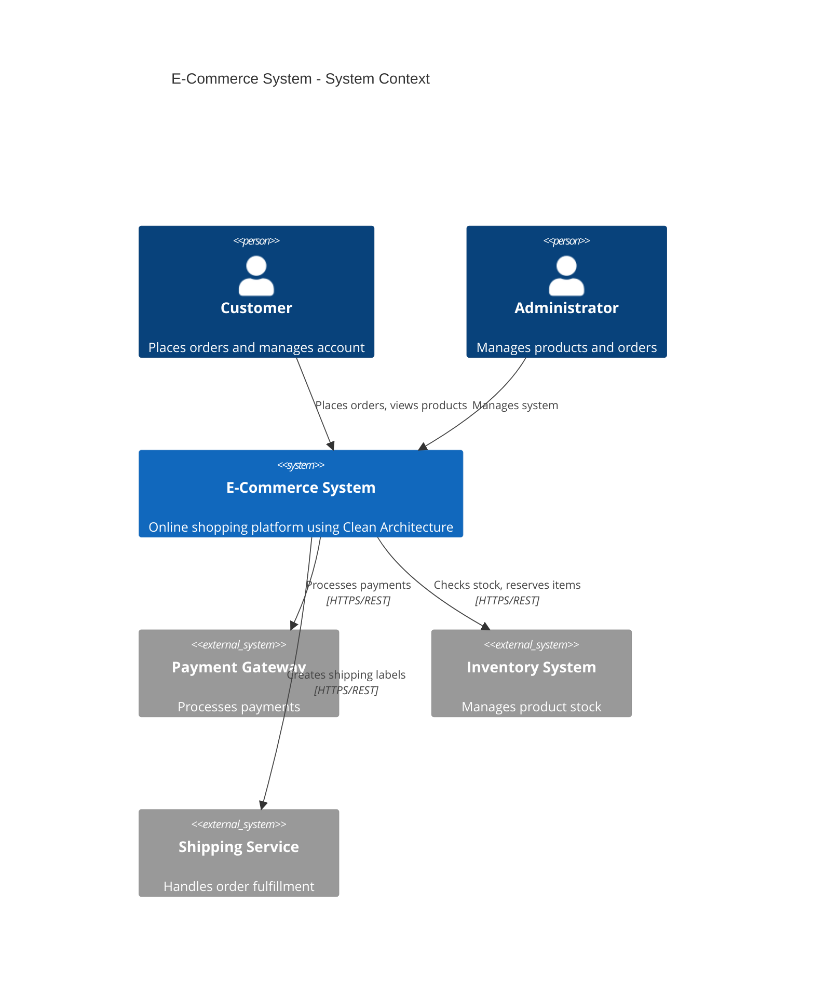
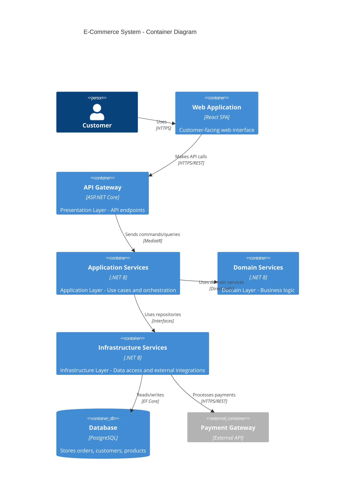

# Clean Architecture Framework (Milan Jovanovic's Pragmatic Approach)

## Overview

This framework provides a pragmatic implementation of Clean Architecture based on Milan Jovanovic's approach, which builds upon Robert C. Martin's (Uncle Bob) original concepts while incorporating modern .NET practices. The framework emphasizes practical implementation over dogmatic adherence, focusing on maintainability, flexibility, and developer productivity.

**Key Principles:**
- **Pragmatic over Dogmatic**: Break rules when it simplifies the solution
- **Business Logic Isolation**: Core business rules independent of external concerns
- **Dependency Inversion**: Dependencies point inward toward business logic
- **Testability**: Each layer can be tested independently
- **Flexibility**: Adapt patterns based on project needs

## Four-Layer Architecture

Milan's approach uses a four-layer architecture with specific folder structures and modern .NET practices:

```
src/
├── Domain/                     # Core business logic (no dependencies)
│   ├── DomainEvents/          # Domain event definitions
│   ├── Entities/              # Business entities with behavior
│   ├── Exceptions/            # Domain-specific exceptions
│   ├── Repositories/          # Repository interfaces
│   ├── Shared/                # Shared domain concepts
│   └── ValueObjects/          # Immutable value objects
├── Application/               # Use cases and orchestration
│   ├── {Entity}/              # Organized by entity/aggregate
│   │   ├── Commands/          # Write operations (CQRS)
│   │   ├── Queries/           # Read operations (CQRS)
│   │   └── Events/            # Domain event handlers
│   ├── Abstractions/          # Application interfaces
│   ├── Behaviors/             # MediatR pipeline behaviors
│   └── Contracts/             # DTOs and contracts
├── Infrastructure/            # External concerns implementation
│   ├── BackgroundJobs/        # Background job implementations
│   ├── Services/              # External service integrations
│   └── Persistence/           # Data access implementation
│       ├── EntityConfigurations/  # EF Core configurations
│       ├── Migrations/        # Database migrations
│       └── Repositories/      # Repository implementations
└── Presentation/              # API and UI layer
    ├── Controllers/           # API controllers
    ├── Middlewares/           # Custom middleware
    ├── ViewModels/            # Response models
    └── Program.cs             # Application entry point
```

## Layer Responsibilities

### Domain Layer (Core Business Logic)

**Purpose**: Contains enterprise business rules and entities that are independent of any external concerns.

**Dependencies**: None (pure business logic)

**Key Components**:
- **Entities**: Business objects with identity and lifecycle
- **Value Objects**: Immutable objects representing concepts
- **Aggregates**: Consistency boundaries for related entities
- **Domain Events**: Notifications of important business occurrences
- **Repository Interfaces**: Contracts for data access

**Example Entity**:
```csharp
public class User : Entity
{
    private User() { } // EF Core constructor

    private User(UserId id, Email email, FirstName firstName, LastName lastName)
        : base(id)
    {
        Email = email;
        FirstName = firstName;
        LastName = lastName;
        CreatedOnUtc = DateTime.UtcNow;
    }

    public Email Email { get; private set; }
    public FirstName FirstName { get; private set; }
    public LastName LastName { get; private set; }
    public DateTime CreatedOnUtc { get; private set; }

    public static User Create(Email email, FirstName firstName, LastName lastName)
    {
        var user = new User(UserId.New(), email, firstName, lastName);
        
        user.RaiseDomainEvent(new UserCreatedDomainEvent(user.Id));
        
        return user;
    }

    public void UpdateEmail(Email email)
    {
        if (Email == email) return;
        
        Email = email;
        RaiseDomainEvent(new UserEmailChangedDomainEvent(Id, email));
    }
}
```

**Example Value Object**:
```csharp
public sealed class Email : ValueObject
{
    public string Value { get; }

    private Email(string value)
    {
        Value = value;
    }

    public static Result<Email> Create(string email)
    {
        if (string.IsNullOrWhiteSpace(email))
            return Result.Failure<Email>(new Error("Email.Empty", "Email is required"));

        if (!IsValidEmail(email))
            return Result.Failure<Email>(new Error("Email.Invalid", "Email format is invalid"));

        return Result.Success(new Email(email));
    }

    private static bool IsValidEmail(string email)
    {
        return Regex.IsMatch(email, @"^[^@\s]+@[^@\s]+\.[^@\s]+$");
    }

    protected override IEnumerable<object> GetEqualityComponents()
    {
        yield return Value;
    }
}
```

### Application Layer (Use Cases)

**Purpose**: Orchestrates business logic and coordinates between Domain and Infrastructure layers.

**Dependencies**: Domain layer only

**Organization**: By entity/aggregate with Commands, Queries, and Events subfolders

**Key Components**:
- **Commands**: Write operations that change system state
- **Queries**: Read operations that return data
- **Handlers**: Process commands and queries using MediatR
- **Pipeline Behaviors**: Cross-cutting concerns (validation, logging, caching)

**Example Command**:
```csharp
public sealed record CreateUserCommand(
    string Email,
    string FirstName,
    string LastName) : ICommand<Guid>;

public sealed class CreateUserCommandHandler : ICommandHandler<CreateUserCommand, Guid>
{
    private readonly IUserRepository _userRepository;
    private readonly IUnitOfWork _unitOfWork;

    public CreateUserCommandHandler(IUserRepository userRepository, IUnitOfWork unitOfWork)
    {
        _userRepository = userRepository;
        _unitOfWork = unitOfWork;
    }

    public async Task<Result<Guid>> Handle(CreateUserCommand request, CancellationToken cancellationToken)
    {
        var emailResult = Email.Create(request.Email);
        if (emailResult.IsFailure)
            return Result.Failure<Guid>(emailResult.Error);

        var firstNameResult = FirstName.Create(request.FirstName);
        if (firstNameResult.IsFailure)
            return Result.Failure<Guid>(firstNameResult.Error);

        var lastNameResult = LastName.Create(request.LastName);
        if (lastNameResult.IsFailure)
            return Result.Failure<Guid>(lastNameResult.Error);

        var user = User.Create(emailResult.Value, firstNameResult.Value, lastNameResult.Value);
        
        _userRepository.Add(user);
        await _unitOfWork.SaveChangesAsync(cancellationToken);

        return Result.Success(user.Id.Value);
    }
}
```

**Example Query**:
```csharp
public sealed record GetUserByIdQuery(Guid UserId) : IQuery<UserResponse>;

public sealed class GetUserByIdQueryHandler : IQueryHandler<GetUserByIdQuery, UserResponse>
{
    private readonly IDbContext _context;

    public GetUserByIdQueryHandler(IDbContext context)
    {
        _context = context;
    }

    public async Task<Result<UserResponse>> Handle(GetUserByIdQuery request, CancellationToken cancellationToken)
    {
        var user = await _context.Users
            .Where(u => u.Id == new UserId(request.UserId))
            .Select(u => new UserResponse(
                u.Id.Value,
                u.Email.Value,
                u.FirstName.Value,
                u.LastName.Value,
                u.CreatedOnUtc))
            .FirstOrDefaultAsync(cancellationToken);

        if (user is null)
            return Result.Failure<UserResponse>(UserErrors.NotFound(request.UserId));

        return Result.Success(user);
    }
}
```

### Infrastructure Layer (External Concerns)

**Purpose**: Implements interfaces defined in Domain and Application layers for external systems.

**Dependencies**: Domain, Application layers

**Key Components**:
- **Repositories**: Data access implementations using EF Core
- **External Services**: Third-party API integrations
- **Background Jobs**: Scheduled and queued job processing
- **Persistence**: Database context and configurations

**Example Repository**:
```csharp
public sealed class UserRepository : Repository<User, UserId>, IUserRepository
{
    public UserRepository(ApplicationDbContext context) : base(context)
    {
    }

    public async Task<User?> GetByEmailAsync(Email email, CancellationToken cancellationToken = default)
    {
        return await Context.Set<User>()
            .FirstOrDefaultAsync(u => u.Email == email, cancellationToken);
    }

    public async Task<bool> IsEmailUniqueAsync(Email email, CancellationToken cancellationToken = default)
    {
        return !await Context.Set<User>()
            .AnyAsync(u => u.Email == email, cancellationToken);
    }
}
```

**Example EF Core Configuration**:
```csharp
public sealed class UserConfiguration : IEntityTypeConfiguration<User>
{
    public void Configure(EntityTypeBuilder<User> builder)
    {
        builder.HasKey(u => u.Id);

        builder.Property(u => u.Id)
            .HasConversion(id => id.Value, value => new UserId(value));

        builder.Property(u => u.Email)
            .HasMaxLength(255)
            .HasConversion(email => email.Value, value => Email.Create(value).Value);

        builder.Property(u => u.FirstName)
            .HasMaxLength(100)
            .HasConversion(name => name.Value, value => FirstName.Create(value).Value);

        builder.Property(u => u.LastName)
            .HasMaxLength(100)
            .HasConversion(name => name.Value, value => LastName.Create(value).Value);

        builder.HasIndex(u => u.Email).IsUnique();
    }
}
```

### Presentation Layer (API/UI)

**Purpose**: Handles HTTP requests, authentication, and user interface concerns.

**Dependencies**: Application layer only

**Key Components**:
- **Controllers**: API endpoints using MediatR for request handling
- **Middleware**: Cross-cutting concerns (authentication, error handling)
- **ViewModels**: Response DTOs for API consumers

**Example Controller**:
```csharp
[ApiController]
[Route("api/[controller]")]
public sealed class UsersController : ControllerBase
{
    private readonly ISender _sender;

    public UsersController(ISender sender)
    {
        _sender = sender;
    }

    [HttpPost]
    public async Task<IActionResult> CreateUser(CreateUserRequest request, CancellationToken cancellationToken)
    {
        var command = new CreateUserCommand(request.Email, request.FirstName, request.LastName);
        
        var result = await _sender.Send(command, cancellationToken);

        if (result.IsFailure)
            return BadRequest(result.Error);

        return CreatedAtAction(nameof(GetUser), new { id = result.Value }, result.Value);
    }

    [HttpGet("{id:guid}")]
    public async Task<IActionResult> GetUser(Guid id, CancellationToken cancellationToken)
    {
        var query = new GetUserByIdQuery(id);
        
        var result = await _sender.Send(query, cancellationToken);

        if (result.IsFailure)
            return NotFound(result.Error);

        return Ok(result.Value);
    }
}
```

## CQRS with MediatR Integration

Milan's approach uses CQRS (Command Query Responsibility Segregation) with MediatR for clean separation of read and write operations.

### Command Pattern

Commands represent write operations that change system state:

```csharp
// Base interfaces
public interface ICommand : IRequest<Result>
{
}

public interface ICommand<TResponse> : IRequest<Result<TResponse>>
{
}

public interface ICommandHandler<TCommand> : IRequestHandler<TCommand, Result>
    where TCommand : class, ICommand
{
}

public interface ICommandHandler<TCommand, TResponse> : IRequestHandler<TCommand, Result<TResponse>>
    where TCommand : class, ICommand<TResponse>
{
}
```

### Query Pattern

Queries represent read operations that return data:

```csharp
// Base interfaces
public interface IQuery<TResponse> : IRequest<Result<TResponse>>
{
}

public interface IQueryHandler<TQuery, TResponse> : IRequestHandler<TQuery, Result<TResponse>>
    where TQuery : class, IQuery<TResponse>
{
}
```

### Pipeline Behaviors

Cross-cutting concerns implemented as MediatR pipeline behaviors:

**Validation Behavior**:
```csharp
public sealed class ValidationBehavior<TRequest, TResponse> : IPipelineBehavior<TRequest, TResponse>
    where TRequest : class
{
    private readonly IEnumerable<IValidator<TRequest>> _validators;

    public ValidationBehavior(IEnumerable<IValidator<TRequest>> validators)
    {
        _validators = validators;
    }

    public async Task<TResponse> Handle(TRequest request, RequestHandlerDelegate<TResponse> next, CancellationToken cancellationToken)
    {
        if (!_validators.Any())
            return await next();

        var context = new ValidationContext<TRequest>(request);

        var validationResults = await Task.WhenAll(
            _validators.Select(v => v.ValidateAsync(context, cancellationToken)));

        var failures = validationResults
            .SelectMany(r => r.Errors)
            .Where(f => f != null)
            .ToList();

        if (failures.Any())
            throw new ValidationException(failures);

        return await next();
    }
}
```

**Logging Behavior**:
```csharp
public sealed class LoggingBehavior<TRequest, TResponse> : IPipelineBehavior<TRequest, TResponse>
    where TRequest : class
{
    private readonly ILogger<LoggingBehavior<TRequest, TResponse>> _logger;

    public LoggingBehavior(ILogger<LoggingBehavior<TRequest, TResponse>> logger)
    {
        _logger = logger;
    }

    public async Task<TResponse> Handle(TRequest request, RequestHandlerDelegate<TResponse> next, CancellationToken cancellationToken)
    {
        var requestName = typeof(TRequest).Name;

        _logger.LogInformation("Processing request {RequestName}", requestName);

        var stopwatch = Stopwatch.StartNew();

        try
        {
            var response = await next();
            
            stopwatch.Stop();
            
            _logger.LogInformation("Completed request {RequestName} in {ElapsedMilliseconds}ms", 
                requestName, stopwatch.ElapsedMilliseconds);

            return response;
        }
        catch (Exception ex)
        {
            stopwatch.Stop();
            
            _logger.LogError(ex, "Request {RequestName} failed after {ElapsedMilliseconds}ms", 
                requestName, stopwatch.ElapsedMilliseconds);
            
            throw;
        }
    }
}
```

## Vertical Slice Architecture

Milan advocates for organizing features as vertical slices to maximize cohesion and minimize coupling between features.

### Organization by Entity

```
Application/
├── Users/
│   ├── Commands/
│   │   ├── CreateUser/
│   │   │   ├── CreateUserCommand.cs
│   │   │   ├── CreateUserCommandHandler.cs
│   │   │   └── CreateUserCommandValidator.cs
│   │   └── UpdateUser/
│   │       ├── UpdateUserCommand.cs
│   │       ├── UpdateUserCommandHandler.cs
│   │       └── UpdateUserCommandValidator.cs
│   ├── Queries/
│   │   ├── GetUser/
│   │   │   ├── GetUserQuery.cs
│   │   │   └── GetUserQueryHandler.cs
│   │   └── GetUsers/
│   │       ├── GetUsersQuery.cs
│   │       └── GetUsersQueryHandler.cs
│   └── Events/
│       ├── UserCreated/
│       │   └── UserCreatedDomainEventHandler.cs
│       └── UserEmailChanged/
│           └── UserEmailChangedDomainEventHandler.cs
```

### REPR Pattern (Request-Endpoint-Response)

The REPR pattern organizes each feature as a self-contained slice:

```csharp
// Request
public sealed record CreateUserRequest(
    string Email,
    string FirstName,
    string LastName);

// Endpoint (Minimal API or Controller action)
public static async Task<IResult> CreateUser(
    CreateUserRequest request,
    ISender sender,
    CancellationToken cancellationToken)
{
    var command = new CreateUserCommand(request.Email, request.FirstName, request.LastName);
    
    var result = await sender.Send(command, cancellationToken);

    return result.IsSuccess 
        ? Results.Created($"/api/users/{result.Value}", result.Value)
        : Results.BadRequest(result.Error);
}

// Response
public sealed record UserResponse(
    Guid Id,
    string Email,
    string FirstName,
    string LastName,
    DateTime CreatedOnUtc);
```

### Vertical Slice Benefits

- **High Cohesion**: All related code for a feature is together
- **Low Coupling**: Features don't depend on each other
- **Easy to Change**: Modifications are localized to one slice
- **Team Ownership**: Teams can own entire vertical slices
- **Parallel Development**: Multiple teams can work on different slices

## Modern .NET Tech Stack Integration

### Entity Framework Core Setup

**DbContext Configuration**:
```csharp
public sealed class ApplicationDbContext : DbContext, IUnitOfWork
{
    private readonly IPublisher _publisher;

    public ApplicationDbContext(DbContextOptions<ApplicationDbContext> options, IPublisher publisher) 
        : base(options)
    {
        _publisher = publisher;
    }

    protected override void OnModelCreating(ModelBuilder modelBuilder)
    {
        modelBuilder.ApplyConfigurationsFromAssembly(typeof(ApplicationDbContext).Assembly);
        
        base.OnModelCreating(modelBuilder);
    }

    public override async Task<int> SaveChangesAsync(CancellationToken cancellationToken = default)
    {
        var domainEvents = ChangeTracker
            .Entries<Entity>()
            .Select(e => e.Entity)
            .SelectMany(e => e.GetDomainEvents())
            .ToList();

        var result = await base.SaveChangesAsync(cancellationToken);

        foreach (var domainEvent in domainEvents)
        {
            await _publisher.Publish(domainEvent, cancellationToken);
        }

        return result;
    }
}
```

### FluentValidation Integration

**Command Validator**:
```csharp
public sealed class CreateUserCommandValidator : AbstractValidator<CreateUserCommand>
{
    public CreateUserCommandValidator()
    {
        RuleFor(x => x.Email)
            .NotEmpty()
            .EmailAddress()
            .MaximumLength(255);

        RuleFor(x => x.FirstName)
            .NotEmpty()
            .MaximumLength(100);

        RuleFor(x => x.LastName)
            .NotEmpty()
            .MaximumLength(100);
    }
}
```

### Serilog Structured Logging

**Configuration**:
```csharp
public static void Main(string[] args)
{
    Log.Logger = new LoggerConfiguration()
        .WriteTo.Console()
        .WriteTo.File("logs/app-.txt", rollingInterval: RollingInterval.Day)
        .CreateLogger();

    try
    {
        Log.Information("Starting application");
        CreateHostBuilder(args).Build().Run();
    }
    catch (Exception ex)
    {
        Log.Fatal(ex, "Application terminated unexpectedly");
    }
    finally
    {
        Log.CloseAndFlush();
    }
}
```

### JWT Authentication

**Configuration**:
```csharp
public static void AddAuthentication(this IServiceCollection services, IConfiguration configuration)
{
    services.AddAuthentication(JwtBearerDefaults.AuthenticationScheme)
        .AddJwtBearer(options =>
        {
            options.TokenValidationParameters = new TokenValidationParameters
            {
                ValidateIssuer = true,
                ValidateAudience = true,
                ValidateLifetime = true,
                ValidateIssuerSigningKey = true,
                ValidIssuer = configuration["Jwt:Issuer"],
                ValidAudience = configuration["Jwt:Audience"],
                IssuerSigningKey = new SymmetricSecurityKey(
                    Encoding.UTF8.GetBytes(configuration["Jwt:Key"]))
            };
        });
}
```

### Docker Configuration

**Dockerfile**:
```dockerfile
FROM mcr.microsoft.com/dotnet/aspnet:8.0 AS base
WORKDIR /app
EXPOSE 80
EXPOSE 443

FROM mcr.microsoft.com/dotnet/sdk:8.0 AS build
WORKDIR /src
COPY ["src/Presentation/Presentation.csproj", "src/Presentation/"]
COPY ["src/Application/Application.csproj", "src/Application/"]
COPY ["src/Domain/Domain.csproj", "src/Domain/"]
COPY ["src/Infrastructure/Infrastructure.csproj", "src/Infrastructure/"]
RUN dotnet restore "src/Presentation/Presentation.csproj"
COPY . .
WORKDIR "/src/src/Presentation"
RUN dotnet build "Presentation.csproj" -c Release -o /app/build

FROM build AS publish
RUN dotnet publish "Presentation.csproj" -c Release -o /app/publish

FROM base AS final
WORKDIR /app
COPY --from=publish /app/publish .
ENTRYPOINT ["dotnet", "Presentation.dll"]
```

## Pragmatic Flexibility Guidelines

Milan's approach emphasizes pragmatism over dogmatism. Here are guidelines for when to break Clean Architecture rules:

### When to Break Rules

1. **Simple CRUD Operations**: For basic create/read/update/delete operations without business logic, consider simpler approaches
2. **Small Applications**: For small applications with limited complexity, full Clean Architecture might be overkill
3. **Performance Critical Paths**: When performance is critical, direct database access might be acceptable
4. **Legacy Integration**: When integrating with legacy systems, some compromises might be necessary

### Acceptable Violations

**Direct Database Access in Queries**:
```csharp
// Acceptable for read-only queries with complex joins
public async Task<IEnumerable<UserSummary>> GetUserSummariesAsync()
{
    return await _context.Database
        .SqlQueryRaw<UserSummary>(@"
            SELECT u.Id, u.Email, COUNT(o.Id) as OrderCount
            FROM Users u
            LEFT JOIN Orders o ON u.Id = o.UserId
            GROUP BY u.Id, u.Email")
        .ToListAsync();
}
```

**Bypassing Domain Logic for Performance**:
```csharp
// Acceptable for bulk operations
public async Task BulkUpdateUserStatusAsync(IEnumerable<Guid> userIds, UserStatus status)
{
    await _context.Database.ExecuteSqlRawAsync(@"
        UPDATE Users 
        SET Status = {0}, UpdatedOnUtc = {1}
        WHERE Id IN ({2})", 
        status, DateTime.UtcNow, string.Join(",", userIds));
}
```

### Decision Framework

When considering breaking Clean Architecture rules, ask:

1. **Does it significantly improve performance?**
2. **Does it reduce complexity without sacrificing maintainability?**
3. **Is the violation isolated and well-documented?**
4. **Can we easily refactor back to Clean Architecture later?**
5. **Does the team understand the trade-offs?**

## Real-World Examples

### E-Commerce Order Processing

**Domain Entity**:
```csharp
public class Order : Entity, IAggregateRoot
{
    private readonly List<OrderItem> _items = new();
    
    public CustomerId CustomerId { get; private set; }
    public OrderStatus Status { get; private set; }
    public Money TotalAmount { get; private set; }
    public DateTime CreatedOnUtc { get; private set; }
    
    public IReadOnlyList<OrderItem> Items => _items.AsReadOnly();

    public static Order Create(CustomerId customerId, IEnumerable<OrderItem> items)
    {
        var order = new Order
        {
            Id = OrderId.New(),
            CustomerId = customerId,
            Status = OrderStatus.Pending,
            CreatedOnUtc = DateTime.UtcNow
        };

        foreach (var item in items)
        {
            order.AddItem(item);
        }

        order.RaiseDomainEvent(new OrderCreatedDomainEvent(order.Id));
        
        return order;
    }

    public void AddItem(Product product, int quantity, Money unitPrice)
    {
        if (Status != OrderStatus.Pending)
            throw new InvalidOperationException("Cannot modify confirmed order");

        var existingItem = _items.FirstOrDefault(i => i.ProductId == product.Id);
        
        if (existingItem != null)
        {
            existingItem.UpdateQuantity(existingItem.Quantity + quantity);
        }
        else
        {
            _items.Add(OrderItem.Create(product.Id, quantity, unitPrice));
        }

        RecalculateTotal();
    }

    public void Confirm()
    {
        if (Status != OrderStatus.Pending)
            throw new InvalidOperationException("Order is already confirmed");

        Status = OrderStatus.Confirmed;
        RaiseDomainEvent(new OrderConfirmedDomainEvent(Id));
    }

    private void RecalculateTotal()
    {
        TotalAmount = _items.Sum(i => i.TotalPrice);
    }
}
```

**Application Command Handler**:
```csharp
public sealed class CreateOrderCommandHandler : ICommandHandler<CreateOrderCommand, Guid>
{
    private readonly IOrderRepository _orderRepository;
    private readonly IProductRepository _productRepository;
    private readonly ICustomerRepository _customerRepository;
    private readonly IUnitOfWork _unitOfWork;

    public async Task<Result<Guid>> Handle(CreateOrderCommand request, CancellationToken cancellationToken)
    {
        var customer = await _customerRepository.GetByIdAsync(
            new CustomerId(request.CustomerId), cancellationToken);
        
        if (customer is null)
            return Result.Failure<Guid>(CustomerErrors.NotFound);

        var orderItems = new List<OrderItem>();
        
        foreach (var item in request.Items)
        {
            var product = await _productRepository.GetByIdAsync(
                new ProductId(item.ProductId), cancellationToken);
                
            if (product is null)
                return Result.Failure<Guid>(ProductErrors.NotFound(item.ProductId));

            if (product.Stock < item.Quantity)
                return Result.Failure<Guid>(ProductErrors.InsufficientStock);

            orderItems.Add(OrderItem.Create(product.Id, item.Quantity, product.Price));
        }

        var order = Order.Create(customer.Id, orderItems);
        
        _orderRepository.Add(order);
        await _unitOfWork.SaveChangesAsync(cancellationToken);

        return Result.Success(order.Id.Value);
    }
}
```

## Testing Strategy

### Unit Testing Domain Logic

```csharp
public class OrderTests
{
    [Fact]
    public void Create_WithValidItems_ShouldCreateOrder()
    {
        // Arrange
        var customerId = new CustomerId(Guid.NewGuid());
        var items = new[]
        {
            OrderItem.Create(new ProductId(Guid.NewGuid()), 2, Money.Create(10.00m)),
            OrderItem.Create(new ProductId(Guid.NewGuid()), 1, Money.Create(15.00m))
        };

        // Act
        var order = Order.Create(customerId, items);

        // Assert
        order.Should().NotBeNull();
        order.CustomerId.Should().Be(customerId);
        order.Status.Should().Be(OrderStatus.Pending);
        order.Items.Should().HaveCount(2);
        order.TotalAmount.Should().Be(Money.Create(35.00m));
    }

    [Fact]
    public void AddItem_WhenOrderConfirmed_ShouldThrowException()
    {
        // Arrange
        var order = CreateValidOrder();
        order.Confirm();
        var product = CreateValidProduct();

        // Act & Assert
        var action = () => order.AddItem(product, 1, Money.Create(10.00m));
        action.Should().Throw<InvalidOperationException>()
            .WithMessage("Cannot modify confirmed order");
    }
}
```

### Integration Testing Application Layer

```csharp
public class CreateOrderCommandHandlerTests : IntegrationTestBase
{
    [Fact]
    public async Task Handle_WithValidCommand_ShouldCreateOrder()
    {
        // Arrange
        var customer = await CreateCustomerAsync();
        var product = await CreateProductAsync();
        
        var command = new CreateOrderCommand(
            customer.Id.Value,
            new[] { new OrderItemRequest(product.Id.Value, 2) });

        // Act
        var result = await Sender.Send(command);

        // Assert
        result.IsSuccess.Should().BeTrue();
        
        var order = await Context.Orders
            .Include(o => o.Items)
            .FirstAsync(o => o.Id == new OrderId(result.Value));
            
        order.Should().NotBeNull();
        order.Items.Should().HaveCount(1);
    }
}
```

## Migration Strategies

### From Layered Architecture

1. **Start with Domain Layer**: Extract business logic from existing services
2. **Introduce CQRS Gradually**: Begin with new features using CQRS patterns
3. **Refactor Controllers**: Move logic from controllers to command/query handlers
4. **Extract Infrastructure**: Move data access and external concerns to Infrastructure layer

### From Monolith to Clean Architecture

1. **Identify Bounded Contexts**: Use Domain-Driven Design to identify boundaries
2. **Extract Domain Models**: Move business logic from anemic models to rich domain entities
3. **Implement Repository Pattern**: Abstract data access behind interfaces
4. **Add MediatR**: Introduce command/query separation gradually

## Common Pitfalls and Solutions

### Over-Engineering

**Problem**: Creating unnecessary abstractions for simple operations
**Solution**: Start simple and add complexity only when needed

### Anemic Domain Models

**Problem**: Domain entities with only getters/setters and no behavior
**Solution**: Move business logic from services into domain entities

### Leaky Abstractions

**Problem**: Infrastructure concerns bleeding into Domain layer
**Solution**: Use dependency inversion and proper interface design

### Performance Issues

**Problem**: Too many layers causing performance overhead
**Solution**: Use pragmatic shortcuts for read-heavy operations

## Conclusion

Milan Jovanovic's pragmatic Clean Architecture approach provides a balanced framework that emphasizes:

- **Practical Implementation**: Focus on solving real problems, not following rules blindly
- **Modern .NET Practices**: Integration with current tools and frameworks
- **Team Productivity**: Patterns that help teams deliver value faster
- **Maintainability**: Code that's easy to understand, test, and modify
- **Flexibility**: Ability to adapt patterns based on specific needs

Remember: Clean Architecture is a tool to help you build better software. Use it pragmatically, adapt it to your needs, and don't be afraid to break rules when it makes sense for your specific context.

## Additional Resources

- [Milan Jovanovic's Blog](https://www.milanjovanovic.tech/)
- [Clean Architecture by Robert C. Martin](https://blog.cleancoder.com/uncle-bob/2012/08/13/the-clean-architecture.html)
- [MediatR Documentation](https://github.com/jbogard/MediatR)
- [Entity Framework Core Documentation](https://docs.microsoft.com/en-us/ef/core/)
- [FluentValidation Documentation](https://fluentvalidation.net/)
#
# Framework Integration Examples

This section demonstrates how Pragmatic Clean Architecture integrates with other frameworks in the Pragmatic Rhino SUIT ecosystem, providing practical examples for combining architectural patterns effectively.

### Integration with Domain-Driven Design (DDD)

Clean Architecture and DDD complement each other perfectly. DDD provides tactical patterns for the Domain layer, while Clean Architecture provides the overall structure.

#### DDD Tactical Patterns in Clean Architecture Layers

**Domain Layer - Aggregates and Bounded Contexts**:
```csharp
// Aggregate Root in Domain Layer
public class Order : AggregateRoot<OrderId>
{
    private readonly List<OrderItem> _items = new();
    
    public CustomerId CustomerId { get; private set; }
    public OrderStatus Status { get; private set; }
    public Money TotalAmount { get; private set; }
    
    // Aggregate invariants enforced
    public void AddItem(ProductId productId, int quantity, Money unitPrice)
    {
        if (Status != OrderStatus.Draft)
            throw new DomainException("Cannot modify confirmed order");
            
        if (quantity <= 0)
            throw new DomainException("Quantity must be positive");
            
        var item = OrderItem.Create(productId, quantity, unitPrice);
        _items.Add(item);
        
        RecalculateTotal();
        RaiseDomainEvent(new OrderItemAddedDomainEvent(Id, item.Id));
    }
    
    // Business rule: Order total cannot exceed customer credit limit
    public Result ConfirmOrder(Money customerCreditLimit)
    {
        if (TotalAmount > customerCreditLimit)
            return Result.Failure(OrderErrors.ExceedsCreditLimit);
            
        Status = OrderStatus.Confirmed;
        RaiseDomainEvent(new OrderConfirmedDomainEvent(Id, CustomerId, TotalAmount));
        
        return Result.Success();
    }
}

// Domain Service for complex business operations
public class OrderPricingService : IDomainService
{
    public Money CalculateOrderTotal(IEnumerable<OrderItem> items, Customer customer)
    {
        var subtotal = items.Sum(item => item.TotalPrice);
        var discount = CalculateCustomerDiscount(customer, subtotal);
        var tax = CalculateTax(subtotal - discount, customer.Address);
        
        return subtotal - discount + tax;
    }
    
    private Money CalculateCustomerDiscount(Customer customer, Money subtotal)
    {
        return customer.MembershipLevel switch
        {
            MembershipLevel.Gold => subtotal * 0.15m,
            MembershipLevel.Silver => subtotal * 0.10m,
            MembershipLevel.Bronze => subtotal * 0.05m,
            _ => Money.Zero
        };
    }
}
```

**Application Layer - Domain Events and Sagas**:
```csharp
// Domain Event Handler in Application Layer
public class OrderConfirmedDomainEventHandler : IDomainEventHandler<OrderConfirmedDomainEvent>
{
    private readonly IInventoryService _inventoryService;
    private readonly IPaymentService _paymentService;
    private readonly IEmailService _emailService;

    public async Task Handle(OrderConfirmedDomainEvent domainEvent, CancellationToken cancellationToken)
    {
        // Reserve inventory
        await _inventoryService.ReserveItemsAsync(domainEvent.OrderId, cancellationToken);
        
        // Process payment
        var paymentResult = await _paymentService.ProcessPaymentAsync(
            domainEvent.CustomerId, 
            domainEvent.TotalAmount, 
            cancellationToken);
            
        if (paymentResult.IsFailure)
        {
            // Compensating action
            await _inventoryService.ReleaseReservationAsync(domainEvent.OrderId, cancellationToken);
            throw new PaymentProcessingException(paymentResult.Error);
        }
        
        // Send confirmation email
        await _emailService.SendOrderConfirmationAsync(domainEvent.OrderId, cancellationToken);
    }
}

// Saga for complex business processes
public class OrderFulfillmentSaga : ISaga<OrderConfirmedDomainEvent>
{
    private readonly ISagaRepository _sagaRepository;
    private readonly ICommandBus _commandBus;

    public async Task Handle(OrderConfirmedDomainEvent domainEvent, CancellationToken cancellationToken)
    {
        var sagaData = new OrderFulfillmentSagaData
        {
            OrderId = domainEvent.OrderId,
            CustomerId = domainEvent.CustomerId,
            Status = SagaStatus.Started
        };
        
        await _sagaRepository.SaveAsync(sagaData, cancellationToken);
        
        // Start the fulfillment process
        await _commandBus.SendAsync(new ReserveInventoryCommand(domainEvent.OrderId), cancellationToken);
    }
}
```

#### Bounded Context Integration

```csharp
// Anti-Corruption Layer for external bounded contexts
public class ExternalInventoryService : IInventoryService
{
    private readonly IExternalInventoryApi _externalApi;
    private readonly IInventoryMapper _mapper;

    public async Task<Result> ReserveItemsAsync(OrderId orderId, CancellationToken cancellationToken)
    {
        try
        {
            var order = await _orderRepository.GetByIdAsync(orderId, cancellationToken);
            var externalRequest = _mapper.MapToExternalFormat(order.Items);
            
            var response = await _externalApi.ReserveInventoryAsync(externalRequest);
            
            return response.Success 
                ? Result.Success() 
                : Result.Failure(InventoryErrors.ReservationFailed(response.ErrorMessage));
        }
        catch (ExternalApiException ex)
        {
            return Result.Failure(InventoryErrors.ExternalSystemUnavailable(ex.Message));
        }
    }
}
```

### Integration with Test-Driven Development (TDD)

Clean Architecture's layered structure makes TDD implementation straightforward by providing clear boundaries for testing.

#### TDD Workflow with Clean Architecture

**1. Red Phase - Write Failing Domain Tests**:
```csharp
public class OrderTests
{
    [Fact]
    public void AddItem_WithValidProduct_ShouldAddItemToOrder()
    {
        // Arrange
        var order = Order.Create(new CustomerId(Guid.NewGuid()));
        var productId = new ProductId(Guid.NewGuid());
        var quantity = 2;
        var unitPrice = Money.Create(10.00m);

        // Act
        order.AddItem(productId, quantity, unitPrice);

        // Assert
        order.Items.Should().HaveCount(1);
        order.Items.First().ProductId.Should().Be(productId);
        order.Items.First().Quantity.Should().Be(quantity);
        order.TotalAmount.Should().Be(Money.Create(20.00m));
    }

    [Fact]
    public void AddItem_WhenOrderConfirmed_ShouldThrowDomainException()
    {
        // Arrange
        var order = Order.Create(new CustomerId(Guid.NewGuid()));
        order.Confirm();

        // Act & Assert
        var action = () => order.AddItem(new ProductId(Guid.NewGuid()), 1, Money.Create(10.00m));
        action.Should().Throw<DomainException>()
            .WithMessage("Cannot modify confirmed order");
    }
}
```

**2. Green Phase - Implement Domain Logic**:
```csharp
public class Order : AggregateRoot<OrderId>
{
    private readonly List<OrderItem> _items = new();
    
    public OrderStatus Status { get; private set; } = OrderStatus.Draft;
    public Money TotalAmount { get; private set; } = Money.Zero;
    public IReadOnlyList<OrderItem> Items => _items.AsReadOnly();

    public void AddItem(ProductId productId, int quantity, Money unitPrice)
    {
        if (Status != OrderStatus.Draft)
            throw new DomainException("Cannot modify confirmed order");

        var item = OrderItem.Create(productId, quantity, unitPrice);
        _items.Add(item);
        RecalculateTotal();
    }

    public void Confirm()
    {
        Status = OrderStatus.Confirmed;
    }

    private void RecalculateTotal()
    {
        TotalAmount = _items.Sum(item => item.TotalPrice);
    }
}
```

**3. Application Layer TDD**:
```csharp
public class CreateOrderCommandHandlerTests
{
    private readonly Mock<IOrderRepository> _orderRepositoryMock = new();
    private readonly Mock<ICustomerRepository> _customerRepositoryMock = new();
    private readonly Mock<IUnitOfWork> _unitOfWorkMock = new();
    
    [Fact]
    public async Task Handle_WithValidCommand_ShouldCreateOrder()
    {
        // Arrange
        var customerId = new CustomerId(Guid.NewGuid());
        var customer = Customer.Create("test@example.com", "John", "Doe");
        
        _customerRepositoryMock
            .Setup(x => x.GetByIdAsync(customerId, It.IsAny<CancellationToken>()))
            .ReturnsAsync(customer);

        var handler = new CreateOrderCommandHandler(
            _orderRepositoryMock.Object,
            _customerRepositoryMock.Object,
            _unitOfWorkMock.Object);

        var command = new CreateOrderCommand(customerId.Value);

        // Act
        var result = await handler.Handle(command, CancellationToken.None);

        // Assert
        result.IsSuccess.Should().BeTrue();
        _orderRepositoryMock.Verify(x => x.Add(It.IsAny<Order>()), Times.Once);
        _unitOfWorkMock.Verify(x => x.SaveChangesAsync(It.IsAny<CancellationToken>()), Times.Once);
    }
}
```

#### Testing Strategy by Layer

**Domain Layer Testing**:
- Pure unit tests with no dependencies
- Focus on business rules and invariants
- Test domain events are raised correctly
- Validate value object behavior

**Application Layer Testing**:
- Mock external dependencies (repositories, services)
- Test command/query handlers in isolation
- Verify correct domain methods are called
- Test validation and error handling

**Infrastructure Layer Testing**:
- Integration tests with real databases
- Test repository implementations
- Verify EF Core configurations
- Test external service integrations

**Presentation Layer Testing**:
- API integration tests
- Test request/response mapping
- Verify authentication/authorization
- Test error handling and status codes

### Integration with Pragmatic Rhino SUIT Frameworks

#### C4 Model Integration

Clean Architecture maps naturally to C4 diagrams:





#### SABSA Security Framework Integration

Apply SABSA principles within Clean Architecture layers:

**Domain Layer Security**:
```csharp
// Security-aware domain entities
public class Customer : AggregateRoot<CustomerId>
{
    public Email Email { get; private set; }
    public PersonalData PersonalData { get; private set; } // Encrypted value object
    public SecurityProfile SecurityProfile { get; private set; }
    
    public Result UpdatePersonalData(PersonalData newData, UserId requestingUser)
    {
        // Business rule: Only customer or authorized admin can update
        if (!SecurityProfile.CanBeModifiedBy(requestingUser))
            return Result.Failure(SecurityErrors.UnauthorizedAccess);
            
        PersonalData = newData;
        RaiseDomainEvent(new CustomerDataUpdatedDomainEvent(Id, requestingUser));
        
        return Result.Success();
    }
}

// Security-focused value object
public class PersonalData : ValueObject
{
    public EncryptedString FirstName { get; }
    public EncryptedString LastName { get; }
    public EncryptedString PhoneNumber { get; }
    
    private PersonalData(EncryptedString firstName, EncryptedString lastName, EncryptedString phoneNumber)
    {
        FirstName = firstName;
        LastName = lastName;
        PhoneNumber = phoneNumber;
    }
    
    public static Result<PersonalData> Create(string firstName, string lastName, string phoneNumber, IEncryptionService encryptionService)
    {
        // Validate before encryption
        if (string.IsNullOrWhiteSpace(firstName))
            return Result.Failure<PersonalData>(ValidationErrors.Required(nameof(firstName)));
            
        return Result.Success(new PersonalData(
            encryptionService.Encrypt(firstName),
            encryptionService.Encrypt(lastName),
            encryptionService.Encrypt(phoneNumber)));
    }
}
```

**Application Layer Security**:
```csharp
// Security behavior in MediatR pipeline
public class AuthorizationBehavior<TRequest, TResponse> : IPipelineBehavior<TRequest, TResponse>
    where TRequest : class, IRequest<TResponse>
{
    private readonly ICurrentUserService _currentUserService;
    private readonly IAuthorizationService _authorizationService;

    public async Task<TResponse> Handle(TRequest request, RequestHandlerDelegate<TResponse> next, CancellationToken cancellationToken)
    {
        var currentUser = _currentUserService.GetCurrentUser();
        
        if (currentUser == null)
            throw new UnauthorizedException("User not authenticated");

        var authorizationResult = await _authorizationService.AuthorizeAsync(currentUser, request);
        
        if (!authorizationResult.Succeeded)
            throw new ForbiddenException("User not authorized for this operation");

        return await next();
    }
}

// Audit logging behavior
public class AuditBehavior<TRequest, TResponse> : IPipelineBehavior<TRequest, TResponse>
    where TRequest : class, IRequest<TResponse>
{
    private readonly IAuditService _auditService;
    private readonly ICurrentUserService _currentUserService;

    public async Task<TResponse> Handle(TRequest request, RequestHandlerDelegate<TResponse> next, CancellationToken cancellationToken)
    {
        var currentUser = _currentUserService.GetCurrentUser();
        var requestName = typeof(TRequest).Name;
        
        await _auditService.LogAsync(new AuditEntry
        {
            UserId = currentUser?.Id,
            Action = requestName,
            Timestamp = DateTime.UtcNow,
            RequestData = JsonSerializer.Serialize(request),
            IpAddress = _currentUserService.GetClientIpAddress()
        });

        try
        {
            var response = await next();
            
            await _auditService.LogAsync(new AuditEntry
            {
                UserId = currentUser?.Id,
                Action = $"{requestName}_Success",
                Timestamp = DateTime.UtcNow
            });
            
            return response;
        }
        catch (Exception ex)
        {
            await _auditService.LogAsync(new AuditEntry
            {
                UserId = currentUser?.Id,
                Action = $"{requestName}_Failed",
                Timestamp = DateTime.UtcNow,
                ErrorMessage = ex.Message
            });
            
            throw;
        }
    }
}
```

#### 4D SDLC + SAFe Integration

Clean Architecture aligns with 4D SDLC phases:

**Define Phase - Requirements to Domain Model**:
```csharp
// User Story: As a customer, I want to place an order so that I can purchase products
// Acceptance Criteria translated to domain rules

public class Order : AggregateRoot<OrderId>
{
    // AC: Order must have at least one item
    public void AddItem(ProductId productId, int quantity, Money unitPrice)
    {
        if (quantity <= 0)
            throw new DomainException("Order must have at least one item");
        // Implementation...
    }
    
    // AC: Order total must not exceed customer credit limit
    public Result Confirm(Money customerCreditLimit)
    {
        if (TotalAmount > customerCreditLimit)
            return Result.Failure(OrderErrors.ExceedsCreditLimit);
        // Implementation...
    }
    
    // AC: Confirmed orders cannot be modified
    public void AddItem(ProductId productId, int quantity, Money unitPrice)
    {
        if (Status == OrderStatus.Confirmed)
            throw new DomainException("Cannot modify confirmed order");
        // Implementation...
    }
}
```

**Design Phase - Architecture Decisions**:
```markdown
# ADR-001: Use CQRS for Order Management

## Status
Accepted

## Context
Order management involves complex read and write operations with different performance characteristics.

## Decision
Implement CQRS pattern using MediatR within Clean Architecture Application layer.

## Consequences
- Separate optimization of read and write operations
- Clear separation of concerns
- Increased complexity for simple operations
- Better scalability for complex scenarios
```

**Develop Phase - TDD Implementation**:
```csharp
// Red: Write failing test
[Fact]
public void PlaceOrder_WithValidItems_ShouldCreateOrder()
{
    // Test implementation that fails initially
}

// Green: Implement minimal code to pass
public class PlaceOrderCommandHandler : ICommandHandler<PlaceOrderCommand, Guid>
{
    // Minimal implementation to pass test
}

// Refactor: Improve code quality while keeping tests green
```

**Deploy Phase - Infrastructure as Code**:
```yaml
# Azure DevOps Pipeline for Clean Architecture deployment
trigger:
  branches:
    include:
    - main
  paths:
    include:
    - src/

stages:
- stage: Build
  jobs:
  - job: BuildAndTest
    steps:
    - task: DotNetCoreCLI@2
      displayName: 'Restore packages'
      inputs:
        command: 'restore'
        projects: '**/*.csproj'
    
    - task: DotNetCoreCLI@2
      displayName: 'Build solution'
      inputs:
        command: 'build'
        projects: '**/*.csproj'
        arguments: '--configuration Release --no-restore'
    
    - task: DotNetCoreCLI@2
      displayName: 'Run unit tests'
      inputs:
        command: 'test'
        projects: '**/Domain.Tests/*.csproj'
        arguments: '--configuration Release --no-build --collect:"XPlat Code Coverage"'
    
    - task: DotNetCoreCLI@2
      displayName: 'Run integration tests'
      inputs:
        command: 'test'
        projects: '**/Application.Tests/*.csproj'
        arguments: '--configuration Release --no-build'

- stage: Deploy
  dependsOn: Build
  condition: succeeded()
  jobs:
  - deployment: DeployToProduction
    environment: 'production'
    strategy:
      runOnce:
        deploy:
          steps:
          - task: AzureWebApp@1
            inputs:
              azureSubscription: 'Azure-Connection'
              appType: 'webApp'
              appName: 'ecommerce-api'
              package: '$(Pipeline.Workspace)/**/*.zip'
```

### Migration Examples from Traditional Layered Architecture

#### Before: Traditional Layered Architecture

```csharp
// Traditional approach - anemic domain model
public class Order
{
    public Guid Id { get; set; }
    public Guid CustomerId { get; set; }
    public decimal Total { get; set; }
    public string Status { get; set; }
    public List<OrderItem> Items { get; set; } = new();
}

// Business logic in service layer
public class OrderService
{
    private readonly IOrderRepository _orderRepository;
    private readonly ICustomerRepository _customerRepository;
    
    public async Task<Guid> CreateOrderAsync(CreateOrderRequest request)
    {
        // Validation mixed with business logic
        if (request.Items == null || !request.Items.Any())
            throw new ArgumentException("Order must have items");
            
        var customer = await _customerRepository.GetByIdAsync(request.CustomerId);
        if (customer == null)
            throw new ArgumentException("Customer not found");
            
        // Business logic scattered
        var order = new Order
        {
            Id = Guid.NewGuid(),
            CustomerId = request.CustomerId,
            Status = "Pending"
        };
        
        decimal total = 0;
        foreach (var item in request.Items)
        {
            order.Items.Add(new OrderItem
            {
                ProductId = item.ProductId,
                Quantity = item.Quantity,
                UnitPrice = item.UnitPrice
            });
            total += item.Quantity * item.UnitPrice;
        }
        
        order.Total = total;
        
        // No domain events
        await _orderRepository.AddAsync(order);
        
        return order.Id;
    }
}
```

#### After: Clean Architecture Migration

**Step 1: Extract Domain Model**
```csharp
// Rich domain model with business rules
public class Order : AggregateRoot<OrderId>
{
    private readonly List<OrderItem> _items = new();
    
    public CustomerId CustomerId { get; private set; }
    public OrderStatus Status { get; private set; }
    public Money TotalAmount { get; private set; }
    public DateTime CreatedOnUtc { get; private set; }
    
    public IReadOnlyList<OrderItem> Items => _items.AsReadOnly();

    private Order() { } // EF Core constructor

    public static Order Create(CustomerId customerId)
    {
        var order = new Order
        {
            Id = OrderId.New(),
            CustomerId = customerId,
            Status = OrderStatus.Pending,
            CreatedOnUtc = DateTime.UtcNow,
            TotalAmount = Money.Zero
        };
        
        order.RaiseDomainEvent(new OrderCreatedDomainEvent(order.Id));
        return order;
    }
    
    public void AddItem(ProductId productId, int quantity, Money unitPrice)
    {
        if (Status != OrderStatus.Pending)
            throw new DomainException("Cannot modify confirmed order");
            
        if (quantity <= 0)
            throw new DomainException("Quantity must be positive");
            
        var existingItem = _items.FirstOrDefault(i => i.ProductId == productId);
        if (existingItem != null)
        {
            existingItem.UpdateQuantity(existingItem.Quantity + quantity);
        }
        else
        {
            _items.Add(OrderItem.Create(productId, quantity, unitPrice));
        }
        
        RecalculateTotal();
        RaiseDomainEvent(new OrderItemAddedDomainEvent(Id, productId, quantity));
    }
    
    private void RecalculateTotal()
    {
        TotalAmount = _items.Sum(item => item.TotalPrice);
    }
}
```

**Step 2: Create Application Layer with CQRS**
```csharp
// Command for creating orders
public sealed record CreateOrderCommand(Guid CustomerId) : ICommand<Guid>;

// Command handler with proper separation
public sealed class CreateOrderCommandHandler : ICommandHandler<CreateOrderCommand, Guid>
{
    private readonly IOrderRepository _orderRepository;
    private readonly ICustomerRepository _customerRepository;
    private readonly IUnitOfWork _unitOfWork;

    public CreateOrderCommandHandler(
        IOrderRepository orderRepository,
        ICustomerRepository customerRepository,
        IUnitOfWork unitOfWork)
    {
        _orderRepository = orderRepository;
        _customerRepository = customerRepository;
        _unitOfWork = unitOfWork;
    }

    public async Task<Result<Guid>> Handle(CreateOrderCommand request, CancellationToken cancellationToken)
    {
        var customerId = new CustomerId(request.CustomerId);
        
        var customer = await _customerRepository.GetByIdAsync(customerId, cancellationToken);
        if (customer is null)
            return Result.Failure<Guid>(CustomerErrors.NotFound);

        var order = Order.Create(customerId);
        
        _orderRepository.Add(order);
        await _unitOfWork.SaveChangesAsync(cancellationToken);

        return Result.Success(order.Id.Value);
    }
}
```

**Step 3: Implement Infrastructure Layer**
```csharp
// Repository implementation
public sealed class OrderRepository : Repository<Order, OrderId>, IOrderRepository
{
    public OrderRepository(ApplicationDbContext context) : base(context)
    {
    }

    public async Task<Order?> GetByIdWithItemsAsync(OrderId id, CancellationToken cancellationToken = default)
    {
        return await Context.Set<Order>()
            .Include(o => o.Items)
            .FirstOrDefaultAsync(o => o.Id == id, cancellationToken);
    }
}

// EF Core configuration
public sealed class OrderConfiguration : IEntityTypeConfiguration<Order>
{
    public void Configure(EntityTypeBuilder<Order> builder)
    {
        builder.HasKey(o => o.Id);
        
        builder.Property(o => o.Id)
            .HasConversion(id => id.Value, value => new OrderId(value));
            
        builder.Property(o => o.CustomerId)
            .HasConversion(id => id.Value, value => new CustomerId(value));
            
        builder.Property(o => o.TotalAmount)
            .HasConversion(money => money.Amount, value => Money.Create(value));
            
        builder.Property(o => o.Status)
            .HasConversion<string>();
            
        builder.HasMany<OrderItem>()
            .WithOne()
            .HasForeignKey("OrderId");
    }
}
```

**Step 4: Update Presentation Layer**
```csharp
// Clean controller using MediatR
[ApiController]
[Route("api/[controller]")]
public sealed class OrdersController : ControllerBase
{
    private readonly ISender _sender;

    public OrdersController(ISender sender)
    {
        _sender = sender;
    }

    [HttpPost]
    public async Task<IActionResult> CreateOrder(CreateOrderRequest request, CancellationToken cancellationToken)
    {
        var command = new CreateOrderCommand(request.CustomerId);
        
        var result = await _sender.Send(command, cancellationToken);

        return result.IsSuccess 
            ? CreatedAtAction(nameof(GetOrder), new { id = result.Value }, result.Value)
            : BadRequest(result.Error);
    }

    [HttpGet("{id:guid}")]
    public async Task<IActionResult> GetOrder(Guid id, CancellationToken cancellationToken)
    {
        var query = new GetOrderByIdQuery(id);
        
        var result = await _sender.Send(query, cancellationToken);

        return result.IsSuccess ? Ok(result.Value) : NotFound(result.Error);
    }
}
```

#### Migration Strategy Steps

**Phase 1: Domain Extraction (2-3 sprints)**
1. Identify business entities and value objects
2. Extract business rules from service classes
3. Create rich domain models with behavior
4. Add domain events for important business occurrences
5. Write comprehensive unit tests for domain logic

**Phase 2: Application Layer Refactoring (3-4 sprints)**
1. Introduce MediatR for CQRS patterns
2. Create command and query handlers
3. Move orchestration logic from controllers to handlers
4. Add validation using FluentValidation
5. Implement pipeline behaviors for cross-cutting concerns

**Phase 3: Infrastructure Modernization (2-3 sprints)**
1. Implement repository pattern with interfaces in Domain
2. Update EF Core configurations for new domain models
3. Add proper dependency injection configuration
4. Implement Unit of Work pattern
5. Add integration tests for data access

**Phase 4: Presentation Layer Cleanup (1-2 sprints)**
1. Simplify controllers to use MediatR
2. Remove business logic from controllers
3. Implement proper error handling
4. Add API documentation and validation
5. Update authentication and authorization

**Migration Checklist**:
- [ ] Business logic moved from services to domain entities
- [ ] Domain events implemented for important business occurrences
- [ ] CQRS pattern implemented with MediatR
- [ ] Repository pattern with proper interfaces
- [ ] Unit of Work pattern for transaction management
- [ ] Comprehensive unit tests for domain logic
- [ ] Integration tests for application layer
- [ ] Controllers simplified to use MediatR
- [ ] Proper error handling and validation
- [ ] Documentation updated for new architecture

This migration approach allows teams to gradually adopt Clean Architecture principles while maintaining system functionality and minimizing risk.

## Best Practices for Framework Integration

### 1. Start with Domain-Driven Design
- Use DDD to identify bounded contexts and aggregates
- Let domain complexity drive architectural decisions
- Keep domain layer pure and focused on business rules

### 2. Apply TDD Throughout All Layers
- Start with domain logic using pure unit tests
- Use mocking for application layer testing
- Implement integration tests for infrastructure layer
- Add end-to-end tests for critical user journeys

### 3. Leverage Clean Architecture for Security
- Implement security as cross-cutting concerns in application layer
- Use domain events for audit logging
- Apply authorization at the command/query level
- Encrypt sensitive data in value objects

### 4. Align with Agile Practices
- Map user stories to domain concepts
- Use vertical slices for feature development
- Implement continuous integration with architectural tests
- Apply WSJF prioritization for technical debt

### 5. Plan Migrations Carefully
- Start with new features using Clean Architecture
- Gradually extract domain logic from existing services
- Maintain backward compatibility during transition
- Use feature flags for gradual rollout

By integrating Clean Architecture with these complementary frameworks, teams can build robust, maintainable, and scalable applications that align with modern software development practices.
## Ar
chitectural Validation with NetArchTest

NetArchTest is a fluent API for .NET that can enforce architectural rules through unit tests. It provides a way to validate that your Clean Architecture implementation follows the dependency rules and maintains proper layer separation.

### Installation and Setup

**Install NetArchTest Pac
## 
Architectural Validation with NetArchTest

NetArchTest is a fluent API for .NET Standard that can enforce architectural rules in unit tests. It provides a way to validate that your Clean Architecture implementation follows the dependency rules and maintains proper layer separation.

### Installation and Setup

**Install NetArchTest Package**:
```xml
<PackageReference Include="NetArchTest.Rules" Version="1.3.2" />
```

**Test Project Structure**:
```
tests/
├── Architecture.Tests/
│   ├── Architecture.Tests.csproj
│   ├── LayerTests.cs
│   ├── DependencyTests.cs
│   ├── CqrsTests.cs
│   ├── NamingConventionTests.cs
│   └── TestBase.cs
```

**Base Test Class**:
```csharp
public abstract class ArchitectureTestBase
{
    protected static readonly Assembly DomainAssembly = typeof(Entity).Assembly;
    protected static readonly Assembly ApplicationAssembly = typeof(ICommand).Assembly;
    protected static readonly Assembly InfrastructureAssembly = typeof(ApplicationDbContext).Assembly;
    protected static readonly Assembly PresentationAssembly = typeof(Program).Assembly;

    protected static readonly Assembly[] AllAssemblies = 
    {
        DomainAssembly,
        ApplicationAssembly,
        InfrastructureAssembly,
        PresentationAssembly
    };
}
```

### Layer Dependency Validation

**Domain Layer Independence**:
```csharp
[Fact]
public void Domain_Should_Not_HaveDependencyOnOtherLayers()
{
    // Arrange & Act
    var result = Types.InAssembly(DomainAssembly)
        .Should()
        .NotHaveDependencyOn("Application")
        .And().NotHaveDependencyOn("Infrastructure")
        .And().NotHaveDependencyOn("Presentation")
        .And().NotHaveDependencyOn("Microsoft.EntityFrameworkCore")
        .And().NotHaveDependencyOn("MediatR")
        .GetResult();

    // Assert
    result.IsSuccessful.Should().BeTrue(
        "Domain layer should not depend on other layers. Violations: {0}",
        string.Join(", ", result.FailingTypeNames ?? Array.Empty<string>()));
}

[Fact]
public void Domain_Should_OnlyContainDomainConcepts()
{
    // Arrange & Act
    var result = Types.InAssembly(DomainAssembly)
        .Should()
        .NotHaveDependencyOn("System.Net.Http")
        .And().NotHaveDependencyOn("Newtonsoft.Json")
        .And().NotHaveDependencyOn("System.Data")
        .GetResult();

    // Assert
    result.IsSuccessful.Should().BeTrue(
        "Domain should only contain pure business logic. Violations: {0}",
        string.Join(", ", result.FailingTypeNames ?? Array.Empty<string>()));
}
```

**Application Layer Dependencies**:
```csharp
[Fact]
public void Application_Should_OnlyDependOnDomain()
{
    // Arrange & Act
    var result = Types.InAssembly(ApplicationAssembly)
        .Should()
        .NotHaveDependencyOn("Infrastructure")
        .And().NotHaveDependencyOn("Presentation")
        .And().NotHaveDependencyOn("Microsoft.EntityFrameworkCore")
        .GetResult();

    // Assert
    result.IsSuccessful.Should().BeTrue(
        "Application layer should only depend on Domain layer. Violations: {0}",
        string.Join(", ", result.FailingTypeNames ?? Array.Empty<string>()));
}

[Fact]
public void Application_CanDependOn_MediatR_And_FluentValidation()
{
    // Arrange & Act
    var result = Types.InAssembly(ApplicationAssembly)
        .That()
        .HaveDependencyOn("MediatR")
        .Or().HaveDependencyOn("FluentValidation")
        .Should()
        .BeClasses()
        .GetResult();

    // Assert - This should pass as Application layer can use MediatR and FluentValidation
    result.IsSuccessful.Should().BeTrue();
}
```

**Infrastructure Layer Implementation Rules**:
```csharp
[Fact]
public void Infrastructure_Should_NotLeakToDomain()
{
    // Arrange & Act
    var result = Types.InAssembly(DomainAssembly)
        .Should()
        .NotHaveDependencyOn("Infrastructure")
        .GetResult();

    // Assert
    result.IsSuccessful.Should().BeTrue(
        "Domain should never depend on Infrastructure. Violations: {0}",
        string.Join(", ", result.FailingTypeNames ?? Array.Empty<string>()));
}

[Fact]
public void Infrastructure_Repositories_Should_ImplementDomainInterfaces()
{
    // Arrange & Act
    var domainRepositoryInterfaces = Types.InAssembly(DomainAssembly)
        .That()
        .AreInterfaces()
        .And().HaveNameEndingWith("Repository")
        .GetTypes();

    var infrastructureRepositories = Types.InAssembly(InfrastructureAssembly)
        .That()
        .HaveNameEndingWith("Repository")
        .And().AreClasses()
        .GetTypes();

    // Assert
    foreach (var repoInterface in domainRepositoryInterfaces)
    {
        var implementation = infrastructureRepositories
            .FirstOrDefault(r => r.GetInterfaces().Contains(repoInterface));
            
        implementation.Should().NotBeNull(
            $"Repository interface {repoInterface.Name} should have an implementation in Infrastructure layer");
    }
}
```

**Presentation Layer Restrictions**:
```csharp
[Fact]
public void Presentation_Should_OnlyDependOnApplication()
{
    // Arrange & Act
    var result = Types.InAssembly(PresentationAssembly)
        .Should()
        .NotHaveDependencyOn("Infrastructure")
        .And().NotHaveDependencyOn("Domain")
        .GetResult();

    // Assert
    result.IsSuccessful.Should().BeTrue(
        "Presentation layer should only depend on Application layer. Violations: {0}",
        string.Join(", ", result.FailingTypeNames ?? Array.Empty<string>()));
}

[Fact]
public void Controllers_Should_OnlyUse_MediatR()
{
    // Arrange & Act
    var result = Types.InAssembly(PresentationAssembly)
        .That()
        .HaveNameEndingWith("Controller")
        .Should()
        .HaveDependencyOn("MediatR")
        .And().NotHaveDependencyOn("Domain")
        .And().NotHaveDependencyOn("Infrastructure")
        .GetResult();

    // Assert
    result.IsSuccessful.Should().BeTrue(
        "Controllers should only use MediatR to send commands/queries. Violations: {0}",
        string.Join(", ", result.FailingTypeNames ?? Array.Empty<string>()));
}
```

### CQRS Pattern Validation

**Command and Query Separation**:
```csharp
[Fact]
public void Commands_Should_NotReturn_Data()
{
    // Arrange & Act
    var result = Types.InAssembly(ApplicationAssembly)
        .That()
        .HaveNameEndingWith("Command")
        .And().AreClasses()
        .Should()
        .ImplementInterface(typeof(ICommand))
        .Or().ImplementInterface(typeof(ICommand<>))
        .GetResult();

    // Assert
    result.IsSuccessful.Should().BeTrue(
        "Commands should implement ICommand or ICommand<T>. Violations: {0}",
        string.Join(", ", result.FailingTypeNames ?? Array.Empty<string>()));
}

[Fact]
public void Queries_Should_Return_Data()
{
    // Arrange & Act
    var result = Types.InAssembly(ApplicationAssembly)
        .That()
        .HaveNameEndingWith("Query")
        .And().AreClasses()
        .Should()
        .ImplementInterface(typeof(IQuery<>))
        .GetResult();

    // Assert
    result.IsSuccessful.Should().BeTrue(
        "Queries should implement IQuery<T>. Violations: {0}",
        string.Join(", ", result.FailingTypeNames ?? Array.Empty<string>()));
}

[Fact]
public void CommandHandlers_Should_Handle_OnlyCommands()
{
    // Arrange & Act
    var result = Types.InAssembly(ApplicationAssembly)
        .That()
        .HaveNameEndingWith("CommandHandler")
        .Should()
        .ImplementInterface(typeof(ICommandHandler<>))
        .Or().ImplementInterface(typeof(ICommandHandler<,>))
        .GetResult();

    // Assert
    result.IsSuccessful.Should().BeTrue(
        "Command handlers should implement ICommandHandler interfaces. Violations: {0}",
        string.Join(", ", result.FailingTypeNames ?? Array.Empty<string>()));
}

[Fact]
public void QueryHandlers_Should_Handle_OnlyQueries()
{
    // Arrange & Act
    var result = Types.InAssembly(ApplicationAssembly)
        .That()
        .HaveNameEndingWith("QueryHandler")
        .Should()
        .ImplementInterface(typeof(IQueryHandler<,>))
        .GetResult();

    // Assert
    result.IsSuccessful.Should().BeTrue(
        "Query handlers should implement IQueryHandler interface. Violations: {0}",
        string.Join(", ", result.FailingTypeNames ?? Array.Empty<string>()));
}

[Fact]
public void Handlers_Should_BeSealed()
{
    // Arrange & Act
    var result = Types.InAssembly(ApplicationAssembly)
        .That()
        .HaveNameEndingWith("Handler")
        .Should()
        .BeSealed()
        .GetResult();

    // Assert
    result.IsSuccessful.Should().BeTrue(
        "Handlers should be sealed to prevent inheritance. Violations: {0}",
        string.Join(", ", result.FailingTypeNames ?? Array.Empty<string>()));
}
```

**CQRS Folder Organization Validation**:
```csharp
[Fact]
public void Commands_Should_BeIn_Commands_Namespace()
{
    // Arrange & Act
    var result = Types.InAssembly(ApplicationAssembly)
        .That()
        .HaveNameEndingWith("Command")
        .Should()
        .ResideInNamespaceContaining("Commands")
        .GetResult();

    // Assert
    result.IsSuccessful.Should().BeTrue(
        "Commands should be in Commands namespace. Violations: {0}",
        string.Join(", ", result.FailingTypeNames ?? Array.Empty<string>()));
}

[Fact]
public void Queries_Should_BeIn_Queries_Namespace()
{
    // Arrange & Act
    var result = Types.InAssembly(ApplicationAssembly)
        .That()
        .HaveNameEndingWith("Query")
        .Should()
        .ResideInNamespaceContaining("Queries")
        .GetResult();

    // Assert
    result.IsSuccessful.Should().BeTrue(
        "Queries should be in Queries namespace. Violations: {0}",
        string.Join(", ", result.FailingTypeNames ?? Array.Empty<string>()));
}
```

### Vertical Slice Boundary Validation

**Feature Isolation**:
```csharp
[Fact]
public void Features_Should_NotReference_OtherFeatures()
{
    // Arrange
    var featureNamespaces = Types.InAssembly(ApplicationAssembly)
        .GetTypes()
        .Where(t => t.Namespace?.Contains("Application.") == true)
        .Select(t => t.Namespace?.Split('.').Skip(1).FirstOrDefault())
        .Where(ns => !string.IsNullOrEmpty(ns))
        .Distinct()
        .Where(ns => ns != "Abstractions" && ns != "Behaviors" && ns != "Contracts")
        .ToList();

    // Act & Assert
    foreach (var featureNamespace in featureNamespaces)
    {
        var otherFeatures = featureNamespaces.Where(f => f != featureNamespace).ToList();
        
        foreach (var otherFeature in otherFeatures)
        {
            var result = Types.InAssembly(ApplicationAssembly)
                .That()
                .ResideInNamespaceContaining($"Application.{featureNamespace}")
                .Should()
                .NotHaveDependencyOn($"Application.{otherFeature}")
                .GetResult();

            result.IsSuccessful.Should().BeTrue(
                $"Feature {featureNamespace} should not depend on feature {otherFeature}. Violations: {0}",
                string.Join(", ", result.FailingTypeNames ?? Array.Empty<string>()));
        }
    }
}

[Fact]
public void Features_CanOnly_DependOn_SharedConcepts()
{
    // Arrange & Act
    var result = Types.InAssembly(ApplicationAssembly)
        .That()
        .DoNotResideInNamespaceContaining("Abstractions")
        .And().DoNotResideInNamespaceContaining("Behaviors")
        .And().DoNotResideInNamespaceContaining("Contracts")
        .Should()
        .OnlyHaveDependenciesOn(
            "Domain",
            "Application.Abstractions",
            "Application.Behaviors", 
            "Application.Contracts",
            "MediatR",
            "FluentValidation",
            "System",
            "Microsoft.Extensions")
        .GetResult();

    // Assert
    result.IsSuccessful.Should().BeTrue(
        "Features should only depend on Domain and shared Application concepts. Violations: {0}",
        string.Join(", ", result.FailingTypeNames ?? Array.Empty<string>()));
}
```

**Coupling Metrics**:
```csharp
[Fact]
public void Vertical_Slices_Should_Have_Low_Coupling()
{
    // Arrange
    var maxAllowedCoupling = 5; // Adjust based on your standards
    
    var featureTypes = Types.InAssembly(ApplicationAssembly)
        .That()
        .DoNotResideInNamespaceContaining("Abstractions")
        .And().DoNotResideInNamespaceContaining("Behaviors")
        .And().DoNotResideInNamespaceContaining("Contracts")
        .GetTypes()
        .GroupBy(t => t.Namespace?.Split('.').Skip(1).FirstOrDefault())
        .Where(g => !string.IsNullOrEmpty(g.Key))
        .ToList();

    // Act & Assert
    foreach (var featureGroup in featureTypes)
    {
        var externalDependencies = featureGroup
            .SelectMany(t => t.GetReferencedTypes())
            .Where(t => !t.Namespace?.StartsWith($"Application.{featureGroup.Key}") == true)
            .Where(t => !t.Namespace?.StartsWith("System") == true)
            .Where(t => !t.Namespace?.StartsWith("Microsoft") == true)
            .Distinct()
            .Count();

        externalDependencies.Should().BeLessOrEqualTo(maxAllowedCoupling,
            $"Feature {featureGroup.Key} has too many external dependencies ({externalDependencies}). " +
            $"Consider refactoring to reduce coupling.");
    }
}
```

### Domain Model Validation

**Entity and Value Object Rules**:
```csharp
[Fact]
public void Entities_Should_Inherit_From_Entity_BaseClass()
{
    // Arrange & Act
    var result = Types.InAssembly(DomainAssembly)
        .That()
        .ResideInNamespaceContaining("Entities")
        .And().AreClasses()
        .Should()
        .Inherit(typeof(Entity))
        .GetResult();

    // Assert
    result.IsSuccessful.Should().BeTrue(
        "All entities should inherit from Entity base class. Violations: {0}",
        string.Join(", ", result.FailingTypeNames ?? Array.Empty<string>()));
}

[Fact]
public void ValueObjects_Should_Inherit_From_ValueObject_BaseClass()
{
    // Arrange & Act
    var result = Types.InAssembly(DomainAssembly)
        .That()
        .ResideInNamespaceContaining("ValueObjects")
        .And().AreClasses()
        .Should()
        .Inherit(typeof(ValueObject))
        .GetResult();

    // Assert
    result.IsSuccessful.Should().BeTrue(
        "All value objects should inherit from ValueObject base class. Violations: {0}",
        string.Join(", ", result.FailingTypeNames ?? Array.Empty<string>()));
}

[Fact]
public void DomainEvents_Should_Implement_IDomainEvent()
{
    // Arrange & Act
    var result = Types.InAssembly(DomainAssembly)
        .That()
        .ResideInNamespaceContaining("DomainEvents")
        .And().AreClasses()
        .Should()
        .ImplementInterface(typeof(IDomainEvent))
        .GetResult();

    // Assert
    result.IsSuccessful.Should().BeTrue(
        "All domain events should implement IDomainEvent. Violations: {0}",
        string.Join(", ", result.FailingTypeNames ?? Array.Empty<string>()));
}

[Fact]
public void Repositories_Should_BeInterfaces_InDomain()
{
    // Arrange & Act
    var result = Types.InAssembly(DomainAssembly)
        .That()
        .HaveNameEndingWith("Repository")
        .Should()
        .BeInterfaces()
        .GetResult();

    // Assert
    result.IsSuccessful.Should().BeTrue(
        "Repository contracts in Domain should be interfaces. Violations: {0}",
        string.Join(", ", result.FailingTypeNames ?? Array.Empty<string>()));
}
```

### Naming Convention Validation

**Consistent Naming Patterns**:
```csharp
[Fact]
public void Commands_Should_EndWith_Command()
{
    // Arrange & Act
    var result = Types.InAssembly(ApplicationAssembly)
        .That()
        .ImplementInterface(typeof(ICommand))
        .Or().ImplementInterface(typeof(ICommand<>))
        .Should()
        .HaveNameEndingWith("Command")
        .GetResult();

    // Assert
    result.IsSuccessful.Should().BeTrue(
        "Commands should end with 'Command'. Violations: {0}",
        string.Join(", ", result.FailingTypeNames ?? Array.Empty<string>()));
}

[Fact]
public void Queries_Should_EndWith_Query()
{
    // Arrange & Act
    var result = Types.InAssembly(ApplicationAssembly)
        .That()
        .ImplementInterface(typeof(IQuery<>))
        .Should()
        .HaveNameEndingWith("Query")
        .GetResult();

    // Assert
    result.IsSuccessful.Should().BeTrue(
        "Queries should end with 'Query'. Violations: {0}",
        string.Join(", ", result.FailingTypeNames ?? Array.Empty<string>()));
}

[Fact]
public void Validators_Should_EndWith_Validator()
{
    // Arrange & Act
    var result = Types.InAssembly(ApplicationAssembly)
        .That()
        .Inherit(typeof(AbstractValidator<>))
        .Should()
        .HaveNameEndingWith("Validator")
        .GetResult();

    // Assert
    result.IsSuccessful.Should().BeTrue(
        "Validators should end with 'Validator'. Violations: {0}",
        string.Join(", ", result.FailingTypeNames ?? Array.Empty<string>()));
}

[Fact]
public void DomainEvents_Should_EndWith_DomainEvent()
{
    // Arrange & Act
    var result = Types.InAssembly(DomainAssembly)
        .That()
        .ImplementInterface(typeof(IDomainEvent))
        .Should()
        .HaveNameEndingWith("DomainEvent")
        .GetResult();

    // Assert
    result.IsSuccessful.Should().BeTrue(
        "Domain events should end with 'DomainEvent'. Violations: {0}",
        string.Join(", ", result.FailingTypeNames ?? Array.Empty<string>()));
}
```

### Pragmatic Override Patterns

Sometimes architectural rules need to be violated for practical reasons. NetArchTest allows you to document and manage these exceptions:

**Custom Rule with Exceptions**:
```csharp
[Fact]
public void Domain_Should_NotDependOnInfrastructure_WithExceptions()
{
    // Known exceptions that are documented and approved
    var approvedExceptions = new[]
    {
        "Domain.Shared.IDateTimeProvider", // Acceptable abstraction for testing
        "Domain.Shared.IGuidProvider"      // Acceptable abstraction for testing
    };

    // Arrange & Act
    var result = Types.InAssembly(DomainAssembly)
        .That()
        .DoNotHaveNameMatching(string.Join("|", approvedExceptions))
        .Should()
        .NotHaveDependencyOn("Infrastructure")
        .GetResult();

    // Assert
    result.IsSuccessful.Should().BeTrue(
        "Domain should not depend on Infrastructure (except approved exceptions). Violations: {0}",
        string.Join(", ", result.FailingTypeNames ?? Array.Empty<string>()));
}

[Fact]
public void Performance_CriticalQueries_CanBypass_Repository()
{
    // Document performance-critical queries that bypass repository pattern
    var performanceCriticalQueries = new[]
    {
        "GetDashboardSummaryQueryHandler", // Complex aggregation query
        "GenerateReportQueryHandler"       // Large dataset processing
    };

    // Arrange & Act
    var result = Types.InAssembly(ApplicationAssembly)
        .That()
        .HaveNameMatching(string.Join("|", performanceCriticalQueries))
        .Should()
        .HaveDependencyOn("Microsoft.EntityFrameworkCore")
        .GetResult();

    // Assert - This validates that documented exceptions are properly implemented
    result.IsSuccessful.Should().BeTrue(
        "Performance critical queries should use EF Core directly. Missing implementations: {0}",
        string.Join(", ", result.FailingTypeNames ?? Array.Empty<string>()));
}
```

**Override Documentation Pattern**:
```csharp
/// <summary>
/// Architectural Decision Record: Direct EF Core Access in Queries
/// 
/// Decision: Allow query handlers to access DbContext directly for performance-critical operations
/// Rationale: Repository pattern adds unnecessary abstraction for complex read operations
/// Scope: Limited to specific query handlers listed in performanceCriticalQueries array
/// Review Date: 2024-12-31
/// Approved By: Architecture Team
/// </summary>
[Fact]
public void Document_ArchitecturalOverride_DirectDbContextAccess()
{
    // This test documents the architectural decision and validates it's properly implemented
    var overrideDocumentation = @"
        ADR-001: Direct EF Core Access in Query Handlers
        
        Context: Some query operations require complex joins and aggregations that are 
        difficult to express through repository abstractions.
        
        Decision: Allow specific query handlers to access DbContext directly.
        
        Consequences: 
        - Improved query performance for complex operations
        - Reduced abstraction overhead
        - Potential coupling to EF Core (acceptable trade-off)
        
        Scope: Limited to handlers in performanceCriticalQueries list
        ";

    // Validate that override is properly documented
    overrideDocumentation.Should().Contain("ADR-001");
    overrideDocumentation.Should().Contain("Context:");
    overrideDocumentation.Should().Contain("Decision:");
    overrideDocumentation.Should().Contain("Consequences:");
}
```

### CI/CD Pipeline Integration

**MSBuild Integration**:
```xml
<!-- Add to test project file -->
<PropertyGroup>
  <TreatWarningsAsErrors>true</TreatWarningsAsErrors>
  <WarningsAsErrors />
  <WarningsNotAsErrors>NU1701</WarningsNotAsErrors>
</PropertyGroup>

<ItemGroup>
  <PackageReference Include="NetArchTest.Rules" Version="1.3.2" />
  <PackageReference Include="Microsoft.NET.Test.Sdk" Version="17.8.0" />
  <PackageReference Include="xunit" Version="2.4.2" />
  <PackageReference Include="xunit.runner.visualstudio" Version="2.4.5" />
  <PackageReference Include="FluentAssertions" Version="6.12.0" />
</ItemGroup>
```

**GitHub Actions Workflow**:
```yaml
name: Architecture Tests

on:
  push:
    branches: [ main, develop ]
  pull_request:
    branches: [ main ]

jobs:
  architecture-tests:
    runs-on: ubuntu-latest
    
    steps:
    - uses: actions/checkout@v4
    
    - name: Setup .NET
      uses: actions/setup-dotnet@v3
      with:
        dotnet-version: '8.0.x'
        
    - name: Restore dependencies
      run: dotnet restore
      
    - name: Build
      run: dotnet build --no-restore --configuration Release
      
    - name: Run Architecture Tests
      run: dotnet test tests/Architecture.Tests --no-build --configuration Release --logger trx --results-directory TestResults
      
    - name: Upload Test Results
      uses: actions/upload-artifact@v3
      if: always()
      with:
        name: architecture-test-results
        path: TestResults/*.trx
```

**Azure DevOps Pipeline**:
```yaml
trigger:
- main
- develop

pool:
  vmImage: 'ubuntu-latest'

variables:
  buildConfiguration: 'Release'

steps:
- task: DotNetCoreCLI@2
  displayName: 'Restore packages'
  inputs:
    command: 'restore'
    projects: '**/*.csproj'

- task: DotNetCoreCLI@2
  displayName: 'Build solution'
  inputs:
    command: 'build'
    projects: '**/*.csproj'
    arguments: '--configuration $(buildConfiguration) --no-restore'

- task: DotNetCoreCLI@2
  displayName: 'Run Architecture Tests'
  inputs:
    command: 'test'
    projects: 'tests/Architecture.Tests/*.csproj'
    arguments: '--configuration $(buildConfiguration) --no-build --logger trx --collect:"XPlat Code Coverage"'
    publishTestResults: true

- task: PublishCodeCoverageResults@1
  displayName: 'Publish Code Coverage'
  inputs:
    codeCoverageTool: 'Cobertura'
    summaryFileLocation: '$(Agent.TempDirectory)/**/coverage.cobertura.xml'
```

### Quality Gates and Metrics

**Architecture Compliance Dashboard**:
```csharp
[Fact]
public void Generate_ArchitectureComplianceReport()
{
    var report = new ArchitectureComplianceReport();
    
    // Layer dependency compliance
    report.LayerCompliance = ValidateLayerDependencies();
    
    // CQRS pattern compliance  
    report.CqrsCompliance = ValidateCqrsPatterns();
    
    // Naming convention compliance
    report.NamingCompliance = ValidateNamingConventions();
    
    // Vertical slice isolation
    report.SliceIsolation = ValidateVerticalSliceIsolation();
    
    // Generate report
    var json = JsonSerializer.Serialize(report, new JsonSerializerOptions { WriteIndented = true });
    File.WriteAllText("architecture-compliance-report.json", json);
    
    // Assert overall compliance
    var overallCompliance = (report.LayerCompliance + report.CqrsCompliance + 
                           report.NamingCompliance + report.SliceIsolation) / 4.0;
    
    overallCompliance.Should().BeGreaterOrEqualTo(0.95, 
        "Architecture compliance should be at least 95%");
}

private double ValidateLayerDependencies()
{
    var tests = new[]
    {
        () => Domain_Should_Not_HaveDependencyOnOtherLayers(),
        () => Application_Should_OnlyDependOnDomain(),
        () => Infrastructure_Should_NotLeakToDomain(),
        () => Presentation_Should_OnlyDependOnApplication()
    };
    
    var passed = 0;
    foreach (var test in tests)
    {
        try
        {
            test();
            passed++;
        }
        catch
        {
            // Test failed
        }
    }
    
    return (double)passed / tests.Length;
}
```

**Continuous Monitoring**:
```csharp
[Fact]
public void Monitor_ArchitecturalDebt()
{
    var metrics = new ArchitecturalMetrics
    {
        TotalTypes = AllAssemblies.SelectMany(a => a.GetTypes()).Count(),
        LayerViolations = CountLayerViolations(),
        CqrsViolations = CountCqrsViolations(),
        NamingViolations = CountNamingViolations(),
        CouplingScore = CalculateCouplingScore(),
        CohesionScore = CalculateCohesionScore()
    };
    
    // Set thresholds for architectural debt
    metrics.LayerViolations.Should().BeLessOrEqualTo(5, "Layer violations should be minimal");
    metrics.CqrsViolations.Should().BeLessOrEqualTo(3, "CQRS violations should be minimal");
    metrics.CouplingScore.Should().BeLessOrEqualTo(0.3, "Coupling should be low");
    metrics.CohesionScore.Should().BeGreaterOrEqualTo(0.7, "Cohesion should be high");
    
    // Log metrics for trending
    Console.WriteLine($"Architectural Metrics: {JsonSerializer.Serialize(metrics)}");
}
```

### Best Practices for NetArchTest Usage

**Test Organization**:
1. **Separate Test Classes**: Group related rules in focused test classes
2. **Descriptive Test Names**: Use clear, descriptive test method names
3. **Meaningful Assertions**: Provide context in assertion messages
4. **Document Exceptions**: Clearly document any approved rule violations

**Performance Considerations**:
1. **Assembly Caching**: Cache assembly references to avoid repeated loading
2. **Parallel Execution**: Use parallel test execution for faster feedback
3. **Selective Testing**: Run architecture tests in CI/CD, not on every build

**Maintenance Guidelines**:
1. **Regular Review**: Review and update rules as architecture evolves
2. **Exception Management**: Regularly review and validate approved exceptions
3. **Metric Tracking**: Track compliance metrics over time
4. **Team Education**: Ensure team understands architectural rules and their purpose

This comprehensive NetArchTest integration ensures that your Clean Architecture implementation maintains its structural integrity throughout the development lifecycle, providing automated validation of architectural decisions and early detection of violations.